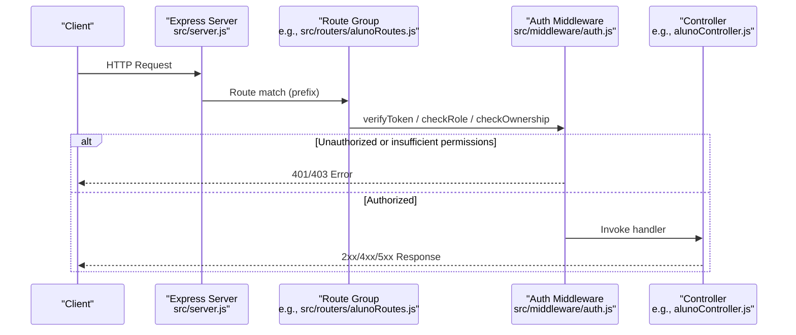
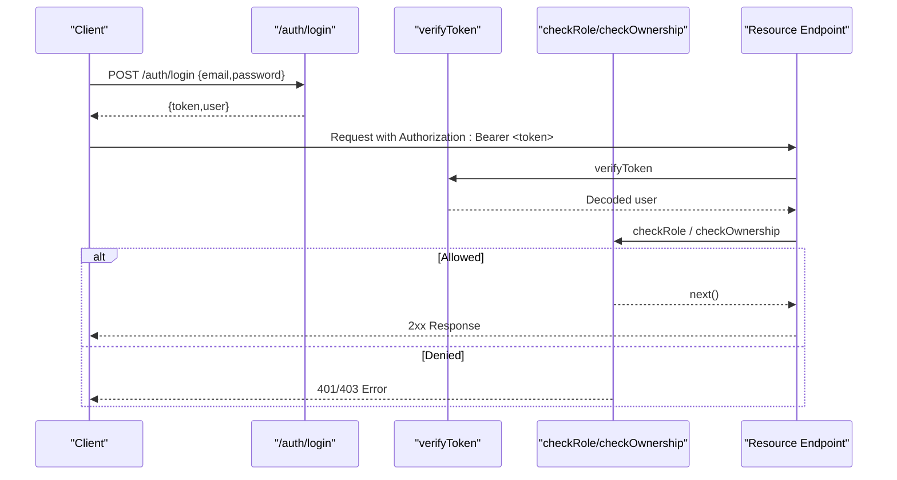
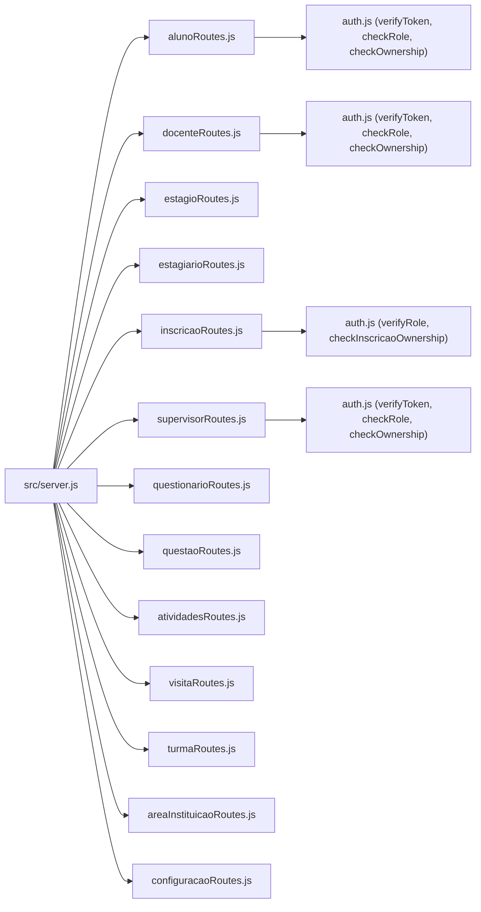

# API Reference

<cite>
**Referenced Files in This Document**
- [src/server.js](file://src/server.js)
- [src/middleware/auth.js](file://src/middleware/auth.js)
- [AUTH_GUIDE.md](file://AUTH_GUIDE.md)
- [README.md](file://README.md)
- [src/routers/authRoutes.js](file://src/routers/authRoutes.js)
- [src/routers/alunoRoutes.js](file://src/routers/alunoRoutes.js)
- [src/routers/docenteRoutes.js](file://src/routers/docenteRoutes.js)
- [src/routers/estagioRoutes.js](file://src/routers/estagioRoutes.js)
- [src/routers/estagiarioRoutes.js](file://src/routers/estagiarioRoutes.js)
- [src/routers/inscricaoRoutes.js](file://src/routers/inscricaoRoutes.js)
- [src/routers/supervisorRoutes.js](file://src/routers/supervisorRoutes.js)
- [src/routers/questionarioRoutes.js](file://src/routers/questionarioRoutes.js)
- [src/routers/questaoRoutes.js](file://src/routers/questaoRoutes.js)
- [src/routers/atividadesRoutes.js](file://src/routers/atividadesRoutes.js)
- [src/routers/visitaRoutes.js](file://src/routers/visitaRoutes.js)
- [src/routers/turmaRoutes.js](file://src/routers/turmaRoutes.js)
- [src/routers/areaInstituicaoRoutes.js](file://src/routers/areaInstituicaoRoutes.js)
- [src/routers/configuracaoRoutes.js](file://src/routers/configuracaoRoutes.js)
</cite>

## Table of Contents
1. [Introduction](#introduction)
2. [Project Structure](#project-structure)
3. [Core Components](#core-components)
4. [Architecture Overview](#architecture-overview)
5. [Detailed Component Analysis](#detailed-component-analysis)
6. [Dependency Analysis](#dependency-analysis)
7. [Performance Considerations](#performance-considerations)
8. [Troubleshooting Guide](#troubleshooting-guide)
9. [Conclusion](#conclusion)
10. [Appendices](#appendices)

## Introduction
This document provides a comprehensive API reference for the NodeMural RESTful backend. It catalogs all endpoints, their HTTP methods, URL patterns, request/response characteristics, authentication and authorization requirements, nested and relationship endpoints, and error handling patterns. It also includes practical usage examples, integration guidelines, and notes on rate limiting and CORS considerations.

## Project Structure
The server registers route groups under top-level prefixes and exposes several nested routes for relationships. Middleware enforces JWT-based authentication and role-based access control.

```mermaid
graph TB
Server["src/server.js<br/>Express app"] --> AuthRoutes["/auth<br/>src/routers/authRoutes.js"]
Server --> AlunoRoutes["/alunos<br/>src/routers/alunoRoutes.js"]
Server --> DocenteRoutes["/docentes<br/>src/routers/docenteRoutes.js"]
Server --> EstagioRoutes["/estagios<br/>src/routers/estagioRoutes.js"]
Server --> EstagiarioRoutes["/estagiarios<br/>src/routers/estagiarioRoutes.js"]
Server --> MuralRoutes["/mural<br/>(not registered in server.js)"]
Server --> InscricaoRoutes["/inscricoes<br/>src/routers/inscricaoRoutes.js"]
Server --> SupervisorRoutes["/supervisores<br/>src/routers/supervisorRoutes.js"]
Server --> QuestionarioRoutes["/questionarios<br/>src/routers/questionarioRoutes.js"]
Server --> QuestaoRoutes["/questoes<br/>src/routers/questaoRoutes.js"]
Server --> AtividadesRoutes["/atividades<br/>src/routers/atividadesRoutes.js"]
Server --> VisitaRoutes["/visitas<br/>src/routers/visitaRoutes.js"]
Server --> TurmaRoutes["/turmas<br/>src/routers/turmaRoutes.js"]
Server --> AreaInstituicaoRoutes["/areainstituicoes<br/>src/routers/areaInstituicaoRoutes.js"]
Server --> ConfiguracaoRoutes["/configuracoes<br/>src/routers/configuracaoRoutes.js"]
Server --> RespostaRoutes["/respostas<br/>(not registered in server.js)"]
Server --> Nested["Nested Routes"]
Nested --> NestSup["/supervisores/:id/estagiarios"]
Nested --> NestProf["/docentes/:id/estagiarios"]
Nested --> NestAluno["/alunos/:id/estagiarios"]
Nested --> NestMural["/mural/:id/inscricoes"]
Nested --> NestAluno2["/alunos/:id/inscricoes"]
```

**Diagram sources**
- [src/server.js](file://src/server.js#L37-L64)
- [src/routers/authRoutes.js](file://src/routers/authRoutes.js#L1-L20)
- [src/routers/alunoRoutes.js](file://src/routers/alunoRoutes.js#L1-L25)
- [src/routers/docenteRoutes.js](file://src/routers/docenteRoutes.js#L1-L20)
- [src/routers/estagioRoutes.js](file://src/routers/estagioRoutes.js#L1-L20)
- [src/routers/estagiarioRoutes.js](file://src/routers/estagiarioRoutes.js#L1-L21)
- [src/routers/inscricaoRoutes.js](file://src/routers/inscricaoRoutes.js#L1-L21)
- [src/routers/supervisorRoutes.js](file://src/routers/supervisorRoutes.js#L1-L27)
- [src/routers/questionarioRoutes.js](file://src/routers/questionarioRoutes.js#L1-L16)
- [src/routers/questaoRoutes.js](file://src/routers/questaoRoutes.js#L1-L17)
- [src/routers/atividadesRoutes.js](file://src/routers/atividadesRoutes.js#L1-L20)
- [src/routers/visitaRoutes.js](file://src/routers/visitaRoutes.js#L1-L18)
- [src/routers/turmaRoutes.js](file://src/routers/turmaRoutes.js#L1-L18)
- [src/routers/areaInstituicaoRoutes.js](file://src/routers/areaInstituicaoRoutes.js#L1-L13)
- [src/routers/configuracaoRoutes.js](file://src/routers/configuracaoRoutes.js#L1-L18)

**Section sources**
- [src/server.js](file://src/server.js#L31-L73)

## Core Components
- Authentication and Authorization
  - JWT-based authentication via Authorization header with Bearer scheme.
  - Role-based access control (RBAC) supports roles: admin, supervisor, docente, aluno.
  - Ownership checks restrict access to personal records for specific roles.
- Request Body Parsing
  - JSON body parsing enabled globally and per-route where applicable.
- Nested Routes
  - Relationship endpoints for supervisors, professors, students, and mural posts.

Key behaviors:
- Protected endpoints require a valid, non-expired JWT.
- Admin role grants broad access; other roles may be restricted by ownership or role middleware.
- Some endpoints enforce ownership checks for specific resources.

**Section sources**
- [src/middleware/auth.js](file://src/middleware/auth.js#L6-L29)
- [src/middleware/auth.js](file://src/middleware/auth.js#L32-L48)
- [src/middleware/auth.js](file://src/middleware/auth.js#L77-L98)
- [src/middleware/auth.js](file://src/middleware/auth.js#L100-L136)
- [AUTH_GUIDE.md](file://AUTH_GUIDE.md#L289-L300)
- [src/server.js](file://src/server.js#L34-L35)

## Architecture Overview
The API follows a layered architecture:
- Express server initializes middleware and mounts route groups.
- Each route group delegates to a controller function.
- Controllers interact with models and database abstractions.
- Authentication middleware validates tokens and enforces roles.

**Diagram sources**
- [src/server.js](file://src/server.js#L37-L53)
- [src/routers/alunoRoutes.js](file://src/routers/alunoRoutes.js#L1-L25)
- [src/middleware/auth.js](file://src/middleware/auth.js#L6-L29)
- [src/middleware/auth.js](file://src/middleware/auth.js#L32-L48)
- [src/middleware/auth.js](file://src/middleware/auth.js#L77-L98)

## Detailed Component Analysis

### Authentication Endpoints
- Base Path: /auth
- Methods and Paths
  - POST /auth/register
    - Description: Registers a new user account.
    - Auth: Not authenticated.
    - Request: JSON payload with email, password, passwordConfirm, nome, role (optional).
    - Response: Created user object with id, email, nome, role.
    - Errors: 400 validation errors, 500 server error.
  - POST /auth/login
    - Description: Authenticates user and returns JWT.
    - Auth: Not authenticated.
    - Request: JSON with email and password.
    - Response: Success message, token, and user profile.
    - Errors: 401 invalid credentials, 500 server error.
  - GET /auth/me
    - Description: Returns decoded user info from token.
    - Auth: Requires Bearer token.
    - Response: { user: { id, email, nome, role, iat, exp } }.
    - Errors: 401 missing/expired/invalid token.
  - GET /auth/profile
    - Description: Retrieves authenticated user profile.
    - Auth: Requires Bearer token.
    - Response: User profile fields including ativo and criado_em.
    - Errors: 401 unauthorized, 403 forbidden, 500 server error.
  - GET /auth/users
    - Description: Lists all users (admin only).
    - Auth: Requires Bearer token; admin role.
    - Response: Array of users.
    - Errors: 401/403, 500 server error.

Security Notes:
- Use HTTPS in production.
- Store JWT securely on the client (e.g., HttpOnly cookies if using sessions).
- Rotate JWT_SECRET in production.

**Section sources**
- [src/routers/authRoutes.js](file://src/routers/authRoutes.js#L8-L18)
- [AUTH_GUIDE.md](file://AUTH_GUIDE.md#L66-L161)
- [AUTH_GUIDE.md](file://AUTH_GUIDE.md#L194-L202)
- [AUTH_GUIDE.md](file://AUTH_GUIDE.md#L289-L300)

### Students (alunos)
- Base Path: /alunos
- Methods and Paths
  - GET /alunos
    - Description: List all alunos (authenticated).
    - Auth: Bearer token; admin or docente.
    - Response: Array of alunos.
    - Errors: 401/403, 500 server error.
  - GET /alunos/:id
    - Description: Retrieve aluno by numeric ID.
    - Auth: Not authenticated.
    - Response: Single aluno object.
    - Errors: 404 if not found, 500 server error.
  - GET /alunos/registro/:registro
    - Description: Retrieve aluno by registro (string).
    - Auth: Not authenticated.
    - Response: Single aluno object.
    - Errors: 404 if not found, 500 server error.
  - GET /alunos/:id/estagiarios
    - Description: Get estagiarios linked to aluno (authenticated).
    - Auth: Bearer token; admin or docente.
    - Response: Array of estagiarios.
    - Errors: 401/403, 500 server error.
  - GET /alunos/:id/inscricoes
    - Description: Get inscricoes for aluno (authenticated).
    - Auth: Bearer token; admin or aluno.
    - Response: Array of inscricoes.
    - Errors: 401/403, 500 server error.
  - POST /alunos
    - Description: Create aluno (admin or aluno).
    - Auth: Bearer token; admin or aluno (ownership).
    - Request: JSON alumno data.
    - Response: Created aluno object.
    - Errors: 400 validation, 401/403, 500 server error.
  - PUT /alunos/:id
    - Description: Update aluno (admin or aluno; ownership required).
    - Auth: Bearer token; admin or aluno (ownership).
    - Request: JSON alumno data.
    - Response: Updated aluno object.
    - Errors: 400 validation, 401/403, 404 not found, 500 server error.
  - DELETE /alunos/:id
    - Description: Delete aluno (admin only).
    - Auth: Bearer token; admin.
    - Response: Deletion result.
    - Errors: 401/403, 404 not found, 500 server error.

Nested Routes
- /alunos/:id/estagiarios → [src/server.js](file://src/server.js#L60)

**Section sources**
- [src/routers/alunoRoutes.js](file://src/routers/alunoRoutes.js#L11-L24)
- [src/server.js](file://src/server.js#L60)

### Teachers (docentes)
- Base Path: /docentes
- Methods and Paths
  - GET /docentes
    - Description: List all docentes (admin or docente).
    - Auth: Bearer token; admin or docente.
    - Response: Array of docentes.
    - Errors: 401/403, 500 server error.
  - GET /docentes/:id
    - Description: Retrieve docente by ID (admin or docente; ownership).
    - Auth: Bearer token; admin or docente (ownership).
    - Response: Single docente object.
    - Errors: 401/403, 404 not found, 500 server error.
  - GET /docentes/:id/estagiarios
    - Description: Get estagiarios linked to docente (admin or docente; ownership).
    - Auth: Bearer token; admin or docente (ownership).
    - Response: Array of estagiarios.
    - Errors: 401/403, 500 server error.
  - POST /docentes
    - Description: Create docente (admin only).
    - Auth: Bearer token; admin.
    - Request: JSON docente data.
    - Response: Created docente object.
    - Errors: 400 validation, 401/403, 500 server error.
  - PUT /docentes/:id
    - Description: Update docente (admin or docente; ownership).
    - Auth: Bearer token; admin or docente (ownership).
    - Request: JSON docente data.
    - Response: Updated docente object.
    - Errors: 400 validation, 401/403, 404 not found, 500 server error.
  - DELETE /docentes/:id
    - Description: Delete docente (admin only).
    - Auth: Bearer token; admin.
    - Response: Deletion result.
    - Errors: 401/403, 404 not found, 500 server error.

Nested Routes
- /docentes/:id/estagiarios → [src/server.js](file://src/server.js#L58)

**Section sources**
- [src/routers/docenteRoutes.js](file://src/routers/docenteRoutes.js#L11-L17)
- [src/server.js](file://src/server.js#L58)

### Internships (estagios)
- Base Path: /estagios
- Methods and Paths
  - POST /estagios
    - Description: Create estagio.
    - Auth: Not authenticated.
    - Request: JSON estagio data.
    - Response: Created estagio object.
    - Errors: 400 validation, 500 server error.
  - GET /estagios
    - Description: List all estagios.
    - Auth: Not authenticated.
    - Response: Array of estagios.
    - Errors: 500 server error.
  - GET /estagios/:id
    - Description: Retrieve estagio by ID.
    - Auth: Not authenticated.
    - Response: Single estagio object.
    - Errors: 404 not found, 500 server error.
  - GET /estagios/:id/supervisores
    - Description: Get supervisores linked to estagio.
    - Auth: Not authenticated.
    - Response: Array of supervisores.
    - Errors: 500 server error.
  - GET /estagios/:id/mural
    - Description: Get mural entries linked to estagio.
    - Auth: Not authenticated.
    - Response: Array of mural entries.
    - Errors: 500 server error.
  - PUT /estagios/:id
    - Description: Update estagio.
    - Auth: Not authenticated.
    - Request: JSON estagio data.
    - Response: Updated estagio object.
    - Errors: 400 validation, 404 not found, 500 server error.
  - DELETE /estagios/:id
    - Description: Delete estagio.
    - Auth: Not authenticated.
    - Response: Deletion result.
    - Errors: 404 not found, 500 server error.

Nested Routes
- /estagios/:id/estagiarios → [src/server.js](file://src/server.js#L59)

**Section sources**
- [src/routers/estagioRoutes.js](file://src/routers/estagioRoutes.js#L10-L17)
- [src/server.js](file://src/server.js#L59)

### Interns (estagiarios)
- Base Path: /estagiarios
- Methods and Paths
  - GET /estagiarios/periodos
    - Description: Get distinct periods.
    - Auth: Not authenticated.
    - Response: Array of period strings.
    - Errors: 500 server error.
  - POST /estagiarios
    - Description: Create estagiario.
    - Auth: Not authenticated.
    - Request: JSON estagiario data.
    - Response: Created estagiario object.
    - Errors: 400 validation, 500 server error.
  - GET /estagiarios
    - Description: List all estagiarios.
    - Auth: Not authenticated.
    - Response: Array of estagiarios.
    - Errors: 500 server error.
  - GET /estagiarios/aluno/:id
    - Description: Get estagiarios by aluno ID.
    - Auth: Not authenticated.
    - Response: Array of estagiarios.
    - Errors: 500 server error.
  - GET /estagiarios/:id
    - Description: Retrieve estagiario by ID.
    - Auth: Not authenticated.
    - Response: Single estagiario object.
    - Errors: 404 not found, 500 server error.
  - GET /estagiarios/:id/next-nivel
    - Description: Get next level for estagiario.
    - Auth: Not authenticated.
    - Response: Level information.
    - Errors: 404 not found, 500 server error.
  - PUT /estagiarios/:id
    - Description: Update estagiario.
    - Auth: Not authenticated.
    - Request: JSON estagiario data.
    - Response: Updated estagiario object.
    - Errors: 400 validation, 404 not found, 500 server error.
  - DELETE /estagiarios/:id
    - Description: Delete estagiario.
    - Auth: Not authenticated.
    - Response: Deletion result.
    - Errors: 404 not found, 500 server error.

**Section sources**
- [src/routers/estagiarioRoutes.js](file://src/routers/estagiarioRoutes.js#L10-L18)

### Enrollments (inscricoes)
- Base Path: /inscricoes
- Methods and Paths
  - GET /inscricoes/periodos
    - Description: Get distinct periods.
    - Auth: Bearer token; admin or aluno.
    - Response: Array of period strings.
    - Errors: 401/403, 500 server error.
  - POST /inscricoes
    - Description: Create inscricao (admin or aluno).
    - Auth: Bearer token; admin or aluno.
    - Request: JSON inscricao data.
    - Response: Created inscricao object.
    - Errors: 400 validation, 401/403, 500 server error.
  - GET /inscricoes
    - Description: List all inscricoes (admin or aluno).
    - Auth: Bearer token; admin or aluno.
    - Response: Array of inscricoes.
    - Errors: 401/403, 500 server error.
  - GET /inscricoes/:aluno_id/:muralestagio_id
    - Description: Get inscricao by aluno and mural IDs (admin only).
    - Auth: Bearer token; admin.
    - Response: Single inscricao object.
    - Errors: 401/403, 404 not found, 500 server error.
  - GET /inscricoes/:id
    - Description: Get inscricao by ID (admin or aluno; ownership enforced).
    - Auth: Bearer token; admin or aluno; ownership enforced.
    - Response: Single inscricao object.
    - Errors: 401/403, 404 not found, 500 server error.
  - PUT /inscricoes/:id
    - Description: Update inscricao (admin only).
    - Auth: Bearer token; admin.
    - Request: JSON inscricao data.
    - Response: Updated inscricao object.
    - Errors: 400 validation, 401/403, 404 not found, 500 server error.
  - DELETE /inscricoes/:id
    - Description: Delete inscricao (admin or aluno; ownership enforced).
    - Auth: Bearer token; admin or aluno; ownership enforced.
    - Response: Deletion result.
    - Errors: 401/403, 404 not found, 500 server error.

Nested Routes
- /mural/:id/inscricoes → [src/server.js](file://src/server.js#L63)
- /alunos/:id/inscricoes → [src/server.js](file://src/server.js#L64)

**Section sources**
- [src/routers/inscricaoRoutes.js](file://src/routers/inscricaoRoutes.js#L11-L18)
- [src/server.js](file://src/server.js#L62-L64)

### Supervisors (supervisores)
- Base Path: /supervisores
- Methods and Paths
  - GET /supervisores
    - Description: List all supervisores (authenticated).
    - Auth: Bearer token; admin or supervisor.
    - Response: Array of supervisores.
    - Errors: 401/403, 500 server error.
  - GET /supervisores/:id
    - Description: Retrieve supervisor by ID (admin or supervisor; ownership).
    - Auth: Bearer token; admin or supervisor (ownership).
    - Response: Single supervisor object.
    - Errors: 401/403, 404 not found, 500 server error.
  - PUT /supervisores/:id
    - Description: Update supervisor (admin or supervisor; ownership).
    - Auth: Bearer token; admin or supervisor (ownership).
    - Request: JSON supervisor data.
    - Response: Updated supervisor object.
    - Errors: 400 validation, 401/403, 404 not found, 500 server error.
  - GET /supervisores/:id/instituicoes
    - Description: Get instituicoes linked to supervisor (admin or supervisor; ownership).
    - Auth: Bearer token; admin or supervisor (ownership).
    - Response: Array of instituicoes.
    - Errors: 401/403, 500 server error.
  - POST /supervisores/:id/instituicoes
    - Description: Add instituicao to supervisor (admin or supervisor; ownership).
    - Auth: Bearer token; admin or supervisor (ownership).
    - Request: JSON institution data.
    - Response: Updated list or confirmation.
    - Errors: 400 validation, 401/403, 500 server error.
  - DELETE /supervisores/:id/instituicoes/:instituicaoId
    - Description: Remove instituicao from supervisor (admin or supervisor; ownership).
    - Auth: Bearer token; admin or supervisor (ownership).
    - Response: Deletion result.
    - Errors: 401/403, 404 not found, 500 server error.
  - POST /supervisores
    - Description: Create supervisor (admin only).
    - Auth: Bearer token; admin.
    - Request: JSON supervisor data.
    - Response: Created supervisor object.
    - Errors: 400 validation, 401/403, 500 server error.
  - DELETE /supervisores/:id
    - Description: Delete supervisor (admin only).
    - Auth: Bearer token; admin.
    - Response: Deletion result.
    - Errors: 401/403, 404 not found, 500 server error.

Nested Routes
- /supervisores/:id/estagiarios → [src/server.js](file://src/server.js#L57)

**Section sources**
- [src/routers/supervisorRoutes.js](file://src/routers/supervisorRoutes.js#L12-L24)
- [src/server.js](file://src/server.js#L57)

### Questionnaires (questionarios)
- Base Path: /questionarios
- Methods and Paths
  - POST /questionarios
    - Description: Create questionario.
    - Auth: Not authenticated.
    - Request: JSON questionario data.
    - Response: Created questionario object.
    - Errors: 400 validation, 500 server error.
  - GET /questionarios
    - Description: List all questionarios.
    - Auth: Not authenticated.
    - Response: Array of questionarios.
    - Errors: 500 server error.
  - GET /questionarios/:id
    - Description: Retrieve questionario by ID.
    - Auth: Not authenticated.
    - Response: Single questionario object.
    - Errors: 404 not found, 500 server error.
  - PUT /questionarios/:id
    - Description: Update questionario.
    - Auth: Not authenticated.
    - Request: JSON questionario data.
    - Response: Updated questionario object.
    - Errors: 400 validation, 404 not found, 500 server error.
  - DELETE /questionarios/:id
    - Description: Delete questionario.
    - Auth: Not authenticated.
    - Response: Deletion result.
    - Errors: 404 not found, 500 server error.

**Section sources**
- [src/routers/questionarioRoutes.js](file://src/routers/questionarioRoutes.js#L9-L14)

### Questions (questoes)
- Base Path: /questoes
- Methods and Paths
  - POST /questoes
    - Description: Create questao.
    - Auth: Not authenticated.
    - Request: JSON questao data.
    - Response: Created questao object.
    - Errors: 400 validation, 500 server error.
  - GET /questoes
    - Description: List all questoes.
    - Auth: Not authenticated.
    - Response: Array of questoes.
    - Errors: 500 server error.
  - GET /questoes/:id
    - Description: Retrieve questao by ID.
    - Auth: Not authenticated.
    - Response: Single questao object.
    - Errors: 404 not found, 500 server error.
  - PUT /questoes/:id
    - Description: Update questao.
    - Auth: Not authenticated.
    - Request: JSON questao data.
    - Response: Updated questao object.
    - Errors: 400 validation, 404 not found, 500 server error.
  - DELETE /questoes/:id
    - Description: Delete questao.
    - Auth: Not authenticated.
    - Response: Deletion result.
    - Errors: 404 not found, 500 server error.

**Section sources**
- [src/routers/questaoRoutes.js](file://src/routers/questaoRoutes.js#L10-L15)

### Activities (atividades)
- Base Path: /atividades
- Methods and Paths
  - GET /atividades
    - Description: List all atividades.
    - Auth: Not authenticated.
    - Response: Array of atividades.
    - Errors: 500 server error.
  - GET /atividades/:id
    - Description: Retrieve atividade by ID.
    - Auth: Not authenticated.
    - Response: Single atividade object.
    - Errors: 404 not found, 500 server error.
  - POST /atividades
    - Description: Create atividade.
    - Auth: Not authenticated.
    - Request: JSON atividade data.
    - Response: Created atividade object.
    - Errors: 400 validation, 500 server error.
  - POST /atividades/:estagiario_id
    - Description: Create atividade for estagiario.
    - Auth: Not authenticated.
    - Request: JSON atividade data.
    - Response: Created atividade object.
    - Errors: 400 validation, 500 server error.
  - PUT /atividades/:id
    - Description: Update atividade.
    - Auth: Not authenticated.
    - Request: JSON atividade data.
    - Response: Updated atividade object.
    - Errors: 400 validation, 404 not found, 500 server error.
  - DELETE /atividades/:id
    - Description: Delete atividade.
    - Auth: Not authenticated.
    - Response: Deletion result.
    - Errors: 404 not found, 500 server error.

**Section sources**
- [src/routers/atividadesRoutes.js](file://src/routers/atividadesRoutes.js#L10-L17)

### Visits (visitas)
- Base Path: /visitas
- Methods and Paths
  - GET /visitas
    - Description: List all visitas.
    - Auth: Not authenticated.
    - Response: Array of visitas.
    - Errors: 500 server error.
  - GET /visitas/:id
    - Description: Retrieve visita by ID.
    - Auth: Not authenticated.
    - Response: Single visita object.
    - Errors: 404 not found, 500 server error.
  - POST /visitas
    - Description: Create visita.
    - Auth: Not authenticated.
    - Request: JSON visita data.
    - Response: Created visita object.
    - Errors: 400 validation, 500 server error.
  - PUT /visitas/:id
    - Description: Update visita.
    - Auth: Not authenticated.
    - Request: JSON visita data.
    - Response: Updated visita object.
    - Errors: 400 validation, 404 not found, 500 server error.
  - DELETE /visitas/:id
    - Description: Delete visita.
    - Auth: Not authenticated.
    - Response: Deletion result.
    - Errors: 404 not found, 500 server error.

**Section sources**
- [src/routers/visitaRoutes.js](file://src/routers/visitaRoutes.js#L10-L15)

### Classes (turmas)
- Base Path: /turmas
- Methods and Paths
  - GET /turmas
    - Description: List all turmas.
    - Auth: Not authenticated.
    - Response: Array of turmas.
    - Errors: 500 server error.
  - GET /turmas/:id
    - Description: Retrieve turma by ID.
    - Auth: Not authenticated.
    - Response: Single turma object.
    - Errors: 404 not found, 500 server error.
  - POST /turmas
    - Description: Create turma.
    - Auth: Not authenticated.
    - Request: JSON turma data.
    - Response: Created turma object.
    - Errors: 400 validation, 500 server error.
  - PUT /turmas/:id
    - Description: Update turma.
    - Auth: Not authenticated.
    - Request: JSON turma data.
    - Response: Updated turma object.
    - Errors: 400 validation, 404 not found, 500 server error.
  - DELETE /turmas/:id
    - Description: Delete turma.
    - Auth: Not authenticated.
    - Response: Deletion result.
    - Errors: 404 not found, 500 server error.

**Section sources**
- [src/routers/turmaRoutes.js](file://src/routers/turmaRoutes.js#L10-L15)

### Areas of Institutions (areainstituicoes)
- Base Path: /areainstituicoes
- Methods and Paths
  - GET /areainstituicoes
    - Description: List all areas.
    - Auth: Not authenticated.
    - Response: Array of areas.
    - Errors: 500 server error.
  - GET /areainstituicoes/:id
    - Description: Retrieve area by ID.
    - Auth: Not authenticated.
    - Response: Single area object.
    - Errors: 404 not found, 500 server error.
  - POST /areainstituicoes
    - Description: Create area.
    - Auth: Not authenticated.
    - Request: JSON area data.
    - Response: Created area object.
    - Errors: 400 validation, 500 server error.
  - PUT /areainstituicoes/:id
    - Description: Update area.
    - Auth: Not authenticated.
    - Request: JSON area data.
    - Response: Updated area object.
    - Errors: 400 validation, 404 not found, 500 server error.
  - DELETE /areainstituicoes/:id
    - Description: Delete area.
    - Auth: Not authenticated.
    - Response: Deletion result.
    - Errors: 404 not found, 500 server error.

**Section sources**
- [src/routers/areaInstituicaoRoutes.js](file://src/routers/areaInstituicaoRoutes.js#L6-L10)

### Settings (configuracoes)
- Base Path: /configuracoes
- Methods and Paths
  - GET /configuracoes
    - Description: List all configuracoes (authenticated).
    - Auth: Bearer token.
    - Response: Array of configuracoes.
    - Errors: 401 unauthorized, 500 server error.
  - GET /configuracoes/:id
    - Description: Retrieve configuracao by ID (authenticated).
    - Auth: Bearer token.
    - Response: Single configuracao object.
    - Errors: 401 unauthorized, 404 not found, 500 server error.
  - PUT /configuracoes/:id
    - Description: Update configuracao (authenticated).
    - Auth: Bearer token.
    - Request: JSON configuracao data.
    - Response: Updated configuracao object.
    - Errors: 400 validation, 401 unauthorized, 404 not found, 500 server error.

Note: The configuracao routes do not currently apply role middleware in the route definition; ensure appropriate protection in production.

**Section sources**
- [src/routers/configuracaoRoutes.js](file://src/routers/configuracaoRoutes.js#L11-L16)

### Responses, Errors, and Status Codes
Common patterns:
- Successful responses return 200 with the resource object or array; creation returns 201.
- Validation failures return 400 with an error message.
- Missing/expired/invalid tokens return 401 with a specific message.
- Insufficient permissions return 403.
- Not found returns 404.
- Internal server errors return 500.

Examples of error messages:
- "Token não fornecido"
- "Token inválido"
- "Token expirado"
- "Acesso negado. Permissão insuficiente."
- "Acesso negado. Você só pode acessar ou editar seus próprios dados."

**Section sources**
- [AUTH_GUIDE.md](file://AUTH_GUIDE.md#L289-L300)
- [src/middleware/auth.js](file://src/middleware/auth.js#L10-L29)
- [src/middleware/auth.js](file://src/middleware/auth.js#L38-L47)
- [src/middleware/auth.js](file://src/middleware/auth.js#L95-L98)
- [src/middleware/auth.js](file://src/middleware/auth.js#L129-L131)

### Authentication and Authorization Flow

**Diagram sources**
- [src/routers/authRoutes.js](file://src/routers/authRoutes.js#L8-L14)
- [src/middleware/auth.js](file://src/middleware/auth.js#L6-L29)
- [src/middleware/auth.js](file://src/middleware/auth.js#L32-L48)
- [src/middleware/auth.js](file://src/middleware/auth.js#L77-L98)

## Dependency Analysis
- Route-to-Middleware Dependencies
  - Many routes depend on verifyToken and/or checkRole.
  - Ownership checks are applied selectively via checkOwnership and checkInscricaoOwnership.
- Route-to-Controller Dependencies
  - Each route group imports and invokes a controller module.
- Server-to-Route Dependencies
  - The server mounts route groups under their respective prefixes and registers nested routes.

**Diagram sources**
- [src/server.js](file://src/server.js#L37-L53)
- [src/routers/alunoRoutes.js](file://src/routers/alunoRoutes.js#L4)
- [src/routers/docenteRoutes.js](file://src/routers/docenteRoutes.js#L5)
- [src/routers/supervisorRoutes.js](file://src/routers/supervisorRoutes.js#L5)
- [src/routers/inscricaoRoutes.js](file://src/routers/inscricaoRoutes.js#L4)
- [src/middleware/auth.js](file://src/middleware/auth.js#L6-L29)

**Section sources**
- [src/server.js](file://src/server.js#L37-L53)
- [src/routers/alunoRoutes.js](file://src/routers/alunoRoutes.js#L4)
- [src/routers/docenteRoutes.js](file://src/routers/docenteRoutes.js#L5)
- [src/routers/supervisorRoutes.js](file://src/routers/supervisorRoutes.js#L5)
- [src/routers/inscricaoRoutes.js](file://src/routers/inscricaoRoutes.js#L4)
- [src/middleware/auth.js](file://src/middleware/auth.js#L6-L29)

## Performance Considerations
- Rate Limiting
  - Implement rate limiting at the Express layer to prevent abuse of authentication and write endpoints.
  - Consider per-endpoint limits and IP-based quotas.
- CORS
  - Configure CORS for trusted origins and methods to avoid preflight overhead.
  - Restrict exposed headers and credentials appropriately.
- Database Pooling
  - Tune MariaDB pool size according to expected concurrency.
- Payload Size
  - Validate and limit JSON payload sizes to mitigate memory pressure.
- Caching
  - Cache read-heavy lists (e.g., questionarios, questoes) with appropriate invalidation.

[No sources needed since this section provides general guidance]

## Troubleshooting Guide
Common Issues and Fixes
- 401 Token Required
  - Ensure Authorization header is present and formatted as "Bearer <token>".
  - Regenerate token after expiration.
- 401 Invalid or Expired Token
  - Verify JWT_SECRET matches server configuration.
  - Confirm clock synchronization on client and server.
- 403 Access Denied
  - Confirm user role and ownership requirements for the endpoint.
  - Admin privileges override role restrictions.
- 404 Resource Not Found
  - Verify IDs and nested route parameters.
- 500 Internal Server Error
  - Check server logs and database connectivity.
  - Validate request payloads against model expectations.

**Section sources**
- [AUTH_GUIDE.md](file://AUTH_GUIDE.md#L289-L300)
- [src/middleware/auth.js](file://src/middleware/auth.js#L10-L29)
- [src/middleware/auth.js](file://src/middleware/auth.js#L38-L47)
- [src/middleware/auth.js](file://src/middleware/auth.js#L95-L98)

## Conclusion
This API reference documents all REST endpoints, their authentication and authorization requirements, nested routes, and error handling patterns. Apply the provided middleware consistently, secure tokens properly, and consider rate limiting and CORS for production readiness.

[No sources needed since this section summarizes without analyzing specific files]

## Appendices

### Practical Usage Examples
- Authentication
  - POST /auth/register with { email, password, passwordConfirm, nome, role? }
  - POST /auth/login with { email, password }
  - GET /auth/profile with Authorization: Bearer <token>
- CRUD Examples
  - POST /alunos with aluno data (admin or aluno)
  - GET /alunos/:id
  - PUT /alunos/:id (admin or aluno; ownership)
  - DELETE /alunos/:id (admin)
- Relationship Endpoints
  - GET /alunos/:id/inscricoes
  - GET /supervisores/:id/estagiarios
  - GET /mural/:id/inscricoes

[No sources needed since this section provides general guidance]

### Integration Guidelines
- Frontend
  - Persist JWT securely (avoid localStorage for sensitive APIs).
  - Attach Authorization header to all authenticated requests.
  - Handle token refresh or re-login on 401 responses.
- Backend
  - Centralize middleware usage in route definitions.
  - Log and monitor 401/403 occurrences for misuse detection.
  - Validate inputs and sanitize outputs.

[No sources needed since this section provides general guidance]