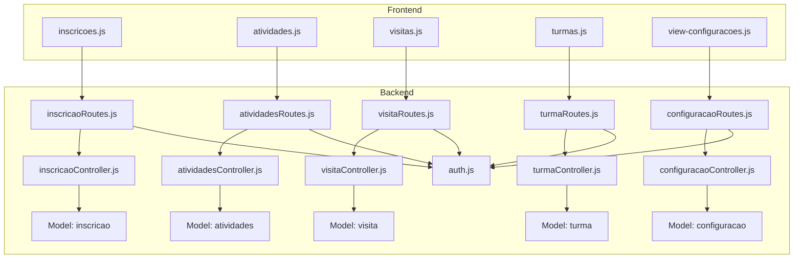
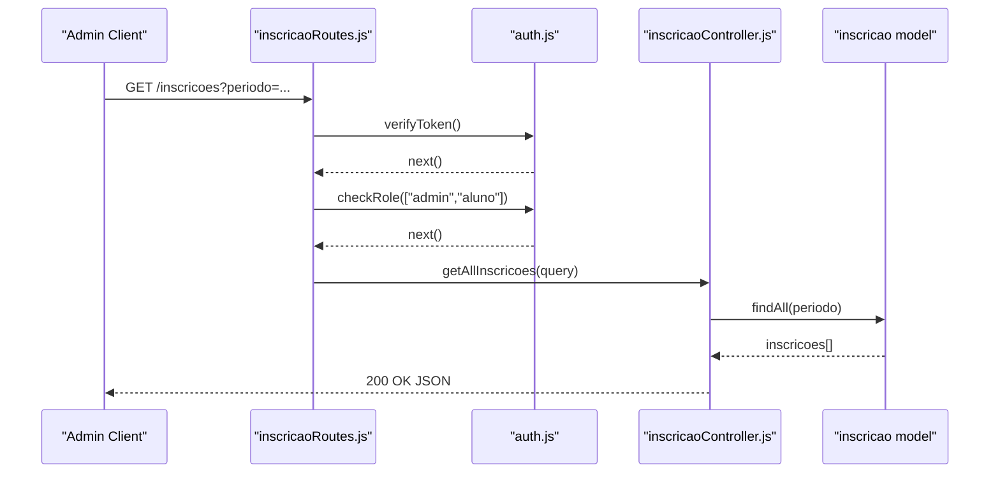
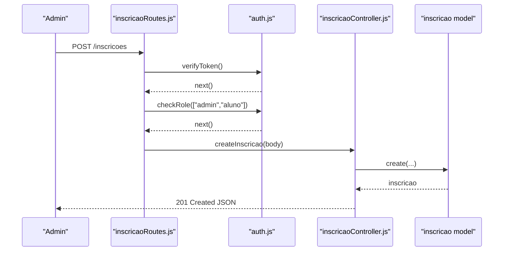
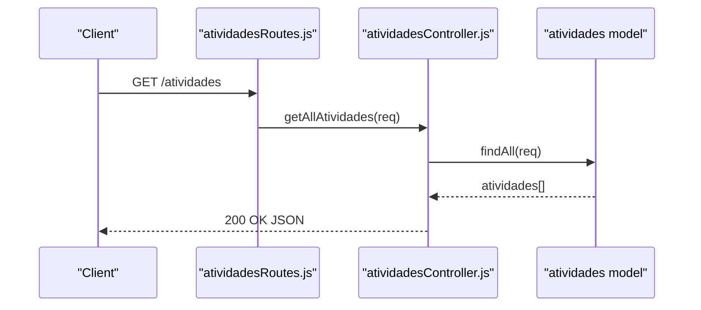
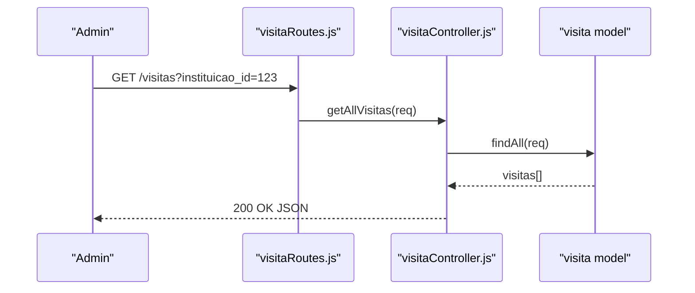
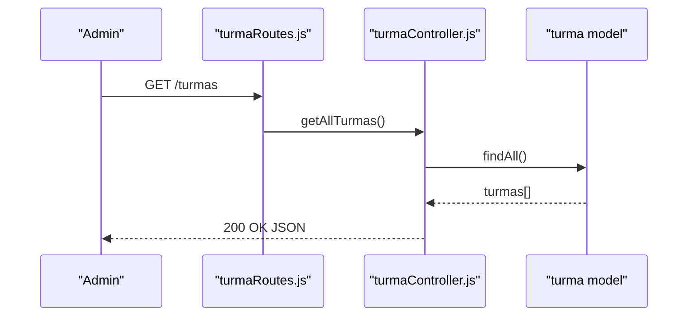
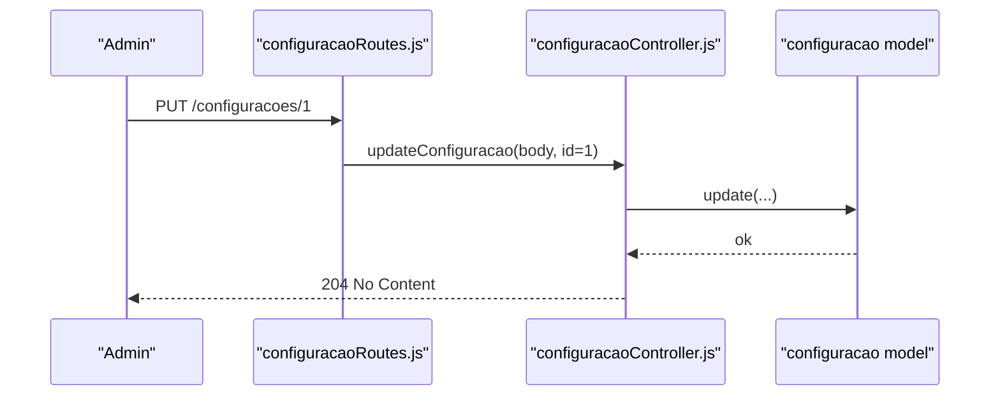
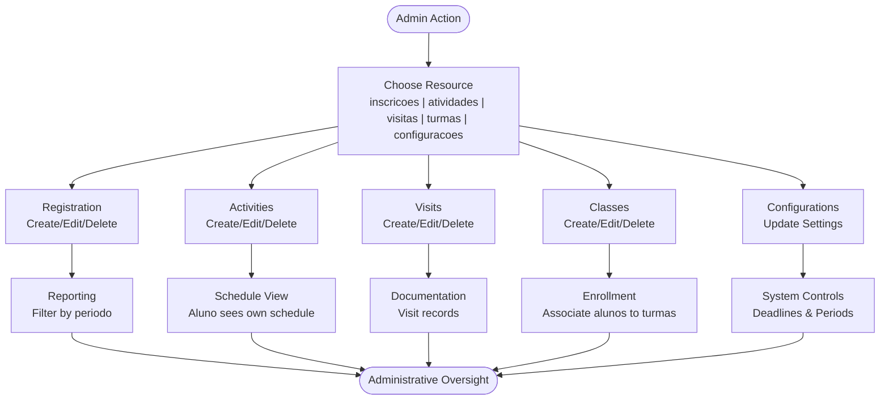
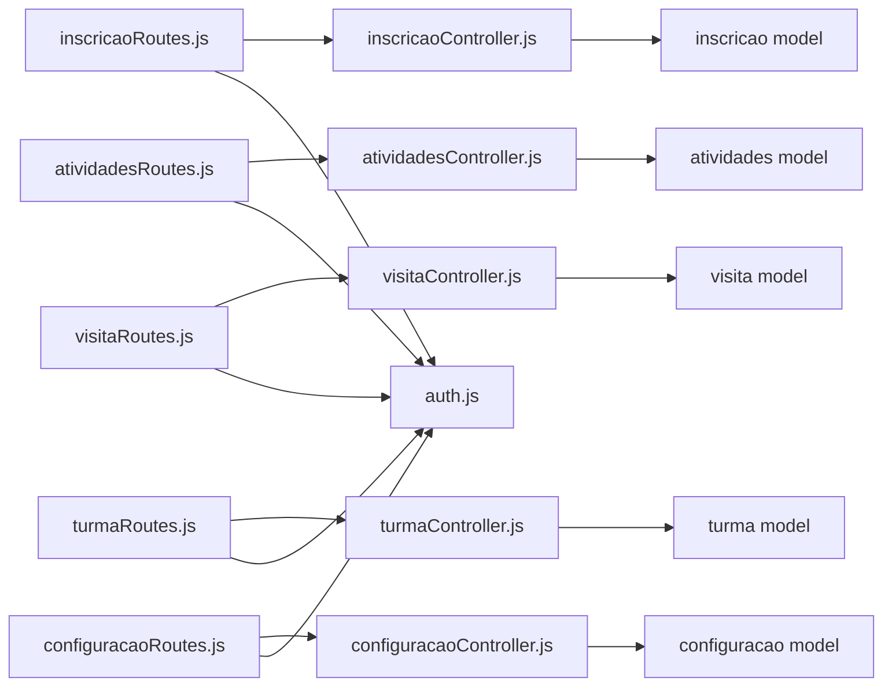

# Administrative APIs

<cite>
**Referenced Files in This Document**
- [src/controllers/inscricaoController.js](file://src/controllers/inscricaoController.js)
- [src/routers/inscricaoRoutes.js](file://src/routers/inscricaoRoutes.js)
- [src/controllers/atividadesController.js](file://src/controllers/atividadesController.js)
- [src/routers/atividadesRoutes.js](file://src/routers/atividadesRoutes.js)
- [src/controllers/visitaController.js](file://src/controllers/visitaController.js)
- [src/routers/visitaRoutes.js](file://src/routers/visitaRoutes.js)
- [src/controllers/turmaController.js](file://src/controllers/turmaController.js)
- [src/routers/turmaRoutes.js](file://src/routers/turmaRoutes.js)
- [src/controllers/configuracaoController.js](file://src/controllers/configuracaoController.js)
- [src/routers/configuracaoRoutes.js](file://src/routers/configuracaoRoutes.js)
- [src/middleware/auth.js](file://src/middleware/auth.js)
- [public/inscricoes.js](file://public/inscricoes.js)
- [public/atividades.js](file://public/atividades.js)
- [public/visitas.js](file://public/visitas.js)
- [public/turmas.js](file://public/turmas.js)
- [public/view-configuracoes.js](file://public/view-configuracoes.js)
</cite>

## Table of Contents
1. [Introduction](#introduction)
2. [Project Structure](#project-structure)
3. [Core Components](#core-components)
4. [Architecture Overview](#architecture-overview)
5. [Detailed Component Analysis](#detailed-component-analysis)
6. [Dependency Analysis](#dependency-analysis)
7. [Performance Considerations](#performance-considerations)
8. [Troubleshooting Guide](#troubleshooting-guide)
9. [Conclusion](#conclusion)
10. [Appendices](#appendices)

## Introduction
This document provides comprehensive API documentation for administrative management endpoints. It covers:
- Registration processing endpoints for student enrollment (inscricao)
- Activity scheduling and tracking endpoints (atividades)
- Visit coordination and documentation endpoints (visita)
- Class/course management endpoints (turma)
- System-wide configuration endpoints (configuracao)
- Workflow endpoints for approvals, scheduling, planning, and enrollment
It also details administrative approval processes, status tracking, notifications, and reporting capabilities for administrative oversight.

## Project Structure
The backend follows a layered architecture:
- Routers define HTTP endpoints and apply middleware
- Controllers implement request handling and orchestrate model operations
- Models encapsulate database interactions
- Middleware enforces authentication and authorization
- Frontend JavaScript pages consume the APIs via AJAX

**Diagram sources**
- [src/routers/inscricaoRoutes.js](file://src/routers/inscricaoRoutes.js#L1-L21)
- [src/routers/atividadesRoutes.js](file://src/routers/atividadesRoutes.js#L1-L20)
- [src/routers/visitaRoutes.js](file://src/routers/visitaRoutes.js#L1-L18)
- [src/routers/turmaRoutes.js](file://src/routers/turmaRoutes.js#L1-L18)
- [src/routers/configuracaoRoutes.js](file://src/routers/configuracaoRoutes.js#L1-L18)
- [src/controllers/inscricaoController.js](file://src/controllers/inscricaoController.js#L1-L114)
- [src/controllers/atividadesController.js](file://src/controllers/atividadesController.js#L1-L88)
- [src/controllers/visitaController.js](file://src/controllers/visitaController.js#L1-L67)
- [src/controllers/turmaController.js](file://src/controllers/turmaController.js#L1-L67)
- [src/controllers/configuracaoController.js](file://src/controllers/configuracaoController.js#L1-L43)
- [src/middleware/auth.js](file://src/middleware/auth.js#L1-L137)
- [public/inscricoes.js](file://public/inscricoes.js#L1-L100)
- [public/atividades.js](file://public/atividades.js#L1-L67)
- [public/visitas.js](file://public/visitas.js#L1-L59)
- [public/turmas.js](file://public/turmas.js#L1-L56)
- [public/view-configuracoes.js](file://public/view-configuracoes.js#L1-L81)

**Section sources**
- [src/routers/inscricaoRoutes.js](file://src/routers/inscricaoRoutes.js#L1-L21)
- [src/routers/atividadesRoutes.js](file://src/routers/atividadesRoutes.js#L1-L20)
- [src/routers/visitaRoutes.js](file://src/routers/visitaRoutes.js#L1-L18)
- [src/routers/turmaRoutes.js](file://src/routers/turmaRoutes.js#L1-L18)
- [src/routers/configuracaoRoutes.js](file://src/routers/configuracaoRoutes.js#L1-L18)
- [src/middleware/auth.js](file://src/middleware/auth.js#L1-L137)

## Core Components
- Authentication and Authorization Middleware
  - Token verification and role checks
  - Ownership checks for inscricao records
- Controllers
  - CRUD handlers for inscricao, atividades, visita, turma, and configuracao
- Routers
  - Endpoint definitions with middleware application
- Frontend Consumers
  - DataTable-driven pages that call backend endpoints

Key roles and permissions:
- admin: full access to administrative endpoints
- aluno: read/write access to own inscricoes and atividades; restricted access to other resources

**Section sources**
- [src/middleware/auth.js](file://src/middleware/auth.js#L6-L29)
- [src/middleware/auth.js](file://src/middleware/auth.js#L31-L48)
- [src/middleware/auth.js](file://src/middleware/auth.js#L100-L136)
- [src/controllers/inscricaoController.js](file://src/controllers/inscricaoController.js#L5-L14)
- [src/controllers/atividadesController.js](file://src/controllers/atividadesController.js#L4-L13)
- [src/controllers/visitaController.js](file://src/controllers/visitaController.js#L4-L13)
- [src/controllers/turmaController.js](file://src/controllers/turmaController.js#L4-L14)
- [src/controllers/configuracaoController.js](file://src/controllers/configuracaoController.js#L4-L13)

## Architecture Overview
The system enforces JWT-based authentication and role-based access control. Routes are grouped by domain resource and mapped to controllers. Controllers delegate to models for persistence and return standardized HTTP responses.

**Diagram sources**
- [src/routers/inscricaoRoutes.js](file://src/routers/inscricaoRoutes.js#L12-L18)
- [src/middleware/auth.js](file://src/middleware/auth.js#L6-L29)
- [src/middleware/auth.js](file://src/middleware/auth.js#L31-L48)
- [src/controllers/inscricaoController.js](file://src/controllers/inscricaoController.js#L5-L14)

## Detailed Component Analysis

### Inscrição (Student Registration)
Endpoints for managing student registrations:
- GET /inscricoes
  - Query parameters: periodo (optional)
  - Returns list of inscricoes filtered by period
- GET /inscricoes/periodos
  - Returns distinct periods available for filtering
- GET /inscricoes/:id
  - Requires admin or aluno; aluno can access only their own inscricao
- GET /inscricoes/:aluno_id/:muralestagio_id
  - Admin-only endpoint to fetch inscricoes by aluno and mural
- POST /inscricoes
  - Creates a new inscricao; requires aluno or admin
- PUT /inscricoes/:id
  - Updates an existing inscricao; admin-only
- DELETE /inscricoes/:id
  - Deletes an inscricao; admin or aluno who owns the record

Processing logic highlights:
- Ownership enforcement ensures alunos can only manage their own inscricoes
- Duplicate enrollment errors are handled with explicit client messages
- Filtering by periodo supports administrative reporting and dashboards

**Diagram sources**
- [src/routers/inscricaoRoutes.js](file://src/routers/inscricaoRoutes.js#L13-L18)
- [src/middleware/auth.js](file://src/middleware/auth.js#L6-L29)
- [src/middleware/auth.js](file://src/middleware/auth.js#L31-L48)
- [src/controllers/inscricaoController.js](file://src/controllers/inscricaoController.js#L66-L79)

**Section sources**
- [src/routers/inscricaoRoutes.js](file://src/routers/inscricaoRoutes.js#L11-L18)
- [src/controllers/inscricaoController.js](file://src/controllers/inscricaoController.js#L5-L114)
- [src/middleware/auth.js](file://src/middleware/auth.js#L100-L136)
- [public/inscricoes.js](file://public/inscricoes.js#L13-L99)

### Atividades (Activity Scheduling and Tracking)
Endpoints for managing activities:
- GET /atividades
  - Returns paginated/filtered list of atividades
- GET /atividades/:id
  - Fetch a single atividade by ID
- POST /atividades
  - Creates a new atividade; estagiario_id can be provided via body or as a path parameter
- POST /atividades/:estagiario_id
  - Alternative creation route specifying estagiario_id in path
- PUT /atividades/:id
  - Updates an existing atividade
- DELETE /atividades/:id
  - Removes an atividade

Access control:
- Admin and aluno can access; aluno is typically restricted to their own records via frontend logic

**Diagram sources**
- [src/routers/atividadesRoutes.js](file://src/routers/atividadesRoutes.js#L10-L17)
- [src/controllers/atividadesController.js](file://src/controllers/atividadesController.js#L4-L13)

**Section sources**
- [src/routers/atividadesRoutes.js](file://src/routers/atividadesRoutes.js#L10-L17)
- [src/controllers/atividadesController.js](file://src/controllers/atividadesController.js#L4-L88)
- [public/atividades.js](file://public/atividades.js#L1-L67)

### Visita (Visit Coordination and Documentation)
Endpoints for managing visits:
- GET /visitas
  - Returns list of visitas; optional query param: instituicao_id
- GET /visitas/:id
  - Fetch a single visita by ID
- POST /visitas
  - Creates a new visita
- PUT /visitas/:id
  - Updates an existing visita
- DELETE /visitas/:id
  - Removes a visita

Access control:
- Admin-only access

**Diagram sources**
- [src/routers/visitaRoutes.js](file://src/routers/visitaRoutes.js#L10-L15)
- [src/controllers/visitaController.js](file://src/controllers/visitaController.js#L4-L13)

**Section sources**
- [src/routers/visitaRoutes.js](file://src/routers/visitaRoutes.js#L10-L15)
- [src/controllers/visitaController.js](file://src/controllers/visitaController.js#L4-L67)
- [public/visitas.js](file://public/visitas.js#L1-L59)

### Turma (Class/Course Management)
Endpoints for managing classes/courses:
- GET /turmas
  - Returns all turmas
- GET /turmas/:id
  - Fetch a single turma by ID
- POST /turmas
  - Creates a new turma
- PUT /turmas/:id
  - Updates an existing turma
- DELETE /turmas/:id
  - Removes a turma

Access control:
- Admin-only access

**Diagram sources**
- [src/routers/turmaRoutes.js](file://src/routers/turmaRoutes.js#L10-L15)
- [src/controllers/turmaController.js](file://src/controllers/turmaController.js#L31-L40)

**Section sources**
- [src/routers/turmaRoutes.js](file://src/routers/turmaRoutes.js#L10-L15)
- [src/controllers/turmaController.js](file://src/controllers/turmaController.js#L31-L67)
- [public/turmas.js](file://public/turmas.js#L1-L56)

### Configuração (System-wide Settings)
Endpoints for managing system configuration:
- GET /configuracoes
  - Returns all configuracoes (typically a singleton-like array)
- GET /configuracoes/:id
  - Fetch a single configuracao by ID
- PUT /configuracoes/:id
  - Updates configuration values by ID (frontend targets ID 1)

Access control:
- Admin-only access

Configuration fields include:
- mural_periodo_atual
- curso_turma_atual
- curso_abertura_inscricoes
- curso_encerramento_inscricoes
- termo_compromisso_periodo
- termo_compromisso_inicio
- termo_compromisso_final
- periodo_calendario_academico

**Diagram sources**
- [src/routers/configuracaoRoutes.js](file://src/routers/configuracaoRoutes.js#L11-L16)
- [src/controllers/configuracaoController.js](file://src/controllers/configuracaoController.js#L30-L42)

**Section sources**
- [src/routers/configuracaoRoutes.js](file://src/routers/configuracaoRoutes.js#L11-L16)
- [src/controllers/configuracaoController.js](file://src/controllers/configuracaoController.js#L30-L43)
- [public/view-configuracoes.js](file://public/view-configuracoes.js#L19-L73)

### Workflows and Administrative Controls
- Registration Approval Workflow
  - alunos submit inscricoes
  - admins review and approve via inscricoes management UI
  - Filtering by periodo enables batch oversight
- Activity Scheduling Workflow
  - Admins create/update/delete atividades
  - alunos view schedules; ownership enforced
- Visit Planning Workflow
  - Admins coordinate and document visits
  - Optional filtering by instituicao_id
- Class Enrollment Workflow
  - Admins manage turmas and associate students accordingly
- Status Tracking and Reporting
  - Periodo-based filtering for inscricoes
  - Date formatting for deadlines and schedules
  - Toast notifications for save operations

[No sources needed since this diagram shows conceptual workflow, not actual code structure]

## Dependency Analysis
- Router-to-Controller coupling
  - Each router maps to a dedicated controller module
- Controller-to-Model coupling
  - Controllers depend on models for persistence
- Middleware dependency
  - All administrative routes depend on auth middleware for token verification and role checks
- Frontend-to-Backend coupling
  - Pages consume endpoints via AJAX; they rely on token presence and role checks

**Diagram sources**
- [src/routers/inscricaoRoutes.js](file://src/routers/inscricaoRoutes.js#L1-L21)
- [src/routers/atividadesRoutes.js](file://src/routers/atividadesRoutes.js#L1-L20)
- [src/routers/visitaRoutes.js](file://src/routers/visitaRoutes.js#L1-L18)
- [src/routers/turmaRoutes.js](file://src/routers/turmaRoutes.js#L1-L18)
- [src/routers/configuracaoRoutes.js](file://src/routers/configuracaoRoutes.js#L1-L18)
- [src/controllers/inscricaoController.js](file://src/controllers/inscricaoController.js#L1-L114)
- [src/controllers/atividadesController.js](file://src/controllers/atividadesController.js#L1-L88)
- [src/controllers/visitaController.js](file://src/controllers/visitaController.js#L1-L67)
- [src/controllers/turmaController.js](file://src/controllers/turmaController.js#L1-L67)
- [src/controllers/configuracaoController.js](file://src/controllers/configuracaoController.js#L1-L43)
- [src/middleware/auth.js](file://src/middleware/auth.js#L1-L137)

**Section sources**
- [src/middleware/auth.js](file://src/middleware/auth.js#L31-L48)
- [src/middleware/auth.js](file://src/middleware/auth.js#L100-L136)

## Performance Considerations
- Pagination and filtering
  - Use query parameters (periodo, instituicao_id) to limit result sets
- Ownership checks
  - Minimize unnecessary queries by verifying roles early
- Batch operations
  - Prefer bulk updates for configurations when applicable
- Caching
  - Consider caching frequently accessed static lists (e.g., periods) at the frontend level

[No sources needed since this section provides general guidance]

## Troubleshooting Guide
Common issues and resolutions:
- Authentication failures
  - Missing or invalid token leads to 401 responses
  - Verify JWT_SECRET and token expiration
- Authorization failures
  - Non-admin users attempting admin-only operations receive 403
  - Ensure user role and entidade_id alignment
- Ownership violations
  - Alunos attempting to access foreign inscricoes are blocked
  - Confirm inscricao aluno_id matches user entidade_id
- Model-level errors
  - Duplicated enrollment triggers specific client messages
  - Validate uniqueness constraints before POST/PUT

**Section sources**
- [src/middleware/auth.js](file://src/middleware/auth.js#L6-L29)
- [src/middleware/auth.js](file://src/middleware/auth.js#L31-L48)
- [src/middleware/auth.js](file://src/middleware/auth.js#L100-L136)
- [src/controllers/inscricaoController.js](file://src/controllers/inscricaoController.js#L72-L78)

## Conclusion
The administrative APIs provide a robust foundation for managing student registrations, activities, visits, classes, and system configurations. Role-based access control and ownership checks ensure secure operations, while filtering and reporting capabilities support administrative oversight. The frontend pages demonstrate practical consumption of these endpoints for day-to-day administrative tasks.

## Appendices
- Endpoint Reference Summary
  - Inscricoes: GET /inscricoes, GET /inscricoes/periodos, GET/POST/PUT/DELETE /inscricoes/:id, GET /inscricoes/:aluno_id/:muralestagio_id
  - Atividades: GET /atividades, GET/POST/PUT/DELETE /atividades/:id, POST /atividades/:estagiario_id
  - Visitas: GET /visitas, GET/POST/PUT/DELETE /visitas/:id
  - Turmas: GET /turmas, GET/POST/PUT/DELETE /turmas/:id
  - Configuracoes: GET /configuracoes, GET/PUT /configuracoes/:id

[No sources needed since this section summarizes without analyzing specific files]