# Authentication Endpoints

<cite>
**Referenced Files in This Document**
- [src/server.js](file://src/server.js)
- [src/routers/authRoutes.js](file://src/routers/authRoutes.js)
- [src/controllers/authController.js](file://src/controllers/authController.js)
- [src/middleware/auth.js](file://src/middleware/auth.js)
- [src/models/user.js](file://src/models/user.js)
- [src/database/setupAuthUsers.js](file://src/database/setupAuthUsers.js)
- [AUTH_GUIDE.md](file://AUTH_GUIDE.md)
- [public/login.js](file://public/login.js)
- [public/register.js](file://public/register.js)
- [public/auth-profile.js](file://public/auth-profile.js)
- [public/auth-utils.js](file://public/auth-utils.js)
- [README.md](file://README.md)
</cite>

## Table of Contents
1. [Introduction](#introduction)
2. [Project Structure](#project-structure)
3. [Core Components](#core-components)
4. [Architecture Overview](#architecture-overview)
5. [Detailed Component Analysis](#detailed-component-analysis)
6. [Dependency Analysis](#dependency-analysis)
7. [Performance Considerations](#performance-considerations)
8. [Troubleshooting Guide](#troubleshooting-guide)
9. [Conclusion](#conclusion)
10. [Appendices](#appendices)

## Introduction
This document provides comprehensive API documentation for the authentication endpoints. It covers the complete authentication flow including:
- POST /auth/register for user registration
- POST /auth/login for user authentication
- GET /auth/profile for retrieving authenticated user information
- GET /auth/me for decoding current user info from a token

It also documents request/response schemas, JWT token generation and expiration handling, authentication middleware requirements, role-based access patterns, and security considerations. Practical examples, error handling for invalid credentials, and token management best practices are included.

## Project Structure
The authentication system is implemented with a layered architecture:
- Server bootstrap registers routes and middleware
- Router defines endpoint mappings
- Controller implements business logic
- Middleware enforces authentication and authorization
- Model handles user persistence and password hashing
- Frontend utilities integrate token storage and protected requests

**Diagram sources**
- [src/server.js](file://src/server.js#L31-L54)
- [src/routers/authRoutes.js](file://src/routers/authRoutes.js#L1-L20)
- [src/controllers/authController.js](file://src/controllers/authController.js#L1-L157)
- [src/middleware/auth.js](file://src/middleware/auth.js#L1-L137)
- [src/models/user.js](file://src/models/user.js#L1-L146)
- [src/database/setupAuthUsers.js](file://src/database/setupAuthUsers.js#L1-L38)
- [public/login.js](file://public/login.js#L1-L62)
- [public/register.js](file://public/register.js#L1-L127)
- [public/auth-profile.js](file://public/auth-profile.js#L1-L29)
- [public/auth-utils.js](file://public/auth-utils.js#L1-L88)

**Section sources**
- [src/server.js](file://src/server.js#L31-L54)
- [src/routers/authRoutes.js](file://src/routers/authRoutes.js#L1-L20)

## Core Components
- Authentication routes: Public endpoints for registration and login, protected endpoint for profile retrieval, and admin-only endpoint for listing users.
- Authentication controller: Implements registration, login, and profile retrieval with validation and error handling.
- Authentication middleware: Validates JWT tokens, checks roles, and enforces ownership rules.
- User model: Handles password hashing, user lookup, and CRUD operations.
- Frontend utilities: Manage token storage, protected requests, and redirection logic.

**Section sources**
- [src/routers/authRoutes.js](file://src/routers/authRoutes.js#L1-L20)
- [src/controllers/authController.js](file://src/controllers/authController.js#L1-L157)
- [src/middleware/auth.js](file://src/middleware/auth.js#L1-L137)
- [src/models/user.js](file://src/models/user.js#L1-L146)
- [public/auth-utils.js](file://public/auth-utils.js#L1-L88)

## Architecture Overview
The authentication flow integrates frontend and backend components:
- Frontend sends credentials to POST /auth/login and stores the returned JWT token
- Subsequent requests include the Authorization: Bearer <token> header
- Backend middleware verifies the token and attaches user claims to the request
- Controllers use the attached user context for protected operations

**Diagram sources**
- [src/routers/authRoutes.js](file://src/routers/authRoutes.js#L8-L17)
- [src/controllers/authController.js](file://src/controllers/authController.js#L76-L145)
- [src/middleware/auth.js](file://src/middleware/auth.js#L5-L29)
- [src/models/user.js](file://src/models/user.js#L36-L60)
- [public/login.js](file://public/login.js#L31-L61)
- [public/auth-utils.js](file://public/auth-utils.js#L45-L54)

## Detailed Component Analysis

### Authentication Endpoints

#### POST /auth/register
- Purpose: Register a new user with validated credentials
- Request headers: Content-Type: application/json
- Request body:
  - email: string (required)
  - password: string (required, minimum 6 characters)
  - passwordConfirm: string (required, must match password)
  - nome: string (required)
  - identificacao: string (optional)
  - role: string (optional, defaults to "aluno")
  - entidade_id: number (optional)
- Responses:
  - 201 Created: Registration successful with user data and redirect URL
  - 400 Bad Request: Validation errors (missing fields, mismatched passwords, invalid email, short password)
  - 400 Bad Request: Email already registered
  - 500 Internal Server Error: General server error
- Redirect behavior: Based on role and whether entidade_id is provided, the response includes a redirect URL suitable for the new user

Example request:
- POST /auth/register
- Body: { email, password, passwordConfirm, nome, identificacao?, role?, entidade_id? }

Example response (201):
- { message, user: { id, email, nome, role }, redirectTo }

Security considerations:
- Passwords are hashed before storage
- Email uniqueness is enforced
- Role assignment defaults to "aluno" unless explicitly provided by an admin

**Section sources**
- [src/controllers/authController.js](file://src/controllers/authController.js#L6-L74)
- [src/models/user.js](file://src/models/user.js#L7-L34)
- [AUTH_GUIDE.md](file://AUTH_GUIDE.md#L70-L93)

#### POST /auth/login
- Purpose: Authenticate user and return a signed JWT token
- Request headers: Content-Type: application/json
- Request body:
  - email: string (required)
  - password: string (required)
- Responses:
  - 200 OK: Successful login with token and user claims
  - 400 Bad Request: Missing email or password
  - 401 Unauthorized: Invalid credentials (email not found or wrong password)
  - 500 Internal Server Error: General server error
- Token payload: Includes id, email, nome, role, entidade_id

Example request:
- POST /auth/login
- Body: { email, password }

Example response (200):
- { message, token, user: { id, email, nome, role, entidade_id } }

Security considerations:
- Uses bcrypt for password comparison
- JWT secret and expiry configured via environment variables

**Section sources**
- [src/controllers/authController.js](file://src/controllers/authController.js#L76-L127)
- [src/models/user.js](file://src/models/user.js#L101-L104)
- [AUTH_GUIDE.md](file://AUTH_GUIDE.md#L95-L116)

#### GET /auth/profile
- Purpose: Retrieve authenticated user profile
- Request headers: Authorization: Bearer <token>
- Responses:
  - 200 OK: User profile data
  - 401 Unauthorized: Missing or invalid token
  - 401 Unauthorized: Token expired
  - 404 Not Found: User not found
  - 500 Internal Server Error: General server error

Example response (200):
- { id, email, nome, role, ativo, criado_em }

Security considerations:
- Requires a valid, unexpired JWT token
- Accessible only to authenticated users

**Section sources**
- [src/routers/authRoutes.js](file://src/routers/authRoutes.js#L13-L14)
- [src/controllers/authController.js](file://src/controllers/authController.js#L129-L145)
- [src/middleware/auth.js](file://src/middleware/auth.js#L5-L29)
- [AUTH_GUIDE.md](file://AUTH_GUIDE.md#L136-L152)

#### GET /auth/me
- Purpose: Decode and return current user info from the provided token
- Request headers: Authorization: Bearer <token>
- Responses:
  - 200 OK: { user: { id, email, nome, role, iat, exp } }
  - 401 Unauthorized: Missing or invalid/expired token

Note: This endpoint is useful for frontend to quickly display user info without hitting the profile endpoint.

**Section sources**
- [src/routers/authRoutes.js](file://src/routers/authRoutes.js#L10-L11)
- [src/middleware/auth.js](file://src/middleware/auth.js#L50-L74)
- [AUTH_GUIDE.md](file://AUTH_GUIDE.md#L118-L134)

#### GET /auth/users (Admin Only)
- Purpose: List all active users (admin only)
- Request headers: Authorization: Bearer <admin_token>
- Responses:
  - 200 OK: Array of users
  - 401 Unauthorized: Missing or invalid token
  - 403 Forbidden: Insufficient permissions
  - 500 Internal Server Error: General server error

**Section sources**
- [src/routers/authRoutes.js](file://src/routers/authRoutes.js#L16-L17)
- [src/middleware/auth.js](file://src/middleware/auth.js#L31-L48)
- [src/models/user.js](file://src/models/user.js#L106-L116)

### JWT Token Generation, Expiration, and Refresh
- Token signing: HS256 using JWT_SECRET from environment variables
- Expiration: Configurable via JWT_EXPIRY (default "7d")
- Storage: Frontend stores token in localStorage and includes it in Authorization header for subsequent requests
- Expiration handling: Middleware returns "Token expirado" when token is expired

Best practices:
- Change JWT_SECRET in production
- Use HTTPS to prevent token interception
- Implement token refresh mechanism if needed (current implementation relies on re-login)

**Section sources**
- [src/controllers/authController.js](file://src/controllers/authController.js#L98-L109)
- [src/middleware/auth.js](file://src/middleware/auth.js#L14-L28)
- [AUTH_GUIDE.md](file://AUTH_GUIDE.md#L243-L252)

### Authentication Middleware Requirements
- verifyToken: Extracts Bearer token from Authorization header, verifies signature, and attaches decoded user to req.user
- checkRole: Ensures user has one of the allowed roles
- getCurrentUser: Decodes and returns user info from token without enforcing protection
- Ownership checks: Additional helpers enforce record ownership for specific resources

```mermaid
flowchart TD
Start(["Incoming Request"]) --> HasAuthHeader{"Has Authorization header?"}
HasAuthHeader --> |No| E401a["401 Token não fornecido"]
HasAuthHeader --> |Yes| SplitToken["Split 'Bearer <token>'"]
SplitToken --> Verify["jwt.verify(token, JWT_SECRET)"]
Verify --> Expired{"TokenExpiredError?"}
Expired --> |Yes| E401b["401 Token expirado"]
Expired --> |No| Attach["Attach decoded user to req.user"]
Attach --> Next["Call next()"]
```

**Diagram sources**
- [src/middleware/auth.js](file://src/middleware/auth.js#L6-L29)

**Section sources**
- [src/middleware/auth.js](file://src/middleware/auth.js#L1-L137)

### Role-Based Access Patterns
- Roles: admin, supervisor, docente, aluno
- Admin-only: GET /auth/users
- Protected: GET /auth/profile
- Ownership: Additional middleware ensures users can only access their own records

Permissions matrix:
- admin: Full access
- supervisor: Manage estagiarios, view inscriptions
- docente: Manage alunos, atividades
- aluno: View own data, view mural

**Section sources**
- [AUTH_GUIDE.md](file://AUTH_GUIDE.md#L194-L202)
- [src/middleware/auth.js](file://src/middleware/auth.js#L31-L48)

### Data Models and Database Schema
- auth_users table includes:
  - id (auto-increment primary key)
  - email (unique)
  - password (hashed)
  - nome
  - role (enum: admin, supervisor, docente, aluno)
  - ativo (boolean, soft delete)
  - timestamps

**Diagram sources**
- [src/database/setupAuthUsers.js](file://src/database/setupAuthUsers.js#L11-L22)

**Section sources**
- [src/database/setupAuthUsers.js](file://src/database/setupAuthUsers.js#L1-L38)
- [src/models/user.js](file://src/models/user.js#L36-L60)

### Frontend Integration Examples
- Login flow:
  - Submit credentials to POST /auth/login
  - On success, store token and user in localStorage
  - Redirect based on role and optional redirect parameter
- Protected profile page:
  - Require login via utility
  - Display user info fetched from token or profile endpoint
- Authenticated requests:
  - Use authenticatedFetch to include Authorization header automatically

**Diagram sources**
- [public/login.js](file://public/login.js#L31-L61)
- [src/controllers/authController.js](file://src/controllers/authController.js#L76-L127)
- [src/models/user.js](file://src/models/user.js#L36-L60)

**Section sources**
- [public/login.js](file://public/login.js#L1-L62)
- [public/register.js](file://public/register.js#L98-L127)
- [public/auth-profile.js](file://public/auth-profile.js#L1-L29)
- [public/auth-utils.js](file://public/auth-utils.js#L45-L54)

## Dependency Analysis
- Server registers routes and middleware globally
- Router depends on controller and middleware
- Controller depends on User model
- Middleware depends on jsonwebtoken and environment variables
- Frontend utilities depend on localStorage and fetch API

**Diagram sources**
- [src/server.js](file://src/server.js#L31-L54)
- [src/routers/authRoutes.js](file://src/routers/authRoutes.js#L1-L20)
- [src/controllers/authController.js](file://src/controllers/authController.js#L1-L157)
- [src/middleware/auth.js](file://src/middleware/auth.js#L1-L137)
- [src/models/user.js](file://src/models/user.js#L1-L146)
- [public/login.js](file://public/login.js#L1-L62)
- [public/register.js](file://public/register.js#L1-L127)
- [public/auth-profile.js](file://public/auth-profile.js#L1-L29)
- [public/auth-utils.js](file://public/auth-utils.js#L1-L88)

**Section sources**
- [src/server.js](file://src/server.js#L31-L54)
- [src/routers/authRoutes.js](file://src/routers/authRoutes.js#L1-L20)
- [src/controllers/authController.js](file://src/controllers/authController.js#L1-L157)
- [src/middleware/auth.js](file://src/middleware/auth.js#L1-L137)
- [src/models/user.js](file://src/models/user.js#L1-L146)
- [public/auth-utils.js](file://public/auth-utils.js#L1-L88)

## Performance Considerations
- Password hashing uses bcrypt with a salt round of 10, balancing security and performance
- Token verification is lightweight and cached by the runtime
- Database queries filter by email and active status to minimize overhead
- Consider implementing connection pooling and indexing on frequently queried columns

## Troubleshooting Guide
Common error scenarios and resolutions:
- 400 Bad Request during registration:
  - Missing required fields or mismatched passwords
  - Invalid email format
  - Password too short
- 401 Unauthorized during login:
  - Missing email or password
  - Wrong credentials
- 401 Unauthorized during protected requests:
  - Missing Authorization header
  - Invalid or expired token
- 403 Forbidden:
  - Insufficient permissions for admin-only endpoints
- 404 Not Found:
  - User not found when fetching profile
- 500 Internal Server Error:
  - Database or server issues

Recommendations:
- Validate client-side inputs before sending requests
- Store tokens securely and handle token expiration gracefully
- Log server-side errors for debugging while not exposing sensitive details to clients

**Section sources**
- [AUTH_GUIDE.md](file://AUTH_GUIDE.md#L289-L300)
- [src/controllers/authController.js](file://src/controllers/authController.js#L10-L27)
- [src/middleware/auth.js](file://src/middleware/auth.js#L22-L28)

## Conclusion
The authentication system provides a secure, role-based access control mechanism with clear separation of concerns across server, routing, controller, middleware, and model layers. JWT tokens are generated with configurable expiration and enforced via middleware. The frontend utilities streamline token management and protected requests. Following the documented patterns ensures consistent security and usability across the application.

## Appendices

### Environment Variables
- JWT_SECRET: Secret key for signing JWT tokens
- JWT_EXPIRY: Token expiration (e.g., "7d")
- PORT: Server port (default 3333)

**Section sources**
- [README.md](file://README.md#L18-L28)
- [AUTH_GUIDE.md](file://AUTH_GUIDE.md#L243-L252)
- [src/controllers/authController.js](file://src/controllers/authController.js#L106-L109)
- [src/middleware/auth.js](file://src/middleware/auth.js#L14-L17)