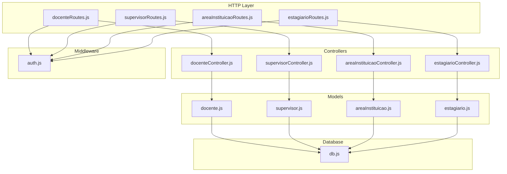
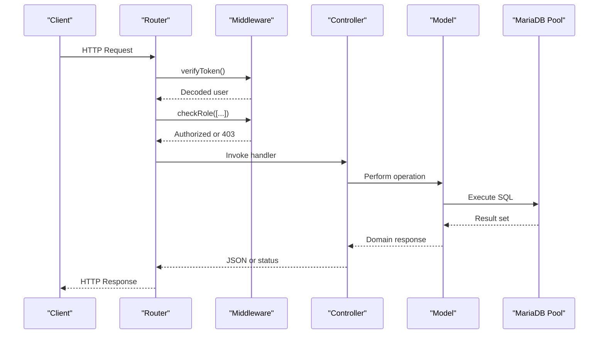
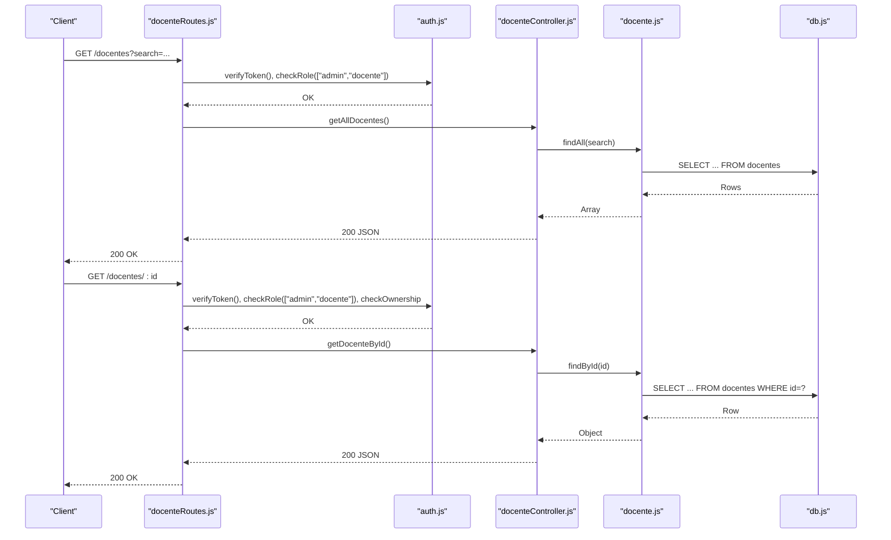
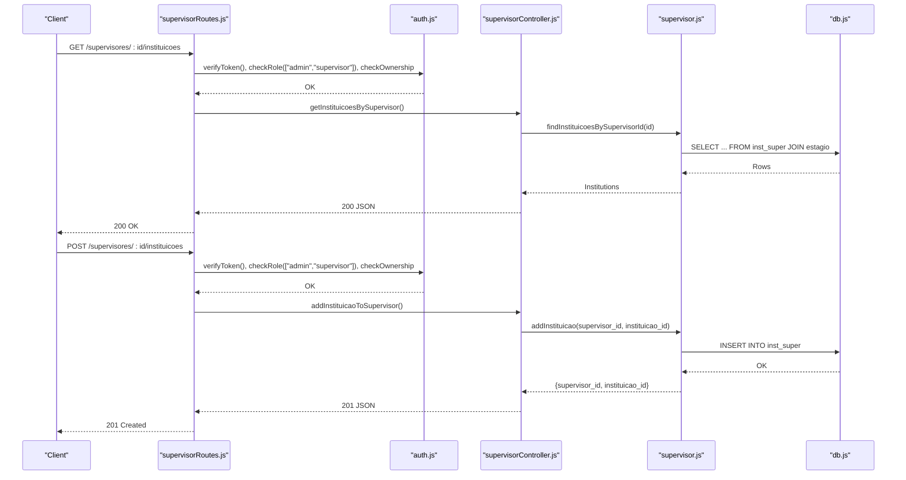
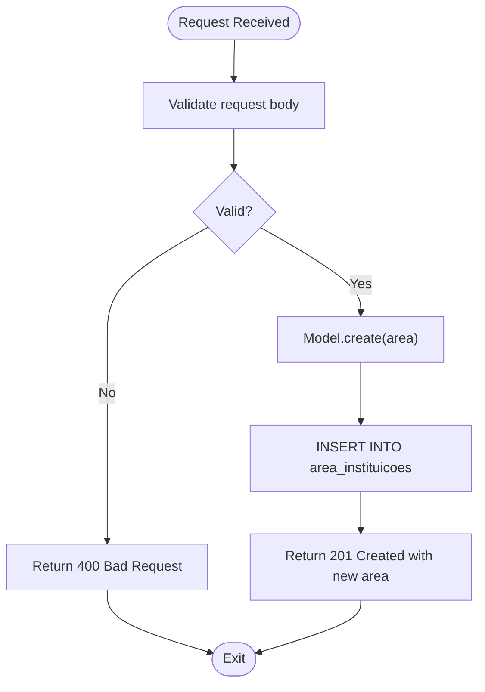
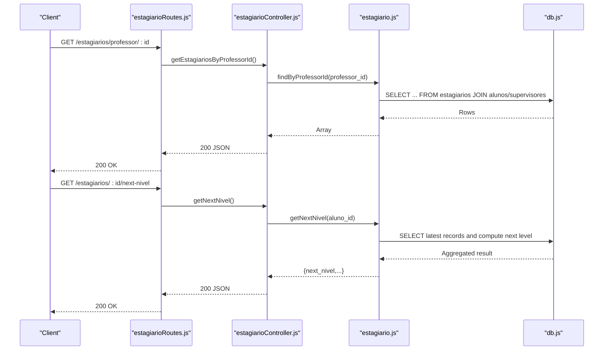
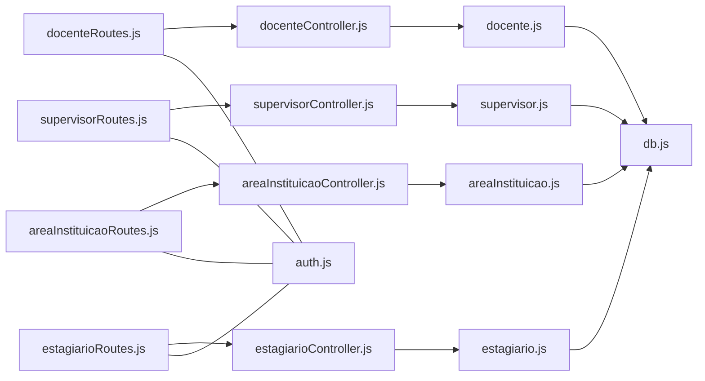

# Institutional Management APIs

<cite>
**Referenced Files in This Document**
- [src/routers/docenteRoutes.js](file://src/routers/docenteRoutes.js)
- [src/controllers/docenteController.js](file://src/controllers/docenteController.js)
- [src/models/docente.js](file://src/models/docente.js)
- [src/routers/supervisorRoutes.js](file://src/routers/supervisorRoutes.js)
- [src/controllers/supervisorController.js](file://src/controllers/supervisorController.js)
- [src/models/supervisor.js](file://src/models/supervisor.js)
- [src/routers/areaInstituicaoRoutes.js](file://src/routers/areaInstituicaoRoutes.js)
- [src/controllers/areaInstituicaoController.js](file://src/controllers/areaInstituicaoController.js)
- [src/models/areaInstituicao.js](file://src/models/areaInstituicao.js)
- [src/routers/estagiarioRoutes.js](file://src/routers/estagiarioRoutes.js)
- [src/controllers/estagiarioController.js](file://src/controllers/estagiarioController.js)
- [src/models/estagiario.js](file://src/models/estagiario.js)
- [src/middleware/auth.js](file://src/middleware/auth.js)
- [src/database/db.js](file://src/database/db.js)
</cite>

## Table of Contents
1. [Introduction](#introduction)
2. [Project Structure](#project-structure)
3. [Core Components](#core-components)
4. [Architecture Overview](#architecture-overview)
5. [Detailed Component Analysis](#detailed-component-analysis)
6. [Dependency Analysis](#dependency-analysis)
7. [Performance Considerations](#performance-considerations)
8. [Troubleshooting Guide](#troubleshooting-guide)
9. [Conclusion](#conclusion)

## Introduction
This document provides comprehensive API documentation for institutional management endpoints focused on professors, supervisors, and institutional areas. It covers:
- Professor endpoints for listing and retrieving faculty members, including relationship endpoints for student supervision.
- Supervisor endpoints for external supervisor management and N-to-N relationships with institutions.
- Institutional area endpoints for managing departments and divisions.
- Role-based access patterns, ownership checks, and hierarchical relationship management among entities.

## Project Structure
The backend follows a layered architecture:
- Routers define HTTP endpoints and apply middleware.
- Controllers implement request handling and orchestrate model operations.
- Models encapsulate database queries and relationships.
- Middleware enforces authentication, roles, and ownership.
- Database configuration connects to MariaDB via a connection pool.

**Diagram sources**
- [src/routers/docenteRoutes.js](file://src/routers/docenteRoutes.js#L1-L20)
- [src/routers/supervisorRoutes.js](file://src/routers/supervisorRoutes.js#L1-L27)
- [src/routers/areaInstituicaoRoutes.js](file://src/routers/areaInstituicaoRoutes.js#L1-L13)
- [src/routers/estagiarioRoutes.js](file://src/routers/estagiarioRoutes.js#L1-L21)
- [src/controllers/docenteController.js](file://src/controllers/docenteController.js#L1-L85)
- [src/controllers/supervisorController.js](file://src/controllers/supervisorController.js#L1-L112)
- [src/controllers/areaInstituicaoController.js](file://src/controllers/areaInstituicaoController.js#L1-L77)
- [src/controllers/estagiarioController.js](file://src/controllers/estagiarioController.js#L1-L133)
- [src/models/docente.js](file://src/models/docente.js#L1-L72)
- [src/models/supervisor.js](file://src/models/supervisor.js#L1-L77)
- [src/models/areaInstituicao.js](file://src/models/areaInstituicao.js#L1-L45)
- [src/models/estagiario.js](file://src/models/estagiario.js#L1-L187)
- [src/middleware/auth.js](file://src/middleware/auth.js#L1-L137)
- [src/database/db.js](file://src/database/db.js#L1-L15)

**Section sources**
- [src/routers/docenteRoutes.js](file://src/routers/docenteRoutes.js#L1-L20)
- [src/routers/supervisorRoutes.js](file://src/routers/supervisorRoutes.js#L1-L27)
- [src/routers/areaInstituicaoRoutes.js](file://src/routers/areaInstituicaoRoutes.js#L1-L13)
- [src/routers/estagiarioRoutes.js](file://src/routers/estagiarioRoutes.js#L1-L21)
- [src/middleware/auth.js](file://src/middleware/auth.js#L1-L137)
- [src/database/db.js](file://src/database/db.js#L1-L15)

## Core Components
- Authentication and Authorization Middleware
  - Token verification and role enforcement.
  - Ownership checks for entity-specific updates and retrievals.
- Professor Management
  - Listing, retrieval, creation, update, deletion.
  - Relationship endpoint to fetch students supervised by a professor.
- Supervisor Management
  - Listing, retrieval, creation, update, deletion.
  - N-to-N relationship endpoints with institutions.
- Institutional Areas
  - CRUD for departments/divisions.
- Student Internship Records
  - CRUD for internships with filters and relationship queries.

**Section sources**
- [src/middleware/auth.js](file://src/middleware/auth.js#L6-L98)
- [src/controllers/docenteController.js](file://src/controllers/docenteController.js#L1-L85)
- [src/controllers/supervisorController.js](file://src/controllers/supervisorController.js#L1-L112)
- [src/controllers/areaInstituicaoController.js](file://src/controllers/areaInstituicaoController.js#L1-L77)
- [src/controllers/estagiarioController.js](file://src/controllers/estagiarioController.js#L1-L133)

## Architecture Overview
The system enforces role-based access control (RBAC) and ownership checks at the router level. Controllers delegate to models for persistence and complex joins. Models query the MariaDB pool configured centrally.

**Diagram sources**
- [src/middleware/auth.js](file://src/middleware/auth.js#L6-L98)
- [src/routers/docenteRoutes.js](file://src/routers/docenteRoutes.js#L12-L17)
- [src/routers/supervisorRoutes.js](file://src/routers/supervisorRoutes.js#L13-L24)
- [src/controllers/docenteController.js](file://src/controllers/docenteController.js#L17-L41)
- [src/models/docente.js](file://src/models/docente.js#L13-L42)
- [src/database/db.js](file://src/database/db.js#L5-L13)

## Detailed Component Analysis

### Professor Endpoints
- Base path: /docentes
- List professors with optional search query parameter.
- Retrieve a professor by ID.
- Relationship endpoint to list students (internships) under a professor.
- Create, update, and delete professors with admin role.

**Diagram sources**
- [src/routers/docenteRoutes.js](file://src/routers/docenteRoutes.js#L12-L14)
- [src/middleware/auth.js](file://src/middleware/auth.js#L6-L98)
- [src/controllers/docenteController.js](file://src/controllers/docenteController.js#L17-L41)
- [src/models/docente.js](file://src/models/docente.js#L13-L42)
- [src/database/db.js](file://src/database/db.js#L5-L13)

**Section sources**
- [src/routers/docenteRoutes.js](file://src/routers/docenteRoutes.js#L12-L17)
- [src/controllers/docenteController.js](file://src/controllers/docenteController.js#L17-L84)
- [src/models/docente.js](file://src/models/docente.js#L13-L68)

### Supervisor Endpoints
- Base path: /supervisores
- List supervisors.
- Retrieve, update, and optionally create/delete supervisors.
- Relationship endpoints:
  - List institutions linked to a supervisor.
  - Add an institution to a supervisor.
  - Remove an institution from a supervisor.

**Diagram sources**
- [src/routers/supervisorRoutes.js](file://src/routers/supervisorRoutes.js#L18-L20)
- [src/middleware/auth.js](file://src/middleware/auth.js#L6-L98)
- [src/controllers/supervisorController.js](file://src/controllers/supervisorController.js#L74-L96)
- [src/models/supervisor.js](file://src/models/supervisor.js#L47-L64)
- [src/database/db.js](file://src/database/db.js#L5-L13)

**Section sources**
- [src/routers/supervisorRoutes.js](file://src/routers/supervisorRoutes.js#L13-L24)
- [src/controllers/supervisorController.js](file://src/controllers/supervisorController.js#L74-L111)
- [src/models/supervisor.js](file://src/models/supervisor.js#L47-L73)

### Institutional Area Endpoints
- Base path: /area-instituicoes
- Manage departments/divisions with full CRUD.

**Diagram sources**
- [src/routers/areaInstituicaoRoutes.js](file://src/routers/areaInstituicaoRoutes.js#L6-L10)
- [src/controllers/areaInstituicaoController.js](file://src/controllers/areaInstituicaoController.js#L30-L42)
- [src/models/areaInstituicao.js](file://src/models/areaInstituicao.js#L19-L25)

**Section sources**
- [src/routers/areaInstituicaoRoutes.js](file://src/routers/areaInstituicaoRoutes.js#L6-L10)
- [src/controllers/areaInstituicaoController.js](file://src/controllers/areaInstituicaoController.js#L3-L77)
- [src/models/areaInstituicao.js](file://src/models/areaInstituicao.js#L3-L42)

### Student Internship Relationship Endpoints
- Base path: /estagiarios
- Retrieve students by professor ID (relationship endpoint).
- Retrieve students by supervisor ID (relationship endpoint).
- Compute next internship level for a student.

**Diagram sources**
- [src/routers/estagiarioRoutes.js](file://src/routers/estagiarioRoutes.js#L14-L15)
- [src/controllers/estagiarioController.js](file://src/controllers/estagiarioController.js#L110-L132)
- [src/models/estagiario.js](file://src/models/estagiario.js#L111-L183)

**Section sources**
- [src/routers/estagiarioRoutes.js](file://src/routers/estagiarioRoutes.js#L14-L15)
- [src/controllers/estagiarioController.js](file://src/controllers/estagiarioController.js#L110-L132)
- [src/models/estagiario.js](file://src/models/estagiario.js#L111-L183)

## Dependency Analysis
- Router-to-Controller coupling is loose; each route maps to a single controller method.
- Controller-to-Model coupling is tight; controllers call model methods for persistence and joins.
- Middleware dependency is centralized; all routes import and apply authentication and authorization.
- Database dependency is centralized via a shared pool.

**Diagram sources**
- [src/routers/docenteRoutes.js](file://src/routers/docenteRoutes.js#L1-L20)
- [src/routers/supervisorRoutes.js](file://src/routers/supervisorRoutes.js#L1-L27)
- [src/routers/areaInstituicaoRoutes.js](file://src/routers/areaInstituicaoRoutes.js#L1-L13)
- [src/routers/estagiarioRoutes.js](file://src/routers/estagiarioRoutes.js#L1-L21)
- [src/controllers/docenteController.js](file://src/controllers/docenteController.js#L1-L85)
- [src/controllers/supervisorController.js](file://src/controllers/supervisorController.js#L1-L112)
- [src/controllers/areaInstituicaoController.js](file://src/controllers/areaInstituicaoController.js#L1-L77)
- [src/controllers/estagiarioController.js](file://src/controllers/estagiarioController.js#L1-L133)
- [src/models/docente.js](file://src/models/docente.js#L1-L72)
- [src/models/supervisor.js](file://src/models/supervisor.js#L1-L77)
- [src/models/areaInstituicao.js](file://src/models/areaInstituicao.js#L1-L45)
- [src/models/estagiario.js](file://src/models/estagiario.js#L1-L187)
- [src/middleware/auth.js](file://src/middleware/auth.js#L1-L137)
- [src/database/db.js](file://src/database/db.js#L1-L15)

**Section sources**
- [src/middleware/auth.js](file://src/middleware/auth.js#L6-L98)
- [src/database/db.js](file://src/database/db.js#L5-L13)

## Performance Considerations
- Token verification and role checks occur per request; keep JWT secret secure and rotate tokens regularly.
- Queries use indexed columns where possible (IDs and search term indexing for professors).
- Joins in models (e.g., professors-students, supervisors-institutions) should leverage appropriate indexes on join keys.
- Pagination is not implemented; for large datasets, consider adding limit/offset or cursor-based pagination.

## Troubleshooting Guide
Common issues and resolutions:
- Authentication failures
  - Missing or invalid Authorization header.
  - Expired token.
  - Resolution: Ensure a valid bearer token is sent; verify server-side JWT secret configuration.
- Authorization failures
  - Insufficient role for endpoint.
  - Non-admin user attempting to modify another’s record without ownership.
  - Resolution: Confirm user role and entitlement; admin can bypass ownership checks.
- Entity not found
  - Attempting to update or delete a non-existent professor/supervisor/area.
  - Resolution: Validate IDs before invoking endpoints.
- Relationship errors
  - Adding/removing institution-supervisor relationships.
  - Resolution: Ensure both IDs exist and the relationship payload is correct.

**Section sources**
- [src/middleware/auth.js](file://src/middleware/auth.js#L6-L98)
- [src/controllers/docenteController.js](file://src/controllers/docenteController.js#L33-L51)
- [src/controllers/supervisorController.js](file://src/controllers/supervisorController.js#L19-L71)
- [src/controllers/areaInstituicaoController.js](file://src/controllers/areaInstituicaoController.js#L19-L56)
- [src/controllers/supervisorController.js](file://src/controllers/supervisorController.js#L86-L111)

## Conclusion
The institutional management APIs provide a clear, role-aware interface for managing professors, supervisors, and institutional areas, with robust relationship endpoints for student supervision and institutional associations. Adhering to the documented RBAC and ownership patterns ensures secure and predictable access to resources.