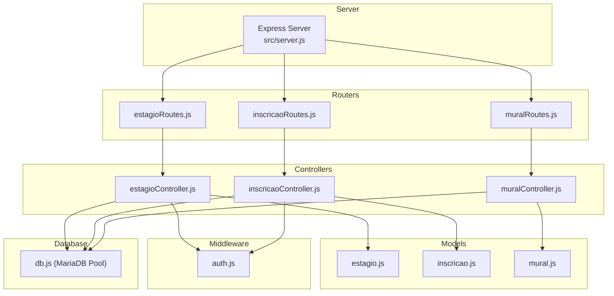
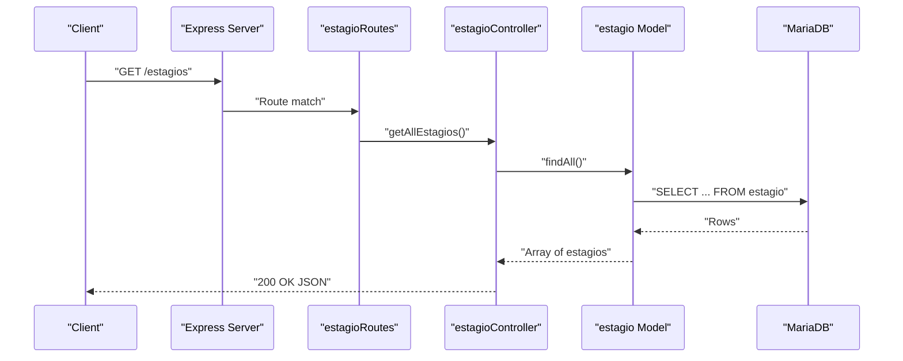
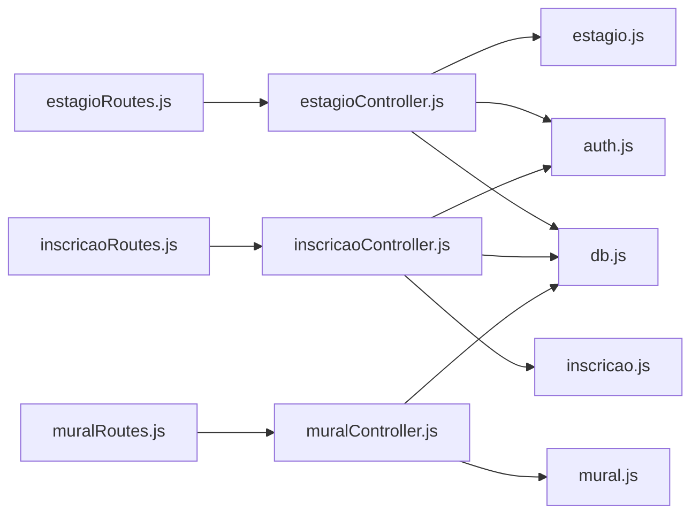

# Internship Management APIs

<cite>
**Referenced Files in This Document**
- [server.js](file://src/server.js)
- [estagioRoutes.js](file://src/routers/estagioRoutes.js)
- [estagioController.js](file://src/controllers/estagioController.js)
- [estagio.js](file://src/models/estagio.js)
- [inscricaoRoutes.js](file://src/routers/inscricaoRoutes.js)
- [inscricaoController.js](file://src/controllers/inscricaoController.js)
- [inscricao.js](file://src/models/inscricao.js)
- [muralRoutes.js](file://src/routers/muralRoutes.js)
- [mural.js](file://src/models/mural.js)
- [auth.js](file://src/middleware/auth.js)
- [db.js](file://src/database/db.js)
</cite>

## Table of Contents
1. [Introduction](#introduction)
2. [Project Structure](#project-structure)
3. [Core Components](#core-components)
4. [Architecture Overview](#architecture-overview)
5. [Detailed Component Analysis](#detailed-component-analysis)
6. [Dependency Analysis](#dependency-analysis)
7. [Performance Considerations](#performance-considerations)
8. [Troubleshooting Guide](#troubleshooting-guide)
9. [Conclusion](#conclusion)

## Introduction
This document provides comprehensive API documentation for the internship management endpoints. It covers listing and retrieving internship opportunities, creating and updating opportunities, and canceling opportunities. It also documents application retrieval endpoints and the relationships to students, supervisors, and institutions. The focus is on:
- Listing all internship opportunities
- Retrieving specific internship details
- Creating new internship opportunities
- Updating existing opportunities with ownership verification
- Cancelling opportunities
- Fetching application records related to internships

## Project Structure
The backend follows an Express-based MVC architecture with modular routers, controllers, and models. Internship-related functionality is primarily exposed under the /estagios base path, with nested relationships to applications via /inscricoes and to institution-specific listings via /mural.

**Diagram sources**
- [server.js](file://src/server.js#L31-L73)
- [estagioRoutes.js](file://src/routers/estagioRoutes.js#L1-L20)
- [inscricaoRoutes.js](file://src/routers/inscricaoRoutes.js#L1-L21)
- [muralRoutes.js](file://src/routers/muralRoutes.js#L1-L23)
- [estagioController.js](file://src/controllers/estagioController.js#L1-L98)
- [inscricaoController.js](file://src/controllers/inscricaoController.js#L1-L114)
- [mural.js](file://src/models/mural.js#L1-L91)
- [estagio.js](file://src/models/estagio.js#L1-L66)
- [inscricao.js](file://src/models/inscricao.js#L1-L104)
- [auth.js](file://src/middleware/auth.js#L1-L137)
- [db.js](file://src/database/db.js#L1-L15)

**Section sources**
- [server.js](file://src/server.js#L31-L73)
- [estagioRoutes.js](file://src/routers/estagioRoutes.js#L1-L20)
- [inscricaoRoutes.js](file://src/routers/inscricaoRoutes.js#L1-L21)
- [muralRoutes.js](file://src/routers/muralRoutes.js#L1-L23)

## Core Components
- Internship Opportunities (/estagios): CRUD operations for institutions offering internships, including nested endpoints for supervisors and institution-specific listings.
- Applications (/inscricoes): CRUD operations for student applications to internship opportunities, with filtering by period and ownership checks.
- Institution Listings (/mural): Institution-specific listings of internship opportunities with nested application retrieval.

Key responsibilities:
- Authentication and role-based access control via middleware.
- Ownership verification for sensitive operations (e.g., inscricao updates/deletes).
- Relationship endpoints linking to students, supervisors, and institutions.

**Section sources**
- [estagioController.js](file://src/controllers/estagioController.js#L1-L98)
- [inscricaoController.js](file://src/controllers/inscricaoController.js#L1-L114)
- [mural.js](file://src/models/mural.js#L1-L91)
- [auth.js](file://src/middleware/auth.js#L1-L137)

## Architecture Overview
The system exposes REST endpoints organized by domain. Routers define endpoint contracts, controllers orchestrate requests and responses, models encapsulate database queries, and middleware enforces authentication and authorization.

**Diagram sources**
- [server.js](file://src/server.js#L31-L73)
- [estagioRoutes.js](file://src/routers/estagioRoutes.js#L1-L20)
- [estagioController.js](file://src/controllers/estagioController.js#L1-L12)
- [estagio.js](file://src/models/estagio.js#L1-L10)
- [db.js](file://src/database/db.js#L1-L15)

## Detailed Component Analysis

### Internship Opportunities API (/estagios)
Endpoints:
- GET /estagios
  - Description: List all internship opportunities with institution and area information.
  - Response: Array of estagio objects.
- GET /estagios/:id
  - Description: Retrieve a specific internship opportunity by ID.
  - Response: Single estagio object.
- POST /estagios
  - Description: Create a new internship opportunity.
  - Request body: Internship creation schema.
  - Response: Created estagio object.
- PUT /estagios/:id
  - Description: Update an existing internship opportunity.
  - Request body: Internship update schema.
  - Response: 204 No Content on success.
- DELETE /estagios/:id
  - Description: Cancel/delete an internship opportunity.
  - Response: 204 No Content on success.

Nested endpoints:
- GET /estagios/:id/supervisores
  - Description: Retrieve supervisors associated with an internship opportunity.
  - Response: Array of supervisors linked to the institution.
- GET /estagios/:id/mural
  - Description: Retrieve institution-specific listings (mural) for an internship opportunity.
  - Response: Array of mural entries.

Request schemas:
- Creation and update schema:
  - Required: instituicao, areainstituicoes_id
  - Optional: cnpj, beneficio, url, endereco, bairro, municipio, cep, telefone, fim_de_semana, convenio, expira, seguro, avaliacao, observacoes

Response schemas:
- Estagio object includes institution details and area name.

Notes:
- Ownership verification is not enforced for create/update/delete operations in the estagio controller; admin privileges are implied by the absence of explicit ownership checks in the controller logic.

**Section sources**
- [estagioRoutes.js](file://src/routers/estagioRoutes.js#L11-L17)
- [estagioController.js](file://src/controllers/estagioController.js#L4-L70)
- [estagio.js](file://src/models/estagio.js#L5-L62)

### Applications API (/inscricoes)
Endpoints:
- GET /inscricoes
  - Description: List all applications with optional filtering by period.
  - Query parameters: periodo (optional).
  - Response: Array of inscricao objects with related student and institution data.
- GET /inscricoes/periodos
  - Description: Retrieve distinct application periods.
  - Response: Array of period values.
- GET /inscricoes/:id
  - Description: Retrieve a specific application by ID.
  - Response: Single inscricao object with related student and institution data.
- POST /inscricoes
  - Description: Create a new application.
  - Request body: Application creation schema.
  - Response: Created inscricao object.
- PUT /inscricoes/:id
  - Description: Update an existing application.
  - Request body: Application update schema.
  - Response: 204 No Content on success.
- DELETE /inscricoes/:id
  - Description: Delete an application.
  - Response: 204 No Content on success.

Nested endpoints:
- GET /mural/:id/inscricoes
  - Description: Retrieve applications for a specific institution listing (mural).
  - Response: Array of inscricao records with student names and timestamps.
- GET /alunos/:id/inscricoes
  - Description: Retrieve applications for a specific student.
  - Response: Array of inscricao records.

Request schemas:
- Creation schema: registro, aluno_id, muralestagio_id, data, periodo
- Update schema: Same as creation schema

Validation and errors:
- Duplicate enrollment prevention: An application cannot be created or updated if a student is already enrolled in the same mural during the same period.

Ownership verification:
- checkInscricaoOwnership middleware ensures that non-admin users can only access or modify their own applications.

**Section sources**
- [inscricaoRoutes.js](file://src/routers/inscricaoRoutes.js#L12-L18)
- [inscricaoController.js](file://src/controllers/inscricaoController.js#L5-L113)
- [inscricao.js](file://src/models/inscricao.js#L5-L100)
- [auth.js](file://src/middleware/auth.js#L100-L136)

### Institution Listings API (/mural)
Endpoints:
- GET /mural
  - Description: List institution-specific internship listings with optional filtering by period.
  - Query parameters: periodo (optional).
  - Response: Array of mural entries.
- GET /mural/periodoestagio
  - Description: Retrieve distinct listing periods.
  - Response: Array of period values.
- GET /mural/:id
  - Description: Retrieve a specific listing by ID.
  - Response: Single mural entry.
- GET /mural/:id/inscricoes
  - Description: Retrieve applications for a specific listing.
  - Response: Array of inscricao records with student names and timestamps.
- POST /mural
  - Description: Create a new listing (admin only).
  - Response: Created mural entry.
- PUT /mural/:id
  - Description: Update a listing (admin only).
  - Response: 204 No Content on success.
- DELETE /mural/:id
  - Description: Delete a listing (admin only).
  - Response: 204 No Content on success.

**Section sources**
- [muralRoutes.js](file://src/routers/muralRoutes.js#L12-L20)
- [mural.js](file://src/models/mural.js#L5-L87)

### Relationship Endpoints
- GET /estagios/:id/supervisores
  - Returns supervisors linked to an institution.
- GET /estagios/:id/mural
  - Returns institution listings (mural) for an institution.
- GET /mural/:id/inscricoes
  - Returns applications for a listing.
- GET /alunos/:id/inscricoes
  - Returns applications for a student.

These endpoints facilitate navigation between students, supervisors, and institutions through the internship ecosystem.

**Section sources**
- [estagioController.js](file://src/controllers/estagioController.js#L72-L97)
- [mural.js](file://src/models/mural.js#L49-L56)

## Dependency Analysis
The system exhibits clear separation of concerns:
- Routers depend on controllers.
- Controllers depend on models.
- Models depend on the database pool.
- Controllers optionally depend on middleware for authentication and authorization.

**Diagram sources**
- [estagioRoutes.js](file://src/routers/estagioRoutes.js#L1-L20)
- [inscricaoRoutes.js](file://src/routers/inscricaoRoutes.js#L1-L21)
- [muralRoutes.js](file://src/routers/muralRoutes.js#L1-L23)
- [estagioController.js](file://src/controllers/estagioController.js#L1-L98)
- [inscricaoController.js](file://src/controllers/inscricaoController.js#L1-L114)
- [mural.js](file://src/models/mural.js#L1-L91)
- [estagio.js](file://src/models/estagio.js#L1-L66)
- [inscricao.js](file://src/models/inscricao.js#L1-L104)
- [auth.js](file://src/middleware/auth.js#L1-L137)
- [db.js](file://src/database/db.js#L1-L15)

**Section sources**
- [server.js](file://src/server.js#L31-L73)
- [auth.js](file://src/middleware/auth.js#L1-L137)

## Performance Considerations
- Database pooling: The MariaDB pool is configured with connection limits and queue behavior suitable for moderate concurrency.
- Query patterns: Controllers issue straightforward SELECT/INSERT/UPDATE/DELETE statements. Consider adding indexes on frequently filtered columns (e.g., periodo, aluno_id, muralestagio_id) to improve performance.
- Pagination: For large datasets, consider implementing pagination to reduce payload sizes.
- Caching: For read-heavy endpoints like listing opportunities and applications, introduce caching strategies to minimize database load.

[No sources needed since this section provides general guidance]

## Troubleshooting Guide
Common issues and resolutions:
- Authentication failures:
  - Missing or invalid Authorization header: Ensure requests include a valid bearer token.
  - Expired tokens: Re-authenticate to obtain a new token.
- Role-based access denied:
  - Non-admin users attempting admin-only operations (e.g., creating/updating/deleting listings or inscricoes) will receive a 403 error.
- Ownership violations:
  - Non-admin users can only access or modify their own applications; attempts to access others' applications will be rejected.
- Not found errors:
  - Requests for non-existent estagio, inscricao, or mural records return 404.
- Duplicate enrollment:
  - Creating or updating an application to the same mural during the same period for the same student is prevented with a 400 error.

Operational tips:
- Verify environment variables for database connectivity and JWT secret.
- Confirm that nested endpoints are accessed with correct IDs and appropriate roles.

**Section sources**
- [auth.js](file://src/middleware/auth.js#L6-L29)
- [auth.js](file://src/middleware/auth.js#L31-L48)
- [auth.js](file://src/middleware/auth.js#L100-L136)
- [inscricao.js](file://src/models/inscricao.js#L58-L92)
- [estagio.js](file://src/models/estagio.js#L5-L17)
- [inscricao.js](file://src/models/inscricao.js#L30-L38)
- [mural.js](file://src/models/mural.js#L42-L47)

## Conclusion
The internship management APIs provide a robust foundation for managing institutions, listings, and student applications. The design emphasizes clear routing, controller orchestration, and model-driven persistence, with authentication and role-based controls for secure access. Extending support for filtering by status, location, and date ranges would enhance the listing capabilities, while maintaining the existing ownership and role-based safeguards.