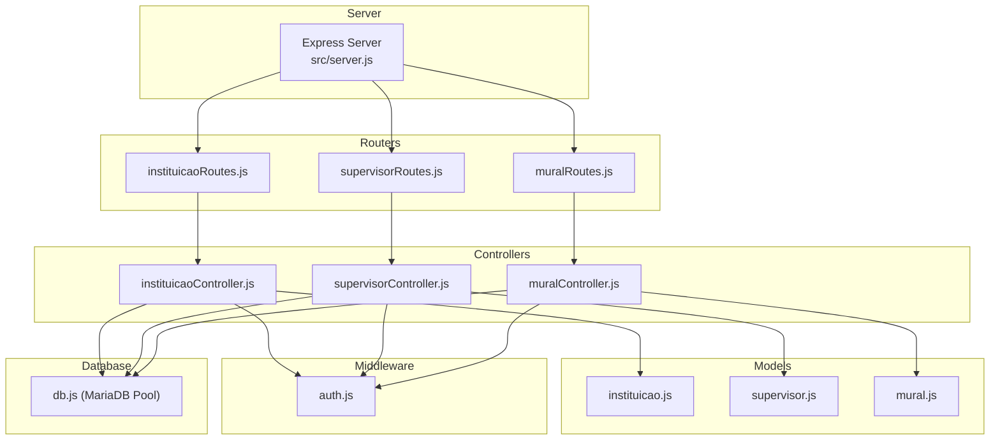
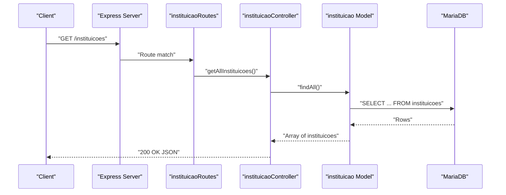
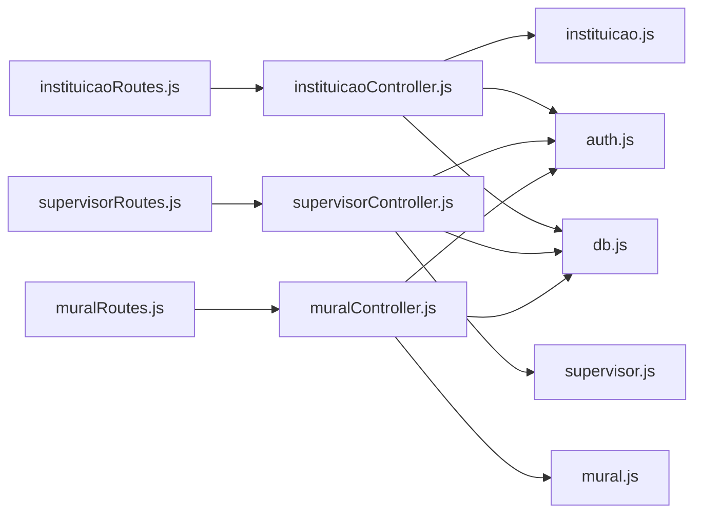

# Internship Management APIs

<cite>
**Referenced Files in This Document**
- [server.js](file://src/server.js)
- [instituicaoRoutes.js](file://src/routers/instituicaoRoutes.js)
- [instituicaoController.js](file://src/controllers/instituicaoController.js)
- [instituicao.js](file://src/models/instituicao.js)
- [inscricaoRoutes.js](file://src/routers/inscricaoRoutes.js)
- [inscricaoController.js](file://src/controllers/inscricaoController.js)
- [inscricao.js](file://src/models/inscricao.js)
- [muralRoutes.js](file://src/routers/muralRoutes.js)
- [mural.js](file://src/models/mural.js)
- [supervisorRoutes.js](file://src/routers/supervisorRoutes.js)
- [supervisorController.js](file://src/controllers/supervisorController.js)
- [supervisor.js](file://src/models/supervisor.js)
- [auth.js](file://src/middleware/auth.js)
- [db.js](file://src/database/db.js)
</cite>

## Update Summary
**Changes Made**
- Updated API endpoints from `/estagios` to `/instituicoes` for institution management
- Removed deprecated estagio (internship) API endpoints
- Added comprehensive documentation for institution management APIs
- Updated relationship endpoints to reflect institution-supervisor-mural relationships
- Enhanced supervisor management endpoints with specialized operations
- Maintained application management endpoints for student enrollment processes

## Table of Contents
1. [Introduction](#introduction)
2. [Project Structure](#project-structure)
3. [Core Components](#core-components)
4. [Architecture Overview](#architecture-overview)
5. [Detailed Component Analysis](#detailed-component-analysis)
6. [Dependency Analysis](#dependency-analysis)
7. [Performance Considerations](#performance-considerations)
8. [Troubleshooting Guide](#troubleshooting-guide)
9. [Conclusion](#conclusion)

## Introduction
This document provides comprehensive API documentation for the institution management system that replaced the previous internship management APIs. The system now focuses on managing educational institutions, their supervisors, and internship opportunities through institutional listings. The documentation covers:
- Managing institutions with CRUD operations
- Retrieving institution details with supervisor and listing relationships
- Creating and updating institutional profiles
- Supervisor management and relationship assignments
- Institution-specific internship listings and application processes
- Student enrollment and application management

## Project Structure
The backend follows an Express-based MVC architecture with modular routers, controllers, and models. Institution management functionality is primarily exposed under the /instituicoes base path, with nested relationships to supervisors via /supervisores and to institution-specific listings via /mural.

```mermaid
graph TB
subgraph "Server"
S["Express Server<br/>src/server.js"]
end
subgraph "Routers"
IR["instituicaoRoutes.js"]
SR["supervisorRoutes.js"]
MR["muralRoutes.js"]
end
subgraph "Controllers"
IC["instituicaoController.js"]
SC["supervisorController.js"]
MC["muralController.js"]
end
subgraph "Models"
IM["instituicao.js"]
SM["supervisor.js"]
MM["mural.js"]
end
subgraph "Middleware"
AM["auth.js"]
end
subgraph "Database"
DB["db.js (MariaDB Pool)"]
end
S --> IR
S --> SR
S --> MR
IR --> IC
SR --> SC
MR --> MC
IC --> IM
SC --> SM
MC --> MM
IC --> AM
SC --> AM
MC --> AM
IC --> DB
SC --> DB
MC --> DB
```

**Diagram sources**
- [server.js:31-73](file://src/server.js#L31-L73)
- [instituicaoRoutes.js:1-21](file://src/routers/instituicaoRoutes.js#L1-L21)
- [supervisorRoutes.js:1-31](file://src/routers/supervisorRoutes.js#L1-L31)
- [muralRoutes.js:1-23](file://src/routers/muralRoutes.js#L1-L23)
- [instituicaoController.js:1-95](file://src/controllers/instituicaoController.js#L1-L95)
- [supervisorController.js:1-120](file://src/controllers/supervisorController.js#L1-L120)
- [mural.js:1-91](file://src/models/mural.js#L1-L91)
- [instituicao.js:1-66](file://src/models/instituicao.js#L1-L66)
- [supervisor.js:1-100](file://src/models/supervisor.js#L1-L100)
- [auth.js:1-137](file://src/middleware/auth.js#L1-L137)
- [db.js:1-15](file://src/database/db.js#L1-L15)

**Section sources**
- [server.js:31-73](file://src/server.js#L31-L73)
- [instituicaoRoutes.js:1-21](file://src/routers/instituicaoRoutes.js#L1-L21)
- [supervisorRoutes.js:1-31](file://src/routers/supervisorRoutes.js#L1-L31)
- [muralRoutes.js:1-23](file://src/routers/muralRoutes.js#L1-L23)

## Core Components
- Institutions (/instituicoes): CRUD operations for educational institutions, including nested endpoints for supervisors and institution-specific listings.
- Supervisors (/supervisores): Management of institution supervisors with role-based access control and relationship assignments.
- Applications (/inscricoes): CRUD operations for student applications to internship opportunities, with filtering by period and ownership checks.
- Institution Listings (/mural): Institution-specific listings of internship opportunities with nested application retrieval.

Key responsibilities:
- Authentication and role-based access control via middleware.
- Ownership verification for sensitive operations (e.g., inscricao updates/deletes).
- Relationship endpoints linking to institutions, supervisors, and students.

**Section sources**
- [instituicaoController.js:1-95](file://src/controllers/instituicaoController.js#L1-L95)
- [supervisorController.js:1-120](file://src/controllers/supervisorController.js#L1-L120)
- [inscricaoController.js:1-114](file://src/controllers/inscricaoController.js#L1-L114)
- [mural.js:1-91](file://src/models/mural.js#L1-L91)
- [auth.js:1-137](file://src/middleware/auth.js#L1-L137)

## Architecture Overview
The system exposes REST endpoints organized by domain. Routers define endpoint contracts, controllers orchestrate requests and responses, models encapsulate database queries, and middleware enforces authentication and authorization.

```mermaid
sequenceDiagram
participant C as "Client"
participant SRV as "Express Server"
participant IR as "instituicaoRoutes"
participant IC as "instituicaoController"
participant IM as "instituicao Model"
participant DB as "MariaDB"
C->>SRV : "GET /instituicoes"
SRV->>IR : "Route match"
IR->>IC : "getAllInstituicoes()"
IC->>IM : "findAll()"
IM->>DB : "SELECT ... FROM instituicoes"
DB-->>IM : "Rows"
IM-->>IC : "Array of instituicoes"
IC-->>C : "200 OK JSON"
```

**Diagram sources**
- [server.js:31-73](file://src/server.js#L31-L73)
- [instituicaoRoutes.js:1-21](file://src/routers/instituicaoRoutes.js#L1-L21)
- [instituicaoController.js:1-12](file://src/controllers/instituicaoController.js#L1-L12)
- [instituicao.js:1-10](file://src/models/instituicao.js#L1-L10)
- [db.js:1-15](file://src/database/db.js#L1-L15)

## Detailed Component Analysis

### Institution Management API (/instituicoes)
Endpoints:
- GET /instituicoes
  - Description: List all institutions with area information.
  - Response: Array of instituicao objects.
- GET /instituicoes/:id
  - Description: Retrieve a specific institution by ID.
  - Response: Single instituicao object.
- POST /instituicoes
  - Description: Create a new institution (admin only).
  - Request body: Institution creation schema.
  - Response: Created instituicao object.
- PUT /instituicoes/:id
  - Description: Update an existing institution (admin only).
  - Request body: Institution update schema.
  - Response: 204 No Content on success.
- DELETE /instituicoes/:id
  - Description: Delete an institution (admin only).
  - Response: 204 No Content on success.

Nested endpoints:
- GET /instituicoes/:id/supervisores
  - Description: Retrieve supervisors associated with an institution.
  - Response: Array of supervisors linked to the institution.
- GET /instituicoes/:id/mural
  - Description: Retrieve institution-specific listings (mural) for an institution.
  - Response: Array of mural entries with period and vacancy information.

Request schemas:
- Creation and update schema:
  - Required: instituicao, area_id
  - Optional: cnpj, natureza, email, beneficios, url, endereco, bairro, municipio, cep, telefone, fim_de_semana, convenio, expira, seguro, observacoes

Response schemas:
- Instituicao object includes institution details and area name.

Notes:
- Admin-only operations for create, update, and delete operations.
- Ownership verification is not enforced for institution management operations.

**Section sources**
- [instituicaoRoutes.js:12-18](file://src/routers/instituicaoRoutes.js#L12-L18)
- [instituicaoController.js:4-70](file://src/controllers/instituicaoController.js#L4-L70)
- [instituicao.js:5-62](file://src/models/instituicao.js#L5-L62)

### Supervisor Management API (/supervisores)
Endpoints:
- GET /supervisores
  - Description: List all supervisors (requires authentication).
  - Response: Array of supervisor objects.
- GET /supervisores/:id
  - Description: Retrieve a specific supervisor by ID.
  - Response: Single supervisor object.
- POST /supervisores
  - Description: Create a new supervisor (admin only).
  - Response: Created supervisor object.
- PUT /supervisores/:id
  - Description: Update a supervisor (admin or supervisor role with ownership verification).
  - Response: 204 No Content on success.
- DELETE /supervisores/:id
  - Description: Delete a supervisor (admin only).
  - Response: 204 No Content on success.

Specialized endpoints:
- GET /supervisores/cress/:cress
  - Description: Retrieve supervisor by CRESS number (public route).
  - Response: Single supervisor object.
- GET /supervisores/:id/estagiarios
  - Description: Retrieve students supervised by a specific supervisor.
  - Response: Array of estagiarios.
- GET /supervisores/:id/instituicoes
  - Description: Retrieve institutions associated with a supervisor.
  - Response: Array of instituicoes.
- POST /supervisores/:id/instituicoes
  - Description: Assign an institution to a supervisor.
  - Response: 204 No Content on success.
- DELETE /supervisores/:id/instituicoes/:instituicaoId
  - Description: Remove institution assignment from supervisor.
  - Response: 204 No Content on success.

Request schemas:
- Creation and update schema:
  - Required: nome, email, cress, telefone
  - Optional: cpf, endereco, bairro, municipio, cep, especialidade, observacoes

Validation and errors:
- Duplicate CRESS numbers are prevented during creation and updates.
- Ownership verification ensures supervisors can only access their own records.

**Section sources**
- [supervisorRoutes.js:12-28](file://src/routers/supervisorRoutes.js#L12-L28)
- [supervisorController.js:1-120](file://src/controllers/supervisorController.js#L1-L120)
- [supervisor.js:1-100](file://src/models/supervisor.js#L1-L100)

### Applications API (/inscricoes)
Endpoints:
- GET /inscricoes
  - Description: List all applications with optional filtering by period.
  - Query parameters: periodo (optional).
  - Response: Array of inscricao objects with related student and institution data.
- GET /inscricoes/periodos
  - Description: Retrieve distinct application periods.
  - Response: Array of period values.
- GET /inscricoes/:id
  - Description: Retrieve a specific application by ID.
  - Response: Single inscricao object with related student and institution data.
- POST /inscricoes
  - Description: Create a new application.
  - Request body: Application creation schema.
  - Response: Created inscricao object.
- PUT /inscricoes/:id
  - Description: Update an existing application.
  - Request body: Application update schema.
  - Response: 204 No Content on success.
- DELETE /inscricoes/:id
  - Description: Delete an application.
  - Response: 204 No Content on success.

Nested endpoints:
- GET /mural/:id/inscricoes
  - Description: Retrieve applications for a specific institution listing (mural).
  - Response: Array of inscricao records with student names and timestamps.
- GET /alunos/:id/inscricoes
  - Description: Retrieve applications for a specific student.
  - Response: Array of inscricao records.

Request schemas:
- Creation schema: registro, aluno_id, muralestagio_id, data, periodo
- Update schema: Same as creation schema

Validation and errors:
- Duplicate enrollment prevention: An application cannot be created or updated if a student is already enrolled in the same mural during the same period.

Ownership verification:
- checkInscricaoOwnership middleware ensures that non-admin users can only access or modify their own applications.

**Section sources**
- [inscricaoRoutes.js:12-18](file://src/routers/inscricaoRoutes.js#L12-L18)
- [inscricaoController.js:5-113](file://src/controllers/inscricaoController.js#L5-L113)
- [inscricao.js:5-100](file://src/models/inscricao.js#L5-L100)
- [auth.js:100-136](file://src/middleware/auth.js#L100-L136)

### Institution Listings API (/mural)
Endpoints:
- GET /mural
  - Description: List institution-specific internship listings with optional filtering by period.
  - Query parameters: periodo (optional).
  - Response: Array of mural entries.
- GET /mural/periodoestagio
  - Description: Retrieve distinct listing periods.
  - Response: Array of period values.
- GET /mural/:id
  - Description: Retrieve a specific listing by ID.
  - Response: Single mural entry.
- GET /mural/:id/inscricoes
  - Description: Retrieve applications for a specific listing.
  - Response: Array of inscricao records with student names and timestamps.
- POST /mural
  - Description: Create a new listing (admin only).
  - Response: Created mural entry.
- PUT /mural/:id
  - Description: Update a listing (admin only).
  - Response: 204 No Content on success.
- DELETE /mural/:id
  - Description: Delete a listing (admin only).
  - Response: 204 No Content on success.

**Section sources**
- [muralRoutes.js:12-20](file://src/routers/muralRoutes.js#L12-L20)
- [mural.js:5-87](file://src/models/mural.js#L5-L87)

### Relationship Endpoints
- GET /instituicoes/:id/supervisores
  - Returns supervisors linked to an institution.
- GET /instituicoes/:id/mural
  - Returns institution listings (mural) for an institution.
- GET /mural/:id/inscricoes
  - Returns applications for a listing.
- GET /alunos/:id/inscricoes
  - Returns applications for a student.
- GET /supervisores/:id/estagiarios
  - Returns students supervised by a supervisor.
- GET /supervisores/:id/instituicoes
  - Returns institutions associated with a supervisor.

These endpoints facilitate navigation between institutions, supervisors, students, and internship opportunities through the institutional ecosystem.

**Section sources**
- [instituicaoController.js:72-94](file://src/controllers/instituicaoController.js#L72-L94)
- [mural.js:49-56](file://src/models/mural.js#L49-L56)
- [supervisorController.js:80-120](file://src/controllers/supervisorController.js#L80-L120)

## Dependency Analysis
The system exhibits clear separation of concerns:
- Routers depend on controllers.
- Controllers depend on models.
- Models depend on the database pool.
- Controllers optionally depend on middleware for authentication and authorization.

```mermaid
graph LR
IR["instituicaoRoutes.js"] --> IC["instituicaoController.js"]
SR["supervisorRoutes.js"] --> SC["supervisorController.js"]
MR["muralRoutes.js"] --> MC["muralController.js"]
IC --> IM["instituicao.js"]
SC --> SM["supervisor.js"]
MC --> MM["mural.js"]
IC --> AM["auth.js"]
SC --> AM
MC --> AM
IC --> DB["db.js"]
SC --> DB
MC --> DB
```

**Diagram sources**
- [instituicaoRoutes.js:1-21](file://src/routers/instituicaoRoutes.js#L1-L21)
- [supervisorRoutes.js:1-31](file://src/routers/supervisorRoutes.js#L1-L31)
- [muralRoutes.js:1-23](file://src/routers/muralRoutes.js#L1-L23)
- [instituicaoController.js:1-95](file://src/controllers/instituicaoController.js#L1-L95)
- [supervisorController.js:1-120](file://src/controllers/supervisorController.js#L1-L120)
- [mural.js:1-91](file://src/models/mural.js#L1-L91)
- [instituicao.js:1-66](file://src/models/instituicao.js#L1-L66)
- [supervisor.js:1-100](file://src/models/supervisor.js#L1-L100)
- [auth.js:1-137](file://src/middleware/auth.js#L1-L137)
- [db.js:1-15](file://src/database/db.js#L1-L15)

**Section sources**
- [server.js:31-73](file://src/server.js#L31-L73)
- [auth.js:1-137](file://src/middleware/auth.js#L1-L137)

## Performance Considerations
- Database pooling: The MariaDB pool is configured with connection limits and queue behavior suitable for moderate concurrency.
- Query patterns: Controllers issue straightforward SELECT/INSERT/UPDATE/DELETE statements. Consider adding indexes on frequently filtered columns (e.g., periodo, aluno_id, muralestagio_id, area_id) to improve performance.
- Pagination: For large datasets, consider implementing pagination to reduce payload sizes.
- Caching: For read-heavy endpoints like listing institutions and applications, introduce caching strategies to minimize database load.

## Troubleshooting Guide
Common issues and resolutions:
- Authentication failures:
  - Missing or invalid Authorization header: Ensure requests include a valid bearer token.
  - Expired tokens: Re-authenticate to obtain a new token.
- Role-based access denied:
  - Non-admin users attempting admin-only operations (e.g., creating/updating/deleting institutions, supervisors, or listings) will receive a 403 error.
- Ownership violations:
  - Non-admin users can only access or modify their own applications and supervisor records; attempts to access others' records will be rejected.
- Not found errors:
  - Requests for non-existent instituicao, inscricao, mural, or supervisor records return 404.
- Duplicate enrollment:
  - Creating or updating an application to the same mural during the same period for the same student is prevented with a 400 error.
- Duplicate CRESS:
  - Creating or updating a supervisor with an existing CRESS number is prevented with a 400 error.

Operational tips:
- Verify environment variables for database connectivity and JWT secret.
- Confirm that nested endpoints are accessed with correct IDs and appropriate roles.

**Section sources**
- [auth.js:6-29](file://src/middleware/auth.js#L6-L29)
- [auth.js:31-48](file://src/middleware/auth.js#L31-L48)
- [auth.js:100-136](file://src/middleware/auth.js#L100-L136)
- [inscricao.js:58-92](file://src/models/inscricao.js#L58-L92)
- [instituicao.js:5-17](file://src/models/instituicao.js#L5-L17)
- [supervisor.js:58-92](file://src/models/supervisor.js#L58-L92)
- [inscricao.js:30-38](file://src/models/inscricao.js#L30-L38)
- [mural.js:42-47](file://src/models/mural.js#L42-L47)

## Conclusion
The institution management APIs provide a robust foundation for managing educational institutions, their supervisors, and internship opportunities. The system emphasizes clear routing, controller orchestration, and model-driven persistence, with authentication and role-based controls for secure access. The transition from estagio (internship) management to instituicao (institution) management enhances the platform's focus on institutional relationships and supervisor-student connections, while maintaining the existing application management and ownership safeguards.