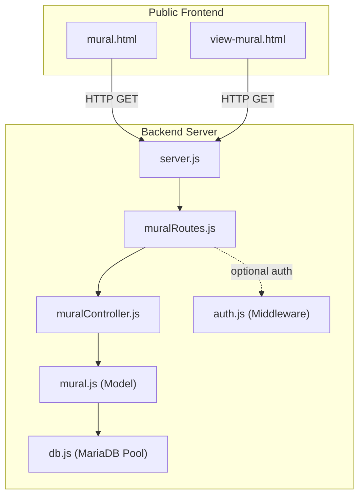
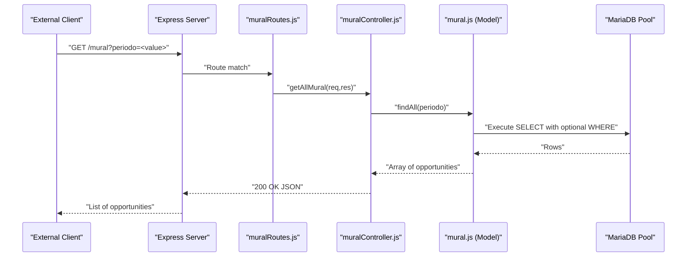
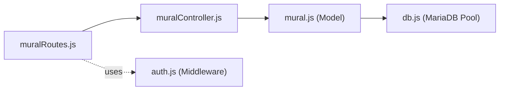

# Public Mural APIs

<cite>
**Referenced Files in This Document**
- [muralRoutes.js](file://src/routers/muralRoutes.js)
- [muralController.js](file://src/controllers/muralController.js)
- [mural.js](file://src/models/mural.js)
- [server.js](file://src/server.js)
- [auth.js](file://src/middleware/auth.js)
- [db.js](file://src/database/db.js)
- [mural.html](file://public/mural.html)
- [mural.js](file://public/mural.js)
- [view-mural.html](file://public/view-mural.html)
- [view-mural.js](file://public/view-mural.js)
- [README.md](file://README.md)
- [package.json](file://package.json)
</cite>

## Table of Contents
1. [Introduction](#introduction)
2. [Project Structure](#project-structure)
3. [Core Components](#core-components)
4. [Architecture Overview](#architecture-overview)
5. [Detailed Component Analysis](#detailed-component-analysis)
6. [Dependency Analysis](#dependency-analysis)
7. [Performance Considerations](#performance-considerations)
8. [Troubleshooting Guide](#troubleshooting-guide)
9. [Conclusion](#conclusion)

## Introduction
This document describes the public internship listing and discovery APIs exposed by the application. It focuses on:
- GET /mural for browsing available internship opportunities with filtering by academic period
- GET /mural/:id for detailed internship information display
- Supporting endpoints for distinct periods and nested registrations
- Public access patterns, authentication requirements, and data privacy considerations

The system is designed so that external users can discover opportunities without authentication, while administrative actions require proper authorization.

## Project Structure
The application follows a layered architecture:
- Frontend pages under public/ handle user-facing views and client-side interactions
- Backend routes under src/routers define API endpoints
- Controllers under src/controllers orchestrate requests and responses
- Models under src/models encapsulate database queries
- Middleware under src/middleware enforces authentication and authorization
- Database configuration under src/database connects to MariaDB

**Diagram sources**
- [server.js](file://src/server.js#L31-L54)
- [muralRoutes.js](file://src/routers/muralRoutes.js#L1-L23)
- [muralController.js](file://src/controllers/muralController.js#L1-L101)
- [mural.js](file://src/models/mural.js#L1-L91)
- [db.js](file://src/database/db.js#L1-L15)
- [auth.js](file://src/middleware/auth.js#L1-L137)

**Section sources**
- [server.js](file://src/server.js#L31-L54)
- [README.md](file://README.md#L1-L61)

## Core Components
- Route layer: Defines endpoints for listing, filtering, viewing details, nested registrations, and administrative operations.
- Controller layer: Implements request handling, parameter extraction, and response formatting.
- Model layer: Encapsulates SQL queries against the MariaDB pool.
- Middleware: Provides token verification and role-based access control.
- Frontend pages: Provide user interfaces for browsing and viewing opportunities.

Key capabilities:
- Listing opportunities with optional period filter
- Fetching distinct periods for filtering
- Retrieving opportunity details by ID
- Accessing nested registrations for a given opportunity
- Administrative creation, update, and deletion guarded by authentication and roles

**Section sources**
- [muralRoutes.js](file://src/routers/muralRoutes.js#L1-L23)
- [muralController.js](file://src/controllers/muralController.js#L1-L101)
- [mural.js](file://src/models/mural.js#L1-L91)
- [auth.js](file://src/middleware/auth.js#L1-L137)

## Architecture Overview
The public APIs are implemented as REST endpoints under /mural. Authentication is enforced selectively:
- GET /mural: Public listing with optional period filter
- GET /mural/periodoestagio: Public endpoint to fetch distinct periods
- GET /mural/:id: Public endpoint to retrieve opportunity details
- GET /mural/:id/inscricoes: Public endpoint to list registrations for an opportunity
- POST /mural, PUT /mural/:id, DELETE /mural/:id: Admin-only endpoints protected by token and role checks

**Diagram sources**
- [muralRoutes.js](file://src/routers/muralRoutes.js#L11-L15)
- [muralController.js](file://src/controllers/muralController.js#L5-L14)
- [mural.js](file://src/models/mural.js#L5-L18)
- [db.js](file://src/database/db.js#L5-L13)

## Detailed Component Analysis

### Endpoint: GET /mural
- Purpose: Retrieve all internship opportunities with optional filtering by academic period.
- Query parameters:
  - periodo: Optional. Filters opportunities by academic period.
- Response: Array of opportunity records ordered by period descending and registration date ascending.
- Authentication: Not required for public access.
- Pagination: Not implemented. All matching records are returned.

Behavior highlights:
- Applies optional WHERE clause on periodo when provided.
- Orders results consistently for predictable presentation.

**Section sources**
- [muralRoutes.js](file://src/routers/muralRoutes.js#L12-L12)
- [muralController.js](file://src/controllers/muralController.js#L5-L14)
- [mural.js](file://src/models/mural.js#L5-L18)

### Endpoint: GET /mural/periodoestagio
- Purpose: Fetch distinct academic periods available for filtering.
- Response: Array of distinct periodo values sorted in descending order.
- Authentication: Not required for public access.

**Section sources**
- [muralRoutes.js](file://src/routers/muralRoutes.js#L13-L13)
- [muralController.js](file://src/controllers/muralController.js#L17-L30)
- [mural.js](file://src/models/mural.js#L20-L24)

### Endpoint: GET /mural/:id
- Purpose: Retrieve detailed information for a specific opportunity by ID.
- Path parameters:
  - id: Opportunity identifier.
- Response: Single opportunity record.
- Authentication: Not required for public access.
- Error handling: Returns 404 if not found.

**Section sources**
- [muralRoutes.js](file://src/routers/muralRoutes.js#L15-L15)
- [muralController.js](file://src/controllers/muralController.js#L33-L45)
- [mural.js](file://src/models/mural.js#L42-L48)

### Endpoint: GET /mural/:id/inscricoes
- Purpose: List registrations associated with a specific opportunity.
- Path parameters:
  - id: Opportunity identifier.
- Response: Array of registration records with student identifiers and names.
- Authentication: Not required for public access.
- Notes: The frontend uses this endpoint to present registration details.

**Section sources**
- [muralRoutes.js](file://src/routers/muralRoutes.js#L14-L14)
- [muralController.js](file://src/controllers/muralController.js#L48-L57)
- [mural.js](file://src/models/mural.js#L50-L56)

### Administrative Endpoints (Protected)
- POST /mural: Create a new opportunity (admin-only).
- PUT /mural/:id: Update an existing opportunity (admin-only).
- DELETE /mural/:id: Remove an opportunity (admin-only).
- Authentication: Required. Uses JWT verification and role checking for admin.

**Section sources**
- [muralRoutes.js](file://src/routers/muralRoutes.js#L18-L20)
- [auth.js](file://src/middleware/auth.js#L6-L29)
- [auth.js](file://src/middleware/auth.js#L32-L48)

### Frontend Integration Examples
- Listing page (public): The page loads periods and applies a default or selected period filter when available. It uses DataTables to render the list and supports filtering by periodo.
- Detail page (public): Displays opportunity details and nested registrations. It also handles visibility of administrative actions based on user roles.

Note: These pages consume the public endpoints described above.

**Section sources**
- [mural.html](file://public/mural.html#L1-L70)
- [mural.js](file://public/mural.js#L1-L157)
- [view-mural.html](file://public/view-mural.html#L1-L181)
- [view-mural.js](file://public/view-mural.js#L1-L143)

## Dependency Analysis
- Route dependencies:
  - muralRoutes.js depends on muralController.js for handler functions.
  - muralRoutes.js optionally applies authentication middleware for admin endpoints.
- Controller dependencies:
  - muralController.js depends on mural model for data access.
- Model dependencies:
  - mural.js depends on db.js for database pool operations.
- Middleware dependencies:
  - auth.js provides token verification and role checks used by admin routes.
- Frontend dependencies:
  - public pages depend on backend endpoints for data retrieval and filtering.

**Diagram sources**
- [muralRoutes.js](file://src/routers/muralRoutes.js#L1-L23)
- [muralController.js](file://src/controllers/muralController.js#L1-L101)
- [mural.js](file://src/models/mural.js#L1-L91)
- [db.js](file://src/database/db.js#L1-L15)
- [auth.js](file://src/middleware/auth.js#L1-L137)

**Section sources**
- [muralRoutes.js](file://src/routers/muralRoutes.js#L1-L23)
- [muralController.js](file://src/controllers/muralController.js#L1-L101)
- [mural.js](file://src/models/mural.js#L1-L91)
- [auth.js](file://src/middleware/auth.js#L1-L137)
- [db.js](file://src/database/db.js#L1-L15)

## Performance Considerations
- Query ordering: Results are ordered by period descending and registration date ascending to ensure consistent presentation.
- Filtering: The period filter uses a single equality condition, enabling efficient retrieval when appropriate indexes exist on the periodo column.
- Pagination: No pagination is implemented. For large datasets, consider adding limit and offset parameters to control result volume.
- Database pooling: The MariaDB pool is configured via environment variables; ensure adequate limits for concurrent clients.

[No sources needed since this section provides general guidance]

## Troubleshooting Guide
Common issues and resolutions:
- Missing or invalid token for admin endpoints:
  - Symptom: 401 Unauthorized or 403 Forbidden when accessing admin routes.
  - Resolution: Ensure a valid JWT is included in the Authorization header for admin-only endpoints.
- Token expiration:
  - Symptom: 401 Token expired.
  - Resolution: Re-authenticate to obtain a new token.
- Opportunity not found:
  - Symptom: 404 Not Found when requesting GET /mural/:id.
  - Resolution: Verify the opportunity ID exists.
- Period filter not applied:
  - Symptom: All opportunities returned despite providing periodo.
  - Resolution: Confirm the periodo query parameter matches existing values in the database.

Operational checks:
- Verify environment variables for database connectivity and JWT secret.
- Confirm the server is running and listening on the expected port.

**Section sources**
- [auth.js](file://src/middleware/auth.js#L6-L29)
- [auth.js](file://src/middleware/auth.js#L32-L48)
- [muralController.js](file://src/controllers/muralController.js#L33-L45)
- [muralController.js](file://src/controllers/muralController.js#L5-L14)
- [README.md](file://README.md#L18-L28)
- [package.json](file://package.json#L10-L14)

## Conclusion
The public Mural APIs provide a straightforward interface for discovering and viewing internship opportunities without requiring authentication. Administrators can manage opportunities using protected endpoints secured by JWT and role checks. The current implementation emphasizes simplicity with optional period filtering and does not include pagination. For production deployments, consider adding pagination, robust input validation, and enhanced indexing to improve performance and scalability.