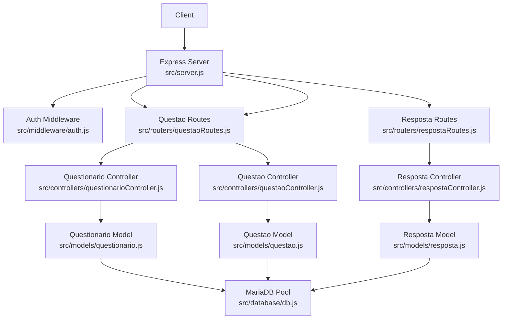
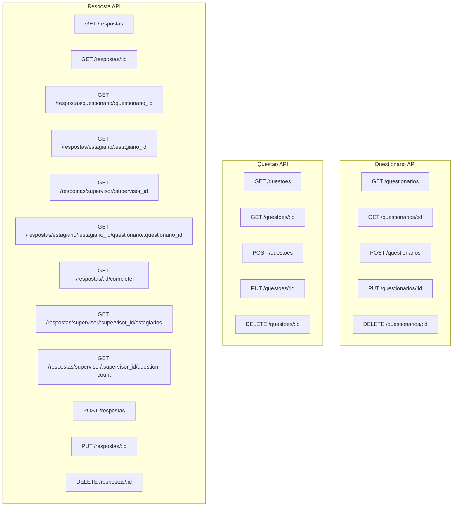
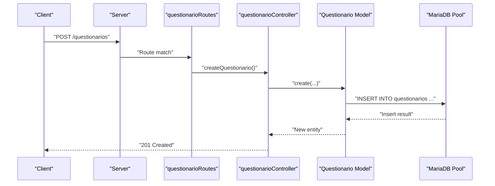
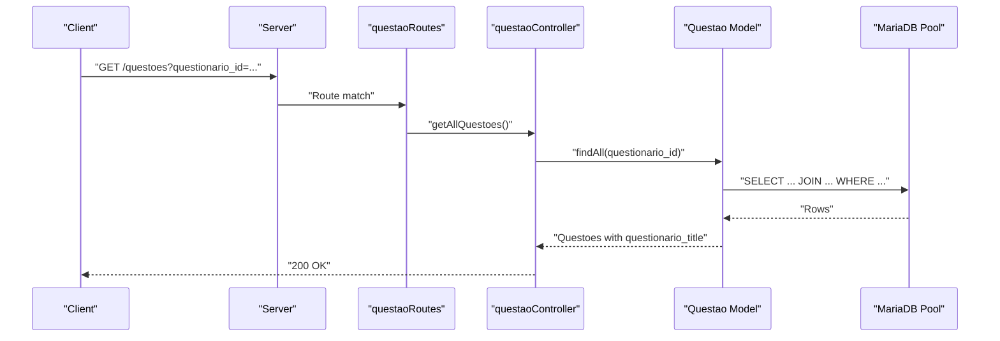
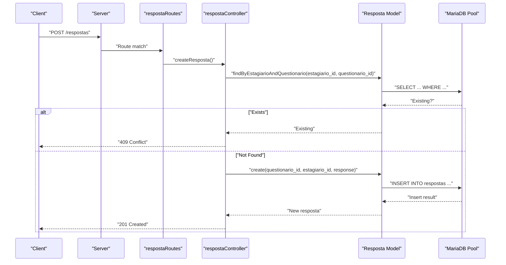
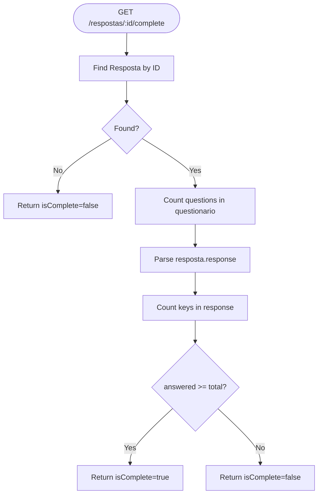
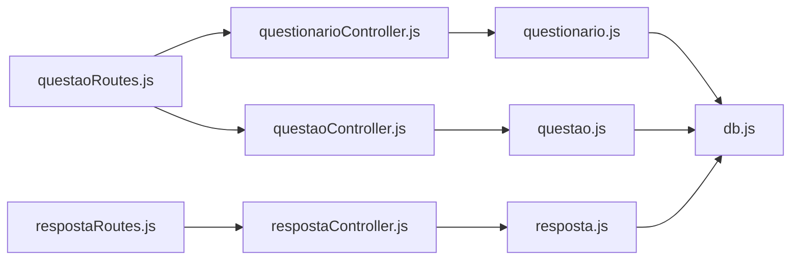

# Questionnaire & Assessment APIs

<cite>
**Referenced Files in This Document**
- [src/server.js](file://src/server.js)
- [src/middleware/auth.js](file://src/middleware/auth.js)
- [src/routers/questionarioRoutes.js](file://src/routers/questionarioRoutes.js)
- [src/controllers/questionarioController.js](file://src/controllers/questionarioController.js)
- [src/models/questionario.js](file://src/models/questionario.js)
- [src/routers/questaoRoutes.js](file://src/routers/questaoRoutes.js)
- [src/controllers/questaoController.js](file://src/controllers/questaoController.js)
- [src/models/questao.js](file://src/models/questao.js)
- [src/routers/respostaRoutes.js](file://src/routers/respostaRoutes.js)
- [src/controllers/respostaController.js](file://src/controllers/respostaController.js)
- [src/models/resposta.js](file://src/models/resposta.js)
- [src/database/db.js](file://src/database/db.js)
</cite>

## Table of Contents
1. [Introduction](#introduction)
2. [Project Structure](#project-structure)
3. [Core Components](#core-components)
4. [Architecture Overview](#architecture-overview)
5. [Detailed Component Analysis](#detailed-component-analysis)
6. [Dependency Analysis](#dependency-analysis)
7. [Performance Considerations](#performance-considerations)
8. [Troubleshooting Guide](#troubleshooting-guide)
9. [Conclusion](#conclusion)

## Introduction
This document provides comprehensive API documentation for questionnaire and assessment management endpoints. It covers:
- Questionario endpoints for listing, retrieving, creating, updating, and deleting questionnaires
- Questao endpoints for managing questions within questionnaires
- Resposta endpoints for collecting student responses, validating completeness, and reporting
- Authentication and authorization requirements for different roles
- Nested routing patterns and questionnaire completion workflows

## Project Structure
The API follows a layered architecture:
- Routes define endpoint patterns and bind to controllers
- Controllers orchestrate business logic and coordinate model operations
- Models encapsulate database interactions via a shared MariaDB connection pool
- Middleware enforces authentication and authorization policies

**Diagram sources**
- [src/server.js](file://src/server.js#L31-L54)
- [src/middleware/auth.js](file://src/middleware/auth.js#L6-L29)
- [src/routers/questionarioRoutes.js](file://src/routers/questionarioRoutes.js#L1-L16)
- [src/routers/questaoRoutes.js](file://src/routers/questaoRoutes.js#L1-L17)
- [src/routers/respostaRoutes.js](file://src/routers/respostaRoutes.js#L1-L49)
- [src/controllers/questionarioController.js](file://src/controllers/questionarioController.js#L1-L72)
- [src/controllers/questaoController.js](file://src/controllers/questaoController.js#L1-L72)
- [src/controllers/respostaController.js](file://src/controllers/respostaController.js#L1-L169)
- [src/models/questionario.js](file://src/models/questionario.js#L1-L38)
- [src/models/questao.js](file://src/models/questao.js#L1-L53)
- [src/models/resposta.js](file://src/models/resposta.js#L1-L183)
- [src/database/db.js](file://src/database/db.js#L1-L15)

**Section sources**
- [src/server.js](file://src/server.js#L31-L54)

## Core Components
- Questionario: CRUD operations for questionnaires
- Questao: CRUD operations for questions within a questionnaire
- Resposta: CRUD operations for student responses, completeness checks, and reporting helpers

Key responsibilities:
- Validation: Responses are validated for existence before creation and completeness is checked against question counts
- Reporting: Helpers compute counts and groupings by supervisors and questionarios
- Ownership: Authorization ensures only authorized users can access or modify resources

**Section sources**
- [src/controllers/questionarioController.js](file://src/controllers/questionarioController.js#L1-L72)
- [src/controllers/questaoController.js](file://src/controllers/questaoController.js#L1-L72)
- [src/controllers/respostaController.js](file://src/controllers/respostaController.js#L1-L169)

## Architecture Overview
Endpoints are mounted under base paths:
- /questionarios for questionario operations
- /questoes for questao operations
- /respostas for resposta operations

Nested routes enable advanced queries such as:
- /respostas/supervisor/:supervisor_id/estagiarios
- /respostas/estagiario/:estagiario_id/questionario/:questionario_id
- /respostas/:id/complete
- /respostas/supervisor/:supervisor_id/question-count

**Diagram sources**
- [src/routers/questionarioRoutes.js](file://src/routers/questionarioRoutes.js#L10-L14)
- [src/routers/questaoRoutes.js](file://src/routers/questaoRoutes.js#L11-L15)
- [src/routers/respostaRoutes.js](file://src/routers/respostaRoutes.js#L20-L46)

## Detailed Component Analysis

### Questionario Endpoints
- Base path: /questionarios
- Methods:
  - GET /questionarios: List all questionarios
  - GET /questionarios/:id: Retrieve a specific questionnaire
  - POST /questionarios: Create a new questionnaire
  - PUT /questionarios/:id: Update an existing questionnaire
  - DELETE /questionarios/:id: Remove a questionnaire

Processing logic:
- Controllers delegate to the Questionario model
- Model executes SQL INSERT/SELECT/UPDATE/DELETE via the MariaDB pool
- Error handling returns 500 with a generic message; not-found returns 404

**Diagram sources**
- [src/routers/questionarioRoutes.js](file://src/routers/questionarioRoutes.js#L10-L14)
- [src/controllers/questionarioController.js](file://src/controllers/questionarioController.js#L5-L14)
- [src/models/questionario.js](file://src/models/questionario.js#L5-L10)
- [src/database/db.js](file://src/database/db.js#L5-L13)

**Section sources**
- [src/routers/questionarioRoutes.js](file://src/routers/questionarioRoutes.js#L1-L16)
- [src/controllers/questionarioController.js](file://src/controllers/questionarioController.js#L1-L72)
- [src/models/questionario.js](file://src/models/questionario.js#L1-L38)

### Questao Endpoints
- Base path: /questoes
- Methods:
  - GET /questoes: List all questions (optional filter by questionario_id)
  - GET /questoes/:id: Retrieve a specific question
  - POST /questoes: Create a new question
  - PUT /questoes/:id: Update an existing question
  - DELETE /questoes/:id: Remove a question

Processing logic:
- Controllers delegate to the Questao model
- Model joins questoes with questionarios to enrich responses with questionario title
- Optional query parameter filters by questionario_id

**Diagram sources**
- [src/routers/questaoRoutes.js](file://src/routers/questaoRoutes.js#L11-L15)
- [src/controllers/questaoController.js](file://src/controllers/questaoController.js#L16-L26)
- [src/models/questao.js](file://src/models/questao.js#L13-L24)
- [src/database/db.js](file://src/database/db.js#L5-L13)

**Section sources**
- [src/routers/questaoRoutes.js](file://src/routers/questaoRoutes.js#L1-L17)
- [src/controllers/questaoController.js](file://src/controllers/questaoController.js#L1-L72)
- [src/models/questao.js](file://src/models/questao.js#L1-L53)

### Resposta Endpoints
- Base path: /respostas
- Methods:
  - GET /respostas: List all respostas (optional filter by supervisor_id)
  - GET /respostas/:id: Retrieve a specific resposta
  - GET /respostas/questionario/:questionario_id: List all respostas for a given questionario
  - GET /respostas/estagiario/:estagiario_id: List all respostas for a given estagiario
  - GET /respostas/supervisor/:supervisor_id: List all respostas for a given supervisor
  - GET /respostas/estagiario/:estagiario_id/questionario/:questionario_id: Retrieve a specific resposta by estagiario and questionario
  - GET /respostas/:id/complete: Check if a resposta is complete (answered all questions)
  - GET /respostas/supervisor/:supervisor_id/estagiarios: List estagiarios supervised by a supervisor
  - GET /respostas/supervisor/:supervisor_id/question-count: Count total questions across all questionarios
  - POST /respostas: Create a new resposta (prevents duplicates)
  - PUT /respostas/:id: Update an existing resposta
  - DELETE /respostas/:id: Delete a resposta

Processing logic:
- Controllers delegate to the Resposta model
- Creation prevents duplicate submissions for the same estagiario-questionario pair
- Completeness check compares number of answered keys in response with total question count
- Reporting helpers aggregate data across supervisors and questionarios

**Diagram sources**
- [src/routers/respostaRoutes.js](file://src/routers/respostaRoutes.js#L42-L46)
- [src/controllers/respostaController.js](file://src/controllers/respostaController.js#L82-L100)
- [src/models/resposta.js](file://src/models/resposta.js#L82-L96)
- [src/models/resposta.js](file://src/models/resposta.js#L115-L133)
- [src/database/db.js](file://src/database/db.js#L5-L13)

**Section sources**
- [src/routers/respostaRoutes.js](file://src/routers/respostaRoutes.js#L1-L49)
- [src/controllers/respostaController.js](file://src/controllers/respostaController.js#L1-L169)
- [src/models/resposta.js](file://src/models/resposta.js#L1-L183)

### Nested Routing Patterns
- Supervisor-to-estagiarios: GET /respostas/supervisor/:supervisor_id/estagiarios
- Estagiario-to-Questionario lookup: GET /respostas/estagiario/:estagiario_id/questionario/:questionario_id
- Completeness check: GET /respostas/:id/complete
- Question count by supervisor: GET /respostas/supervisor/:supervisor_id/question-count

These routes are registered before generic routes to avoid conflicts with numeric IDs.

**Section sources**
- [src/routers/respostaRoutes.js](file://src/routers/respostaRoutes.js#L20-L30)

### Questionnaire Completion Workflow
The system validates whether a student has completed a questionnaire by comparing:
- Total number of questions in the questionnaire
- Number of keys in the resposta.response object

**Diagram sources**
- [src/controllers/respostaController.js](file://src/controllers/respostaController.js#L158-L168)
- [src/models/resposta.js](file://src/models/resposta.js#L167-L179)

**Section sources**
- [src/controllers/respostaController.js](file://src/controllers/respostaController.js#L158-L168)
- [src/models/resposta.js](file://src/models/resposta.js#L158-L179)

### Scoring Mechanisms
- The current implementation does not expose explicit scoring endpoints
- Scoring would require:
  - A scoring engine to evaluate resposta.response against correct answers
  - Storage of question weights and correct options
  - Aggregation endpoints for per-student and per-supervisor scores

Recommendation:
- Extend the resposta model with a score field and add endpoints to compute and retrieve scores
- Add a scoring service that validates and scores responses

[No sources needed since this section provides general guidance]

### Reporting Capabilities
Available reporting endpoints:
- GET /respostas/supervisor/:supervisor_id/estagiarios: List estagiarios supervised by a supervisor
- GET /respostas/supervisor/:supervisor_id/question-count: Count total questions across all questionarios
- GET /respostas/questionario/:questionario_id: List all respostas for a given questionario
- GET /respostas/estagiario/:estagiario_id: List all respostas for a given estagiario
- GET /respostas/supervisor/:supervisor_id: List all respostas for a given supervisor

These endpoints support administrative dashboards and supervision workflows.

**Section sources**
- [src/routers/respostaRoutes.js](file://src/routers/respostaRoutes.js#L20-L46)
- [src/controllers/respostaController.js](file://src/controllers/respostaController.js#L134-L156)
- [src/models/resposta.js](file://src/models/resposta.js#L141-L165)

### Authentication and Authorization
- Token verification: Routes protected by verifyToken middleware
- Role-based access: checkRole middleware restricts endpoints to allowed roles
- Ownership checks: checkOwnership and checkInscricaoOwnership enforce resource ownership rules
- Current usage:
  - Authentication middleware is imported but not applied to questionnaire/questao/resposta routes in the provided server file
  - Authorization policies should be applied to admin-only endpoints (e.g., questionnaire CRUD) and student-accessible endpoints (e.g., resposta submission)

Recommendation:
- Apply appropriate auth and role middleware to each route group
- Define roles: admin, professor, orientador (supervisor), aluno (student)
- Enforce ownership for student-accessible endpoints

**Section sources**
- [src/middleware/auth.js](file://src/middleware/auth.js#L6-L29)
- [src/middleware/auth.js](file://src/middleware/auth.js#L32-L48)
- [src/middleware/auth.js](file://src/middleware/auth.js#L76-L98)
- [src/middleware/auth.js](file://src/middleware/auth.js#L100-L136)
- [src/server.js](file://src/server.js#L31-L54)

## Dependency Analysis
- Route-layer dependencies:
  - questionarioRoutes -> questionarioController
  - questaoRoutes -> questaoController
  - respostaRoutes -> respostaController
- Controller-layer dependencies:
  - questionarioController -> questionario.js
  - questaoController -> questao.js
  - respostaController -> resposta.js
- Model-layer dependencies:
  - All models -> db.js (MariaDB pool)

**Diagram sources**
- [src/routers/questionarioRoutes.js](file://src/routers/questionarioRoutes.js#L1-L16)
- [src/controllers/questionarioController.js](file://src/controllers/questionarioController.js#L1-L72)
- [src/models/questionario.js](file://src/models/questionario.js#L1-L38)
- [src/routers/questaoRoutes.js](file://src/routers/questaoRoutes.js#L1-L17)
- [src/controllers/questaoController.js](file://src/controllers/questaoController.js#L1-L72)
- [src/models/questao.js](file://src/models/questao.js#L1-L53)
- [src/routers/respostaRoutes.js](file://src/routers/respostaRoutes.js#L1-L49)
- [src/controllers/respostaController.js](file://src/controllers/respostaController.js#L1-L169)
- [src/models/resposta.js](file://src/models/resposta.js#L1-L183)
- [src/database/db.js](file://src/database/db.js#L1-L15)

**Section sources**
- [src/server.js](file://src/server.js#L31-L54)

## Performance Considerations
- Database pooling: The MariaDB pool is configured with connection limits; ensure adequate pool size for concurrent requests
- Query optimization: Prefer indexed columns in WHERE clauses (e.g., questionario_id, estagiario_id, supervisor_id)
- Payload sizes: Respostas store JSON; consider limiting response payload sizes and normalizing data if needed
- Pagination: For large datasets, implement pagination in list endpoints

[No sources needed since this section provides general guidance]

## Troubleshooting Guide
Common issues and resolutions:
- 401 Unauthorized: Ensure a valid Authorization header with a bearer token is present
- 403 Forbidden: Verify the user’s role matches the required permissions
- 404 Not Found: Confirm resource IDs exist and routes are correct
- 409 Conflict on resposta creation: A resposta for the same estagiario-questionario pair already exists
- 500 Internal Server Error: Check server logs for database errors and model exceptions

Operational tips:
- Validate request payloads before sending to endpoints
- Use nested routes for complex queries to reduce client-side filtering
- Monitor database pool usage and adjust limits as needed

**Section sources**
- [src/middleware/auth.js](file://src/middleware/auth.js#L6-L29)
- [src/middleware/auth.js](file://src/middleware/auth.js#L32-L48)
- [src/controllers/respostaController.js](file://src/controllers/respostaController.js#L87-L91)
- [src/controllers/questionarioController.js](file://src/controllers/questionarioController.js#L33-L40)
- [src/controllers/questaoController.js](file://src/controllers/questaoController.js#L33-L41)
- [src/controllers/respostaController.js](file://src/controllers/respostaController.js#L45-L52)

## Conclusion
The questionnaire and assessment API provides a solid foundation for managing questionnaires, questions, and student responses. To enhance production readiness:
- Apply authentication and authorization middleware consistently
- Implement scoring endpoints and normalization of response storage
- Add pagination and indexing for improved performance
- Expand reporting with aggregated statistics and export capabilities

[No sources needed since this section summarizes without analyzing specific files]