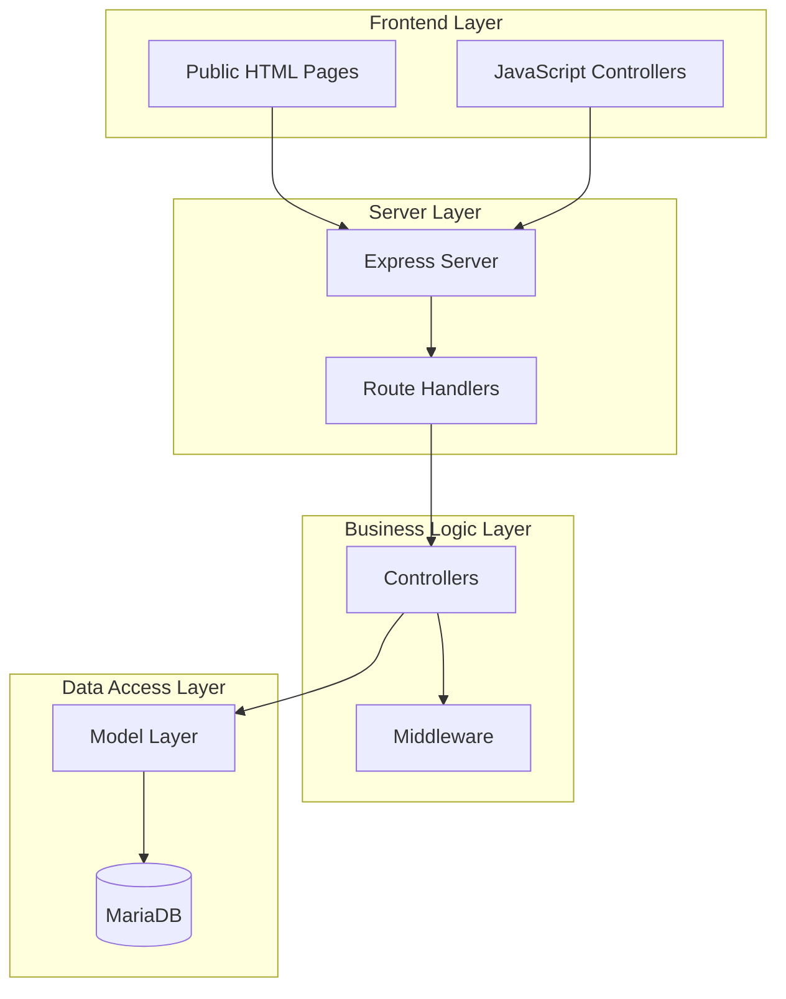
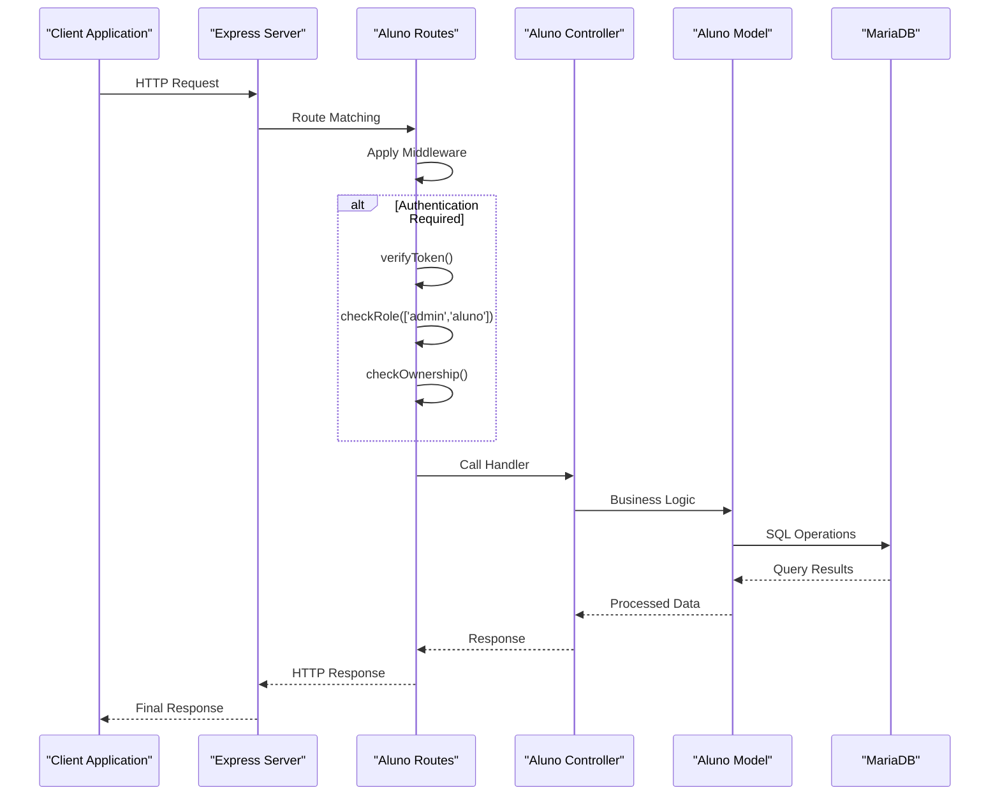
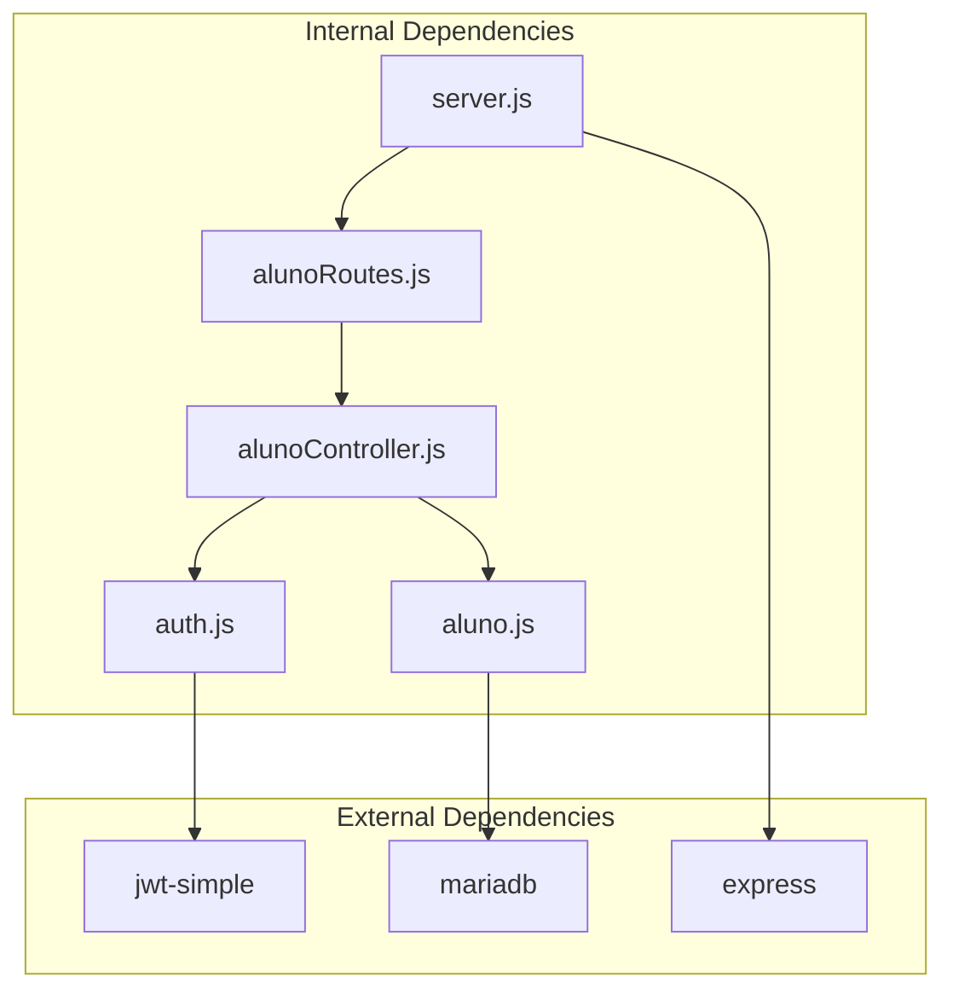
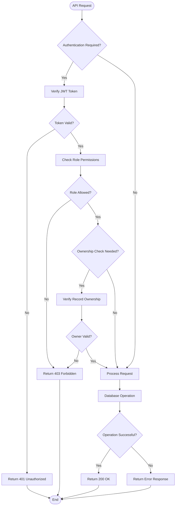

# Student Management APIs

<cite>
**Referenced Files in This Document**
- [server.js](file://src/server.js)
- [alunoRoutes.js](file://src/routers/alunoRoutes.js)
- [alunoController.js](file://src/controllers/alunoController.js)
- [aluno.js](file://src/models/aluno.js)
- [auth.js](file://src/middleware/auth.js)
- [db.js](file://src/database/db.js)
- [AUTH_GUIDE.md](file://AUTH_GUIDE.md)
- [new-aluno.js](file://public/new-aluno.js)
- [view-aluno.js](file://public/view-aluno.js)
</cite>

## Table of Contents
1. [Introduction](#introduction)
2. [Project Structure](#project-structure)
3. [Core Components](#core-components)
4. [Architecture Overview](#architecture-overview)
5. [Detailed Component Analysis](#detailed-component-analysis)
6. [Dependency Analysis](#dependency-analysis)
7. [Performance Considerations](#performance-considerations)
8. [Troubleshooting Guide](#troubleshooting-guide)
9. [Conclusion](#conclusion)

## Introduction
This document provides comprehensive API documentation for the student management endpoints in the NodeMural application. It covers all CRUD operations for students, including listing with filtering, retrieving individual records, fetching associated internship and registration records, creating new students, updating existing records with ownership verification, and deleting students with referential integrity checks. The documentation includes request schemas, response formats, error handling for duplicate registrations, and role-based access permissions for admin and student users.

## Project Structure
The student management functionality is implemented using a layered architecture with clear separation of concerns:



**Diagram sources**
- [server.js](file://src/server.js#L31-L53)
- [alunoRoutes.js](file://src/routers/alunoRoutes.js#L1-L25)
- [alunoController.js](file://src/controllers/alunoController.js#L1-L114)

**Section sources**
- [server.js](file://src/server.js#L31-L53)
- [alunoRoutes.js](file://src/routers/alunoRoutes.js#L1-L25)

## Core Components
The student management system consists of four primary components working together:

### Request Processing Pipeline
1. **Route Handlers**: Define endpoint URLs and apply middleware
2. **Controllers**: Handle business logic and coordinate between layers
3. **Models**: Manage database operations and data validation
4. **Middleware**: Enforce authentication, authorization, and ownership checks

### Database Schema
The system operates on a MariaDB database with the following key tables:
- `alunos`: Student records with unique registration numbers
- `estagiarios`: Internship records linked to students
- `inscricoes`: Registration records linked to students and opportunities

**Section sources**
- [aluno.js](file://src/models/aluno.js#L1-L146)
- [db.js](file://src/database/db.js#L1-L15)

## Architecture Overview
The API follows a RESTful architecture with JWT-based authentication and role-based access control:



**Diagram sources**
- [alunoRoutes.js](file://src/routers/alunoRoutes.js#L15-L23)
- [alunoController.js](file://src/controllers/alunoController.js#L5-L114)
- [auth.js](file://src/middleware/auth.js#L6-L98)

## Detailed Component Analysis

### API Endpoints

#### GET /alunos
**Purpose**: Retrieve all student records with optional filtering capabilities

**Authentication**: Not required (public endpoint)

**Query Parameters**:
- `search` (optional): Text search across name, social name, registration number, and email

**Response Format**:
```json
[
  {
    "id": 1,
    "nome": "string",
    "nomesocial": "string",
    "registro": "string",
    "email": "string",
    "ingresso": "string",
    "telefone": "string",
    "celular": "string",
    "cpf": "string",
    "identidade": "string",
    "orgao": "string",
    "nascimento": "date",
    "cep": "string",
    "endereco": "string",
    "municipio": "string",
    "bairro": "string",
    "observacoes": "text"
  }
]
```

**Error Responses**:
- 500: Internal server error during data retrieval

**Section sources**
- [alunoRoutes.js](file://src/routers/alunoRoutes.js#L16-L16)
- [alunoController.js](file://src/controllers/alunoController.js#L31-L40)
- [aluno.js](file://src/models/aluno.js#L28-L42)

#### GET /alunos/:id
**Purpose**: Retrieve a specific student by ID

**Authentication**: Not required (public endpoint)

**Path Parameters**:
- `id`: Student identifier

**Response Format**: Same as GET /alunos but returns a single student object

**Error Responses**:
- 404: Student not found
- 500: Internal server error

**Section sources**
- [alunoRoutes.js](file://src/routers/alunoRoutes.js#L12-L12)
- [alunoController.js](file://src/controllers/alunoController.js#L42-L56)
- [aluno.js](file://src/models/aluno.js#L44-L51)

#### GET /alunos/:id/estagiarios
**Purpose**: Fetch all internship records associated with a specific student

**Authentication**: Required (JWT token)

**Path Parameters**:
- `id`: Student identifier

**Response Format**:
```json
[
  {
    "id": 1,
    "aluno_id": 1,
    "nivel": "integer",
    "periodo": "string",
    "professor_nome": "string",
    "supervisor_nome": "string",
    "instituicao_nome": "string"
  }
]
```

**Error Responses**:
- 404: Student not found or no internships exist
- 401: Unauthorized access
- 500: Internal server error

**Section sources**
- [alunoRoutes.js](file://src/routers/alunoRoutes.js#L17-L17)
- [alunoController.js](file://src/controllers/alunoController.js#L58-L71)
- [aluno.js](file://src/models/aluno.js#L74-L95)

#### GET /alunos/:id/inscricoes
**Purpose**: Retrieve all registration records for a specific student

**Authentication**: Required (JWT token)

**Path Parameters**:
- `id`: Student identifier

**Response Format**:
```json
[
  {
    "id": 1,
    "aluno_id": 1,
    "muralestagio_id": 1,
    "data_inscricao": "datetime",
    "periodo": "string",
    "mural_instituicao": "string"
  }
]
```

**Error Responses**:
- 401: Unauthorized access
- 500: Internal server error

**Section sources**
- [alunoRoutes.js](file://src/routers/alunoRoutes.js#L18-L18)
- [alunoController.js](file://src/controllers/alunoController.js#L73-L83)
- [aluno.js](file://src/models/aluno.js#L97-L115)

#### POST /alunos
**Purpose**: Create a new student record

**Authentication**: Required (JWT token)

**Authorization**: Admin or Student role

**Request Body**:
```json
{
  "nome": "string",
  "nomesocial": "string",
  "ingresso": "string",
  "turno": "string",
  "registro": "string",
  "telefone": "string",
  "celular": "string",
  "email": "string",
  "cpf": "string",
  "identidade": "string",
  "orgao": "string",
  "nascimento": "date",
  "cep": "string",
  "endereco": "string",
  "municipio": "string",
  "bairro": "string",
  "observacoes": "text"
}
```

**Response Format**: Created student object with generated ID

**Error Responses**:
- 400: Duplicate registration number (already exists)
- 401: Unauthorized access
- 403: Insufficient permissions
- 500: Internal server error

**Validation Rules**:
- Registration number must be unique
- Required fields: nome, registro, email
- Email format validation
- CPF format validation (when provided)

**Section sources**
- [alunoRoutes.js](file://src/routers/alunoRoutes.js#L21-L21)
- [alunoController.js](file://src/controllers/alunoController.js#L4-L14)
- [aluno.js](file://src/models/aluno.js#L10-L20)
- [new-aluno.js](file://public/new-aluno.js#L54-L134)

#### PUT /alunos/:id
**Purpose**: Update an existing student record

**Authentication**: Required (JWT token)

**Authorization**: Admin or Student role with ownership verification

**Ownership Verification**: Students can only modify their own records

**Path Parameters**:
- `id`: Student identifier to update

**Request Body**: Same as POST /alunos

**Response Format**: Updated student object

**Error Responses**:
- 401: Unauthorized access
- 403: Access denied (not authorized to modify this record)
- 404: Student not found
- 500: Internal server error

**Section sources**
- [alunoRoutes.js](file://src/routers/alunoRoutes.js#L22-L22)
- [alunoController.js](file://src/controllers/alunoController.js#L85-L99)
- [aluno.js](file://src/models/aluno.js#L117-L123)
- [auth.js](file://src/middleware/auth.js#L76-L98)

#### DELETE /alunos/:id
**Purpose**: Remove a student record

**Authentication**: Required (JWT token)

**Authorization**: Admin only

**Path Parameters**:
- `id`: Student identifier to delete

**Pre-deletion Checks**:
- Student must not have associated internship records
- Student must not have associated registration records

**Response Format**: Deleted student object

**Error Responses**:
- 401: Unauthorized access
- 403: Insufficient permissions
- 404: Student not found
- 409: Cannot delete - student has associated records
- 500: Internal server error

**Section sources**
- [alunoRoutes.js](file://src/routers/alunoRoutes.js#L23-L23)
- [alunoController.js](file://src/controllers/alunoController.js#L101-L114)
- [aluno.js](file://src/models/aluno.js#L125-L143)

### Authentication and Authorization

#### JWT Token Management
The system uses JWT tokens for authentication with the following structure:
- Token format: Bearer token in Authorization header
- Secret key stored in environment variables
- Expiration configurable via environment

#### Role-Based Access Control
Supported roles with their permissions:
- **admin**: Full access to all endpoints
- **aluno**: Can view own data, create/update own records
- **docente**: Can manage alunos, atividades
- **supervisor**: Can manage estagiarios, view inscriptions

#### Ownership Verification
Students can only access or modify their own records through the `checkOwnership` middleware, which compares the requested ID with the user's `entidade_id`.

**Section sources**
- [auth.js](file://src/middleware/auth.js#L6-L98)
- [AUTH_GUIDE.md](file://AUTH_GUIDE.md#L194-L202)

## Dependency Analysis



**Diagram sources**
- [server.js](file://src/server.js#L8-L26)
- [alunoRoutes.js](file://src/routers/alunoRoutes.js#L1-L4)
- [alunoController.js](file://src/controllers/alunoController.js#L1-L2)
- [aluno.js](file://src/models/aluno.js#L1-L2)
- [auth.js](file://src/middleware/auth.js#L1-L3)

### Data Flow Patterns

#### CRUD Operations Flow


**Diagram sources**
- [alunoController.js](file://src/controllers/alunoController.js#L5-L114)
- [auth.js](file://src/middleware/auth.js#L6-L98)

**Section sources**
- [alunoController.js](file://src/controllers/alunoController.js#L1-L114)
- [auth.js](file://src/middleware/auth.js#L1-L137)

## Performance Considerations
- **Database Indexing**: Consider adding indexes on frequently searched columns (registro, email, nome)
- **Query Optimization**: The current implementation performs LIKE searches which can be slow on large datasets
- **Pagination**: Implement pagination for GET /alunos endpoint to handle large result sets
- **Connection Pooling**: Database connections are pooled automatically through the mariadb driver
- **Response Caching**: Consider caching static student information where appropriate

## Troubleshooting Guide

### Common Issues and Solutions

#### Authentication Problems
- **Issue**: 401 Token inválido or Token expirado
- **Solution**: Ensure JWT token is present in Authorization header and not expired

#### Authorization Problems  
- **Issue**: 403 Acesso negado. Permissão insuficiente.
- **Solution**: Verify user has required role (admin or aluno) and proper ownership for student records

#### Data Integrity Issues
- **Issue**: 400 Registro já em uso (duplicate registration)
- **Solution**: Use unique registration numbers; check existing records before creation

#### Deletion Failures
- **Issue**: 409 Cannot delete - student has associated records
- **Solution**: Remove associated estagiarios and inscricoes before deleting student

#### Frontend Integration
The frontend JavaScript files demonstrate proper token handling and form validation:
- [new-aluno.js](file://public/new-aluno.js#L18-L51) - Student creation with validation
- [view-aluno.js](file://public/view-aluno.js#L36-L149) - Student detail viewing with permission checks

**Section sources**
- [auth.js](file://src/middleware/auth.js#L22-L28)
- [aluno.js](file://src/models/aluno.js#L11-L14)
- [view-aluno.js](file://public/view-aluno.js#L166-L191)

## Conclusion
The student management API provides a robust, secure, and well-structured interface for managing student records with comprehensive authentication, authorization, and data integrity controls. The implementation follows RESTful principles with clear separation of concerns and includes proper error handling for common scenarios. The system supports both administrative and student-level access patterns while maintaining data consistency through referential integrity checks and validation rules.

Key strengths of the implementation include:
- Comprehensive JWT-based authentication system
- Role-based access control with ownership verification
- Proper error handling and validation
- Clean separation between frontend and backend concerns
- Extensible architecture for future enhancements

Future improvements could include implementing pagination for large datasets, adding input validation at the controller level, and enhancing error messages for better debugging capabilities.