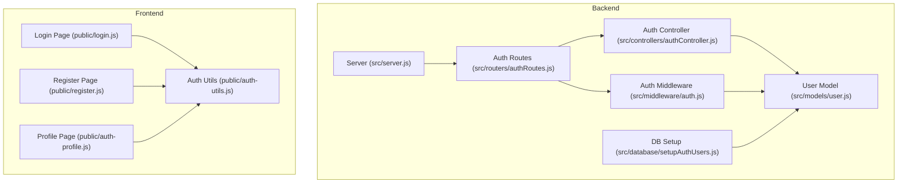
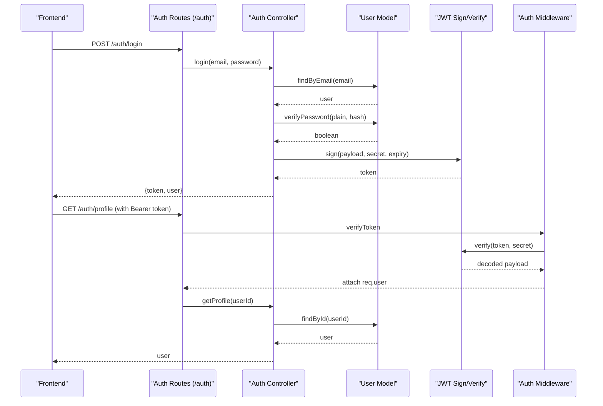
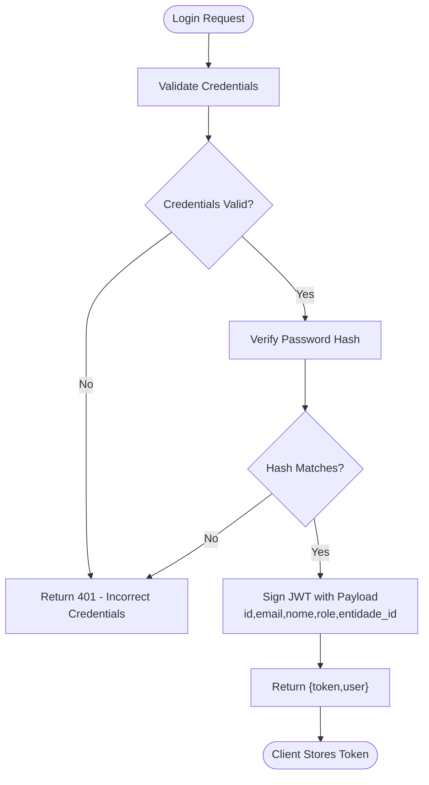
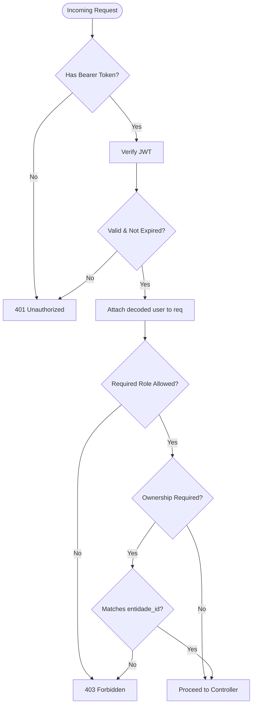
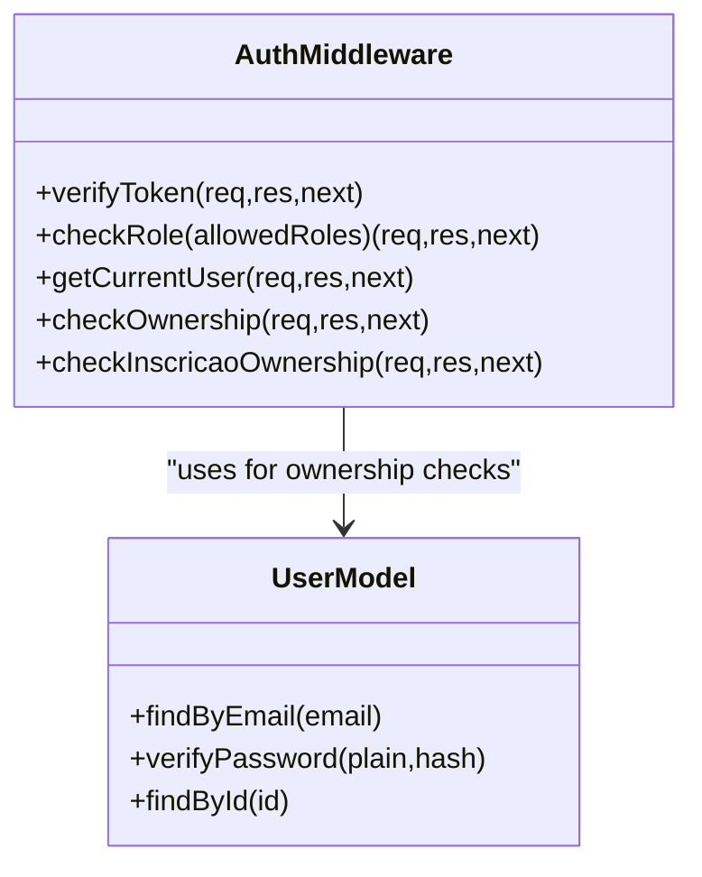
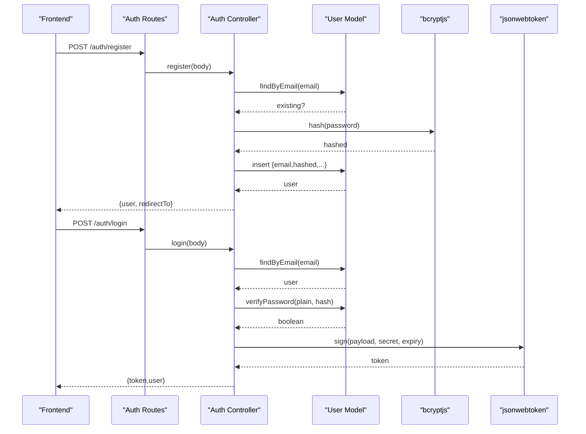
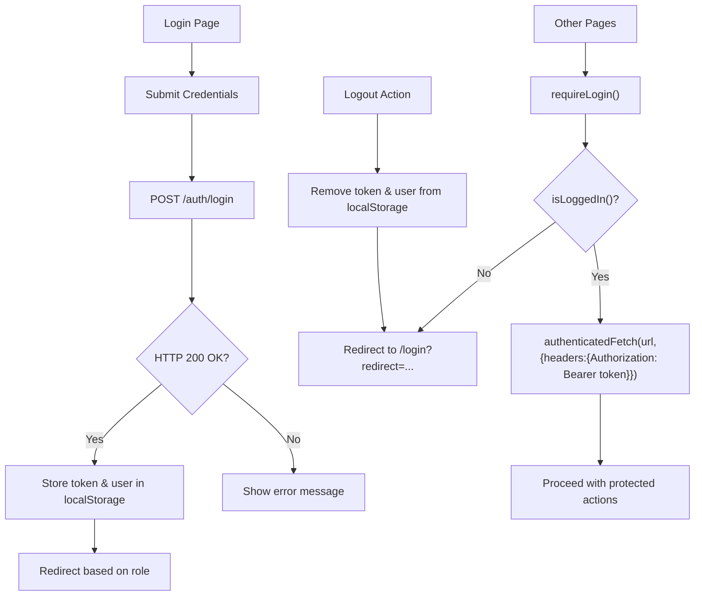
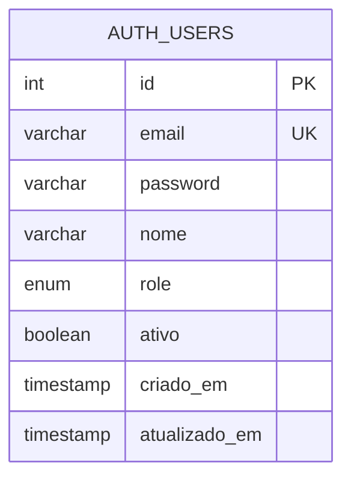
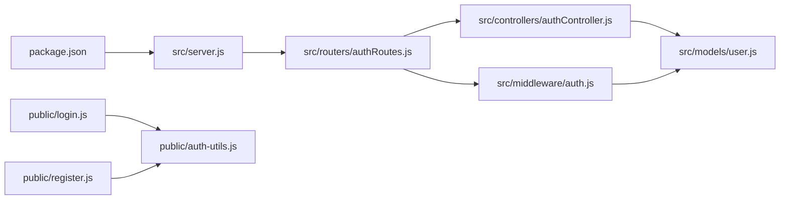

# Authentication & Authorization System

<cite>
**Referenced Files in This Document**
- [src/server.js](file://src/server.js)
- [src/routers/authRoutes.js](file://src/routers/authRoutes.js)
- [src/controllers/authController.js](file://src/controllers/authController.js)
- [src/middleware/auth.js](file://src/middleware/auth.js)
- [src/models/user.js](file://src/models/user.js)
- [src/database/setupAuthUsers.js](file://src/database/setupAuthUsers.js)
- [public/auth-utils.js](file://public/auth-utils.js)
- [public/login.js](file://public/login.js)
- [public/register.js](file://public/register.js)
- [public/auth-profile.js](file://public/auth-profile.js)
- [AUTH_GUIDE.md](file://AUTH_GUIDE.md)
- [package.json](file://package.json)
</cite>

## Table of Contents
1. [Introduction](#introduction)
2. [Project Structure](#project-structure)
3. [Core Components](#core-components)
4. [Architecture Overview](#architecture-overview)
5. [Detailed Component Analysis](#detailed-component-analysis)
6. [Dependency Analysis](#dependency-analysis)
7. [Performance Considerations](#performance-considerations)
8. [Troubleshooting Guide](#troubleshooting-guide)
9. [Conclusion](#conclusion)
10. [Appendices](#appendices)

## Introduction
This document explains the authentication and authorization system used by NodeMural. It covers JWT-based authentication, role-based access control (RBAC), middleware for token verification and ownership checks, user registration and login flows, password hashing with bcryptjs, and frontend integration patterns. It also documents the available API endpoints under the /auth namespace and outlines security best practices, token storage recommendations, and logout procedures.

## Project Structure
The authentication system spans backend Express routes, controllers, middleware, and models, plus frontend utilities and pages for login and registration. Environment variables are loaded via dotenv, and the auth_users table is initialized by a setup script.

**Diagram sources**
- [src/server.js](file://src/server.js#L31-L54)
- [src/routers/authRoutes.js](file://src/routers/authRoutes.js#L1-L20)
- [src/controllers/authController.js](file://src/controllers/authController.js#L1-L157)
- [src/middleware/auth.js](file://src/middleware/auth.js#L1-L137)
- [src/models/user.js](file://src/models/user.js#L1-L146)
- [src/database/setupAuthUsers.js](file://src/database/setupAuthUsers.js#L1-L38)
- [public/login.js](file://public/login.js#L1-L62)
- [public/register.js](file://public/register.js#L1-L127)
- [public/auth-utils.js](file://public/auth-utils.js#L1-L88)
- [public/auth-profile.js](file://public/auth-profile.js#L1-L29)

**Section sources**
- [src/server.js](file://src/server.js#L31-L54)
- [src/routers/authRoutes.js](file://src/routers/authRoutes.js#L1-L20)
- [AUTH_GUIDE.md](file://AUTH_GUIDE.md#L1-L312)

## Core Components
- JWT-based authentication: tokens are generated upon successful login and validated on protected routes.
- Password hashing: bcryptjs is used to hash passwords during registration.
- RBAC: roles define access levels; middleware enforces role checks and ownership validation.
- Frontend utilities: helpers for storing tokens, attaching Authorization headers, and enforcing login requirements.

Key implementation references:
- JWT secret and expiry are configured via environment variables.
- Token verification middleware decodes tokens and attaches user info to the request.
- Role-based middleware restricts access to specific roles.
- Ownership middleware ensures users can only access or modify their own records.

**Section sources**
- [src/controllers/authController.js](file://src/controllers/authController.js#L98-L127)
- [src/middleware/auth.js](file://src/middleware/auth.js#L6-L29)
- [src/middleware/auth.js](file://src/middleware/auth.js#L31-L48)
- [src/middleware/auth.js](file://src/middleware/auth.js#L76-L98)
- [src/models/user.js](file://src/models/user.js#L15-L16)
- [src/models/user.js](file://src/models/user.js#L101-L104)
- [public/auth-utils.js](file://public/auth-utils.js#L45-L54)

## Architecture Overview
The authentication flow integrates frontend and backend components. The frontend sends credentials to the backend, receives a JWT, stores it locally, and includes it in subsequent requests. Backend middleware verifies the token and enforces role and ownership policies.

**Diagram sources**
- [src/routers/authRoutes.js](file://src/routers/authRoutes.js#L8-L17)
- [src/controllers/authController.js](file://src/controllers/authController.js#L76-L127)
- [src/middleware/auth.js](file://src/middleware/auth.js#L6-L29)
- [src/models/user.js](file://src/models/user.js#L36-L47)
- [src/models/user.js](file://src/models/user.js#L101-L104)

## Detailed Component Analysis

### JWT-Based Authentication
- Token generation: On successful login, a signed JWT is created containing user identity and role, with an expiry configured via environment variables.
- Token validation: Middleware extracts the Authorization header, verifies the token signature, and attaches decoded user data to the request.
- Token storage: Frontend utilities store the token in localStorage and automatically include it in authenticated requests.

**Diagram sources**
- [src/controllers/authController.js](file://src/controllers/authController.js#L76-L127)
- [src/middleware/auth.js](file://src/middleware/auth.js#L6-L29)
- [public/login.js](file://public/login.js#L37-L61)

**Section sources**
- [src/controllers/authController.js](file://src/controllers/authController.js#L98-L127)
- [src/middleware/auth.js](file://src/middleware/auth.js#L6-L29)
- [public/auth-utils.js](file://public/auth-utils.js#L45-L54)

### Role-Based Access Control (RBAC)
- Supported roles: admin, supervisor, docente, aluno.
- Role enforcement: A higher-order middleware checks whether the authenticated user’s role is included in the allowed roles.
- Ownership checks: Specialized middleware allows admins full access and otherwise compares the requesting user’s entidade_id with the target resource.

**Diagram sources**
- [src/middleware/auth.js](file://src/middleware/auth.js#L31-L48)
- [src/middleware/auth.js](file://src/middleware/auth.js#L76-L98)

**Section sources**
- [src/middleware/auth.js](file://src/middleware/auth.js#L31-L48)
- [src/middleware/auth.js](file://src/middleware/auth.js#L76-L98)
- [AUTH_GUIDE.md](file://AUTH_GUIDE.md#L194-L202)

### Authentication Middleware Functionality
- verifyToken: Extracts Bearer token from Authorization header, verifies it, and sets req.user.
- checkRole: Enforces role-based access by ensuring the user’s role is within the allowed set.
- getCurrentUser: Returns decoded user info from a valid token without invoking controllers.
- checkOwnership: Allows admin access or validates that the user’s entidade_id matches the requested resource id.
- checkInscricaoOwnership: Validates ownership for inscricao records by matching aluno_id to the user’s entidade_id.

**Diagram sources**
- [src/middleware/auth.js](file://src/middleware/auth.js#L6-L137)
- [src/models/user.js](file://src/models/user.js#L36-L47)
- [src/models/user.js](file://src/models/user.js#L49-L59)

**Section sources**
- [src/middleware/auth.js](file://src/middleware/auth.js#L6-L137)

### User Registration and Login
- Registration: Validates inputs, confirms password match, hashes password, and inserts a new user into auth_users. Redirect behavior depends on role and whether an entidade_id is provided.
- Login: Finds user by email, verifies password, and generates a JWT with configurable expiry.

**Diagram sources**
- [src/controllers/authController.js](file://src/controllers/authController.js#L6-L74)
- [src/controllers/authController.js](file://src/controllers/authController.js#L76-L127)
- [src/models/user.js](file://src/models/user.js#L7-L34)
- [src/models/user.js](file://src/models/user.js#L101-L104)

**Section sources**
- [src/controllers/authController.js](file://src/controllers/authController.js#L6-L74)
- [src/controllers/authController.js](file://src/controllers/authController.js#L76-L127)
- [src/models/user.js](file://src/models/user.js#L7-L34)
- [src/models/user.js](file://src/models/user.js#L101-L104)

### Session Management and Frontend Integration
- Frontend stores token and user data in localStorage after login and uses a helper to attach Authorization headers to all authenticated requests.
- Pages can enforce login requirements and role checks before rendering sensitive content.
- Logout clears localStorage and redirects to the login page.

**Diagram sources**
- [public/login.js](file://public/login.js#L31-L61)
- [public/auth-utils.js](file://public/auth-utils.js#L8-L37)
- [public/auth-utils.js](file://public/auth-utils.js#L45-L54)
- [public/auth-utils.js](file://public/auth-utils.js#L83-L87)

**Section sources**
- [public/login.js](file://public/login.js#L1-L62)
- [public/register.js](file://public/register.js#L1-L127)
- [public/auth-utils.js](file://public/auth-utils.js#L1-L88)
- [public/auth-profile.js](file://public/auth-profile.js#L1-L29)

### API Endpoints for Authentication
- Public endpoints:
  - POST /auth/register: Creates a new user with hashed password.
  - POST /auth/login: Authenticates and returns a JWT.
  - GET /auth/me: Returns decoded user info from the token.
- Protected endpoints:
  - GET /auth/profile: Returns authenticated user profile.
  - GET /auth/users: Lists all users (admin only).

**Diagram sources**
- [src/database/setupAuthUsers.js](file://src/database/setupAuthUsers.js#L11-L22)

**Section sources**
- [src/routers/authRoutes.js](file://src/routers/authRoutes.js#L8-L17)
- [AUTH_GUIDE.md](file://AUTH_GUIDE.md#L66-L161)

## Dependency Analysis
The backend modules depend on Express, jsonwebtoken, bcryptjs, and dotenv. The auth routes depend on the auth controller and middleware, while the auth controller depends on the user model. The user model interacts with the MariaDB pool. Frontend utilities depend on localStorage and the fetch API.

**Diagram sources**
- [package.json](file://package.json#L22-L30)
- [src/server.js](file://src/server.js#L31-L54)
- [src/routers/authRoutes.js](file://src/routers/authRoutes.js#L1-L20)
- [src/controllers/authController.js](file://src/controllers/authController.js#L1-L157)
- [src/middleware/auth.js](file://src/middleware/auth.js#L1-L137)
- [src/models/user.js](file://src/models/user.js#L1-L146)
- [public/auth-utils.js](file://public/auth-utils.js#L1-L88)
- [public/login.js](file://public/login.js#L1-L62)
- [public/register.js](file://public/register.js#L1-L127)

**Section sources**
- [package.json](file://package.json#L22-L30)
- [src/server.js](file://src/server.js#L31-L54)

## Performance Considerations
- Token verification occurs on every protected request; keep JWT_SECRET secure and avoid overly large payloads in tokens.
- Password hashing uses a moderate cost factor; adjust bcrypt cost if performance requires balancing security and CPU usage.
- Use connection pooling efficiently and avoid unnecessary queries in middleware.
- Consider adding rate limiting and request timeouts for login/register endpoints.

## Troubleshooting Guide
Common errors and resolutions:
- 400 Validation errors: Missing or invalid fields during registration or login.
- 401 Token errors: Missing Authorization header, invalid token, or expired token.
- 401 Incorrect credentials: Email or password mismatch.
- 403 Access denied: Insufficient permissions or ownership violation.
- 500 Internal errors: Database or server issues.

Recommendations:
- Verify environment variables (JWT_SECRET, JWT_EXPIRY).
- Ensure frontend includes Authorization: Bearer <token> for protected endpoints.
- Confirm the auth_users table exists and user is active.
- Use the provided test token to validate JWT decoding.

**Section sources**
- [AUTH_GUIDE.md](file://AUTH_GUIDE.md#L289-L300)
- [src/middleware/auth.js](file://src/middleware/auth.js#L22-L28)
- [src/middleware/auth.js](file://src/middleware/auth.js#L68-L73)

## Conclusion
NodeMural’s authentication system provides a solid foundation with JWT-based login, bcryptjs password hashing, and RBAC enforcement. The frontend utilities streamline token handling and route protection. By following the documented patterns and best practices, teams can extend protection to additional routes and enhance security with rate limiting, HTTPS, and input validation.

## Appendices

### Security Best Practices
- Change JWT_SECRET in production and rotate secrets periodically.
- Use HTTPS in production to prevent token interception.
- Implement rate limiting for login/register endpoints.
- Add input validation and sanitization.
- Consider short-lived access tokens with refresh mechanisms if needed.
- Store tokens securely; avoid exposing tokens in logs or URLs.

### Token Storage Recommendations
- Frontend: Use localStorage for simplicity; consider sessionStorage for stricter scoping.
- Avoid storing tokens in cookies unless necessary; if using cookies, enable HttpOnly and SameSite flags.
- Clear tokens on logout and handle token expiration gracefully.

### Logout Procedures
- Remove token and user from localStorage.
- Optionally invalidate the token server-side if implementing token blacklists.
- Redirect to the login page.

**Section sources**
- [public/auth-utils.js](file://public/auth-utils.js#L33-L37)
- [AUTH_GUIDE.md](file://AUTH_GUIDE.md#L275-L279)