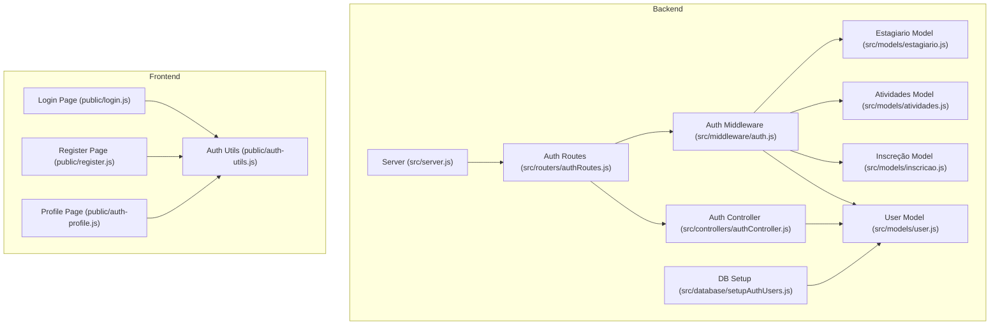
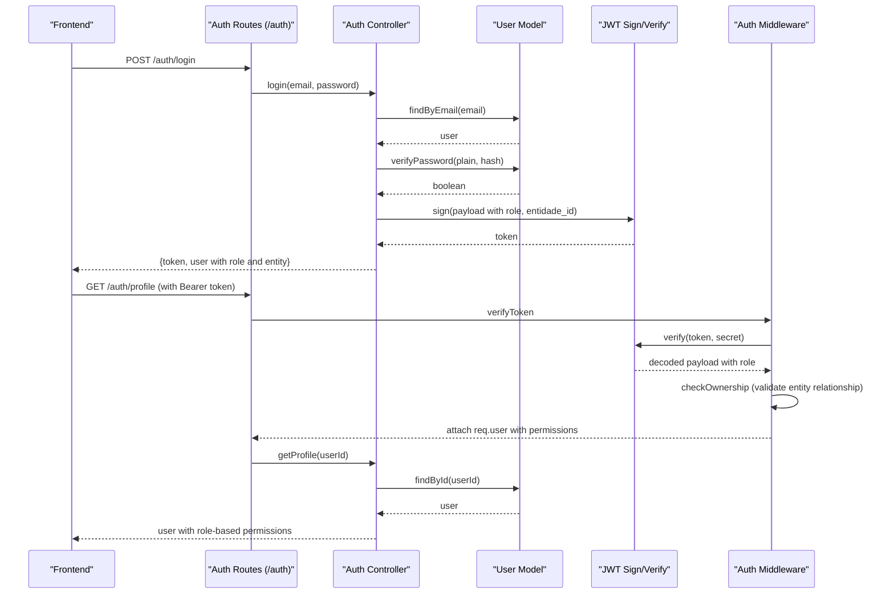
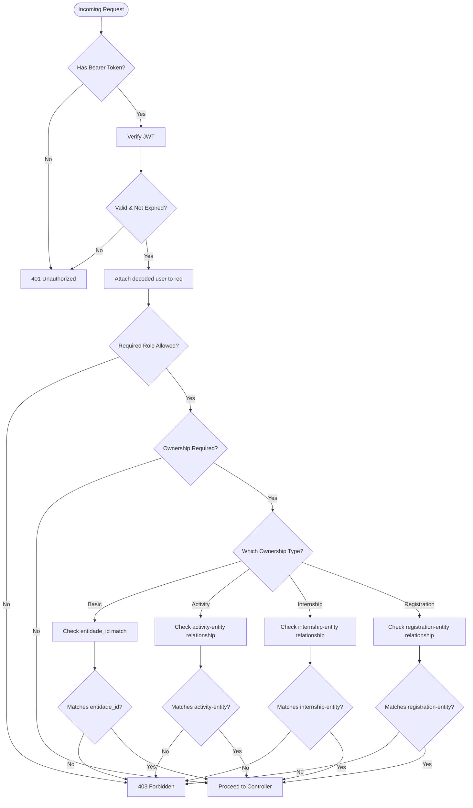
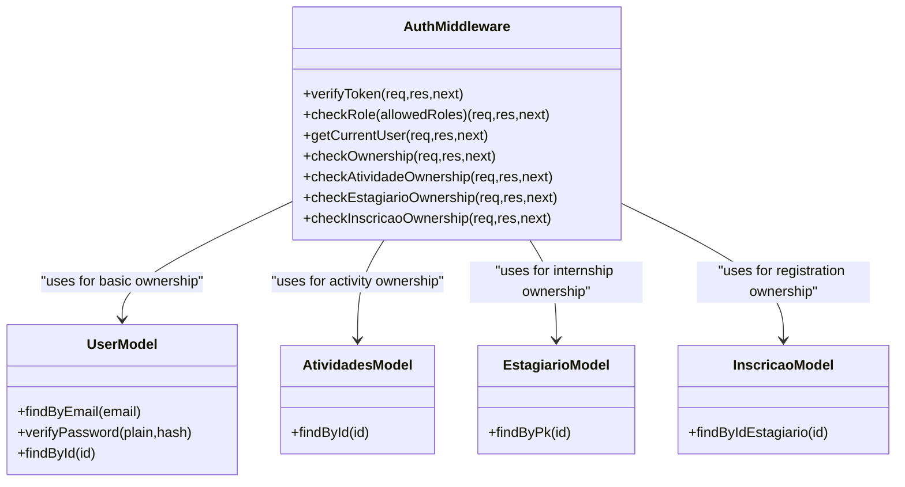
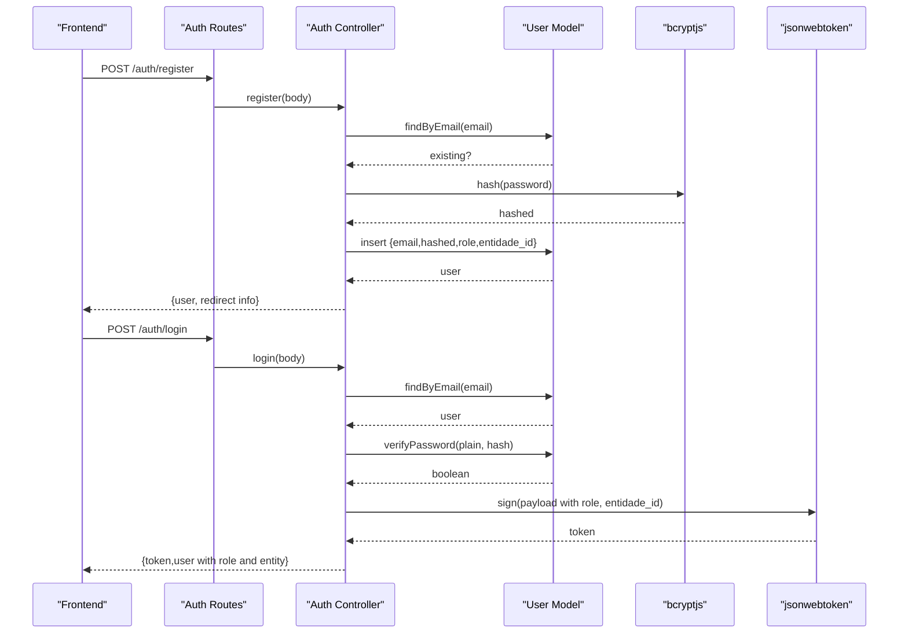
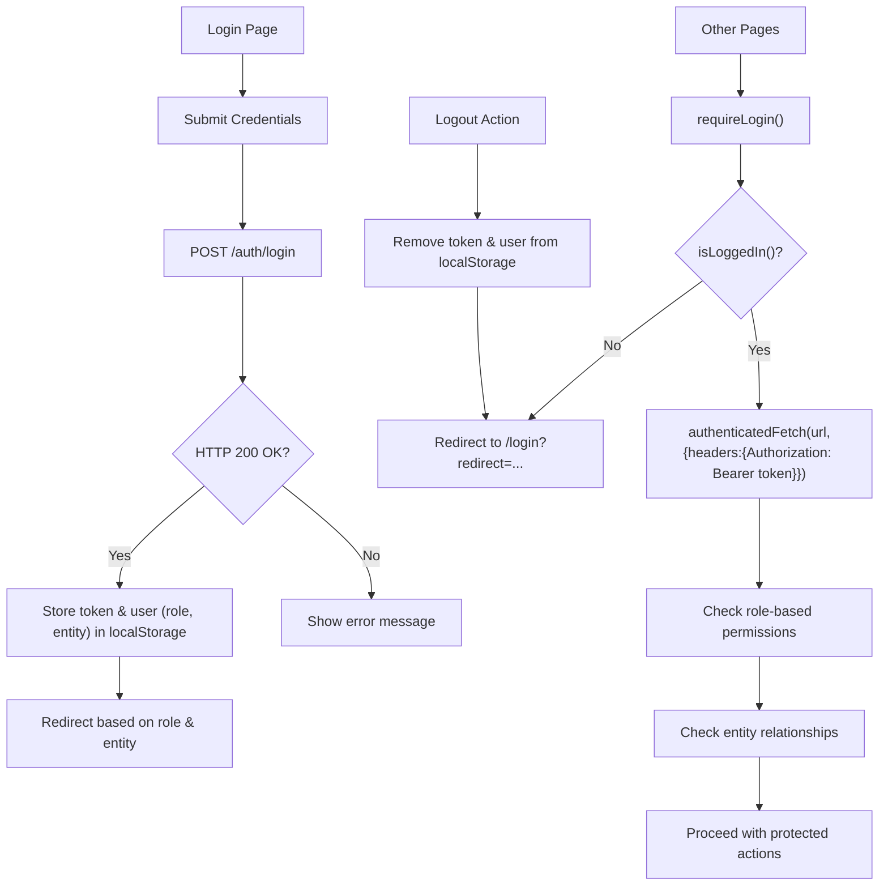
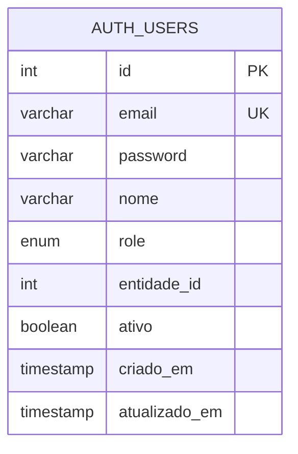
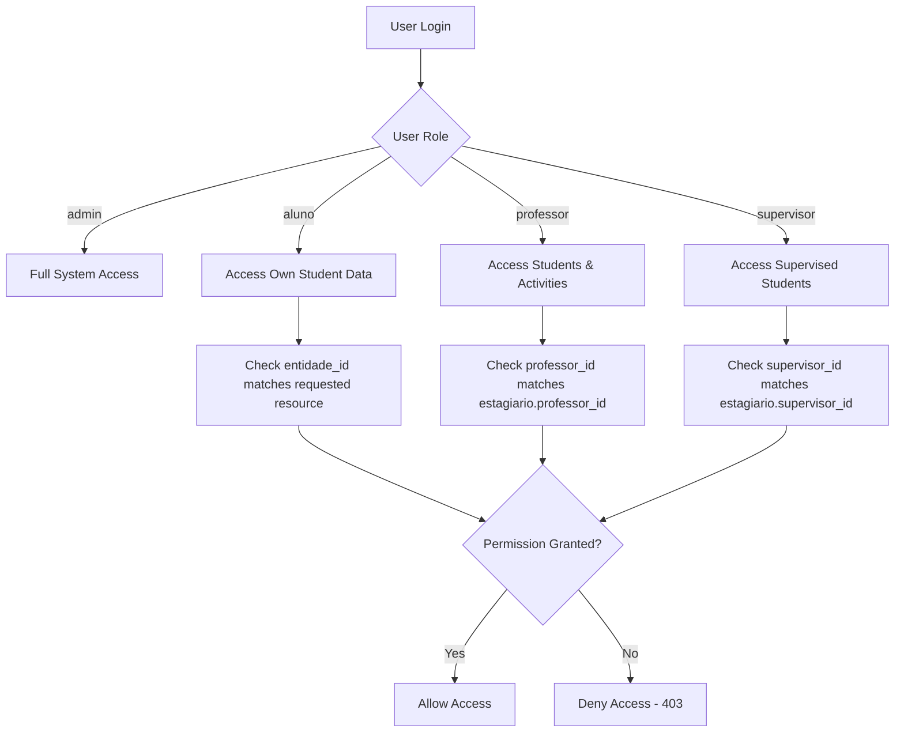
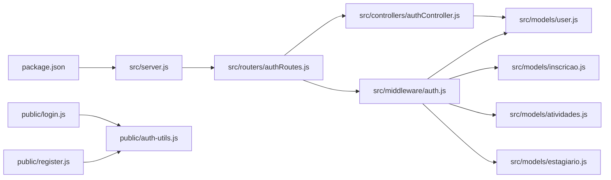

# Authentication & Authorization System

<cite>
**Referenced Files in This Document**
- [src/server.js](file://src/server.js)
- [src/routers/authRoutes.js](file://src/routers/authRoutes.js)
- [src/controllers/authController.js](file://src/controllers/authController.js)
- [src/middleware/auth.js](file://src/middleware/auth.js)
- [src/models/user.js](file://src/models/user.js)
- [src/database/setupAuthUsers.js](file://src/database/setupAuthUsers.js)
- [public/auth-utils.js](file://public/auth-utils.js)
- [public/login.js](file://public/login.js)
- [public/register.js](file://public/register.js)
- [public/auth-profile.js](file://public/auth-profile.js)
- [AUTH_GUIDE.md](file://AUTH_GUIDE.md)
- [package.json](file://package.json)
</cite>

## Update Summary
**Changes Made**
- Enhanced role-based access control documentation with new ownership validation middleware
- Added comprehensive coverage of entity-based permissions and role-specific access patterns
- Updated authentication middleware documentation to reflect improved token verification and ownership checks
- Expanded coverage of specialized ownership validation functions for activities, internships, and registrations
- Added detailed documentation of entity-based permission system using entidade_id field
- Updated API endpoint documentation to include new ownership validation endpoints

## Table of Contents
1. [Introduction](#introduction)
2. [Project Structure](#project-structure)
3. [Core Components](#core-components)
4. [Architecture Overview](#architecture-overview)
5. [Detailed Component Analysis](#detailed-component-analysis)
6. [Enhanced Authentication & Authorization Features](#enhanced-authentication--authorization-features)
7. [Dependency Analysis](#dependency-analysis)
8. [Performance Considerations](#performance-considerations)
9. [Troubleshooting Guide](#troubleshooting-guide)
10. [Conclusion](#conclusion)
11. [Appendices](#appendices)

## Introduction
This document explains the enhanced authentication and authorization system used by NodeMural. The system features JWT-based authentication with advanced role-based access control (RBAC), entity-based permissions, and comprehensive ownership validation. It covers token generation and validation, role enforcement, specialized ownership middleware for different entity types, user registration and login flows with bcryptjs password hashing, and frontend integration patterns. The system now supports fine-grained access control through the entidade_id field, enabling role-specific permissions for students, professors, and supervisors.

## Project Structure
The authentication system spans backend Express routes, controllers, middleware, and models, plus frontend utilities and pages for login and registration. Environment variables are loaded via dotenv, and the auth_users table is initialized by a setup script. The enhanced system now includes specialized middleware for different entity types and comprehensive ownership validation.

```mermaid
graph TB
subgraph "Backend"
S["Server (src/server.js)"]
R["Auth Routes (src/routers/authRoutes.js)"]
C["Auth Controller (src/controllers/authController.js)"]
M["Auth Middleware (src/middleware/auth.js)"]
U["User Model (src/models/user.js)"]
DB["DB Setup (src/database/setupAuthUsers.js)"]
IM["Inscreção Model (src/models/inscricao.js)"]
AM["Atividades Model (src/models/atividades.js)"]
EM["Estagiario Model (src/models/estagiario.js)"]
end
subgraph "Frontend"
L["Login Page (public/login.js)"]
RG["Register Page (public/register.js)"]
AU["Auth Utils (public/auth-utils.js)"]
AP["Profile Page (public/auth-profile.js)"]
end
S --> R
R --> C
R --> M
C --> U
M --> U
M --> IM
M --> AM
M --> EM
DB --> U
L --> AU
RG --> AU
AP --> AU
```

**Diagram sources**
- [src/server.js](file://src/server.js#L31-L54)
- [src/routers/authRoutes.js](file://src/routers/authRoutes.js#L1-L22)
- [src/controllers/authController.js](file://src/controllers/authController.js#L1-L260)
- [src/middleware/auth.js](file://src/middleware/auth.js#L1-L216)
- [src/models/user.js](file://src/models/user.js#L1-L185)
- [src/database/setupAuthUsers.js](file://src/database/setupAuthUsers.js#L1-L38)
- [public/login.js](file://public/login.js#L1-L97)
- [public/register.js](file://public/register.js#L1-L124)
- [public/auth-utils.js](file://public/auth-utils.js#L1-L102)
- [public/auth-profile.js](file://public/auth-profile.js#L1-L29)

**Section sources**
- [src/server.js](file://src/server.js#L31-L54)
- [src/routers/authRoutes.js](file://src/routers/authRoutes.js#L1-L22)
- [AUTH_GUIDE.md](file://AUTH_GUIDE.md#L1-L312)

## Core Components
- **JWT-based authentication**: tokens are generated upon successful login and validated on protected routes with enhanced error handling.
- **Advanced RBAC**: roles define access levels with entity-based permissions using entidade_id field for fine-grained control.
- **Enhanced ownership validation**: specialized middleware for activities, internships, and registrations with role-specific access patterns.
- **Password hashing**: bcryptjs is used to hash passwords during registration.
- **Entity-based permissions**: users can only access entities linked to their role through the entidade_id relationship.
- **Frontend utilities**: helpers for storing tokens, attaching Authorization headers, and enforcing login requirements.

Key implementation references:
- JWT secret and expiry are configured via environment variables.
- Token verification middleware decodes tokens and attaches user info to the request.
- Role-based middleware restricts access to specific roles with enhanced error reporting.
- Ownership middleware ensures users can only access or modify their own records through entity relationships.
- Specialized ownership validators for activities, internships, and registrations provide role-specific access control.

**Section sources**
- [src/controllers/authController.js](file://src/controllers/authController.js#L78-L102)
- [src/middleware/auth.js](file://src/middleware/auth.js#L8-L33)
- [src/middleware/auth.js](file://src/middleware/auth.js#L36-L52)
- [src/middleware/auth.js](file://src/middleware/auth.js#L81-L102)
- [src/middleware/auth.js](file://src/middleware/auth.js#L105-L140)
- [src/middleware/auth.js](file://src/middleware/auth.js#L142-L177)
- [src/middleware/auth.js](file://src/middleware/auth.js#L180-L215)
- [src/models/user.js](file://src/models/user.js#L17-L18)
- [src/models/user.js](file://src/models/user.js#L64-L86)
- [public/auth-utils.js](file://public/auth-utils.js#L45-L54)

## Architecture Overview
The enhanced authentication flow integrates frontend and backend components with comprehensive ownership validation. The frontend sends credentials to the backend, receives a JWT with role and entity information, stores it locally, and includes it in subsequent requests. Backend middleware verifies the token, enforces role and ownership policies, and validates entity relationships.

```mermaid
sequenceDiagram
participant FE as "Frontend"
participant AuthRoute as "Auth Routes (/auth)"
participant AuthCtrl as "Auth Controller"
participant UserModel as "User Model"
participant JWT as "JWT Sign/Verify"
participant MW as "Auth Middleware"
FE->>AuthRoute : POST /auth/login
AuthRoute->>AuthCtrl : login(email, password)
AuthCtrl->>UserModel : findByEmail(email)
UserModel-->>AuthCtrl : user
AuthCtrl->>UserModel : verifyPassword(plain, hash)
UserModel-->>AuthCtrl : boolean
AuthCtrl->>JWT : sign(payload with role, entidade_id)
JWT-->>AuthCtrl : token
AuthCtrl-->>FE : {token, user with role and entity}
FE->>AuthRoute : GET /auth/profile (with Bearer token)
AuthRoute->>MW : verifyToken
MW->>JWT : verify(token, secret)
JWT-->>MW : decoded payload with role
MW->>MW : checkOwnership (validate entity relationship)
MW-->>AuthRoute : attach req.user with permissions
AuthRoute->>AuthCtrl : getProfile(userId)
AuthCtrl->>UserModel : findById(userId)
UserModel-->>AuthCtrl : user
AuthCtrl-->>FE : user with role-based permissions
```

**Diagram sources**
- [src/routers/authRoutes.js](file://src/routers/authRoutes.js#L14-L16)
- [src/controllers/authController.js](file://src/controllers/authController.js#L57-L108)
- [src/middleware/auth.js](file://src/middleware/auth.js#L8-L33)
- [src/middleware/auth.js](file://src/middleware/auth.js#L81-L102)
- [src/models/user.js](file://src/models/user.js#L37-L47)
- [src/models/user.js](file://src/models/user.js#L64-L86)

## Detailed Component Analysis

### JWT-Based Authentication
- **Token generation**: On successful login, a signed JWT is created containing user identity, role, and entidade_id, with an expiry configured via environment variables.
- **Token validation**: Middleware extracts the Authorization header, verifies the token signature, and attaches decoded user data including role and entity permissions to the request.
- **Enhanced error handling**: Improved error messages for token expiration, invalid tokens, and missing tokens.
- **Token storage**: Frontend utilities store the token in localStorage and automatically include it in authenticated requests.

```mermaid
flowchart TD
Start(["Login Request"]) --> Validate["Validate Credentials"]
Validate --> ValidCreds{"Credentials Valid?"}
ValidCreds --> |No| ErrCreds["Return 401 - Incorrect Credentials"]
ValidCreds --> |Yes| HashCheck["Verify Password Hash"]
HashCheck --> HashMatch{"Hash Matches?"}
HashMatch --> |No| ErrCreds
HashMatch --> |Yes| SignJWT["Sign JWT with Payload<br/>id,email,nome,role,entidade_id"]
SignJWT --> ReturnToken["Return {token,user with role and entity}"]
ReturnToken --> End(["Client Stores Token"])
```

**Diagram sources**
- [src/controllers/authController.js](file://src/controllers/authController.js#L57-L108)
- [src/middleware/auth.js](file://src/middleware/auth.js#L8-L33)
- [public/login.js](file://public/login.js#L74-L97)

**Section sources**
- [src/controllers/authController.js](file://src/controllers/authController.js#L78-L102)
- [src/middleware/auth.js](file://src/middleware/auth.js#L8-L33)
- [public/auth-utils.js](file://public/auth-utils.js#L45-L54)

### Enhanced Role-Based Access Control (RBAC)
- **Supported roles**: admin, supervisor, professor, aluno with entity-based permissions.
- **Role enforcement**: A higher-order middleware checks whether the authenticated user's role is included in the allowed roles.
- **Entity-based ownership**: Specialized middleware allows admins full access and validates entity relationships through entidade_id comparisons.
- **Role-specific access patterns**: Different validation rules for each role type (aluno, professor, supervisor).

```mermaid
flowchart TD
ReqStart(["Incoming Request"]) --> HasToken{"Has Bearer Token?"}
HasToken --> |No| Deny401["401 Unauthorized"]
HasToken --> |Yes| Verify["Verify JWT"]
Verify --> Verified{"Valid & Not Expired?"}
Verified --> |No| Deny401
Verified --> |Yes| AttachUser["Attach decoded user to req"]
AttachUser --> CheckRole{"Required Role Allowed?"}
CheckRole --> |No| Deny403["403 Forbidden"]
CheckRole --> |Yes| CheckOwner{"Ownership Required?"}
CheckOwner --> |No| Next["Proceed to Controller"]
CheckOwner --> |Yes| OwnerType{"Which Ownership Type?"}
OwnerType --> |Basic| BasicOwner["Check entidade_id match"]
OwnerType --> |Activity| ActivityOwner["Check activity-entity relationship"]
OwnerType --> |Internship| InternshipOwner["Check internship-entity relationship"]
OwnerType --> |Registration| RegOwner["Check registration-entity relationship"]
BasicOwner --> OwnerCheck{"Matches entidade_id?"}
ActivityOwner --> ActivityCheck{"Matches activity-entity?"}
InternshipOwner --> InternshipCheck{"Matches internship-entity?"}
RegOwner --> RegCheck{"Matches registration-entity?"}
OwnerCheck --> |No| Deny403
OwnerCheck --> |Yes| Next
ActivityCheck --> |No| Deny403
ActivityCheck --> |Yes| Next
InternshipCheck --> |No| Deny403
InternshipCheck --> |Yes| Next
RegCheck --> |No| Deny403
RegCheck --> |Yes| Next
```

**Diagram sources**
- [src/middleware/auth.js](file://src/middleware/auth.js#L36-L52)
- [src/middleware/auth.js](file://src/middleware/auth.js#L81-L102)
- [src/middleware/auth.js](file://src/middleware/auth.js#L105-L140)
- [src/middleware/auth.js](file://src/middleware/auth.js#L142-L177)
- [src/middleware/auth.js](file://src/middleware/auth.js#L180-L215)

**Section sources**
- [src/middleware/auth.js](file://src/middleware/auth.js#L36-L52)
- [src/middleware/auth.js](file://src/middleware/auth.js#L81-L102)
- [src/middleware/auth.js](file://src/middleware/auth.js#L105-L140)
- [src/middleware/auth.js](file://src/middleware/auth.js#L142-L177)
- [src/middleware/auth.js](file://src/middleware/auth.js#L180-L215)
- [AUTH_GUIDE.md](file://AUTH_GUIDE.md#L194-L202)

### Authentication Middleware Functionality
- **verifyToken**: Extracts Bearer token from Authorization header, verifies it, and sets req.user with role and entity information.
- **checkRole**: Enforces role-based access by ensuring the user's role is within the allowed set.
- **getCurrentUser**: Returns decoded user info from a valid token without invoking controllers.
- **checkOwnership**: Allows admin access or validates that the user's entidade_id matches the requested resource.
- **checkAtividadeOwnership**: Validates ownership for atividade records by checking activity-entity relationships.
- **checkEstagiarioOwnership**: Validates ownership for estagiario records with role-specific rules (aluno vs professor).
- **checkInscricaoOwnership**: Validates ownership for inscricao records by matching aluno_id to the user's entity.

```mermaid
classDiagram
class AuthMiddleware {
+verifyToken(req,res,next)
+checkRole(allowedRoles)(req,res,next)
+getCurrentUser(req,res,next)
+checkOwnership(req,res,next)
+checkAtividadeOwnership(req,res,next)
+checkEstagiarioOwnership(req,res,next)
+checkInscricaoOwnership(req,res,next)
}
class UserModel {
+findByEmail(email)
+verifyPassword(plain,hash)
+findById(id)
}
class AtividadesModel {
+findById(id)
}
class EstagiarioModel {
+findByPk(id)
}
class InscricaoModel {
+findByIdEstagiario(id)
}
AuthMiddleware --> UserModel : "uses for basic ownership"
AuthMiddleware --> AtividadesModel : "uses for activity ownership"
AuthMiddleware --> EstagiarioModel : "uses for internship ownership"
AuthMiddleware --> InscricaoModel : "uses for registration ownership"
```

**Diagram sources**
- [src/middleware/auth.js](file://src/middleware/auth.js#L8-L216)
- [src/models/user.js](file://src/models/user.js#L37-L47)
- [src/models/user.js](file://src/models/user.js#L64-L86)

**Section sources**
- [src/middleware/auth.js](file://src/middleware/auth.js#L8-L216)

### User Registration and Login
- **Registration**: Validates inputs, confirms password match, hashes password, and inserts a new user into auth_users with role and entity_id. Redirect behavior depends on role and entity existence.
- **Login**: Finds user by email, verifies password, and generates a JWT with role and entity_id for comprehensive access control.
- **Enhanced validation**: Improved input validation with role-specific entity requirements.

```mermaid
sequenceDiagram
participant FE as "Frontend"
participant AuthRoute as "Auth Routes"
participant AuthCtrl as "Auth Controller"
participant UserModel as "User Model"
participant BC as "bcryptjs"
participant JWT as "jsonwebtoken"
FE->>AuthRoute : POST /auth/register
AuthRoute->>AuthCtrl : register(body)
AuthCtrl->>UserModel : findByEmail(email)
UserModel-->>AuthCtrl : existing?
AuthCtrl->>BC : hash(password)
BC-->>AuthCtrl : hashed
AuthCtrl->>UserModel : insert {email,hashed,role,entidade_id}
UserModel-->>AuthCtrl : user
AuthCtrl-->>FE : {user, redirect info}
FE->>AuthRoute : POST /auth/login
AuthRoute->>AuthCtrl : login(body)
AuthCtrl->>UserModel : findByEmail(email)
UserModel-->>AuthCtrl : user
AuthCtrl->>UserModel : verifyPassword(plain, hash)
UserModel-->>AuthCtrl : boolean
AuthCtrl->>JWT : sign(payload with role, entidade_id)
JWT-->>AuthCtrl : token
AuthCtrl-->>FE : {token,user with role and entity}
```

**Diagram sources**
- [src/controllers/authController.js](file://src/controllers/authController.js#L6-L54)
- [src/controllers/authController.js](file://src/controllers/authController.js#L57-L108)
- [src/models/user.js](file://src/models/user.js#L7-L34)
- [src/models/user.js](file://src/models/user.js#L101-L104)

**Section sources**
- [src/controllers/authController.js](file://src/controllers/authController.js#L6-L54)
- [src/controllers/authController.js](file://src/controllers/authController.js#L57-L108)
- [src/models/user.js](file://src/models/user.js#L7-L34)
- [src/models/user.js](file://src/models/user.js#L101-L104)

### Session Management and Frontend Integration
- **Enhanced frontend storage**: Token and user data with role and entity information are stored in localStorage after login.
- **Improved authentication fetch**: Uses helper to attach Authorization headers to all authenticated requests.
- **Role-aware navigation**: Pages enforce login requirements and role checks before rendering sensitive content.
- **Entity-aware routing**: Redirects based on user role and entity existence.
- **Logout procedures**: Clears localStorage and redirects to the login page.

```mermaid
flowchart TD
LoginPage["Login Page"] --> Submit["Submit Credentials"]
Submit --> FetchLogin["POST /auth/login"]
FetchLogin --> Ok{"HTTP 200 OK?"}
Ok --> |Yes| Store["Store token & user (role, entity) in localStorage"]
Store --> Redirect["Redirect based on role & entity"]
Ok --> |No| ShowError["Show error message"]
App["Other Pages"] --> RequireLogin["requireLogin()"]
RequireLogin --> LoggedIn{"isLoggedIn()?"}
LoggedIn --> |No| GoLogin["Redirect to /login?redirect=..."]
LoggedIn --> |Yes| AuthFetch["authenticatedFetch(url,{headers:{Authorization: Bearer token}})"]
AuthFetch --> CheckRole["Check role-based permissions"]
CheckRole --> EntityCheck["Check entity relationships"]
EntityCheck --> Proceed["Proceed with protected actions"]
Logout["Logout Action"] --> Clear["Remove token & user from localStorage"]
Clear --> GoLogin
```

**Diagram sources**
- [public/login.js](file://public/login.js#L67-L97)
- [public/auth-utils.js](file://public/auth-utils.js#L8-L37)
- [public/auth-utils.js](file://public/auth-utils.js#L45-L54)
- [public/auth-utils.js](file://public/auth-utils.js#L83-L101)

**Section sources**
- [public/login.js](file://public/login.js#L1-L97)
- [public/register.js](file://public/register.js#L1-L124)
- [public/auth-utils.js](file://public/auth-utils.js#L1-L102)
- [public/auth-profile.js](file://public/auth-profile.js#L1-L29)

### API Endpoints for Authentication
- **Public endpoints**:
  - POST /auth/register: Creates a new user with hashed password and role.
  - POST /auth/login: Authenticates and returns a JWT with role and entity information.
  - GET /auth/me: Returns decoded user info from the token.
- **Protected endpoints**:
  - GET /auth/profile: Returns authenticated user profile with role-based permissions.
  - PUT /auth/users/:id: Updates user profile with role validation.
  - PUT /auth/users/entity/:entidade_id: Updates user by entity ID with admin validation.
- **Admin-only endpoints**:
  - GET /auth/users: Lists all users with role validation.

```mermaid
erDiagram
AUTH_USERS {
int id PK
varchar email UK
varchar password
varchar nome
enum role
int entidade_id
boolean ativo
timestamp criado_em
timestamp atualizado_em
}
```

**Diagram sources**
- [src/database/setupAuthUsers.js](file://src/database/setupAuthUsers.js#L11-L22)

**Section sources**
- [src/routers/authRoutes.js](file://src/routers/authRoutes.js#L8-L21)
- [AUTH_GUIDE.md](file://AUTH_GUIDE.md#L66-L161)

## Enhanced Authentication & Authorization Features

### Entity-Based Permission System
The system now implements a sophisticated entity-based permission model using the entidade_id field to establish relationships between users and their managed entities:

- **Admin users**: Full access to all entities regardless of entidade_id
- **Aluno users**: Access only to their own student records and related activities
- **Professor users**: Access to students they supervise and related activities
- **Supervisor users**: Access to their supervised students and related activities

```mermaid
flowchart TD
User["User Login"] --> RoleCheck{"User Role"}
RoleCheck --> |admin| FullAccess["Full System Access"]
RoleCheck --> |aluno| AlunoAccess["Access Own Student Data"]
RoleCheck --> |professor| ProfAccess["Access Students & Activities"]
RoleCheck --> |supervisor| SupAccess["Access Supervised Students"]
AlunoAccess --> CheckEntity["Check entidade_id matches requested resource"]
ProfAccess --> CheckStudent["Check professor_id matches estagiario.professor_id"]
SupAccess --> CheckSup["Check supervisor_id matches estagiario.supervisor_id"]
CheckEntity --> Access{"Permission Granted?"}
CheckStudent --> Access
CheckSup --> Access
Access --> |Yes| Allow["Allow Access"]
Access --> |No| Deny["Deny Access - 403"]
```

**Diagram sources**
- [src/middleware/auth.js](file://src/middleware/auth.js#L81-L102)
- [src/middleware/auth.js](file://src/middleware/auth.js#L142-L177)
- [src/middleware/auth.js](file://src/middleware/auth.js#L180-L215)

### Specialized Ownership Validation
The system includes specialized middleware for different entity types with role-specific validation logic:

- **checkAtividadeOwnership**: Validates activity access based on student-professor relationships
- **checkEstagiarioOwnership**: Validates internship access with different rules for alunos and professores
- **checkInscricaoOwnership**: Validates registration access specifically for aluno role

Each validator performs:
1. Admin bypass check
2. Entity existence validation
3. Role-specific relationship validation
4. Entity ID comparison with user's entidade_id

**Section sources**
- [src/middleware/auth.js](file://src/middleware/auth.js#L105-L140)
- [src/middleware/auth.js](file://src/middleware/auth.js#L142-L177)
- [src/middleware/auth.js](file://src/middleware/auth.js#L180-L215)

### Advanced Token Claims and Security
Enhanced JWT tokens now include comprehensive user information:
- **id**: User database identifier
- **email**: User email address
- **nome**: User full name
- **role**: User role (admin, supervisor, professor, aluno)
- **entidade_id**: Entity identifier for role-specific access control

This design enables fine-grained authorization without additional database queries for basic permissions.

**Section sources**
- [src/controllers/authController.js](file://src/controllers/authController.js#L78-L102)
- [src/middleware/auth.js](file://src/middleware/auth.js#L18-L21)

## Dependency Analysis
The enhanced backend modules depend on Express, jsonwebtoken, bcryptjs, and dotenv. The auth routes depend on the auth controller and middleware, while the auth controller depends on the user model. The enhanced middleware now includes dependencies on specialized models for ownership validation. The user model interacts with the MariaDB pool. Frontend utilities depend on localStorage and the fetch API.

```mermaid
graph LR
Pkg["package.json"]
Server["src/server.js"]
Routes["src/routers/authRoutes.js"]
Ctrl["src/controllers/authController.js"]
MW["src/middleware/auth.js"]
Model["src/models/user.js"]
Utils["public/auth-utils.js"]
Login["public/login.js"]
Register["public/register.js"]
InscricaoModel["src/models/inscricao.js"]
AtividadesModel["src/models/atividades.js"]
EstagiarioModel["src/models/estagiario.js"]
Pkg --> Server
Server --> Routes
Routes --> Ctrl
Routes --> MW
Ctrl --> Model
MW --> Model
MW --> InscricaoModel
MW --> AtividadesModel
MW --> EstagiarioModel
Login --> Utils
Register --> Utils
```

**Diagram sources**
- [package.json](file://package.json#L22-L30)
- [src/server.js](file://src/server.js#L31-L54)
- [src/routers/authRoutes.js](file://src/routers/authRoutes.js#L1-L22)
- [src/controllers/authController.js](file://src/controllers/authController.js#L1-L260)
- [src/middleware/auth.js](file://src/middleware/auth.js#L1-L216)
- [src/models/user.js](file://src/models/user.js#L1-L185)
- [public/auth-utils.js](file://public/auth-utils.js#L1-L102)
- [public/login.js](file://public/login.js#L1-L97)
- [public/register.js](file://public/register.js#L1-L124)

**Section sources**
- [package.json](file://package.json#L22-L30)
- [src/server.js](file://src/server.js#L31-L54)

## Performance Considerations
- **Token verification**: Occurs on every protected request; keep JWT_SECRET secure and avoid overly large payloads in tokens.
- **Enhanced middleware overhead**: Additional database queries for ownership validation may impact performance.
- **Password hashing**: Uses bcryptjs with moderate cost factor; adjust if performance requires balancing security and CPU usage.
- **Connection pooling**: Efficient database connection management is crucial for ownership validation queries.
- **Rate limiting**: Consider implementing rate limiting for login/register endpoints due to increased validation complexity.
- **Caching strategies**: Consider caching frequently accessed user permissions to reduce database load.

## Troubleshooting Guide
Common errors and resolutions with enhanced authentication system:
- **400 Validation errors**: Missing or invalid fields during registration or login.
- **401 Token errors**: Missing Authorization header, invalid token, or expired token.
- **401 Incorrect credentials**: Email or password mismatch.
- **403 Access denied**: Insufficient permissions, ownership violation, or role mismatch.
- **500 Internal errors**: Database or server issues during ownership validation.

Enhanced troubleshooting scenarios:
- **Entity relationship errors**: Verify that user's entidade_id matches the target resource entity.
- **Role-specific access issues**: Check that the user's role has permission for the requested operation.
- **Ownership validation failures**: Review the specific ownership middleware being used and its validation logic.
- **Token claim mismatches**: Ensure tokens contain correct role and entidade_id information.

Recommendations:
- Verify environment variables (JWT_SECRET, JWT_EXPIRY).
- Ensure frontend includes Authorization: Bearer <token> for protected endpoints.
- Confirm the auth_users table exists and user is active.
- Use the provided test token to validate JWT decoding.
- Check entity relationships in the database for ownership validation.
- Monitor performance impact of enhanced ownership validation middleware.

**Section sources**
- [AUTH_GUIDE.md](file://AUTH_GUIDE.md#L289-L300)
- [src/middleware/auth.js](file://src/middleware/auth.js#L26-L33)
- [src/middleware/auth.js](file://src/middleware/auth.js#L106-L140)
- [src/middleware/auth.js](file://src/middleware/auth.js#L142-L177)
- [src/middleware/auth.js](file://src/middleware/auth.js#L180-L215)

## Conclusion
NodeMural's enhanced authentication system provides a robust foundation with JWT-based login, bcryptjs password hashing, and sophisticated RBAC enforcement with entity-based permissions. The new ownership validation middleware enables fine-grained access control through the entidade_id field, supporting role-specific relationships for students, professors, and supervisors. The frontend utilities streamline token handling and route protection with enhanced role awareness. By following the documented patterns and best practices, teams can extend protection to additional routes and enhance security with rate limiting, HTTPS, and comprehensive input validation.

## Appendices

### Security Best Practices
- **Change JWT_SECRET**: Update JWT_SECRET in production and rotate secrets periodically.
- **HTTPS enforcement**: Use HTTPS in production to prevent token interception.
- **Rate limiting**: Implement rate limiting for login/register endpoints due to enhanced validation complexity.
- **Input validation**: Add comprehensive input validation and sanitization.
- **Token lifecycle**: Consider short-lived access tokens with refresh mechanisms if needed.
- **Audit logging**: Implement logging for authentication attempts and access denials.
- **Entity validation**: Regularly audit entity relationships to ensure proper ownership validation.

### Token Storage Recommendations
- **Frontend storage**: Use localStorage for simplicity; consider sessionStorage for stricter scoping.
- **Cookie alternatives**: Avoid storing tokens in cookies unless necessary; if using cookies, enable HttpOnly and SameSite flags.
- **Token rotation**: Implement periodic token refresh to minimize exposure windows.
- **Secure headers**: Set appropriate security headers when storing tokens in browsers.

### Enhanced Logout Procedures
- **Token cleanup**: Remove token and user from localStorage.
- **Session invalidation**: Consider implementing token blacklisting for enhanced security.
- **Entity state cleanup**: Clear any cached entity-specific data.
- **Redirect strategy**: Redirect to login page with clear messaging.
- **Multi-tab handling**: Ensure logout affects all browser tabs.

### Entity-Based Permission Design
The system's entity-based permission model provides several advantages:
- **Scalable access control**: Easy to add new entity types and permission rules.
- **Role separation**: Clear separation of concerns between different user roles.
- **Data integrity**: Prevents unauthorized access to unrelated entities.
- **Audit trail**: Clear logging of permission decisions and access patterns.

**Section sources**
- [public/auth-utils.js](file://public/auth-utils.js#L33-L37)
- [AUTH_GUIDE.md](file://AUTH_GUIDE.md#L275-L279)
- [src/middleware/auth.js](file://src/middleware/auth.js#L81-L102)
- [src/middleware/auth.js](file://src/middleware/auth.js#L105-L140)
- [src/middleware/auth.js](file://src/middleware/auth.js#L142-L177)
- [src/middleware/auth.js](file://src/middleware/auth.js#L180-L215)