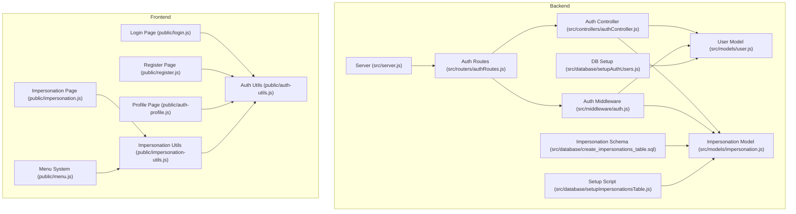
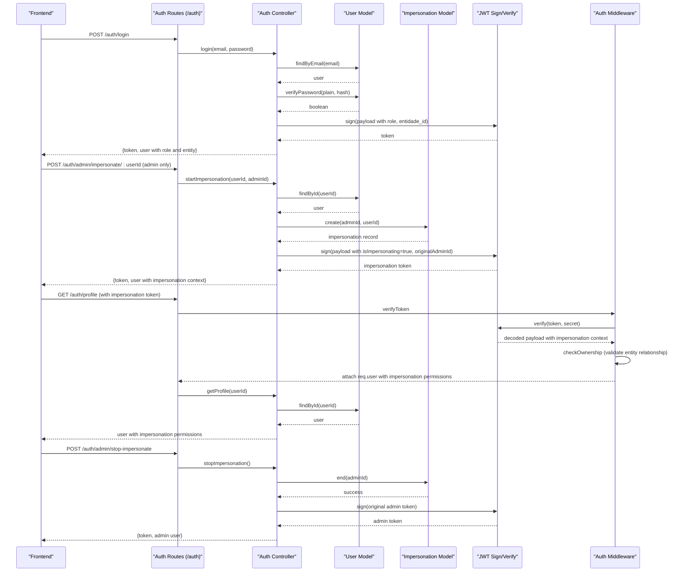
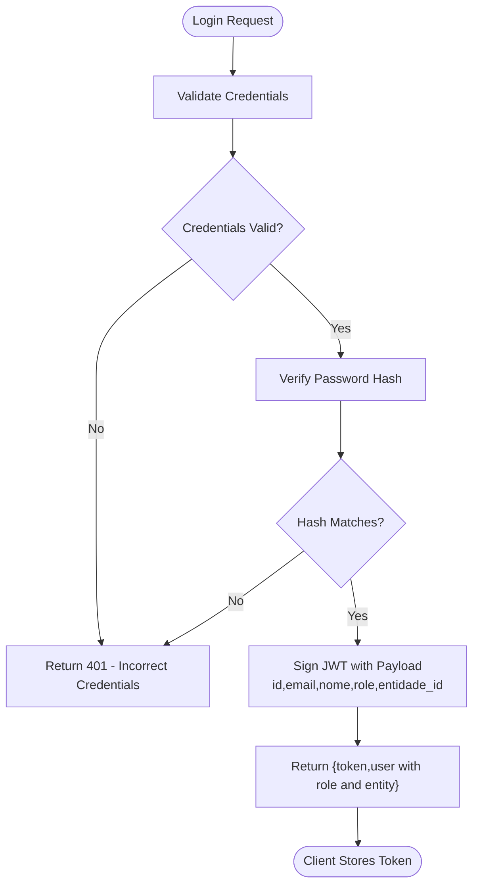
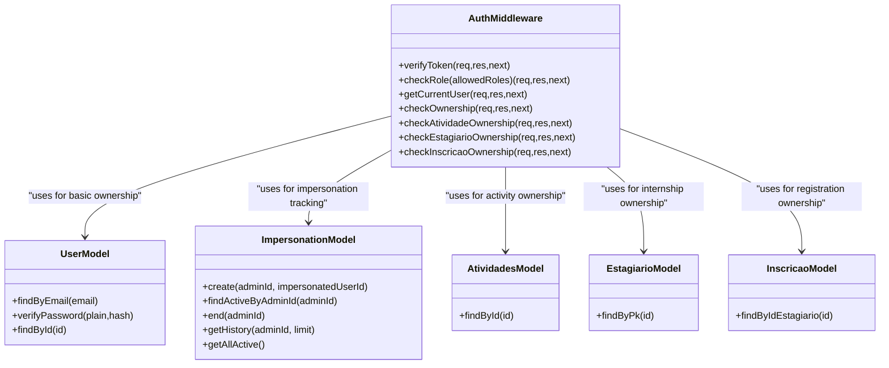
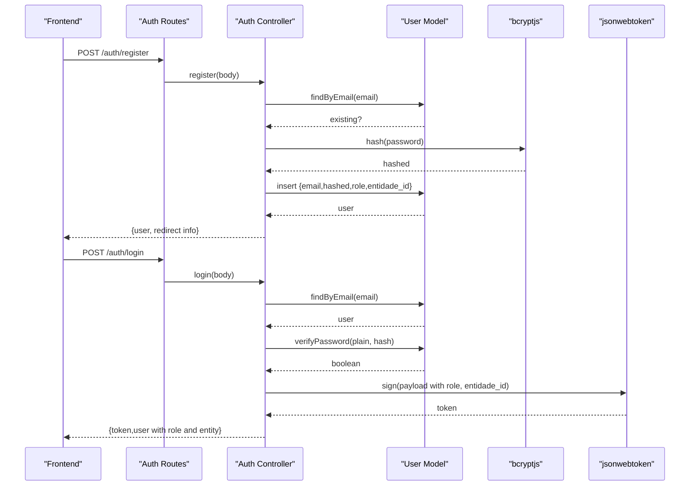
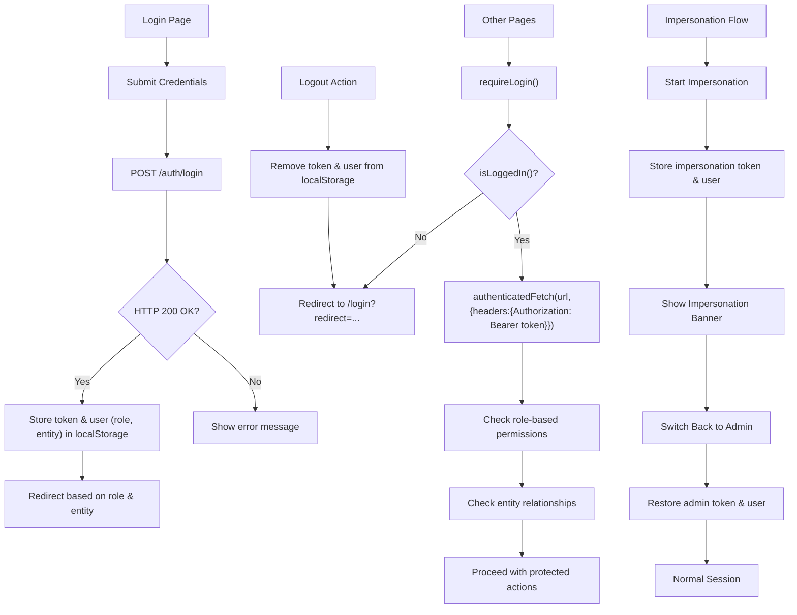
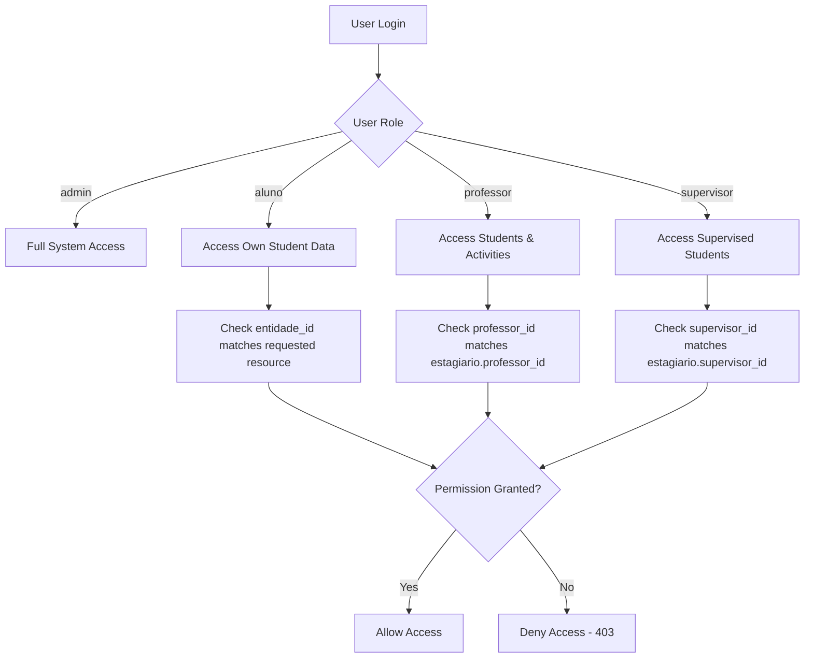
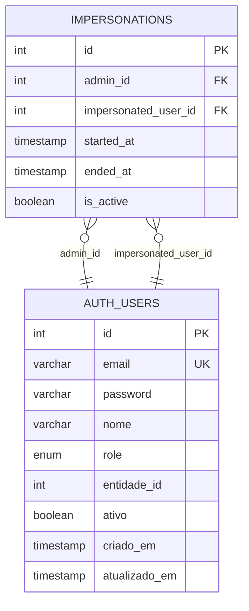
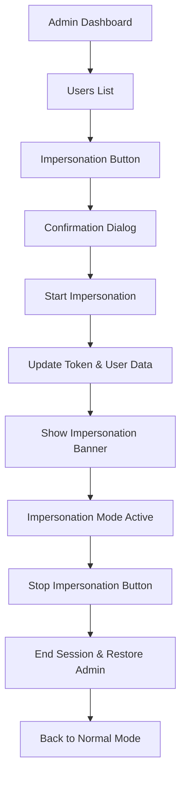
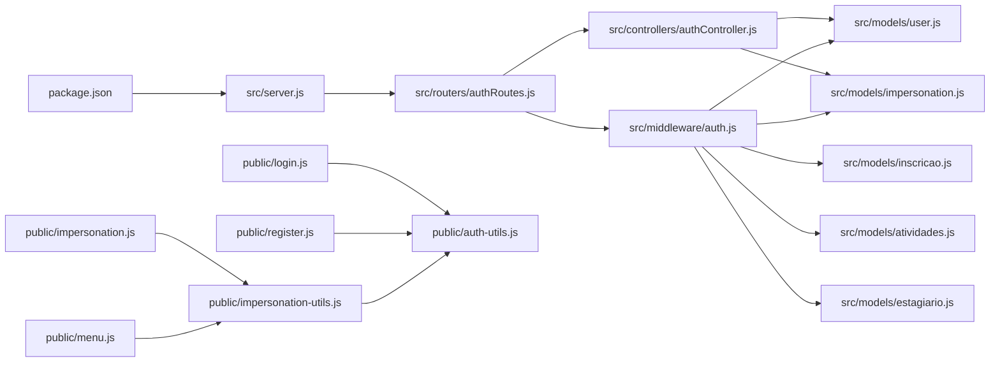

# Authentication & Authorization System

<cite>
**Referenced Files in This Document**
- [src/server.js](file://src/server.js)
- [src/routers/authRoutes.js](file://src/routers/authRoutes.js)
- [src/controllers/authController.js](file://src/controllers/authController.js)
- [src/middleware/auth.js](file://src/middleware/auth.js)
- [src/models/user.js](file://src/models/user.js)
- [src/models/impersonation.js](file://src/models/impersonation.js)
- [src/database/setupAuthUsers.js](file://src/database/setupAuthUsers.js)
- [src/database/create_impersonations_table.sql](file://src/database/create_impersonations_table.sql)
- [src/database/setupImpersonationsTable.js](file://src/database/setupImpersonationsTable.js)
- [public/auth-utils.js](file://public/auth-utils.js)
- [public/impersonation-utils.js](file://public/impersonation-utils.js)
- [public/impersonation.js](file://public/impersonation.js)
- [public/menu.js](file://public/menu.js)
- [public/login.js](file://public/login.js)
- [public/register.js](file://public/register.js)
- [public/auth-profile.js](file://public/auth-profile.js)
- [AUTH_GUIDE.md](file://AUTH_GUIDE.md)
- [IMPERSONATION_GUIDE.md](file://IMPERSONATION_GUIDE.md)
- [QUICK_START_IMPERSONATION.md](file://QUICK_START_IMPERSONATION.md)
- [package.json](file://package.json)
</cite>

## Update Summary
**Changes Made**
- Enhanced authentication system with comprehensive impersonation endpoints and improved user management capabilities
- Added detailed documentation for impersonation feature including admin-only access control, session management, and audit trails
- Updated authentication middleware to support impersonation context detection and validation
- Expanded API endpoints to include impersonation management routes with proper security validation
- Enhanced frontend utilities with impersonation banner system, user interface components, and session tracking
- Added comprehensive database schema documentation for impersonation tracking with foreign key constraints and indexing
- Updated security considerations for impersonation sessions and admin oversight with prevention measures

## Table of Contents
1. [Introduction](#introduction)
2. [Project Structure](#project-structure)
3. [Core Components](#core-components)
4. [Architecture Overview](#architecture-overview)
5. [Detailed Component Analysis](#detailed-component-analysis)
6. [Enhanced Authentication & Authorization Features](#enhanced-authentication--authorization-features)
7. [Impersonation System](#impersonation-system)
8. [API Endpoints](#api-endpoints)
9. [Security Features](#security-features)
10. [Database Schema](#database-schema)
11. [Frontend Integration](#frontend-integration)
12. [Dependency Analysis](#dependency-analysis)
13. [Performance Considerations](#performance-considerations)
14. [Troubleshooting Guide](#troubleshooting-guide)
15. [Conclusion](#conclusion)
16. [Appendices](#appendices)

## Introduction
This document explains the enhanced authentication and authorization system used by NodeMural. The system features JWT-based authentication with advanced role-based access control (RBAC), entity-based permissions, comprehensive ownership validation, and a powerful impersonation system. The impersonation feature allows administrators to temporarily assume user identities for debugging, support, and administrative purposes while maintaining full audit trails. It covers token generation and validation, role enforcement, specialized ownership middleware for different entity types, user registration and login flows with bcryptjs password hashing, and frontend integration patterns with enhanced session management capabilities.

## Project Structure
The authentication system spans backend Express routes, controllers, middleware, and models, plus frontend utilities and pages for login, registration, impersonation management, and menu integration. Environment variables are loaded via dotenv, and both auth_users and impersonations tables are initialized by setup scripts. The enhanced system now includes specialized middleware for different entity types, comprehensive ownership validation, and robust impersonation tracking with database persistence.

```mermaid
graph TB
subgraph "Backend"
S["Server (src/server.js)"]
R["Auth Routes (src/routers/authRoutes.js)"]
C["Auth Controller (src/controllers/authController.js)"]
M["Auth Middleware (src/middleware/auth.js)"]
U["User Model (src/models/user.js)"]
IM["Impersonation Model (src/models/impersonation.js)"]
DB["DB Setup (src/database/setupAuthUsers.js)"]
DB2["Impersonation Schema (src/database/create_impersonations_table.sql)"]
DB3["Setup Script (src/database/setupImpersonationsTable.js)"]
end
subgraph "Frontend"
L["Login Page (public/login.js)"]
RG["Register Page (public/register.js)"]
AU["Auth Utils (public/auth-utils.js)"]
IPU["Impersonation Utils (public/impersonation-utils.js)"]
IP["Impersonation Page (public/impersonation.js)"]
MENU["Menu System (public/menu.js)"]
AP["Profile Page (public/auth-profile.js)"]
end
S --> R
R --> C
R --> M
C --> U
C --> IM
M --> U
M --> IM
DB --> U
DB2 --> IM
DB3 --> IM
L --> AU
RG --> AU
AP --> AU
IP --> IPU
IPU --> AU
MENU --> IPU
```

**Diagram sources**
- [src/server.js:31-54](file://src/server.js#L31-L54)
- [src/routers/authRoutes.js:1-28](file://src/routers/authRoutes.js#L1-L28)
- [src/controllers/authController.js:1-401](file://src/controllers/authController.js#L1-L401)
- [src/middleware/auth.js:1-216](file://src/middleware/auth.js#L1-L216)
- [src/models/user.js:1-185](file://src/models/user.js#L1-L185)
- [src/models/impersonation.js:1-124](file://src/models/impersonation.js#L1-L124)
- [src/database/setupAuthUsers.js:1-37](file://src/database/setupAuthUsers.js#L1-L37)
- [src/database/create_impersonations_table.sql:1-14](file://src/database/create_impersonations_table.sql#L1-L14)
- [src/database/setupImpersonationsTable.js:1-60](file://src/database/setupImpersonationsTable.js#L1-L60)
- [public/login.js:1-97](file://public/login.js#L1-L97)
- [public/register.js:1-124](file://public/register.js#L1-L124)
- [public/auth-utils.js:1-102](file://public/auth-utils.js#L1-L102)
- [public/impersonation-utils.js:1-191](file://public/impersonation-utils.js#L1-L191)
- [public/impersonation.js:1-147](file://public/impersonation.js#L1-L147)
- [public/menu.js:1-107](file://public/menu.js#L1-L107)
- [public/auth-profile.js:1-29](file://public/auth-profile.js#L1-L29)

**Section sources**
- [src/server.js:31-54](file://src/server.js#L31-L54)
- [src/routers/authRoutes.js:1-28](file://src/routers/authRoutes.js#L1-L28)
- [AUTH_GUIDE.md:1-312](file://AUTH_GUIDE.md#L1-L312)

## Core Components
- **JWT-based authentication**: tokens are generated upon successful login and validated on protected routes with enhanced error handling and impersonation context detection.
- **Advanced RBAC**: roles define access levels with entity-based permissions using entidade_id field for fine-grained control.
- **Enhanced ownership validation**: specialized middleware for activities, internships, and registrations with role-specific access patterns.
- **Impersonation system**: administrators can temporarily assume user identities with comprehensive audit trails and session management.
- **Password hashing**: bcryptjs is used to hash passwords during registration.
- **Entity-based permissions**: users can only access entities linked to their role through the entidade_id relationship.
- **Frontend utilities**: helpers for storing tokens, attaching Authorization headers, enforcing login requirements, and managing impersonation sessions.

Key implementation references:
- JWT secret and expiry are configured via environment variables.
- Token verification middleware decodes tokens and attaches user info to the request, including impersonation context.
- Role-based middleware restricts access to specific roles with enhanced error reporting.
- Ownership middleware ensures users can only access or modify their own records through entity relationships.
- Specialized ownership validators for activities, internships, and registrations provide role-specific access control.
- Impersonation middleware tracks admin sessions and validates impersonation permissions.
- Database schema supports impersonation tracking with foreign key constraints and indexing.

**Section sources**
- [src/controllers/authController.js:78-102](file://src/controllers/authController.js#L78-L102)
- [src/controllers/authController.js:294-306](file://src/controllers/authController.js#L294-L306)
- [src/middleware/auth.js:8-33](file://src/middleware/auth.js#L8-L33)
- [src/middleware/auth.js:36-52](file://src/middleware/auth.js#L36-L52)
- [src/middleware/auth.js:81-102](file://src/middleware/auth.js#L81-L102)
- [src/middleware/auth.js:105-140](file://src/middleware/auth.js#L105-L140)
- [src/middleware/auth.js:142-177](file://src/middleware/auth.js#L142-L177)
- [src/middleware/auth.js:180-215](file://src/middleware/auth.js#L180-L215)
- [src/models/user.js:17-18](file://src/models/user.js#L17-L18)
- [src/models/user.js:64-86](file://src/models/user.js#L64-L86)
- [src/models/impersonation.js:6-29](file://src/models/impersonation.js#L6-L29)
- [public/auth-utils.js:45-54](file://public/auth-utils.js#L45-L54)

## Architecture Overview
The enhanced authentication flow integrates frontend and backend components with comprehensive ownership validation and impersonation capabilities. The frontend sends credentials to the backend, receives a JWT with role and entity information, stores it locally, and includes it in subsequent requests. Backend middleware verifies the token, enforces role and ownership policies, validates entity relationships, and manages impersonation sessions. The impersonation system allows administrators to temporarily assume user identities while maintaining full audit trails.

```mermaid
sequenceDiagram
participant FE as "Frontend"
participant AuthRoute as "Auth Routes (/auth)"
participant AuthCtrl as "Auth Controller"
participant UserModel as "User Model"
participant ImpModel as "Impersonation Model"
participant JWT as "JWT Sign/Verify"
participant MW as "Auth Middleware"
FE->>AuthRoute : POST /auth/login
AuthRoute->>AuthCtrl : login(email, password)
AuthCtrl->>UserModel : findByEmail(email)
UserModel-->>AuthCtrl : user
AuthCtrl->>UserModel : verifyPassword(plain, hash)
UserModel-->>AuthCtrl : boolean
AuthCtrl->>JWT : sign(payload with role, entidade_id)
JWT-->>AuthCtrl : token
AuthCtrl-->>FE : {token, user with role and entity}
FE->>AuthRoute : POST /auth/admin/impersonate/ : userId (admin only)
AuthRoute->>AuthCtrl : startImpersonation(userId, adminId)
AuthCtrl->>UserModel : findById(userId)
UserModel-->>AuthCtrl : user
AuthCtrl->>ImpModel : create(adminId, userId)
ImpModel-->>AuthCtrl : impersonation record
AuthCtrl->>JWT : sign(payload with isImpersonating=true, originalAdminId)
JWT-->>AuthCtrl : impersonation token
AuthCtrl-->>FE : {token, user with impersonation context}
FE->>AuthRoute : GET /auth/profile (with impersonation token)
AuthRoute->>MW : verifyToken
MW->>JWT : verify(token, secret)
JWT-->>MW : decoded payload with impersonation context
MW->>MW : checkOwnership (validate entity relationship)
MW-->>AuthRoute : attach req.user with impersonation permissions
AuthRoute->>AuthCtrl : getProfile(userId)
AuthCtrl->>UserModel : findById(userId)
UserModel-->>AuthCtrl : user
AuthCtrl-->>FE : user with impersonation permissions
FE->>AuthRoute : POST /auth/admin/stop-impersonate
AuthRoute->>AuthCtrl : stopImpersonation()
AuthCtrl->>ImpModel : end(adminId)
ImpModel-->>AuthCtrl : success
AuthCtrl->>JWT : sign(original admin token)
JWT-->>AuthCtrl : admin token
AuthCtrl-->>FE : {token, admin user}
```

**Diagram sources**
- [src/routers/authRoutes.js:22-25](file://src/routers/authRoutes.js#L22-L25)
- [src/controllers/authController.js:263-327](file://src/controllers/authController.js#L263-L327)
- [src/controllers/authController.js:330-377](file://src/controllers/authController.js#L330-L377)
- [src/middleware/auth.js:8-33](file://src/middleware/auth.js#L8-L33)
- [src/middleware/auth.js:81-102](file://src/middleware/auth.js#L81-L102)
- [src/models/user.js:37-47](file://src/models/user.js#L37-L47)
- [src/models/user.js:64-86](file://src/models/user.js#L64-L86)
- [src/models/impersonation.js:6-29](file://src/models/impersonation.js#L6-L29)

## Detailed Component Analysis

### JWT-Based Authentication
- **Token generation**: On successful login, a signed JWT is created containing user identity, role, and entidade_id, with an expiry configured via environment variables.
- **Token validation**: Middleware extracts the Authorization header, verifies the token signature, and attaches decoded user data including role and entity permissions to the request.
- **Enhanced error handling**: Improved error messages for token expiration, invalid tokens, and missing tokens.
- **Token storage**: Frontend utilities store the token in localStorage and automatically include it in authenticated requests.

```mermaid
flowchart TD
Start(["Login Request"]) --> Validate["Validate Credentials"]
Validate --> ValidCreds{"Credentials Valid?"}
ValidCreds --> |No| ErrCreds["Return 401 - Incorrect Credentials"]
ValidCreds --> |Yes| HashCheck["Verify Password Hash"]
HashCheck --> HashMatch{"Hash Matches?"}
HashMatch --> |No| ErrCreds
HashMatch --> |Yes| SignJWT["Sign JWT with Payload<br/>id,email,nome,role,entidade_id"]
SignJWT --> ReturnToken["Return {token,user with role and entity}"]
ReturnToken --> End(["Client Stores Token"])
```

**Diagram sources**
- [src/controllers/authController.js:57-108](file://src/controllers/authController.js#L57-L108)
- [src/middleware/auth.js:8-33](file://src/middleware/auth.js#L8-L33)
- [public/login.js:74-97](file://public/login.js#L74-L97)

**Section sources**
- [src/controllers/authController.js:78-102](file://src/controllers/authController.js#L78-L102)
- [src/middleware/auth.js:8-33](file://src/middleware/auth.js#L8-L33)
- [public/auth-utils.js:45-54](file://public/auth-utils.js#L45-L54)

### Enhanced Role-Based Access Control (RBAC)
- **Supported roles**: admin, supervisor, professor, aluno with entity-based permissions.
- **Role enforcement**: A higher-order middleware checks whether the authenticated user's role is included in the allowed roles.
- **Entity-based ownership**: Specialized middleware allows admins full access and validates entity relationships through entidade_id comparisons.
- **Role-specific access patterns**: Different validation rules for each role type (aluno, professor, supervisor).

```mermaid
flowchart TD
ReqStart(["Incoming Request"]) --> HasToken{"Has Bearer Token?"}
HasToken --> |No| Deny401["401 Unauthorized"]
HasToken --> |Yes| Verify["Verify JWT"]
Verify --> Verified{"Valid & Not Expired?"}
Verified --> |No| Deny401
Verified --> |Yes| AttachUser["Attach decoded user to req"]
AttachUser --> CheckRole{"Required Role Allowed?"}
CheckRole --> |No| Deny403["403 Forbidden"]
CheckRole --> |Yes| CheckOwner{"Ownership Required?"}
CheckOwner --> |No| Next["Proceed to Controller"]
CheckOwner --> |Yes| OwnerType{"Which Ownership Type?"}
OwnerType --> |Basic| BasicOwner["Check entidade_id match"]
OwnerType --> |Activity| ActivityOwner["Check activity-entity relationship"]
OwnerType --> |Internship| InternshipOwner["Check internship-entity relationship"]
OwnerType --> |Registration| RegOwner["Check registration-entity relationship"]
BasicOwner --> OwnerCheck{"Matches entidade_id?"}
ActivityOwner --> ActivityCheck{"Matches activity-entity?"}
InternshipOwner --> InternshipCheck{"Matches internship-entity?"}
RegOwner --> RegCheck{"Matches registration-entity?"}
OwnerCheck --> |No| Deny403
OwnerCheck --> |Yes| Next
ActivityCheck --> |No| Deny403
ActivityCheck --> |Yes| Next
InternshipCheck --> |No| Deny403
InternshipCheck --> |Yes| Next
RegCheck --> |No| Deny403
RegCheck --> |Yes| Next
```

**Diagram sources**
- [src/middleware/auth.js:36-52](file://src/middleware/auth.js#L36-L52)
- [src/middleware/auth.js:81-102](file://src/middleware/auth.js#L81-L102)
- [src/middleware/auth.js:105-140](file://src/middleware/auth.js#L105-L140)
- [src/middleware/auth.js:142-177](file://src/middleware/auth.js#L142-L177)
- [src/middleware/auth.js:180-215](file://src/middleware/auth.js#L180-L215)

**Section sources**
- [src/middleware/auth.js:36-52](file://src/middleware/auth.js#L36-L52)
- [src/middleware/auth.js:81-102](file://src/middleware/auth.js#L81-L102)
- [src/middleware/auth.js:105-140](file://src/middleware/auth.js#L105-L140)
- [src/middleware/auth.js:142-177](file://src/middleware/auth.js#L142-L177)
- [src/middleware/auth.js:180-215](file://src/middleware/auth.js#L180-L215)
- [AUTH_GUIDE.md:194-202](file://AUTH_GUIDE.md#L194-L202)

### Authentication Middleware Functionality
- **verifyToken**: Extracts Bearer token from Authorization header, verifies it, and sets req.user with role and entity information.
- **checkRole**: Enforces role-based access by ensuring the user's role is within the allowed set.
- **getCurrentUser**: Returns decoded user info from a valid token without invoking controllers.
- **checkOwnership**: Allows admin access or validates that the user's entidade_id matches the requested resource.
- **checkAtividadeOwnership**: Validates ownership for atividade records by checking activity-entity relationships.
- **checkEstagiarioOwnership**: Validates ownership for estagiario records with role-specific rules (aluno vs professor).
- **checkInscricaoOwnership**: Validates ownership for inscricao records by matching aluno_id to the user's entity.

```mermaid
classDiagram
class AuthMiddleware {
+verifyToken(req,res,next)
+checkRole(allowedRoles)(req,res,next)
+getCurrentUser(req,res,next)
+checkOwnership(req,res,next)
+checkAtividadeOwnership(req,res,next)
+checkEstagiarioOwnership(req,res,next)
+checkInscricaoOwnership(req,res,next)
}
class UserModel {
+findByEmail(email)
+verifyPassword(plain,hash)
+findById(id)
}
class ImpersonationModel {
+create(adminId, impersonatedUserId)
+findActiveByAdminId(adminId)
+end(adminId)
+getHistory(adminId, limit)
+getAllActive()
}
class AtividadesModel {
+findById(id)
}
class EstagiarioModel {
+findByPk(id)
}
class InscricaoModel {
+findByIdEstagiario(id)
}
AuthMiddleware --> UserModel : "uses for basic ownership"
AuthMiddleware --> ImpersonationModel : "uses for impersonation tracking"
AuthMiddleware --> AtividadesModel : "uses for activity ownership"
AuthMiddleware --> EstagiarioModel : "uses for internship ownership"
AuthMiddleware --> InscricaoModel : "uses for registration ownership"
```

**Diagram sources**
- [src/middleware/auth.js:8-216](file://src/middleware/auth.js#L8-L216)
- [src/models/user.js:37-47](file://src/models/user.js#L37-L47)
- [src/models/impersonation.js:6-29](file://src/models/impersonation.js#L6-L29)

**Section sources**
- [src/middleware/auth.js:8-216](file://src/middleware/auth.js#L8-L216)

### User Registration and Login
- **Registration**: Validates inputs, confirms password match, hashes password, and inserts a new user into auth_users with role and entity_id. Redirect behavior depends on role and entity existence.
- **Login**: Finds user by email, verifies password, and generates a JWT with role and entity_id for comprehensive access control.
- **Enhanced validation**: Improved input validation with role-specific entity requirements.

```mermaid
sequenceDiagram
participant FE as "Frontend"
participant AuthRoute as "Auth Routes"
participant AuthCtrl as "Auth Controller"
participant UserModel as "User Model"
participant BC as "bcryptjs"
participant JWT as "jsonwebtoken"
FE->>AuthRoute : POST /auth/register
AuthRoute->>AuthCtrl : register(body)
AuthCtrl->>UserModel : findByEmail(email)
UserModel-->>AuthCtrl : existing?
AuthCtrl->>BC : hash(password)
BC-->>AuthCtrl : hashed
AuthCtrl->>UserModel : insert {email,hashed,role,entidade_id}
UserModel-->>AuthCtrl : user
AuthCtrl-->>FE : {user, redirect info}
FE->>AuthRoute : POST /auth/login
AuthRoute->>AuthCtrl : login(body)
AuthCtrl->>UserModel : findByEmail(email)
UserModel-->>AuthCtrl : user
AuthCtrl->>UserModel : verifyPassword(plain, hash)
UserModel-->>AuthCtrl : boolean
AuthCtrl->>JWT : sign(payload with role, entidade_id)
JWT-->>AuthCtrl : token
AuthCtrl-->>FE : {token,user with role and entity}
```

**Diagram sources**
- [src/controllers/authController.js:6-54](file://src/controllers/authController.js#L6-L54)
- [src/controllers/authController.js:57-108](file://src/controllers/authController.js#L57-L108)
- [src/models/user.js:7-34](file://src/models/user.js#L7-L34)
- [src/models/user.js:101-104](file://src/models/user.js#L101-L104)

**Section sources**
- [src/controllers/authController.js:6-54](file://src/controllers/authController.js#L6-L54)
- [src/controllers/authController.js:57-108](file://src/controllers/authController.js#L57-L108)
- [src/models/user.js:7-34](file://src/models/user.js#L7-L34)
- [src/models/user.js:101-104](file://src/models/user.js#L101-L104)

### Session Management and Frontend Integration
- **Enhanced frontend storage**: Token and user data with role and entity information are stored in localStorage after login.
- **Improved authentication fetch**: Uses helper to attach Authorization headers to all authenticated requests.
- **Role-aware navigation**: Pages enforce login requirements and role checks before rendering sensitive content.
- **Entity-aware routing**: Redirects based on user role and entity existence.
- **Logout procedures**: Clears localStorage and redirects to the login page.
- **Impersonation session management**: Supports seamless switching between admin and impersonated user sessions.

```mermaid
flowchart TD
LoginPage["Login Page"] --> Submit["Submit Credentials"]
Submit --> FetchLogin["POST /auth/login"]
FetchLogin --> Ok{"HTTP 200 OK?"}
Ok --> |Yes| Store["Store token & user (role, entity) in localStorage"]
Store --> Redirect["Redirect based on role & entity"]
Ok --> |No| ShowError["Show error message"]
App["Other Pages"] --> RequireLogin["requireLogin()"]
RequireLogin --> LoggedIn{"isLoggedIn()?"}
LoggedIn --> |No| GoLogin["Redirect to /login?redirect=..."]
LoggedIn --> |Yes| AuthFetch["authenticatedFetch(url,{headers:{Authorization: Bearer token}})"]
AuthFetch --> CheckRole["Check role-based permissions"]
CheckRole --> EntityCheck["Check entity relationships"]
EntityCheck --> Proceed["Proceed with protected actions"]
Logout["Logout Action"] --> Clear["Remove token & user from localStorage"]
Clear --> GoLogin
Impersonation["Impersonation Flow"] --> Start["Start Impersonation"]
Start --> StoreImp["Store impersonation token & user"]
StoreImp --> Banner["Show Impersonation Banner"]
Banner --> SwitchBack["Switch Back to Admin"]
SwitchBack --> Restore["Restore admin token & user"]
Restore --> Normal["Normal Session"]
```

**Diagram sources**
- [public/login.js:67-97](file://public/login.js#L67-L97)
- [public/auth-utils.js:8-37](file://public/auth-utils.js#L8-L37)
- [public/auth-utils.js:45-54](file://public/auth-utils.js#L45-L54)
- [public/auth-utils.js:83-101](file://public/auth-utils.js#L83-L101)
- [public/impersonation-utils.js:86-145](file://public/impersonation-utils.js#L86-L145)

**Section sources**
- [public/login.js:1-97](file://public/login.js#L1-L97)
- [public/register.js:1-124](file://public/register.js#L1-L124)
- [public/auth-utils.js:1-102](file://public/auth-utils.js#L1-L102)
- [public/auth-profile.js:1-29](file://public/auth-profile.js#L1-L29)

## Enhanced Authentication & Authorization Features

### Entity-Based Permission System
The system now implements a sophisticated entity-based permission model using the entidade_id field to establish relationships between users and their managed entities:

- **Admin users**: Full access to all entities regardless of entidade_id
- **Aluno users**: Access only to their own student records and related activities
- **Professor users**: Access to students they supervise and related activities
- **Supervisor users**: Access to their supervised students and related activities

```mermaid
flowchart TD
User["User Login"] --> RoleCheck{"User Role"}
RoleCheck --> |admin| FullAccess["Full System Access"]
RoleCheck --> |aluno| AlunoAccess["Access Own Student Data"]
RoleCheck --> |professor| ProfAccess["Access Students & Activities"]
RoleCheck --> |supervisor| SupAccess["Access Supervised Students"]
AlunoAccess --> CheckEntity["Check entidade_id matches requested resource"]
ProfAccess --> CheckStudent["Check professor_id matches estagiario.professor_id"]
SupAccess --> CheckSup["Check supervisor_id matches estagiario.supervisor_id"]
CheckEntity --> Access{"Permission Granted?"}
CheckStudent --> Access
CheckSup --> Access
Access --> |Yes| Allow["Allow Access"]
Access --> |No| Deny["Deny Access - 403"]
```

**Diagram sources**
- [src/middleware/auth.js:81-102](file://src/middleware/auth.js#L81-L102)
- [src/middleware/auth.js:142-177](file://src/middleware/auth.js#L142-L177)
- [src/middleware/auth.js:180-215](file://src/middleware/auth.js#L180-L215)

### Specialized Ownership Validation
The system includes specialized middleware for different entity types with role-specific validation logic:

- **checkAtividadeOwnership**: Validates activity access based on student-professor relationships
- **checkEstagiarioOwnership**: Validates internship access with different rules for alunos and professores
- **checkInscricaoOwnership**: Validates registration access specifically for aluno role

Each validator performs:
1. Admin bypass check
2. Entity existence validation
3. Role-specific relationship validation
4. Entity ID comparison with user's entidade_id

**Section sources**
- [src/middleware/auth.js:105-140](file://src/middleware/auth.js#L105-L140)
- [src/middleware/auth.js:142-177](file://src/middleware/auth.js#L142-L177)
- [src/middleware/auth.js:180-215](file://src/middleware/auth.js#L180-L215)

### Advanced Token Claims and Security
Enhanced JWT tokens now include comprehensive user information:
- **id**: User database identifier
- **email**: User email address
- **nome**: User full name
- **role**: User role (admin, supervisor, professor, aluno)
- **entidade_id**: Entity identifier for role-specific access control
- **isImpersonating**: Boolean flag indicating impersonation context
- **originalAdminId**: Admin user ID when in impersonation mode

This design enables fine-grained authorization without additional database queries for basic permissions and provides clear audit trails for impersonation sessions.

**Section sources**
- [src/controllers/authController.js:78-102](file://src/controllers/authController.js#L78-L102)
- [src/controllers/authController.js:294-306](file://src/controllers/authController.js#L294-L306)
- [src/middleware/auth.js:18-21](file://src/middleware/auth.js#L18-L21)

## Impersonation System

### Overview
The impersonation system allows administrators to temporarily assume user identities for debugging, support, and administrative purposes. This feature provides comprehensive audit trails and maintains security through strict validation and session management.

### Key Features
- **Admin-only access**: Only users with role 'admin' can initiate impersonation sessions
- **Comprehensive audit trail**: All impersonation sessions are tracked in the database with timestamps and duration
- **Session isolation**: Impersonation sessions are separate from normal user sessions
- **Automatic cleanup**: Previous impersonation sessions are automatically ended when starting new ones
- **Security validation**: Prevents impersonating other admins and self-impersonation
- **Seamless switching**: Users can easily switch back to admin sessions

### Database Schema
The impersonations table maintains detailed records of all impersonation sessions:

```mermaid
erDiagram
IMPERSONATIONS {
int id PK
int admin_id FK
int impersonated_user_id FK
timestamp started_at
timestamp ended_at
boolean is_active
}
AUTH_USERS {
int id PK
varchar email UK
varchar password
varchar nome
enum role
int entidade_id
boolean ativo
timestamp criado_em
timestamp atualizado_em
}
IMPERSONATIONS }o--|| AUTH_USERS : "admin_id"
IMPERSONATIONS }o--|| AUTH_USERS : "impersonated_user_id"
```

**Diagram sources**
- [src/database/create_impersonations_table.sql:2-13](file://src/database/create_impersonations_table.sql#L2-L13)

### Token Enhancement
Impersonation tokens include additional claims:
- **isImpersonating**: Always true when in impersonation mode
- **originalAdminId**: The admin user ID who initiated the impersonation
- **role**: Remains as the impersonated user's role
- **entidade_id**: Remains as the impersonated user's entity ID

### Frontend Implementation
The impersonation system includes comprehensive frontend utilities:

- **Impersonation banner**: Visual indicator at the top of the screen when impersonating
- **User interface**: Buttons to start and stop impersonation sessions
- **History tracking**: Displays impersonation session history with duration and status
- **Role-based visibility**: Only admins can see impersonation controls

```mermaid
flowchart TD
AdminPage["Admin Dashboard"] --> UsersList["Users List"]
UsersList --> ImpersonationBtn["Impersonation Button"]
ImpersonationBtn --> Confirm["Confirmation Dialog"]
Confirm --> StartImp["Start Impersonation"]
StartImp --> UpdateToken["Update Token & User Data"]
UpdateToken --> ShowBanner["Show Impersonation Banner"]
ShowBanner --> ImpersonationMode["Impersonation Mode Active"]
ImpersonationMode --> StopBtn["Stop Impersonation Button"]
StopBtn --> EndSession["End Session & Restore Admin"]
EndSession --> NormalMode["Back to Normal Mode"]
```

**Diagram sources**
- [public/impersonation-utils.js:8-43](file://public/impersonation-utils.js#L8-L43)
- [public/impersonation-utils.js:86-145](file://public/impersonation-utils.js#L86-L145)
- [public/impersonation.js:5-26](file://public/impersonation.js#L5-L26)

### Security Considerations
- **Admin validation**: Ensures the admin user still exists and is active
- **Prevention measures**: Blocks impersonating other admins and self-impersonation
- **Session cleanup**: Automatically ends previous impersonation sessions
- **Audit logging**: Comprehensive tracking of all impersonation activities
- **Token validation**: Validates impersonation tokens with proper error handling

**Section sources**
- [src/controllers/authController.js:263-327](file://src/controllers/authController.js#L263-L327)
- [src/controllers/authController.js:330-377](file://src/controllers/authController.js#L330-L377)
- [src/models/impersonation.js:6-29](file://src/models/impersonation.js#L6-L29)
- [src/models/impersonation.js:81-120](file://src/models/impersonation.js#L81-L120)
- [public/impersonation-utils.js:1-191](file://public/impersonation-utils.js#L1-L191)
- [public/impersonation.js:1-147](file://public/impersonation.js#L1-L147)

## API Endpoints

### Authentication Endpoints
- **Public endpoints**:
  - POST /auth/register: Creates a new user with hashed password and role.
  - POST /auth/login: Authenticates and returns a JWT with role and entity information.
  - GET /auth/me: Returns decoded user info from the token.
- **Protected endpoints**:
  - GET /auth/profile: Returns authenticated user profile with role-based permissions.
  - PUT /auth/users/:id: Updates user profile with role validation.
  - PUT /auth/users/entity/:entidade_id: Updates user by entity ID with admin validation.
- **Admin-only endpoints**:
  - GET /auth/users: Lists all users with role validation.
  - POST /auth/admin/impersonate/:userId: Starts impersonation session (admin only).
  - POST /auth/admin/stop-impersonate: Stops impersonation and returns to admin session.
  - GET /auth/admin/impersonations/history: Retrieves impersonation history (admin only).
  - GET /auth/admin/impersonations/active: Lists all active impersonations (admin only).

```mermaid
erDiagram
AUTH_USERS {
int id PK
varchar email UK
varchar password
varchar nome
enum role
int entidade_id
boolean ativo
timestamp criado_em
timestamp atualizado_em
}
IMPERSONATIONS {
int id PK
int admin_id FK
int impersonated_user_id FK
timestamp started_at
timestamp ended_at
boolean is_active
}
IMPERSONATIONS }o--|| AUTH_USERS : "admin_id"
IMPERSONATIONS }o--|| AUTH_USERS : "impersonated_user_id"
```

**Diagram sources**
- [src/database/setupAuthUsers.js:11-24](file://src/database/setupAuthUsers.js#L11-L24)
- [src/database/create_impersonations_table.sql:2-13](file://src/database/create_impersonations_table.sql#L2-L13)

**Section sources**
- [src/routers/authRoutes.js:8-25](file://src/routers/authRoutes.js#L8-L25)
- [AUTH_GUIDE.md:66-161](file://AUTH_GUIDE.md#L66-L161)

## Security Features

### Admin-Only Access Control
The impersonation system implements strict security measures:
- **Role validation**: Only users with role 'admin' can access impersonation endpoints
- **Self-impersonation prevention**: Admins cannot impersonate themselves
- **Admin-to-admin prevention**: Prevents impersonating other administrators
- **Session isolation**: Each admin can only have one active impersonation session

### Audit Trail and Monitoring
- **Comprehensive logging**: All impersonation sessions are recorded with timestamps
- **Duration tracking**: Automatic calculation of session duration in minutes
- **Active session monitoring**: Real-time tracking of currently active impersonations
- **History retrieval**: Admins can view their impersonation history with pagination

### Session Management
- **Automatic cleanup**: Starting a new impersonation automatically ends previous sessions
- **Token validation**: Impersonation tokens include admin validation and session tracking
- **Graceful termination**: Proper cleanup when stopping impersonation sessions
- **Session persistence**: Database-backed session management for reliability

### Prevention Measures
- **Foreign key constraints**: Database-level protection against orphaned records
- **Index optimization**: Performance-optimized indexes for active session queries
- **Error handling**: Comprehensive error handling with meaningful error messages
- **Security validation**: Multiple validation layers to prevent abuse

**Section sources**
- [src/controllers/authController.js:263-327](file://src/controllers/authController.js#L263-L327)
- [src/controllers/authController.js:330-377](file://src/controllers/authController.js#L330-L377)
- [src/models/impersonation.js:6-29](file://src/models/impersonation.js#L6-L29)
- [src/models/impersonation.js:81-120](file://src/models/impersonation.js#L81-L120)
- [public/impersonation-utils.js:86-145](file://public/impersonation-utils.js#L86-L145)

## Database Schema

### Auth Users Table
The auth_users table stores user authentication and authorization information:
- **id**: Auto-incrementing primary key
- **email**: Unique user email address
- **password**: Hashed user password
- **nome**: User's full name
- **role**: User role (admin, supervisor, professor, aluno)
- **entidade_id**: Entity identifier for role-specific access control
- **ativo**: Active status flag
- **criado_em/atualizado_em**: Timestamps for record creation and updates

### Impersonations Table
The impersonations table tracks all impersonation sessions:
- **id**: Auto-incrementing primary key
- **admin_id**: Foreign key to auth_users representing the administrator
- **impersonated_user_id**: Foreign key to auth_users representing the impersonated user
- **started_at**: Timestamp when impersonation began
- **ended_at**: Timestamp when impersonation ended (null for active sessions)
- **is_active**: Boolean flag indicating current session status

### Database Constraints and Indexes
- **Foreign key constraints**: Both admin_id and impersonated_user_id reference auth_users with CASCADE deletion
- **Indexes**: Composite indexes on (admin_id, is_active) and (impersonated_user_id, is_active) for performance
- **Default values**: is_active defaults to TRUE for new sessions
- **Timestamps**: Automatic timestamp management for session tracking

**Section sources**
- [src/database/setupAuthUsers.js:11-24](file://src/database/setupAuthUsers.js#L11-L24)
- [src/database/create_impersonations_table.sql:2-13](file://src/database/create_impersonations_table.sql#L2-L13)
- [src/database/setupImpersonationsTable.js:38-46](file://src/database/setupImpersonationsTable.js#L38-L46)

## Frontend Integration

### Menu System Integration
The impersonation banner is integrated into the global menu system:
- **Automatic display**: Banner appears on all pages when impersonation is active
- **Persistent presence**: Banner remains visible across page navigations
- **Responsive design**: Banner adapts to different screen sizes and layouts
- **Interactive elements**: Stop button allows immediate return to admin session

### User Interface Components
- **Impersonation buttons**: Visible only to administrators, disabled for self-impersonation
- **Confirmation dialogs**: Prevent accidental impersonation initiation
- **Status indicators**: Visual feedback for active impersonation sessions
- **Role-based visibility**: Different UI elements based on user role

### Session State Management
- **Local storage integration**: Tokens and user data persist across page reloads
- **State synchronization**: UI updates automatically when impersonation state changes
- **Error handling**: Graceful degradation when impersonation fails
- **Navigation protection**: Prevents navigation to restricted areas during impersonation

### Testing and Development Tools
- **Test pages**: Dedicated pages for testing impersonation functionality
- **Development utilities**: Helper functions for development and debugging
- **Console logging**: Extensive logging for troubleshooting impersonation issues
- **Error boundaries**: Comprehensive error handling and user-friendly error messages

**Section sources**
- [public/menu.js:1-107](file://public/menu.js#L1-L107)
- [public/impersonation-utils.js:86-145](file://public/impersonation-utils.js#L86-L145)
- [public/impersonation.js:1-147](file://public/impersonation.js#L1-L147)

## Dependency Analysis
The enhanced backend modules depend on Express, jsonwebtoken, bcryptjs, and dotenv. The auth routes depend on the auth controller and middleware, while the auth controller depends on the user model and impersonation model. The enhanced middleware now includes dependencies on specialized models for ownership validation and impersonation tracking. The user model interacts with the MariaDB pool, and the impersonation model maintains separate database connections for audit tracking. Frontend utilities depend on localStorage and the fetch API, with impersonation utilities providing additional UI components.

```mermaid
graph LR
Pkg["package.json"]
Server["src/server.js"]
Routes["src/routers/authRoutes.js"]
Ctrl["src/controllers/authController.js"]
MW["src/middleware/auth.js"]
Model["src/models/user.js"]
ImpModel["src/models/impersonation.js"]
Utils["public/auth-utils.js"]
ImpUtils["public/impersonation-utils.js"]
Login["public/login.js"]
Register["public/register.js"]
ImpPage["public/impersonation.js"]
Menu["public/menu.js"]
InscricaoModel["src/models/inscricao.js"]
AtividadesModel["src/models/atividades.js"]
EstagiarioModel["src/models/estagiario.js"]
Pkg --> Server
Server --> Routes
Routes --> Ctrl
Routes --> MW
Ctrl --> Model
Ctrl --> ImpModel
MW --> Model
MW --> ImpModel
MW --> InscricaoModel
MW --> AtividadesModel
MW --> EstagiarioModel
Login --> Utils
Register --> Utils
ImpPage --> ImpUtils
Menu --> ImpUtils
ImpUtils --> Utils
```

**Diagram sources**
- [package.json:22-30](file://package.json#L22-L30)
- [src/server.js:31-54](file://src/server.js#L31-L54)
- [src/routers/authRoutes.js:1-28](file://src/routers/authRoutes.js#L1-L28)
- [src/controllers/authController.js:1-401](file://src/controllers/authController.js#L1-L401)
- [src/middleware/auth.js:1-216](file://src/middleware/auth.js#L1-L216)
- [src/models/user.js:1-185](file://src/models/user.js#L1-L185)
- [src/models/impersonation.js:1-124](file://src/models/impersonation.js#L1-L124)
- [public/auth-utils.js:1-102](file://public/auth-utils.js#L1-L102)
- [public/impersonation-utils.js:1-191](file://public/impersonation-utils.js#L1-L191)
- [public/login.js:1-97](file://public/login.js#L1-L97)
- [public/register.js:1-124](file://public/register.js#L1-L124)
- [public/impersonation.js:1-147](file://public/impersonation.js#L1-L147)
- [public/menu.js:1-107](file://public/menu.js#L1-L107)

**Section sources**
- [package.json:22-30](file://package.json#L22-L30)
- [src/server.js:31-54](file://src/server.js#L31-L54)

## Performance Considerations
- **Token verification**: Occurs on every protected request; keep JWT_SECRET secure and avoid overly large payloads in tokens.
- **Enhanced middleware overhead**: Additional database queries for ownership validation and impersonation tracking may impact performance.
- **Password hashing**: Uses bcryptjs with moderate cost factor; adjust if performance requires balancing security and CPU usage.
- **Connection pooling**: Efficient database connection management is crucial for ownership validation and impersonation queries.
- **Rate limiting**: Consider implementing rate limiting for login/register endpoints due to increased validation complexity.
- **Caching strategies**: Consider caching frequently accessed user permissions to reduce database load.
- **Impersonation session cleanup**: Automatic cleanup prevents database bloat but adds extra queries.
- **Audit trail queries**: History and active impersonation queries may need optimization for large datasets.
- **Index optimization**: Database indexes on impersonations table improve query performance for active sessions.

## Troubleshooting Guide
Common errors and resolutions with enhanced authentication system:
- **400 Validation errors**: Missing or invalid fields during registration or login.
- **401 Token errors**: Missing Authorization header, invalid token, or expired token.
- **401 Incorrect credentials**: Email or password mismatch.
- **403 Access denied**: Insufficient permissions, ownership violation, or role mismatch.
- **500 Internal errors**: Database or server issues during ownership validation or impersonation.

Enhanced troubleshooting scenarios:
- **Entity relationship errors**: Verify that user's entidade_id matches the target resource entity.
- **Role-specific access issues**: Check that the user's role has permission for the requested operation.
- **Ownership validation failures**: Review the specific ownership middleware being used and its validation logic.
- **Token claim mismatches**: Ensure tokens contain correct role and entidade_id information.
- **Impersonation errors**: Verify admin exists, user is not admin, and impersonation session is properly tracked.
- **Session conflicts**: Check for active impersonation sessions that need cleanup.
- **Database connectivity issues**: Verify database connection settings and table existence.
- **Frontend banner issues**: Check browser console for JavaScript errors and menu loading.

Recommendations:
- Verify environment variables (JWT_SECRET, JWT_EXPIRY).
- Ensure frontend includes Authorization: Bearer <token> for protected endpoints.
- Confirm the auth_users and impersonations tables exist and user is active.
- Use the provided test token to validate JWT decoding.
- Check entity relationships in the database for ownership validation.
- Monitor impersonation sessions for proper cleanup and audit trails.
- Check database indexes for impersonation table performance.
- Review impersonation history for troubleshooting session issues.
- Verify menu system loads correctly for banner display.

**Section sources**
- [AUTH_GUIDE.md:289-300](file://AUTH_GUIDE.md#L289-L300)
- [src/middleware/auth.js:26-33](file://src/middleware/auth.js#L26-L33)
- [src/middleware/auth.js:106-140](file://src/middleware/auth.js#L106-L140)
- [src/middleware/auth.js:142-177](file://src/middleware/auth.js#L142-L177)
- [src/middleware/auth.js:180-215](file://src/middleware/auth.js#L180-L215)
- [src/controllers/authController.js:263-327](file://src/controllers/authController.js#L263-L327)

## Conclusion
NodeMural's enhanced authentication system provides a robust foundation with JWT-based login, bcryptjs password hashing, sophisticated RBAC enforcement with entity-based permissions, and a powerful impersonation system. The new impersonation feature allows administrators to temporarily assume user identities for debugging, support, and administrative purposes while maintaining comprehensive audit trails and security validation. The system's entity-based permission model enables fine-grained access control through the entidade_id field, supporting role-specific relationships for students, professors, and supervisors. The frontend utilities streamline token handling, route protection, and impersonation management with enhanced role awareness. By following the documented patterns and best practices, teams can extend protection to additional routes, enhance security with rate limiting, HTTPS, comprehensive input validation, and robust impersonation oversight.

## Appendices

### Security Best Practices
- **Change JWT_SECRET**: Update JWT_SECRET in production and rotate secrets periodically.
- **HTTPS enforcement**: Use HTTPS in production to prevent token interception.
- **Rate limiting**: Implement rate limiting for login/register endpoints due to enhanced validation complexity.
- **Input validation**: Add comprehensive input validation and sanitization.
- **Token lifecycle**: Consider short-lived access tokens with refresh mechanisms if needed.
- **Audit logging**: Implement logging for authentication attempts, access denials, and impersonation sessions.
- **Entity validation**: Regularly audit entity relationships to ensure proper ownership validation.
- **Impersonation oversight**: Monitor active impersonation sessions and enforce cleanup policies.
- **Session management**: Implement proper session cleanup and timeout handling.
- **Database security**: Regularly backup impersonation data and monitor for unauthorized access.

### Token Storage Recommendations
- **Frontend storage**: Use localStorage for simplicity; consider sessionStorage for stricter scoping.
- **Cookie alternatives**: Avoid storing tokens in cookies unless necessary; if using cookies, enable HttpOnly and SameSite flags.
- **Token rotation**: Implement periodic token refresh to minimize exposure windows.
- **Secure headers**: Set appropriate security headers when storing tokens in browsers.
- **Impersonation tokens**: Handle impersonation tokens separately with clear identification.
- **Cross-site scripting**: Implement Content Security Policy to protect token storage.

### Enhanced Logout Procedures
- **Token cleanup**: Remove token and user from localStorage.
- **Session invalidation**: Consider implementing token blacklisting for enhanced security.
- **Entity state cleanup**: Clear any cached entity-specific data.
- **Redirect strategy**: Redirect to login page with clear messaging.
- **Multi-tab handling**: Ensure logout affects all browser tabs.
- **Impersonation cleanup**: End active impersonation sessions on logout.
- **Menu cleanup**: Remove impersonation banner and UI elements on logout.

### Entity-Based Permission Design
The system's entity-based permission model provides several advantages:
- **Scalable access control**: Easy to add new entity types and permission rules.
- **Role separation**: Clear separation of concerns between different user roles.
- **Data integrity**: Prevents unauthorized access to unrelated entities.
- **Audit trail**: Clear logging of permission decisions and access patterns.
- **Impersonation support**: Seamless switching between user and admin contexts.
- **Flexible relationships**: Supports complex organizational structures and hierarchies.

### Impersonation System Benefits
The impersonation system offers significant advantages:
- **Administrative efficiency**: Allows direct access to user perspectives for debugging and support.
- **Comprehensive auditing**: Complete tracking of all impersonation activities with timestamps and durations.
- **Security validation**: Multiple layers of validation prevent abuse and maintain system integrity.
- **User experience**: Seamless switching between admin and user sessions without re-authentication.
- **Training and development**: Enables testing of user workflows and interface from actual user perspectives.
- **Support effectiveness**: Improves issue resolution by allowing administrators to reproduce user experiences.
- **Accountability**: Transparent audit trails provide evidence of administrative actions and oversight.

**Section sources**
- [public/auth-utils.js:33-37](file://public/auth-utils.js#L33-L37)
- [AUTH_GUIDE.md:275-279](file://AUTH_GUIDE.md#L275-L279)
- [src/middleware/auth.js:81-102](file://src/middleware/auth.js#L81-L102)
- [src/middleware/auth.js:105-140](file://src/middleware/auth.js#L105-L140)
- [src/middleware/auth.js:142-177](file://src/middleware/auth.js#L142-L177)
- [src/middleware/auth.js:180-215](file://src/middleware/auth.js#L180-L215)
- [src/controllers/authController.js:263-327](file://src/controllers/authController.js#L263-L327)
- [src/models/impersonation.js:81-120](file://src/models/impersonation.js#L81-L120)
- [public/impersonation-utils.js:86-145](file://public/impersonation-utils.js#L86-L145)