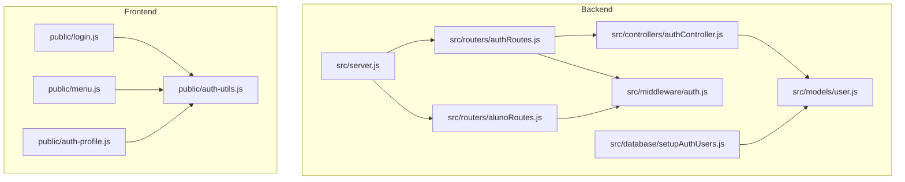
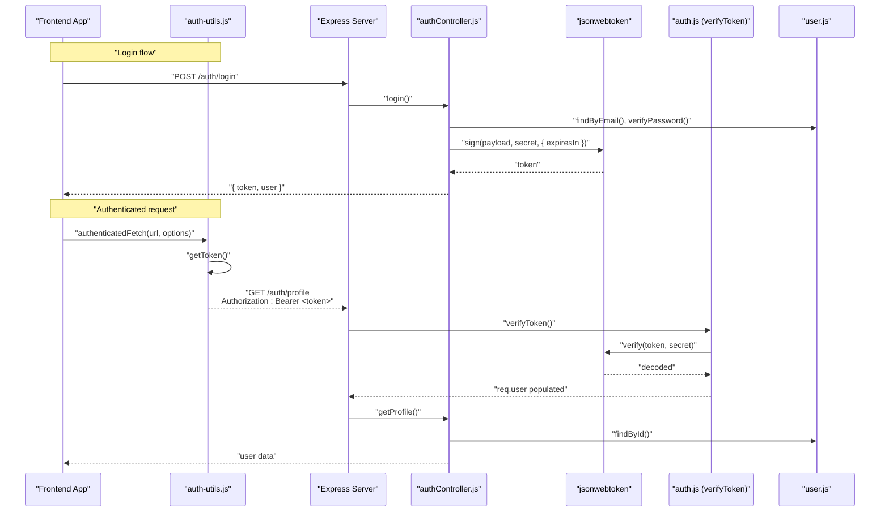
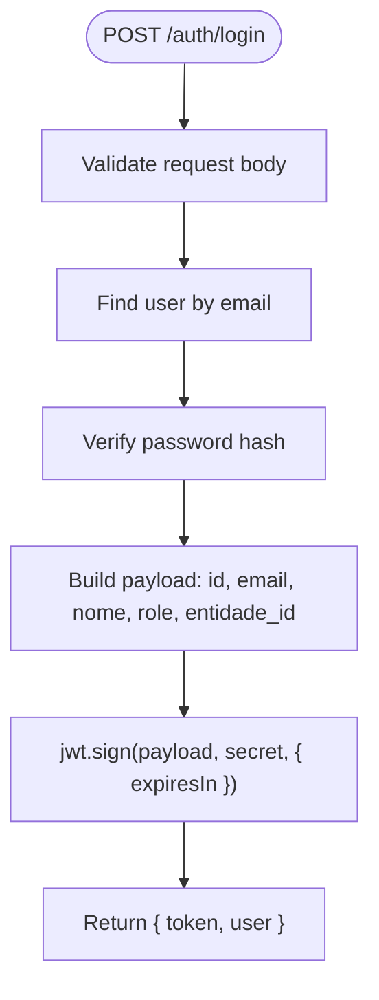
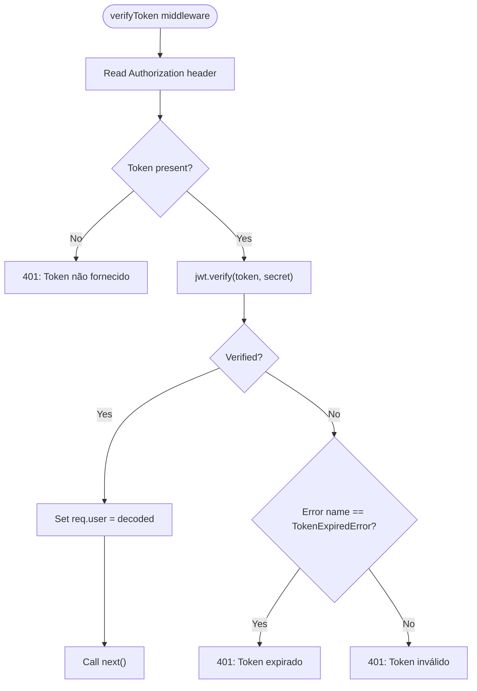
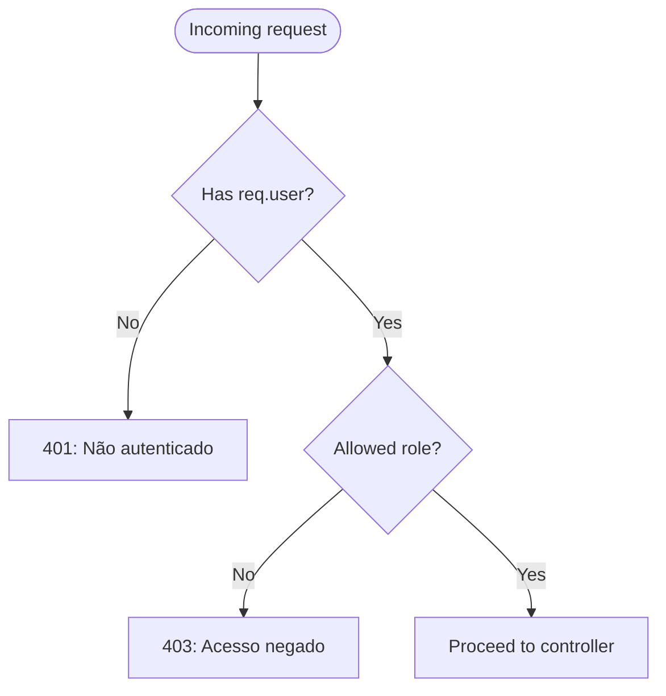
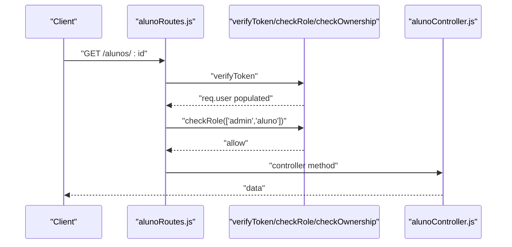
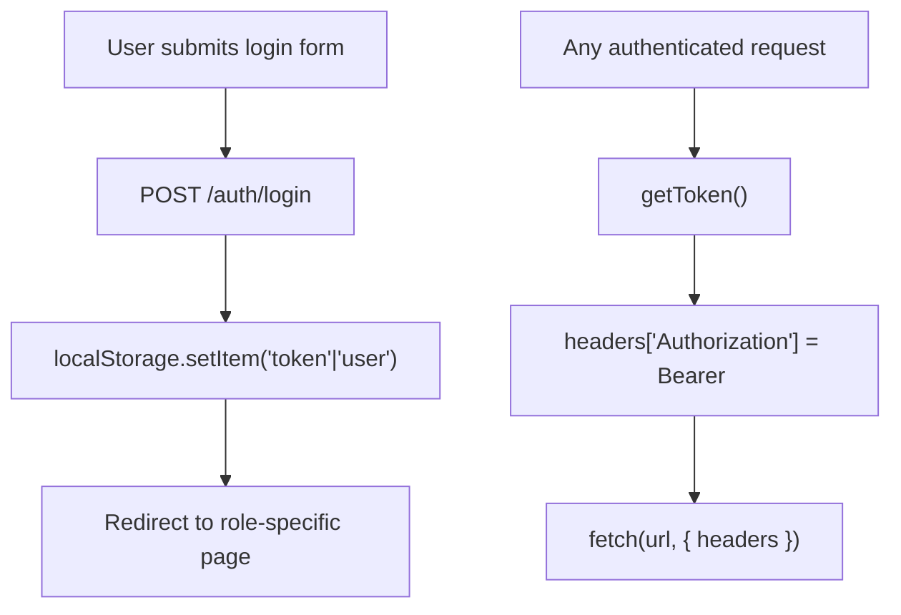
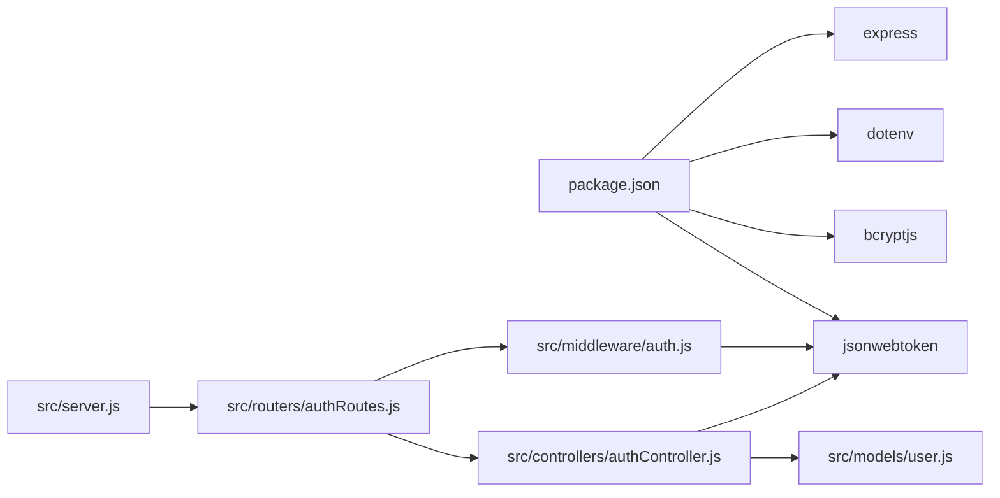

# JWT Token Implementation

<cite>
**Referenced Files in This Document**
- [src/middleware/auth.js](file://src/middleware/auth.js)
- [src/controllers/authController.js](file://src/controllers/authController.js)
- [src/routers/authRoutes.js](file://src/routers/authRoutes.js)
- [src/models/user.js](file://src/models/user.js)
- [src/server.js](file://src/server.js)
- [AUTH_GUIDE.md](file://AUTH_GUIDE.md)
- [public/login.js](file://public/login.js)
- [public/auth-utils.js](file://public/auth-utils.js)
- [public/menu.js](file://public/menu.js)
- [public/auth-profile.js](file://public/auth-profile.js)
- [src/routers/alunoRoutes.js](file://src/routers/alunoRoutes.js)
- [src/database/setupAuthUsers.js](file://src/database/setupAuthUsers.js)
- [package.json](file://package.json)
</cite>

## Table of Contents
1. [Introduction](#introduction)
2. [Project Structure](#project-structure)
3. [Core Components](#core-components)
4. [Architecture Overview](#architecture-overview)
5. [Detailed Component Analysis](#detailed-component-analysis)
6. [Dependency Analysis](#dependency-analysis)
7. [Performance Considerations](#performance-considerations)
8. [Troubleshooting Guide](#troubleshooting-guide)
9. [Conclusion](#conclusion)
10. [Appendices](#appendices)

## Introduction
This document explains the JWT token implementation in NodeMural. It covers token generation, payload structure, validation, expiration handling, middleware behavior, frontend storage recommendations, refresh strategies, security considerations, and integration patterns. The backend uses Express with jsonwebtoken for signing and verifying tokens, while the frontend stores tokens in localStorage and attaches them to API requests via the Authorization header.

## Project Structure
The JWT implementation spans backend controllers, middleware, routes, and models, plus frontend utilities and pages that consume the API.

**Diagram sources**
- [src/server.js](file://src/server.js#L31-L54)
- [src/routers/authRoutes.js](file://src/routers/authRoutes.js#L1-L20)
- [src/routers/alunoRoutes.js](file://src/routers/alunoRoutes.js#L1-L25)
- [src/controllers/authController.js](file://src/controllers/authController.js#L1-L157)
- [src/middleware/auth.js](file://src/middleware/auth.js#L1-L137)
- [src/models/user.js](file://src/models/user.js#L1-L146)
- [src/database/setupAuthUsers.js](file://src/database/setupAuthUsers.js#L1-L38)
- [public/login.js](file://public/login.js#L1-L62)
- [public/auth-utils.js](file://public/auth-utils.js#L1-L88)
- [public/menu.js](file://public/menu.js#L1-L78)
- [public/auth-profile.js](file://public/auth-profile.js#L1-L29)

**Section sources**
- [src/server.js](file://src/server.js#L31-L54)
- [src/routers/authRoutes.js](file://src/routers/authRoutes.js#L1-L20)
- [src/routers/alunoRoutes.js](file://src/routers/alunoRoutes.js#L1-L25)
- [src/controllers/authController.js](file://src/controllers/authController.js#L1-L157)
- [src/middleware/auth.js](file://src/middleware/auth.js#L1-L137)
- [src/models/user.js](file://src/models/user.js#L1-L146)
- [src/database/setupAuthUsers.js](file://src/database/setupAuthUsers.js#L1-L38)
- [public/login.js](file://public/login.js#L1-L62)
- [public/auth-utils.js](file://public/auth-utils.js#L1-L88)
- [public/menu.js](file://public/menu.js#L1-L78)
- [public/auth-profile.js](file://public/auth-profile.js#L1-L29)

## Core Components
- JWT secret and expiry are configured via environment variables.
- Token payload includes user identity and role attributes.
- Verification middleware decodes tokens and populates req.user.
- Role-based access control restricts protected routes.
- Frontend utilities store tokens and attach Authorization headers.

Key implementation references:
- Token generation and payload: [src/controllers/authController.js](file://src/controllers/authController.js#L98-L109)
- Token verification middleware: [src/middleware/auth.js](file://src/middleware/auth.js#L6-L29)
- Role enforcement middleware: [src/middleware/auth.js](file://src/middleware/auth.js#L32-L48)
- Frontend token storage and Authorization header: [public/auth-utils.js](file://public/auth-utils.js#L45-L54), [public/login.js](file://public/login.js#L48-L49)

**Section sources**
- [src/controllers/authController.js](file://src/controllers/authController.js#L98-L109)
- [src/middleware/auth.js](file://src/middleware/auth.js#L6-L29)
- [src/middleware/auth.js](file://src/middleware/auth.js#L32-L48)
- [public/auth-utils.js](file://public/auth-utils.js#L45-L54)
- [public/login.js](file://public/login.js#L48-L49)

## Architecture Overview
The JWT flow connects frontend clients to backend endpoints through secure middleware and controllers.

**Diagram sources**
- [src/controllers/authController.js](file://src/controllers/authController.js#L76-L127)
- [src/middleware/auth.js](file://src/middleware/auth.js#L6-L29)
- [src/models/user.js](file://src/models/user.js#L36-L60)
- [public/auth-utils.js](file://public/auth-utils.js#L45-L54)

**Section sources**
- [src/controllers/authController.js](file://src/controllers/authController.js#L76-L127)
- [src/middleware/auth.js](file://src/middleware/auth.js#L6-L29)
- [src/models/user.js](file://src/models/user.js#L36-L60)
- [public/auth-utils.js](file://public/auth-utils.js#L45-L54)

## Detailed Component Analysis

### Backend JWT Generation and Payload
- The login endpoint signs a JWT with a payload containing user identity and role attributes.
- Expiration is controlled by an environment variable; defaults to a long-lived token if unspecified.
- The generated token is returned alongside user data to the frontend.

Implementation references:
- Token sign call and payload: [src/controllers/authController.js](file://src/controllers/authController.js#L98-L109)
- Environment variables for secret and expiry: [AUTH_GUIDE.md](file://AUTH_GUIDE.md#L244-L250)

**Diagram sources**
- [src/controllers/authController.js](file://src/controllers/authController.js#L76-L127)

**Section sources**
- [src/controllers/authController.js](file://src/controllers/authController.js#L98-L109)
- [AUTH_GUIDE.md](file://AUTH_GUIDE.md#L244-L250)

### Token Verification Middleware
- Extracts the Authorization header, splits on whitespace, and verifies the token using the configured secret.
- Populates req.user with the decoded payload on success.
- Handles missing token, invalid token, and expired token scenarios with appropriate HTTP status codes.

Implementation references:
- Header parsing and verification: [src/middleware/auth.js](file://src/middleware/auth.js#L6-L29)
- Error handling for expired vs invalid tokens: [src/middleware/auth.js](file://src/middleware/auth.js#L22-L28)

**Diagram sources**
- [src/middleware/auth.js](file://src/middleware/auth.js#L6-L29)

**Section sources**
- [src/middleware/auth.js](file://src/middleware/auth.js#L6-L29)

### Role-Based Access Control (RBAC)
- A higher-order function generates role-checking middleware that enforces allowed roles.
- The current user’s role is taken from req.user (populated by verifyToken).
- Admin users bypass ownership checks in several routes.

Implementation references:
- Role checker generator: [src/middleware/auth.js](file://src/middleware/auth.js#L32-L48)
- Ownership enforcement: [src/middleware/auth.js](file://src/middleware/auth.js#L77-L98)
- Admin bypass in routes: [src/routers/alunoRoutes.js](file://src/routers/alunoRoutes.js#L21-L23)

**Diagram sources**
- [src/middleware/auth.js](file://src/middleware/auth.js#L32-L48)

**Section sources**
- [src/middleware/auth.js](file://src/middleware/auth.js#L32-L48)
- [src/middleware/auth.js](file://src/middleware/auth.js#L77-L98)
- [src/routers/alunoRoutes.js](file://src/routers/alunoRoutes.js#L21-L23)

### Protected Routes and Ownership Checks
- Routes under /auth and resource routes apply verifyToken and optional role or ownership checks.
- Ownership middleware allows admins and validates that non-admin users can only access or modify their own records.

Implementation references:
- Protected auth routes: [src/routers/authRoutes.js](file://src/routers/authRoutes.js#L13-L17)
- Ownership enforcement: [src/middleware/auth.js](file://src/middleware/auth.js#L77-L98)
- Example protected aluno routes: [src/routers/alunoRoutes.js](file://src/routers/alunoRoutes.js#L15-L23)

**Diagram sources**
- [src/routers/alunoRoutes.js](file://src/routers/alunoRoutes.js#L15-L23)
- [src/middleware/auth.js](file://src/middleware/auth.js#L32-L48)
- [src/middleware/auth.js](file://src/middleware/auth.js#L77-L98)

**Section sources**
- [src/routers/authRoutes.js](file://src/routers/authRoutes.js#L13-L17)
- [src/routers/alunoRoutes.js](file://src/routers/alunoRoutes.js#L15-L23)
- [src/middleware/auth.js](file://src/middleware/auth.js#L77-L98)

### Frontend Token Storage and Usage
- The frontend stores the JWT in localStorage upon successful login and retrieves it for authenticated requests.
- A helper function attaches the Authorization header with the Bearer scheme to outgoing fetch requests.
- Navigation guards redirect unauthenticated users to the login page.

Implementation references:
- Storing token and user: [public/login.js](file://public/login.js#L48-L49)
- Authorization header injection: [public/auth-utils.js](file://public/auth-utils.js#L45-L54)
- Redirect to login if not authenticated: [public/auth-utils.js](file://public/auth-utils.js#L83-L87)
- Menu updates and logout clearing localStorage: [public/menu.js](file://public/menu.js#L64-L67)

**Diagram sources**
- [public/login.js](file://public/login.js#L31-L57)
- [public/auth-utils.js](file://public/auth-utils.js#L25-L54)
- [public/menu.js](file://public/menu.js#L64-L67)

**Section sources**
- [public/login.js](file://public/login.js#L48-L49)
- [public/auth-utils.js](file://public/auth-utils.js#L45-L54)
- [public/auth-utils.js](file://public/auth-utils.js#L83-L87)
- [public/menu.js](file://public/menu.js#L64-L67)

### Token Refresh Strategies
- The current implementation does not include automatic token refresh. Tokens are signed with a fixed expiration period.
- Recommended approaches:
  - Shorter accessToken TTL with a separate long-lived refreshToken stored securely (e.g., httpOnly cookie) for obtaining a new accessToken.
  - Frontend polling to detect 401 responses and prompting re-authentication or redirecting to login.
  - Implementing a dedicated /auth/refresh endpoint that validates refreshToken and issues a new accessToken.

[No sources needed since this section provides general guidance]

### Token Security Measures and Production Considerations
- Configure a strong JWT_SECRET in production and keep it out of version control.
- Use HTTPS in production to prevent token interception.
- Consider short token lifetimes and refresh tokens for reduced risk.
- Avoid storing sensitive tokens in localStorage if XSS is a concern; prefer httpOnly cookies for the refresh token and a minimal in-memory token for the access token if feasible.

[No sources needed since this section provides general guidance]

## Dependency Analysis
The JWT implementation depends on Express routing, jsonwebtoken for signing/verifying, bcryptjs for password hashing, and MariaDB for persistence.

**Diagram sources**
- [package.json](file://package.json#L22-L30)
- [src/server.js](file://src/server.js#L31-L54)
- [src/routers/authRoutes.js](file://src/routers/authRoutes.js#L1-L20)
- [src/controllers/authController.js](file://src/controllers/authController.js#L1-L157)
- [src/middleware/auth.js](file://src/middleware/auth.js#L1-L137)
- [src/models/user.js](file://src/models/user.js#L1-L146)

**Section sources**
- [package.json](file://package.json#L22-L30)
- [src/server.js](file://src/server.js#L31-L54)
- [src/routers/authRoutes.js](file://src/routers/authRoutes.js#L1-L20)
- [src/controllers/authController.js](file://src/controllers/authController.js#L1-L157)
- [src/middleware/auth.js](file://src/middleware/auth.js#L1-L137)
- [src/models/user.js](file://src/models/user.js#L1-L146)

## Performance Considerations
- Keep token payloads minimal to reduce header sizes.
- Avoid unnecessary database lookups in middleware; rely on decoded claims for basic checks.
- Use short-lived access tokens with refresh tokens to minimize long-term exposure.

[No sources needed since this section provides general guidance]

## Troubleshooting Guide
Common errors and resolutions:
- Missing token: Ensure Authorization header is sent with "Bearer <token>".
- Invalid or malformed token: Verify JWT_SECRET matches the backend configuration and the token was not tampered with.
- Expired token: Prompt the user to log in again or implement a refresh mechanism.
- Permission denied: Confirm the user’s role and that ownership checks align with the requested resource.

Implementation references:
- Error responses and handling: [src/middleware/auth.js](file://src/middleware/auth.js#L22-L28), [src/middleware/auth.js](file://src/middleware/auth.js#L68-L73)
- Endpoint error meanings: [AUTH_GUIDE.md](file://AUTH_GUIDE.md#L289-L299)

**Section sources**
- [src/middleware/auth.js](file://src/middleware/auth.js#L22-L28)
- [src/middleware/auth.js](file://src/middleware/auth.js#L68-L73)
- [AUTH_GUIDE.md](file://AUTH_GUIDE.md#L289-L299)

## Conclusion
NodeMural’s JWT implementation provides secure authentication and RBAC through a verified token pipeline. The backend signs tokens with essential user claims, the middleware validates them, and the frontend manages tokens and Authorization headers. For production, adopt stronger secrets, HTTPS, and refresh token strategies to enhance security and resilience.

## Appendices

### Practical Examples of Token Usage
- Include Authorization header with Bearer token in API requests: [public/auth-utils.js](file://public/auth-utils.js#L45-L54)
- Example cURL usage: [AUTH_GUIDE.md](file://AUTH_GUIDE.md#L186-L190)

**Section sources**
- [public/auth-utils.js](file://public/auth-utils.js#L45-L54)
- [AUTH_GUIDE.md](file://AUTH_GUIDE.md#L186-L190)

### Token Lifecycle Management Best Practices
- Use short-lived access tokens and long-lived refresh tokens.
- Store refresh tokens in httpOnly cookies; store access tokens in memory or secure storage.
- Implement silent re-authentication on 401 responses.
- Rotate secrets regularly and monitor token issuance.

[No sources needed since this section provides general guidance]

### Database Schema for Authentication
- The auth_users table supports hashed passwords, roles, and soft deletion.

**Section sources**
- [src/database/setupAuthUsers.js](file://src/database/setupAuthUsers.js#L11-L22)