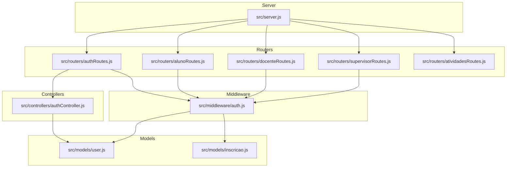
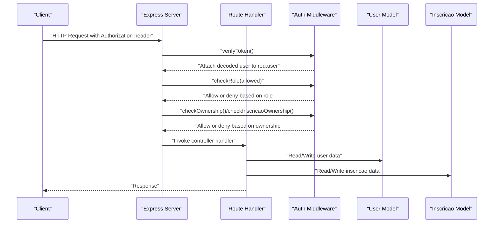
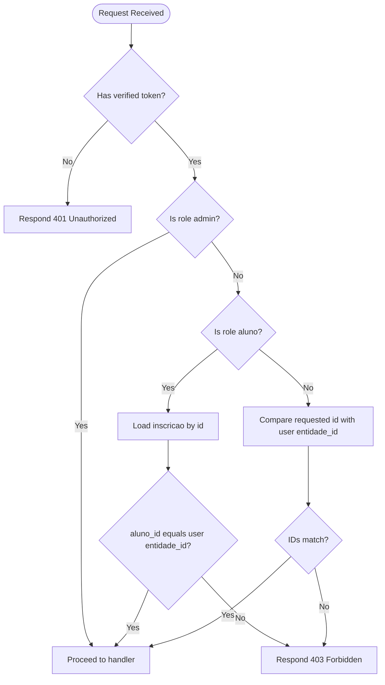
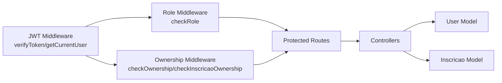

# Role-Based Access Control (RBAC)

<cite>
**Referenced Files in This Document**
- [AUTH_GUIDE.md](file://AUTH_GUIDE.md)
- [src/middleware/auth.js](file://src/middleware/auth.js)
- [src/models/user.js](file://src/models/user.js)
- [src/models/inscricao.js](file://src/models/inscricao.js)
- [src/controllers/authController.js](file://src/controllers/authController.js)
- [src/routers/authRoutes.js](file://src/routers/authRoutes.js)
- [src/routers/alunoRoutes.js](file://src/routers/alunoRoutes.js)
- [src/routers/docenteRoutes.js](file://src/routers/docenteRoutes.js)
- [src/routers/supervisorRoutes.js](file://src/routers/supervisorRoutes.js)
- [src/routers/atividadesRoutes.js](file://src/routers/atividadesRoutes.js)
- [src/server.js](file://src/server.js)
- [src/database/setupAuthUsers.js](file://src/database/setupAuthUsers.js)
</cite>

## Table of Contents
1. [Introduction](#introduction)
2. [Project Structure](#project-structure)
3. [Core Components](#core-components)
4. [Architecture Overview](#architecture-overview)
5. [Detailed Component Analysis](#detailed-component-analysis)
6. [Dependency Analysis](#dependency-analysis)
7. [Performance Considerations](#performance-considerations)
8. [Troubleshooting Guide](#troubleshooting-guide)
9. [Conclusion](#conclusion)
10. [Appendices](#appendices)

## Introduction
This document explains the Role-Based Access Control (RBAC) system in NodeMural. It covers the four user roles (admin, supervisor, docente, aluno), how role validation is enforced via middleware, how user context is maintained during requests, and how route protection is applied. It also details ownership checks, practical examples of protecting routes, and best practices for secure role-based authorization.

## Project Structure
The RBAC implementation spans middleware, models, controllers, routers, and server configuration. Authentication and authorization are centralized in the auth middleware and enforced across routes.

**Diagram sources**
- [src/server.js](file://src/server.js#L31-L54)
- [src/routers/authRoutes.js](file://src/routers/authRoutes.js#L1-L20)
- [src/routers/alunoRoutes.js](file://src/routers/alunoRoutes.js#L1-L25)
- [src/routers/docenteRoutes.js](file://src/routers/docenteRoutes.js#L1-L20)
- [src/routers/supervisorRoutes.js](file://src/routers/supervisorRoutes.js#L1-L27)
- [src/routers/atividadesRoutes.js](file://src/routers/atividadesRoutes.js#L1-L20)
- [src/middleware/auth.js](file://src/middleware/auth.js#L1-L137)
- [src/controllers/authController.js](file://src/controllers/authController.js#L1-L157)
- [src/models/user.js](file://src/models/user.js#L1-L146)
- [src/models/inscricao.js](file://src/models/inscricao.js#L1-L104)

**Section sources**
- [src/server.js](file://src/server.js#L31-L54)
- [src/routers/authRoutes.js](file://src/routers/authRoutes.js#L1-L20)
- [src/routers/alunoRoutes.js](file://src/routers/alunoRoutes.js#L1-L25)
- [src/routers/docenteRoutes.js](file://src/routers/docenteRoutes.js#L1-L20)
- [src/routers/supervisorRoutes.js](file://src/routers/supervisorRoutes.js#L1-L27)
- [src/routers/atividadesRoutes.js](file://src/routers/atividadesRoutes.js#L1-L20)
- [src/middleware/auth.js](file://src/middleware/auth.js#L1-L137)
- [src/controllers/authController.js](file://src/controllers/authController.js#L1-L157)
- [src/models/user.js](file://src/models/user.js#L1-L146)
- [src/models/inscricao.js](file://src/models/inscricao.js#L1-L104)

## Core Components
- JWT-based authentication stores user identity, role, and entity association in the token payload.
- Role enforcement middleware verifies presence of a valid token and checks allowed roles.
- Ownership middleware ensures users can only access or modify their own records or related entities.
- Controllers and routers apply middleware to enforce protection policies consistently.

Key implementation references:
- JWT generation and decoding in the auth controller.
- Role middleware and ownership helpers in the auth middleware.
- User model operations for role updates and lookups.
- Router examples applying middleware to protect endpoints.

**Section sources**
- [src/controllers/authController.js](file://src/controllers/authController.js#L76-L127)
- [src/middleware/auth.js](file://src/middleware/auth.js#L6-L29)
- [src/middleware/auth.js](file://src/middleware/auth.js#L31-L48)
- [src/middleware/auth.js](file://src/middleware/auth.js#L76-L98)
- [src/middleware/auth.js](file://src/middleware/auth.js#L100-L136)
- [src/models/user.js](file://src/models/user.js#L106-L142)
- [src/routers/authRoutes.js](file://src/routers/authRoutes.js#L8-L17)
- [src/routers/alunoRoutes.js](file://src/routers/alunoRoutes.js#L20-L23)
- [src/routers/docenteRoutes.js](file://src/routers/docenteRoutes.js#L11-L17)
- [src/routers/supervisorRoutes.js](file://src/routers/supervisorRoutes.js#L12-L24)

## Architecture Overview
The RBAC architecture enforces authentication and authorization across routes using middleware. The flow below shows how a request moves through the system to reach protected resources.

**Diagram sources**
- [src/server.js](file://src/server.js#L31-L54)
- [src/routers/authRoutes.js](file://src/routers/authRoutes.js#L8-L17)
- [src/routers/alunoRoutes.js](file://src/routers/alunoRoutes.js#L20-L23)
- [src/routers/docenteRoutes.js](file://src/routers/docenteRoutes.js#L11-L17)
- [src/routers/supervisorRoutes.js](file://src/routers/supervisorRoutes.js#L12-L24)
- [src/middleware/auth.js](file://src/middleware/auth.js#L6-L29)
- [src/middleware/auth.js](file://src/middleware/auth.js#L31-L48)
- [src/middleware/auth.js](file://src/middleware/auth.js#L76-L98)
- [src/middleware/auth.js](file://src/middleware/auth.js#L100-L136)
- [src/models/user.js](file://src/models/user.js#L106-L142)
- [src/models/inscricao.js](file://src/models/inscricao.js#L30-L38)

## Detailed Component Analysis

### Roles and Permissions
- admin: Full access to all endpoints.
- supervisor: Can manage estagiarios and view inscriptions; restricted write access to supervisor-owned entities.
- docente: Can manage alunos and atividades; restricted write access to docente-owned entities.
- aluno: Can view own data and public resources; restricted write access to aluno-owned entities.

These roles and their typical capabilities are documented in the project guide.

**Section sources**
- [AUTH_GUIDE.md](file://AUTH_GUIDE.md#L194-L202)

### checkRole Middleware
Purpose:
- Enforce role-based access by verifying that the authenticated user’s role is included in the allowed set.

Behavior:
- Requires a verified token to be present on the request.
- Compares the user’s role against allowed roles and denies access if not permitted.

Usage patterns:
- Apply to routes requiring admin-only actions.
- Combine with ownership checks for entity-specific modifications.

**Section sources**
- [src/middleware/auth.js](file://src/middleware/auth.js#L31-L48)
- [src/routers/authRoutes.js](file://src/routers/authRoutes.js#L16-L17)
- [src/routers/alunoRoutes.js](file://src/routers/alunoRoutes.js#L21-L23)
- [src/routers/docenteRoutes.js](file://src/routers/docenteRoutes.js#L12-L17)
- [src/routers/supervisorRoutes.js](file://src/routers/supervisorRoutes.js#L13-L24)

### getCurrentUser Functionality
Purpose:
- Decode and return the current user’s information from the JWT without modifying the request.

Behavior:
- Extracts the token from the Authorization header.
- Verifies the token and responds with the decoded user payload.

Integration:
- Used for endpoints that need to display or confirm the current user’s identity.

**Section sources**
- [src/middleware/auth.js](file://src/middleware/auth.js#L50-L74)
- [src/routers/authRoutes.js](file://src/routers/authRoutes.js#L11)

### Entity Ownership Validation
Two ownership helpers ensure users can only access or modify their own data:

- checkOwnership:
  - Admin bypasses ownership checks.
  - Compares the requested resource ID with the user’s entity association.
  - Allows access when IDs match; otherwise denies.

- checkInscricaoOwnership:
  - Admin bypasses ownership checks.
  - Restricts to aluno role.
  - Loads the inscricao record and compares aluno_id with the user’s entity ID.

**Diagram sources**
- [src/middleware/auth.js](file://src/middleware/auth.js#L76-L98)
- [src/middleware/auth.js](file://src/middleware/auth.js#L100-L136)

**Section sources**
- [src/middleware/auth.js](file://src/middleware/auth.js#L76-L98)
- [src/middleware/auth.js](file://src/middleware/auth.js#L100-L136)
- [src/models/inscricao.js](file://src/models/inscricao.js#L30-L38)

### Route Protection Patterns
Public endpoints:
- Registration and login are publicly accessible.
- Example: POST /auth/register, POST /auth/login.

Protected endpoints:
- Require authentication via verifyToken.
- Example: GET /auth/profile.

Admin-only endpoints:
- Require admin role.
- Example: GET /auth/users.

Role-scoped endpoints:
- Examples:
  - GET /alunos (public), GET /alunos/:id/inscricoes (protected)
  - POST/PUT/DELETE /alunos with role admin or aluno and ownership checks
  - GET /docentes/:id/estagiarios (role admin or docente)
  - GET /supervisores/:id/instituicoes (role admin or supervisor)

Ownership-protected endpoints:
- PUT/DELETE routes often include checkOwnership to restrict access to the user’s own entity.

**Section sources**
- [src/routers/authRoutes.js](file://src/routers/authRoutes.js#L8-L17)
- [src/routers/alunoRoutes.js](file://src/routers/alunoRoutes.js#L11-L23)
- [src/routers/docenteRoutes.js](file://src/routers/docenteRoutes.js#L11-L17)
- [src/routers/supervisorRoutes.js](file://src/routers/supervisorRoutes.js#L12-L24)

### Practical Scenarios and Examples
- Enforcing admin-only deletion:
  - Apply checkRole(['admin']) to DELETE routes.
  - Reference: [src/routers/alunoRoutes.js](file://src/routers/alunoRoutes.js#L23)

- Role-scoped creation:
  - Allow admin and aluno to POST /alunos; combine with ownership checks for updates.
  - Reference: [src/routers/alunoRoutes.js](file://src/routers/alunoRoutes.js#L21-L23)

- Docente-managed entities:
  - GET /docentes/:id/estagiarios requires admin or docente and ownership checks.
  - Reference: [src/routers/docenteRoutes.js](file://src/routers/docenteRoutes.js#L12-L14)

- Supervisor-managed institutions:
  - GET/POST/DELETE /supervisores/:id/instituicoes require admin or supervisor and ownership checks.
  - Reference: [src/routers/supervisorRoutes.js](file://src/routers/supervisorRoutes.js#L17-L20)

- Aluno-only inscricao access:
  - Use checkInscricaoOwnership to ensure only the aluno can access their own inscricoes.
  - Reference: [src/middleware/auth.js](file://src/middleware/auth.js#L100-L136)

### Role Inheritance and Escalation
- Admin role acts as a superuser with unrestricted access.
- Ownership checks override role allowances for entity-specific operations.
- Role escalation is not implemented as a built-in mechanism; administrative privileges are granted by assigning the admin role.

**Section sources**
- [src/middleware/auth.js](file://src/middleware/auth.js#L76-L98)
- [src/models/user.js](file://src/models/user.js#L131-L142)

### Relationship Between Roles and Entities
- The token payload carries role and entidade_id, enabling ownership checks.
- The user model supports role updates and soft-deletion, which can be used to escalate or revoke privileges.

**Section sources**
- [src/controllers/authController.js](file://src/controllers/authController.js#L98-L121)
- [src/models/user.js](file://src/models/user.js#L131-L142)

## Dependency Analysis
The RBAC system depends on:
- JWT middleware for authentication.
- Role middleware for authorization.
- Ownership middleware for entity-level checks.
- User model for role management and lookups.
- Inscricao model for aluno-specific ownership validation.

**Diagram sources**
- [src/middleware/auth.js](file://src/middleware/auth.js#L6-L29)
- [src/middleware/auth.js](file://src/middleware/auth.js#L31-L48)
- [src/middleware/auth.js](file://src/middleware/auth.js#L76-L98)
- [src/middleware/auth.js](file://src/middleware/auth.js#L100-L136)
- [src/models/user.js](file://src/models/user.js#L106-L142)
- [src/models/inscricao.js](file://src/models/inscricao.js#L30-L38)

**Section sources**
- [src/middleware/auth.js](file://src/middleware/auth.js#L1-L137)
- [src/models/user.js](file://src/models/user.js#L1-L146)
- [src/models/inscricao.js](file://src/models/inscricao.js#L1-L104)

## Performance Considerations
- Keep middleware order minimal and avoid redundant validations.
- Cache frequently accessed user metadata when appropriate.
- Use targeted queries in ownership checks to reduce overhead.
- Monitor token verification costs and consider short-lived tokens with refresh strategies.

## Troubleshooting Guide
Common issues and resolutions:
- 401 Token errors:
  - Missing or invalid Authorization header.
  - Expired token.
  - Verify token presence and validity in middleware.
  - References: [src/middleware/auth.js](file://src/middleware/auth.js#L6-L29), [src/middleware/auth.js](file://src/middleware/auth.js#L50-L74)

- 403 Access denied:
  - Insufficient role or failed ownership check.
  - Confirm allowed roles and entity associations.
  - References: [src/middleware/auth.js](file://src/middleware/auth.js#L31-L48), [src/middleware/auth.js](file://src/middleware/auth.js#L76-L98), [src/middleware/auth.js](file://src/middleware/auth.js#L100-L136)

- 404 Not found:
  - Resource does not exist; ensure IDs are correct.
  - Reference: [src/middleware/auth.js](file://src/middleware/auth.js#L118-L122)

- 500 Internal errors:
  - Database or model errors during ownership validation.
  - Review model operations and error handling.
  - Reference: [src/middleware/auth.js](file://src/middleware/auth.js#L132-L136)

**Section sources**
- [src/middleware/auth.js](file://src/middleware/auth.js#L6-L29)
- [src/middleware/auth.js](file://src/middleware/auth.js#L31-L48)
- [src/middleware/auth.js](file://src/middleware/auth.js#L50-L74)
- [src/middleware/auth.js](file://src/middleware/auth.js#L76-L98)
- [src/middleware/auth.js](file://src/middleware/auth.js#L100-L136)
- [src/middleware/auth.js](file://src/middleware/auth.js#L118-L122)
- [src/middleware/auth.js](file://src/middleware/auth.js#L132-L136)

## Conclusion
NodeMural’s RBAC system combines JWT authentication, role-based middleware, and ownership checks to provide robust authorization. By consistently applying middleware across routes and leveraging entity associations, the system enforces clear boundaries between roles while allowing flexible, context-aware access control.

## Appendices

### Database Schema Notes
- The auth_users table defines roles and soft-delete support.
- References: [src/database/setupAuthUsers.js](file://src/database/setupAuthUsers.js#L11-L22)

**Section sources**
- [src/database/setupAuthUsers.js](file://src/database/setupAuthUsers.js#L11-L22)