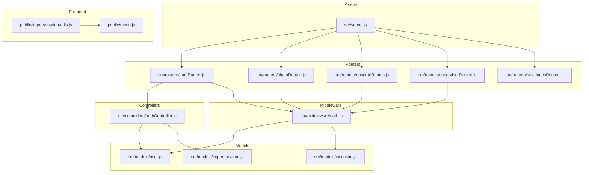
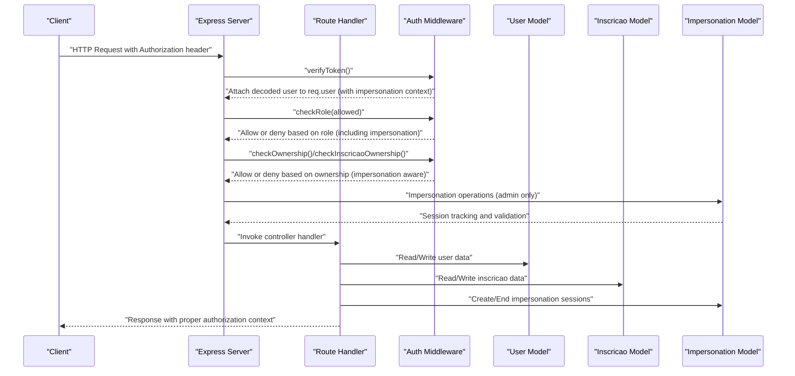
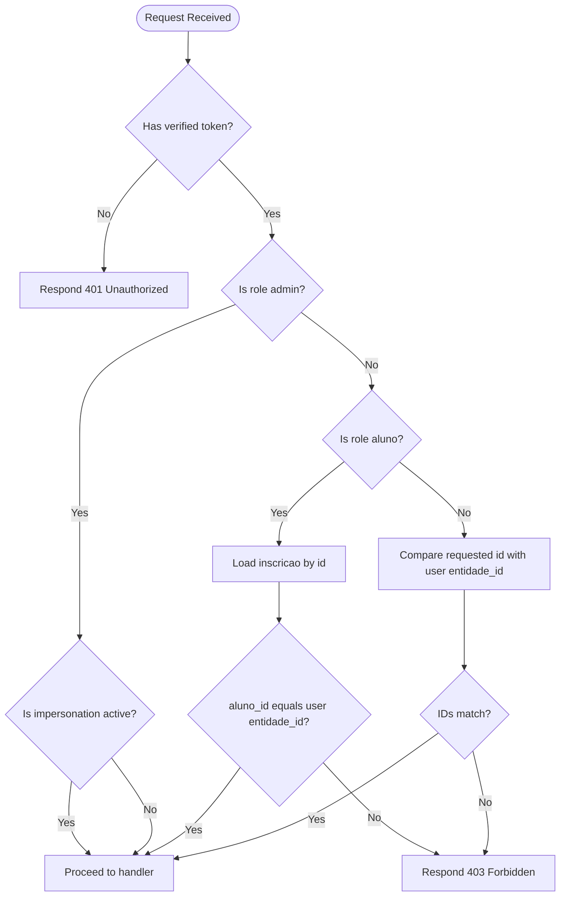
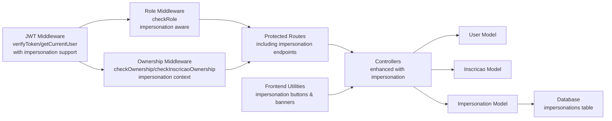

# Role-Based Access Control (RBAC)

<cite>
**Referenced Files in This Document**
- [AUTH_GUIDE.md](file://AUTH_GUIDE.md)
- [IMPERSONATION_GUIDE.md](file://IMPERSONATION_GUIDE.md)
- [QUICK_START_IMPERSONATION.md](file://QUICK_START_IMPERSONATION.md)
- [src/middleware/auth.js](file://src/middleware/auth.js)
- [src/models/user.js](file://src/models/user.js)
- [src/models/impersonation.js](file://src/models/impersonation.js)
- [src/models/inscricao.js](file://src/models/inscricao.js)
- [src/controllers/authController.js](file://src/controllers/authController.js)
- [src/routers/authRoutes.js](file://src/routers/authRoutes.js)
- [src/routers/alunoRoutes.js](file://src/routers/alunoRoutes.js)
- [src/routers/docenteRoutes.js](file://src/routers/docenteRoutes.js)
- [src/routers/supervisorRoutes.js](file://src/routers/supervisorRoutes.js)
- [src/routers/atividadesRoutes.js](file://src/routers/atividadesRoutes.js)
- [src/server.js](file://src/server.js)
- [src/database/setupAuthUsers.js](file://src/database/setupAuthUsers.js)
- [src/database/setupImpersonationsTable.js](file://src/database/setupImpersonationsTable.js)
- [src/database/create_impersonations_table.sql](file://src/database/create_impersonations_table.sql)
- [public/impersonation-utils.js](file://public/impersonation-utils.js)
- [public/menu.js](file://public/menu.js)
</cite>

## Update Summary
**Changes Made**
- Added comprehensive impersonation system documentation with admin-only impersonation capabilities
- Updated role-based access control to include impersonation-aware user context
- Enhanced frontend integration with visual impersonation indicators
- Added new database schema for impersonation session tracking
- Expanded security considerations to include impersonation audit trails

## Table of Contents
1. [Introduction](#introduction)
2. [Project Structure](#project-structure)
3. [Core Components](#core-components)
4. [Architecture Overview](#architecture-overview)
5. [Detailed Component Analysis](#detailed-component-analysis)
6. [Dependency Analysis](#dependency-analysis)
7. [Performance Considerations](#performance-considerations)
8. [Troubleshooting Guide](#troubleshooting-guide)
9. [Conclusion](#conclusion)
10. [Appendices](#appendices)

## Introduction
This document explains the Role-Based Access Control (RBAC) system in NodeMural, which has been enhanced with an advanced impersonation system. The system now supports four user roles (admin, supervisor, docente, aluno) with enhanced administrative capabilities including user impersonation for troubleshooting and support. The impersonation feature allows administrators to temporarily act as other users while maintaining strict security controls and audit trails.

## Project Structure
The RBAC implementation spans middleware, models, controllers, routers, and server configuration, with enhanced impersonation capabilities integrated throughout the frontend and backend systems.

```mermaid
graph TB
subgraph "Server"
S["src/server.js"]
end
subgraph "Routers"
RA["src/routers/authRoutes.js"]
RL["src/routers/alunoRoutes.js"]
RD["src/routers/docenteRoutes.js"]
RS["src/routers/supervisorRoutes.js"]
RT["src/routers/atividadesRoutes.js"]
end
subgraph "Middleware"
M["src/middleware/auth.js"]
end
subgraph "Controllers"
CA["src/controllers/authController.js"]
end
subgraph "Models"
MU["src/models/user.js"]
MI["src/models/inscricao.js"]
MP["src/models/impersonation.js"]
end
subgraph "Frontend"
FU["public/impersonation-utils.js"]
MENU["public/menu.js"]
end
S --> RA
S --> RL
S --> RD
S --> RS
S --> RT
RA --> CA
RL --> M
RD --> M
RS --> M
RA --> M
CA --> MU
CA --> MP
M --> MU
M --> MI
FU --> MENU
```

**Diagram sources**
- [src/server.js:31-54](file://src/server.js#L31-L54)
- [src/routers/authRoutes.js:1-28](file://src/routers/authRoutes.js#L1-L28)
- [src/routers/alunoRoutes.js:1-25](file://src/routers/alunoRoutes.js#L1-L25)
- [src/routers/docenteRoutes.js:1-20](file://src/routers/docenteRoutes.js#L1-L20)
- [src/routers/supervisorRoutes.js:1-27](file://src/routers/supervisorRoutes.js#L1-L27)
- [src/routers/atividadesRoutes.js:1-20](file://src/routers/atividadesRoutes.js#L1-L20)
- [src/middleware/auth.js:1-137](file://src/middleware/auth.js#L1-L137)
- [src/controllers/authController.js:262-401](file://src/controllers/authController.js#L262-L401)
- [src/models/user.js:1-146](file://src/models/user.js#L1-L146)
- [src/models/inscricao.js:1-104](file://src/models/inscricao.js#L1-L104)
- [src/models/impersonation.js:1-124](file://src/models/impersonation.js#L1-L124)
- [public/impersonation-utils.js:1-191](file://public/impersonation-utils.js#L1-L191)
- [public/menu.js:1-107](file://public/menu.js#L1-L107)

**Section sources**
- [src/server.js:31-54](file://src/server.js#L31-L54)
- [src/routers/authRoutes.js:1-28](file://src/routers/authRoutes.js#L1-L28)
- [src/routers/alunoRoutes.js:1-25](file://src/routers/alunoRoutes.js#L1-L25)
- [src/routers/docenteRoutes.js:1-20](file://src/routers/docenteRoutes.js#L1-L20)
- [src/routers/supervisorRoutes.js:1-27](file://src/routers/supervisorRoutes.js#L1-L27)
- [src/routers/atividadesRoutes.js:1-20](file://src/routers/atividadesRoutes.js#L1-L20)
- [src/middleware/auth.js:1-137](file://src/middleware/auth.js#L1-L137)
- [src/controllers/authController.js:262-401](file://src/controllers/authController.js#L262-L401)
- [src/models/user.js:1-146](file://src/models/user.js#L1-L146)
- [src/models/inscricao.js:1-104](file://src/models/inscricao.js#L1-L104)
- [src/models/impersonation.js:1-124](file://src/models/impersonation.js#L1-L124)
- [public/impersonation-utils.js:1-191](file://public/impersonation-utils.js#L1-L191)
- [public/menu.js:1-107](file://public/menu.js#L1-L107)

## Core Components
- JWT-based authentication with enhanced impersonation support, storing user identity, role, entity association, and impersonation state in token payload.
- Role enforcement middleware with impersonation awareness, verifying presence of valid token and checking allowed roles including impersonation contexts.
- Ownership middleware ensuring users can only access or modify their own records or related entities, with special handling for impersonated sessions.
- Impersonation system providing admin-only user simulation capabilities with comprehensive audit trails and security controls.
- Frontend integration with visual impersonation indicators and seamless token switching mechanisms.
- Controllers and routers applying middleware to enforce protection policies consistently across all endpoints.

Key implementation references:
- JWT generation and decoding with impersonation support in the auth controller.
- Role middleware and ownership helpers with impersonation awareness in the auth middleware.
- Impersonation data model and database operations for session tracking.
- User model operations for role updates and lookups.
- Router examples applying middleware to protect endpoints including impersonation routes.
- Frontend utilities for impersonation button generation and banner display.

**Section sources**
- [src/controllers/authController.js:262-327](file://src/controllers/authController.js#L262-L327)
- [src/controllers/authController.js:330-377](file://src/controllers/authController.js#L330-L377)
- [src/middleware/auth.js:6-29](file://src/middleware/auth.js#L6-L29)
- [src/middleware/auth.js:31-48](file://src/middleware/auth.js#L31-L48)
- [src/middleware/auth.js:76-98](file://src/middleware/auth.js#L76-L98)
- [src/middleware/auth.js:100-136](file://src/middleware/auth.js#L100-L136)
- [src/models/impersonation.js:1-124](file://src/models/impersonation.js#L1-L124)
- [src/models/user.js:106-142](file://src/models/user.js#L106-L142)
- [src/routers/authRoutes.js:21-25](file://src/routers/authRoutes.js#L21-L25)
- [src/routers/authRoutes.js:8-17](file://src/routers/authRoutes.js#L8-L17)
- [src/routers/alunoRoutes.js:20-23](file://src/routers/alunoRoutes.js#L20-L23)
- [src/routers/docenteRoutes.js:11-17](file://src/routers/docenteRoutes.js#L11-L17)
- [src/routers/supervisorRoutes.js:12-24](file://src/routers/supervisorRoutes.js#L12-L24)
- [public/impersonation-utils.js:7-43](file://public/impersonation-utils.js#L7-L43)
- [public/impersonation-utils.js:86-145](file://public/impersonation-utils.js#L86-L145)

## Architecture Overview
The enhanced RBAC architecture enforces authentication, authorization, and impersonation controls across routes using middleware. The flow below shows how a request moves through the system to reach protected resources, including impersonation scenarios.

```mermaid
sequenceDiagram
participant C as "Client"
participant S as "Express Server"
participant R as "Route Handler"
participant MW as "Auth Middleware"
participant U as "User Model"
participant I as "Inscricao Model"
participant P as "Impersonation Model"
C->>S : "HTTP Request with Authorization header"
S->>MW : "verifyToken()"
MW-->>S : "Attach decoded user to req.user (with impersonation context)"
S->>MW : "checkRole(allowed)"
MW-->>S : "Allow or deny based on role (including impersonation)"
S->>MW : "checkOwnership()/checkInscricaoOwnership()"
MW-->>S : "Allow or deny based on ownership (impersonation aware)"
S->>P : "Impersonation operations (admin only)"
P-->>S : "Session tracking and validation"
S->>R : "Invoke controller handler"
R->>U : "Read/Write user data"
R->>I : "Read/Write inscricao data"
R->>P : "Create/End impersonation sessions"
R-->>C : "Response with proper authorization context"
```

**Diagram sources**
- [src/server.js:31-54](file://src/server.js#L31-L54)
- [src/routers/authRoutes.js:21-25](file://src/routers/authRoutes.js#L21-L25)
- [src/routers/authRoutes.js:8-17](file://src/routers/authRoutes.js#L8-L17)
- [src/routers/alunoRoutes.js:20-23](file://src/routers/alunoRoutes.js#L20-L23)
- [src/routers/docenteRoutes.js:11-17](file://src/routers/docenteRoutes.js#L11-L17)
- [src/routers/supervisorRoutes.js:12-24](file://src/routers/supervisorRoutes.js#L12-L24)
- [src/middleware/auth.js:6-29](file://src/middleware/auth.js#L6-L29)
- [src/middleware/auth.js:31-48](file://src/middleware/auth.js#L31-L48)
- [src/middleware/auth.js:76-98](file://src/middleware/auth.js#L76-L98)
- [src/middleware/auth.js:100-136](file://src/middleware/auth.js#L100-L136)
- [src/models/user.js:106-142](file://src/models/user.js#L106-L142)
- [src/models/inscricao.js:30-38](file://src/models/inscricao.js#L30-L38)
- [src/models/impersonation.js:6-29](file://src/models/impersonation.js#L6-L29)

## Detailed Component Analysis

### Enhanced Roles and Permissions
- **admin**: Full access to all endpoints plus impersonation capabilities for troubleshooting and support.
- **supervisor**: Can manage estagiarios and view inscriptions; restricted write access to supervisor-owned entities; can impersonate non-admin users for support.
- **docente**: Can manage alunos and atividades; restricted write access to docente-owned entities; can impersonate alunos for support.
- **aluno**: Can view own data and public resources; restricted write access to aluno-owned entities; can be impersonated by authorized admins.

The impersonation system adds a new layer of administrative capability while maintaining strict security controls and audit trails.

**Section sources**
- [AUTH_GUIDE.md:194-202](file://AUTH_GUIDE.md#L194-L202)
- [IMPERSONATION_GUIDE.md:28-67](file://IMPERSONATION_GUIDE.md#L28-L67)

### Enhanced checkRole Middleware
Purpose:
- Enforce role-based access by verifying that the authenticated user's role is included in the allowed set, with impersonation awareness.

Behavior:
- Requires a verified token to be present on the request.
- Compares the user's role against allowed roles and denies access if not permitted.
- Handles impersonation context for admin users who may be acting on behalf of other users.

Usage patterns:
- Apply to routes requiring admin-only actions including impersonation.
- Combine with ownership checks for entity-specific modifications.
- Support both direct role access and impersonation-based access.

**Section sources**
- [src/middleware/auth.js:31-48](file://src/middleware/auth.js#L31-L48)
- [src/routers/authRoutes.js:21-25](file://src/routers/authRoutes.js#L21-L25)
- [src/routers/authRoutes.js:16-17](file://src/routers/authRoutes.js#L16-L17)
- [src/routers/alunoRoutes.js:21-23](file://src/routers/alunoRoutes.js#L21-L23)
- [src/routers/docenteRoutes.js:12-17](file://src/routers/docenteRoutes.js#L12-L17)
- [src/routers/supervisorRoutes.js:13-24](file://src/routers/supervisorRoutes.js#L13-L24)

### getCurrentUser Functionality with Impersonation Support
Purpose:
- Decode and return the current user's information from the JWT without modifying the request, including impersonation context.

Behavior:
- Extracts the token from the Authorization header.
- Verifies the token and responds with the decoded user payload including impersonation flags.
- Supports both regular user sessions and impersonated sessions.

Integration:
- Used for endpoints that need to display or confirm the current user's identity.
- Provides impersonation state for frontend visual indicators.
- Enables conditional UI rendering based on impersonation status.

**Section sources**
- [src/middleware/auth.js:50-74](file://src/middleware/auth.js#L50-L74)
- [src/routers/authRoutes.js](file://src/routers/authRoutes.js#L11)
- [public/impersonation-utils.js:176-184](file://public/impersonation-utils.js#L176-L184)

### Enhanced Entity Ownership Validation
Two ownership helpers ensure users can only access or modify their own data, with enhanced impersonation awareness:

- **checkOwnership**:
  - Admin bypasses ownership checks.
  - Impersonation-aware: Admins can access impersonated user data within defined limits.
  - Compares the requested resource ID with the user's entity association.
  - Allows access when IDs match; otherwise denies.

- **checkInscricaoOwnership**:
  - Admin bypasses ownership checks.
  - Impersonation-aware: Admins can access aluno inscricoes during impersonation.
  - Restricts to aluno role.
  - Loads the inscricao record and compares aluno_id with the user's entity ID.

```mermaid
flowchart TD
Start(["Request Received"]) --> HasToken{"Has verified token?"}
HasToken --> |No| E401["Respond 401 Unauthorized"]
HasToken --> |Yes| IsAdmin{"Is role admin?"}
IsAdmin --> |Yes| CheckImpersonation{"Is impersonation active?"}
CheckImpersonation --> |Yes| Allow["Proceed to handler (impersonation aware)"]
CheckImpersonation --> |No| Allow["Proceed to handler"]
IsAdmin --> |No| IsAluno{"Is role aluno?"}
IsAluno --> |Yes| LoadInscricao["Load inscricao by id"]
LoadInscricao --> Match{"aluno_id equals user entidade_id?"}
Match --> |Yes| Allow
Match --> |No| E403["Respond 403 Forbidden"]
IsAluno --> |No| CompareID["Compare requested id with user entidade_id"]
CompareID --> Same{"IDs match?"}
Same --> |Yes| Allow
Same --> |No| E403
```

**Diagram sources**
- [src/middleware/auth.js:76-98](file://src/middleware/auth.js#L76-L98)
- [src/middleware/auth.js:100-136](file://src/middleware/auth.js#L100-L136)

**Section sources**
- [src/middleware/auth.js:76-98](file://src/middleware/auth.js#L76-L98)
- [src/middleware/auth.js:100-136](file://src/middleware/auth.js#L100-L136)
- [src/models/inscricao.js:30-38](file://src/models/inscricao.js#L30-L38)

### Impersonation System
The impersonation system provides comprehensive administrative capabilities:

**Backend Implementation:**
- **Impersonation Model**: Manages session creation, tracking, and termination with database persistence.
- **Authentication Controller**: Handles impersonation start/stop operations with proper validation and token generation.
- **Security Controls**: Prevents self-impersonation, admin-to-admin impersonation, and maintains audit trails.

**Frontend Integration:**
- **Impersonation Utilities**: Provides JavaScript functions for starting/stopping impersonation and generating UI elements.
- **Visual Indicators**: Displays prominent red warning banners during impersonation sessions.
- **Button Generation**: Creates impersonation buttons for admin users with proper validation.

**API Endpoints:**
- `POST /auth/admin/impersonate/:userId` - Start impersonation session
- `POST /auth/admin/stop-impersonate` - Stop impersonation session  
- `GET /auth/admin/impersonations/history` - View impersonation history
- `GET /auth/admin/impersonations/active` - View active impersonations

**Section sources**
- [src/controllers/authController.js:262-327](file://src/controllers/authController.js#L262-L327)
- [src/controllers/authController.js:330-377](file://src/controllers/authController.js#L330-L377)
- [src/controllers/authController.js:380-401](file://src/controllers/authController.js#L380-L401)
- [src/models/impersonation.js:6-29](file://src/models/impersonation.js#L6-L29)
- [src/models/impersonation.js:102-120](file://src/models/impersonation.js#L102-L120)
- [src/routers/authRoutes.js:21-25](file://src/routers/authRoutes.js#L21-L25)
- [public/impersonation-utils.js:7-43](file://public/impersonation-utils.js#L7-L43)
- [public/impersonation-utils.js:86-145](file://public/impersonation-utils.js#L86-L145)
- [public/impersonation-utils.js:153-173](file://public/impersonation-utils.js#L153-L173)

### Route Protection Patterns with Impersonation
**Enhanced Public endpoints:**
- Registration and login are publicly accessible.
- Example: POST /auth/register, POST /auth/login.

**Enhanced Protected endpoints:**
- Require authentication via verifyToken.
- Example: GET /auth/profile.

**Enhanced Admin-only endpoints:**
- Require admin role with impersonation support.
- Examples: 
  - GET /auth/users
  - POST /auth/admin/impersonate/:userId (start impersonation)
  - POST /auth/admin/stop-impersonate (stop impersonation)
  - GET /auth/admin/impersonations/history (view impersonation history)
  - GET /auth/admin/impersonations/active (view active impersonations)

**Enhanced Role-scoped endpoints:**
- Examples:
  - GET /alunos (public), GET /alunos/:id/inscricoes (protected)
  - POST/PUT/DELETE /alunos with role admin/aluno and ownership checks
  - GET /docentes/:id/estagiarios (role admin/docente)
  - GET /supervisores/:id/instituicoes (role admin/supervisor)
  - Impersonation-enabled: Admins can access impersonated user data during sessions

**Enhanced Ownership-protected endpoints:**
- PUT/DELETE routes often include checkOwnership to restrict access to the user's own entity.
- Impersonation-aware: Admins can access impersonated user data within defined limits.

**Section sources**
- [src/routers/authRoutes.js:8-17](file://src/routers/authRoutes.js#L8-L17)
- [src/routers/authRoutes.js:18-25](file://src/routers/authRoutes.js#L18-L25)
- [src/routers/alunoRoutes.js:11-23](file://src/routers/alunoRoutes.js#L11-L23)
- [src/routers/docenteRoutes.js:11-17](file://src/routers/docenteRoutes.js#L11-L17)
- [src/routers/supervisorRoutes.js:12-24](file://src/routers/supervisorRoutes.js#L12-L24)

### Practical Scenarios and Examples with Impersonation
- **Enhanced admin-only deletion**:
  - Apply checkRole(['admin']) to DELETE routes.
  - Reference: [src/routers/alunoRoutes.js](file://src/routers/alunoRoutes.js#L23)

- **Enhanced role-scoped creation**:
  - Allow admin and aluno to POST /alunos; combine with ownership checks for updates.
  - Reference: [src/routers/alunoRoutes.js:21-23](file://src/routers/alunoRoutes.js#L21-L23)

- **Enhanced docente-managed entities**:
  - GET /docentes/:id/estagiarios requires admin or docente and ownership checks.
  - Reference: [src/routers/docenteRoutes.js:12-14](file://src/routers/docenteRoutes.js#L12-L14)

- **Enhanced supervisor-managed institutions**:
  - GET/POST/DELETE /supervisores/:id/instituicoes require admin or supervisor and ownership checks.
  - Reference: [src/routers/supervisorRoutes.js:17-20](file://src/routers/supervisorRoutes.js#L17-L20)

- **Enhanced aluno-only inscricao access**:
  - Use checkInscricaoOwnership to ensure only the aluno can access their own inscricoes.
  - Reference: [src/middleware/auth.js:100-136](file://src/middleware/auth.js#L100-L136)

- **Enhanced impersonation scenarios**:
  - Admin impersonation: POST /auth/admin/impersonate/:userId starts impersonation session.
  - Impersonation history: GET /auth/admin/impersonations/history retrieves audit trail.
  - Visual indicators: Frontend displays red banner during impersonation.

**Section sources**
- [src/routers/alunoRoutes.js:21-23](file://src/routers/alunoRoutes.js#L21-L23)
- [src/routers/docenteRoutes.js:12-14](file://src/routers/docenteRoutes.js#L12-L14)
- [src/routers/supervisorRoutes.js:17-20](file://src/routers/supervisorRoutes.js#L17-L20)
- [src/middleware/auth.js:100-136](file://src/middleware/auth.js#L100-L136)
- [src/controllers/authController.js:262-327](file://src/controllers/authController.js#L262-L327)
- [src/controllers/authController.js:380-401](file://src/controllers/authController.js#L380-L401)
- [public/impersonation-utils.js:86-145](file://public/impersonation-utils.js#L86-L145)

### Enhanced Role Inheritance and Escalation
- **Admin role**: Acts as a superuser with unrestricted access including impersonation capabilities.
- **Impersonation inheritance**: Admins can temporarily inherit the permissions and restrictions of impersonated users.
- **Ownership checks**: Override role allowances for entity-specific operations, with impersonation-aware exceptions.
- **Escalation patterns**: Role escalation is achieved through assignment of admin role or impersonation sessions.
- **Audit trail**: All impersonation activities are logged for accountability and security monitoring.

**Section sources**
- [src/middleware/auth.js:76-98](file://src/middleware/auth.js#L76-L98)
- [src/models/user.js:131-142](file://src/models/user.js#L131-L142)
- [src/models/impersonation.js:102-120](file://src/models/impersonation.js#L102-L120)

### Enhanced Relationship Between Roles and Entities
- The token payload carries role, entidade_id, and impersonation context, enabling sophisticated ownership checks.
- The user model supports role updates and soft-deletion, which can be used to escalate or revoke privileges.
- The impersonation model tracks all administrative actions and user interactions during impersonation sessions.
- Frontend utilities provide real-time feedback on impersonation status and capabilities.

**Section sources**
- [src/controllers/authController.js:294-306](file://src/controllers/authController.js#L294-L306)
- [src/models/user.js:131-142](file://src/models/user.js#L131-L142)
- [src/models/impersonation.js:6-29](file://src/models/impersonation.js#L6-L29)
- [public/impersonation-utils.js:176-184](file://public/impersonation-utils.js#L176-L184)

## Dependency Analysis
The enhanced RBAC system depends on:
- JWT middleware for authentication with impersonation support.
- Role middleware for authorization with impersonation awareness.
- Ownership middleware for entity-level checks with impersonation context.
- User model for role management and lookups.
- Inscricao model for aluno-specific ownership validation.
- Impersonation model for session tracking and audit trails.
- Frontend utilities for impersonation UI integration.

```mermaid
graph LR
JWT["JWT Middleware<br/>verifyToken/getCurrentUser<br/>with impersonation support"] --> RM["Role Middleware<br/>checkRole<br/>impersonation aware"]
JWT --> OM["Ownership Middleware<br/>checkOwnership/checkInscricaoOwnership<br/>impersonation context"]
RM --> Routes["Protected Routes<br/>including impersonation endpoints"]
OM --> Routes
Routes --> Controllers["Controllers<br/>enhanced with impersonation"]
Controllers --> UserModel["User Model"]
Controllers --> InscModel["Inscricao Model"]
Controllers --> ImpModel["Impersonation Model"]
ImpModel --> DB["Database<br/>impersonations table"]
Frontend["Frontend Utilities<br/>impersonation buttons & banners"] --> Controllers
```

**Diagram sources**
- [src/middleware/auth.js:6-29](file://src/middleware/auth.js#L6-L29)
- [src/middleware/auth.js:31-48](file://src/middleware/auth.js#L31-L48)
- [src/middleware/auth.js:76-98](file://src/middleware/auth.js#L76-L98)
- [src/middleware/auth.js:100-136](file://src/middleware/auth.js#L100-L136)
- [src/models/user.js:106-142](file://src/models/user.js#L106-L142)
- [src/models/inscricao.js:30-38](file://src/models/inscricao.js#L30-L38)
- [src/models/impersonation.js:1-124](file://src/models/impersonation.js#L1-L124)
- [src/controllers/authController.js:262-401](file://src/controllers/authController.js#L262-L401)
- [public/impersonation-utils.js:1-191](file://public/impersonation-utils.js#L1-L191)

**Section sources**
- [src/middleware/auth.js:1-137](file://src/middleware/auth.js#L1-L137)
- [src/models/user.js:1-146](file://src/models/user.js#L1-L146)
- [src/models/inscricao.js:1-104](file://src/models/inscricao.js#L1-L104)
- [src/models/impersonation.js:1-124](file://src/models/impersonation.js#L1-L124)
- [src/controllers/authController.js:262-401](file://src/controllers/authController.js#L262-L401)
- [public/impersonation-utils.js:1-191](file://public/impersonation-utils.js#L1-L191)

## Performance Considerations
- Keep middleware order minimal and avoid redundant validations.
- Cache frequently accessed user metadata when appropriate.
- Use targeted queries in ownership checks to reduce overhead.
- Monitor token verification costs and consider short-lived tokens with refresh strategies.
- **Enhanced**: Impersonation sessions add minimal overhead with proper indexing on impersonations table.
- **Enhanced**: Frontend caching of impersonation state reduces repeated API calls.
- **Enhanced**: Database indexes on impersonations table optimize audit trail queries.

## Troubleshooting Guide
Common issues and resolutions:
- **401 Token errors**:
  - Missing or invalid Authorization header.
  - Expired token.
  - Verify token presence and validity in middleware.
  - **Enhanced**: Check impersonation token validity during impersonation sessions.
  - References: [src/middleware/auth.js:6-29](file://src/middleware/auth.js#L6-L29), [src/middleware/auth.js:50-74](file://src/middleware/auth.js#L50-L74)

- **403 Access denied**:
  - Insufficient role or failed ownership check.
  - **Enhanced**: Check impersonation permissions and admin privileges.
  - Confirm allowed roles and entity associations.
  - References: [src/middleware/auth.js:31-48](file://src/middleware/auth.js#L31-L48), [src/middleware/auth.js:76-98](file://src/middleware/auth.js#L76-L98), [src/middleware/auth.js:100-136](file://src/middleware/auth.js#L100-L136)

- **404 Not found**:
  - Resource does not exist; ensure IDs are correct.
  - **Enhanced**: Verify impersonated user still exists during active sessions.
  - Reference: [src/middleware/auth.js:118-122](file://src/middleware/auth.js#L118-L122)

- **500 Internal errors**:
  - Database or model errors during ownership validation.
  - **Enhanced**: Check impersonation database operations and audit trail integrity.
  - Review model operations and error handling.
  - Reference: [src/middleware/auth.js:132-136](file://src/middleware/auth.js#L132-L136)

- **Impersonation-specific issues**:
  - **Banner not showing**: Check menu.js loading and impersonation state.
  - **Permission errors**: Verify admin role and target user eligibility.
  - **Session conflicts**: Check for active impersonation sessions.
  - **References**: [public/impersonation-utils.js:86-145](file://public/impersonation-utils.js#L86-L145), [src/controllers/authController.js:262-327](file://src/controllers/authController.js#L262-L327)

**Section sources**
- [src/middleware/auth.js:6-29](file://src/middleware/auth.js#L6-L29)
- [src/middleware/auth.js:31-48](file://src/middleware/auth.js#L31-L48)
- [src/middleware/auth.js:50-74](file://src/middleware/auth.js#L50-L74)
- [src/middleware/auth.js:76-98](file://src/middleware/auth.js#L76-L98)
- [src/middleware/auth.js:100-136](file://src/middleware/auth.js#L100-L136)
- [src/middleware/auth.js:118-122](file://src/middleware/auth.js#L118-L122)
- [src/middleware/auth.js:132-136](file://src/middleware/auth.js#L132-L136)
- [public/impersonation-utils.js:86-145](file://public/impersonation-utils.js#L86-L145)
- [src/controllers/authController.js:262-327](file://src/controllers/authController.js#L262-L327)

## Conclusion
NodeMural's enhanced RBAC system combines JWT authentication, role-based middleware, ownership checks, and comprehensive impersonation capabilities to provide robust authorization. The addition of impersonation features allows administrators to troubleshoot issues, provide better support, and maintain strict security controls with full audit trails. By consistently applying middleware across routes, leveraging entity associations, and integrating frontend visual indicators, the system enforces clear boundaries between roles while enabling flexible, context-aware access control with administrative oversight capabilities.

## Appendices

### Database Schema Notes
- The auth_users table defines roles and soft-delete support.
- **Enhanced**: The impersonations table tracks administrative impersonation sessions with comprehensive audit trails.
- **Enhanced**: Database includes indexes for optimal performance of impersonation queries.

**Section sources**
- [src/database/setupAuthUsers.js:11-22](file://src/database/setupAuthUsers.js#L11-L22)
- [src/database/setupImpersonationsTable.js:1-60](file://src/database/setupImpersonationsTable.js#L1-L60)
- [src/database/create_impersonations_table.sql:1-14](file://src/database/create_impersonations_table.sql#L1-L14)

### Impersonation Security Features
- **Admin-only access**: Only users with role 'admin' can impersonate.
- **Prevent privilege escalation**: Cannot impersonate other admins or self.
- **Audit trail**: All impersonation sessions are logged with timestamps and durations.
- **Visual indicators**: Red banner always visible during impersonation sessions.
- **Session management**: Only one active impersonation per admin at a time.
- **Automatic cleanup**: Starting new impersonation ends previous sessions.

**Section sources**
- [IMPERSONATION_GUIDE.md:151-160](file://IMPERSONATION_GUIDE.md#L151-L160)
- [src/controllers/authController.js:280-288](file://src/controllers/authController.js#L280-L288)
- [src/models/impersonation.js:8-12](file://src/models/impersonation.js#L8-L12)

### Frontend Integration Details
- **Menu integration**: Automatic banner display during impersonation sessions.
- **Button generation**: Dynamic impersonation buttons for eligible admin users.
- **State management**: Local storage integration for seamless token switching.
- **UI responsiveness**: Real-time role-based interface adjustments during impersonation.

**Section sources**
- [public/menu.js:16-17](file://public/menu.js#L16-L17)
- [public/impersonation-utils.js:153-173](file://public/impersonation-utils.js#L153-L173)
- [public/impersonation-utils.js:186-190](file://public/impersonation-utils.js#L186-L190)