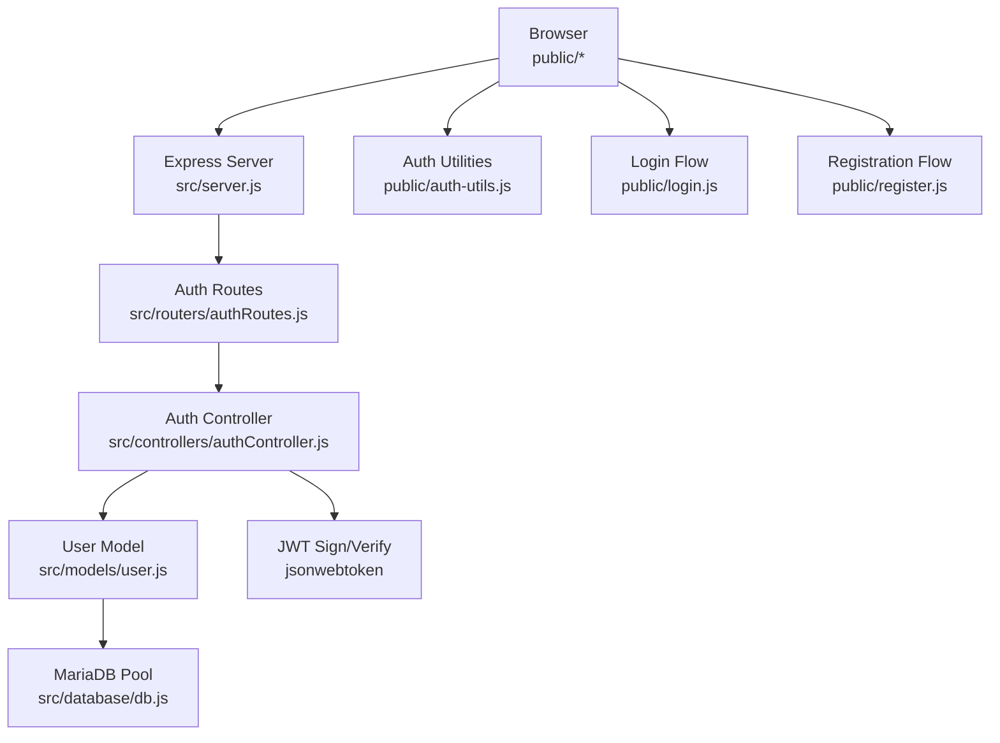
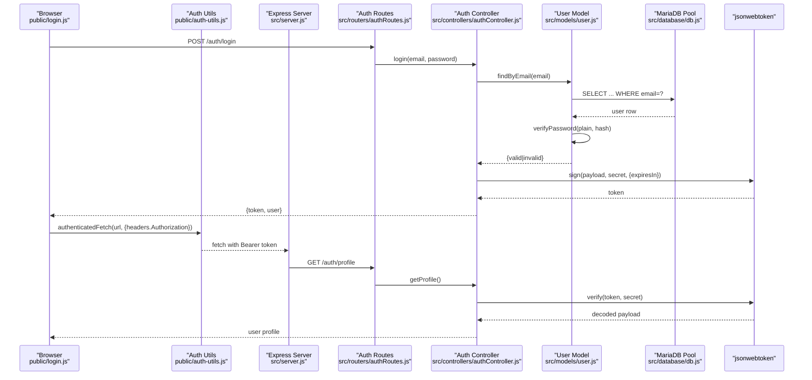
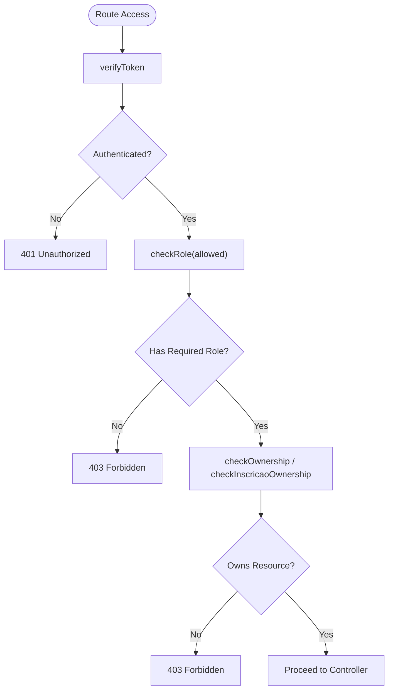
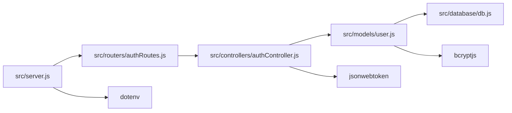

# Security Best Practices & Implementation

<cite>
**Referenced Files in This Document**
- [AUTH_GUIDE.md](file://AUTH_GUIDE.md)
- [README.md](file://README.md)
- [package.json](file://package.json)
- [src/server.js](file://src/server.js)
- [src/middleware/auth.js](file://src/middleware/auth.js)
- [src/controllers/authController.js](file://src/controllers/authController.js)
- [src/routers/authRoutes.js](file://src/routers/authRoutes.js)
- [src/models/user.js](file://src/models/user.js)
- [src/database/db.js](file://src/database/db.js)
- [src/database/setupAuthUsers.js](file://src/database/setupAuthUsers.js)
- [public/auth-utils.js](file://public/auth-utils.js)
- [public/login.js](file://public/login.js)
- [public/register.js](file://public/register.js)
- [public/menu.js](file://public/menu.js)
</cite>

## Table of Contents
1. [Introduction](#introduction)
2. [Project Structure](#project-structure)
3. [Core Components](#core-components)
4. [Architecture Overview](#architecture-overview)
5. [Detailed Component Analysis](#detailed-component-analysis)
6. [Dependency Analysis](#dependency-analysis)
7. [Performance Considerations](#performance-considerations)
8. [Troubleshooting Guide](#troubleshooting-guide)
9. [Conclusion](#conclusion)
10. [Appendices](#appendices)

## Introduction
This document consolidates security best practices and implementation details for NodeMural’s authentication and authorization system. It focuses on JWT security, input validation, SQL injection prevention, XSS protections, rate limiting, brute-force mitigation, CORS and HTTPS, secure cookies, auditing, penetration testing, vulnerability assessments, and production hardening. It also highlights common JWT risks such as token replay and session fixation, and provides monitoring recommendations for suspicious activity.

## Project Structure
NodeMural follows a layered architecture:
- Server entry initializes Express, static serving, and routes.
- Authentication endpoints are under /auth and protected by middleware.
- Controllers encapsulate business logic; models handle persistence with bcrypt hashing.
- Environment variables are loaded via dotenv; database connections use a pool.

**Diagram sources**
- [src/server.js](file://src/server.js#L31-L73)
- [src/routers/authRoutes.js](file://src/routers/authRoutes.js#L1-L20)
- [src/controllers/authController.js](file://src/controllers/authController.js#L1-L157)
- [src/models/user.js](file://src/models/user.js#L1-L146)
- [src/database/db.js](file://src/database/db.js#L1-L15)
- [public/auth-utils.js](file://public/auth-utils.js#L1-L88)
- [public/login.js](file://public/login.js#L1-L62)
- [public/register.js](file://public/register.js#L1-L127)

**Section sources**
- [src/server.js](file://src/server.js#L31-L73)
- [README.md](file://README.md#L1-L61)

## Core Components
- JWT-based authentication with signed tokens and role-based access control (RBAC).
- Password hashing with bcryptjs during registration.
- Environment-driven secrets and database configuration.
- Client-side storage of tokens in localStorage with helper utilities for authenticated requests.

Key security-relevant files:
- Authentication middleware verifies tokens and enforces roles and ownership checks.
- Auth controller handles registration, login, and profile retrieval.
- User model manages password hashing, validation, and database queries.
- Frontend utilities centralize token handling and authenticated fetch.

**Section sources**
- [src/middleware/auth.js](file://src/middleware/auth.js#L1-L137)
- [src/controllers/authController.js](file://src/controllers/authController.js#L1-L157)
- [src/models/user.js](file://src/models/user.js#L1-L146)
- [public/auth-utils.js](file://public/auth-utils.js#L1-L88)

## Architecture Overview
The authentication flow integrates client and server components:

**Diagram sources**
- [public/login.js](file://public/login.js#L31-L62)
- [public/auth-utils.js](file://public/auth-utils.js#L45-L54)
- [src/server.js](file://src/server.js#L31-L73)
- [src/routers/authRoutes.js](file://src/routers/authRoutes.js#L1-L20)
- [src/controllers/authController.js](file://src/controllers/authController.js#L76-L127)
- [src/models/user.js](file://src/models/user.js#L36-L104)
- [src/database/db.js](file://src/database/db.js#L1-L15)

## Detailed Component Analysis

### JWT Security Implementation
- Signing and verification use a shared secret from environment variables.
- Token payload includes identity, email, name, role, and entity linkage.
- Expiration is configurable via environment variable.
- Token is transmitted in the Authorization header with the Bearer scheme.

Recommendations:
- Use a strong, randomly generated secret and rotate periodically.
- Prefer RS256 with a long-lived symmetric key or ECDSA/P-256 for asymmetric keys.
- Enforce HTTPS to prevent token interception.
- Set short-lived access tokens with refresh token rotation and secure storage.

Common risks and mitigations:
- Token replay: Use short expiry, monitor token usage, and consider nonce/jti claims.
- Session fixation: Rotate tokens on login and invalidate previous sessions.
- Token theft: Avoid storing tokens in insecure locations; prefer HttpOnly cookies in server-side sessions if feasible.

**Section sources**
- [src/controllers/authController.js](file://src/controllers/authController.js#L98-L109)
- [src/middleware/auth.js](file://src/middleware/auth.js#L14-L17)
- [AUTH_GUIDE.md](file://AUTH_GUIDE.md#L243-L253)

### Secret Key Management
- Secrets are loaded via dotenv and used for JWT signing and database connectivity.
- The project template includes a placeholder for JWT_SECRET.

Best practices:
- Store secrets in a secure secret manager or OS keychain.
- Never commit secrets to version control.
- Restrict access to deployment environments and CI/CD systems.

**Section sources**
- [src/database/db.js](file://src/database/db.js#L1-L15)
- [AUTH_GUIDE.md](file://AUTH_GUIDE.md#L243-L253)
- [README.md](file://README.md#L18-L28)

### Input Validation and Sanitization
- Registration validates presence and format of required fields and password confirmation length.
- Login requires presence of email and password.
- Client-side fetch helpers attach Authorization headers for authenticated requests.

Recommendations:
- Implement comprehensive input validation at the controller boundary.
- Use allow-lists for roles and numeric identifiers.
- Sanitize and escape all dynamic content rendered to HTML to prevent XSS.
- Apply Content-Security-Policy headers and encode output contexts.

**Section sources**
- [src/controllers/authController.js](file://src/controllers/authController.js#L10-L27)
- [public/auth-utils.js](file://public/auth-utils.js#L45-L54)

### SQL Injection Prevention
- Prepared statements are used for all database queries in the user model.
- Parameterized queries prevent manipulation of SQL command structure.

Recommendations:
- Audit all queries for parameterization.
- Use ORM or query builders consistently.
- Limit database user privileges to least privilege.

**Section sources**
- [src/models/user.js](file://src/models/user.js#L18-L21)
- [src/models/user.js](file://src/models/user.js#L39-L43)
- [src/models/user.js](file://src/models/user.js#L50-L56)
- [src/models/user.js](file://src/models/user.js#L109-L112)

### XSS Protection Measures
- Client-side rendering should escape dynamic content.
- Use CSP headers to restrict script execution origins.
- Avoid innerHTML with untrusted data; prefer DOM APIs or templating libraries with automatic escaping.

[No sources needed since this section provides general guidance]

### Rate Limiting and Brute Force Mitigation
- Implement rate limiting on login endpoints to reduce brute-force attempts.
- Lock accounts temporarily after repeated failures or use time-based exponential backoff.
- Consider two-factor authentication for privileged roles.

[No sources needed since this section provides general guidance]

### Failed Login Attempt Handling
- Login returns explicit 401 errors for invalid credentials.
- Consider logging failed attempts and triggering alerts for suspicious patterns.

**Section sources**
- [src/controllers/authController.js](file://src/controllers/authController.js#L86-L96)

### CORS Configuration and HTTPS Enforcement
- Configure CORS to allowlist trusted origins and enforce HTTPS in production.
- Use HSTS headers and secure cookie attributes when storing tokens server-side.

[No sources needed since this section provides general guidance]

### Secure Cookie Practices
- If adopting server-managed sessions, set SameSite, Secure, and HttpOnly flags.
- Avoid storing JWTs in cookies unless necessary; localStorage is used in the current implementation.

[No sources needed since this section provides general guidance]

### Authorization and Ownership Controls
- Role-based access control is enforced via middleware.
- Ownership checks limit access to records linked to the authenticated user’s entity.

**Diagram sources**
- [src/middleware/auth.js](file://src/middleware/auth.js#L32-L48)
- [src/middleware/auth.js](file://src/middleware/auth.js#L77-L98)
- [src/middleware/auth.js](file://src/middleware/auth.js#L101-L136)

**Section sources**
- [src/middleware/auth.js](file://src/middleware/auth.js#L32-L48)
- [src/middleware/auth.js](file://src/middleware/auth.js#L77-L98)
- [src/middleware/auth.js](file://src/middleware/auth.js#L101-L136)

### Client-Side Token Handling
- Tokens are stored in localStorage and attached to authenticated requests.
- Utilities provide helpers for login redirection and role checks.

Recommendations:
- Prefer HttpOnly cookies for tokens when using server-managed sessions.
- Implement token refresh mechanisms and secure local storage practices.

**Section sources**
- [public/auth-utils.js](file://public/auth-utils.js#L1-L88)
- [public/login.js](file://public/login.js#L47-L49)
- [public/register.js](file://public/register.js#L1-L127)

## Dependency Analysis
External dependencies relevant to security:
- jsonwebtoken: JWT signing and verification.
- bcryptjs: Password hashing.
- dotenv: Environment variable loading.
- express: Web framework and routing.
- mariadb: Database connectivity.

**Diagram sources**
- [src/server.js](file://src/server.js#L1-L73)
- [src/routers/authRoutes.js](file://src/routers/authRoutes.js#L1-L20)
- [src/controllers/authController.js](file://src/controllers/authController.js#L1-L157)
- [src/models/user.js](file://src/models/user.js#L1-L146)
- [src/database/db.js](file://src/database/db.js#L1-L15)
- [package.json](file://package.json#L22-L30)

**Section sources**
- [package.json](file://package.json#L22-L30)

## Performance Considerations
- Use connection pooling for database access.
- Keep JWT payloads minimal to reduce overhead.
- Cache frequently accessed user metadata with short TTLs.
- Monitor slow endpoints and apply circuit breakers where appropriate.

[No sources needed since this section provides general guidance]

## Troubleshooting Guide
Common issues and resolutions:
- 401 Token errors: Verify Authorization header format and token validity.
- 403 Access denied: Confirm user role and ownership checks.
- 500 Internal errors: Inspect server logs and database connectivity.

**Section sources**
- [AUTH_GUIDE.md](file://AUTH_GUIDE.md#L289-L300)
- [src/middleware/auth.js](file://src/middleware/auth.js#L22-L28)

## Conclusion
NodeMural implements a solid foundation for authentication and authorization using JWT and RBAC, with bcrypt-based password hashing and parameterized database queries. To achieve production-grade security, adopt HTTPS, robust secret management, rate limiting, CSP, and consider server-managed sessions with secure cookies. Continuously audit and pen-test the system, monitor for anomalies, and maintain strict input validation and output encoding.

[No sources needed since this section summarizes without analyzing specific files]

## Appendices

### Security Audit Guidelines
- Review environment variables and secrets rotation policies.
- Validate JWT configuration (algorithm, secret strength, expiry).
- Assess middleware coverage across all routes.
- Verify database query parameterization and least-privilege access.
- Confirm client-side token storage and CSP policies.

[No sources needed since this section provides general guidance]

### Penetration Testing Recommendations
- Test login endpoints for rate limiting and account lockout behavior.
- Scan for XSS in dynamic HTML generation and reflected inputs.
- Validate CSRF protections for state-changing endpoints.
- Assess SSRF risks in outbound requests and external integrations.

[No sources needed since this section provides general guidance]

### Vulnerability Assessment Procedures
- Static analysis of controllers and models for SQL injection and XSS.
- Dynamic analysis of authentication flows and error handling.
- Network-level scanning for TLS misconfigurations and exposed endpoints.

[No sources needed since this section provides general guidance]

### Production Hardening Checklist
- Enforce HTTPS and HSTS.
- Configure CORS to allowlist trusted origins.
- Implement rate limiting and WAF rules.
- Use secure cookie attributes (SameSite, Secure, HttpOnly) if using cookies.
- Rotate secrets regularly and restrict access to infrastructure.
- Enable structured logging and alerting for failed auth attempts.

[No sources needed since this section provides general guidance]

### Monitoring Suspicious Activities
- Alert on repeated 401/403 responses from the same IP.
- Track failed login spikes and geolocation anomalies.
- Monitor token expiry and refresh patterns.
- Log authentication events with user agent and IP.

[No sources needed since this section provides general guidance]