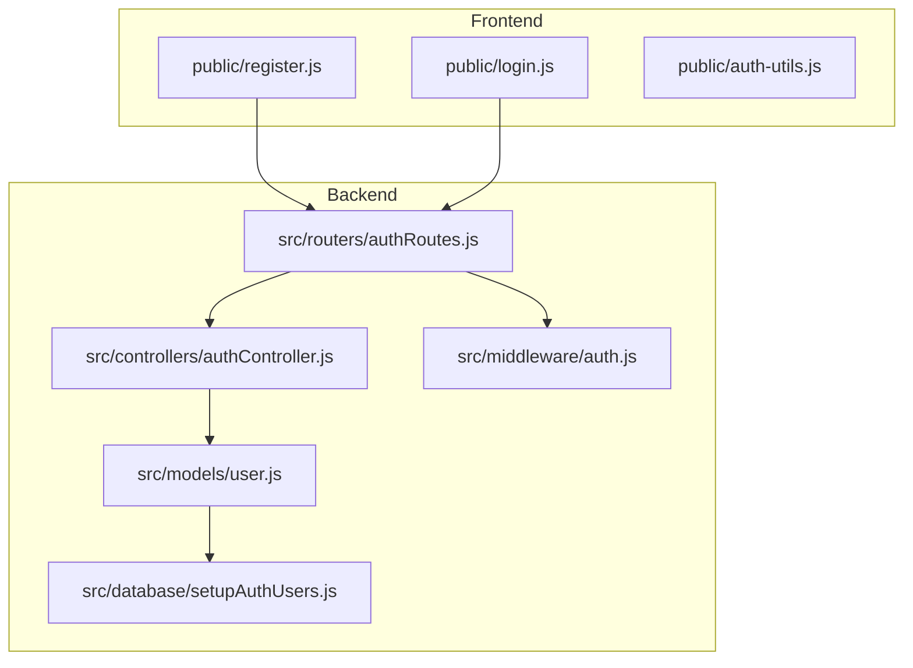
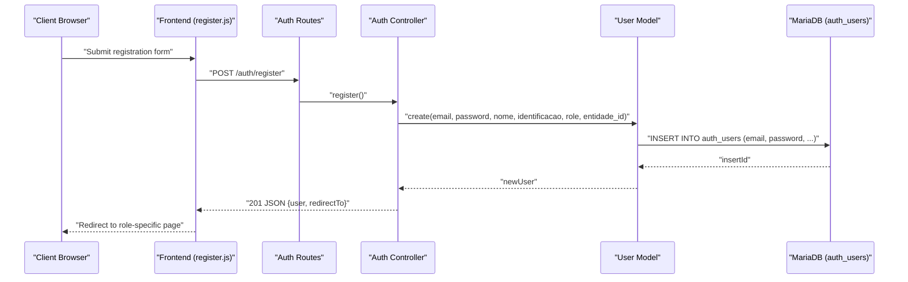
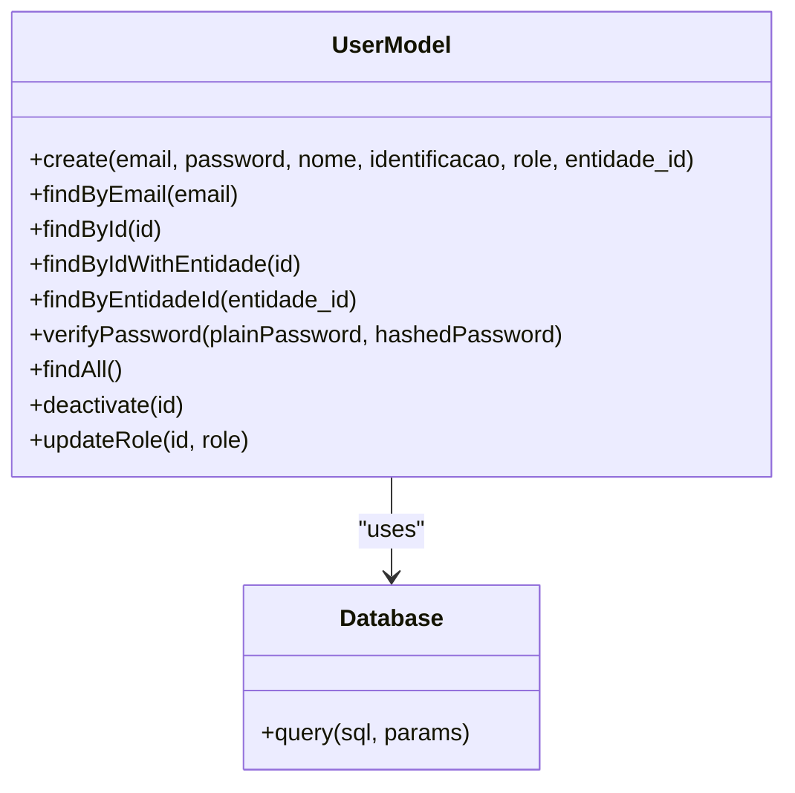
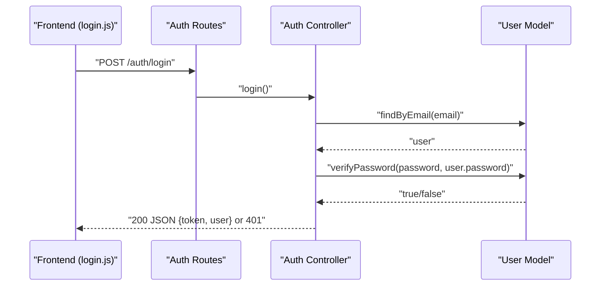
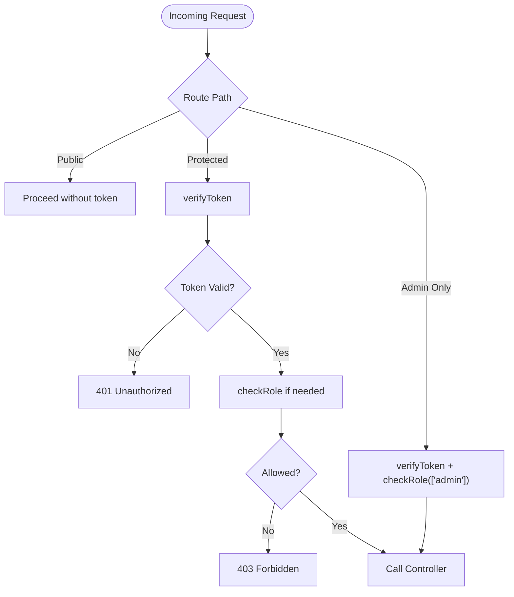
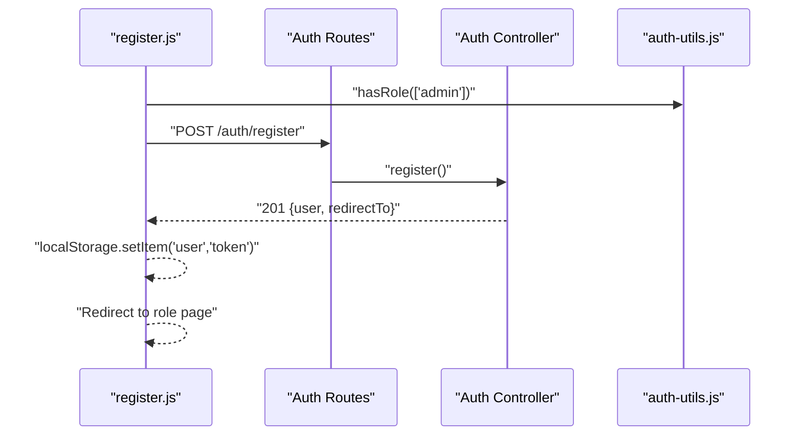
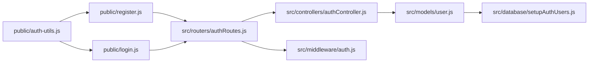

# User Management & Registration

<cite>
**Referenced Files in This Document**
- [src/models/user.js](file://src/models/user.js)
- [src/controllers/authController.js](file://src/controllers/authController.js)
- [src/routers/authRoutes.js](file://src/routers/authRoutes.js)
- [src/middleware/auth.js](file://src/middleware/auth.js)
- [src/database/setupAuthUsers.js](file://src/database/setupAuthUsers.js)
- [public/register.js](file://public/register.js)
- [public/login.js](file://public/login.js)
- [public/auth-utils.js](file://public/auth-utils.js)
- [AUTH_GUIDE.md](file://AUTH_GUIDE.md)
- [README.md](file://README.md)
</cite>

## Table of Contents
1. [Introduction](#introduction)
2. [Project Structure](#project-structure)
3. [Core Components](#core-components)
4. [Architecture Overview](#architecture-overview)
5. [Detailed Component Analysis](#detailed-component-analysis)
6. [Dependency Analysis](#dependency-analysis)
7. [Performance Considerations](#performance-considerations)
8. [Troubleshooting Guide](#troubleshooting-guide)
9. [Conclusion](#conclusion)
10. [Appendices](#appendices)

## Introduction
This document explains the user management and registration functionality in NodeMural. It covers the complete user registration workflow, including email validation, password confirmation, role assignment, and password hashing with bcryptjs. It documents user lookup mechanisms, duplicate email prevention, and the soft delete mechanism via the ativo field. It also describes the user profile retrieval system, data validation, and administrative capabilities such as listing users and updating roles. Practical examples illustrate registration flows, login redirection behavior, and administrative tasks. Finally, it addresses data privacy, GDPR considerations, and user data lifecycle management.

## Project Structure
The user management system spans backend and frontend modules:
- Backend: Express routes, controllers, middleware, and a database-backed user model
- Frontend: Registration and login pages with client-side helpers for authentication

**Diagram sources**
- [src/routers/authRoutes.js](file://src/routers/authRoutes.js#L1-L20)
- [src/controllers/authController.js](file://src/controllers/authController.js#L1-L157)
- [src/middleware/auth.js](file://src/middleware/auth.js#L1-L137)
- [src/models/user.js](file://src/models/user.js#L1-L146)
- [src/database/setupAuthUsers.js](file://src/database/setupAuthUsers.js#L1-L38)
- [public/register.js](file://public/register.js#L1-L127)
- [public/login.js](file://public/login.js#L1-L62)
- [public/auth-utils.js](file://public/auth-utils.js#L1-L88)

**Section sources**
- [src/routers/authRoutes.js](file://src/routers/authRoutes.js#L1-L20)
- [src/controllers/authController.js](file://src/controllers/authController.js#L1-L157)
- [src/middleware/auth.js](file://src/middleware/auth.js#L1-L137)
- [src/models/user.js](file://src/models/user.js#L1-L146)
- [src/database/setupAuthUsers.js](file://src/database/setupAuthUsers.js#L1-L38)
- [public/register.js](file://public/register.js#L1-L127)
- [public/login.js](file://public/login.js#L1-L62)
- [public/auth-utils.js](file://public/auth-utils.js#L1-L88)

## Core Components
- User model: Handles creation, password hashing, lookup by email/ID, role-based entity association, and soft deletion
- Auth controller: Implements registration and login endpoints with validation and redirects
- Auth routes: Exposes public and protected endpoints under /auth
- Auth middleware: Provides JWT verification, role checks, ownership checks, and current user extraction
- Frontend utilities: Store tokens, attach Authorization headers, and enforce login requirements
- Database setup: Creates the auth_users table with unique email, role enum, and ativo flag

Key implementation references:
- Password hashing with bcryptjs and salt rounds
- Duplicate email prevention during registration
- Soft delete via ativo field in queries
- Role assignment and entity linkage via entidade_id

**Section sources**
- [src/models/user.js](file://src/models/user.js#L1-L146)
- [src/controllers/authController.js](file://src/controllers/authController.js#L1-L157)
- [src/routers/authRoutes.js](file://src/routers/authRoutes.js#L1-L20)
- [src/middleware/auth.js](file://src/middleware/auth.js#L1-L137)
- [src/database/setupAuthUsers.js](file://src/database/setupAuthUsers.js#L1-L38)
- [public/auth-utils.js](file://public/auth-utils.js#L1-L88)

## Architecture Overview
The system uses JWT-based authentication and role-based access control. Registration and login are public endpoints; profile and admin endpoints are protected.

**Diagram sources**
- [public/register.js](file://public/register.js#L98-L127)
- [src/routers/authRoutes.js](file://src/routers/authRoutes.js#L8-L11)
- [src/controllers/authController.js](file://src/controllers/authController.js#L5-L74)
- [src/models/user.js](file://src/models/user.js#L6-L34)
- [src/database/setupAuthUsers.js](file://src/database/setupAuthUsers.js#L11-L22)

## Detailed Component Analysis

### User Model (Password Hashing, Lookup, Soft Delete)
The user model encapsulates:
- Creating users with hashed passwords using bcryptjs
- Preventing duplicate emails by checking existence before insert
- Looking up users by email and ID with active-only filter (ativo = TRUE)
- Verifying passwords using bcrypt compare
- Listing active users and soft-deleting by setting ativo = FALSE
- Updating user roles

**Diagram sources**
- [src/models/user.js](file://src/models/user.js#L5-L146)

Security and performance notes:
- Password hashing uses bcryptjs with a fixed salt round parameter in the implementation
- Queries filter by ativo = TRUE to exclude deactivated users
- Role-based entity association supports linking auth_users to aluno/docente/supervisor records

**Section sources**
- [src/models/user.js](file://src/models/user.js#L6-L34)
- [src/models/user.js](file://src/models/user.js#L36-L60)
- [src/models/user.js](file://src/models/user.js#L101-L104)
- [src/models/user.js](file://src/models/user.js#L106-L142)

### Auth Controller (Registration, Login, Profile, Admin)
The auth controller enforces validation and orchestrates user creation and authentication:
- Registration validates presence of required fields, matching passwords, minimum length, and email format; delegates creation to the model
- Login validates credentials, retrieves the user, compares passwords, and generates a JWT token
- Profile endpoint returns the authenticated user’s data
- Admin-only endpoint lists all active users

**Diagram sources**
- [public/login.js](file://public/login.js#L31-L61)
- [src/routers/authRoutes.js](file://src/routers/authRoutes.js#L9-L11)
- [src/controllers/authController.js](file://src/controllers/authController.js#L76-L127)
- [src/models/user.js](file://src/models/user.js#L36-L47)
- [src/models/user.js](file://src/models/user.js#L101-L104)

Validation and error handling:
- Registration rejects missing fields, mismatched passwords, short passwords, and invalid email formats
- Login rejects missing credentials, unknown emails, and incorrect passwords
- Profile and admin endpoints propagate model errors

**Section sources**
- [src/controllers/authController.js](file://src/controllers/authController.js#L5-L74)
- [src/controllers/authController.js](file://src/controllers/authController.js#L76-L127)
- [src/controllers/authController.js](file://src/controllers/authController.js#L129-L157)

### Auth Routes and Middleware
- Public endpoints: /auth/register, /auth/login, /auth/me
- Protected endpoint: /auth/profile
- Admin-only endpoint: /auth/users
- Middleware:
  - verifyToken: extracts and validates JWT from Authorization header
  - checkRole: enforces role-based access
  - getCurrentUser: decodes token without enforcing permissions
  - Ownership checks: restrict access to personal records or admin privileges

**Diagram sources**
- [src/routers/authRoutes.js](file://src/routers/authRoutes.js#L1-L20)
- [src/middleware/auth.js](file://src/middleware/auth.js#L5-L48)

**Section sources**
- [src/routers/authRoutes.js](file://src/routers/authRoutes.js#L1-L20)
- [src/middleware/auth.js](file://src/middleware/auth.js#L5-L48)

### Frontend Registration and Login
- Registration page:
  - Enforces admin-only access
  - Dynamically updates placeholder hints for identificacao based on role
  - Checks for existing aluno/docente/supervisor records and sets entidade_id accordingly
  - Submits to /auth/register and redirects based on role
- Login page:
  - Redirects authenticated users to role-specific pages
  - On success, stores token and user in localStorage and follows redirect logic

**Diagram sources**
- [public/register.js](file://public/register.js#L1-L127)
- [public/auth-utils.js](file://public/auth-utils.js#L56-L87)
- [src/routers/authRoutes.js](file://src/routers/authRoutes.js#L8-L11)
- [src/controllers/authController.js](file://src/controllers/authController.js#L5-L74)

**Section sources**
- [public/register.js](file://public/register.js#L1-L127)
- [public/login.js](file://public/login.js#L1-L62)
- [public/auth-utils.js](file://public/auth-utils.js#L1-L88)

## Dependency Analysis
- Controllers depend on the User model for persistence and validation
- Routes depend on controllers for business logic
- Middleware depends on JWT library and the Inscricao model for ownership checks
- Frontend utilities depend on localStorage and fetch
- Database setup initializes the auth_users table schema

**Diagram sources**
- [public/register.js](file://public/register.js#L1-L127)
- [public/login.js](file://public/login.js#L1-L62)
- [public/auth-utils.js](file://public/auth-utils.js#L1-L88)
- [src/routers/authRoutes.js](file://src/routers/authRoutes.js#L1-L20)
- [src/controllers/authController.js](file://src/controllers/authController.js#L1-L157)
- [src/middleware/auth.js](file://src/middleware/auth.js#L1-L137)
- [src/models/user.js](file://src/models/user.js#L1-L146)
- [src/database/setupAuthUsers.js](file://src/database/setupAuthUsers.js#L1-L38)

**Section sources**
- [src/routers/authRoutes.js](file://src/routers/authRoutes.js#L1-L20)
- [src/controllers/authController.js](file://src/controllers/authController.js#L1-L157)
- [src/middleware/auth.js](file://src/middleware/auth.js#L1-L137)
- [src/models/user.js](file://src/models/user.js#L1-L146)
- [src/database/setupAuthUsers.js](file://src/database/setupAuthUsers.js#L1-L38)
- [public/register.js](file://public/register.js#L1-L127)
- [public/login.js](file://public/login.js#L1-L62)
- [public/auth-utils.js](file://public/auth-utils.js#L1-L88)

## Performance Considerations
- Password hashing uses bcryptjs with a fixed salt round parameter. While convenient, consider tuning salt rounds for production workloads to balance security and CPU cost.
- Queries filter by ativo = TRUE to avoid scanning inactive users; ensure indexes exist on email and role filters for optimal performance.
- Token verification occurs on every protected route; caching tokens client-side reduces redundant logins.
- Batch operations (e.g., listing users) should be paginated in larger deployments.

[No sources needed since this section provides general guidance]

## Troubleshooting Guide
Common issues and resolutions:
- Registration fails with duplicate email: The model prevents duplicate registrations; ensure the email is unique.
- Login fails with invalid credentials: Confirm email and password match the stored hash; verify ativo is TRUE.
- Token errors: Ensure Authorization header includes Bearer token; check JWT_SECRET and expiry settings.
- Access denied: Verify role-based permissions and ownership checks; admins bypass most restrictions.

Operational references:
- Error codes and meanings for authentication endpoints
- Environment variables for JWT configuration
- Database initialization script for auth_users table

**Section sources**
- [AUTH_GUIDE.md](file://AUTH_GUIDE.md#L289-L300)
- [README.md](file://README.md#L18-L28)
- [src/database/setupAuthUsers.js](file://src/database/setupAuthUsers.js#L11-L22)

## Conclusion
NodeMural’s user management system provides a robust foundation for secure registration, authentication, and administration. It leverages bcryptjs for password hashing, JWT for sessionless authentication, and a soft-delete mechanism via the ativo field. Role-based access control and ownership checks help maintain data integrity. The frontend integrates seamlessly with backend endpoints to deliver a smooth user experience while preserving security and compliance readiness.

[No sources needed since this section summarizes without analyzing specific files]

## Appendices

### Practical Examples

- User Registration Workflow
  - Submit registration form with validated fields
  - Backend verifies uniqueness and hashes password
  - On success, returns user data and a role-specific redirect URL

- Login and Redirection
  - On successful login, store token and user in localStorage
  - Redirect to role-specific page based on user role and optional redirect parameter

- Administrative Tasks
  - List all active users (admin-only)
  - Update user roles (admin-only)
  - Deactivate users (soft delete) by setting ativo = FALSE

- Password Reset Procedures
  - Not implemented in the current codebase; recommended approach: generate a time-limited reset token, invalidate previous sessions, and update the password via a secure endpoint

- User Administration Tasks
  - View profile (authenticated)
  - List users (admin-only)
  - Update roles (admin-only)
  - Deactivate users (admin-only)

**Section sources**
- [src/controllers/authController.js](file://src/controllers/authController.js#L5-L74)
- [src/controllers/authController.js](file://src/controllers/authController.js#L76-L127)
- [src/controllers/authController.js](file://src/controllers/authController.js#L129-L157)
- [src/models/user.js](file://src/models/user.js#L106-L142)
- [public/login.js](file://public/login.js#L5-L19)

### Data Privacy and GDPR Considerations
- Data minimization: Collect only required fields (email, password, nome, role, identificacao, entidade_id)
- Consent and transparency: Inform users about data processing purposes
- Storage: Use secure environments and rotate JWT_SECRET
- Retention and erasure: Implement data retention policies; soft delete (ativo) preserves audit trails while preventing access
- Security: Enforce HTTPS, secure cookies/storage, and limit token lifetimes

[No sources needed since this section provides general guidance]