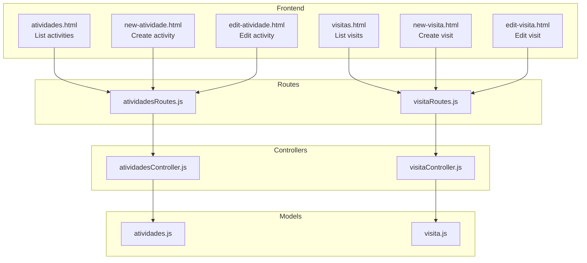
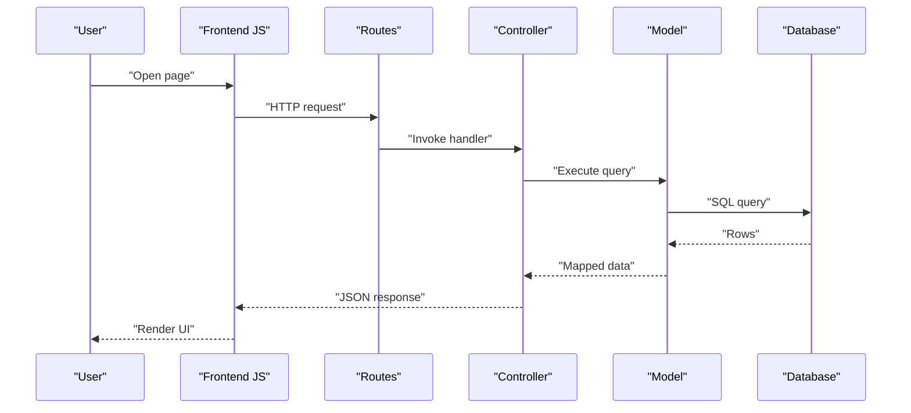
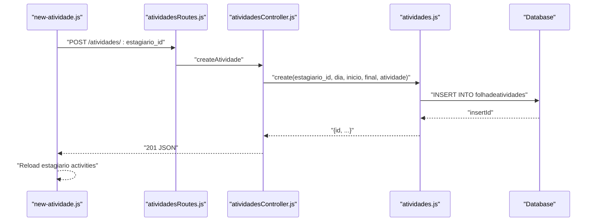
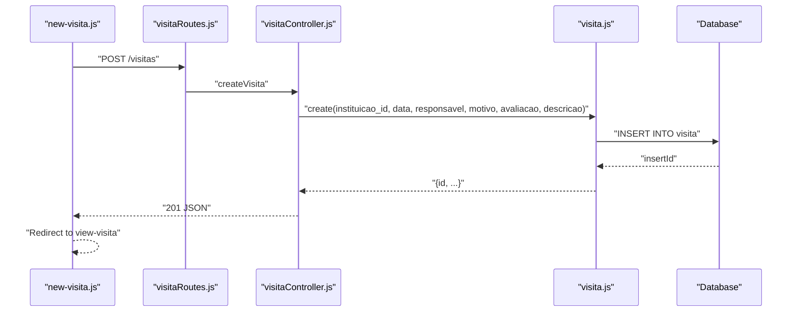
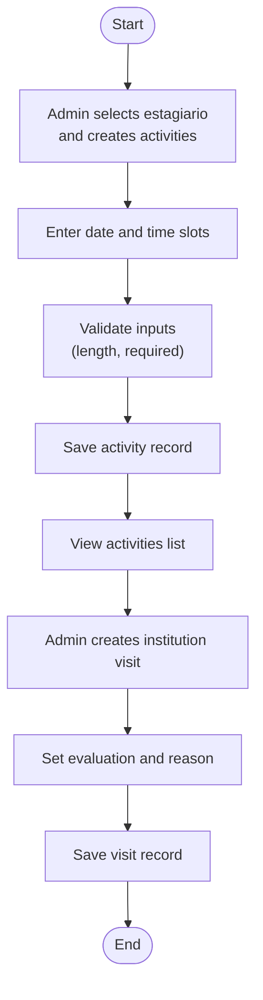
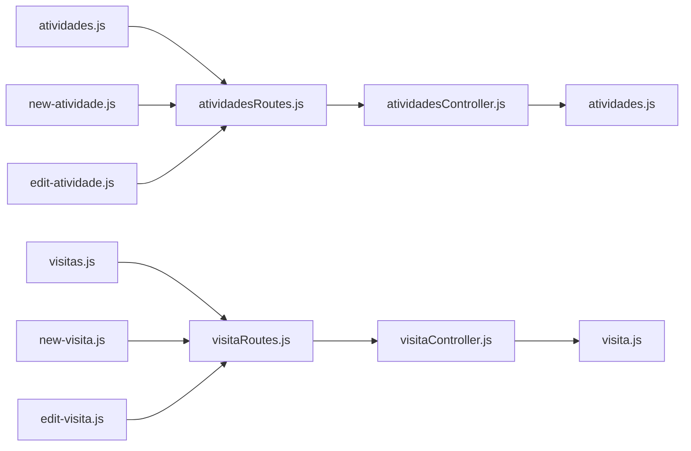

# Activity & Visit Management

<cite>
**Referenced Files in This Document**
- [src/controllers/atividadesController.js](file://src/controllers/atividadesController.js)
- [src/models/atividades.js](file://src/models/atividades.js)
- [src/routers/atividadesRoutes.js](file://src/routers/atividadesRoutes.js)
- [src/controllers/visitaController.js](file://src/controllers/visitaController.js)
- [src/models/visita.js](file://src/models/visita.js)
- [src/routers/visitaRoutes.js](file://src/routers/visitaRoutes.js)
- [public/atividades.html](file://public/atividades.html)
- [public/atividades.js](file://public/atividades.js)
- [public/new-atividade.html](file://public/new-atividade.html)
- [public/new-atividade.js](file://public/new-atividade.js)
- [public/edit-atividade.html](file://public/edit-atividade.html)
- [public/edit-atividade.js](file://public/edit-atividade.js)
- [public/visitas.html](file://public/visitas.html)
- [public/visitas.js](file://public/visitas.js)
- [public/new-visita.html](file://public/new-visita.html)
- [public/new-visita.js](file://public/new-visita.js)
- [public/edit-visita.html](file://public/edit-visita.html)
- [public/edit-visita.js](file://public/edit-visita.js)
</cite>

## Table of Contents
1. [Introduction](#introduction)
2. [Project Structure](#project-structure)
3. [Core Components](#core-components)
4. [Architecture Overview](#architecture-overview)
5. [Detailed Component Analysis](#detailed-component-analysis)
6. [Dependency Analysis](#dependency-analysis)
7. [Performance Considerations](#performance-considerations)
8. [Troubleshooting Guide](#troubleshooting-guide)
9. [Conclusion](#conclusion)

## Introduction
This document describes the Activity & Visit Management system, covering the complete CRUD lifecycle for activities and visits, scheduling and coordination workflows, and the integration between backend controllers, models, routes, and frontend templates. It explains how activities are scheduled per intern (trainee) and how visits to institutions are managed, including filtering, validation, and display. It also outlines the relationships with students, teachers, and supervisors, and highlights current limitations and recommended improvements for conflict detection, capacity checks, and resource availability.

## Project Structure
The system is organized into:
- Backend: Controllers, Models, and Routes for activities and visits
- Frontend: HTML pages and JavaScript modules for listing, creating, editing, and deleting records
- Shared utilities: Authentication helpers used across pages

**Diagram sources**
- [src/controllers/atividadesController.js](file://src/controllers/atividadesController.js#L1-L88)
- [src/controllers/visitaController.js](file://src/controllers/visitaController.js#L1-L67)
- [src/models/atividades.js](file://src/models/atividades.js#L1-L57)
- [src/models/visita.js](file://src/models/visita.js#L1-L51)
- [src/routers/atividadesRoutes.js](file://src/routers/atividadesRoutes.js#L1-L20)
- [src/routers/visitaRoutes.js](file://src/routers/visitaRoutes.js#L1-L18)
- [public/atividades.html](file://public/atividades.html#L1-L50)
- [public/new-atividade.html](file://public/new-atividade.html#L1-L93)
- [public/edit-atividade.html](file://public/edit-atividade.html#L1-L53)
- [public/visitas.html](file://public/visitas.html#L1-L50)
- [public/new-visita.html](file://public/new-visita.html#L1-L79)
- [public/edit-visita.html](file://public/edit-visita.html#L1-L79)

**Section sources**
- [src/controllers/atividadesController.js](file://src/controllers/atividadesController.js#L1-L88)
- [src/controllers/visitaController.js](file://src/controllers/visitaController.js#L1-L67)
- [src/models/atividades.js](file://src/models/atividades.js#L1-L57)
- [src/models/visita.js](file://src/models/visita.js#L1-L51)
- [src/routers/atividadesRoutes.js](file://src/routers/atividadesRoutes.js#L1-L20)
- [src/routers/visitaRoutes.js](file://src/routers/visitaRoutes.js#L1-L18)
- [public/atividades.html](file://public/atividades.html#L1-L50)
- [public/new-atividade.html](file://public/new-atividade.html#L1-L93)
- [public/edit-atividade.html](file://public/edit-atividade.html#L1-L53)
- [public/visitas.html](file://public/visitas.html#L1-L50)
- [public/new-visita.html](file://public/new-visita.html#L1-L79)
- [public/edit-visita.html](file://public/edit-visita.html#L1-L79)

## Core Components
- Activities module
  - Controller: handles listing, retrieving, creating, updating, and deleting activities; supports optional estagiario_id parameter for creation
  - Model: queries activities with student name and registration via joins; supports filtering by estagiario_id and ordering by date and start time
  - Routes: GET /, GET /:id, POST /, POST /:estagiario_id, PUT /:id, DELETE /:id
  - Frontend: list page, create page with auto-calculated duration, edit page, and view links

- Visits module
  - Controller: handles listing, retrieving, creating, updating, and deleting visits; filters by institution if requested
  - Model: queries visits joined with institution name; supports filtering by institution and ordering by date desc
  - Routes: GET /, GET /:id, POST /, PUT /:id, DELETE /:id
  - Frontend: list page, create page with institution dropdown, edit page, and view links

**Section sources**
- [src/controllers/atividadesController.js](file://src/controllers/atividadesController.js#L1-L88)
- [src/models/atividades.js](file://src/models/atividades.js#L1-L57)
- [src/routers/atividadesRoutes.js](file://src/routers/atividadesRoutes.js#L1-L20)
- [public/atividades.html](file://public/atividades.html#L1-L50)
- [public/new-atividade.html](file://public/new-atividade.html#L1-L93)
- [public/edit-atividade.html](file://public/edit-atividade.html#L1-L53)
- [src/controllers/visitaController.js](file://src/controllers/visitaController.js#L1-L67)
- [src/models/visita.js](file://src/models/visita.js#L1-L51)
- [src/routers/visitaRoutes.js](file://src/routers/visitaRoutes.js#L1-L18)
- [public/visitas.html](file://public/visitas.html#L1-L50)
- [public/new-visita.html](file://public/new-visita.html#L1-L79)
- [public/edit-visita.html](file://public/edit-visita.html#L1-L79)

## Architecture Overview
The system follows a layered architecture:
- Presentation layer: HTML templates and client-side scripts
- Routing layer: Express routes mapping HTTP verbs to controller actions
- Controller layer: Request validation, parameter extraction, and orchestration
- Model layer: SQL queries and data shaping
- Data layer: MySQL/MariaDB via a shared connection pool

**Diagram sources**
- [src/routers/atividadesRoutes.js](file://src/routers/atividadesRoutes.js#L1-L20)
- [src/controllers/atividadesController.js](file://src/controllers/atividadesController.js#L1-L88)
- [src/models/atividades.js](file://src/models/atividades.js#L1-L57)
- [src/routers/visitaRoutes.js](file://src/routers/visitaRoutes.js#L1-L18)
- [src/controllers/visitaController.js](file://src/controllers/visitaController.js#L1-L67)
- [src/models/visita.js](file://src/models/visita.js#L1-L51)

## Detailed Component Analysis

### Activities CRUD and Scheduling
- Controller responsibilities
  - Retrieve all activities with optional estagiario_id filter
  - Retrieve a single activity by ID
  - Create activity with estagiario_id, date, start/end times, and description
  - Update activity by ID
  - Delete activity by ID
- Model responsibilities
  - Join folhadeatividades with estagiarios and alunos to enrich display with student name and registration
  - Support filtering by estagiario_id and ordering by date desc, then start asc
- Frontend integration
  - List page displays a searchable/sortable table with links to view/edit/delete
  - New activity page preloads estagiario info, lists existing activities, computes duration, and submits to POST /:estagiario_id
  - Edit activity page populates dropdown of estagiarios and prefills form fields

**Diagram sources**
- [public/new-atividade.js](file://public/new-atividade.js#L112-L132)
- [src/routers/atividadesRoutes.js](file://src/routers/atividadesRoutes.js#L14-L15)
- [src/controllers/atividadesController.js](file://src/controllers/atividadesController.js#L30-L43)
- [src/models/atividades.js](file://src/models/atividades.js#L34-L40)

**Section sources**
- [src/controllers/atividadesController.js](file://src/controllers/atividadesController.js#L1-L88)
- [src/models/atividades.js](file://src/models/atividades.js#L1-L57)
- [src/routers/atividadesRoutes.js](file://src/routers/atividadesRoutes.js#L1-L20)
- [public/atividades.html](file://public/atividades.html#L1-L50)
- [public/atividades.js](file://public/atividades.js#L1-L67)
- [public/new-atividade.html](file://public/new-atividade.html#L1-L93)
- [public/new-atividade.js](file://public/new-atividade.js#L1-L150)
- [public/edit-atividade.html](file://public/edit-atividade.html#L1-L53)
- [public/edit-atividade.js](file://public/edit-atividade.js#L1-L88)

### Visits CRUD and Institution Coordination
- Controller responsibilities
  - Retrieve all visits with optional institution filter
  - Retrieve a single visit by ID
  - Create/update/delete visits with institution, date, responsible person, reason, evaluation, and description
- Model responsibilities
  - Join visita with estagio to show institution name
  - Support filtering by institution and ordering by date desc
- Frontend integration
  - List page supports institution-specific filtering and action buttons
  - New visit page loads institution dropdown and posts to /visitas
  - Edit visit page loads institution dropdown, pre-fills data, and updates record

**Diagram sources**
- [public/new-visita.js](file://public/new-visita.js#L52-L67)
- [src/routers/visitaRoutes.js](file://src/routers/visitaRoutes.js#L13-L15)
- [src/controllers/visitaController.js](file://src/controllers/visitaController.js#L30-L40)
- [src/models/visita.js](file://src/models/visita.js#L28-L34)

**Section sources**
- [src/controllers/visitaController.js](file://src/controllers/visitaController.js#L1-L67)
- [src/models/visita.js](file://src/models/visita.js#L1-L51)
- [src/routers/visitaRoutes.js](file://src/routers/visitaRoutes.js#L1-L18)
- [public/visitas.html](file://public/visitas.html#L1-L50)
- [public/visitas.js](file://public/visitas.js#L1-L59)
- [public/new-visita.html](file://public/new-visita.html#L1-L79)
- [public/new-visita.js](file://public/new-visita.js#L1-L74)
- [public/edit-visita.html](file://public/edit-visita.html#L1-L79)
- [public/edit-visita.js](file://public/edit-visita.js#L1-L96)

### Validation Rules and Temporal Constraints
- Frontend validation
  - Required fields enforced via HTML5 required attributes
  - Length limits applied for description fields
  - Date/time inputs constrained to valid formats
- Conflict detection
  - No client-side overlap detection is implemented
  - No capacity or resource availability checks are performed
- Recommendations
  - Add server-side checks for overlapping schedules per estagiario_id and day
  - Enforce evaluation categories and description length limits at the server
  - Consider adding capacity/resource constraints for institution visits

**Section sources**
- [public/new-atividade.html](file://public/new-atividade.html#L55-L81)
- [public/new-atividade.js](file://public/new-atividade.js#L87-L132)
- [public/new-visita.html](file://public/new-visita.html#L21-L65)
- [public/new-visita.js](file://public/new-visita.js#L40-L72)

### Relationship Management with Students, Professors, and Supervisors
- Activities link to students indirectly via estagiarios (trainees), who are linked to alunos (students)
- Visits link to institutions via estagio (internship program)
- Current implementation does not expose explicit relationships with professors or supervisors in the activities/visits modules
- Recommendation: Introduce explicit foreign keys and joins for professors and supervisors where applicable

**Section sources**
- [src/models/atividades.js](file://src/models/atividades.js#L6-L9)
- [src/models/visita.js](file://src/models/visita.js#L6-L8)

### Workflow: Activity Planning, Visit Coordination, and Attendance Tracking
- Activity planning
  - Admin selects an estagiario and creates daily activities with start/end times and descriptions
  - Duration is computed client-side and stored implicitly via start/end
- Visit coordination
  - Admin creates visits to institutions with responsible person, reason, evaluation, and description
  - Optional filtering by institution on the list page
- Attendance tracking
  - Not implemented in the current codebase
  - Recommendation: Add presence fields and integrate with activity records

[No sources needed since this diagram shows conceptual workflow, not actual code structure]

## Dependency Analysis
- Controllers depend on Models for data access
- Routes define endpoints and bind to controllers
- Frontend scripts depend on REST endpoints and Bootstrap/DataTables for rendering
- Models depend on a shared database pool

**Diagram sources**
- [public/atividades.js](file://public/atividades.js#L1-L67)
- [public/new-atividade.js](file://public/new-atividade.js#L1-L150)
- [public/edit-atividade.js](file://public/edit-atividade.js#L1-L88)
- [public/visitas.js](file://public/visitas.js#L1-L59)
- [public/new-visita.js](file://public/new-visita.js#L1-L74)
- [public/edit-visita.js](file://public/edit-visita.js#L1-L96)
- [src/routers/atividadesRoutes.js](file://src/routers/atividadesRoutes.js#L1-L20)
- [src/routers/visitaRoutes.js](file://src/routers/visitaRoutes.js#L1-L18)
- [src/controllers/atividadesController.js](file://src/controllers/atividadesController.js#L1-L88)
- [src/controllers/visitaController.js](file://src/controllers/visitaController.js#L1-L67)
- [src/models/atividades.js](file://src/models/atividades.js#L1-L57)
- [src/models/visita.js](file://src/models/visita.js#L1-L51)

**Section sources**
- [src/controllers/atividadesController.js](file://src/controllers/atividadesController.js#L1-L88)
- [src/models/atividades.js](file://src/models/atividades.js#L1-L57)
- [src/routers/atividadesRoutes.js](file://src/routers/atividadesRoutes.js#L1-L20)
- [src/controllers/visitaController.js](file://src/controllers/visitaController.js#L1-L67)
- [src/models/visita.js](file://src/models/visita.js#L1-L51)
- [src/routers/visitaRoutes.js](file://src/routers/visitaRoutes.js#L1-L18)
- [public/atividades.js](file://public/atividades.js#L1-L67)
- [public/new-atividade.js](file://public/new-atividade.js#L1-L150)
- [public/edit-atividade.js](file://public/edit-atividade.js#L1-L88)
- [public/visitas.js](file://public/visitas.js#L1-L59)
- [public/new-visita.js](file://public/new-visita.js#L1-L74)
- [public/edit-visita.js](file://public/edit-visita.js#L1-L96)

## Performance Considerations
- Calendar-based scheduling
  - Sorting by date desc and start time asc reduces UI scanning
  - Pagination and virtual scrolling could improve performance for large datasets
- Filtering
  - Use indexed columns for estagiario_id and instituicao_id to speed up queries
- Network efficiency
  - Minimize payload sizes by selecting only necessary fields
  - Debounce search inputs and avoid frequent reloads
- Integration patterns
  - Align with academic calendar by adding term/semester filters and blocking dates
  - Coordinate with resource management systems by validating capacity and availability before inserts

[No sources needed since this section provides general guidance]

## Troubleshooting Guide
- Common errors
  - 404 Not Found when retrieving non-existent records
  - 500 Internal Server Error for database failures
  - CORS or role-based access denials if authentication tokens are missing or roles insufficient
- Frontend checks
  - Verify authentication token and role before navigating to protected pages
  - Confirm required fields are filled and formatted correctly
- Backend checks
  - Ensure estagiario_id exists when creating activities
  - Validate institution selection for visits
  - Log detailed errors for failed SQL operations

**Section sources**
- [src/controllers/atividadesController.js](file://src/controllers/atividadesController.js#L16-L28)
- [src/controllers/visitaController.js](file://src/controllers/visitaController.js#L16-L28)
- [public/atividades.js](file://public/atividades.js#L7-L15)
- [public/visitas.js](file://public/visitas.js#L6-L9)
- [public/new-atividade.js](file://public/new-atividade.js#L6-L9)
- [public/new-visita.js](file://public/new-visita.js#L6-L9)

## Conclusion
The Activity & Visit Management system provides a solid foundation for managing trainee activities and institutional visits. It supports essential CRUD operations, integrates frontend templates with REST endpoints, and exposes relationships with students and institutions. To enhance reliability and usability, implement server-side conflict detection, enforce stricter validation rules, and consider expanding relationships to professors and supervisors. Align scheduling with academic calendars and integrate capacity/resource checks for improved operational efficiency.