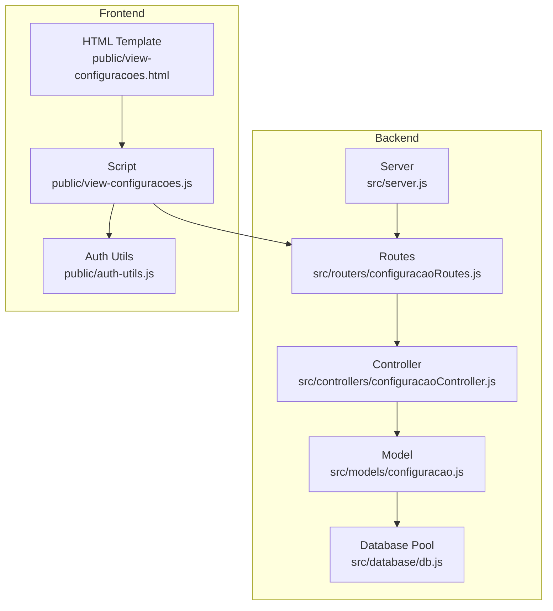
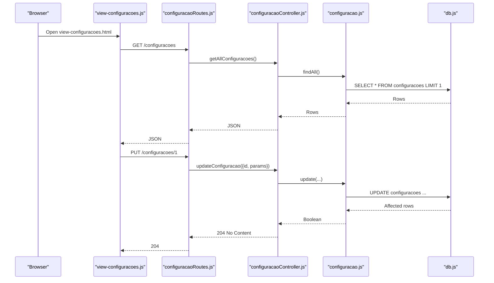
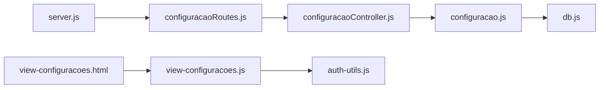
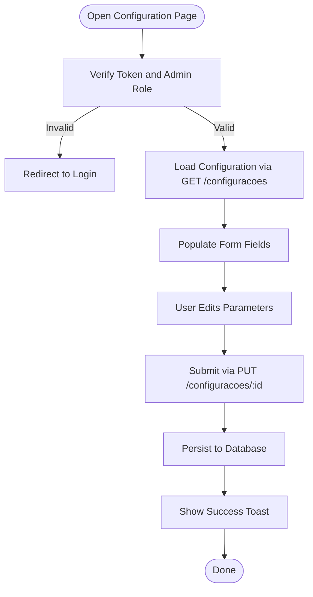

# Administrative Features

<cite>
**Referenced Files in This Document**
- [src/server.js](file://src/server.js)
- [src/routers/configuracaoRoutes.js](file://src/routers/configuracaoRoutes.js)
- [src/controllers/configuracaoController.js](file://src/controllers/configuracaoController.js)
- [src/models/configuracao.js](file://src/models/configuracao.js)
- [src/database/db.js](file://src/database/db.js)
- [public/view-configuracoes.html](file://public/view-configuracoes.html)
- [public/view-configuracoes.js](file://public/view-configuracoes.js)
- [public/auth-utils.js](file://public/auth-utils.js)
- [src/middleware/auth.js](file://src/middleware/auth.js)
- [src/models/user.js](file://src/models/user.js)
- [AUTH_GUIDE.md](file://AUTH_GUIDE.md)
</cite>

## Table of Contents
1. [Introduction](#introduction)
2. [Project Structure](#project-structure)
3. [Core Components](#core-components)
4. [Architecture Overview](#architecture-overview)
5. [Detailed Component Analysis](#detailed-component-analysis)
6. [Dependency Analysis](#dependency-analysis)
7. [Performance Considerations](#performance-considerations)
8. [Troubleshooting Guide](#troubleshooting-guide)
9. [Conclusion](#conclusion)
10. [Appendices](#appendices)

## Introduction
This document describes the Administrative Features system responsible for managing system-wide configuration parameters. It covers configuration management operations, controller implementation for validation and updates, model-layer persistence, and frontend integration for displaying and editing configuration settings. It also documents access control mechanisms, validation rules, and operational workflows for administrative tasks such as approvals and parameter validation.

## Project Structure
The Administrative Features system spans backend routes, controllers, models, and a dedicated frontend interface. The backend exposes a REST-like API under the /configuracoes prefix, while the frontend presents a Bootstrap-based form for administrators to view and update system parameters.

**Diagram sources**
- [src/server.js](file://src/server.js#L31-L73)
- [src/routers/configuracaoRoutes.js](file://src/routers/configuracaoRoutes.js#L1-L18)
- [src/controllers/configuracaoController.js](file://src/controllers/configuracaoController.js#L1-L43)
- [src/models/configuracao.js](file://src/models/configuracao.js#L1-L26)
- [src/database/db.js](file://src/database/db.js#L1-L15)
- [public/view-configuracoes.html](file://public/view-configuracoes.html#L1-L110)
- [public/view-configuracoes.js](file://public/view-configuracoes.js#L1-L81)
- [public/auth-utils.js](file://public/auth-utils.js#L1-L88)

**Section sources**
- [src/server.js](file://src/server.js#L31-L73)
- [src/routers/configuracaoRoutes.js](file://src/routers/configuracaoRoutes.js#L1-L18)
- [public/view-configuracoes.html](file://public/view-configuracoes.html#L1-L110)

## Core Components
- Backend API surface for configuration management:
  - GET /configuracoes: Retrieve current configuration set (limited to one row).
  - GET /configuracoes/:id: Retrieve a specific configuration by ID.
  - PUT /configuracoes/:id: Update configuration parameters by ID.
- Controller functions handle request parsing, parameter extraction, and delegation to the model.
- Model encapsulates database queries to select and update configuration records.
- Frontend template and script provide an administrative interface with client-side validation and notifications.

Key responsibilities:
- Parameter management: mural_periodo_atual, curso_turma_atual, curso_abertura_inscricoes, curso_encerramento_inscricoes, termo_compromisso_periodo, termo_compromisso_inicio, termo_compromisso_final, periodo_calendario_academico.
- Access control: authentication via JWT and role-based access control (RBAC) for administrative actions.
- Persistence: MariaDB via a pooled connection.

**Section sources**
- [src/controllers/configuracaoController.js](file://src/controllers/configuracaoController.js#L1-L43)
- [src/models/configuracao.js](file://src/models/configuracao.js#L1-L26)
- [src/routers/configuracaoRoutes.js](file://src/routers/configuracaoRoutes.js#L1-L18)
- [public/view-configuracoes.html](file://public/view-configuracoes.html#L19-L86)
- [public/view-configuracoes.js](file://public/view-configuracoes.js#L46-L73)

## Architecture Overview
The system follows a layered architecture:
- Presentation layer: HTML template and JavaScript for configuration UI.
- Application layer: Express routes and controllers.
- Domain layer: Business logic resides in controllers and models.
- Data access layer: MariaDB via a connection pool.

**Diagram sources**
- [src/routers/configuracaoRoutes.js](file://src/routers/configuracaoRoutes.js#L11-L16)
- [src/controllers/configuracaoController.js](file://src/controllers/configuracaoController.js#L5-L42)
- [src/models/configuracao.js](file://src/models/configuracao.js#L5-L23)
- [src/database/db.js](file://src/database/db.js#L5-L13)
- [public/view-configuracoes.js](file://public/view-configuracoes.js#L19-L73)

## Detailed Component Analysis

### Backend API and Routing
- Routes:
  - GET /configuracoes: Returns the first configuration row.
  - GET /configuracoes/:id: Returns a specific configuration by ID.
  - PUT /configuracoes/:id: Updates configuration parameters for the given ID.
- Middleware:
  - JSON body parsing is enabled globally for the router.
- Access control:
  - The current implementation does not apply authentication or role middleware to these routes. Administrators should integrate authentication and RBAC middleware to secure these endpoints.

Operational notes:
- The model enforces a limit of one row returned for listing, ensuring a singleton configuration set.
- The frontend always targets ID 1 for updates.

Security consideration:
- Without authentication middleware, any client can call these endpoints. Apply JWT verification and role checks for administrative endpoints.

**Section sources**
- [src/routers/configuracaoRoutes.js](file://src/routers/configuracaoRoutes.js#L1-L18)
- [src/models/configuracao.js](file://src/models/configuracao.js#L5-L9)

### Controller Implementation
Responsibilities:
- Extract parameters from the request body for update operations.
- Delegate to the model for retrieval and update operations.
- Return appropriate HTTP status codes and error messages.

Validation:
- The controller does not perform input validation. Consider adding validation for date formats, numeric ranges, and required fields.

Error handling:
- Catches exceptions and responds with 500 and an error message.

**Section sources**
- [src/controllers/configuracaoController.js](file://src/controllers/configuracaoController.js#L5-L42)

### Model Layer Operations
Database interactions:
- findAll(): Selects up to one configuration row.
- findById(id): Retrieves a configuration by ID.
- update(...): Updates all configuration fields for a given ID.

Data integrity:
- Uses parameterized queries to prevent SQL injection.
- Returns affectedRows indicator for update success.

**Section sources**
- [src/models/configuracao.js](file://src/models/configuracao.js#L5-L23)
- [src/database/db.js](file://src/database/db.js#L5-L13)

### Frontend Integration
UI and UX:
- Bootstrap-based form with labeled inputs for each configuration parameter.
- Toast notifications for feedback on save/load operations.
- Client-side redirection to login if not authenticated or lacks admin role.

Behavior:
- Loads configuration via GET /configuracoes and populates form fields.
- Submits updates via PUT /configuracoes/:id with ID 1.
- Uses auth-utils for token and role checks.

Access control:
- Enforces admin-only access by checking token presence and role before rendering the page.

**Section sources**
- [public/view-configuracoes.html](file://public/view-configuracoes.html#L19-L86)
- [public/view-configuracoes.js](file://public/view-configuracoes.js#L4-L17)
- [public/view-configuracoes.js](file://public/view-configuracoes.js#L19-L73)
- [public/auth-utils.js](file://public/auth-utils.js#L61-L69)

### Authentication and Authorization Integration
Current state:
- Authentication middleware supports JWT verification and role checks.
- The configuration routes are not currently protected by authentication or role middleware.

Recommended integration:
- Apply verifyToken and checkRole(['admin']) to configuration routes to enforce administrative access.
- Align frontend navigation and access checks with the authentication system.

**Section sources**
- [src/middleware/auth.js](file://src/middleware/auth.js#L6-L29)
- [src/middleware/auth.js](file://src/middleware/auth.js#L32-L48)
- [AUTH_GUIDE.md](file://AUTH_GUIDE.md#L44-L49)

## Dependency Analysis
The configuration subsystem depends on:
- Express routing and controllers for request handling.
- A database pool for connection management.
- Frontend scripts for user interaction and authentication checks.

**Diagram sources**
- [src/routers/configuracaoRoutes.js](file://src/routers/configuracaoRoutes.js#L1-L18)
- [src/controllers/configuracaoController.js](file://src/controllers/configuracaoController.js#L1-L43)
- [src/models/configuracao.js](file://src/models/configuracao.js#L1-L26)
- [src/database/db.js](file://src/database/db.js#L1-L15)
- [public/view-configuracoes.html](file://public/view-configuracoes.html#L1-L110)
- [public/view-configuracoes.js](file://public/view-configuracoes.js#L1-L81)
- [public/auth-utils.js](file://public/auth-utils.js#L1-L88)
- [src/server.js](file://src/server.js#L31-L73)

**Section sources**
- [src/server.js](file://src/server.js#L31-L73)
- [src/routers/configuracaoRoutes.js](file://src/routers/configuracaoRoutes.js#L1-L18)
- [src/controllers/configuracaoController.js](file://src/controllers/configuracaoController.js#L1-L43)
- [src/models/configuracao.js](file://src/models/configuracao.js#L1-L26)
- [src/database/db.js](file://src/database/db.js#L1-L15)
- [public/view-configuracoes.html](file://public/view-configuracoes.html#L1-L110)
- [public/view-configuracoes.js](file://public/view-configuracoes.js#L1-L81)
- [public/auth-utils.js](file://public/auth-utils.js#L1-L88)

## Performance Considerations
- Database pooling: The pool is configured with connection limits suitable for typical loads. Monitor queueLimit and adjust as needed.
- Query simplicity: Configuration reads/writes are simple and fast; ensure indexes if the configuration table grows substantially.
- Frontend caching: On successful load, the frontend caches the configuration in the DOM until refresh; avoid unnecessary repeated fetches.

[No sources needed since this section provides general guidance]

## Troubleshooting Guide
Common issues and resolutions:
- 404 Not Found when loading configuration:
  - Occurs if the configuration table is empty or missing the expected ID. The frontend displays a toast indicating no configuration found.
- 401 Unauthorized:
  - Missing or invalid JWT token. Ensure the user is logged in and the Authorization header is present.
- 403 Forbidden:
  - Insufficient permissions. Confirm the user has the admin role.
- Update failures:
  - Verify that the frontend targets ID 1 and that the backend routes are reachable.

**Section sources**
- [public/view-configuracoes.js](file://public/view-configuracoes.js#L37-L44)
- [src/middleware/auth.js](file://src/middleware/auth.js#L32-L48)

## Conclusion
The Administrative Features system provides a focused configuration management interface with a clean separation between presentation, application, and data layers. To meet production requirements, integrate authentication and role-based access control, add input validation, and establish audit and backup procedures for configuration changes.

[No sources needed since this section summarizes without analyzing specific files]

## Appendices

### API Definition
- GET /configuracoes
  - Description: Retrieve the current configuration set (singleton).
  - Success: 200 OK with configuration object.
  - Error: 500 Internal Server Error on failure.
- GET /configuracoes/:id
  - Description: Retrieve a configuration by ID.
  - Success: 200 OK with configuration object.
  - Error: 404 Not Found if not found; 500 Internal Server Error otherwise.
- PUT /configuracoes/:id
  - Description: Update configuration parameters by ID.
  - Body: Configuration fields as defined in the model.
  - Success: 204 No Content.
  - Error: 500 Internal Server Error on failure.

**Section sources**
- [src/routers/configuracaoRoutes.js](file://src/routers/configuracaoRoutes.js#L11-L16)
- [src/controllers/configuracaoController.js](file://src/controllers/configuracaoController.js#L5-L42)
- [src/models/configuracao.js](file://src/models/configuracao.js#L5-L23)

### Validation Rules
- Required fields:
  - mural_periodo_atual
  - termo_compromisso_periodo
  - termo_compromisso_inicio
  - termo_compromisso_final
  - periodo_calendario_academico
  - curso_turma_atual
  - curso_abertura_inscricoes
  - curso_encerramento_inscricoes
- Data types:
  - Dates must be valid ISO dates (YYYY-MM-DD).
  - Numeric fields must be integers or numeric values.
- Business rules:
  - Ensure course enrollment periods align with the current academic calendar.
  - Ensure commitment term periods align with the current period.

[No sources needed since this section provides general guidance]

### Access Control and Security
- Authentication:
  - Use verifyToken middleware to validate JWT tokens.
- Authorization:
  - Use checkRole(['admin']) to restrict configuration updates to administrators.
- Frontend enforcement:
  - Ensure admin-only access via auth-utils before rendering the configuration page.
- Audit and backups:
  - Implement logging for configuration changes and maintain periodic backups of the configuration table.

**Section sources**
- [src/middleware/auth.js](file://src/middleware/auth.js#L6-L29)
- [src/middleware/auth.js](file://src/middleware/auth.js#L32-L48)
- [public/auth-utils.js](file://public/auth-utils.js#L61-L69)
- [AUTH_GUIDE.md](file://AUTH_GUIDE.md#L44-L49)

### Workflow: Configuration Changes and Approvals

**Diagram sources**
- [public/view-configuracoes.js](file://public/view-configuracoes.js#L4-L17)
- [public/view-configuracoes.js](file://public/view-configuracoes.js#L19-L73)
- [src/routers/configuracaoRoutes.js](file://src/routers/configuracaoRoutes.js#L11-L16)
- [src/controllers/configuracaoController.js](file://src/controllers/configuracaoController.js#L30-L42)
- [src/models/configuracao.js](file://src/models/configuracao.js#L17-L23)