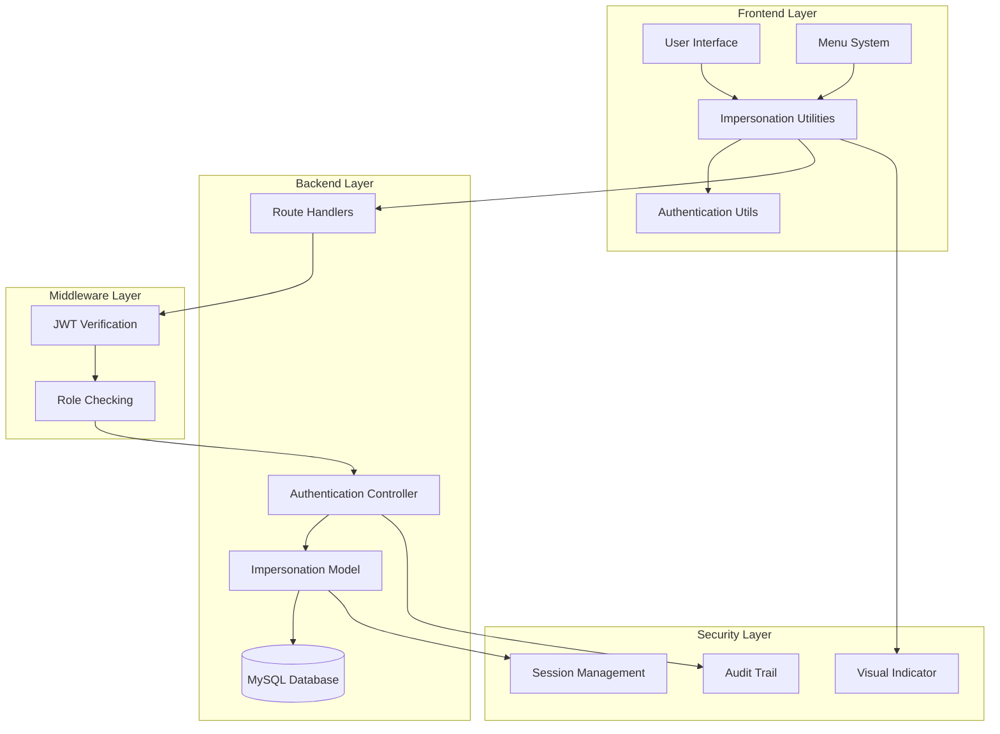
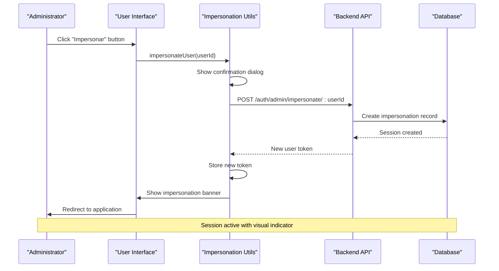
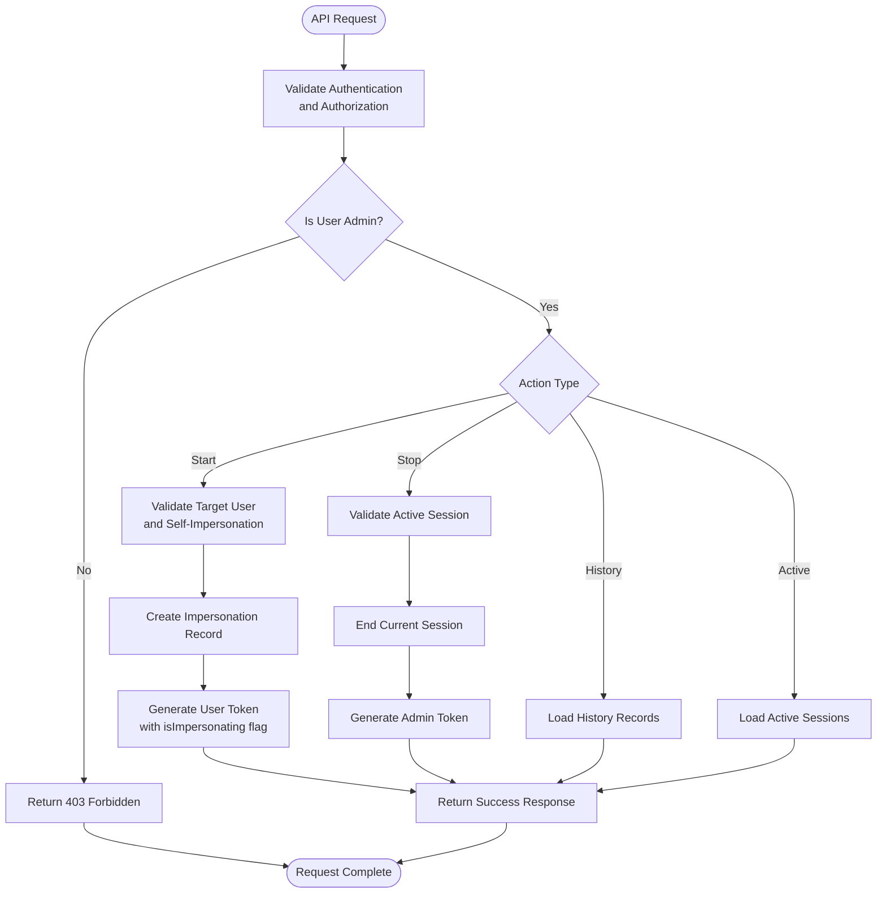

# Impersonation System

<cite>
**Referenced Files in This Document**
- [impersonation.html](file://public/impersonation.html)
- [impersonation.js](file://public/impersonation.js)
- [impersonation-utils.js](file://public/impersonation-utils.js)
- [menu.js](file://public/menu.js)
- [auth-utils.js](file://public/auth-utils.js)
- [impersonation.js](file://src/models/impersonation.js)
- [authController.js](file://src/controllers/authController.js)
- [authRoutes.js](file://src/routers/authRoutes.js)
- [auth.js](file://src/middleware/auth.js)
- [create_impersonations_table.sql](file://src/database/create_impersonations_table.sql)
- [setupImpersonationsTable.js](file://src/database/setupImpersonationsTable.js)
- [IMPERSONATION_GUIDE.md](file://IMPERSONATION_GUIDE.md)
- [QUICK_START_IMPERSONATION.md](file://QUICK_START_IMPERSONATION.md)
</cite>

## Table of Contents
1. [Introduction](#introduction)
2. [System Architecture](#system-architecture)
3. [Core Components](#core-components)
4. [Database Design](#database-design)
5. [Security Implementation](#security-implementation)
6. [Frontend Implementation](#frontend-implementation)
7. [Backend Implementation](#backend-implementation)
8. [API Endpoints](#api-endpoints)
9. [Usage Examples](#usage-examples)
10. [Troubleshooting Guide](#troubleshooting-guide)
11. [Best Practices](#best-practices)
12. [Conclusion](#conclusion)

## Introduction

The Impersonation System is a comprehensive administrative feature that allows system administrators to temporarily assume the identity of regular users to troubleshoot issues, provide better support, and gain insights into user experiences. This system provides a secure, auditable way for administrators to observe exactly what end users see and experience within the application.

The system is designed with strong security measures, comprehensive audit trails, and user-friendly interfaces that make it easy for administrators to switch between user perspectives while maintaining full accountability of all impersonation activities.

## System Architecture

The Impersonation System follows a client-server architecture with clear separation of concerns between frontend and backend components:



**Diagram sources**
- [impersonation-utils.js:1-191](file://public/impersonation-utils.js#L1-L191)
- [authController.js:262-401](file://src/controllers/authController.js#L262-L401)
- [authRoutes.js:1-28](file://src/routers/authRoutes.js#L1-L28)
- [auth.js:1-216](file://src/middleware/auth.js#L1-L216)

## Core Components

### Frontend Components

The frontend implementation consists of three primary JavaScript modules that work together to provide the impersonation functionality:

#### Impersonation Utilities (`public/impersonation-utils.js`)
This module provides the core functionality for starting and stopping impersonation sessions, managing visual indicators, and handling user interactions.

#### Test Interface (`public/impersonation.js`)
This module creates a comprehensive test interface that displays user lists and impersonation history, allowing administrators to easily test and manage impersonation sessions.

#### Menu Integration (`public/menu.js`)
This module integrates the impersonation banner system into the main navigation, ensuring that visual indicators are consistently displayed across all pages.

### Backend Components

#### Authentication Controller (`src/controllers/authController.js`)
Handles all impersonation-related API endpoints, including starting and stopping impersonation sessions, retrieving history, and managing active sessions.

#### Impersonation Model (`src/models/impersonation.js`)
Manages database operations for impersonation records, including creating sessions, tracking active sessions, and generating audit reports.

#### Route Configuration (`src/routers/authRoutes.js`)
Defines the API endpoints for impersonation functionality with appropriate authentication and authorization middleware.

**Section sources**
- [impersonation-utils.js:1-191](file://public/impersonation-utils.js#L1-L191)
- [impersonation.js:1-147](file://public/impersonation.js#L1-L147)
- [menu.js:1-107](file://public/menu.js#L1-L107)
- [authController.js:262-401](file://src/controllers/authController.js#L262-L401)
- [impersonation.js:1-124](file://src/models/impersonation.js#L1-L124)
- [authRoutes.js:1-28](file://src/routers/authRoutes.js#L1-L28)

## Database Design

The impersonation system uses a dedicated database table to track all impersonation activities with comprehensive audit capabilities:

```mermaid
erDiagram
IMPERSONATIONS {
int id PK
int admin_id FK
int impersonated_user_id FK
timestamp started_at
timestamp ended_at
boolean is_active
}
AUTH_USERS {
int id PK
string email UK
string nome
string role
int entidade_id
}
IMPERSONATIONS ||--|| AUTH_USERS : "admin_id"
IMPERSONATIONS ||--|| AUTH_USERS : "impersonated_user_id"
subgraph "Indexes"
idx_admin_active[admin_id, is_active]
idx_impersonated_active[impersonated_user_id, is_active]
end
```

**Diagram sources**
- [create_impersonations_table.sql:1-14](file://src/database/create_impersonations_table.sql#L1-L14)

### Database Schema Features

The impersonations table includes several key design elements:

- **Primary Key**: Auto-incrementing ID for unique identification
- **Foreign Key Constraints**: References to users table with cascade delete
- **Timestamp Tracking**: Comprehensive timing information for audit purposes
- **Index Optimization**: Specialized indexes for active session queries
- **Audit Trail**: Complete history of all impersonation activities

**Section sources**
- [create_impersonations_table.sql:1-14](file://src/database/create_impersonations_table.sql#L1-L14)
- [setupImpersonationsTable.js:1-60](file://src/database/setupImpersonationsTable.js#L1-L60)

## Security Implementation

The impersonation system implements multiple layers of security to prevent abuse and ensure proper authorization:

### Access Control
- **Role-Based Authorization**: Only users with `role: 'admin'` can impersonate
- **Self-Impersonation Prevention**: Admins cannot impersonate themselves
- **Cross-Role Protection**: Admins cannot impersonate other administrators
- **Session Isolation**: Each admin can only have one active impersonation session

### Session Management
- **Automatic Session Termination**: Starting a new impersonation automatically ends previous sessions
- **Token-Based Authentication**: Uses JWT tokens with special impersonation claims
- **Visual Indicators**: Persistent red banner warns users of active impersonation
- **Audit Logging**: Complete tracking of all impersonation activities

### Frontend Security
- **Confirmation Dialogs**: User confirmation required for all impersonation actions
- **Permission Validation**: Frontend checks ensure only authorized users see impersonation controls
- **Secure Storage**: Tokens stored in localStorage with proper error handling

**Section sources**
- [authController.js:262-327](file://src/controllers/authController.js#L262-L327)
- [impersonation-utils.js:7-81](file://public/impersonation-utils.js#L7-L81)
- [auth.js:35-52](file://src/middleware/auth.js#L35-L52)

## Frontend Implementation

### User Interface Components

The frontend implementation provides three main interfaces for different use cases:

#### Test Interface (`public/impersonation.html`, `public/impersonation.js`)
A comprehensive testing interface that displays:
- Complete user list with impersonation buttons
- Impersonation history dashboard
- Real-time session status monitoring
- Error handling and user feedback

#### Visual Banner System (`public/impersonation-utils.js`)
A persistent visual indicator that:
- Appears at the top of every page during impersonation
- Displays current user context and role
- Provides quick access to end impersonation
- Includes automatic positioning and styling

#### Menu Integration (`public/menu.js`)
Seamless integration with the existing navigation system:
- Automatic banner display on page load
- Dynamic menu updates based on user roles
- Consistent styling with application theme

### User Experience Features

The frontend implementation prioritizes usability and clear communication:



**Diagram sources**
- [impersonation-utils.js:7-43](file://public/impersonation-utils.js#L7-L43)
- [authController.js:262-327](file://src/controllers/authController.js#L262-L327)

**Section sources**
- [impersonation.html:1-52](file://public/impersonation.html#L1-L52)
- [impersonation.js:1-147](file://public/impersonation.js#L1-L147)
- [impersonation-utils.js:1-191](file://public/impersonation-utils.js#L1-L191)
- [menu.js:1-107](file://public/menu.js#L1-L107)

## Backend Implementation

### API Endpoint Architecture

The backend implements a RESTful API with comprehensive impersonation functionality:

#### Core Endpoints
- `POST /auth/admin/impersonate/:userId` - Start impersonation session
- `POST /auth/admin/stop-impersonate` - End current impersonation
- `GET /auth/admin/impersonations/history` - Retrieve impersonation history
- `GET /auth/admin/impersonations/active` - Get all active impersonation sessions

#### Request/Response Flow



**Diagram sources**
- [authController.js:262-401](file://src/controllers/authController.js#L262-L401)
- [authRoutes.js:21-25](file://src/routers/authRoutes.js#L21-L25)

### Database Operations

The backend model handles all database interactions with proper error handling and transaction management:

#### Session Management Operations
- **Create Session**: Insert new impersonation record with automatic cleanup of previous sessions
- **End Session**: Update existing session with end timestamp and deactivate flag
- **Active Session Lookup**: Query for current active sessions with user context
- **History Generation**: Retrieve comprehensive audit trail with calculated durations

**Section sources**
- [authController.js:262-401](file://src/controllers/authController.js#L262-L401)
- [impersonation.js:1-124](file://src/models/impersonation.js#L1-L124)
- [authRoutes.js:1-28](file://src/routers/authRoutes.js#L1-L28)

## API Endpoints

### Complete API Specification

The impersonation system exposes four primary API endpoints with comprehensive functionality:

#### Start Impersonation
**Endpoint**: `POST /auth/admin/impersonate/:userId`
**Authentication**: Required (Admin JWT token)
**Purpose**: Creates a new impersonation session for the specified user

**Response Format**:
```json
{
  "message": "Agora impersonando como User Name",
  "token": "<new_token_for_impersonated_user>",
  "user": {
    "id": 123,
    "email": "user@example.com",
    "nome": "User Name",
    "role": "aluno",
    "entidade_id": 45,
    "isImpersonating": true,
    "originalAdminId": 1
  }
}
```

#### Stop Impersonation
**Endpoint**: `POST /auth/admin/stop-impersonate`
**Authentication**: Required (Impersonation JWT token)
**Purpose**: Ends the current impersonation session and returns to admin account

**Response Format**:
```json
{
  "message": "Retornado à conta de administrador",
  "token": "<new_admin_token>",
  "user": {
    "id": 1,
    "email": "admin@example.com",
    "nome": "Admin Name",
    "role": "admin",
    "entidade_id": null
  }
}
```

#### Get Impersonation History
**Endpoint**: `GET /auth/admin/impersonations/history?limit=50`
**Authentication**: Required (Admin JWT token)
**Purpose**: Retrieves the admin's impersonation history with pagination support

**Response**: Array of impersonation records with calculated duration and user context

#### Get Active Impersonations
**Endpoint**: `GET /auth/admin/impersonations/active`
**Authentication**: Required (Admin JWT token)
**Purpose**: Provides real-time view of all active impersonation sessions across the system

**Response**: Array of active impersonation sessions with user and admin context

**Section sources**
- [IMPERSONATION_GUIDE.md:71-148](file://IMPERSONATION_GUIDE.md#L71-L148)
- [QUICK_START_IMPERSONATION.md:94-102](file://QUICK_START_IMPERSONATION.md#L94-L102)

## Usage Examples

### Adding Impersonation to Existing Interfaces

The impersonation system can be easily integrated into existing user management interfaces:

#### User List Integration
```javascript
import { getImpersonationButton } from './impersonation-utils.js';

function renderUserList(users) {
    const currentUser = getCurrentUser();
    
    return users.map(user => `
        <div class="user-card">
            <span>${user.nome}</span>
            <span>${user.email}</span>
            <span>${user.role}</span>
            ${getImpersonationButton(currentUser, user)}
        </div>
    `).join('');
}
```

#### Programmatic Usage
```javascript
import { impersonateUser, stopImpersonation } from './impersonation-utils.js';

// Start impersonation programmatically
await impersonateUser(123);

// Check if currently impersonating
const user = getCurrentUser();
if (user && user.isImpersonating) {
    console.log('Original admin ID:', user.originalAdminId);
}

// Stop impersonation programmatically
await stopImpersonation();
```

### Integration Patterns

The system supports multiple integration approaches:

1. **Button Integration**: Adding impersonation buttons to existing user lists
2. **Programmatic Control**: Direct API calls for automated scenarios
3. **Menu Integration**: Seamless navigation with visual indicators
4. **Testing Interface**: Dedicated test pages for development and QA

**Section sources**
- [IMPERSONATION_GUIDE.md:185-216](file://IMPERSONATION_GUIDE.md#L185-L216)
- [QUICK_START_IMPERSONATION.md:74-91](file://QUICK_START_IMPERSONATION.md#L74-L91)

## Troubleshooting Guide

### Common Issues and Solutions

#### Visual Indicator Problems
**Issue**: Impersonation banner not appearing
**Solutions**:
- Verify `menu.js` is loaded on the page
- Check browser console for JavaScript errors
- Ensure user object contains `isImpersonating: true`
- Confirm `showImpersonationBanner()` function is called

#### Authentication Issues
**Issue**: Permission denied when trying to impersonate
**Solutions**:
- Verify user role is 'admin' in users table
- Check that admin is not trying to impersonate another admin
- Ensure JWT token is valid and properly formatted
- Confirm token includes required authorization claims

#### Session Management Problems
**Issue**: Cannot stop impersonation session
**Solutions**:
- Check browser console for API errors
- Verify impersonation token is still valid
- Try manual localStorage cleanup and re-login
- Ensure backend service is running and accessible

#### Database Connectivity
**Issue**: Impersonation sessions not persisting
**Solutions**:
- Verify MySQL database connectivity
- Check impersonations table exists and is properly structured
- Ensure foreign key constraints are satisfied
- Verify database user has appropriate permissions

### Debugging Tools

#### Frontend Debugging
- Browser developer tools for network requests
- Console logging for error tracking
- LocalStorage inspection for token validation
- Network tab for API endpoint monitoring

#### Backend Debugging
- Server logs for error tracking
- Database query logs for session persistence
- JWT token validation debugging
- Middleware execution tracing

**Section sources**
- [IMPERSONATION_GUIDE.md:229-245](file://IMPERSONATION_GUIDE.md#L229-L245)
- [QUICK_START_IMPERSONATION.md:129-145](file://QUICK_START_IMPERSONATION.md#L129-L145)

## Best Practices

### Security Guidelines

1. **Limit Session Duration**: Keep impersonation sessions as short as possible
2. **Monitor Activity**: Regularly review impersonation history for unusual patterns
3. **Training Requirements**: Ensure all administrators understand responsible usage
4. **Audit Compliance**: Maintain logs for compliance and security auditing
5. **Access Control**: Restrict impersonation privileges to trusted administrators only

### Operational Guidelines

1. **Documentation**: Maintain records of all impersonation activities
2. **Review Cycles**: Establish regular reviews of impersonation usage
3. **Incident Response**: Have procedures for unauthorized impersonation attempts
4. **System Monitoring**: Monitor system performance during impersonation sessions
5. **User Communication**: Inform affected users when impersonation affects their accounts

### Technical Maintenance

1. **Database Cleanup**: Regular maintenance of impersonation history tables
2. **Performance Monitoring**: Monitor database performance impact
3. **Security Updates**: Regular security audits of impersonation functionality
4. **Backup Procedures**: Ensure impersonation data is included in backup strategies
5. **Disaster Recovery**: Plan for impersonation data recovery scenarios

## Conclusion

The Impersonation System provides a robust, secure, and user-friendly solution for administrative user simulation within the NodeMural application. Through its comprehensive security implementation, detailed audit capabilities, and seamless integration patterns, it enables administrators to effectively troubleshoot issues, provide better support, and gain valuable insights into user experiences.

The system's modular architecture ensures maintainability and extensibility, while its comprehensive documentation and troubleshooting guides support successful deployment and ongoing operation. With proper implementation of the recommended best practices and security guidelines, the impersonation system becomes a valuable tool for system administration and user support.

Key benefits of the implementation include:
- **Complete Security Coverage**: Multi-layered protection against unauthorized access
- **Comprehensive Auditing**: Full audit trail of all impersonation activities
- **User-Friendly Interface**: Intuitive controls with clear visual indicators
- **Flexible Integration**: Easy integration into existing application interfaces
- **Robust Architecture**: Scalable design supporting growing system needs

The system represents a significant enhancement to the administrative capabilities of the NodeMural platform, enabling more effective support and troubleshooting while maintaining strict security and accountability standards.