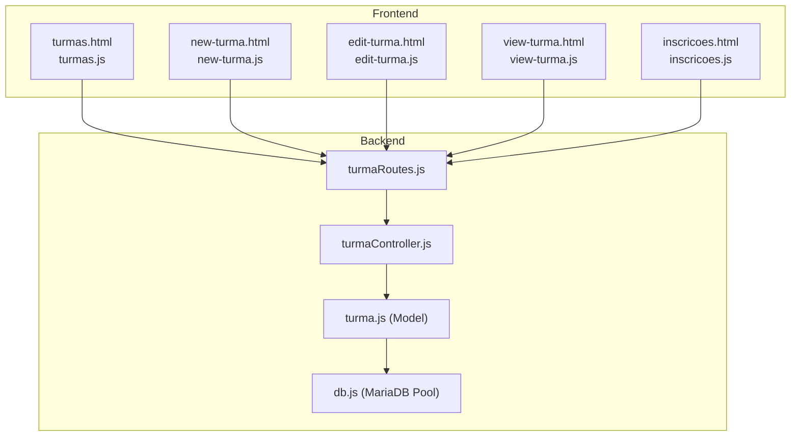
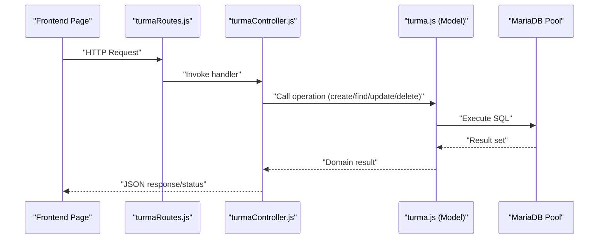
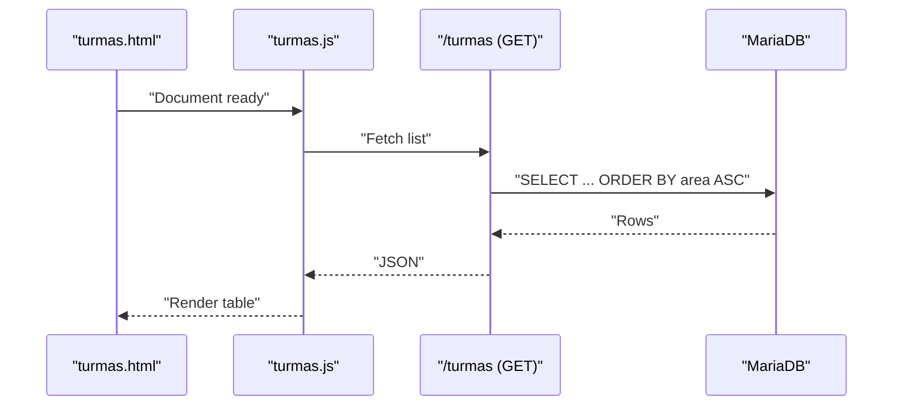
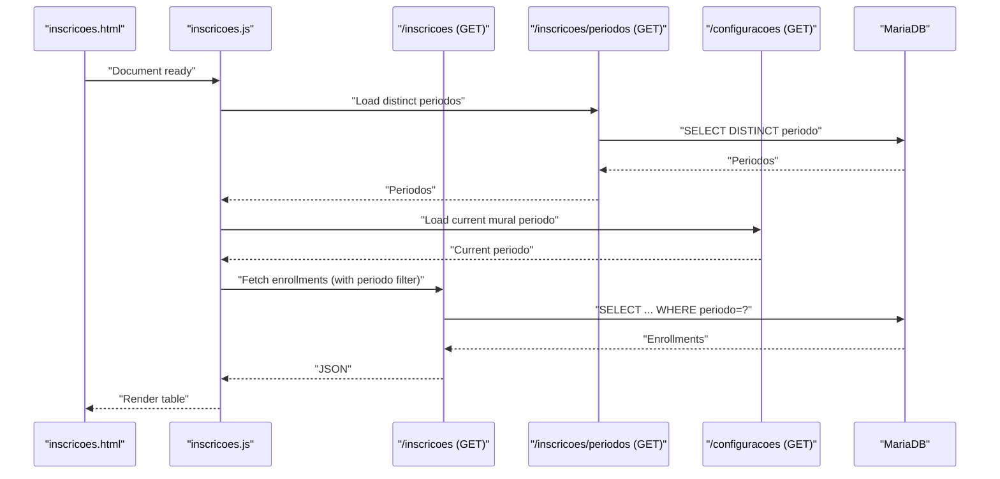
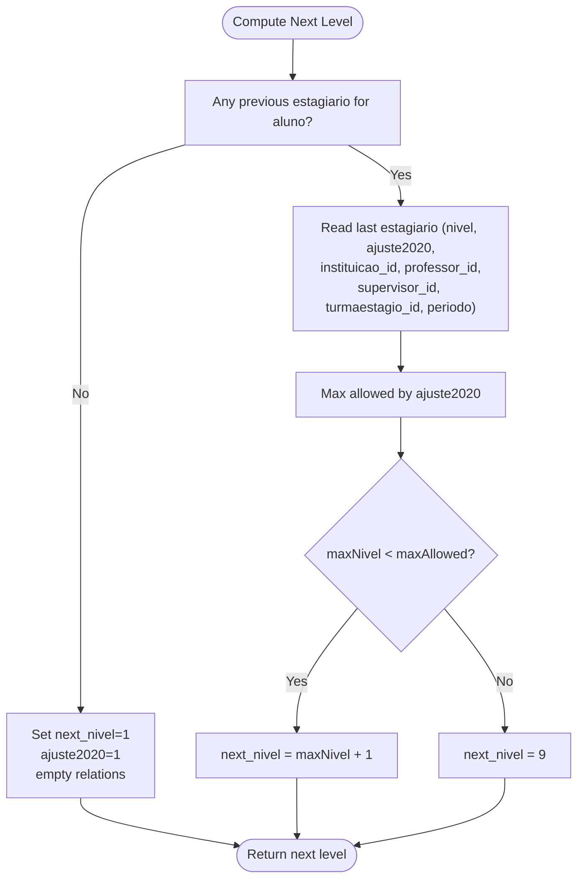
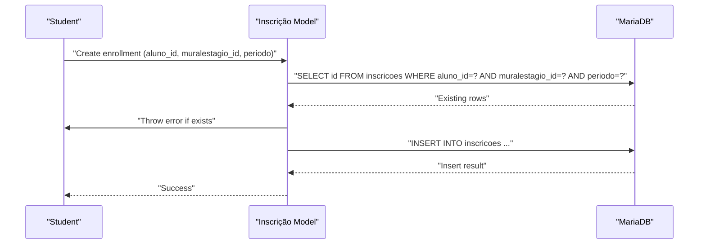
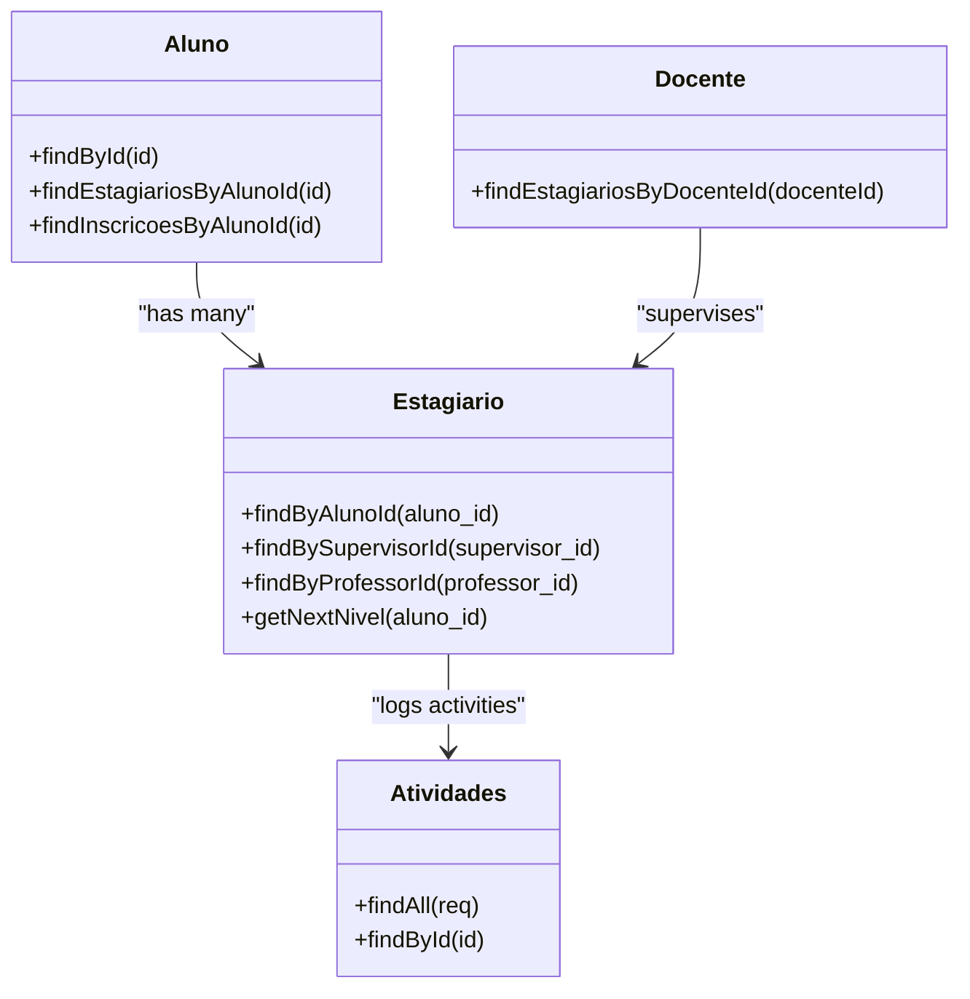
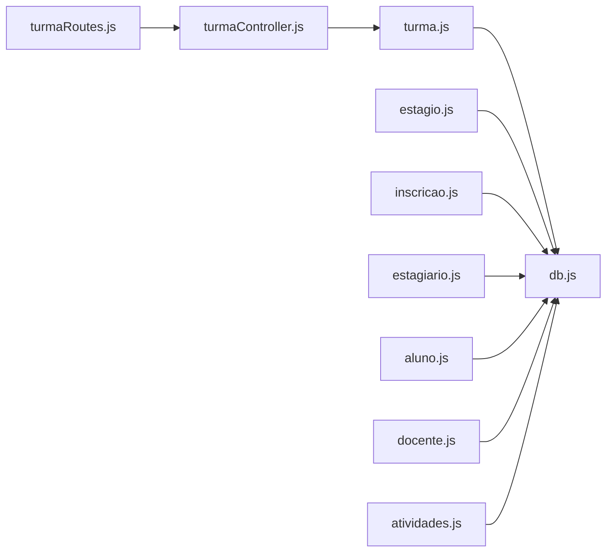

# Class Management

<cite>
**Referenced Files in This Document**
- [src/models/turma.js](file://src/models/turma.js)
- [src/controllers/turmaController.js](file://src/controllers/turmaController.js)
- [src/routers/turmaRoutes.js](file://src/routers/turmaRoutes.js)
- [public/turmas.html](file://public/turmas.html)
- [public/turmas.js](file://public/turmas.js)
- [public/new-turma.js](file://public/new-turma.js)
- [public/edit-turma.js](file://public/edit-turma.js)
- [public/view-turma.js](file://public/view-turma.js)
- [src/database/db.js](file://src/database/db.js)
- [src/models/estagio.js](file://src/models/estagio.js)
- [src/models/inscricao.js](file://src/models/inscricao.js)
- [src/models/estagiario.js](file://src/models/estagiario.js)
- [src/models/aluno.js](file://src/models/aluno.js)
- [src/models/docente.js](file://src/models/docente.js)
- [src/models/atividades.js](file://src/models/atividades.js)
- [public/inscricoes.html](file://public/inscricoes.html)
- [public/inscricoes.js](file://public/inscricoes.js)
</cite>

## Table of Contents
1. [Introduction](#introduction)
2. [Project Structure](#project-structure)
3. [Core Components](#core-components)
4. [Architecture Overview](#architecture-overview)
5. [Detailed Component Analysis](#detailed-component-analysis)
6. [Dependency Analysis](#dependency-analysis)
7. [Performance Considerations](#performance-considerations)
8. [Troubleshooting Guide](#troubleshooting-guide)
9. [Conclusion](#conclusion)
10. [Appendices](#appendices)

## Introduction
This document describes the Class Management system responsible for managing classes (turmas), course offerings (estágio), student enrollment (inscrições), and academic tracking. It covers the backend CRUD implementation for class entities, enrollment management, scheduling coordination, and relationships among students, professors, and activities. It also documents the frontend integration for displaying classes, enrollment interfaces, and academic management forms, along with validation rules and workflows for enrollment, scheduling, and progress monitoring.

## Project Structure
The system follows a layered architecture:
- Frontend (public): HTML pages and JavaScript modules for class display, editing, creation, viewing, and enrollment management.
- Backend (src): Express routes, controllers, and models for database interactions.
- Database (src/database): MariaDB connection pool configuration.

**Diagram sources**
- [src/routers/turmaRoutes.js](file://src/routers/turmaRoutes.js#L1-L18)
- [src/controllers/turmaController.js](file://src/controllers/turmaController.js#L1-L67)
- [src/models/turma.js](file://src/models/turma.js#L1-L39)
- [src/database/db.js](file://src/database/db.js#L1-L15)
- [public/turmas.html](file://public/turmas.html#L1-L46)
- [public/turmas.js](file://public/turmas.js#L1-L56)
- [public/new-turma.js](file://public/new-turma.js#L1-L40)
- [public/edit-turma.js](file://public/edit-turma.js#L1-L66)
- [public/view-turma.js](file://public/view-turma.js#L1-L58)
- [public/inscricoes.html](file://public/inscricoes.html#L1-L57)
- [public/inscricoes.js](file://public/inscricoes.js#L1-L100)

**Section sources**
- [src/routers/turmaRoutes.js](file://src/routers/turmaRoutes.js#L1-L18)
- [src/controllers/turmaController.js](file://src/controllers/turmaController.js#L1-L67)
- [src/models/turma.js](file://src/models/turma.js#L1-L39)
- [src/database/db.js](file://src/database/db.js#L1-L15)
- [public/turmas.html](file://public/turmas.html#L1-L46)
- [public/turmas.js](file://public/turmas.js#L1-L56)
- [public/new-turma.js](file://public/new-turma.js#L1-L40)
- [public/edit-turma.js](file://public/edit-turma.js#L1-L66)
- [public/view-turma.js](file://public/view-turma.js#L1-L58)
- [public/inscricoes.html](file://public/inscricoes.html#L1-L57)
- [public/inscricoes.js](file://public/inscricoes.js#L1-L100)

## Core Components
- Class (Turma) management:
  - Model: create, read by id, list all, update, delete.
  - Controller: route handlers for all CRUD operations.
  - Routes: GET /, GET /:id, POST /, PUT /:id, DELETE /:id.
  - Frontend: list page, create page, edit page, view page.
- Course offering (Estágio) and enrollment (Inscrição):
  - Estágio: list, get by id, create, update, delete, supervisors lookup, mural periods.
  - Inscrição: list, distinct periods, get by id, get by aluno/mural, create, update, delete; uniqueness per aluno/mural/periodo enforced.
  - Estagiário: list, get by id, create, update, delete, queries by aluno/supervisor/professor, compute next level.
- Academic tracking:
  - Atividades: list, get by id, create, update, delete; linked to estagiários and alunos.
  - Aluno: create, find by registro, list, get by id, get estagiarios, get inscricoes, update, delete; deletion guarded by referential integrity.
  - Docente: create, list/search, get by id, update, delete, list estagiários by docente.

Validation highlights:
- Unique registration number for alunos.
- Unique enrollment per aluno/mural/periodo.
- Deletion guards for alunos referencing estagiarios or inscricoes.

**Section sources**
- [src/models/turma.js](file://src/models/turma.js#L1-L39)
- [src/controllers/turmaController.js](file://src/controllers/turmaController.js#L1-L67)
- [src/routers/turmaRoutes.js](file://src/routers/turmaRoutes.js#L1-L18)
- [src/models/estagio.js](file://src/models/estagio.js#L1-L66)
- [src/models/inscricao.js](file://src/models/inscricao.js#L1-L104)
- [src/models/estagiario.js](file://src/models/estagiario.js#L1-L187)
- [src/models/atividades.js](file://src/models/atividades.js#L1-L57)
- [src/models/aluno.js](file://src/models/aluno.js#L1-L146)
- [src/models/docente.js](file://src/models/docente.js#L1-L72)

## Architecture Overview
The backend uses Express with modular routing, controllers, and models. The database is accessed via a MariaDB connection pool. The frontend pages communicate with the backend through REST endpoints.

**Diagram sources**
- [src/routers/turmaRoutes.js](file://src/routers/turmaRoutes.js#L1-L18)
- [src/controllers/turmaController.js](file://src/controllers/turmaController.js#L1-L67)
- [src/models/turma.js](file://src/models/turma.js#L1-L39)
- [src/database/db.js](file://src/database/db.js#L1-L15)

## Detailed Component Analysis

### Class (Turma) Management
- Model operations:
  - Create: inserts a new class area.
  - Read: by id and list all ordered by area.
  - Update: updates area by id.
  - Delete: removes by id.
- Controller operations:
  - Handles errors and returns appropriate HTTP statuses.
- Routes:
  - GET /: list all.
  - GET /:id: get by id.
  - POST /: create.
  - PUT /:id: update.
  - DELETE /:id: delete.
- Frontend:
  - List page loads data via AJAX and renders links to view/edit/delete.
  - Create page posts new records and redirects to view.
  - Edit page preloads record and PUTs updates.
  - View page displays current record and supports edit/delete.

**Diagram sources**
- [public/turmas.html](file://public/turmas.html#L1-L46)
- [public/turmas.js](file://public/turmas.js#L1-L56)
- [src/routers/turmaRoutes.js](file://src/routers/turmaRoutes.js#L1-L18)
- [src/models/turma.js](file://src/models/turma.js#L1-L39)
- [src/database/db.js](file://src/database/db.js#L1-L15)

**Section sources**
- [src/models/turma.js](file://src/models/turma.js#L1-L39)
- [src/controllers/turmaController.js](file://src/controllers/turmaController.js#L1-L67)
- [src/routers/turmaRoutes.js](file://src/routers/turmaRoutes.js#L1-L18)
- [public/turmas.html](file://public/turmas.html#L1-L46)
- [public/turmas.js](file://public/turmas.js#L1-L56)
- [public/new-turma.js](file://public/new-turma.js#L1-L40)
- [public/edit-turma.js](file://public/edit-turma.js#L1-L66)
- [public/view-turma.js](file://public/view-turma.js#L1-L58)

### Enrollment Management (Inscrições)
- Model operations:
  - List enrollments optionally filtered by periodo.
  - Get distinct periodo values.
  - Get by id, by aluno/mural combination, by mural id.
  - Create and update enforce uniqueness per aluno/mural/periodo.
  - Delete by id.
- Frontend:
  - Filters by periodo loaded from backend and defaults to current mural periodo from configuration.
  - Renders enrollment list with links to view/edit/delete.
  - Supports deletion confirmation and reload.

**Diagram sources**
- [public/inscricoes.html](file://public/inscricoes.html#L1-L57)
- [public/inscricoes.js](file://public/inscricoes.js#L1-L100)
- [src/models/inscricao.js](file://src/models/inscricao.js#L1-L104)
- [src/models/estagio.js](file://src/models/estagio.js#L1-L66)

**Section sources**
- [src/models/inscricao.js](file://src/models/inscricao.js#L1-L104)
- [public/inscricoes.html](file://public/inscricoes.html#L1-L57)
- [public/inscricoes.js](file://public/inscricoes.js#L1-L100)

### Academic Tracking and Progress
- Estágio (course offering):
  - Provides supervisors lookup and mural periods for scheduling coordination.
- Estagiário (student placement):
  - Computes next level based on current nivel and adjustment flag, with constraints.
  - Queries by aluno, supervisor, and professor.
- Atividades (activity log):
  - Tracks daily activity entries linked to estagiários and alunos.
- Aluno:
  - Enforces unique registration number.
  - Retrieves estagiarios and inscricoes for academic history.
  - Guards deletion against existing references.
- Docente:
  - Lists estagiários under supervision.

**Diagram sources**
- [src/models/estagiario.js](file://src/models/estagiario.js#L130-L183)

**Section sources**
- [src/models/estagio.js](file://src/models/estagio.js#L1-L66)
- [src/models/estagiario.js](file://src/models/estagiario.js#L1-L187)
- [src/models/atividades.js](file://src/models/atividades.js#L1-L57)
- [src/models/aluno.js](file://src/models/aluno.js#L1-L146)
- [src/models/docente.js](file://src/models/docente.js#L1-L72)

### Scheduling and Capacity Coordination
- Mural periods:
  - Estágio provides periods for coordinating class offerings.
- Enrollment capacity:
  - Inscrição enforces uniqueness per aluno/mural/periodo, preventing double enrollment in the same period for the same offer.
- Class area:
  - Turma manages class areas; while not directly capacity-limited here, it can be used to group offerings by area.

**Diagram sources**
- [src/models/inscricao.js](file://src/models/inscricao.js#L58-L74)

**Section sources**
- [src/models/estagio.js](file://src/models/estagio.js#L53-L62)
- [src/models/inscricao.js](file://src/models/inscricao.js#L58-L92)
- [src/models/turma.js](file://src/models/turma.js#L1-L39)

### Relationship Management with Students and Professors
- Estagiário links alunos, docentes (professors), supervisores, instituicoes, and turmas.
- Aluno provides estagiarios and inscricoes for academic history.
- Docente lists estagiários under supervision.
- Atividades ties estagiários to daily activity logs.

**Diagram sources**
- [src/models/aluno.js](file://src/models/aluno.js#L54-L115)
- [src/models/estagiario.js](file://src/models/estagiario.js#L81-L128)
- [src/models/docente.js](file://src/models/docente.js#L50-L68)
- [src/models/atividades.js](file://src/models/atividades.js#L5-L32)

**Section sources**
- [src/models/aluno.js](file://src/models/aluno.js#L1-L146)
- [src/models/estagiario.js](file://src/models/estagiario.js#L1-L187)
- [src/models/docente.js](file://src/models/docente.js#L1-L72)
- [src/models/atividades.js](file://src/models/atividades.js#L1-L57)

## Dependency Analysis
- Routes depend on controllers.
- Controllers depend on models.
- Models depend on the database pool.
- Frontend pages depend on routes and DataTables for rendering.

**Diagram sources**
- [src/routers/turmaRoutes.js](file://src/routers/turmaRoutes.js#L1-L18)
- [src/controllers/turmaController.js](file://src/controllers/turmaController.js#L1-L67)
- [src/models/turma.js](file://src/models/turma.js#L1-L39)
- [src/database/db.js](file://src/database/db.js#L1-L15)
- [src/models/estagio.js](file://src/models/estagio.js#L1-L66)
- [src/models/inscricao.js](file://src/models/inscricao.js#L1-L104)
- [src/models/estagiario.js](file://src/models/estagiario.js#L1-L187)
- [src/models/aluno.js](file://src/models/aluno.js#L1-L146)
- [src/models/docente.js](file://src/models/docente.js#L1-L72)
- [src/models/atividades.js](file://src/models/atividades.js#L1-L57)

**Section sources**
- [src/routers/turmaRoutes.js](file://src/routers/turmaRoutes.js#L1-L18)
- [src/controllers/turmaController.js](file://src/controllers/turmaController.js#L1-L67)
- [src/models/turma.js](file://src/models/turma.js#L1-L39)
- [src/database/db.js](file://src/database/db.js#L1-L15)
- [src/models/estagio.js](file://src/models/estagio.js#L1-L66)
- [src/models/inscricao.js](file://src/models/inscricao.js#L1-L104)
- [src/models/estagiario.js](file://src/models/estagiario.js#L1-L187)
- [src/models/aluno.js](file://src/models/aluno.js#L1-L146)
- [src/models/docente.js](file://src/models/docente.js#L1-L72)
- [src/models/atividades.js](file://src/models/atividades.js#L1-L57)

## Performance Considerations
- Database pooling:
  - Connection limit and queue configuration are set via environment variables.
- Query optimization:
  - Use ORDER BY and WHERE clauses consistently to leverage indexes.
  - Prefer indexed columns in joins (e.g., foreign keys).
- Frontend rendering:
  - DataTables client-side pagination reduces payload sizes.
- Concurrency:
  - Unique constraints at the database level prevent race conditions during enrollment.
- Scalability:
  - Consider adding database indexes on frequently filtered columns (periodo, aluno_id, muralestagio_id).
  - Offload heavy aggregations to materialized views or summary tables if needed.

**Section sources**
- [src/database/db.js](file://src/database/db.js#L5-L13)
- [src/models/inscricao.js](file://src/models/inscricao.js#L60-L67)
- [public/turmas.js](file://public/turmas.js#L11-L39)
- [public/inscricoes.js](file://public/inscricoes.js#L13-L50)

## Troubleshooting Guide
- Class CRUD:
  - Ensure proper authentication and admin role before accessing class pages.
  - Verify JSON payload format for create/update requests.
  - Check server logs for SQL errors.
- Enrollment:
  - If enrollment fails with a uniqueness error, confirm the aluno is not already enrolled in the same muralestagio for the selected periodo.
  - Confirm periodo filter selection matches the intended academic period.
- Academic tracking:
  - If next level computation seems incorrect, verify the aluno’s prior estagiario records and the adjustment flag.
  - Ensure estagiário references (instituição, professor, supervisor, turma) are set appropriately before computing progression.

**Section sources**
- [public/turmas.js](file://public/turmas.js#L4-L9)
- [public/new-turma.js](file://public/new-turma.js#L6-L9)
- [public/edit-turma.js](file://public/edit-turma.js#L6-L9)
- [public/view-turma.js](file://public/view-turma.js#L6-L9)
- [src/models/inscricao.js](file://src/models/inscricao.js#L65-L67)
- [public/inscricoes.js](file://public/inscricoes.js#L52-L85)
- [src/models/estagiario.js](file://src/models/estagiario.js#L130-L183)

## Conclusion
The Class Management system provides a complete foundation for managing classes, course offerings, student enrollment, and academic progress. The backend offers robust CRUD operations with clear separation of concerns, while the frontend delivers responsive interfaces for administration. Validation rules protect data integrity, and the architecture supports scalability through database pooling and optimized queries.

## Appendices
- Validation rules summary:
  - Aluno registration number must be unique.
  - Enrollment must be unique per aluno/mural/periodo.
  - Deletion of alunos is prevented if they have estagiarios or inscricoes.
- Workflow references:
  - Class lifecycle: create → list → view → edit → delete.
  - Enrollment lifecycle: filter by periodo → create/update → view → delete.
  - Academic progression: compute next level based on prior estagiario records and adjustment flag.