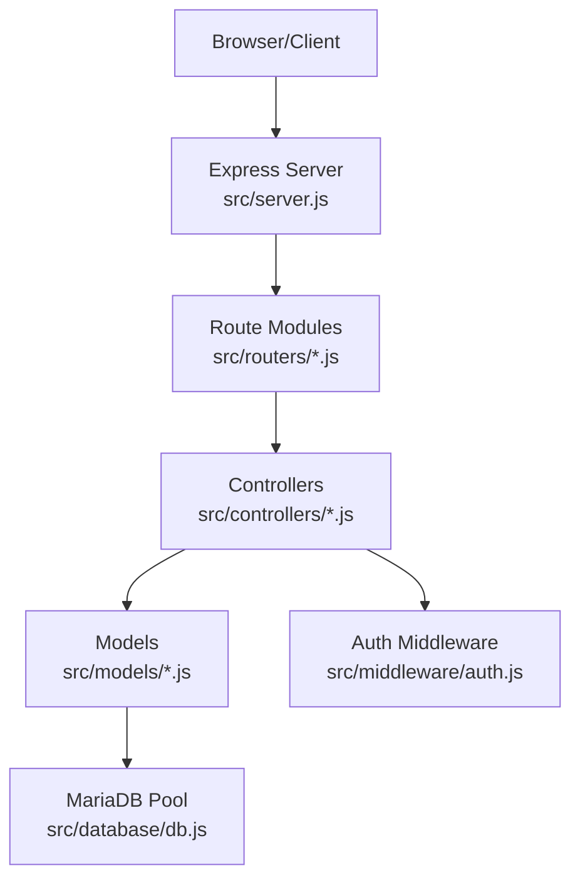
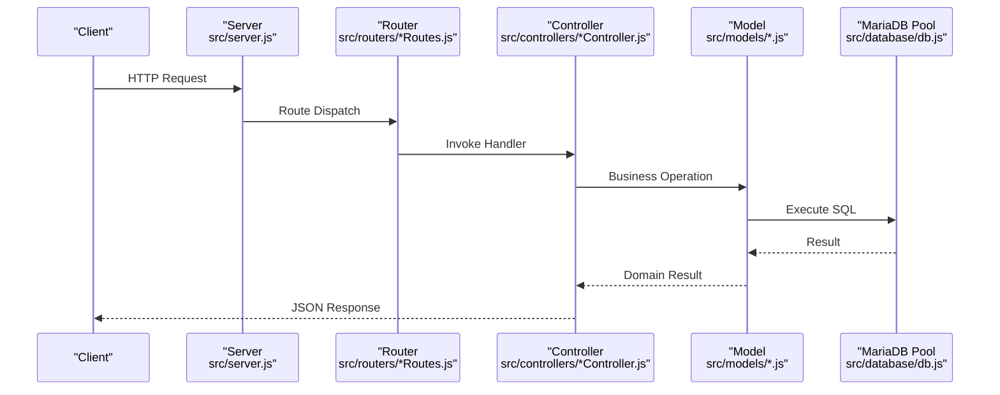
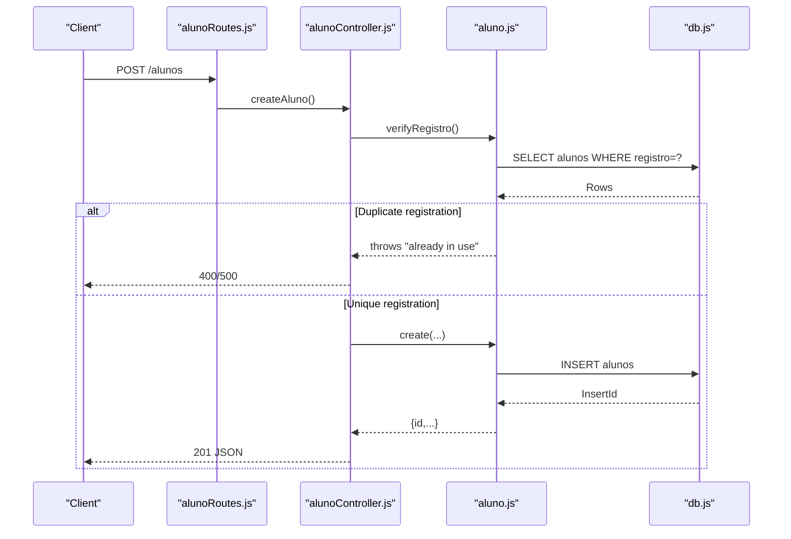
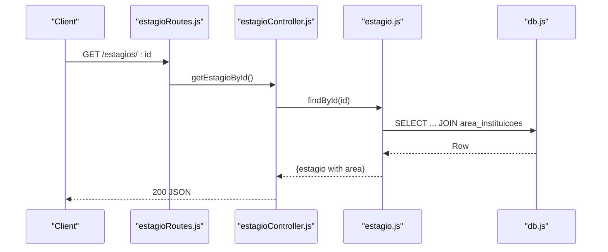
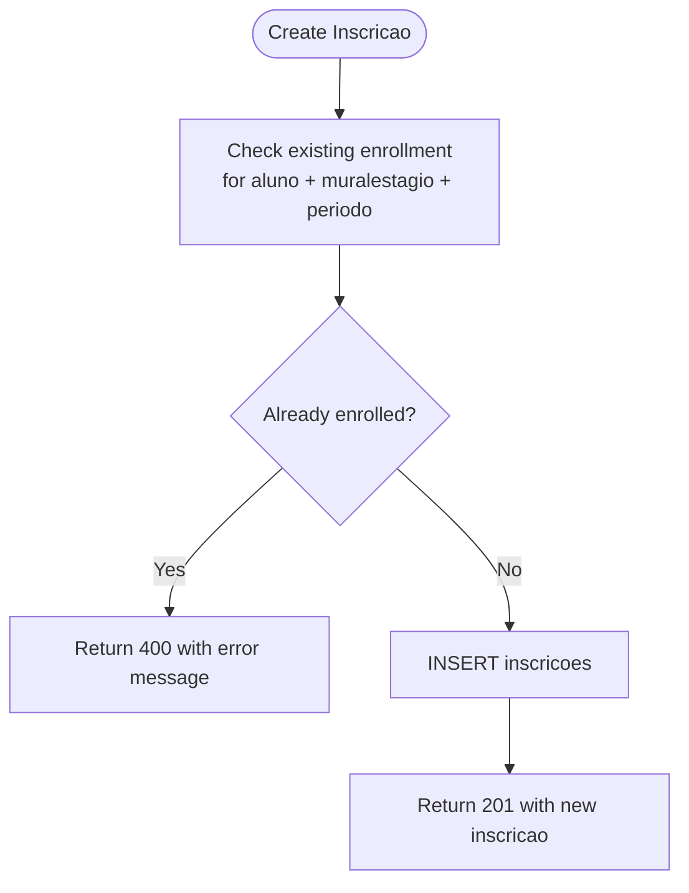
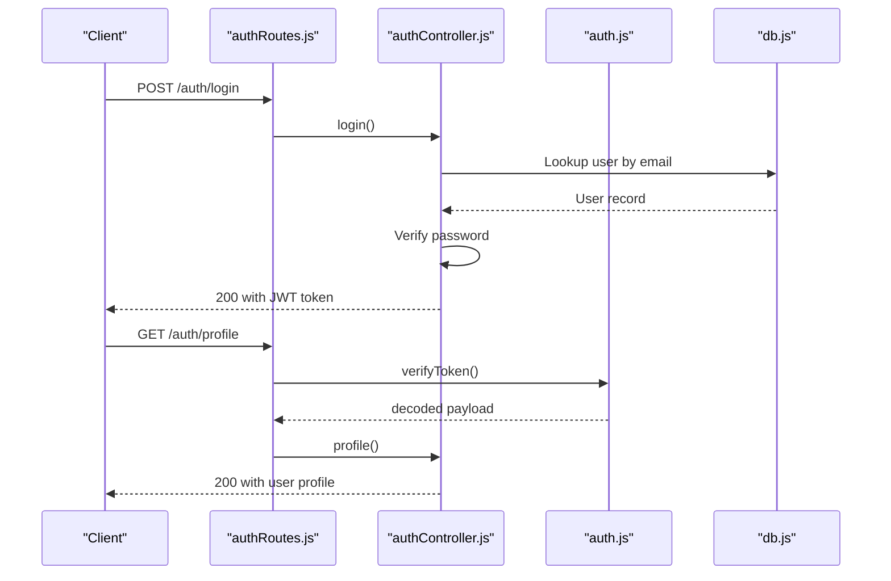
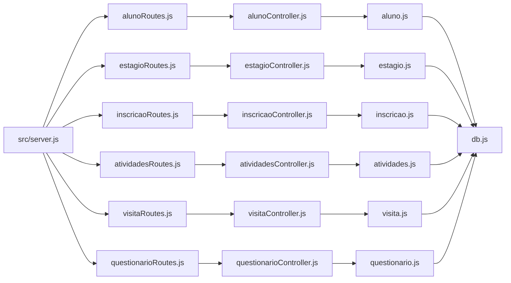
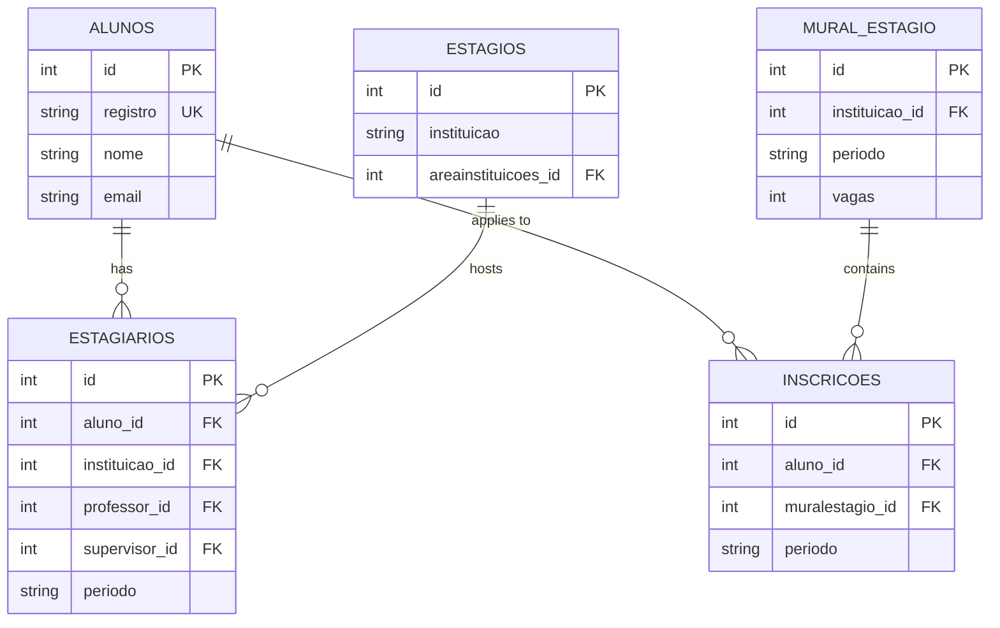

# Core Features Implementation

<cite>
**Referenced Files in This Document**
- [README.md](file://README.md)
- [package.json](file://package.json)
- [src/server.js](file://src/server.js)
- [src/database/db.js](file://src/database/db.js)
- [AUTH_GUIDE.md](file://AUTH_GUIDE.md)
- [src/middleware/auth.js](file://src/middleware/auth.js)
- [src/routers/alunoRoutes.js](file://src/routers/alunoRoutes.js)
- [src/routers/estagioRoutes.js](file://src/routers/estagioRoutes.js)
- [src/routers/inscricaoRoutes.js](file://src/routers/inscricaoRoutes.js)
- [src/routers/atividadesRoutes.js](file://src/routers/atividadesRoutes.js)
- [src/routers/visitaRoutes.js](file://src/routers/visitaRoutes.js)
- [src/routers/questionarioRoutes.js](file://src/routers/questionarioRoutes.js)
- [src/controllers/alunoController.js](file://src/controllers/alunoController.js)
- [src/controllers/estagioController.js](file://src/controllers/estagioController.js)
- [src/controllers/inscricaoController.js](file://src/controllers/inscricaoController.js)
- [src/controllers/atividadesController.js](file://src/controllers/atividadesController.js)
- [src/controllers/visitaController.js](file://src/controllers/visitaController.js)
- [src/controllers/questionarioController.js](file://src/controllers/questionarioController.js)
- [src/models/aluno.js](file://src/models/aluno.js)
- [src/models/estagio.js](file://src/models/estagio.js)
- [src/models/inscricao.js](file://src/models/inscricao.js)
- [src/models/atividades.js](file://src/models/atividades.js)
- [src/models/visita.js](file://src/models/visita.js)
- [src/models/questionario.js](file://src/models/questionario.js)
</cite>

## Table of Contents
1. [Introduction](#introduction)
2. [Project Structure](#project-structure)
3. [Core Components](#core-components)
4. [Architecture Overview](#architecture-overview)
5. [Detailed Component Analysis](#detailed-component-analysis)
6. [Dependency Analysis](#dependency-analysis)
7. [Performance Considerations](#performance-considerations)
8. [Troubleshooting Guide](#troubleshooting-guide)
9. [Conclusion](#conclusion)
10. [Appendices](#appendices)

## Introduction
This document explains the core feature implementations of NodeMural, focusing on CRUD operations across major entities: students, professors, supervisors, internships, questionnaires, activities, visits, classes, institutional areas, and configurations. It documents business logic, data validation, error handling, transaction management, controller-layer architecture, service orchestration, and integration with database models. Specialized features such as internship applications, questionnaire responses, activity tracking, and administrative configurations are covered alongside implementation patterns, common workflows, and integration points. Guidance on performance, scalability, and extensibility is also included.

## Project Structure
The application follows a layered architecture:
- Entry point initializes Express, middleware, and routes.
- Routers define endpoint groups per domain.
- Controllers implement request handling and orchestrate model operations.
- Models encapsulate database queries and business validations.
- Database pool manages connections to MariaDB.
- Authentication middleware enforces JWT-based access control and roles.

**Diagram sources**
- [src/server.js](file://src/server.js#L1-L73)
- [src/database/db.js](file://src/database/db.js#L1-L15)
- [src/middleware/auth.js](file://src/middleware/auth.js)

**Section sources**
- [README.md](file://README.md#L1-L61)
- [package.json](file://package.json#L1-L32)
- [src/server.js](file://src/server.js#L1-L73)

## Core Components
- Authentication and Authorization: JWT-based with role checks and protected routes.
- Routing: Modular routes grouped by resource under /{resource} and nested endpoints.
- Controllers: Thin handlers delegating to models; centralized error logging and status codes.
- Models: Encapsulate SQL queries, validations, and referential integrity checks.
- Database: MariaDB pool configured via environment variables.

Key implementation patterns:
- Consistent CRUD signatures across controllers and models.
- Centralized error handling with descriptive messages and appropriate HTTP status codes.
- Search/filter support via query parameters in select models.
- Referential integrity enforced in models (e.g., preventing deletion if related records exist).

**Section sources**
- [AUTH_GUIDE.md](file://AUTH_GUIDE.md#L1-L312)
- [src/server.js](file://src/server.js#L31-L73)
- [src/database/db.js](file://src/database/db.js#L1-L15)

## Architecture Overview
The system uses a classic MVC-like separation:
- Routes define endpoints and HTTP methods.
- Controllers handle request parsing, validation, and response formatting.
- Models abstract persistence and business rules.
- Middleware handles cross-cutting concerns like authentication and authorization.

**Diagram sources**
- [src/server.js](file://src/server.js#L31-L73)
- [src/routers/alunoRoutes.js](file://src/routers/alunoRoutes.js)
- [src/controllers/alunoController.js](file://src/controllers/alunoController.js)
- [src/models/aluno.js](file://src/models/aluno.js)
- [src/database/db.js](file://src/database/db.js#L1-L15)

## Detailed Component Analysis

### Students (Alunos)
CRUD operations:
- Create: Validates uniqueness of registration number; inserts student record.
- Read: By registration, by ID (with optional estagiario joins), and paginated/searchable listing.
- Update: Updates personal and contact details; returns affected-row indicator.
- Delete: Prevents deletion if student has related estagiarios or inscricoes.

Business logic highlights:
- Registration number uniqueness check before insert.
- Deletion guard against dependent estagiarios and inscricoes.
- Nested queries to enrich responses with estagiario and inscricao details.

**Diagram sources**
- [src/routers/alunoRoutes.js](file://src/routers/alunoRoutes.js)
- [src/controllers/alunoController.js](file://src/controllers/alunoController.js#L5-L14)
- [src/models/aluno.js](file://src/models/aluno.js#L6-L20)
- [src/database/db.js](file://src/database/db.js#L1-L15)

**Section sources**
- [src/controllers/alunoController.js](file://src/controllers/alunoController.js#L1-L114)
- [src/models/aluno.js](file://src/models/aluno.js#L1-L146)

### Professors (Docentes)
CRUD operations:
- Create, Read (by ID), Update, Delete supported via dedicated controller and router.

Business logic highlights:
- Controller delegates to model; model performs standard SQL operations.
- No explicit validation logic shown in controller; model responsibilities align with other entities.

**Section sources**
- [src/routers/docenteRoutes.js](file://src/routers/docenteRoutes.js)
- [src/controllers/docenteController.js](file://src/controllers/docenteController.js)

### Supervisors (Supervisores)
CRUD operations:
- Create, Read (by ID), Update, Delete supported via dedicated controller and router.

Business logic highlights:
- Controller delegates to model; model performs standard SQL operations.

**Section sources**
- [src/routers/supervisorRoutes.js](file://src/routers/supervisorRoutes.js)
- [src/controllers/supervisorController.js](file://src/controllers/supervisorController.js)

### Internships (Estágios)
CRUD operations:
- Create, Read (all and by ID), Update, Delete supported.
- Additional endpoints: fetch supervisors linked to an internship and fetch mural listings for an internship.

Business logic highlights:
- Join with institutional area to enrich responses.
- Fetch supervisors via junction table relationship.
- Fetch mural periods for an institution.

**Diagram sources**
- [src/routers/estagioRoutes.js](file://src/routers/estagioRoutes.js)
- [src/controllers/estagioController.js](file://src/controllers/estagioController.js#L14-L27)
- [src/models/estagio.js](file://src/models/estagio.js#L12-L18)
- [src/database/db.js](file://src/database/db.js#L1-L15)

**Section sources**
- [src/controllers/estagioController.js](file://src/controllers/estagioController.js#L1-L98)
- [src/models/estagio.js](file://src/models/estagio.js#L1-L66)

### Questionnaires
CRUD operations:
- Create, Read (all and by ID), Update, Delete supported.

Business logic highlights:
- Standard insert/update/delete with affected-row checks.

**Section sources**
- [src/controllers/questionarioController.js](file://src/controllers/questionarioController.js#L1-L72)
- [src/models/questionario.js](file://src/models/questionario.js#L1-L38)

### Activities Tracking
CRUD operations:
- Create, Read (all and by ID), Update, Delete supported.
- Filtering by estagiario_id via query parameter.

Business logic highlights:
- Aggregates estagiario and aluno details in responses.
- Supports filtering for efficient client-side rendering.

**Section sources**
- [src/controllers/atividadesController.js](file://src/controllers/atividadesController.js#L1-L88)
- [src/models/atividades.js](file://src/models/atividades.js#L1-L57)

### Visits
CRUD operations:
- Create, Read (all and by ID), Update, Delete supported.
- Filtering by institution ID via query parameter.

Business logic highlights:
- Left join with institutions to enrich responses.

**Section sources**
- [src/controllers/visitaController.js](file://src/controllers/visitaController.js#L1-L67)
- [src/models/visita.js](file://src/models/visita.js#L1-L51)

### Classes (Turmas)
CRUD operations:
- Create, Read (all and by ID), Update, Delete supported via dedicated controller and router.

Business logic highlights:
- Controller delegates to model; model performs standard SQL operations.

**Section sources**
- [src/routers/turmaRoutes.js](file://src/routers/turmaRoutes.js)
- [src/controllers/turmaController.js](file://src/controllers/turmaController.js)

### Institutional Areas
CRUD operations:
- Create, Read (all and by ID), Update, Delete supported via dedicated controller and router.

Business logic highlights:
- Controller delegates to model; model performs standard SQL operations.

**Section sources**
- [src/routers/areaInstituicaoRoutes.js](file://src/routers/areaInstituicaoRoutes.js)
- [src/controllers/areaInstituicaoController.js](file://src/controllers/areaInstituicaoController.js)

### Configurations
CRUD operations:
- Create, Read (all and by ID), Update, Delete supported via dedicated controller and router.

Business logic highlights:
- Controller delegates to model; model performs standard SQL operations.

**Section sources**
- [src/routers/configuracaoRoutes.js](file://src/routers/configuracaoRoutes.js)
- [src/controllers/configuracaoController.js](file://src/controllers/configuracaoController.js)

### Internship Applications (Inscrições)
CRUD operations:
- Create, Read (all, distinct periods, by ID, by mural, by aluno+period), Update, Delete supported.

Business logic highlights:
- Uniqueness constraint: prevents duplicate registrations for the same aluno, muralestagio, and periodo.
- Returns descriptive errors on constraint violations.
- Provides distinct periods endpoint for UI selection.

**Diagram sources**
- [src/models/inscricao.js](file://src/models/inscricao.js#L58-L74)

**Section sources**
- [src/controllers/inscricaoController.js](file://src/controllers/inscricaoController.js#L1-L114)
- [src/models/inscricao.js](file://src/models/inscricao.js#L1-L104)

### Authentication and Authorization
Endpoints and roles:
- Register, Login, Profile, Users listing with role-based access.
- Protected routes enforced via middleware.

Middleware responsibilities:
- verifyToken: validates JWT from Authorization header.
- checkRole: ensures user has required role(s).
- getCurrentUser: decodes token to extract user info.

**Diagram sources**
- [AUTH_GUIDE.md](file://AUTH_GUIDE.md#L66-L161)
- [src/middleware/auth.js](file://src/middleware/auth.js)
- [src/controllers/authController.js](file://src/controllers/authController.js)

**Section sources**
- [AUTH_GUIDE.md](file://AUTH_GUIDE.md#L1-L312)
- [src/middleware/auth.js](file://src/middleware/auth.js)
- [src/controllers/authController.js](file://src/controllers/authController.js)

## Dependency Analysis
High-level dependencies:
- Server imports all routers and mounts them under resource prefixes.
- Controllers depend on Models.
- Models depend on the MariaDB pool.
- Authentication middleware is reusable across routes.

**Diagram sources**
- [src/server.js](file://src/server.js#L8-L24)
- [src/routers/alunoRoutes.js](file://src/routers/alunoRoutes.js)
- [src/routers/estagioRoutes.js](file://src/routers/estagioRoutes.js)
- [src/routers/inscricaoRoutes.js](file://src/routers/inscricaoRoutes.js)
- [src/routers/atividadesRoutes.js](file://src/routers/atividadesRoutes.js)
- [src/routers/visitaRoutes.js](file://src/routers/visitaRoutes.js)
- [src/routers/questionarioRoutes.js](file://src/routers/questionarioRoutes.js)
- [src/controllers/alunoController.js](file://src/controllers/alunoController.js)
- [src/controllers/estagioController.js](file://src/controllers/estagioController.js)
- [src/controllers/inscricaoController.js](file://src/controllers/inscricaoController.js)
- [src/controllers/atividadesController.js](file://src/controllers/atividadesController.js)
- [src/controllers/visitaController.js](file://src/controllers/visitaController.js)
- [src/controllers/questionarioController.js](file://src/controllers/questionarioController.js)
- [src/models/aluno.js](file://src/models/aluno.js)
- [src/models/estagio.js](file://src/models/estagio.js)
- [src/models/inscricao.js](file://src/models/inscricao.js)
- [src/models/atividades.js](file://src/models/atividades.js)
- [src/models/visita.js](file://src/models/visita.js)
- [src/models/questionario.js](file://src/models/questionario.js)
- [src/database/db.js](file://src/database/db.js#L1-L15)

**Section sources**
- [src/server.js](file://src/server.js#L1-L73)

## Performance Considerations
- Connection pooling: MariaDB pool configured with limits; tune DB_POOL_LIMIT for workload.
- Query filtering: Models support query parameters to reduce payload sizes (e.g., estagiario_id filters).
- Indexing: Ensure primary keys and foreign keys are indexed; consider indexes on frequently filtered columns (e.g., periodo, registro).
- Pagination: For large datasets, implement server-side pagination or limit result sets.
- Caching: Introduce caching for static lists (e.g., institutional areas, periods) to reduce DB load.
- Transactions: Wrap multi-step operations (e.g., create inscricao with related checks) in transactions to maintain consistency.
- Logging: Centralize error logs and monitor slow queries.

[No sources needed since this section provides general guidance]

## Troubleshooting Guide
Common issues and resolutions:
- Authentication failures: Ensure Authorization header includes Bearer token; verify JWT_SECRET and expiry settings.
- Constraint violations: Duplicate registration numbers or inscricoes trigger descriptive errors; adjust inputs accordingly.
- Not found errors: Many endpoints return 404 when resources are missing; confirm IDs and relationships.
- Internal server errors: Review server logs for SQL exceptions; validate database connectivity and credentials.

**Section sources**
- [AUTH_GUIDE.md](file://AUTH_GUIDE.md#L289-L300)
- [src/controllers/alunoController.js](file://src/controllers/alunoController.js#L10-L14)
- [src/controllers/inscricaoController.js](file://src/controllers/inscricaoController.js#L74-L78)

## Conclusion
NodeMural’s core features are implemented with a clean separation of concerns: routes, controllers, and models. CRUD operations are standardized, with business validations embedded in models to enforce referential integrity and uniqueness. Authentication and authorization are integrated via middleware, enabling role-based access control. The architecture supports extension through modular routers and controllers, while database pooling and query filtering contribute to performance. Adopting transactions for complex operations, indexing strategies, and caching will further improve reliability and scalability.

[No sources needed since this section summarizes without analyzing specific files]

## Appendices

### Entity Relationship Overview

**Diagram sources**
- [src/models/aluno.js](file://src/models/aluno.js#L74-L115)
- [src/models/estagio.js](file://src/models/estagio.js#L53-L62)
- [src/models/inscricao.js](file://src/models/inscricao.js#L48-L56)