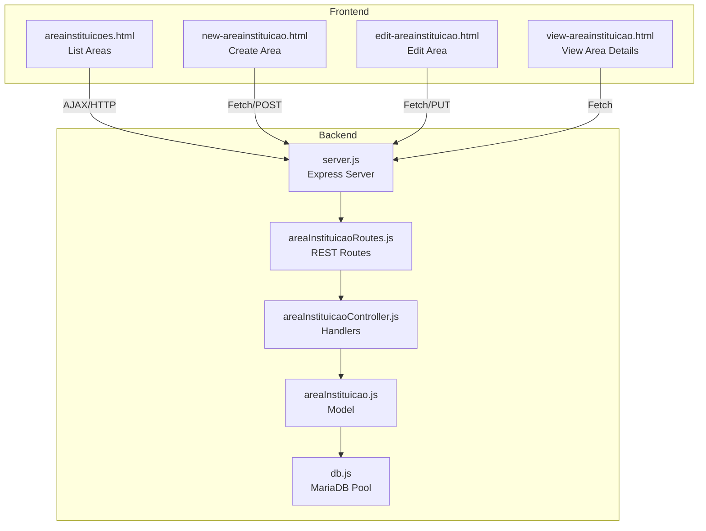
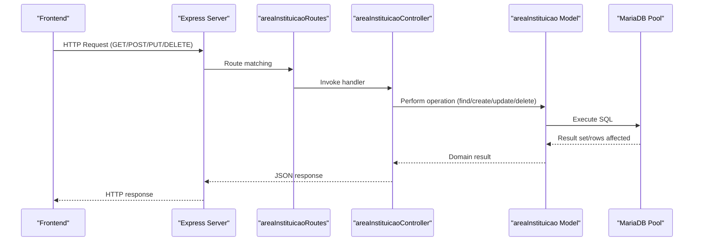
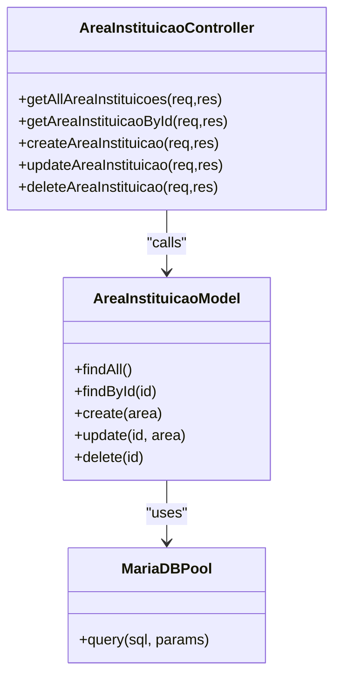
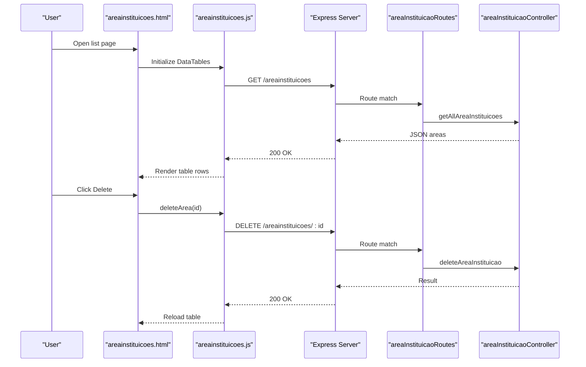
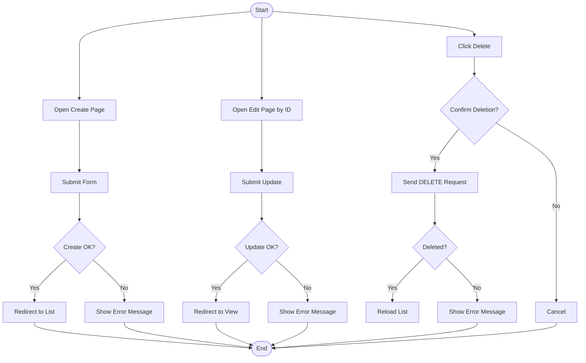
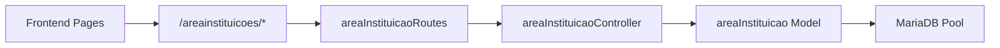

# Institutional Management

<cite>
**Referenced Files in This Document**
- [src/server.js](file://src/server.js)
- [src/routers/areaInstituicaoRoutes.js](file://src/routers/areaInstituicaoRoutes.js)
- [src/controllers/areaInstituicaoController.js](file://src/controllers/areaInstituicaoController.js)
- [src/models/areaInstituicao.js](file://src/models/areaInstituicao.js)
- [src/database/db.js](file://src/database/db.js)
- [public/areainstituicoes.html](file://public/areainstituicoes.html)
- [public/areainstituicoes.js](file://public/areainstituicoes.js)
- [public/new-areainstituicao.html](file://public/new-areainstituicao.html)
- [public/new-areainstituicao.js](file://public/new-areainstituicao.js)
- [public/edit-areainstituicao.html](file://public/edit-areainstituicao.html)
- [public/edit-areainstituicao.js](file://public/edit-areainstituicao.js)
- [public/view-areainstituicao.html](file://public/view-areainstituicao.html)
- [public/view-areainstituicao.js](file://public/view-areainstituicao.js)
- [public/menu.html](file://public/menu.html)
- [public/auth-utils.js](file://public/auth-utils.js)
</cite>

## Table of Contents
1. [Introduction](#introduction)
2. [Project Structure](#project-structure)
3. [Core Components](#core-components)
4. [Architecture Overview](#architecture-overview)
5. [Detailed Component Analysis](#detailed-component-analysis)
6. [Dependency Analysis](#dependency-analysis)
7. [Performance Considerations](#performance-considerations)
8. [Troubleshooting Guide](#troubleshooting-guide)
9. [Conclusion](#conclusion)
10. [Appendices](#appendices)

## Introduction
This document describes the Institutional Management system with a focus on institutional areas. It covers the complete CRUD lifecycle for managing institutional areas, including department management, organizational hierarchy, and administrative coordination. It documents the backend controller implementation for area validation, the model layer for database interactions, and the frontend integration with HTML templates for area display and administrative forms. Validation rules, workflow for institutional coordination, administrative processes, and organizational change management are explained, along with data integrity requirements and integration patterns within the broader institutional management system.

## Project Structure
The system follows a layered architecture:
- Frontend: Static HTML pages and client-side scripts for listing, creating, editing, viewing, and deleting institutional areas.
- Backend: Express server exposing REST endpoints for institutional areas, organized into routers, controllers, and models.
- Database: MariaDB connection pool configured via environment variables.

**Diagram sources**
- [src/server.js](file://src/server.js#L31-L72)
- [src/routers/areaInstituicaoRoutes.js](file://src/routers/areaInstituicaoRoutes.js#L1-L12)
- [src/controllers/areaInstituicaoController.js](file://src/controllers/areaInstituicaoController.js#L1-L76)
- [src/models/areaInstituicao.js](file://src/models/areaInstituicao.js#L1-L44)
- [src/database/db.js](file://src/database/db.js#L1-L15)
- [public/areainstituicoes.html](file://public/areainstituicoes.html#L1-L46)
- [public/new-areainstituicao.html](file://public/new-areainstituicao.html#L1-L42)
- [public/edit-areainstituicao.html](file://public/edit-areainstituicao.html#L1-L44)
- [public/view-areainstituicao.html](file://public/view-areainstituicao.html#L1-L49)

**Section sources**
- [src/server.js](file://src/server.js#L31-L72)
- [src/routers/areaInstituicaoRoutes.js](file://src/routers/areaInstituicaoRoutes.js#L1-L12)

## Core Components
- REST API for institutional areas:
  - GET /areainstituicoes: List all areas.
  - GET /areainstituicoes/:id: Retrieve a specific area.
  - POST /areainstituicoes: Create a new area.
  - PUT /areainstituicoes/:id: Update an existing area.
  - DELETE /areainstituicoes/:id: Remove an area.
- Model operations:
  - Find all areas ordered by name.
  - Find area by ID.
  - Create area with validated input.
  - Update area by ID.
  - Delete area by ID.
- Frontend pages:
  - List page with DataTables integration and actions.
  - Create form with client-side validation and submission.
  - Edit form pre-populated by ID and submit updates.
  - View details page with action buttons.

**Section sources**
- [src/routers/areaInstituicaoRoutes.js](file://src/routers/areaInstituicaoRoutes.js#L1-L12)
- [src/controllers/areaInstituicaoController.js](file://src/controllers/areaInstituicaoController.js#L1-L76)
- [src/models/areaInstituicao.js](file://src/models/areaInstituicao.js#L1-L44)
- [public/areainstituicoes.html](file://public/areainstituicoes.html#L1-L46)
- [public/new-areainstituicao.html](file://public/new-areainstituicao.html#L1-L42)
- [public/edit-areainstituicao.html](file://public/edit-areainstituicao.html#L1-L44)
- [public/view-areainstituicao.html](file://public/view-areainstituicao.html#L1-L49)

## Architecture Overview
The system implements a classic MVC-like separation:
- Router defines HTTP endpoints.
- Controller handles request validation, orchestrates model operations, and returns structured responses.
- Model encapsulates database queries using a shared connection pool.
- Frontend communicates via AJAX and form submissions to the backend.

**Diagram sources**
- [src/server.js](file://src/server.js#L31-L72)
- [src/routers/areaInstituicaoRoutes.js](file://src/routers/areaInstituicaoRoutes.js#L1-L12)
- [src/controllers/areaInstituicaoController.js](file://src/controllers/areaInstituicaoController.js#L1-L76)
- [src/models/areaInstituicao.js](file://src/models/areaInstituicao.js#L1-L44)
- [src/database/db.js](file://src/database/db.js#L1-L15)

## Detailed Component Analysis

### Backend: Institutional Areas API
- Router:
  - Exposes endpoints for listing, retrieving, creating, updating, and deleting areas.
- Controller:
  - Validates presence of required fields during creation and updates.
  - Handles errors and returns appropriate HTTP status codes.
  - Delegates persistence to the model.
- Model:
  - Encapsulates SQL queries for all CRUD operations.
  - Returns domain-friendly results (IDs, affected rows).

**Diagram sources**
- [src/controllers/areaInstituicaoController.js](file://src/controllers/areaInstituicaoController.js#L1-L76)
- [src/models/areaInstituicao.js](file://src/models/areaInstituicao.js#L1-L44)
- [src/database/db.js](file://src/database/db.js#L1-L15)

**Section sources**
- [src/routers/areaInstituicaoRoutes.js](file://src/routers/areaInstituicaoRoutes.js#L1-L12)
- [src/controllers/areaInstituicaoController.js](file://src/controllers/areaInstituicaoController.js#L1-L76)
- [src/models/areaInstituicao.js](file://src/models/areaInstituicao.js#L1-L44)

### Frontend: Area Management Pages
- List page:
  - Uses DataTables to render a sortable, paginated table.
  - Provides navigation to create, view, and edit actions.
  - Supports deletion via AJAX with confirmation.
- Create page:
  - Validates required fields and submits via Fetch to POST /areainstituicoes.
- Edit page:
  - Loads area by ID, populates the form, and submits updates via PUT.
- View details page:
  - Displays area attributes and action buttons for editing and deletion.

**Diagram sources**
- [public/areainstituicoes.html](file://public/areainstituicoes.html#L1-L46)
- [public/areainstituicoes.js](file://public/areainstituicoes.js#L1-L50)
- [src/server.js](file://src/server.js#L31-L72)
- [src/routers/areaInstituicaoRoutes.js](file://src/routers/areaInstituicaoRoutes.js#L1-L12)
- [src/controllers/areaInstituicaoController.js](file://src/controllers/areaInstituicaoController.js#L1-L76)

**Section sources**
- [public/areainstituicoes.html](file://public/areainstituicoes.html#L1-L46)
- [public/areainstituicoes.js](file://public/areainstituicoes.js#L1-L50)
- [public/new-areainstituicao.html](file://public/new-areainstituicao.html#L1-L42)
- [public/new-areainstituicao.js](file://public/new-areainstituicao.js#L1-L39)
- [public/edit-areainstituicao.html](file://public/edit-areainstituicao.html#L1-L44)
- [public/edit-areainstituicao.js](file://public/edit-areainstituicao.js#L1-L65)
- [public/view-areainstituicao.html](file://public/view-areainstituicao.html#L1-L49)
- [public/view-areainstituicao.js](file://public/view-areainstituicao.js#L1-L200)

### Administrative Boundary Management
- Access control:
  - All area management pages check for a valid token and admin role before rendering or allowing actions.
- Navigation:
  - Menu exposes links to institutional areas for administrative workflows.

**Section sources**
- [public/areainstituicoes.js](file://public/areainstituicoes.js#L4-L9)
- [public/new-areainstituicao.js](file://public/new-areainstituicao.js#L4-L9)
- [public/edit-areainstituicao.js](file://public/edit-areainstituicao.js#L4-L9)
- [public/menu.html](file://public/menu.html#L38-L42)
- [public/auth-utils.js](file://public/auth-utils.js#L1-L200)

### Validation Rules
- Creation and update require a non-empty area name.
- Deletion is permitted only if the record exists; otherwise a 404 is returned.
- Frontend forms enforce required field presence before submission.

**Section sources**
- [src/controllers/areaInstituicaoController.js](file://src/controllers/areaInstituicaoController.js#L30-L42)
- [src/controllers/areaInstituicaoController.js](file://src/controllers/areaInstituicaoController.js#L44-L61)
- [public/new-areainstituicao.html](file://public/new-areainstituicao.html#L22-L31)
- [public/edit-areainstituicao.html](file://public/edit-areainstituicao.html#L22-L33)

### Workflow: Institutional Coordination and Change Management
- New area creation:
  - User navigates to the create page, fills the form, and submits.
  - On success, the user is redirected to the list page.
- Editing an area:
  - User selects an area, opens the edit page, modifies the name, and saves.
  - On success, the user is redirected to the view page for the updated area.
- Viewing and deleting:
  - Users can view details and delete areas after confirmation.
  - Successful deletions refresh the list.

**Diagram sources**
- [public/new-areainstituicao.js](file://public/new-areainstituicao.js#L11-L38)
- [public/edit-areainstituicao.js](file://public/edit-areainstituicao.js#L22-L48)
- [public/areainstituicoes.js](file://public/areainstituicoes.js#L35-L49)

## Dependency Analysis
- Routing:
  - The server mounts the area institution routes under /areainstituicoes.
- Controllers depend on models for persistence.
- Models depend on the database pool for SQL execution.
- Frontend pages depend on the backend REST endpoints and shared authentication utilities.

**Diagram sources**
- [src/server.js](file://src/server.js#L53-L53)
- [src/routers/areaInstituicaoRoutes.js](file://src/routers/areaInstituicaoRoutes.js#L1-L12)
- [src/controllers/areaInstituicaoController.js](file://src/controllers/areaInstituicaoController.js#L1-L76)
- [src/models/areaInstituicao.js](file://src/models/areaInstituicao.js#L1-L44)
- [src/database/db.js](file://src/database/db.js#L1-L15)

**Section sources**
- [src/server.js](file://src/server.js#L53-L53)
- [src/routers/areaInstituicaoRoutes.js](file://src/routers/areaInstituicaoRoutes.js#L1-L12)
- [src/controllers/areaInstituicaoController.js](file://src/controllers/areaInstituicaoController.js#L1-L76)
- [src/models/areaInstituicao.js](file://src/models/areaInstituicao.js#L1-L44)
- [src/database/db.js](file://src/database/db.js#L1-L15)

## Performance Considerations
- Database pooling:
  - Connection limits and queue behavior are configurable via environment variables.
- Query efficiency:
  - Listing areas is ordered by name; consider indexing the area column for large datasets.
- Frontend:
  - DataTables pagination and sorting reduce payload sizes on the client.

[No sources needed since this section provides general guidance]

## Troubleshooting Guide
- Authentication failures:
  - If unauthorized, pages redirect to the login page.
- Server errors:
  - Backend logs errors and returns generic messages; inspect server logs for details.
- Database connectivity:
  - Verify environment variables for host, user, password, database, and pool limit.

**Section sources**
- [public/areainstituicoes.js](file://public/areainstituicoes.js#L6-L9)
- [public/new-areainstituicao.js](file://public/new-areainstituicao.js#L6-L9)
- [public/edit-areainstituicao.js](file://public/edit-areainstituicao.js#L6-L9)
- [src/controllers/areaInstituicaoController.js](file://src/controllers/areaInstituicaoController.js#L8-L10)
- [src/controllers/areaInstituicaoController.js](file://src/controllers/areaInstituicaoController.js#L23-L25)
- [src/controllers/areaInstituicaoController.js](file://src/controllers/areaInstituicaoController.js#L38-L40)
- [src/controllers/areaInstituicaoController.js](file://src/controllers/areaInstituicaoController.js#L57-L60)
- [src/controllers/areaInstituicaoController.js](file://src/controllers/areaInstituicaoController.js#L73-L75)
- [src/database/db.js](file://src/database/db.js#L5-L13)

## Conclusion
The Institutional Management system provides a robust foundation for managing institutional areas with clear separation of concerns, strong validation, and secure administrative access. The backend offers a complete CRUD API, while the frontend delivers intuitive forms and lists. The current implementation focuses on institutional areas but integrates naturally with other institutional entities (e.g., stages referencing areas), enabling broader organizational coordination and change management.

## Appendices

### API Reference: Institutional Areas
- GET /areainstituicoes
  - Description: Retrieve all institutional areas.
  - Success: 200 OK with array of areas.
  - Error: 500 Internal Server Error.
- GET /areainstituicoes/:id
  - Description: Retrieve a specific area by ID.
  - Success: 200 OK with area object.
  - Not Found: 404 Not Found.
  - Error: 500 Internal Server Error.
- POST /areainstituicoes
  - Description: Create a new area.
  - Body: { area: string }.
  - Success: 201 Created with new area object.
  - Validation: 400 Bad Request if area is missing.
  - Error: 500 Internal Server Error.
- PUT /areainstituicoes/:id
  - Description: Update an existing area.
  - Body: { area: string }.
  - Success: 200 OK with { id, area }.
  - Not Found: 404 Not Found.
  - Validation: 400 Bad Request if area is missing.
  - Error: 500 Internal Server Error.
- DELETE /areainstituicoes/:id
  - Description: Delete an area by ID.
  - Success: 200 OK with success message.
  - Not Found: 404 Not Found.
  - Error: 500 Internal Server Error.

**Section sources**
- [src/routers/areaInstituicaoRoutes.js](file://src/routers/areaInstituicaoRoutes.js#L6-L10)
- [src/controllers/areaInstituicaoController.js](file://src/controllers/areaInstituicaoController.js#L4-L12)
- [src/controllers/areaInstituicaoController.js](file://src/controllers/areaInstituicaoController.js#L14-L27)
- [src/controllers/areaInstituicaoController.js](file://src/controllers/areaInstituicaoController.js#L29-L42)
- [src/controllers/areaInstituicaoController.js](file://src/controllers/areaInstituicaoController.js#L44-L61)
- [src/controllers/areaInstituicaoController.js](file://src/controllers/areaInstituicaoController.js#L63-L76)