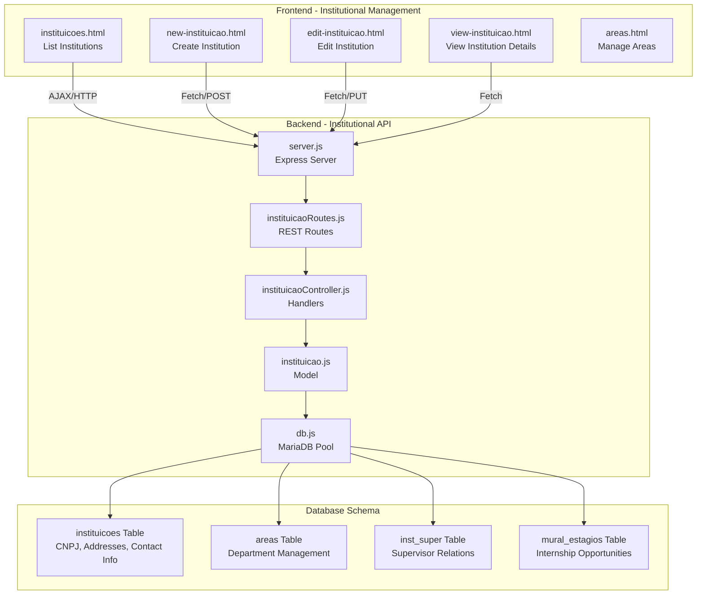
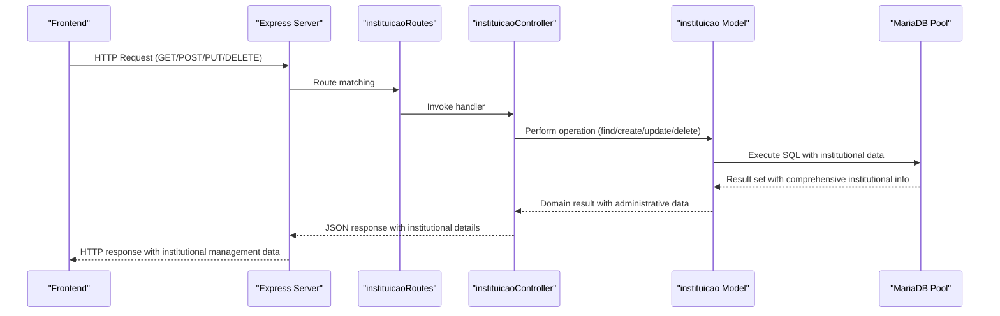
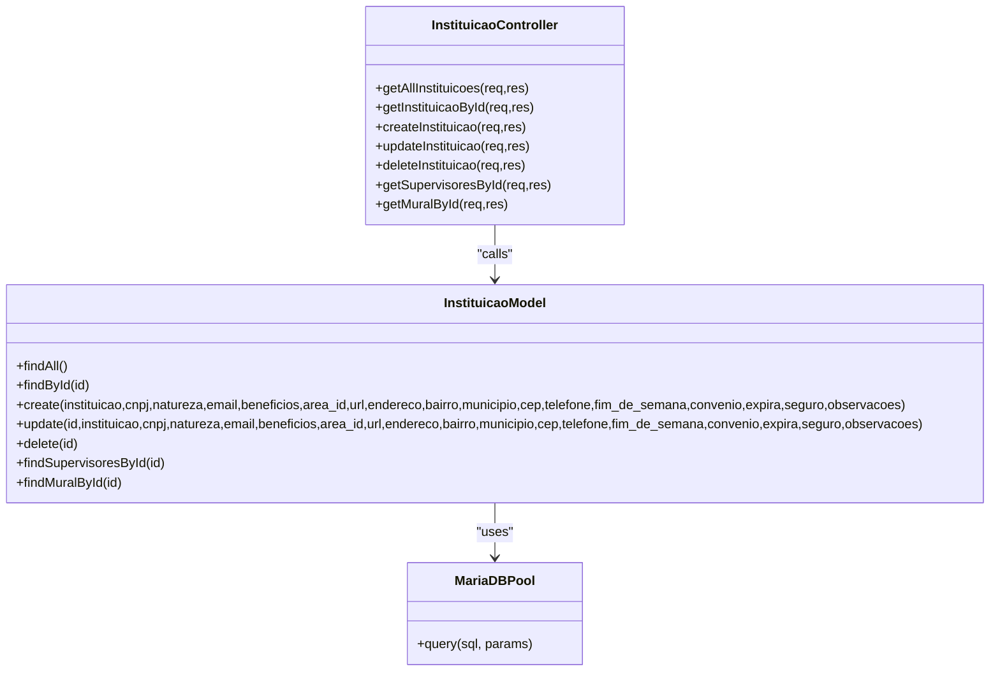
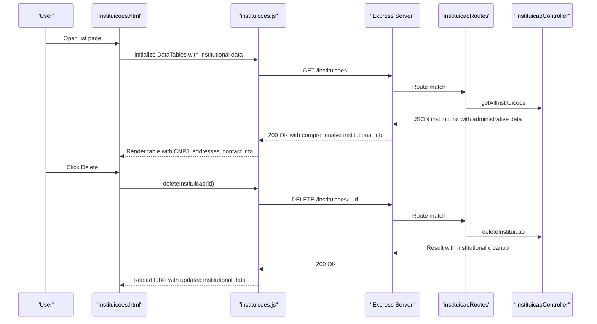
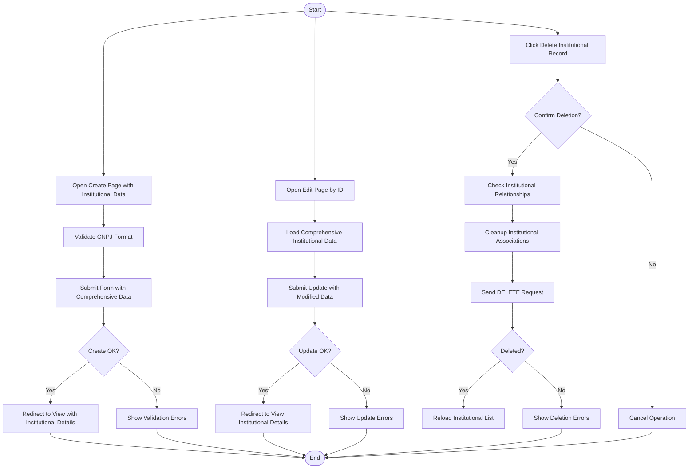
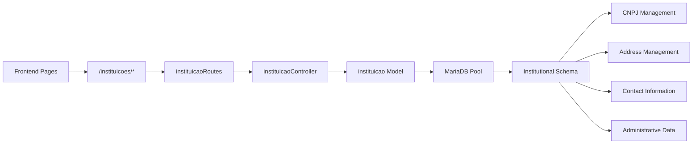

# Institutional Management

<cite>
**Referenced Files in This Document**
- [src/server.js](file://src/server.js)
- [src/routers/instituicaoRoutes.js](file://src/routers/instituicaoRoutes.js)
- [src/controllers/instituicaoController.js](file://src/controllers/instituicaoController.js)
- [src/models/instituicao.js](file://src/models/instituicao.js)
- [src/database/db.js](file://src/database/db.js)
- [src/database/setupFullDatabase.js](file://src/database/setupFullDatabase.js)
- [public/instituicoes.html](file://public/instituicoes.html)
- [public/instituicoes.js](file://public/instituicoes.js)
- [public/new-instituicao.html](file://public/new-instituicao.html)
- [public/new-instituicao.js](file://public/new-instituicao.js)
- [public/edit-instituicao.html](file://public/edit-instituicao.html)
- [public/edit-instituicao.js](file://public/edit-instituicao.js)
- [public/view-instituicao.html](file://public/view-instituicao.html)
- [public/view-instituicao.js](file://public/view-instituicao.js)
- [public/menu.html](file://public/menu.html)
- [public/auth-utils.js](file://public/auth-utils.js)
</cite>

## Update Summary
**Changes Made**
- Complete system rename from "estagios" to "instituicoes" throughout the documentation
- Added comprehensive institutional management features including CNPJ, nature, email, benefits, area associations, URLs, addresses, phone numbers, weekend policies, agreements, expiration dates, insurance coverage, and observations
- Updated all API endpoints, database schema references, and frontend interface documentation
- Enhanced institutional coordination workflows with supervisor and mural management capabilities
- Expanded administrative boundary management with detailed institutional data handling

## Table of Contents
1. [Introduction](#introduction)
2. [Project Structure](#project-structure)
3. [Core Components](#core-components)
4. [Architecture Overview](#architecture-overview)
5. [Detailed Component Analysis](#detailed-component-analysis)
6. [Dependency Analysis](#dependency-analysis)
7. [Performance Considerations](#performance-considerations)
8. [Troubleshooting Guide](#troubleshooting-guide)
9. [Conclusion](#conclusion)
10. [Appendices](#appendices)

## Introduction
This document describes the Institutional Management system with comprehensive institutional management capabilities. The system has evolved from basic stage management to a full institutional management platform supporting CNPJ registration, organizational structure tracking, administrative coordination, and extensive institutional data management. It covers the complete CRUD lifecycle for managing institutional entities including department management, organizational hierarchy, administrative coordination, and institutional relationship tracking. The documentation encompasses backend controller implementation for institutional validation, model layer operations for database interactions, and frontend integration with HTML templates for institutional display and administrative forms. Validation rules, workflow for institutional coordination, administrative processes, and organizational change management are thoroughly explained, along with data integrity requirements and integration patterns within the broader institutional management system.

## Project Structure
The system follows a comprehensive layered architecture with institutional management as the core:
- Frontend: Static HTML pages and client-side scripts for listing, creating, editing, viewing, and deleting institutional entities with detailed data management.
- Backend: Express server exposing REST endpoints for institutional management, organized into routers, controllers, and models with supervisor and mural integration.
- Database: MariaDB connection pool configured via environment variables with comprehensive institutional schema supporting CNPJ, addresses, contact information, and administrative data.

```mermaid
graph TB
subgraph "Frontend - Institutional Management"
A["instituicoes.html<br/>List Institutions"]
B["new-instituicao.html<br/>Create Institution"]
C["edit-instituicao.html<br/>Edit Institution"]
D["view-instituicao.html<br/>View Institution Details"]
E["areas.html<br/>Manage Areas"]
end
subgraph "Backend - Institutional API"
S["server.js<br/>Express Server"]
R["instituicaoRoutes.js<br/>REST Routes"]
Ctl["instituicaoController.js<br/>Handlers"]
M["instituicao.js<br/>Model"]
DB["db.js<br/>MariaDB Pool"]
end
subgraph "Database Schema"
T["instituicoes Table<br/>CNPJ, Addresses, Contact Info"]
U["areas Table<br/>Department Management"]
V["inst_super Table<br/>Supervisor Relations"]
W["mural_estagios Table<br/>Internship Opportunities"]
end
A --> |AJAX/HTTP| S
B --> |Fetch/POST| S
C --> |Fetch/PUT| S
D --> |Fetch| S
S --> R
R --> Ctl
Ctl --> M
M --> DB
DB --> T
DB --> U
DB --> V
DB --> W
```

**Diagram sources**
- [src/server.js](file://src/server.js#L41-L41)
- [src/routers/instituicaoRoutes.js](file://src/routers/instituicaoRoutes.js#L1-L20)
- [src/controllers/instituicaoController.js](file://src/controllers/instituicaoController.js#L1-L95)
- [src/models/instituicao.js](file://src/models/instituicao.js#L1-L66)
- [src/database/db.js](file://src/database/db.js#L1-L15)
- [src/database/setupFullDatabase.js](file://src/database/setupFullDatabase.js#L84-L104)
- [public/instituicoes.html](file://public/instituicoes.html#L1-L62)
- [public/new-instituicao.html](file://public/new-instituicao.html#L1-L110)
- [public/edit-instituicao.html](file://public/edit-instituicao.html#L1-L111)
- [public/view-instituicao.html](file://public/view-instituicao.html#L1-L184)

**Section sources**
- [src/server.js](file://src/server.js#L41-L41)
- [src/routers/instituicaoRoutes.js](file://src/routers/instituicaoRoutes.js#L1-L20)

## Core Components
- REST API for institutional management:
  - GET /instituicoes: List all institutions with comprehensive data including CNPJ, addresses, contact information, and administrative details.
  - GET /instituicoes/:id: Retrieve a specific institution with associated area information and administrative data.
  - POST /instituicoes: Create a new institution with complete institutional profile data.
  - PUT /instituicoes/:id: Update an existing institution with comprehensive data modification capabilities.
  - DELETE /instituicoes/:id: Remove an institution with proper cascade handling.
  - GET /instituicoes/:id/supervisores: Retrieve supervisors associated with an institution.
  - GET /instituicoes/:id/mural: Retrieve internship opportunities for an institution.
- Model operations:
  - Find all institutions with area associations and administrative data.
  - Find institution by ID with comprehensive detail retrieval.
  - Create institution with validated institutional data including CNPJ validation.
  - Update institution with complete data modification support.
  - Delete institution with proper cleanup of related associations.
  - Find supervisors associated with institutions.
  - Find internship opportunities for institutions.
- Frontend pages:
  - Comprehensive list page with DataTables integration showing all institutional data fields.
  - Create form with extensive institutional data input including CNPJ masking, address validation, and contact information.
  - Edit form with pre-populated institutional data and comprehensive update capabilities.
  - View details page with tabbed interface for institutional data, supervisor management, and internship opportunities.
  - Integrated area management for institutional department associations.

**Section sources**
- [src/routers/instituicaoRoutes.js](file://src/routers/instituicaoRoutes.js#L11-L18)
- [src/controllers/instituicaoController.js](file://src/controllers/instituicaoController.js#L3-L95)
- [src/models/instituicao.js](file://src/models/instituicao.js#L4-L66)
- [public/instituicoes.html](file://public/instituicoes.html#L24-L49)
- [public/new-instituicao.html](file://public/new-instituicao.html#L21-L96)
- [public/edit-instituicao.html](file://public/edit-instituicao.html#L21-L97)
- [public/view-instituicao.html](file://public/view-instituicao.html#L34-L173)

## Architecture Overview
The system implements a comprehensive MVC-like separation with institutional management as the central component:
- Router defines HTTP endpoints for institutional operations, supervisor associations, and internship opportunities.
- Controller handles request validation, institutional data processing, orchestrates model operations, and returns structured responses.
- Model encapsulates database queries using a shared connection pool with comprehensive institutional data handling.
- Frontend communicates via AJAX and form submissions to the backend with integrated institutional data management.

```mermaid
sequenceDiagram
participant FE as "Frontend"
participant SRV as "Express Server"
participant RT as "instituicaoRoutes"
participant CTL as "instituicaoController"
participant MDL as "instituicao Model"
participant DB as "MariaDB Pool"
FE->>SRV : HTTP Request (GET/POST/PUT/DELETE)
SRV->>RT : Route matching
RT->>CTL : Invoke handler
CTL->>MDL : Perform operation (find/create/update/delete)
MDL->>DB : Execute SQL with institutional data
DB-->>MDL : Result set with comprehensive institutional info
MDL-->>CTL : Domain result with administrative data
CTL-->>SRV : JSON response with institutional details
SRV-->>FE : HTTP response with institutional management data
```

**Diagram sources**
- [src/server.js](file://src/server.js#L41-L41)
- [src/routers/instituicaoRoutes.js](file://src/routers/instituicaoRoutes.js#L1-L20)
- [src/controllers/instituicaoController.js](file://src/controllers/instituicaoController.js#L1-L95)
- [src/models/instituicao.js](file://src/models/instituicao.js#L1-L66)
- [src/database/db.js](file://src/database/db.js#L1-L15)

## Detailed Component Analysis

### Backend: Institutional Management API
- Router:
  - Exposes endpoints for listing, retrieving, creating, updating, and deleting institutions.
  - Includes specialized endpoints for supervisor associations and internship opportunities.
  - Implements authentication and authorization middleware for administrative access.
- Controller:
  - Validates presence of required institutional fields during creation and updates.
  - Handles comprehensive institutional data including CNPJ, addresses, contact information, and administrative details.
  - Manages supervisor and internship opportunity associations through dedicated methods.
  - Delegates persistence to the model with proper error handling.
- Model:
  - Encapsulates SQL queries for all CRUD operations with institutional data handling.
  - Returns domain-friendly results with area associations and administrative information.
  - Supports complex queries for supervisor and internship opportunity retrieval.

```mermaid
classDiagram
class InstituicaoController {
+getAllInstituicoes(req,res)
+getInstituicaoById(req,res)
+createInstituicao(req,res)
+updateInstituicao(req,res)
+deleteInstituicao(req,res)
+getSupervisoresById(req,res)
+getMuralById(req,res)
}
class InstituicaoModel {
+findAll()
+findById(id)
+create(instituicao,cnpj,natureza,email,beneficios,area_id,url,endereco,bairro,municipio,cep,telefone,fim_de_semana,convenio,expira,seguro,observacoes)
+update(id,instituicao,cnpj,natureza,email,beneficios,area_id,url,endereco,bairro,municipio,cep,telefone,fim_de_semana,convenio,expira,seguro,observacoes)
+delete(id)
+findSupervisoresById(id)
+findMuralById(id)
}
class MariaDBPool {
+query(sql, params)
}
InstituicaoController --> InstituicaoModel : "calls"
InstituicaoModel --> MariaDBPool : "uses"
```

**Diagram sources**
- [src/controllers/instituicaoController.js](file://src/controllers/instituicaoController.js#L1-L95)
- [src/models/instituicao.js](file://src/models/instituicao.js#L1-L66)
- [src/database/db.js](file://src/database/db.js#L1-L15)

**Section sources**
- [src/routers/instituicaoRoutes.js](file://src/routers/instituicaoRoutes.js#L11-L18)
- [src/controllers/instituicaoController.js](file://src/controllers/instituicaoController.js#L29-L70)
- [src/models/instituicao.js](file://src/models/instituicao.js#L20-L41)

### Frontend: Institutional Management Pages
- List page:
  - Uses DataTables to render a comprehensive table showing all institutional data fields.
  - Provides navigation to create, view, and edit actions with institutional data context.
  - Supports deletion via AJAX with confirmation and institutional data validation.
  - Displays institutional information including CNPJ, addresses, contact details, and administrative data.
- Create page:
  - Validates required institutional fields including CNPJ formatting and address validation.
  - Submits via Fetch to POST /instituicoes with comprehensive institutional data.
  - Integrates with area management for institutional department associations.
  - Includes input masking for CNPJ, phone numbers, and postal codes.
- Edit page:
  - Loads institution by ID with comprehensive data population.
  - Populates form with institutional data including administrative details.
  - Submits updates via PUT with complete institutional data modification.
  - Maintains institutional associations and administrative context.
- View details page:
  - Displays institutional attributes with tabbed interface for comprehensive data management.
  - Provides action buttons for editing, deletion, and institutional relationship management.
  - Includes supervisor management and internship opportunity tracking tabs.
  - Supports institutional data validation and administrative oversight.

```mermaid
sequenceDiagram
participant U as "User"
participant L as "instituicoes.html"
participant J as "instituicoes.js"
participant S as "Express Server"
participant R as "instituicaoRoutes"
participant C as "instituicaoController"
U->>L : Open list page
L->>J : Initialize DataTables with institutional data
J->>S : GET /instituicoes
S->>R : Route match
R->>C : getAllInstituicoes
C-->>S : JSON institutions with administrative data
S-->>J : 200 OK with comprehensive institutional info
J-->>L : Render table with CNPJ, addresses, contact info
U->>L : Click Delete
L->>J : deleteInstituicao(id)
J->>S : DELETE /instituicoes/ : id
S->>R : Route match
R->>C : deleteInstituicao
C-->>S : Result with institutional cleanup
S-->>J : 200 OK
J-->>L : Reload table with updated institutional data
```

**Diagram sources**
- [public/instituicoes.html](file://public/instituicoes.html#L1-L62)
- [public/instituicoes.js](file://public/instituicoes.js#L1-L69)
- [src/server.js](file://src/server.js#L41-L41)
- [src/routers/instituicaoRoutes.js](file://src/routers/instituicaoRoutes.js#L1-L20)
- [src/controllers/instituicaoController.js](file://src/controllers/instituicaoController.js#L3-L12)

**Section sources**
- [public/instituicoes.html](file://public/instituicoes.html#L24-L49)
- [public/instituicoes.js](file://public/instituicoes.js#L10-L52)
- [public/new-instituicao.html](file://public/new-instituicao.html#L21-L96)
- [public/new-instituicao.js](file://public/new-instituicao.js#L11-L84)
- [public/edit-instituicao.html](file://public/edit-instituicao.html#L21-L97)
- [public/edit-instituicao.js](file://public/edit-instituicao.js#L4-L102)
- [public/view-instituicao.html](file://public/view-instituicao.html#L34-L173)
- [public/view-instituicao.js](file://public/view-instituicao.js#L1-L200)

### Administrative Boundary Management
- Access control:
  - All institutional management pages check for valid token and admin role before rendering or allowing actions.
  - Specialized endpoints for supervisor and internship management with role-based access control.
  - Integration with authentication utilities for comprehensive institutional data security.
- Navigation:
  - Menu exposes links to institutional management, area management, and visit tracking for administrative workflows.
  - Integrated supervisor management and institutional relationship tracking.
  - Comprehensive institutional data management with administrative oversight.

**Section sources**
- [public/instituicoes.js](file://public/instituicoes.js#L5-L8)
- [public/new-instituicao.js](file://public/new-instituicao.js#L6-L9)
- [public/edit-instituicao.js](file://public/edit-instituicao.js#L6-L9)
- [public/menu.html](file://public/menu.html#L35-L43)
- [public/auth-utils.js](file://public/auth-utils.js#L1-L200)

### Validation Rules
- Creation and update require comprehensive institutional data validation including CNPJ format, address completeness, and contact information.
- Deletion is permitted only if the institution exists and has no active relationships; otherwise appropriate error handling occurs.
- Frontend forms enforce institutional data completeness before submission including institutional name, CNPJ, area association, and contact details.
- Input masking ensures proper formatting for CNPJ, phone numbers, and postal codes.
- Area association validation ensures institutional department relationships are maintained.

**Section sources**
- [src/controllers/instituicaoController.js](file://src/controllers/instituicaoController.js#L30-L39)
- [src/controllers/instituicaoController.js](file://src/controllers/instituicaoController.js#L42-L55)
- [public/new-instituicao.html](file://public/new-instituicao.html#L23-L90)
- [public/edit-instituicao.html](file://public/edit-instituicao.html#L24-L91)
- [public/new-instituicao.js](file://public/new-instituicao.js#L13-L16)

### Workflow: Institutional Coordination and Change Management
- New institution creation:
  - User navigates to the create page, fills comprehensive institutional data including CNPJ, addresses, contact information, and administrative details.
  - On successful creation, the user is redirected to the view page with complete institutional information.
  - System validates institutional data including CNPJ formatting and area associations.
- Editing an institution:
  - User selects an institution, opens the edit page with comprehensive data population.
  - Modifies institutional information including administrative details and contact information.
  - On successful update, the user is redirected to the view page for the updated institution.
  - System maintains institutional relationships and administrative context.
- Viewing and deleting:
  - Users can view comprehensive institutional details with tabbed interface for data management.
  - Users can delete institutions after confirmation with proper relationship cleanup.
  - Successful deletions refresh the institutional list with updated administrative data.
- Supervisor and internship management:
  - Integrated supervisor management through institutional associations.
  - Internship opportunity tracking through institutional mural management.
  - Comprehensive institutional relationship tracking and administrative oversight.

```mermaid
flowchart TD
Start(["Start"]) --> Create["Open Create Page with Institutional Data"]
Create --> ValidateCNPJ["Validate CNPJ Format"]
ValidateCNPJ --> SubmitCreate["Submit Form with Comprehensive Data"]
SubmitCreate --> CreateOK{"Create OK?"}
CreateOK --> |Yes| ViewRedirect["Redirect to View with Institutional Details"]
CreateOK --> |No| ShowErrorCreate["Show Validation Errors"]
Start --> Edit["Open Edit Page by ID"]
Edit --> LoadData["Load Comprehensive Institutional Data"]
LoadData --> SubmitEdit["Submit Update with Modified Data"]
SubmitEdit --> EditOK{"Update OK?"}
EditOK --> |Yes| ViewRedirect2["Redirect to View Institutional Details"]
EditOK --> |No| ShowErrorEdit["Show Update Errors"]
Start --> Delete["Click Delete Institutional Record"]
Delete --> Confirm{"Confirm Deletion?"}
Confirm --> |Yes| CheckRelationships["Check Institutional Relationships"]
CheckRelationships --> Cleanup["Cleanup Institutional Associations"]
Cleanup --> DoDelete["Send DELETE Request"]
DoDelete --> DeleteOK{"Deleted?"}
DeleteOK --> |Yes| ListReload["Reload Institutional List"]
DeleteOK --> |No| ShowErrorDelete["Show Deletion Errors"]
Confirm --> |No| Cancel["Cancel Operation"]
ViewRedirect --> End(["End"])
ViewRedirect2 --> End
ShowErrorCreate --> End
ShowErrorEdit --> End
ShowErrorDelete --> End
Cancel --> End
```

**Diagram sources**
- [public/new-instituicao.js](file://public/new-instituicao.js#L39-L84)
- [public/edit-instituicao.js](file://public/edit-instituicao.js#L80-L102)
- [public/instituicoes.js](file://public/instituicoes.js#L54-L67)

## Dependency Analysis
- Routing:
  - The server mounts the institutional routes under /instituicoes with comprehensive endpoint coverage.
  - Includes specialized endpoints for supervisor management and internship tracking.
- Controllers depend on models for institutional data persistence and administrative operations.
- Models depend on the database pool for SQL execution with comprehensive institutional data handling.
- Frontend pages depend on the backend REST endpoints and shared authentication utilities for institutional management.
- Database schema supports comprehensive institutional data with CNPJ, addresses, contact information, and administrative details.

```mermaid
graph LR
FE["Frontend Pages"] --> API["/instituicoes/*"]
API --> Routes["instituicaoRoutes"]
Routes --> Controller["instituicaoController"]
Controller --> Model["instituicao Model"]
Model --> Pool["MariaDB Pool"]
Pool --> Schema["Institutional Schema"]
Schema --> CNPJ["CNPJ Management"]
Schema --> Addresses["Address Management"]
Schema --> Contacts["Contact Information"]
Schema --> Admin["Administrative Data"]
```

**Diagram sources**
- [src/server.js](file://src/server.js#L41-L41)
- [src/routers/instituicaoRoutes.js](file://src/routers/instituicaoRoutes.js#L1-L20)
- [src/controllers/instituicaoController.js](file://src/controllers/instituicaoController.js#L1-L95)
- [src/models/instituicao.js](file://src/models/instituicao.js#L1-L66)
- [src/database/db.js](file://src/database/db.js#L1-L15)
- [src/database/setupFullDatabase.js](file://src/database/setupFullDatabase.js#L84-L104)

**Section sources**
- [src/server.js](file://src/server.js#L41-L41)
- [src/routers/instituicaoRoutes.js](file://src/routers/instituicaoRoutes.js#L11-L18)
- [src/controllers/instituicaoController.js](file://src/controllers/instituicaoController.js#L1-L95)
- [src/models/instituicao.js](file://src/models/instituicao.js#L1-L66)
- [src/database/db.js](file://src/database/db.js#L1-L15)
- [src/database/setupFullDatabase.js](file://src/database/setupFullDatabase.js#L84-L104)

## Performance Considerations
- Database pooling:
  - Connection limits and queue behavior are configurable via environment variables for institutional data management.
- Query efficiency:
  - Listing institutions includes area associations with optimized JOIN queries for comprehensive data retrieval.
  - Consider indexing institutional fields including CNPJ, institutional names, and area associations for large datasets.
- Frontend:
  - DataTables pagination and sorting reduce payload sizes on the client for institutional data management.
  - Tabbed interface optimizes institutional data presentation and reduces page reload overhead.
- Data validation:
  - Client-side input masking reduces server-side validation overhead for institutional data formats.

## Troubleshooting Guide
- Authentication failures:
  - If unauthorized, institutional management pages redirect to the login page with proper error handling.
- Server errors:
  - Backend logs institutional data errors and returns generic messages; inspect server logs for institutional management issues.
  - Comprehensive institutional data validation errors are handled with specific error messages.
- Database connectivity:
  - Verify environment variables for host, user, password, database, and pool limit for institutional data operations.
  - Check institutional schema integrity and relationship constraints for proper institutional data management.
- Institutional data validation:
  - CNPJ format validation errors require proper formatting assistance.
  - Address completeness validation ensures institutional data accuracy.
  - Area association validation maintains institutional organizational structure.

**Section sources**
- [public/instituicoes.js](file://public/instituicoes.js#L5-L8)
- [public/new-instituicao.js](file://public/new-instituicao.js#L6-L9)
- [public/edit-instituicao.js](file://public/edit-instituicao.js#L6-L9)
- [src/controllers/instituicaoController.js](file://src/controllers/instituicaoController.js#L8-L10)
- [src/controllers/instituicaoController.js](file://src/controllers/instituicaoController.js#L23-L25)
- [src/controllers/instituicaoController.js](file://src/controllers/instituicaoController.js#L38-L40)
- [src/controllers/instituicaoController.js](file://src/controllers/instituicaoController.js#L57-L60)
- [src/controllers/instituicaoController.js](file://src/controllers/instituicaoController.js#L73-L75)
- [src/database/db.js](file://src/database/db.js#L5-L13)

## Conclusion
The Institutional Management system provides a comprehensive foundation for managing institutional entities with clear separation of concerns, strong validation, and secure administrative access. The backend offers a complete CRUD API with extensive institutional data management capabilities including CNPJ registration, address management, contact information handling, and administrative oversight. The frontend delivers intuitive forms and lists with comprehensive institutional data presentation and administrative workflows. The system now supports sophisticated institutional coordination with supervisor management, internship opportunity tracking, and comprehensive administrative boundary management. Integration with other institutional entities enables broader organizational coordination and change management across the complete institutional management ecosystem.

## Appendices

### API Reference: Institutional Management
- GET /instituicoes
  - Description: Retrieve all institutions with comprehensive data including CNPJ, addresses, contact information, and administrative details.
  - Success: 200 OK with array of institutions including area associations.
  - Error: 500 Internal Server Error.
- GET /instituicoes/:id
  - Description: Retrieve a specific institution by ID with comprehensive institutional data.
  - Success: 200 OK with institution object including administrative details.
  - Not Found: 404 Not Found.
  - Error: 500 Internal Server Error.
- POST /instituicoes
  - Description: Create a new institution with comprehensive institutional data.
  - Body: { instituicao: string, cnpj: string, natureza: string, email: string, beneficios: string, area_id: number, url: string, endereco: string, bairro: string, municipio: string, cep: string, telefone: string, fim_de_semana: boolean, convenio: string, expira: date, seguro: string, observacoes: string }.
  - Success: 201 Created with new institution object including administrative data.
  - Validation: 400 Bad Request if institutional data is missing or invalid.
  - Error: 500 Internal Server Error.
- PUT /instituicoes/:id
  - Description: Update an existing institution with comprehensive data modification.
  - Body: { instituicao: string, cnpj: string, natureza: string, email: string, beneficios: string, area_id: number, url: string, endereco: string, bairro: string, municipio: string, cep: string, telefone: string, fim_de_semana: boolean, convenio: string, expira: date, seguro: string, observacoes: string }.
  - Success: 204 No Content with updated institutional data.
  - Not Found: 404 Not Found.
  - Validation: 400 Bad Request if institutional data is missing or invalid.
  - Error: 500 Internal Server Error.
- DELETE /instituicoes/:id
  - Description: Delete an institution by ID with proper relationship cleanup.
  - Success: 204 No Content with institutional deletion confirmation.
  - Not Found: 404 Not Found.
  - Error: 500 Internal Server Error.
- GET /instituicoes/:id/supervisores
  - Description: Retrieve supervisors associated with an institution.
  - Success: 200 OK with array of supervisors.
  - Error: 500 Internal Server Error.
- GET /instituicoes/:id/mural
  - Description: Retrieve internship opportunities for an institution.
  - Success: 200 OK with array of internship opportunities.
  - Error: 500 Internal Server Error.

**Section sources**
- [src/routers/instituicaoRoutes.js](file://src/routers/instituicaoRoutes.js#L12-L18)
- [src/controllers/instituicaoController.js](file://src/controllers/instituicaoController.js#L4-L12)
- [src/controllers/instituicaoController.js](file://src/controllers/instituicaoController.js#L14-L27)
- [src/controllers/instituicaoController.js](file://src/controllers/instituicaoController.js#L29-L39)
- [src/controllers/instituicaoController.js](file://src/controllers/instituicaoController.js#L41-L55)
- [src/controllers/instituicaoController.js](file://src/controllers/instituicaoController.js#L57-L70)
- [src/controllers/instituicaoController.js](file://src/controllers/instituicaoController.js#L72-L95)

### Database Schema: Institutional Management
- instituicoes table structure:
  - id: Auto-incrementing primary key for institutional identification.
  - instituicao: Institutional name with unique constraint for institutional identity.
  - cnpj: CNPJ number with unique constraint for legal identification.
  - area_id: Foreign key linking to areas table for institutional department association.
  - natureza: Institutional nature classification for administrative categorization.
  - email: Institutional email address for communication.
  - url: Institutional website URL for online presence.
  - endereco: Institutional street address for physical location.
  - bairro: Institutional neighborhood for geographic identification.
  - municipio: Institutional municipality for administrative jurisdiction.
  - cep: Institutional postal code for delivery and geographic services.
  - telefone: Institutional telephone number for direct communication.
  - beneficios: Institutional benefits description for employee and student programs.
  - fim_de_semana: Weekend policy indicator for institutional operations.
  - local_inscricao: Registration location indicator for institutional participation.
  - convenio: Agreement information for institutional partnerships.
  - expira: Expiration date for institutional agreements and certifications.
  - seguro: Insurance coverage information for institutional protection.
  - observacoes: Observations and notes for institutional management.
- areas table structure:
  - id: Auto-incrementing primary key for area identification.
  - area: Area name with unique constraint for departmental organization.
- inst_super table structure:
  - supervisor_id: Foreign key linking to supervisores table.
  - instituicao_id: Foreign key linking to instituicoes table.
  - Composite primary key ensuring unique supervisor-institution relationships.

**Section sources**
- [src/database/setupFullDatabase.js](file://src/database/setupFullDatabase.js#L84-L104)
- [src/database/setupFullDatabase.js](file://src/database/setupFullDatabase.js#L106-L110)
- [src/database/setupFullDatabase.js](file://src/database/setupFullDatabase.js#L248-L252)