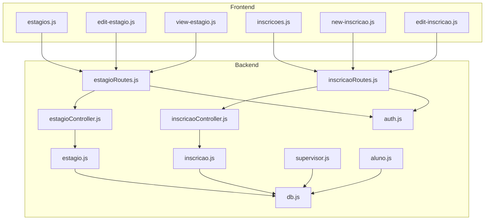
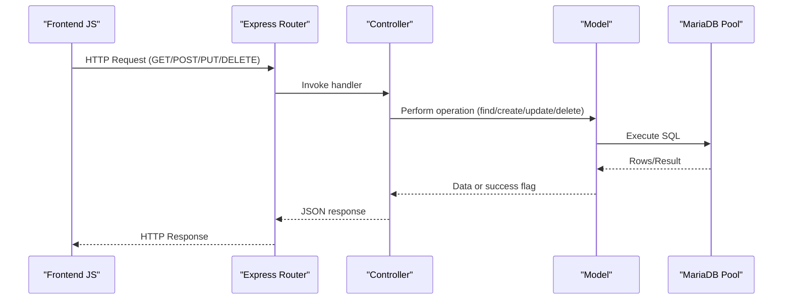
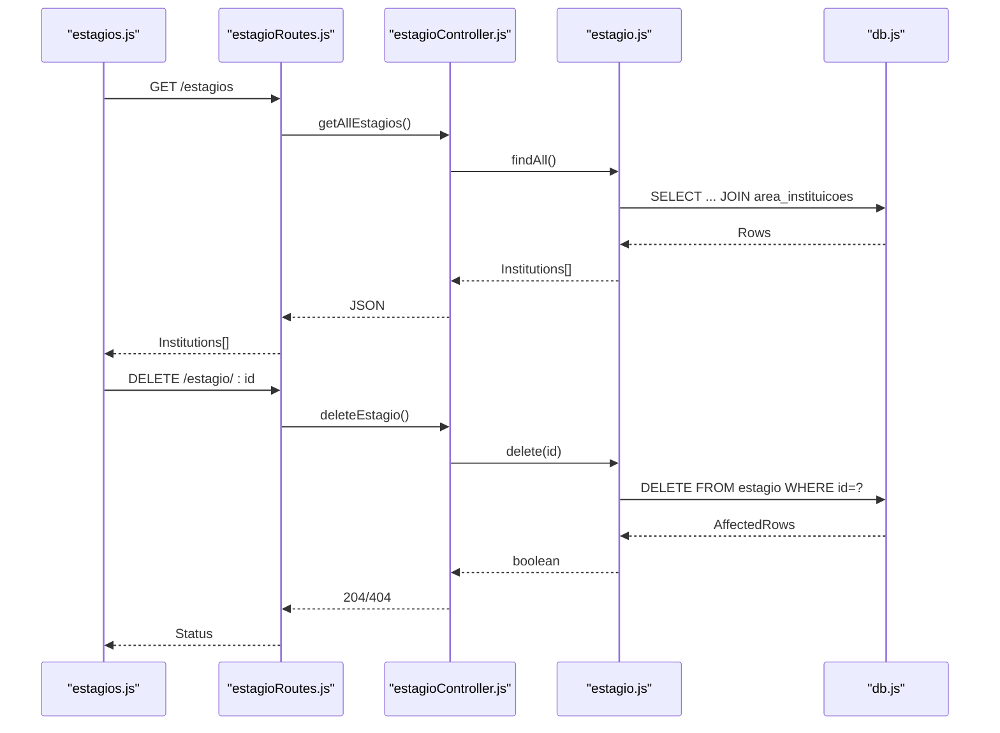
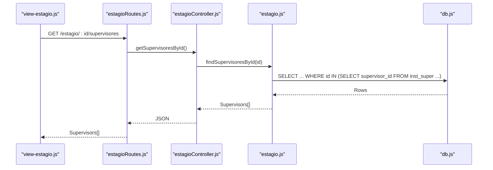
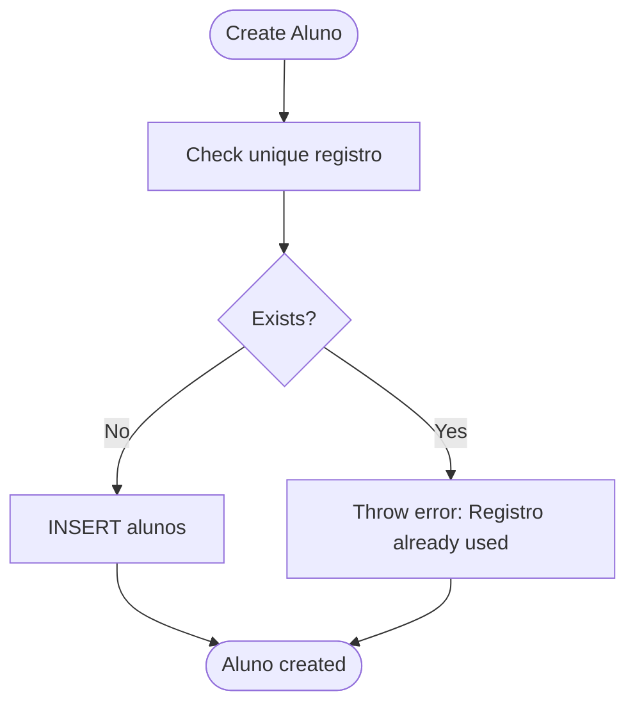
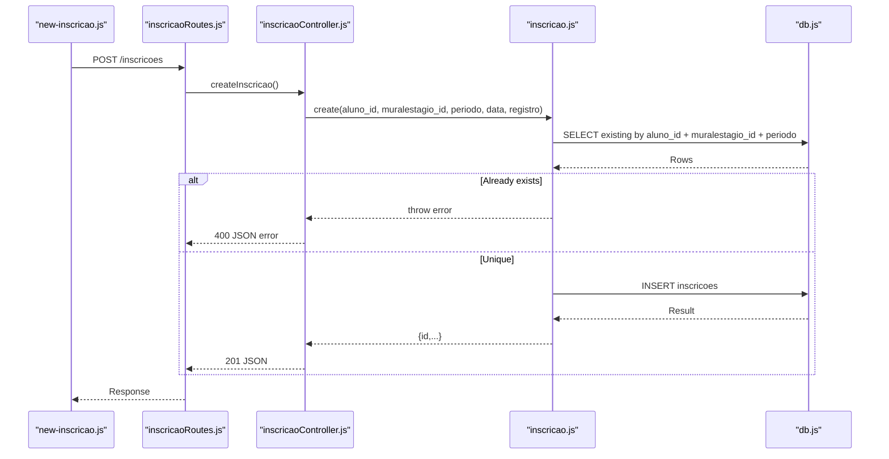
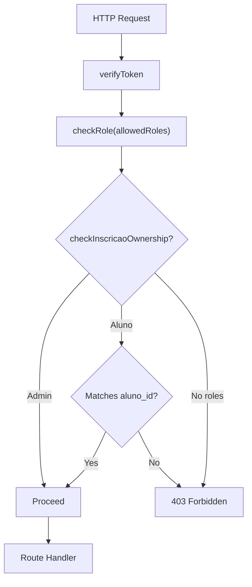
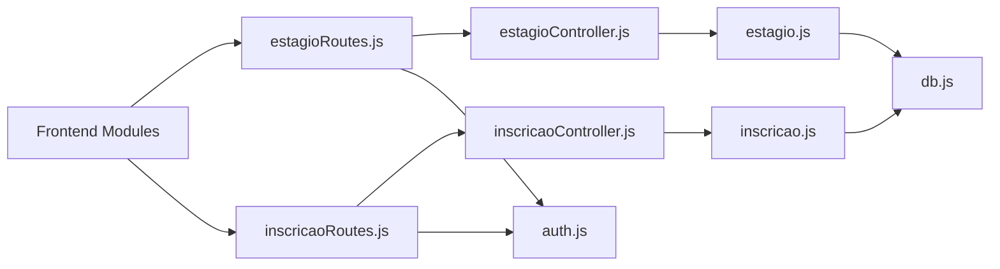

# Internship Management

<cite>
**Referenced Files in This Document**
- [src/models/estagio.js](file://src/models/estagio.js)
- [src/controllers/estagioController.js](file://src/controllers/estagioController.js)
- [src/routers/estagioRoutes.js](file://src/routers/estagioRoutes.js)
- [src/models/supervisor.js](file://src/models/supervisor.js)
- [src/models/aluno.js](file://src/models/aluno.js)
- [src/models/inscricao.js](file://src/models/inscricao.js)
- [src/controllers/inscricaoController.js](file://src/controllers/inscricaoController.js)
- [src/routers/inscricaoRoutes.js](file://src/routers/inscricaoRoutes.js)
- [src/middleware/auth.js](file://src/middleware/auth.js)
- [src/database/db.js](file://src/database/db.js)
- [public/estagios.js](file://public/estagios.js)
- [public/edit-estagio.js](file://public/edit-estagio.js)
- [public/view-estagio.js](file://public/view-estagio.js)
- [public/inscricoes.js](file://public/inscricoes.js)
- [public/new-inscricao.js](file://public/new-inscricao.js)
- [public/edit-inscricao.js](file://public/edit-inscricao.js)
</cite>

## Table of Contents
1. [Introduction](#introduction)
2. [Project Structure](#project-structure)
3. [Core Components](#core-components)
4. [Architecture Overview](#architecture-overview)
5. [Detailed Component Analysis](#detailed-component-analysis)
6. [Dependency Analysis](#dependency-analysis)
7. [Performance Considerations](#performance-considerations)
8. [Troubleshooting Guide](#troubleshooting-guide)
9. [Conclusion](#conclusion)
10. [Appendices](#appendices)

## Introduction
This document describes the Internship Management system covering the complete CRUD lifecycle for internship opportunities, student application processing, and practical training coordination. It explains controller implementation for validation, capacity management, duration tracking, and relationships among students, supervisors, and institutions. It also documents model-layer operations for database interactions, frontend integration via HTML templates and JavaScript, validation rules, workflow for approvals and status tracking, and performance considerations for concurrent operations.

## Project Structure
The system follows a layered architecture:
- Model layer: encapsulates database interactions for institutions (estágio), students (aluno), supervisors (supervisor), and applications (inscrição).
- Controller layer: exposes REST endpoints for CRUD operations and orchestrates business logic.
- Router layer: defines routes and applies middleware for authentication and authorization.
- Frontend: HTML pages and JavaScript modules integrate with backend APIs to present lists, forms, and views.

**Diagram sources**
- [src/routers/estagioRoutes.js](file://src/routers/estagioRoutes.js#L1-L20)
- [src/controllers/estagioController.js](file://src/controllers/estagioController.js#L1-L98)
- [src/models/estagio.js](file://src/models/estagio.js#L1-L66)
- [src/routers/inscricaoRoutes.js](file://src/routers/inscricaoRoutes.js#L1-L21)
- [src/controllers/inscricaoController.js](file://src/controllers/inscricaoController.js#L1-L114)
- [src/models/inscricao.js](file://src/models/inscricao.js#L1-L104)
- [src/models/supervisor.js](file://src/models/supervisor.js#L1-L77)
- [src/models/aluno.js](file://src/models/aluno.js#L1-L146)
- [src/middleware/auth.js](file://src/middleware/auth.js#L1-L137)
- [src/database/db.js](file://src/database/db.js#L1-L15)
- [public/estagios.js](file://public/estagios.js#L1-L46)
- [public/edit-estagio.js](file://public/edit-estagio.js#L1-L103)
- [public/view-estagio.js](file://public/view-estagio.js#L1-L158)
- [public/inscricoes.js](file://public/inscricoes.js#L1-L100)
- [public/new-inscricao.js](file://public/new-inscricao.js#L1-L160)
- [public/edit-inscricao.js](file://public/edit-inscricao.js#L1-L150)

**Section sources**
- [src/routers/estagioRoutes.js](file://src/routers/estagioRoutes.js#L1-L20)
- [src/routers/inscricaoRoutes.js](file://src/routers/inscricaoRoutes.js#L1-L21)
- [src/controllers/estagioController.js](file://src/controllers/estagioController.js#L1-L98)
- [src/controllers/inscricaoController.js](file://src/controllers/inscricaoController.js#L1-L114)
- [src/models/estagio.js](file://src/models/estagio.js#L1-L66)
- [src/models/inscricao.js](file://src/models/inscricao.js#L1-L104)
- [src/models/supervisor.js](file://src/models/supervisor.js#L1-L77)
- [src/models/aluno.js](file://src/models/aluno.js#L1-L146)
- [src/middleware/auth.js](file://src/middleware/auth.js#L1-L137)
- [src/database/db.js](file://src/database/db.js#L1-L15)
- [public/estagios.js](file://public/estagios.js#L1-L46)
- [public/edit-estagio.js](file://public/edit-estagio.js#L1-L103)
- [public/view-estagio.js](file://public/view-estagio.js#L1-L158)
- [public/inscricoes.js](file://public/inscricoes.js#L1-L100)
- [public/new-inscricao.js](file://public/new-inscricao.js#L1-L160)
- [public/edit-inscricao.js](file://public/edit-inscricao.js#L1-L150)

## Core Components
- Institution (Estágio) management:
  - CRUD endpoints for institutions offering internships.
  - Relationship queries for supervisors linked to an institution and institutional bulletin entries (mural).
- Student (Aluno) management:
  - Registration verification, profile retrieval, and association with estagiários and inscrições.
- Supervisor (Supervisor) management:
  - CRUD supervisors and linking/unlinking supervisors to institutions via junction table.
- Application (Inscrição) management:
  - CRUD applications against bulletin positions, with uniqueness checks per period and student.
- Authentication and authorization:
  - Token verification, role-based access control, ownership checks for inscriptions.

**Section sources**
- [src/models/estagio.js](file://src/models/estagio.js#L1-L66)
- [src/controllers/estagioController.js](file://src/controllers/estagioController.js#L1-L98)
- [src/routers/estagioRoutes.js](file://src/routers/estagioRoutes.js#L1-L20)
- [src/models/aluno.js](file://src/models/aluno.js#L1-L146)
- [src/models/supervisor.js](file://src/models/supervisor.js#L1-L77)
- [src/models/inscricao.js](file://src/models/inscricao.js#L1-L104)
- [src/controllers/inscricaoController.js](file://src/controllers/inscricaoController.js#L1-L114)
- [src/routers/inscricaoRoutes.js](file://src/routers/inscricaoRoutes.js#L1-L21)
- [src/middleware/auth.js](file://src/middleware/auth.js#L1-L137)

## Architecture Overview
The backend uses Express with route handlers delegating to controllers, which call models for database operations. Middleware enforces authentication and authorization. The frontend uses jQuery and DataTables to render lists and forms, consuming REST endpoints.

**Diagram sources**
- [src/routers/estagioRoutes.js](file://src/routers/estagioRoutes.js#L1-L20)
- [src/controllers/estagioController.js](file://src/controllers/estagioController.js#L1-L98)
- [src/models/estagio.js](file://src/models/estagio.js#L1-L66)
- [src/routers/inscricaoRoutes.js](file://src/routers/inscricaoRoutes.js#L1-L21)
- [src/controllers/inscricaoController.js](file://src/controllers/inscricaoController.js#L1-L114)
- [src/models/inscricao.js](file://src/models/inscricao.js#L1-L104)
- [src/database/db.js](file://src/database/db.js#L1-L15)

## Detailed Component Analysis

### Institution (Estágio) Management
- Responsibilities:
  - List all institutions with area name joins.
  - Retrieve a single institution by ID.
  - Create, update, and delete institutions.
  - Fetch supervisors associated with an institution via junction table.
  - Fetch bulletin entries (mural) for an institution.
- Validation and constraints:
  - Creation and update accept a set of fields including CNPJ, address, phone, and optional benefits and agreements.
  - No explicit duration or capacity fields are exposed in the institution model; capacity and duration are managed via bulletin entries.
- Frontend integration:
  - List view uses DataTables to render institutions and actions.
  - Edit view loads areas and submits create/update requests.
  - View page loads institution details, bulletin entries, and supervisors.

**Diagram sources**
- [public/estagios.js](file://public/estagios.js#L1-L46)
- [src/routers/estagioRoutes.js](file://src/routers/estagioRoutes.js#L1-L20)
- [src/controllers/estagioController.js](file://src/controllers/estagioController.js#L1-L98)
- [src/models/estagio.js](file://src/models/estagio.js#L1-L66)
- [src/database/db.js](file://src/database/db.js#L1-L15)

**Section sources**
- [src/models/estagio.js](file://src/models/estagio.js#L1-L66)
- [src/controllers/estagioController.js](file://src/controllers/estagioController.js#L1-L98)
- [src/routers/estagioRoutes.js](file://src/routers/estagioRoutes.js#L1-L20)
- [public/estagios.js](file://public/estagios.js#L1-L46)
- [public/edit-estagio.js](file://public/edit-estagio.js#L1-L103)
- [public/view-estagio.js](file://public/view-estagio.js#L1-L158)

### Supervisor Management
- Responsibilities:
  - CRUD supervisors.
  - Link/unlink supervisors to institutions via junction table.
  - List institutions associated with a supervisor.
- Constraints:
  - Deletion cascades removal of institution-supervisor relationships before deleting the supervisor.
- Frontend integration:
  - View page for an institution lists supervisors and supports navigation to supervisor records.

**Diagram sources**
- [public/view-estagio.js](file://public/view-estagio.js#L1-L158)
- [src/routers/estagioRoutes.js](file://src/routers/estagioRoutes.js#L1-L20)
- [src/controllers/estagioController.js](file://src/controllers/estagioController.js#L1-L98)
- [src/models/estagio.js](file://src/models/estagio.js#L1-L66)
- [src/database/db.js](file://src/database/db.js#L1-L15)

**Section sources**
- [src/models/supervisor.js](file://src/models/supervisor.js#L1-L77)
- [src/models/estagio.js](file://src/models/estagio.js#L43-L51)
- [public/view-estagio.js](file://public/view-estagio.js#L124-L157)

### Student (Aluno) Management
- Responsibilities:
  - Verify unique registration number during creation.
  - Retrieve student profiles with optional estagiário and inscrição associations.
  - Enforce referential integrity on deletion (cannot delete if estagiário or inscrição exists).
- Frontend integration:
  - Dropdowns in application forms populate student choices and auto-fill registration numbers.

**Diagram sources**
- [src/models/aluno.js](file://src/models/aluno.js#L6-L20)

**Section sources**
- [src/models/aluno.js](file://src/models/aluno.js#L1-L146)
- [public/new-inscricao.js](file://public/new-inscricao.js#L76-L89)
- [public/edit-inscricao.js](file://public/edit-inscricao.js#L30-L36)

### Application (Inscrição) Management
- Responsibilities:
  - CRUD applications against bulletin positions.
  - Uniqueness constraint: a student cannot apply twice for the same bulletin position in the same period.
  - Filtering by period and retrieving distinct periods.
- Authorization:
  - Routes enforce roles and ownership for updates/deletes.
- Frontend integration:
  - Lists applications with filtering by period.
  - Forms to create and edit applications, auto-filling student and period data.

**Diagram sources**
- [public/new-inscricao.js](file://public/new-inscricao.js#L108-L158)
- [src/routers/inscricaoRoutes.js](file://src/routers/inscricaoRoutes.js#L1-L21)
- [src/controllers/inscricaoController.js](file://src/controllers/inscricaoController.js#L66-L79)
- [src/models/inscricao.js](file://src/models/inscricao.js#L58-L74)
- [src/database/db.js](file://src/database/db.js#L1-L15)

**Section sources**
- [src/models/inscricao.js](file://src/models/inscricao.js#L1-L104)
- [src/controllers/inscricaoController.js](file://src/controllers/inscricaoController.js#L1-L114)
- [src/routers/inscricaoRoutes.js](file://src/routers/inscricaoRoutes.js#L1-L21)
- [src/middleware/auth.js](file://src/middleware/auth.js#L100-L136)
- [public/inscricoes.js](file://public/inscricoes.js#L1-L100)
- [public/new-inscricao.js](file://public/new-inscricao.js#L1-L160)
- [public/edit-inscricao.js](file://public/edit-inscricao.js#L1-L150)

### Authentication and Authorization
- Token verification middleware decodes JWT and attaches user to request.
- Role-based access control restricts routes to admin and aluno where applicable.
- Ownership checks ensure alumnos can only manage their own inscrições.

**Diagram sources**
- [src/middleware/auth.js](file://src/middleware/auth.js#L6-L29)
- [src/middleware/auth.js](file://src/middleware/auth.js#L32-L48)
- [src/middleware/auth.js](file://src/middleware/auth.js#L100-L136)

**Section sources**
- [src/middleware/auth.js](file://src/middleware/auth.js#L1-L137)
- [src/routers/inscricaoRoutes.js](file://src/routers/inscricaoRoutes.js#L4-L18)
- [src/routers/estagioRoutes.js](file://src/routers/estagioRoutes.js#L8-L9)

## Dependency Analysis
- Controllers depend on models for data access.
- Models depend on the database pool for SQL execution.
- Routers depend on controllers and middleware.
- Frontend modules depend on router endpoints and shared auth utilities.

**Diagram sources**
- [src/routers/estagioRoutes.js](file://src/routers/estagioRoutes.js#L1-L20)
- [src/routers/inscricaoRoutes.js](file://src/routers/inscricaoRoutes.js#L1-L21)
- [src/controllers/estagioController.js](file://src/controllers/estagioController.js#L1-L98)
- [src/controllers/inscricaoController.js](file://src/controllers/inscricaoController.js#L1-L114)
- [src/models/estagio.js](file://src/models/estagio.js#L1-L66)
- [src/models/inscricao.js](file://src/models/inscricao.js#L1-L104)
- [src/middleware/auth.js](file://src/middleware/auth.js#L1-L137)
- [src/database/db.js](file://src/database/db.js#L1-L15)
- [public/estagios.js](file://public/estagios.js#L1-L46)
- [public/inscricoes.js](file://public/inscricoes.js#L1-L100)

**Section sources**
- [src/models/estagio.js](file://src/models/estagio.js#L1-L66)
- [src/models/inscricao.js](file://src/models/inscricao.js#L1-L104)
- [src/controllers/estagioController.js](file://src/controllers/estagioController.js#L1-L98)
- [src/controllers/inscricaoController.js](file://src/controllers/inscricaoController.js#L1-L114)
- [src/routers/estagioRoutes.js](file://src/routers/estagioRoutes.js#L1-L20)
- [src/routers/inscricaoRoutes.js](file://src/routers/inscricaoRoutes.js#L1-L21)
- [src/middleware/auth.js](file://src/middleware/auth.js#L1-L137)
- [src/database/db.js](file://src/database/db.js#L1-L15)

## Performance Considerations
- Database pooling:
  - Connection limit and queue behavior are configurable via environment variables. Tune pool size according to expected concurrency.
- Query efficiency:
  - Prefer indexed columns in WHERE clauses (IDs, CNPJ, registration).
  - Use joins judiciously; the institution listing already uses a LEFT JOIN with area name.
- Frontend pagination and filtering:
  - DataTables handles client-side pagination; consider server-side pagination for very large datasets.
- Middleware overhead:
  - Token verification and role checks occur on each protected route; cache minimal metadata if needed.
- Concurrency:
  - Application uniqueness constraints prevent race conditions at the database level; ensure proper error handling on the client.

[No sources needed since this section provides general guidance]

## Troubleshooting Guide
- Authentication failures:
  - Missing or invalid tokens result in 401 responses; verify JWT secret and expiration.
- Authorization failures:
  - Non-admin users attempting admin-only routes receive 403; confirm user role and entidade_id mapping.
- Application creation errors:
  - Duplicate application per period triggers a 400 with a specific message; handle gracefully in forms.
- Database connectivity:
  - Pool configuration issues can cause timeouts; verify host, user, password, database, and pool limits.
- Frontend navigation:
  - Some pages redirect to login if token is missing or role insufficient; ensure auth-utils are loaded and used consistently.

**Section sources**
- [src/middleware/auth.js](file://src/middleware/auth.js#L6-L29)
- [src/middleware/auth.js](file://src/middleware/auth.js#L32-L48)
- [src/middleware/auth.js](file://src/middleware/auth.js#L100-L136)
- [src/controllers/inscricaoController.js](file://src/controllers/inscricaoController.js#L72-L78)
- [src/database/db.js](file://src/database/db.js#L5-L13)
- [public/estagios.js](file://public/estagios.js#L6-L9)
- [public/inscricoes.js](file://public/inscricoes.js#L6-L9)

## Conclusion
The Internship Management system provides a clear separation of concerns across model, controller, router, and frontend layers. It supports robust CRUD operations for institutions and applications, enforces authorization and ownership policies, and integrates with bulletin data to coordinate practical training. Extending capacity and duration controls would involve adding fields to the bulletin model and enforcing constraints in controllers and models.

[No sources needed since this section summarizes without analyzing specific files]

## Appendices

### API Endpoints Summary
- Institutions (Estágio)
  - GET /estagios
  - GET /estagio/:id
  - POST /estagio
  - PUT /estagio/:id
  - DELETE /estagio/:id
  - GET /estagio/:id/supervisores
  - GET /estagio/:id/mural
- Applications (Inscrições)
  - GET /inscricoes?periodo={periodo}
  - GET /inscricoes/periodos
  - GET /inscricoes/:id
  - GET /inscricoes/:aluno_id/:muralestagio_id
  - POST /inscricoes
  - PUT /inscricoes/:id
  - DELETE /inscricoes/:id

**Section sources**
- [src/routers/estagioRoutes.js](file://src/routers/estagioRoutes.js#L10-L17)
- [src/routers/inscricaoRoutes.js](file://src/routers/inscricaoRoutes.js#L11-L18)