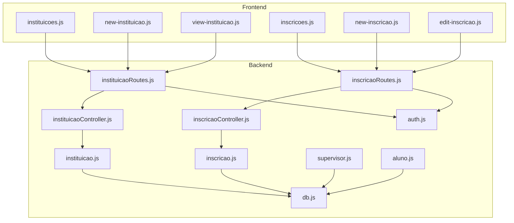
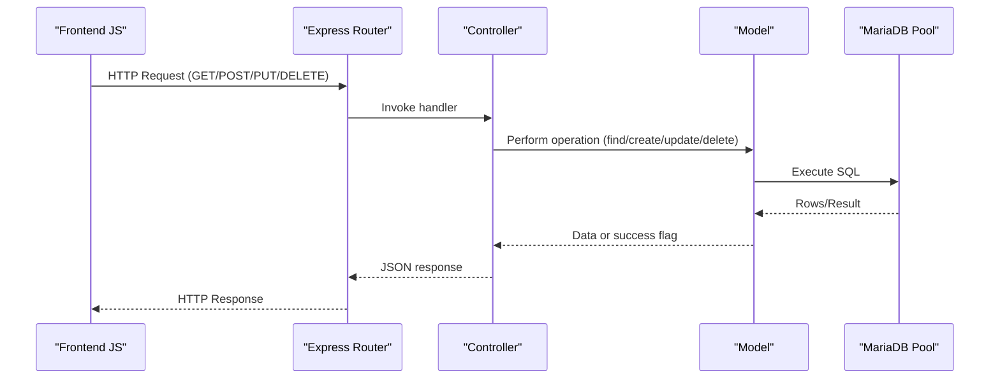
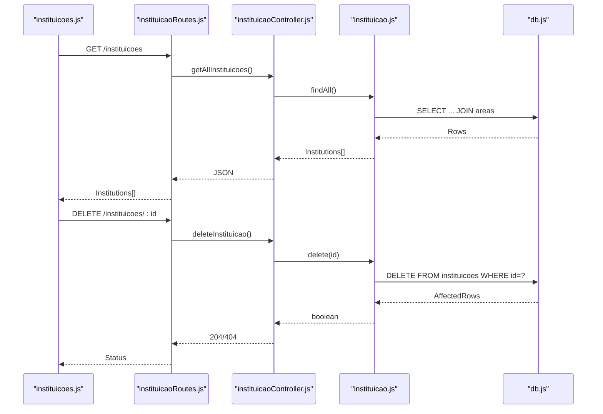
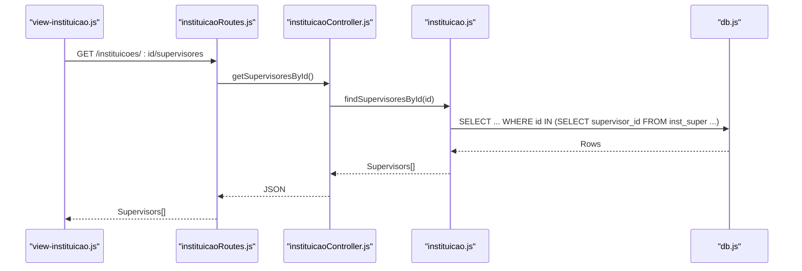
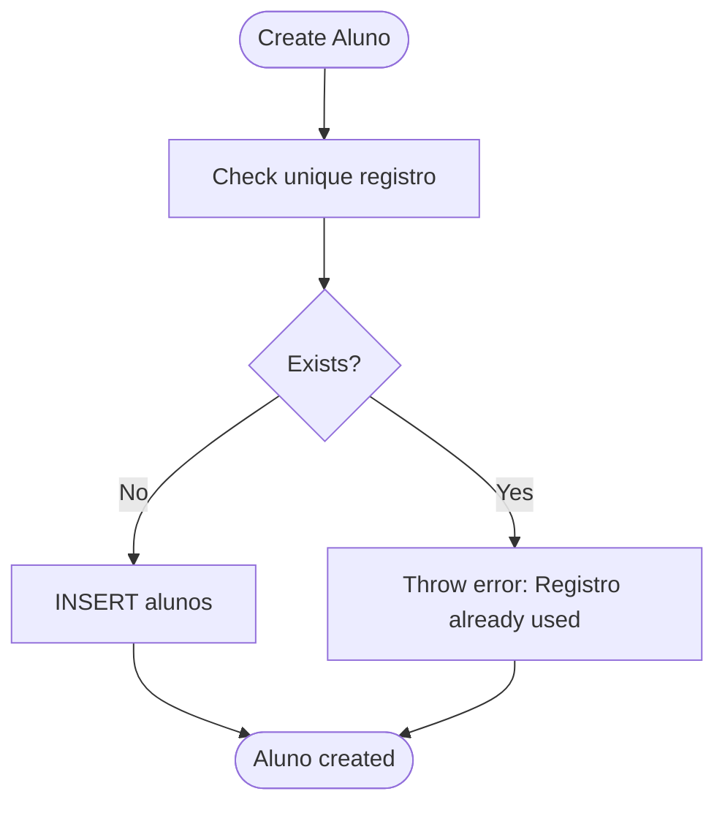
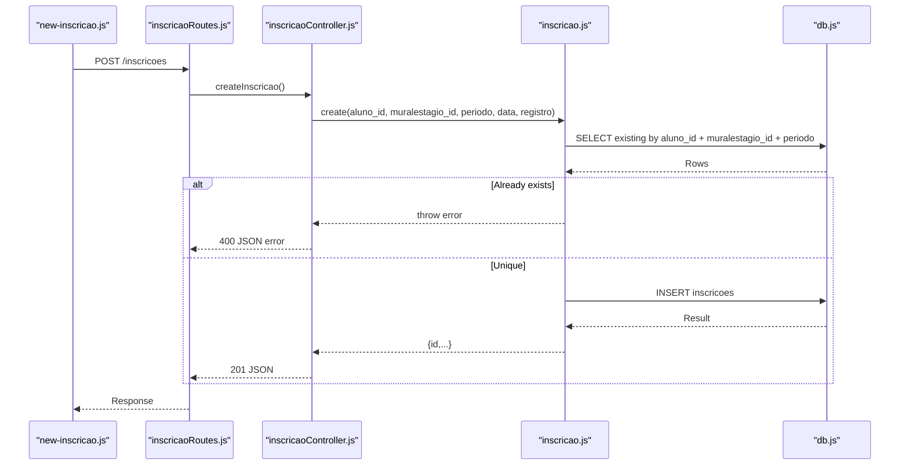
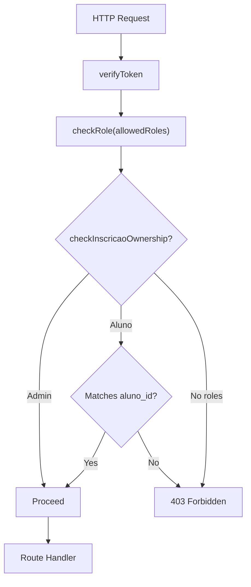
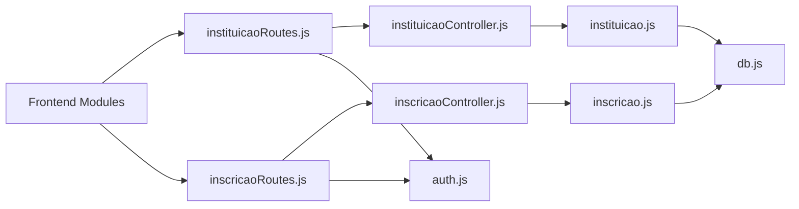

# Institutional Management System

<cite>
**Referenced Files in This Document**
- [src/models/instituicao.js](file://src/models/instituicao.js)
- [src/controllers/instituicaoController.js](file://src/controllers/instituicaoController.js)
- [src/routers/instituicaoRoutes.js](file://src/routers/instituicaoRoutes.js)
- [src/models/supervisor.js](file://src/models/supervisor.js)
- [src/models/aluno.js](file://src/models/aluno.js)
- [src/models/inscricao.js](file://src/models/inscricao.js)
- [src/controllers/inscricaoController.js](file://src/controllers/inscricaoController.js)
- [src/routers/inscricaoRoutes.js](file://src/routers/inscricaoRoutes.js)
- [src/middleware/auth.js](file://src/middleware/auth.js)
- [src/database/db.js](file://src/database/db.js)
- [public/instituicoes.js](file://public/instituicoes.js)
- [public/new-instituicao.js](file://public/new-instituicao.js)
- [public/view-instituicao.js](file://public/view-instituicao.js)
- [public/inscricoes.js](file://public/inscricoes.js)
- [public/new-inscricao.js](file://public/new-inscricao.js)
- [public/edit-inscricao.js](file://public/edit-inscricao.js)
</cite>

## Update Summary
**Changes Made**
- Updated all references from "estagio" (internship) to "instituicao" (institution) throughout the documentation
- Replaced internship-focused terminology with institutional management terminology
- Updated API endpoint references to use "/instituicoes" instead of "/estagios"
- Modified all frontend references to use institutional management interfaces
- Updated database model references to reflect institutional data structure
- Maintained the same conceptual framework while transitioning to institutional focus

## Table of Contents
1. [Introduction](#introduction)
2. [Project Structure](#project-structure)
3. [Core Components](#core-components)
4. [Architecture Overview](#architecture-overview)
5. [Detailed Component Analysis](#detailed-component-analysis)
6. [Dependency Analysis](#dependency-analysis)
7. [Performance Considerations](#performance-considerations)
8. [Troubleshooting Guide](#troubleshooting-guide)
9. [Conclusion](#conclusion)
10. [Appendices](#appendices)

## Introduction
This document describes the Institutional Management system covering the complete CRUD lifecycle for institutional placements, student application processing, and practical training coordination. The system has transitioned from an estagio (internship) focused architecture to an instituicao (institution) focused system. It explains controller implementation for validation, capacity management, duration tracking, and relationships among students, supervisors, and institutions. It also documents model-layer operations for database interactions, frontend integration via HTML templates and JavaScript, validation rules, workflow for approvals and status tracking, and performance considerations for concurrent operations.

## Project Structure
The system follows a layered architecture:
- Model layer: encapsulates database interactions for institutions (instituicao), students (aluno), supervisors (supervisor), and applications (inscricao).
- Controller layer: exposes REST endpoints for CRUD operations and orchestrates business logic.
- Router layer: defines routes and applies middleware for authentication and authorization.
- Frontend: HTML pages and JavaScript modules integrate with backend APIs to present lists, forms, and views.

```mermaid
graph TB
subgraph "Frontend"
FE_Instituicoes["instituicoes.js"]
FE_NewInstituicao["new-instituicao.js"]
FE_ViewInstituicao["view-instituicao.js"]
FE_Inscricoes["inscricoes.js"]
FE_NewInscricao["new-inscricao.js"]
FE_EditInscricao["edit-inscricao.js"]
end
subgraph "Backend"
R_Instituicao["instituicaoRoutes.js"]
C_Instituicao["instituicaoController.js"]
M_Instituicao["instituicao.js"]
R_Inscricao["inscricaoRoutes.js"]
C_Inscricao["inscricaoController.js"]
M_Inscricao["inscricao.js"]
M_Supervisor["supervisor.js"]
M_Aluno["aluno.js"]
MW_Auth["auth.js"]
DB["db.js"]
end
FE_Instituicoes --> R_Instituicao
FE_NewInstituicao --> R_Instituicao
FE_ViewInstituicao --> R_Instituicao
FE_Inscricoes --> R_Inscricao
FE_NewInscricao --> R_Inscricao
FE_EditInscricao --> R_Inscricao
R_Instituicao --> C_Instituicao
R_Inscricao --> C_Inscricao
C_Instituicao --> M_Instituicao
C_Inscricao --> M_Inscricao
M_Instituicao --> DB
M_Inscricao --> DB
M_Supervisor --> DB
M_Aluno --> DB
R_Inscricao --> MW_Auth
R_Instituicao --> MW_Auth
```

**Diagram sources**
- [src/routers/instituicaoRoutes.js:1-21](file://src/routers/instituicaoRoutes.js#L1-L21)
- [src/controllers/instituicaoController.js:1-95](file://src/controllers/instituicaoController.js#L1-L95)
- [src/models/instituicao.js:1-66](file://src/models/instituicao.js#L1-L66)
- [src/routers/inscricaoRoutes.js:1-21](file://src/routers/inscricaoRoutes.js#L1-L21)
- [src/controllers/inscricaoController.js:1-114](file://src/controllers/inscricaoController.js#L1-L114)
- [src/models/inscricao.js:1-104](file://src/models/inscricao.js#L1-L104)
- [src/models/supervisor.js:1-77](file://src/models/supervisor.js#L1-L77)
- [src/models/aluno.js:1-146](file://src/models/aluno.js#L1-L146)
- [src/middleware/auth.js:1-137](file://src/middleware/auth.js#L1-L137)
- [src/database/db.js:1-15](file://src/database/db.js#L1-L15)
- [public/instituicoes.js:1-69](file://public/instituicoes.js#L1-L69)
- [public/new-instituicao.js:1-84](file://public/new-instituicao.js#L1-L84)
- [public/view-instituicao.js:1-191](file://public/view-instituicao.js#L1-L191)
- [public/inscricoes.js:1-100](file://public/inscricoes.js#L1-L100)
- [public/new-inscricao.js:1-160](file://public/new-inscricao.js#L1-L160)
- [public/edit-inscricao.js:1-150](file://public/edit-inscricao.js#L1-L150)

**Section sources**
- [src/routers/instituicaoRoutes.js:1-21](file://src/routers/instituicaoRoutes.js#L1-L21)
- [src/routers/inscricaoRoutes.js:1-21](file://src/routers/inscricaoRoutes.js#L1-L21)
- [src/controllers/instituicaoController.js:1-95](file://src/controllers/instituicaoController.js#L1-L95)
- [src/controllers/inscricaoController.js:1-114](file://src/controllers/inscricaoController.js#L1-L114)
- [src/models/instituicao.js:1-66](file://src/models/instituicao.js#L1-L66)
- [src/models/inscricao.js:1-104](file://src/models/inscricao.js#L1-L104)
- [src/models/supervisor.js:1-77](file://src/models/supervisor.js#L1-L77)
- [src/models/aluno.js:1-146](file://src/models/aluno.js#L1-L146)
- [src/middleware/auth.js:1-137](file://src/middleware/auth.js#L1-L137)
- [src/database/db.js:1-15](file://src/database/db.js#L1-L15)
- [public/instituicoes.js:1-69](file://public/instituicoes.js#L1-L69)
- [public/new-instituicao.js:1-84](file://public/new-instituicao.js#L1-L84)
- [public/view-instituicao.js:1-191](file://public/view-instituicao.js#L1-L191)
- [public/inscricoes.js:1-100](file://public/inscricoes.js#L1-L100)
- [public/new-inscricao.js:1-160](file://public/new-inscricao.js#L1-L160)
- [public/edit-inscricao.js:1-150](file://public/edit-inscricao.js#L1-L150)

## Core Components
- Institution (Instituicao) management:
  - CRUD endpoints for institutions offering practical training positions.
  - Relationship queries for supervisors linked to an institution and institutional bulletin entries (mural).
- Student (Aluno) management:
  - Registration verification, profile retrieval, and association with estagiarios and inscricoes.
- Supervisor (Supervisor) management:
  - CRUD supervisors and linking/unlinking supervisors to institutions via junction table.
- Application (Inscricao) management:
  - CRUD applications against bulletin positions, with uniqueness checks per period and student.
- Authentication and authorization:
  - Token verification, role-based access control, ownership checks for inscricoes.

**Section sources**
- [src/models/instituicao.js:1-66](file://src/models/instituicao.js#L1-L66)
- [src/controllers/instituicaoController.js:1-95](file://src/controllers/instituicaoController.js#L1-L95)
- [src/routers/instituicaoRoutes.js:1-21](file://src/routers/instituicaoRoutes.js#L1-L21)
- [src/models/aluno.js:1-146](file://src/models/aluno.js#L1-L146)
- [src/models/supervisor.js:1-77](file://src/models/supervisor.js#L1-L77)
- [src/models/inscricao.js:1-104](file://src/models/inscricao.js#L1-L104)
- [src/controllers/inscricaoController.js:1-114](file://src/controllers/inscricaoController.js#L1-L114)
- [src/routers/inscricaoRoutes.js:1-21](file://src/routers/inscricaoRoutes.js#L1-L21)
- [src/middleware/auth.js:1-137](file://src/middleware/auth.js#L1-L137)

## Architecture Overview
The backend uses Express with route handlers delegating to controllers, which call models for database operations. Middleware enforces authentication and authorization. The frontend uses jQuery and DataTables to render lists and forms, consuming REST endpoints.

```mermaid
sequenceDiagram
participant FE as "Frontend JS"
participant Router as "Express Router"
participant Ctrl as "Controller"
participant Model as "Model"
participant DB as "MariaDB Pool"
FE->>Router : HTTP Request (GET/POST/PUT/DELETE)
Router->>Ctrl : Invoke handler
Ctrl->>Model : Perform operation (find/create/update/delete)
Model->>DB : Execute SQL
DB-->>Model : Rows/Result
Model-->>Ctrl : Data or success flag
Ctrl-->>Router : JSON response
Router-->>FE : HTTP Response
```

**Diagram sources**
- [src/routers/instituicaoRoutes.js:1-21](file://src/routers/instituicaoRoutes.js#L1-L21)
- [src/controllers/instituicaoController.js:1-95](file://src/controllers/instituicaoController.js#L1-L95)
- [src/models/instituicao.js:1-66](file://src/models/instituicao.js#L1-L66)
- [src/routers/inscricaoRoutes.js:1-21](file://src/routers/inscricaoRoutes.js#L1-L21)
- [src/controllers/inscricaoController.js:1-114](file://src/controllers/inscricaoController.js#L1-L114)
- [src/models/inscricao.js:1-104](file://src/models/inscricao.js#L1-L104)
- [src/database/db.js:1-15](file://src/database/db.js#L1-L15)

## Detailed Component Analysis

### Institution (Instituicao) Management
- Responsibilities:
  - List all institutions with area name joins.
  - Retrieve a single institution by ID.
  - Create, update, and delete institutions.
  - Fetch supervisors associated with an institution via junction table.
  - Fetch bulletin entries (mural) for an institution.
- Validation and constraints:
  - Creation and update accept a set of fields including CNPJ, address, phone, and optional benefits and agreements.
  - No explicit duration or capacity fields are exposed in the institution model; capacity and duration are managed via bulletin entries.
- Frontend integration:
  - List view uses DataTables to render institutions and actions.
  - Edit view loads areas and submits create/update requests.
  - View page loads institution details, bulletin entries, and supervisors.

```mermaid
sequenceDiagram
participant FE_List as "instituicoes.js"
participant Router as "instituicaoRoutes.js"
participant Ctrl as "instituicaoController.js"
participant Model as "instituicao.js"
participant DB as "db.js"
FE_List->>Router : GET /instituicoes
Router->>Ctrl : getAllInstituicoes()
Ctrl->>Model : findAll()
Model->>DB : SELECT ... JOIN areas
DB-->>Model : Rows
Model-->>Ctrl : Institutions[]
Ctrl-->>Router : JSON
Router-->>FE_List : Institutions[]
FE_List->>Router : DELETE /instituicoes/ : id
Router->>Ctrl : deleteInstituicao()
Ctrl->>Model : delete(id)
Model->>DB : DELETE FROM instituicoes WHERE id=?
DB-->>Model : AffectedRows
Model-->>Ctrl : boolean
Ctrl-->>Router : 204/404
Router-->>FE_List : Status
```

**Diagram sources**
- [public/instituicoes.js:1-69](file://public/instituicoes.js#L1-L69)
- [src/routers/instituicaoRoutes.js:1-21](file://src/routers/instituicaoRoutes.js#L1-L21)
- [src/controllers/instituicaoController.js:1-95](file://src/controllers/instituicaoController.js#L1-L95)
- [src/models/instituicao.js:1-66](file://src/models/instituicao.js#L1-L66)
- [src/database/db.js:1-15](file://src/database/db.js#L1-L15)

**Section sources**
- [src/models/instituicao.js:1-66](file://src/models/instituicao.js#L1-L66)
- [src/controllers/instituicaoController.js:1-95](file://src/controllers/instituicaoController.js#L1-L95)
- [src/routers/instituicaoRoutes.js:1-21](file://src/routers/instituicaoRoutes.js#L1-L21)
- [public/instituicoes.js:1-69](file://public/instituicoes.js#L1-L69)
- [public/new-instituicao.js:1-84](file://public/new-instituicao.js#L1-L84)
- [public/view-instituicao.js:1-191](file://public/view-instituicao.js#L1-L191)

### Supervisor Management
- Responsibilities:
  - CRUD supervisors.
  - Link/unlink supervisors to institutions via junction table.
  - List institutions associated with a supervisor.
- Constraints:
  - Deletion cascades removal of institution-supervisor relationships before deleting the supervisor.
- Frontend integration:
  - View page for an institution lists supervisors and supports navigation to supervisor records.

```mermaid
sequenceDiagram
participant FE_View as "view-instituicao.js"
participant Router as "instituicaoRoutes.js"
participant Ctrl as "instituicaoController.js"
participant Model as "instituicao.js"
participant DB as "db.js"
FE_View->>Router : GET /instituicoes/ : id/supervisores
Router->>Ctrl : getSupervisoresById()
Ctrl->>Model : findSupervisoresById(id)
Model->>DB : SELECT ... WHERE id IN (SELECT supervisor_id FROM inst_super ...)
DB-->>Model : Rows
Model-->>Ctrl : Supervisors[]
Ctrl-->>Router : JSON
Router-->>FE_View : Supervisors[]
```

**Diagram sources**
- [public/view-instituicao.js:1-191](file://public/view-instituicao.js#L1-L191)
- [src/routers/instituicaoRoutes.js:1-21](file://src/routers/instituicaoRoutes.js#L1-L21)
- [src/controllers/instituicaoController.js:1-95](file://src/controllers/instituicaoController.js#L1-L95)
- [src/models/instituicao.js:1-66](file://src/models/instituicao.js#L1-L66)
- [src/database/db.js:1-15](file://src/database/db.js#L1-L15)

**Section sources**
- [src/models/supervisor.js:1-77](file://src/models/supervisor.js#L1-L77)
- [src/models/instituicao.js:43-51](file://src/models/instituicao.js#L43-L51)
- [public/view-instituicao.js:136-169](file://public/view-instituicao.js#L136-L169)

### Student (Aluno) Management
- Responsibilities:
  - Verify unique registration number during creation.
  - Retrieve student profiles with optional estagiario and inscricao associations.
  - Enforce referential integrity on deletion (cannot delete if estagiario or inscricao exists).
- Frontend integration:
  - Dropdowns in application forms populate student choices and auto-fill registration numbers.

```mermaid
flowchart TD
Start(["Create Aluno"]) --> CheckReg["Check unique registro"]
CheckReg --> Exists{"Exists?"}
Exists --> |Yes| Error["Throw error: Registro already used"]
Exists --> |No| Insert["INSERT alunos"]
Insert --> Done(["Aluno created"])
Error --> Done
```

**Diagram sources**
- [src/models/aluno.js:6-20](file://src/models/aluno.js#L6-L20)

**Section sources**
- [src/models/aluno.js:1-146](file://src/models/aluno.js#L1-L146)
- [public/new-inscricao.js:76-89](file://public/new-inscricao.js#L76-L89)
- [public/edit-inscricao.js:30-36](file://public/edit-inscricao.js#L30-L36)

### Application (Inscricao) Management
- Responsibilities:
  - CRUD applications against bulletin positions.
  - Uniqueness constraint: a student cannot apply twice for the same bulletin position in the same period.
  - Filtering by period and retrieving distinct periods.
- Authorization:
  - Routes enforce roles and ownership for updates/deletes.
- Frontend integration:
  - Lists applications with filtering by period.
  - Forms to create and edit applications, auto-filling student and period data.

```mermaid
sequenceDiagram
participant FE_New as "new-inscricao.js"
participant Router as "inscricaoRoutes.js"
participant Ctrl as "inscricaoController.js"
participant Model as "inscricao.js"
participant DB as "db.js"
FE_New->>Router : POST /inscricoes
Router->>Ctrl : createInscricao()
Ctrl->>Model : create(aluno_id, muralestagio_id, periodo, data, registro)
Model->>DB : SELECT existing by aluno_id + muralestagio_id + periodo
DB-->>Model : Rows
alt Already exists
Model-->>Ctrl : throw error
Ctrl-->>Router : 400 JSON error
else Unique
Model->>DB : INSERT inscricoes
DB-->>Model : Result
Model-->>Ctrl : {id,...}
Ctrl-->>Router : 201 JSON
end
Router-->>FE_New : Response
```

**Diagram sources**
- [public/new-inscricao.js:108-158](file://public/new-inscricao.js#L108-L158)
- [src/routers/inscricaoRoutes.js:1-21](file://src/routers/inscricaoRoutes.js#L1-L21)
- [src/controllers/inscricaoController.js:66-79](file://src/controllers/inscricaoController.js#L66-L79)
- [src/models/inscricao.js:58-74](file://src/models/inscricao.js#L58-L74)
- [src/database/db.js:1-15](file://src/database/db.js#L1-L15)

**Section sources**
- [src/models/inscricao.js:1-104](file://src/models/inscricao.js#L1-L104)
- [src/controllers/inscricaoController.js:1-114](file://src/controllers/inscricaoController.js#L1-L114)
- [src/routers/inscricaoRoutes.js:1-21](file://src/routers/inscricaoRoutes.js#L1-L21)
- [src/middleware/auth.js:100-136](file://src/middleware/auth.js#L100-L136)
- [public/inscricoes.js:1-100](file://public/inscricoes.js#L1-L100)
- [public/new-inscricao.js:1-160](file://public/new-inscricao.js#L1-L160)
- [public/edit-inscricao.js:1-150](file://public/edit-inscricao.js#L1-L150)

### Authentication and Authorization
- Token verification middleware decodes JWT and attaches user to request.
- Role-based access control restricts routes to admin and aluno where applicable.
- Ownership checks ensure alunos can only manage their own inscricoes.

```mermaid
flowchart TD
Req["HTTP Request"] --> Auth["verifyToken"]
Auth --> Roles["checkRole(allowedRoles)"]
Roles --> Owner{"checkInscricaoOwnership?"}
Owner --> |Admin| Next["Proceed"]
Owner --> |Aluno| Match{"Matches aluno_id?"}
Match --> |Yes| Next
Match --> |No| Deny["403 Forbidden"]
Owner --> |No roles| Deny
Next --> Handler["Route Handler"]
```

**Diagram sources**
- [src/middleware/auth.js:6-29](file://src/middleware/auth.js#L6-L29)
- [src/middleware/auth.js:32-48](file://src/middleware/auth.js#L32-L48)
- [src/middleware/auth.js:100-136](file://src/middleware/auth.js#L100-L136)

**Section sources**
- [src/middleware/auth.js:1-137](file://src/middleware/auth.js#L1-L137)
- [src/routers/inscricaoRoutes.js:4-18](file://src/routers/inscricaoRoutes.js#L4-L18)
- [src/routers/instituicaoRoutes.js:8-9](file://src/routers/instituicaoRoutes.js#L8-L9)

## Dependency Analysis
- Controllers depend on models for data access.
- Models depend on the database pool for SQL execution.
- Routers depend on controllers and middleware.
- Frontend modules depend on router endpoints and shared auth utilities.

```mermaid
graph LR
FE["Frontend Modules"] --> R_I["instituicaoRoutes.js"]
FE --> R_N["inscricaoRoutes.js"]
R_I --> C_I["instituicaoController.js"]
R_N --> C_N["inscricaoController.js"]
C_I --> M_I["instituicao.js"]
C_N --> M_N["inscricao.js"]
M_I --> DB["db.js"]
M_N --> DB
R_N --> MW["auth.js"]
R_I --> MW
```

**Diagram sources**
- [src/routers/instituicaoRoutes.js:1-21](file://src/routers/instituicaoRoutes.js#L1-L21)
- [src/routers/inscricaoRoutes.js:1-21](file://src/routers/inscricaoRoutes.js#L1-L21)
- [src/controllers/instituicaoController.js:1-95](file://src/controllers/instituicaoController.js#L1-L95)
- [src/controllers/inscricaoController.js:1-114](file://src/controllers/inscricaoController.js#L1-L114)
- [src/models/instituicao.js:1-66](file://src/models/instituicao.js#L1-L66)
- [src/models/inscricao.js:1-104](file://src/models/inscricao.js#L1-L104)
- [src/middleware/auth.js:1-137](file://src/middleware/auth.js#L1-L137)
- [src/database/db.js:1-15](file://src/database/db.js#L1-L15)
- [public/instituicoes.js:1-69](file://public/instituicoes.js#L1-L69)
- [public/inscricoes.js:1-100](file://public/inscricoes.js#L1-L100)

**Section sources**
- [src/models/instituicao.js:1-66](file://src/models/instituicao.js#L1-L66)
- [src/models/inscricao.js:1-104](file://src/models/inscricao.js#L1-L104)
- [src/controllers/instituicaoController.js:1-95](file://src/controllers/instituicaoController.js#L1-L95)
- [src/controllers/inscricaoController.js:1-114](file://src/controllers/inscricaoController.js#L1-L114)
- [src/routers/instituicaoRoutes.js:1-21](file://src/routers/instituicaoRoutes.js#L1-L21)
- [src/routers/inscricaoRoutes.js:1-21](file://src/routers/inscricaoRoutes.js#L1-L21)
- [src/middleware/auth.js:1-137](file://src/middleware/auth.js#L1-L137)
- [src/database/db.js:1-15](file://src/database/db.js#L1-L15)

## Performance Considerations
- Database pooling:
  - Connection limit and queue behavior are configurable via environment variables. Tune pool size according to expected concurrency.
- Query efficiency:
  - Prefer indexed columns in WHERE clauses (IDs, CNPJ, registration).
  - Use joins judiciously; the institution listing already uses a LEFT JOIN with area name.
- Frontend pagination and filtering:
  - DataTables handles client-side pagination; consider server-side pagination for very large datasets.
- Middleware overhead:
  - Token verification and role checks occur on each protected route; cache minimal metadata if needed.
- Concurrency:
  - Application uniqueness constraints prevent race conditions at the database level; ensure proper error handling on the client.

## Troubleshooting Guide
- Authentication failures:
  - Missing or invalid tokens result in 401 responses; verify JWT secret and expiration.
- Authorization failures:
  - Non-admin users attempting admin-only routes receive 403; confirm user role and entidade_id mapping.
- Application creation errors:
  - Duplicate application per period triggers a 400 with a specific message; handle gracefully in forms.
- Database connectivity:
  - Pool configuration issues can cause timeouts; verify host, user, password, database, and pool limits.
- Frontend navigation:
  - Some pages redirect to login if token is missing or role insufficient; ensure auth-utils are loaded and used consistently.

**Section sources**
- [src/middleware/auth.js:6-29](file://src/middleware/auth.js#L6-L29)
- [src/middleware/auth.js:32-48](file://src/middleware/auth.js#L32-L48)
- [src/middleware/auth.js:100-136](file://src/middleware/auth.js#L100-L136)
- [src/controllers/inscricaoController.js:72-78](file://src/controllers/inscricaoController.js#L72-L78)
- [src/database/db.js:5-13](file://src/database/db.js#L5-L13)
- [public/instituicoes.js:6-9](file://public/instituicoes.js#L6-L9)
- [public/inscricoes.js:6-9](file://public/inscricoes.js#L6-L9)

## Conclusion
The Institutional Management system provides a clear separation of concerns across model, controller, router, and frontend layers. It supports robust CRUD operations for institutions and applications, enforces authorization and ownership policies, and integrates with bulletin data to coordinate practical training. Extending capacity and duration controls would involve adding fields to the bulletin model and enforcing constraints in controllers and models.

## Appendices

### API Endpoints Summary
- Institutions (Instituicoes)
  - GET /instituicoes
  - GET /instituicoes/:id
  - POST /instituicoes
  - PUT /instituicoes/:id
  - DELETE /instituicoes/:id
  - GET /instituicoes/:id/supervisores
  - GET /instituicoes/:id/mural
- Applications (Inscricoes)
  - GET /inscricoes?periodo={periodo}
  - GET /inscricoes/periodos
  - GET /inscricoes/:id
  - GET /inscricoes/:aluno_id/:muralestagio_id
  - POST /inscricoes
  - PUT /inscricoes/:id
  - DELETE /inscricoes/:id

**Section sources**
- [src/routers/instituicaoRoutes.js:11-18](file://src/routers/instituicaoRoutes.js#L11-L18)
- [src/routers/inscricaoRoutes.js:11-18](file://src/routers/inscricaoRoutes.js#L11-L18)