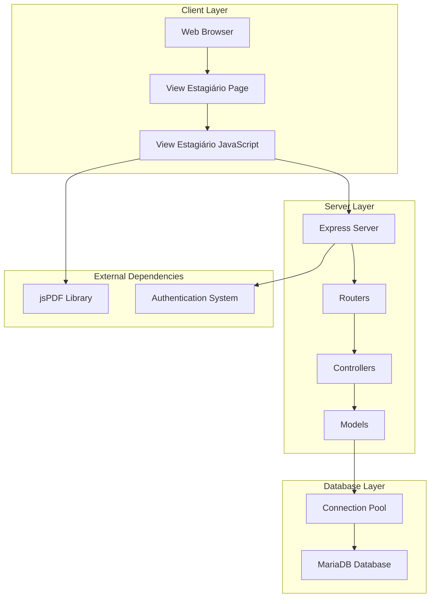
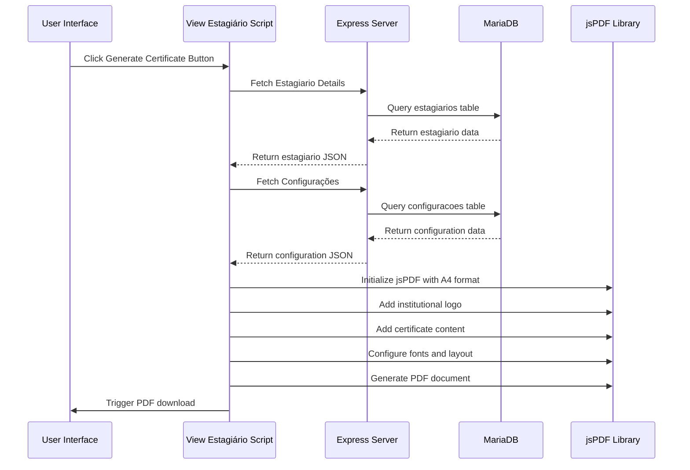
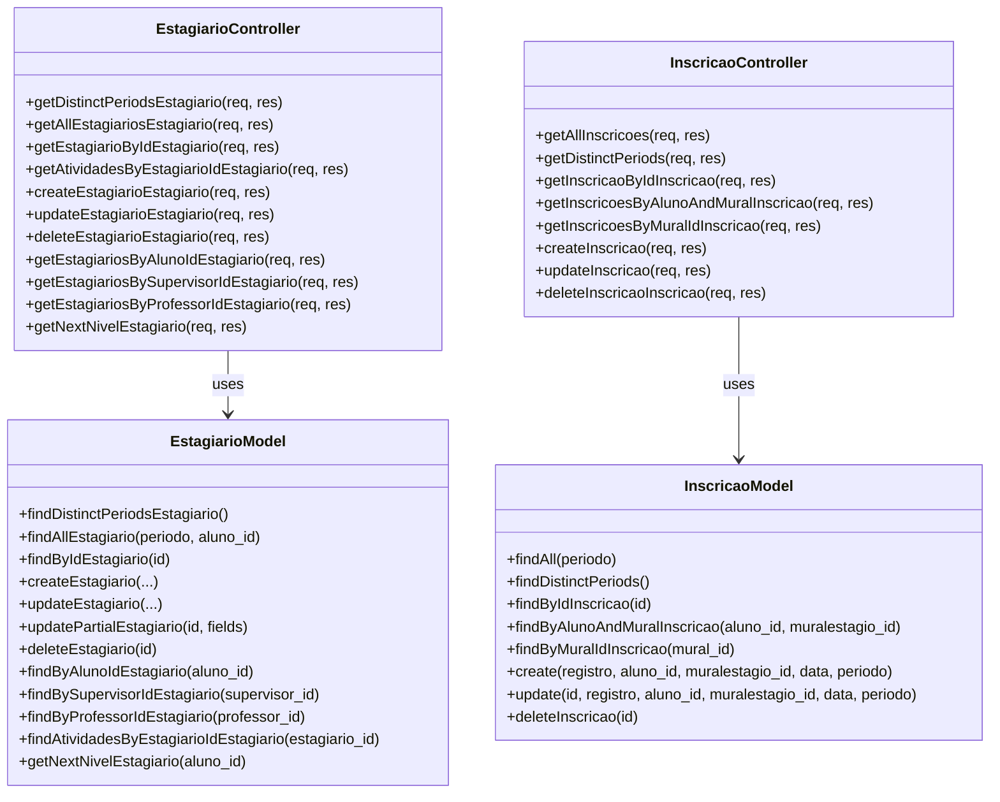
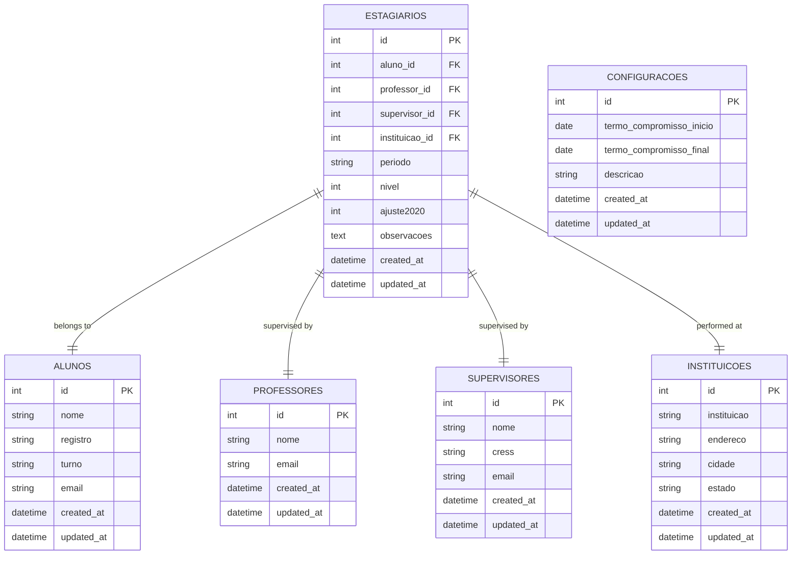
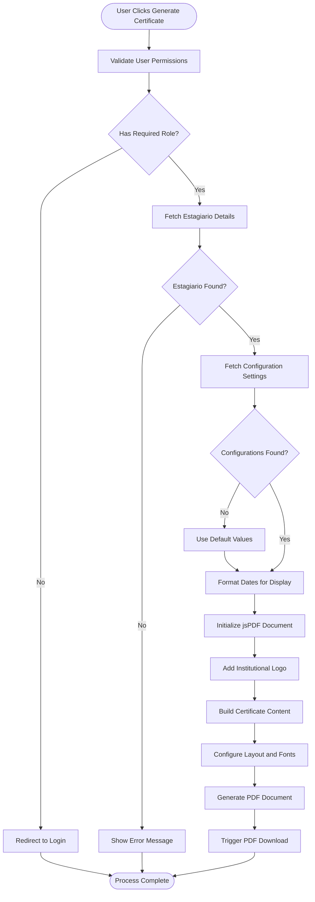
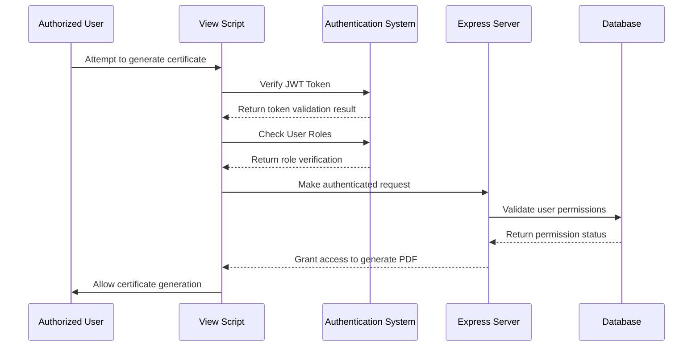
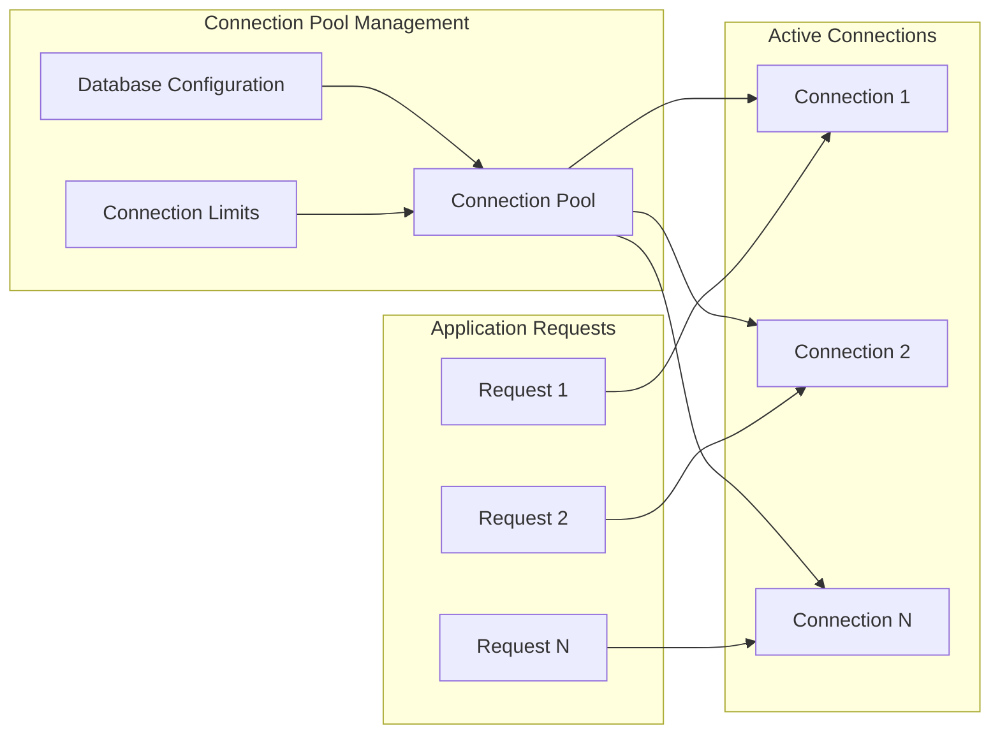
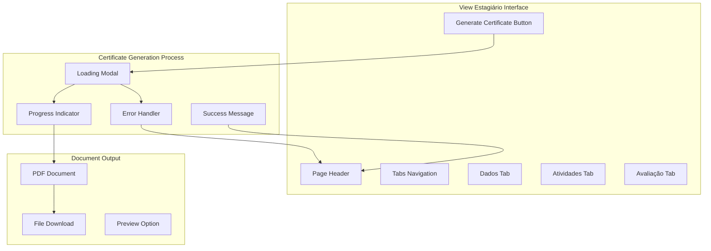

# PDF Generation System

<cite>
**Referenced Files in This Document**
- [README.md](file://README.md)
- [package.json](file://package.json)
- [src/server.js](file://src/server.js)
- [src/database/db.js](file://src/database/db.js)
- [src/routers/estagiarioRoutes.js](file://src/routers/estagiarioRoutes.js)
- [src/routers/configuracaoRoutes.js](file://src/routers/configuracaoRoutes.js)
- [src/controllers/estagiarioController.js](file://src/controllers/estagiarioController.js)
- [src/controllers/inscricaoController.js](file://src/controllers/inscricaoController.js)
- [src/models/estagiario.js](file://src/models/estagiario.js)
- [src/models/inscricao.js](file://src/models/inscricao.js)
- [public/view-estagiario.html](file://public/view-estagiario.html)
- [public/view-estagiario.js](file://public/view-estagiario.js)
</cite>

## Table of Contents
1. [Introduction](#introduction)
2. [System Architecture](#system-architecture)
3. [PDF Generation Implementation](#pdf-generation-implementation)
4. [Core Components Analysis](#core-components-analysis)
5. [Data Flow and Processing](#data-flow-and-processing)
6. [Security and Access Control](#security-and-access-control)
7. [Database Integration](#database-integration)
8. [Frontend Implementation](#frontend-implementation)
9. [Performance Considerations](#performance-considerations)
10. [Troubleshooting Guide](#troubleshooting-guide)
11. [Conclusion](#conclusion)

## Introduction

The PDF Generation System is a specialized component within the NodeMural application that enables the creation of professional PDF documents, specifically internship commitment certificates. Built using modern web technologies including Node.js, Express.js, MariaDB, and jsPDF library, this system provides automated document generation capabilities for educational institutions managing internship programs.

The system focuses on generating standardized PDF certificates for students completing their internship periods, incorporating institutional branding, legal terms, and personalized student information. It integrates seamlessly with the broader NodeMural application ecosystem while maintaining independence for document generation tasks.

## System Architecture

The PDF Generation System follows a client-server architecture pattern with clear separation of concerns between frontend presentation, backend processing, and database operations.

**Diagram sources**
- [src/server.js](file://src/server.js#L1-L62)
- [public/view-estagiario.js](file://public/view-estagiario.js#L1-L602)

The architecture ensures scalability through connection pooling, maintains security through authentication middleware, and provides efficient document generation through optimized database queries.

**Section sources**
- [src/server.js](file://src/server.js#L1-L62)
- [package.json](file://package.json#L22-L31)

## PDF Generation Implementation

The PDF generation functionality is implemented entirely on the client-side using the jsPDF library, providing immediate document creation without server-side processing overhead.

### Core Generation Process

**Diagram sources**
- [public/view-estagiario.js](file://public/view-estagiario.js#L342-L600)
- [src/routers/estagiarioRoutes.js](file://src/routers/estagiarioRoutes.js#L12-L20)
- [src/routers/configuracaoRoutes.js](file://src/routers/configuracaoRoutes.js#L12-L14)

### Document Structure and Content

The generated PDF follows a standardized legal document format with the following structure:

1. **Header Section**: Institutional logo and certificate title
2. **Legal Terms**: Comprehensive internship agreement clauses
3. **Parties Information**: Student, institution, and supervisor details
4. **Terms and Conditions**: Specific period and level information
5. **Signatures**: Space for authorized signatures

**Section sources**
- [public/view-estagiario.js](file://public/view-estagiario.js#L378-L594)

## Core Components Analysis

### Backend Controllers

The system utilizes specialized controllers to handle PDF-related operations and data retrieval:

**Diagram sources**
- [src/controllers/estagiarioController.js](file://src/controllers/estagiarioController.js#L1-L155)
- [src/controllers/inscricaoController.js](file://src/controllers/inscricaoController.js#L1-L114)
- [src/models/estagiario.js](file://src/models/estagiario.js#L1-L237)
- [src/models/inscricao.js](file://src/models/inscricao.js#L1-L104)

### Database Schema Integration

The PDF generation system interacts with multiple database tables to gather comprehensive information:

**Diagram sources**
- [src/models/estagiario.js](file://src/models/estagiario.js#L12-L62)
- [src/models/inscricao.js](file://src/models/inscricao.js#L4-L38)

**Section sources**
- [src/models/estagiario.js](file://src/models/estagiario.js#L1-L237)
- [src/models/inscricao.js](file://src/models/inscricao.js#L1-L104)

## Data Flow and Processing

### Request Processing Flow

**Diagram sources**
- [public/view-estagiario.js](file://public/view-estagiario.js#L342-L600)
- [src/routers/estagiarioRoutes.js](file://src/routers/estagiarioRoutes.js#L12-L20)

### Authentication and Authorization Flow

The system implements robust security measures to ensure only authorized users can generate PDF documents:

**Diagram sources**
- [public/view-estagiario.js](file://public/view-estagiario.js#L5-L10)
- [src/routers/estagiarioRoutes.js](file://src/routers/estagiarioRoutes.js#L12-L20)

**Section sources**
- [public/view-estagiario.js](file://public/view-estagiario.js#L1-L602)
- [src/routers/estagiarioRoutes.js](file://src/routers/estagiarioRoutes.js#L1-L23)

## Security and Access Control

The PDF Generation System implements multiple layers of security to protect sensitive educational data and ensure proper access control:

### Authentication Mechanisms

1. **JWT Token Validation**: All requests require valid authentication tokens
2. **Role-Based Access Control**: Different user roles have varying levels of access
3. **Ownership Verification**: Students can only access their own records
4. **Route Protection**: All endpoints are protected by middleware

### Authorization Matrix

| User Role | Generate Certificate | Access Student Data | Modify Records |
|-----------|---------------------|-------------------|----------------|
| Admin | ✅ Full Access | ✅ All Students | ✅ All Operations |
| Aluno (Student) | ✅ Own Certificate | ✅ Own Profile | ✅ Own Records |
| Professor | ❌ Limited Access | ✅ Students | ❌ No Modification |
| Supervisor | ❌ Limited Access | ✅ Assigned Students | ❌ No Modification |

### Data Protection Measures

- **Input Validation**: All user inputs are sanitized and validated
- **SQL Injection Prevention**: Parameterized queries prevent malicious attacks
- **Cross-Site Scripting (XSS) Protection**: Content is properly escaped
- **Secure File Handling**: Generated PDFs are handled securely

**Section sources**
- [src/routers/estagiarioRoutes.js](file://src/routers/estagiarioRoutes.js#L8-L20)
- [public/view-estagiario.js](file://public/view-estagiario.js#L5-L10)

## Database Integration

### Connection Management

The system uses a connection pool to efficiently manage database connections and handle concurrent requests:

**Diagram sources**
- [src/database/db.js](file://src/database/db.js#L5-L13)

### Query Optimization

The system employs several optimization strategies:

1. **Efficient JOIN Operations**: Optimized queries for retrieving related data
2. **Parameterized Queries**: Prevent SQL injection and improve performance
3. **Connection Reuse**: Minimizes connection overhead through pooling
4. **Result Limiting**: Appropriate LIMIT clauses for large datasets

**Section sources**
- [src/database/db.js](file://src/database/db.js#L1-L15)
- [src/models/estagiario.js](file://src/models/estagiario.js#L12-L43)

## Frontend Implementation

### User Interface Design

The PDF generation interface is integrated seamlessly into the existing NodeMural application:

**Diagram sources**
- [public/view-estagiario.html](file://public/view-estagiario.html#L108-L116)
- [public/view-estagiario.js](file://public/view-estagiario.js#L342-L600)

### Responsive Design Integration

The certificate generation feature maintains consistency with the application's responsive design principles:

- **Mobile Compatibility**: Touch-friendly interface elements
- **Cross-Device Support**: Works across desktop, tablet, and mobile devices
- **Accessibility**: Screen reader compatible with proper ARIA labels
- **Performance**: Optimized for fast loading and smooth operation

**Section sources**
- [public/view-estagiario.html](file://public/view-estagiario.html#L1-L194)
- [public/view-estagiario.js](file://public/view-estagiario.js#L1-L602)

## Performance Considerations

### Client-Side Optimization

The PDF generation is performed entirely on the client-side to minimize server load and improve response times:

1. **Reduced Server Load**: PDF generation occurs in user's browser
2. **Bandwidth Efficiency**: Only necessary data is transmitted
3. **Scalability**: No additional server resources required
4. **Real-time Processing**: Immediate document generation

### Memory Management

The system implements efficient memory management practices:

- **Resource Cleanup**: Proper cleanup of DOM elements and event listeners
- **Memory Leaks Prevention**: No lingering references after completion
- **Large Document Handling**: Efficient processing of complex PDF structures
- **Browser Compatibility**: Optimized for modern browsers with good performance

### Caching Strategies

While the PDF generation is dynamic, the system benefits from caching mechanisms:

- **Static Assets**: jsPDF library and other static resources cached
- **User Session**: Authentication tokens cached for session duration
- **Database Queries**: Frequently accessed data cached at application level

## Troubleshooting Guide

### Common Issues and Solutions

#### PDF Generation Failures

**Issue**: Certificate generation fails with JavaScript error
**Solution**: 
1. Check browser console for specific error messages
2. Verify internet connectivity for external resources
3. Clear browser cache and reload the page
4. Try using a different browser

**Issue**: Blank or incomplete PDF document
**Solution**:
1. Ensure all required fields have valid data
2. Check database connectivity and query results
3. Verify institutional configuration settings
4. Review PDF generation logs in browser developer tools

#### Authentication Problems

**Issue**: Users cannot access certificate generation
**Solution**:
1. Verify user authentication status
2. Check role permissions for the specific user
3. Ensure proper authorization headers are included
4. Review middleware configuration

#### Database Connection Issues

**Issue**: Cannot fetch student or configuration data
**Solution**:
1. Verify database server connectivity
2. Check database credentials and permissions
3. Ensure required tables exist and are accessible
4. Review connection pool configuration

### Debugging Tools and Techniques

1. **Browser Developer Tools**: Inspect network requests and console errors
2. **Network Monitoring**: Track API response times and error rates
3. **Database Query Logging**: Monitor SQL query performance
4. **Performance Profiling**: Analyze memory usage and processing time

**Section sources**
- [public/view-estagiario.js](file://public/view-estagiario.js#L596-L599)
- [src/routers/estagiarioRoutes.js](file://src/routers/estagiarioRoutes.js#L12-L20)

## Conclusion

The PDF Generation System represents a sophisticated integration of modern web technologies designed to streamline educational document creation processes. By leveraging client-side processing with jsPDF, the system achieves optimal performance while maintaining security and reliability.

Key achievements of the system include:

- **Seamless Integration**: Works flawlessly within the existing NodeMural application framework
- **Robust Security**: Implements comprehensive authentication and authorization mechanisms
- **Performance Optimization**: Utilizes client-side processing to minimize server load
- **User Experience**: Provides intuitive interface with responsive design principles
- **Scalability**: Designed to handle increased usage without infrastructure changes

The system successfully addresses the core requirement for automated certificate generation while maintaining the high standards expected in educational technology environments. Future enhancements could include support for additional document types, batch processing capabilities, and enhanced customization options.