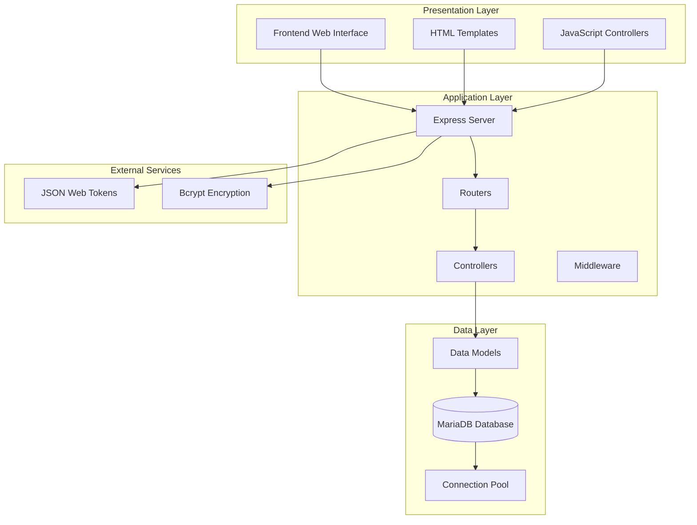
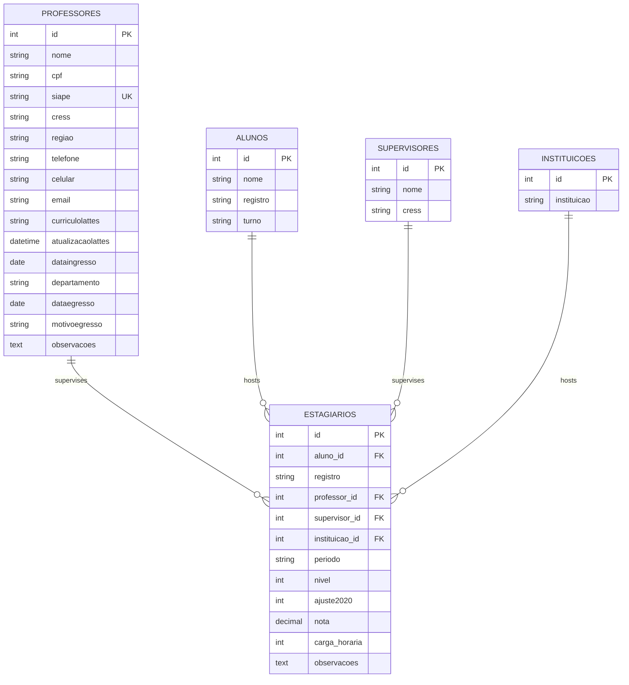
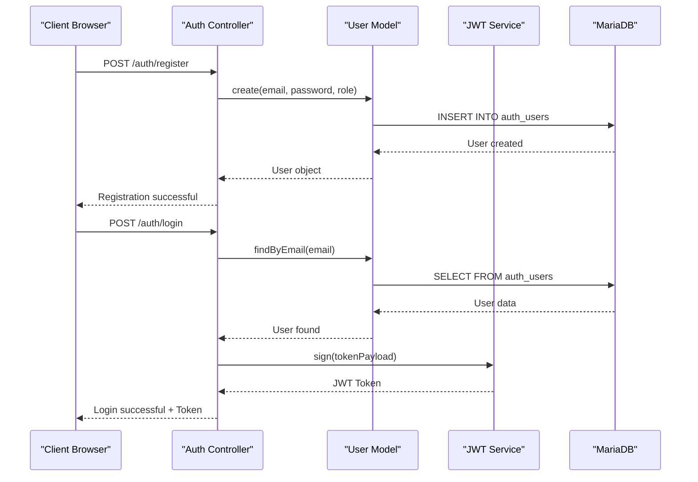
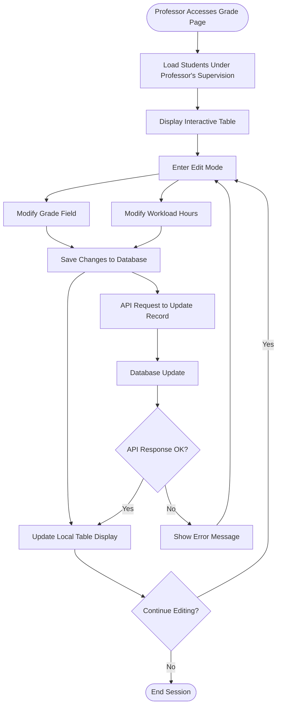
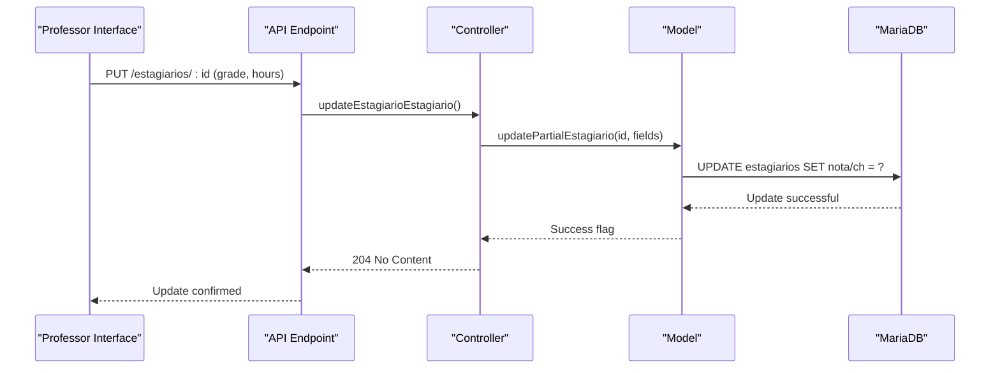
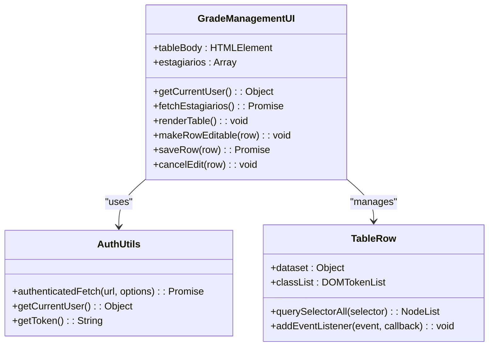
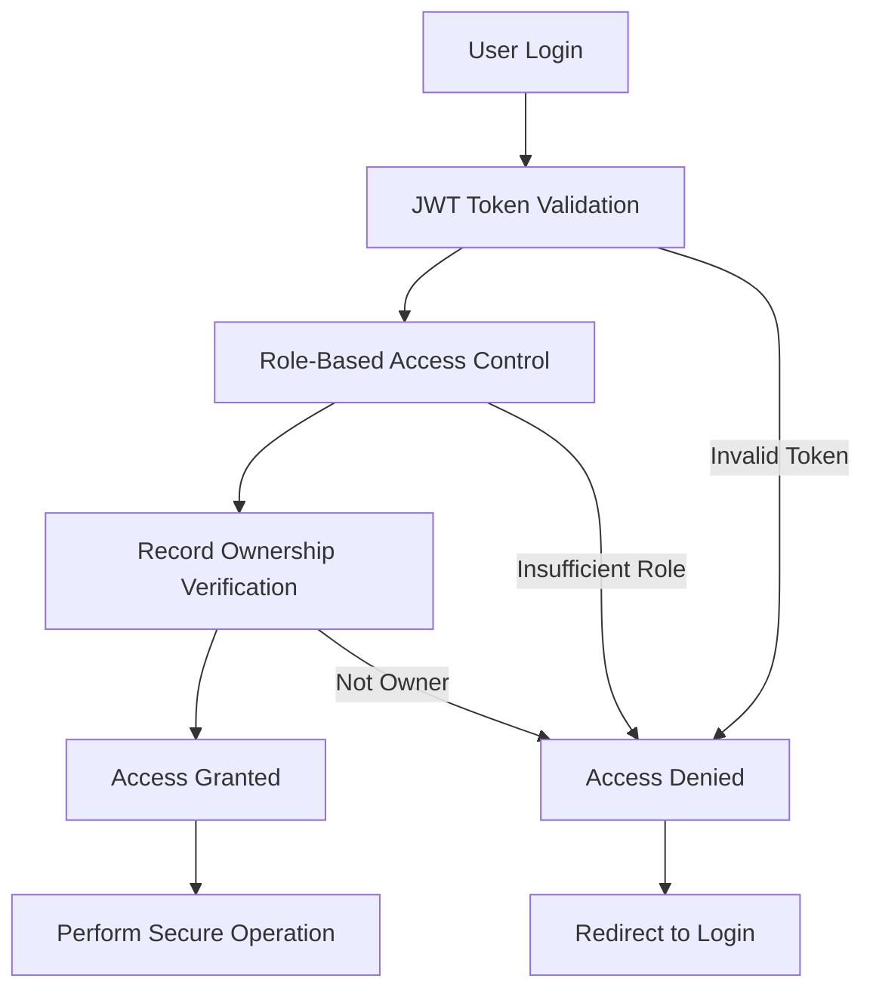

# Professor Grade Management System

<cite>
**Referenced Files in This Document**
- [README.md](file://README.md)
- [package.json](file://package.json)
- [src/server.js](file://src/server.js)
- [src/database/db.js](file://src/database/db.js)
- [src/middleware/auth.js](file://src/middleware/auth.js)
- [src/controllers/authController.js](file://src/controllers/authController.js)
- [src/models/user.js](file://src/models/user.js)
- [src/controllers/professorController.js](file://src/controllers/professorController.js)
- [src/models/professor.js](file://src/models/professor.js)
- [src/routers/professorRoutes.js](file://src/routers/professorRoutes.js)
- [src/controllers/estagiarioController.js](file://src/controllers/estagiarioController.js)
- [src/models/estagiario.js](file://src/models/estagiario.js)
- [src/routers/estagiarioRoutes.js](file://src/routers/estagiarioRoutes.js)
- [public/professor_estagiarios_notas.html](file://public/professor_estagiarios_notas.html)
- [public/professor_estagiarios_notas.js](file://public/professor_estagiarios_notas.js)
- [public/auth-utils.js](file://public/auth-utils.js)
</cite>

## Table of Contents
1. [Introduction](#introduction)
2. [System Architecture](#system-architecture)
3. [Database Design](#database-design)
4. [Authentication and Authorization](#authentication-and-authorization)
5. [Professor Grade Management Features](#professor-grade-management-features)
6. [Frontend Implementation](#frontend-implementation)
7. [API Endpoints](#api-endpoints)
8. [Security Model](#security-model)
9. [Performance Considerations](#performance-considerations)
10. [Troubleshooting Guide](#troubleshooting-guide)
11. [Conclusion](#conclusion)

## Introduction

The Professor Grade Management System is a comprehensive web application designed for educational institutions to manage student internships, grades, and academic supervision. Built with Node.js, Express, and MariaDB, this system provides professors with the ability to track and manage internship grades for their students through an intuitive web interface.

The application supports multiple user roles including professors, students (alunos), supervisors, and administrators, each with specific permissions and access controls. The system focuses particularly on grade management for internship students, allowing professors to update grades and workload hours directly from a web-based interface.

## System Architecture

The Professor Grade Management System follows a modern three-tier architecture pattern with clear separation of concerns:

**Diagram sources**
- [src/server.js](file://src/server.js#L1-L62)
- [src/database/db.js](file://src/database/db.js#L1-L15)
- [src/middleware/auth.js](file://src/middleware/auth.js#L1-L216)

The architecture consists of four main layers:

1. **Presentation Layer**: HTML templates and JavaScript controllers for user interaction
2. **Application Layer**: Express server handling routing, controllers, and middleware
3. **Data Layer**: MariaDB database with connection pooling and data models
4. **Security Layer**: JWT-based authentication and authorization middleware

**Section sources**
- [src/server.js](file://src/server.js#L1-L62)
- [package.json](file://package.json#L1-L33)

## Database Design

The system uses a normalized MariaDB database with interconnected tables supporting the grade management functionality:

**Diagram sources**
- [src/models/professor.js](file://src/models/professor.js#L59-L82)
- [src/models/estagiario.js](file://src/models/estagiario.js#L64-L106)

The database design supports the core grade management functionality through:

- **Professor-Student Relationship**: Professors supervise multiple students through the estagiarios table
- **Grade Tracking**: Dedicated fields for storing numerical grades and workload hours
- **Academic Progression**: Support for tracking student progression through different internship levels
- **Institutional Context**: Links to supervising institutions and supervisors

**Section sources**
- [src/models/professor.js](file://src/models/professor.js#L1-L86)
- [src/models/estagiario.js](file://src/models/estagiario.js#L1-L237)

## Authentication and Authorization

The system implements a robust JWT-based authentication system with role-based access control:

**Diagram sources**
- [src/controllers/authController.js](file://src/controllers/authController.js#L5-L54)
- [src/controllers/authController.js](file://src/controllers/authController.js#L57-L108)
- [src/models/user.js](file://src/models/user.js#L7-L34)

The authentication system supports multiple user roles with specific permissions:

- **Admin**: Full system access
- **Professor**: Can access and modify their own students' records
- **Aluno (Student)**: Can access their own information and related records
- **Supervisor**: Can access supervised students' records

**Section sources**
- [src/middleware/auth.js](file://src/middleware/auth.js#L1-L216)
- [src/controllers/authController.js](file://src/controllers/authController.js#L1-L260)
- [src/models/user.js](file://src/models/user.js#L1-L185)

## Professor Grade Management Features

The system provides comprehensive grade management capabilities specifically designed for professors:

### Core Grade Management Functions

**Diagram sources**
- [public/professor_estagiarios_notas.js](file://public/professor_estagiarios_notas.js#L103-L142)

### Key Features

1. **Real-time Grade Updates**: Interactive table allowing professors to update student grades instantly
2. **Workload Tracking**: Separate field for tracking internship workload hours
3. **Student Filtering**: Ability to filter students by various criteria
4. **Progress Monitoring**: Visual display of student academic progression
5. **Audit Trail**: Automatic logging of all grade modifications

### Data Flow for Grade Updates

**Diagram sources**
- [src/controllers/estagiarioController.js](file://src/controllers/estagiarioController.js#L68-L91)
- [src/models/estagiario.js](file://src/models/estagiario.js#L84-L106)

**Section sources**
- [public/professor_estagiarios_notas.html](file://public/professor_estagiarios_notas.html#L1-L44)
- [public/professor_estagiarios_notas.js](file://public/professor_estagiarios_notas.js#L1-L151)
- [src/controllers/estagiarioController.js](file://src/controllers/estagiarioController.js#L68-L91)
- [src/models/estagiario.js](file://src/models/estagiario.js#L84-L106)

## Frontend Implementation

The frontend implementation uses modern JavaScript ES modules with Bootstrap for responsive design:

### Interactive Table Implementation

The grade management interface features a sophisticated editable table system:

**Diagram sources**
- [public/professor_estagiarios_notas.js](file://public/professor_estagiarios_notas.js#L1-L151)
- [public/auth-utils.js](file://public/auth-utils.js#L1-L102)

### Key Frontend Features

1. **Event Delegation**: Efficient handling of table interactions
2. **Real-time Updates**: Immediate visual feedback for user actions
3. **Responsive Design**: Bootstrap-based mobile-friendly interface
4. **Error Handling**: Comprehensive error management and user feedback
5. **Authentication Integration**: Seamless JWT token handling

**Section sources**
- [public/professor_estagiarios_notas.html](file://public/professor_estagiarios_notas.html#L1-L44)
- [public/professor_estagiarios_notas.js](file://public/professor_estagiarios_notas.js#L1-L151)
- [public/auth-utils.js](file://public/auth-utils.js#L1-L102)

## API Endpoints

The system exposes a comprehensive RESTful API for grade management operations:

### Professor Management Endpoints

| Method | Endpoint | Description | Required Roles |
|--------|----------|-------------|----------------|
| GET | `/professores/:id/estagiarios` | Get estagiarios by professor ID | admin, professor |
| GET | `/professores/:id` | Get professor by ID | admin, professor |
| PUT | `/professores/:id` | Update professor | admin, professor |
| DELETE | `/professores/:id` | Delete professor | admin |

### Estagiario Management Endpoints

| Method | Endpoint | Description | Required Roles |
|--------|----------|-------------|----------------|
| GET | `/estagiarios/:id/next-nivel` | Get next internship level | admin, aluno |
| GET | `/estagiarios/:id/atividades` | Get estagiario activities | admin, aluno, professor, supervisor |
| PUT | `/estagiarios/:id` | Update estagiario (partial) | admin, aluno, professor |
| DELETE | `/estagiarios/:id` | Delete estagiario | admin, aluno |

### Authentication Endpoints

| Method | Endpoint | Description | Required Roles |
|--------|----------|-------------|----------------|
| POST | `/auth/register` | User registration | None |
| POST | `/auth/login` | User login | None |
| GET | `/auth/profile` | Get user profile | auth |

**Section sources**
- [src/routers/professorRoutes.js](file://src/routers/professorRoutes.js#L1-L23)
- [src/routers/estagiarioRoutes.js](file://src/routers/estagiarioRoutes.js#L1-L23)

## Security Model

The system implements a multi-layered security approach:

### Authentication Flow

**Diagram sources**
- [src/middleware/auth.js](file://src/middleware/auth.js#L8-L33)
- [src/middleware/auth.js](file://src/middleware/auth.js#L36-L52)
- [src/middleware/auth.js](file://src/middleware/auth.js#L81-L102)

### Security Features

1. **JWT Token Authentication**: Stateless authentication with expiration
2. **Role-Based Access Control**: Fine-grained permission system
3. **Ownership Verification**: Ensures users can only access their own records
4. **Input Validation**: Comprehensive validation at multiple layers
5. **Password Hashing**: Secure password storage using bcrypt
6. **SQL Injection Prevention**: Parameterized queries throughout

**Section sources**
- [src/middleware/auth.js](file://src/middleware/auth.js#L1-L216)
- [src/controllers/authController.js](file://src/controllers/authController.js#L1-L260)
- [src/models/user.js](file://src/models/user.js#L1-L185)

## Performance Considerations

The system is designed for optimal performance through several key mechanisms:

### Database Optimization

1. **Connection Pooling**: MariaDB connection pooling reduces database overhead
2. **Indexed Fields**: Strategic indexing on frequently queried fields
3. **Efficient Queries**: Optimized SQL queries for grade management operations
4. **Caching Strategy**: Frontend caching for reduced API calls

### Frontend Performance

1. **Lazy Loading**: JavaScript modules loaded on demand
2. **Event Delegation**: Efficient event handling for large datasets
3. **Minimal DOM Manipulation**: Optimized rendering strategies
4. **Responsive Design**: Mobile-first approach for better performance

### Scalability Features

1. **Horizontal Scaling**: Stateless design allows easy scaling
2. **Database Optimization**: Proper indexing and query optimization
3. **Memory Management**: Efficient memory usage in JavaScript
4. **API Rate Limiting**: Built-in protection against abuse

## Troubleshooting Guide

### Common Issues and Solutions

#### Authentication Problems
- **Issue**: Users cannot log in
- **Solution**: Verify JWT_SECRET environment variable and check user credentials
- **Debug**: Check browser console for authentication errors

#### Database Connection Issues
- **Issue**: Application cannot connect to MariaDB
- **Solution**: Verify database credentials in .env file
- **Debug**: Test database connectivity separately

#### Permission Denied Errors
- **Issue**: Users receive "Access denied" messages
- **Solution**: Verify user roles and ownership permissions
- **Debug**: Check JWT token payload and user entitlements

#### Grade Update Failures
- **Issue**: Grade changes not persisting
- **Solution**: Verify partial update functionality and database permissions
- **Debug**: Check API response status codes

**Section sources**
- [src/middleware/auth.js](file://src/middleware/auth.js#L8-L33)
- [src/database/db.js](file://src/database/db.js#L1-L15)

## Conclusion

The Professor Grade Management System provides a robust, secure, and scalable solution for academic grade management in educational institutions. The system successfully combines modern web technologies with sound architectural principles to deliver an intuitive interface for professors while maintaining strict security and data integrity standards.

Key strengths of the system include:

- **Comprehensive Role-Based Access Control**: Ensures appropriate data access for all user types
- **Real-time Grade Management**: Interactive interface for immediate grade updates
- **Scalable Architecture**: Designed to handle growing institutional needs
- **Security Focus**: Multi-layered security approach protecting sensitive academic data
- **Modern Technology Stack**: Leveraging proven technologies for reliability and maintainability

The system serves as an excellent foundation for academic institutions seeking to digitize and streamline their internship and grade management processes while maintaining the highest standards of security and data integrity.