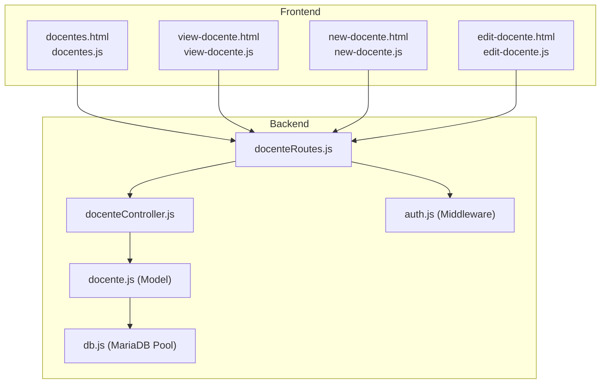
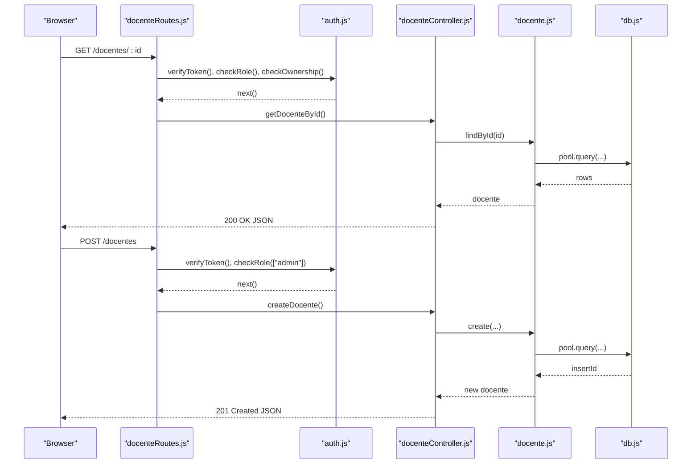
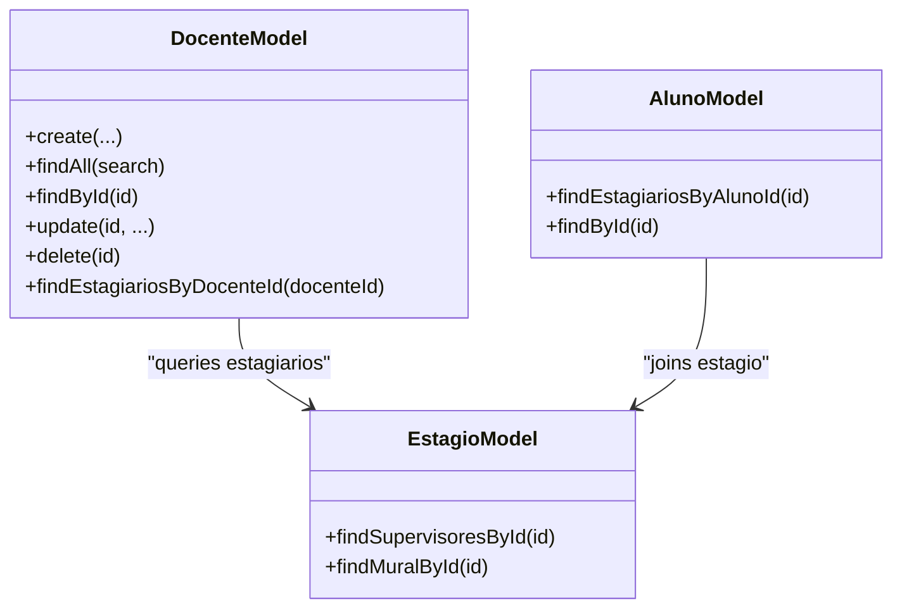
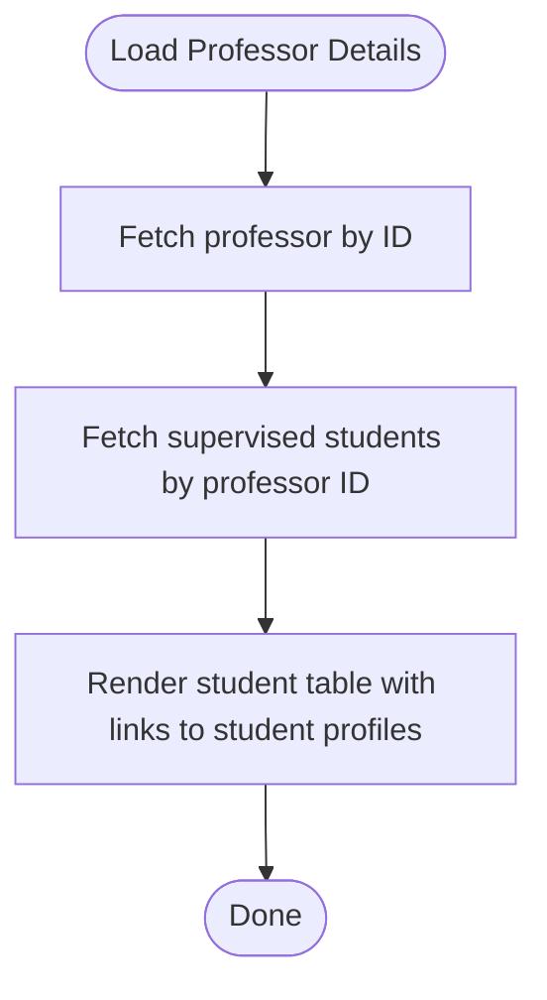
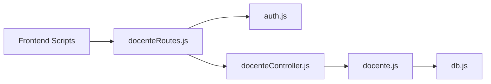

# Professor Management

<cite>
**Referenced Files in This Document**
- [src/models/docente.js](file://src/models/docente.js)
- [src/controllers/docenteController.js](file://src/controllers/docenteController.js)
- [src/routers/docenteRoutes.js](file://src/routers/docenteRoutes.js)
- [src/middleware/auth.js](file://src/middleware/auth.js)
- [src/database/db.js](file://src/database/db.js)
- [public/docentes.html](file://public/docentes.html)
- [public/docentes.js](file://public/docentes.js)
- [public/new-docente.html](file://public/new-docente.html)
- [public/new-docente.js](file://public/new-docente.js)
- [public/edit-docente.html](file://public/edit-docente.html)
- [public/edit-docente.js](file://public/edit-docente.js)
- [public/view-docente.html](file://public/view-docente.html)
- [public/view-docente.js](file://public/view-docente.js)
- [src/models/aluno.js](file://src/models/aluno.js)
- [src/models/estagio.js](file://src/models/estagio.js)
</cite>

## Table of Contents
1. [Introduction](#introduction)
2. [Project Structure](#project-structure)
3. [Core Components](#core-components)
4. [Architecture Overview](#architecture-overview)
5. [Detailed Component Analysis](#detailed-component-analysis)
6. [Dependency Analysis](#dependency-analysis)
7. [Performance Considerations](#performance-considerations)
8. [Troubleshooting Guide](#troubleshooting-guide)
9. [Conclusion](#conclusion)
10. [Appendices](#appendices)

## Introduction
This document describes the Professor Management system, focusing on the complete CRUD lifecycle for professor entities, academic supervision coordination, and oversight management. It explains controller-side validation and ownership enforcement, model-layer database operations and relationships with students and supervisors, and frontend integration via HTML templates and JavaScript. Validation rules for academic credentials, professional qualifications, and department assignments are documented alongside workflows for supervision coordination and performance tracking. Data consistency requirements and integration patterns with the broader academic management system are addressed.

## Project Structure
The Professor Management feature spans three layers:
- Frontend (public): HTML templates and client-side scripts for listing, viewing, creating, and editing professors, and for displaying supervised students.
- Backend (src): Express routes, controllers, models, middleware, and database pool configuration.
- Database: MariaDB configured via a connection pool.



**Diagram sources**
- [src/routers/docenteRoutes.js](file://src/routers/docenteRoutes.js#L1-L20)
- [src/controllers/docenteController.js](file://src/controllers/docenteController.js#L1-L85)
- [src/models/docente.js](file://src/models/docente.js#L1-L72)
- [src/middleware/auth.js](file://src/middleware/auth.js#L1-L137)
- [src/database/db.js](file://src/database/db.js#L1-L15)
- [public/docentes.html](file://public/docentes.html#L1-L48)
- [public/view-docente.html](file://public/view-docente.html#L1-L143)
- [public/new-docente.html](file://public/new-docente.html#L1-L82)
- [public/edit-docente.html](file://public/edit-docente.html#L1-L88)

**Section sources**
- [src/routers/docenteRoutes.js](file://src/routers/docenteRoutes.js#L1-L20)
- [src/controllers/docenteController.js](file://src/controllers/docenteController.js#L1-L85)
- [src/models/docente.js](file://src/models/docente.js#L1-L72)
- [src/middleware/auth.js](file://src/middleware/auth.js#L1-L137)
- [src/database/db.js](file://src/database/db.js#L1-L15)
- [public/docentes.html](file://public/docentes.html#L1-L48)
- [public/view-docente.html](file://public/view-docente.html#L1-L143)
- [public/new-docente.html](file://public/new-docente.html#L1-L82)
- [public/edit-docente.html](file://public/edit-docente.html#L1-L88)

## Core Components
- Model: Provides CRUD operations for professors and a specialized query to list supervised students (estagiários) grouped by student and supervisor.
- Controller: Implements endpoints for listing, retrieving, creating, updating, deleting professors, and fetching supervised students by professor ID.
- Routes: Expose REST endpoints with authentication, role-based authorization, and ownership checks.
- Middleware: Enforces JWT verification, role gating, and ownership constraints for record access.
- Frontend: Renders lists, forms, and detail views; integrates with backend APIs for full CRUD and supervision display.

Key responsibilities:
- Validation and normalization occur at the frontend forms and in the controller’s parameter extraction.
- Ownership enforcement ensures only admins or the owning professor can access/update their own records.
- Supervision queries connect professors to students via the estagio table and related entities.

**Section sources**
- [src/models/docente.js](file://src/models/docente.js#L1-L72)
- [src/controllers/docenteController.js](file://src/controllers/docenteController.js#L1-L85)
- [src/routers/docenteRoutes.js](file://src/routers/docenteRoutes.js#L1-L20)
- [src/middleware/auth.js](file://src/middleware/auth.js#L1-L137)
- [public/docentes.js](file://public/docentes.js#L1-L59)
- [public/new-docente.js](file://public/new-docente.js#L1-L48)
- [public/edit-docente.js](file://public/edit-docente.js#L1-L84)
- [public/view-docente.js](file://public/view-docente.js#L1-L108)

## Architecture Overview
The system follows a layered architecture:
- Presentation layer: HTML templates and client scripts.
- Application layer: Express routes, controllers, and middleware.
- Domain layer: Models encapsulate business logic and data access.
- Data layer: MariaDB via a pooled connection.



**Diagram sources**
- [src/routers/docenteRoutes.js](file://src/routers/docenteRoutes.js#L1-L20)
- [src/middleware/auth.js](file://src/middleware/auth.js#L1-L137)
- [src/controllers/docenteController.js](file://src/controllers/docenteController.js#L1-L85)
- [src/models/docente.js](file://src/models/docente.js#L1-L72)
- [src/database/db.js](file://src/database/db.js#L1-L15)

## Detailed Component Analysis

### Model Layer: Professor Entity and Relationships
The professor model supports:
- Full CRUD operations for professor records.
- Search across professor names.
- Fetching supervised students (estagiários) with student and supervisor details.



**Diagram sources**
- [src/models/docente.js](file://src/models/docente.js#L1-L72)
- [src/models/aluno.js](file://src/models/aluno.js#L1-L146)
- [src/models/estagio.js](file://src/models/estagio.js#L1-L66)

Implementation highlights:
- Data normalization occurs in the model’s SQL statements and returned objects.
- The supervision query joins estagio with alunos and supervisores to present student-level supervision details.
- The model relies on a shared MariaDB pool for all queries.

**Section sources**
- [src/models/docente.js](file://src/models/docente.js#L1-L72)
- [src/database/db.js](file://src/database/db.js#L1-L15)

### Controller Layer: Validation, Ownership, and Business Logic
Responsibilities:
- Extract request parameters and forward to the model.
- Return structured JSON responses with appropriate HTTP status codes.
- Centralized error logging and user-friendly messages.

Validation and ownership:
- Controller does not perform field-level validation; validation is enforced by route middleware and frontend forms.
- Ownership checks are applied via middleware to ensure only authorized users can access or modify records.

**Section sources**
- [src/controllers/docenteController.js](file://src/controllers/docenteController.js#L1-L85)
- [src/middleware/auth.js](file://src/middleware/auth.js#L1-L137)

### Route Layer: Access Control and Endpoint Contracts
Endpoints:
- GET /docentes: List professors with optional search; requires admin or docente roles.
- GET /docentes/:id: Retrieve a professor by ID; requires admin or docente roles and ownership.
- GET /docentes/:id/estagiarios: Fetch supervised students; requires admin or docente roles and ownership.
- POST /docentes: Create a professor; requires admin role.
- PUT /docentes/:id: Update a professor; requires admin or docente roles and ownership.
- DELETE /docentes/:id: Delete a professor; requires admin role.

Access control:
- verifyToken: Validates JWT presence and signature.
- checkRole: Restricts endpoints to allowed roles.
- checkOwnership: Ensures non-admin users can only access or modify their own records.

**Section sources**
- [src/routers/docenteRoutes.js](file://src/routers/docenteRoutes.js#L1-L20)
- [src/middleware/auth.js](file://src/middleware/auth.js#L1-L137)

### Frontend Integration: Templates and Scripts
- Listing page: Loads professors via AJAX and renders a searchable table with actions.
- Creation page: Submits new professor data to the backend and navigates to the view page upon success.
- Editing page: Preloads existing data, validates required fields, and updates the record.
- View page: Displays professor details and a tabbed panel for supervised students, linking to student profiles.

```mermaid
sequenceDiagram
participant List as "docentes.js"
participant API as "/docentes"
participant Table as "DataTable"
List->>API : GET /docentes
API-->>List : 200 JSON
List->>Table : populate rows
participant Create as "new-docente.js"
participant API2 as "/docentes"
Create->>API2 : POST /docentes
API2-->>Create : 201 JSON {id}
Create->>View : redirect to view-docente.html?id={id}
participant Edit as "edit-docente.js"
participant API3 as "/docentes/ : id"
Edit->>API3 : GET /docentes/ : id
API3-->>Edit : 200 JSON
Edit->>API3 : PUT /docentes/ : id
API3-->>Edit : 204 No Content
Edit->>View : redirect to view-docente.html?id={id}
```

**Diagram sources**
- [public/docentes.js](file://public/docentes.js#L1-L59)
- [public/new-docente.js](file://public/new-docente.js#L1-L48)
- [public/edit-docente.js](file://public/edit-docente.js#L1-L84)
- [public/view-docente.js](file://public/view-docente.js#L1-L108)

**Section sources**
- [public/docentes.html](file://public/docentes.html#L1-L48)
- [public/docentes.js](file://public/docentes.js#L1-L59)
- [public/new-docente.html](file://public/new-docente.html#L1-L82)
- [public/new-docente.js](file://public/new-docente.js#L1-L48)
- [public/edit-docente.html](file://public/edit-docente.html#L1-L88)
- [public/edit-docente.js](file://public/edit-docente.js#L1-L84)
- [public/view-docente.html](file://public/view-docente.html#L1-L143)
- [public/view-docente.js](file://public/view-docente.js#L1-L108)

### Supervision Coordination and Performance Tracking
Supervision data is derived from the professor’s supervised students:
- The model query joins estagio with alunos and supervisores to present student registration, name, supervisor name, level, and period.
- The view page displays this data in a responsive table and handles empty states gracefully.



**Diagram sources**
- [src/models/docente.js](file://src/models/docente.js#L50-L68)
- [public/view-docente.js](file://public/view-docente.js#L70-L107)

**Section sources**
- [src/models/docente.js](file://src/models/docente.js#L50-L68)
- [public/view-docente.html](file://public/view-docente.html#L105-L131)
- [public/view-docente.js](file://public/view-docente.js#L70-L107)

## Dependency Analysis
- Routes depend on middleware for authentication and authorization.
- Controllers depend on models for data operations.
- Models depend on the database pool for SQL execution.
- Frontend scripts depend on routes for data exchange.



**Diagram sources**
- [src/routers/docenteRoutes.js](file://src/routers/docenteRoutes.js#L1-L20)
- [src/middleware/auth.js](file://src/middleware/auth.js#L1-L137)
- [src/controllers/docenteController.js](file://src/controllers/docenteController.js#L1-L85)
- [src/models/docente.js](file://src/models/docente.js#L1-L72)
- [src/database/db.js](file://src/database/db.js#L1-L15)

**Section sources**
- [src/routers/docenteRoutes.js](file://src/routers/docenteRoutes.js#L1-L20)
- [src/middleware/auth.js](file://src/middleware/auth.js#L1-L137)
- [src/controllers/docenteController.js](file://src/controllers/docenteController.js#L1-L85)
- [src/models/docente.js](file://src/models/docente.js#L1-L72)
- [src/database/db.js](file://src/database/db.js#L1-L15)

## Performance Considerations
- Use of a connection pool reduces connection overhead and improves throughput under concurrent requests.
- Queries are straightforward; ensure indexes exist on frequently filtered columns (e.g., professor ID, student ID) to optimize joins.
- Pagination or server-side filtering should be considered for large datasets in the listing view.

[No sources needed since this section provides general guidance]

## Troubleshooting Guide
Common issues and resolutions:
- Authentication failures: Ensure a valid JWT is included in the Authorization header and not expired.
- Role-based access denied: Confirm the user’s role is admin or docente; ownership checks apply for GET/PUT/DELETE on individual records.
- Record not found: Verify the professor ID exists and matches the requested resource.
- Frontend navigation errors: Confirm the URL includes the required ID parameter and that the user has proper permissions.

**Section sources**
- [src/middleware/auth.js](file://src/middleware/auth.js#L1-L137)
- [src/controllers/docenteController.js](file://src/controllers/docenteController.js#L1-L85)
- [public/docentes.js](file://public/docentes.js#L1-L59)
- [public/view-docente.js](file://public/view-docente.js#L1-L108)

## Conclusion
The Professor Management system provides a robust, secure, and user-friendly solution for managing professors, their academic profiles, and supervision relationships. The layered architecture cleanly separates concerns, while middleware enforces strong access controls. The frontend offers intuitive forms and views, and the model layer efficiently retrieves supervision data. Adhering to the documented validation rules and ownership policies ensures data consistency and alignment with the broader academic management system.

[No sources needed since this section summarizes without analyzing specific files]

## Appendices

### Validation Rules and Field Constraints
- Required fields for creation and editing include name, siape, email, and department.
- Department values are constrained to predefined options.
- Optional fields include CPF, phone, curriculum Lattes, and egress date/motive/observations.
- The system relies on frontend form validation and middleware/role enforcement for access control.

**Section sources**
- [public/new-docente.html](file://public/new-docente.html#L21-L68)
- [public/edit-docente.html](file://public/edit-docente.html#L21-L75)
- [public/new-docente.js](file://public/new-docente.js#L12-L25)
- [public/edit-docente.js](file://public/edit-docente.js#L48-L62)
- [src/middleware/auth.js](file://src/middleware/auth.js#L32-L48)

### Academic Hierarchy and Relationship Management
- Professors supervise students through the estagio table, linking to alunos and supervisores.
- The model exposes a method to fetch supervised students with student and supervisor details.
- Student records include estagiario associations, enabling cross-referencing between professors, supervisors, and institutions.

**Section sources**
- [src/models/docente.js](file://src/models/docente.js#L50-L68)
- [src/models/aluno.js](file://src/models/aluno.js#L74-L95)
- [src/models/estagio.js](file://src/models/estagio.js#L43-L62)