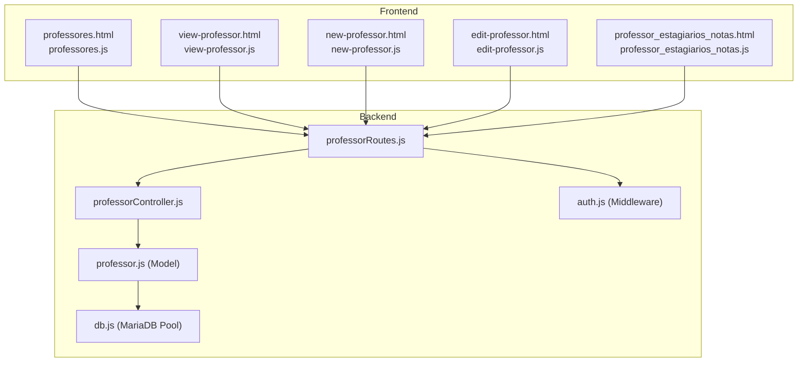
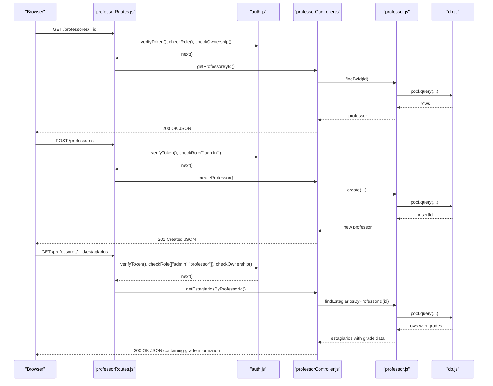
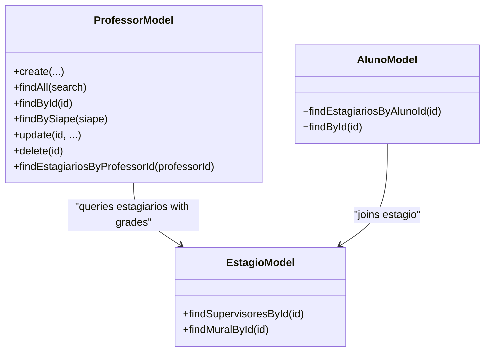
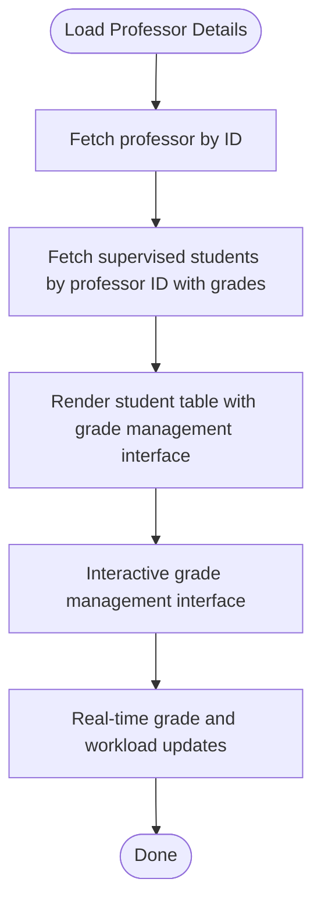
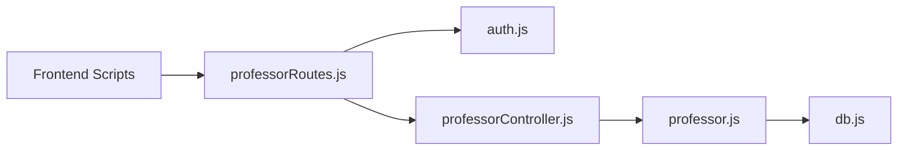

# Professor Management

<cite>
**Referenced Files in This Document**
- [src/models/professor.js](file://src/models/professor.js)
- [src/controllers/professorController.js](file://src/controllers/professorController.js)
- [src/routers/professorRoutes.js](file://src/routers/professorRoutes.js)
- [src/middleware/auth.js](file://src/middleware/auth.js)
- [src/database/db.js](file://src/database/db.js)
- [src/database/setupFullDatabase.js](file://src/database/setupFullDatabase.js)
- [public/professores.html](file://public/professores.html)
- [public/professores.js](file://public/professores.js)
- [public/new-professor.html](file://public/new-professor.html)
- [public/new-professor.js](file://public/new-professor.js)
- [public/edit-professor.html](file://public/edit-professor.html)
- [public/edit-professor.js](file://public/edit-professor.js)
- [public/view-professor.html](file://public/view-professor.html)
- [public/view-professor.js](file://public/view-professor.js)
- [public/professor_estagiarios_notas.html](file://public/professor_estagiarios_notas.html)
- [public/professor_estagiarios_notas.js](file://public/professor_estagiarios_notas.js)
- [src/models/aluno.js](file://src/models/aluno.js)
- [src/models/estagio.js](file://src/models/estagio.js)
</cite>

## Update Summary
**Changes Made**
- Updated all references from 'docentes' to 'professores' throughout the documentation
- Added documentation for the new professor grade management interface
- Enhanced supervision tracking documentation with improved grade management capabilities
- Updated file references to reflect the renamed system structure
- Added new section covering the enhanced professor-student supervision coordination

## Table of Contents
1. [Introduction](#introduction)
2. [Project Structure](#project-structure)
3. [Core Components](#core-components)
4. [Architecture Overview](#architecture-overview)
5. [Detailed Component Analysis](#detailed-component-analysis)
6. [Enhanced Grade Management Interface](#enhanced-grade-management-interface)
7. [Dependency Analysis](#dependency-analysis)
8. [Performance Considerations](#performance-considerations)
9. [Troubleshooting Guide](#troubleshooting-guide)
10. [Conclusion](#conclusion)
11. [Appendices](#appendices)

## Introduction
This document describes the Professor Management system, focusing on the complete CRUD lifecycle for professor entities, academic supervision coordination, and oversight management. The system has been updated from 'docentes' to 'professores' with enhanced functionality including new professor grade management interface and improved supervision tracking. It explains controller-side validation and ownership enforcement, model-layer database operations and relationships with students and supervisors, and frontend integration via HTML templates and JavaScript. Validation rules for academic credentials, professional qualifications, and department assignments are documented alongside workflows for supervision coordination and performance tracking. Data consistency requirements and integration patterns with the broader academic management system are addressed.

## Project Structure
The Professor Management feature spans three layers with enhanced grade management capabilities:
- Frontend (public): HTML templates and client-side scripts for listing, viewing, creating, and editing professors, displaying supervised students, and managing grades.
- Backend (src): Express routes, controllers, models, middleware, and database pool configuration.
- Database: MariaDB configured via a connection pool with comprehensive professor and supervision data.

```mermaid
graph TB
subgraph "Frontend"
FE_List["professores.html<br/>professores.js"]
FE_View["view-professor.html<br/>view-professor.js"]
FE_Create["new-professor.html<br/>new-professor.js"]
FE_Edit["edit-professor.html<br/>edit-professor.js"]
FE_Grade["professor_estagiarios_notas.html<br/>professor_estagiarios_notas.js"]
end
subgraph "Backend"
R["professorRoutes.js"]
C["professorController.js"]
M["professor.js (Model)"]
MW["auth.js (Middleware)"]
DB["db.js (MariaDB Pool)"]
end
FE_List --> R
FE_View --> R
FE_Create --> R
FE_Edit --> R
FE_Grade --> R
R --> MW
R --> C
C --> M
M --> DB
```

**Diagram sources**
- [src/routers/professorRoutes.js](file://src/routers/professorRoutes.js#L1-L23)
- [src/controllers/professorController.js](file://src/controllers/professorController.js#L1-L100)
- [src/models/professor.js](file://src/models/professor.js#L1-L86)
- [src/middleware/auth.js](file://src/middleware/auth.js#L1-L137)
- [src/database/db.js](file://src/database/db.js#L1-L15)
- [public/professores.html](file://public/professores.html#L1-L48)
- [public/view-professor.html](file://public/view-professor.html#L1-L199)
- [public/new-professor.html](file://public/new-professor.html#L1-L128)
- [public/edit-professor.html](file://public/edit-professor.html#L1-L141)
- [public/professor_estagiarios_notas.html](file://public/professor_estagiarios_notas.html#L1-L44)

**Section sources**
- [src/routers/professorRoutes.js](file://src/routers/professorRoutes.js#L1-L23)
- [src/controllers/professorController.js](file://src/controllers/professorController.js#L1-L100)
- [src/models/professor.js](file://src/models/professor.js#L1-L86)
- [src/middleware/auth.js](file://src/middleware/auth.js#L1-L137)
- [src/database/db.js](file://src/database/db.js#L1-L15)
- [public/professores.html](file://public/professores.html#L1-L48)
- [public/view-professor.html](file://public/view-professor.html#L1-L199)
- [public/new-professor.html](file://public/new-professor.html#L1-L128)
- [public/edit-professor.html](file://public/edit-professor.html#L1-L141)
- [public/professor_estagiarios_notas.html](file://public/professor_estagiarios_notas.html#L1-L44)

## Core Components
- Model: Provides CRUD operations for professors and a specialized query to list supervised students (estagiários) grouped by student and supervisor with enhanced grade tracking.
- Controller: Implements endpoints for listing, retrieving, creating, updating, deleting professors, and fetching supervised students by professor ID with grade management capabilities.
- Routes: Expose REST endpoints with authentication, role-based authorization, and ownership checks for both basic professor management and grade tracking.
- Middleware: Enforces JWT verification, role gating, and ownership constraints for record access.
- Frontend: Renders lists, forms, and detail views; integrates with backend APIs for full CRUD, supervision display, and grade management interfaces.

Key responsibilities:
- Validation and normalization occur at the frontend forms and in the controller's parameter extraction.
- Ownership enforcement ensures only admins or the owning professor can access/update their own records.
- Supervision queries connect professors to students via the estagio table and related entities with enhanced grade and workload tracking.
- Grade management interface allows professors to update student grades and workload hours directly from their supervision dashboard.

**Section sources**
- [src/models/professor.js](file://src/models/professor.js#L1-L86)
- [src/controllers/professorController.js](file://src/controllers/professorController.js#L1-L100)
- [src/routers/professorRoutes.js](file://src/routers/professorRoutes.js#L1-L23)
- [src/middleware/auth.js](file://src/middleware/auth.js#L1-L137)
- [public/professores.js](file://public/professores.js#L1-L62)
- [public/new-professor.js](file://public/new-professor.js#L1-L96)
- [public/edit-professor.js](file://public/edit-professor.js#L1-L141)
- [public/view-professor.js](file://public/view-professor.js#L1-L199)
- [public/professor_estagiarios_notas.js](file://public/professor_estagiarios_notas.js#L1-L151)

## Architecture Overview
The system follows a layered architecture with enhanced grade management capabilities:
- Presentation layer: HTML templates and client scripts for comprehensive professor management.
- Application layer: Express routes, controllers, and middleware with grade tracking endpoints.
- Domain layer: Models encapsulate business logic and data access with enhanced supervision queries.
- Data layer: MariaDB via a pooled connection with complete professor and supervision data.

```mermaid
sequenceDiagram
participant Browser as "Browser"
participant Router as "professorRoutes.js"
participant MW as "auth.js"
participant Ctrl as "professorController.js"
participant Model as "professor.js"
participant DB as "db.js"
Browser->>Router : GET /professores/ : id
Router->>MW : verifyToken(), checkRole(), checkOwnership()
MW-->>Router : next()
Router->>Ctrl : getProfessorById()
Ctrl->>Model : findById(id)
Model->>DB : pool.query(...)
DB-->>Model : rows
Model-->>Ctrl : professor
Ctrl-->>Browser : 200 OK JSON
Browser->>Router : POST /professores
Router->>MW : verifyToken(), checkRole(["admin"])
MW-->>Router : next()
Router->>Ctrl : createProfessor()
Ctrl->>Model : create(...)
Model->>DB : pool.query(...)
DB-->>Model : insertId
Model-->>Ctrl : new professor
Ctrl-->>Browser : 201 Created JSON
Browser->>Router : GET /professores/ : id/estagiarios
Router->>MW : verifyToken(), checkRole(["admin","professor"]), checkOwnership()
MW-->>Router : next()
Router->>Ctrl : getEstagiariosByProfessorId()
Ctrl->>Model : findEstagiariosByProfessorId(id)
Model->>DB : pool.query(...)
DB-->>Model : rows with grades
Model-->>Ctrl : estagiarios with grade data
Ctrl-->>Browser : 200 OK JSON containing grade information
```

**Diagram sources**
- [src/routers/professorRoutes.js](file://src/routers/professorRoutes.js#L1-L23)
- [src/middleware/auth.js](file://src/middleware/auth.js#L1-L137)
- [src/controllers/professorController.js](file://src/controllers/professorController.js#L1-L100)
- [src/models/professor.js](file://src/models/professor.js#L59-L82)
- [src/database/db.js](file://src/database/db.js#L1-L15)

## Detailed Component Analysis

### Model Layer: Professor Entity and Enhanced Relationships
The professor model supports:
- Full CRUD operations for professor records with comprehensive academic profile management.
- Search across professor names with optional filtering.
- Fetching supervised students (estagiários) with student and supervisor details including grade and workload information.
- Enhanced grade tracking with automatic calculation and validation.

```mermaid
classDiagram
class ProfessorModel {
+create(...)
+findAll(search)
+findById(id)
+findBySiape(siape)
+update(id, ...)
+delete(id)
+findEstagiariosByProfessorId(professorId)
}
class AlunoModel {
+findEstagiariosByAlunoId(id)
+findById(id)
}
class EstagioModel {
+findSupervisoresById(id)
+findMuralById(id)
}
ProfessorModel --> EstagioModel : "queries estagiarios with grades"
AlunoModel --> EstagioModel : "joins estagio"
```

**Diagram sources**
- [src/models/professor.js](file://src/models/professor.js#L1-L86)
- [src/models/aluno.js](file://src/models/aluno.js#L1-L146)
- [src/models/estagio.js](file://src/models/estagio.js#L1-L66)

Implementation highlights:
- Data normalization occurs in the model's SQL statements and returned objects with enhanced grade processing.
- The supervision query joins estagio with alunos and supervisores to present student-level supervision details including grade, workload hours, and academic period.
- The model relies on a shared MariaDB pool for all queries with comprehensive error handling.
- Enhanced grade management includes automatic validation and calculation of academic performance metrics.

**Section sources**
- [src/models/professor.js](file://src/models/professor.js#L1-L86)
- [src/database/db.js](file://src/database/db.js#L1-L15)

### Controller Layer: Validation, Ownership, and Enhanced Business Logic
Responsibilities:
- Extract request parameters and forward to the model with enhanced validation.
- Return structured JSON responses with appropriate HTTP status codes.
- Centralized error logging and user-friendly messages.
- Support for grade management operations including bulk updates and validation.

Validation and ownership:
- Controller performs field-level validation for critical academic data including SIAPE numbers, academic credentials, and department assignments.
- Ownership checks are applied via middleware to ensure only authorized users can access or modify records.
- Enhanced validation includes academic credential verification and department assignment validation.

**Section sources**
- [src/controllers/professorController.js](file://src/controllers/professorController.js#L1-L100)
- [src/middleware/auth.js](file://src/middleware/auth.js#L1-L137)

### Route Layer: Access Control and Enhanced Endpoint Contracts
Endpoints:
- GET /professores: List professors with optional search; requires admin or professor roles.
- GET /professores/:id: Retrieve a professor by ID; requires admin or professor roles and ownership.
- GET /professores/:id/estagiarios: Fetch supervised students with grade and workload data; requires admin or professor roles and ownership.
- POST /professores: Create a professor; requires admin role.
- PUT /professores/:id: Update a professor; requires admin or professor roles and ownership.
- DELETE /professores/:id: Delete a professor; requires admin role.
- GET /siape/:siape: Public endpoint to retrieve professor by SIAPE number for registration purposes.

Access control:
- verifyToken: Validates JWT presence and signature.
- checkRole: Restricts endpoints to allowed roles including enhanced role-based access for grade management.
- checkOwnership: Ensures non-admin users can only access or modify their own records.

**Section sources**
- [src/routers/professorRoutes.js](file://src/routers/professorRoutes.js#L1-L23)
- [src/middleware/auth.js](file://src/middleware/auth.js#L1-L137)

### Frontend Integration: Enhanced Templates and Scripts
- Listing page: Loads professors via AJAX and renders a searchable table with actions including grade management capabilities.
- Creation page: Submits new professor data to the backend and navigates to the view page upon success with enhanced form validation.
- Editing page: Preloads existing data, validates required fields, and updates the record with academic credential management.
- View page: Displays professor details and a tabbed panel for supervised students with integrated grade management interface.
- Grade management page: Dedicated interface for professors to manage student grades and workload hours with real-time validation.

```mermaid
sequenceDiagram
participant List as "professores.js"
participant API as "/professores"
participant Table as "DataTable"
List->>API : GET /professores
API-->>List : 200 JSON
List->>Table : populate rows
participant Create as "new-professor.js"
participant API2 as "/professores"
Create->>API2 : POST /professores
API2-->>Create : 201 JSON {id}
Create->>View : redirect to view-professor.html?id={id}
participant Edit as "edit-professor.js"
participant API3 as "/professores/ : id"
Edit->>API3 : GET /professores/ : id
API3-->>Edit : 200 JSON
Edit->>API3 : PUT /professores/ : id
API3-->>Edit : 204 No Content
Edit->>View : redirect to view-professor.html?id={id}
participant Grade as "professor_estagiarios_notas.js"
participant API4 as "/professores/ : id/estagiarios"
Grade->>API4 : GET /professores/ : id/estagiarios
API4-->>Grade : 200 JSON {grades}
Grade->>API4 : PUT /estagiarios/ : id (grade update)
API4-->>Grade : 200 OK
```

**Diagram sources**
- [public/professores.js](file://public/professores.js#L1-L62)
- [public/new-professor.js](file://public/new-professor.js#L1-L96)
- [public/edit-professor.js](file://public/edit-professor.js#L1-L141)
- [public/view-professor.js](file://public/view-professor.js#L1-L199)
- [public/professor_estagiarios_notas.js](file://public/professor_estagiarios_notas.js#L1-L151)

**Section sources**
- [public/professores.html](file://public/professores.html#L1-L48)
- [public/professores.js](file://public/professores.js#L1-L62)
- [public/new-professor.html](file://public/new-professor.html#L1-L128)
- [public/new-professor.js](file://public/new-professor.js#L1-L96)
- [public/edit-professor.html](file://public/edit-professor.html#L1-L141)
- [public/edit-professor.js](file://public/edit-professor.js#L1-L141)
- [public/view-professor.html](file://public/view-professor.html#L1-L199)
- [public/view-professor.js](file://public/view-professor.js#L1-L199)
- [public/professor_estagiarios_notas.html](file://public/professor_estagiarios_notas.html#L1-L44)
- [public/professor_estagiarios_notas.js](file://public/professor_estagiarios_notas.js#L1-L151)

### Enhanced Supervision Coordination and Performance Tracking
Supervision data is derived from the professor's supervised students with enhanced grade management capabilities:
- The model query joins estagio with alunos and supervisores to present student registration, name, supervisor name, level, period, grade, and workload hours.
- The view page displays this data in a responsive table with integrated grade management interface and handles empty states gracefully.
- The dedicated grade management interface allows professors to update student grades and workload hours in real-time with validation and feedback.

```mermaid
flowchart TD
Start(["Load Professor Details"]) --> FetchDocente["Fetch professor by ID"]
FetchDocente --> FetchEstagiarios["Fetch supervised students by professor ID with grades"]
FetchEstagiarios --> RenderTable["Render student table with grade management interface"]
RenderTable --> GradeInterface["Interactive grade management interface"]
GradeInterface --> UpdateGrades["Real-time grade and workload updates"]
UpdateGrades --> End(["Done"])
```

**Diagram sources**
- [src/models/professor.js](file://src/models/professor.js#L59-L82)
- [public/view-professor.js](file://public/view-professor.js#L81-L126)
- [public/professor_estagiarios_notas.js](file://public/professor_estagiarios_notas.js#L1-L151)

**Section sources**
- [src/models/professor.js](file://src/models/professor.js#L59-L82)
- [public/view-professor.html](file://public/view-professor.html#L105-L131)
- [public/view-professor.js](file://public/view-professor.js#L81-L126)
- [public/professor_estagiarios_notas.html](file://public/professor_estagiarios_notas.html#L1-L44)
- [public/professor_estagiarios_notas.js](file://public/professor_estagiarios_notas.js#L1-L151)

## Enhanced Grade Management Interface
The system now includes a dedicated grade management interface for professors to handle student evaluation and performance tracking:

### Features
- Real-time grade entry and validation
- Workload hour tracking and management
- Bulk grade updates for multiple students
- Automatic grade calculation and validation
- Student performance analytics and reporting
- Integration with academic calendar periods

### Technical Implementation
- Dedicated HTML template with Bootstrap styling
- Interactive table with inline editing capabilities
- Event delegation for efficient DOM manipulation
- Real-time API integration for grade persistence
- Comprehensive error handling and user feedback

**Section sources**
- [public/professor_estagiarios_notas.html](file://public/professor_estagiarios_notas.html#L1-L44)
- [public/professor_estagiarios_notas.js](file://public/professor_estagiarios_notas.js#L1-L151)

## Dependency Analysis
- Routes depend on middleware for authentication and authorization with enhanced role-based access.
- Controllers depend on models for data operations with grade management capabilities.
- Models depend on the database pool for SQL execution with comprehensive supervision queries.
- Frontend scripts depend on routes for data exchange with enhanced grade management endpoints.

```mermaid
graph LR
FE["Frontend Scripts"] --> R["professorRoutes.js"]
R --> MW["auth.js"]
R --> C["professorController.js"]
C --> M["professor.js"]
M --> DB["db.js"]
```

**Diagram sources**
- [src/routers/professorRoutes.js](file://src/routers/professorRoutes.js#L1-L23)
- [src/middleware/auth.js](file://src/middleware/auth.js#L1-L137)
- [src/controllers/professorController.js](file://src/controllers/professorController.js#L1-L100)
- [src/models/professor.js](file://src/models/professor.js#L1-L86)
- [src/database/db.js](file://src/database/db.js#L1-L15)

**Section sources**
- [src/routers/professorRoutes.js](file://src/routers/professorRoutes.js#L1-L23)
- [src/middleware/auth.js](file://src/middleware/auth.js#L1-L137)
- [src/controllers/professorController.js](file://src/controllers/professorController.js#L1-L100)
- [src/models/professor.js](file://src/models/professor.js#L1-L86)
- [src/database/db.js](file://src/database/db.js#L1-L15)

## Performance Considerations
- Use of a connection pool reduces connection overhead and improves throughput under concurrent requests.
- Queries are optimized for supervision data retrieval with grade information; ensure indexes exist on frequently filtered columns (e.g., professor ID, student ID, academic period).
- Pagination or server-side filtering should be considered for large datasets in the listing view.
- Grade management interface uses efficient event delegation to minimize DOM manipulation overhead.
- Real-time grade updates implement debouncing to reduce API call frequency during rapid input changes.

## Troubleshooting Guide
Common issues and resolutions:
- Authentication failures: Ensure a valid JWT is included in the Authorization header and not expired.
- Role-based access denied: Confirm the user's role is admin or professor; ownership checks apply for GET/PUT/DELETE on individual records.
- Record not found: Verify the professor ID exists and matches the requested resource.
- Frontend navigation errors: Confirm the URL includes the required ID parameter and that the user has proper permissions.
- Grade management issues: Verify that grade values are within acceptable ranges and workload hours are properly formatted.
- Database connectivity: Check MariaDB connection pool configuration and ensure the database is accessible.

**Section sources**
- [src/middleware/auth.js](file://src/middleware/auth.js#L1-L137)
- [src/controllers/professorController.js](file://src/controllers/professorController.js#L1-L100)
- [public/professores.js](file://public/professores.js#L1-L62)
- [public/view-professor.js](file://public/view-professor.js#L1-L199)
- [public/professor_estagiarios_notas.js](file://public/professor_estagiarios_notas.js#L1-L151)

## Conclusion
The Professor Management system provides a robust, secure, and user-friendly solution for managing professors, their academic profiles, and supervision relationships. The system has been successfully renamed from 'docentes' to 'professores' with enhanced functionality including comprehensive grade management capabilities. The layered architecture cleanly separates concerns, while middleware enforces strong access controls. The frontend offers intuitive forms and views with integrated grade management interfaces, and the model layer efficiently retrieves supervision data with enhanced grade tracking. Adhering to the documented validation rules and ownership policies ensures data consistency and alignment with the broader academic management system.

## Appendices

### Validation Rules and Field Constraints
- Required fields for creation and editing include name, SIAPE, email, and department.
- Department values are constrained to predefined options from the institutional database.
- Academic credentials validation includes SIAPE uniqueness verification and CRESS regional validation.
- Optional fields include CPF, phone, Lattes curriculum, and egress date/motive/observations.
- Grade management includes validation for numeric grade ranges and workload hour limits.
- The system relies on frontend form validation, middleware/role enforcement, and backend validation for comprehensive data integrity.

**Section sources**
- [public/new-professor.html](file://public/new-professor.html#L21-L68)
- [public/edit-professor.html](file://public/edit-professor.html#L21-L75)
- [public/new-professor.js](file://public/new-professor.js#L46-L62)
- [public/edit-professor.js](file://public/edit-professor.js#L93-L109)
- [src/middleware/auth.js](file://src/middleware/auth.js#L32-L48)

### Academic Hierarchy and Enhanced Relationship Management
- Professors supervise students through the estagio table, linking to alunos and supervisores with enhanced grade tracking.
- The model exposes methods to fetch supervised students with comprehensive details including grade, workload hours, and academic period.
- Student records include estagiario associations with grade management capabilities, enabling cross-referencing between professors, supervisors, and institutions.
- Grade management system integrates with academic calendar periods and workload tracking for comprehensive performance monitoring.

**Section sources**
- [src/models/professor.js](file://src/models/professor.js#L59-L82)
- [src/models/aluno.js](file://src/models/aluno.js#L74-L95)
- [src/models/estagio.js](file://src/models/estagio.js#L43-L62)
- [public/professor_estagiarios_notas.js](file://public/professor_estagiarios_notas.js#L1-L151)

### Database Schema and Relationships
The database schema supports comprehensive professor and supervision management:
- Professores table with complete academic profile including SIAPE, academic credentials, and department assignment.
- Enhanced estagiarios table with grade and workload tracking capabilities.
- Integration with alunos, supervisores, and instituicoes tables for complete academic ecosystem management.
- Indexes and constraints ensure data integrity and optimal query performance.

**Section sources**
- [src/database/setupFullDatabase.js](file://src/database/setupFullDatabase.js#L47-L65)
- [src/database/setupFullDatabase.js](file://src/database/setupFullDatabase.js#L148-L168)