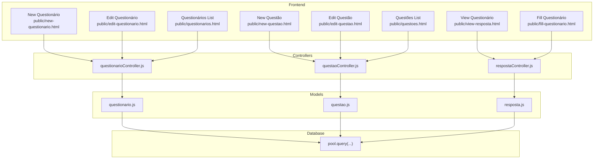
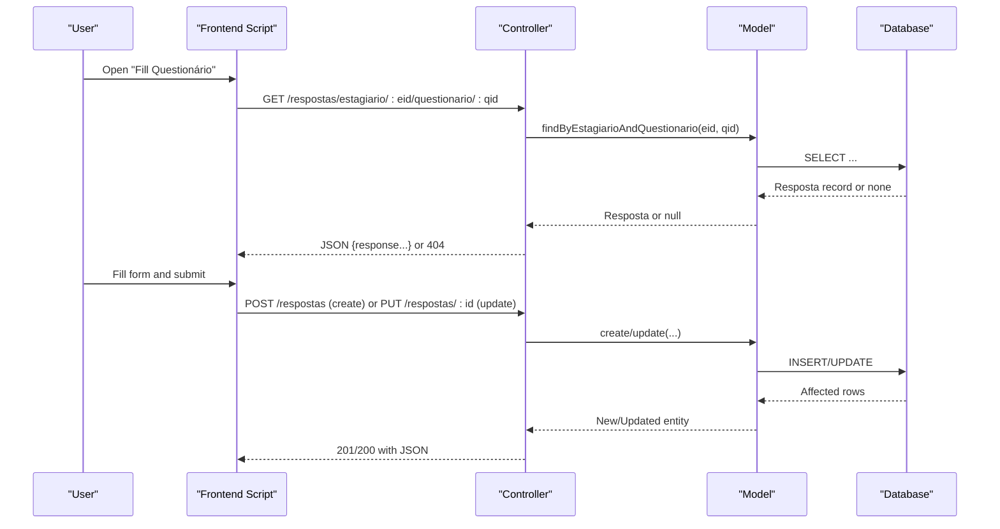
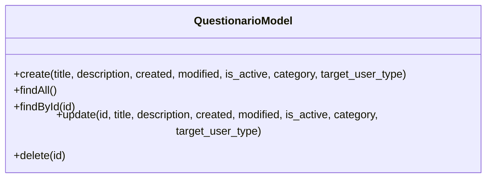
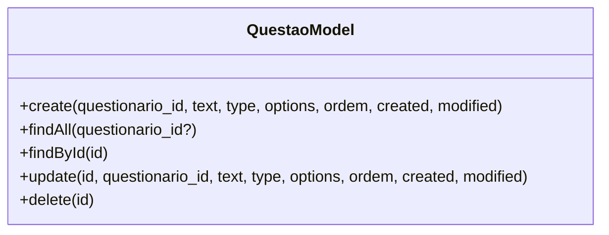
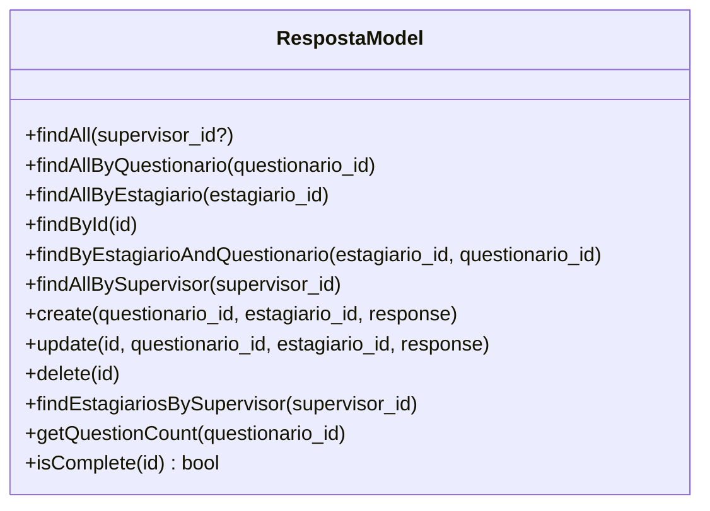
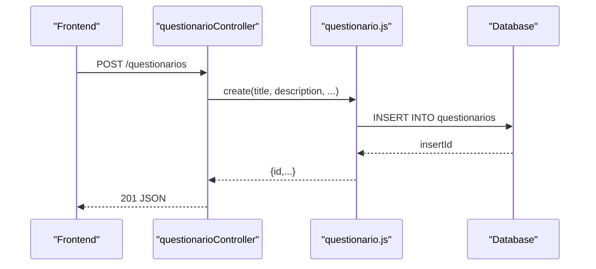
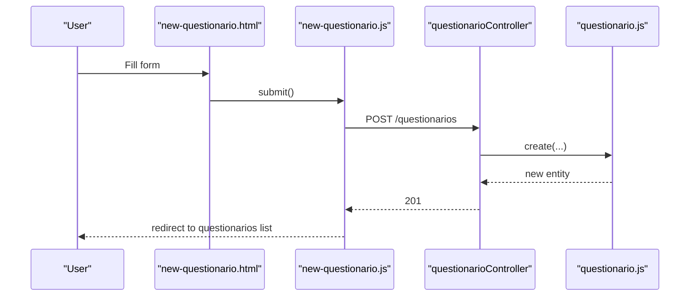
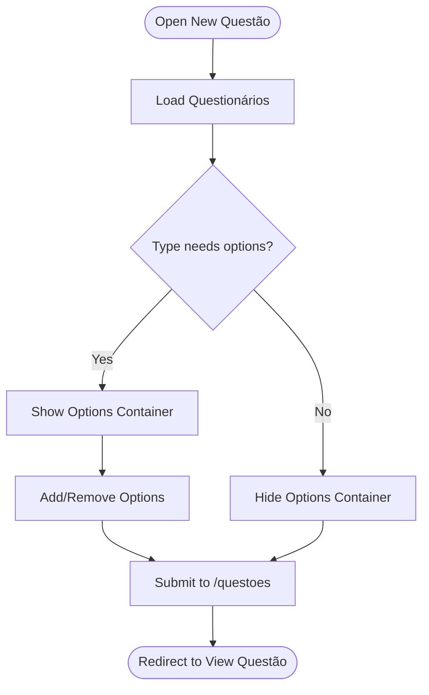
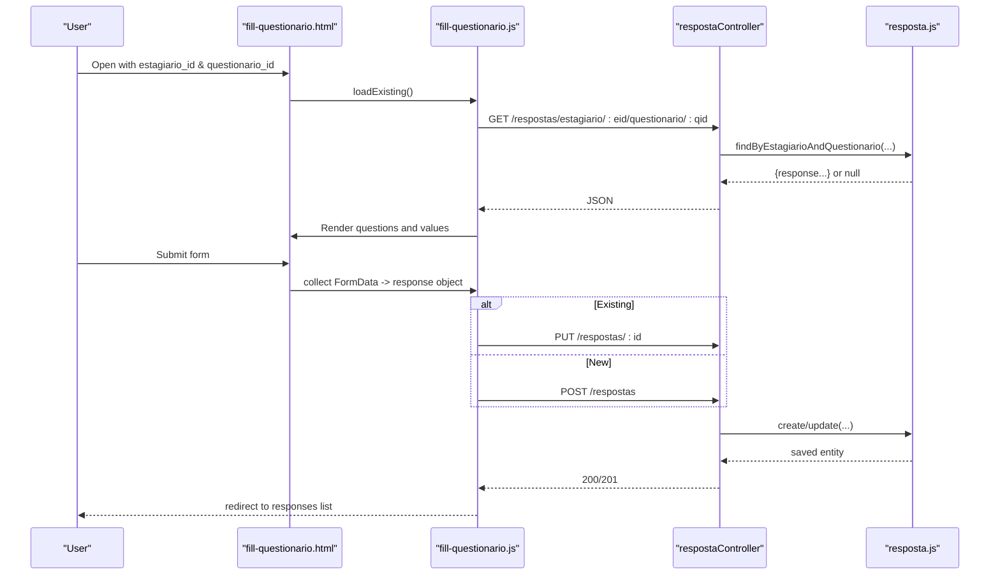
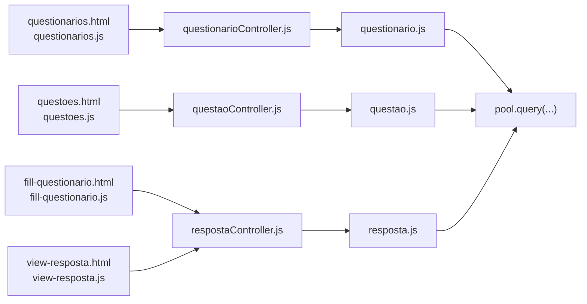

# Questionnaire & Assessment System

<cite>
**Referenced Files in This Document**
- [src/models/questionario.js](file://src/models/questionario.js)
- [src/models/questao.js](file://src/models/questao.js)
- [src/models/resposta.js](file://src/models/resposta.js)
- [src/controllers/questionarioController.js](file://src/controllers/questionarioController.js)
- [src/controllers/questaoController.js](file://src/controllers/questaoController.js)
- [src/controllers/respostaController.js](file://src/controllers/respostaController.js)
- [public/new-questionario.html](file://public/new-questionario.html)
- [public/edit-questionario.html](file://public/edit-questionario.html)
- [public/questionarios.html](file://public/questionarios.html)
- [public/new-questao.html](file://public/new-questao.html)
- [public/edit-questao.html](file://public/edit-questao.html)
- [public/questoes.html](file://public/questoes.html)
- [public/fill-questionario.html](file://public/fill-questionario.html)
- [public/view-resposta.html](file://public/view-resposta.html)
- [public/new-questionario.js](file://public/new-questionario.js)
- [public/edit-questionario.js](file://public/edit-questionario.js)
- [public/questionarios.js](file://public/questionarios.js)
- [public/new-questao.js](file://public/new-questao.js)
- [public/edit-questao.js](file://public/edit-questao.js)
- [public/questoes.js](file://public/questoes.js)
- [public/fill-questionario.js](file://public/fill-questionario.js)
- [public/view-resposta.js](file://public/view-resposta.js)
</cite>

## Table of Contents
1. [Introduction](#introduction)
2. [Project Structure](#project-structure)
3. [Core Components](#core-components)
4. [Architecture Overview](#architecture-overview)
5. [Detailed Component Analysis](#detailed-component-analysis)
6. [Dependency Analysis](#dependency-analysis)
7. [Performance Considerations](#performance-considerations)
8. [Troubleshooting Guide](#troubleshooting-guide)
9. [Conclusion](#conclusion)
10. [Appendices](#appendices)

## Introduction
This document describes the Questionnaire & Assessment System, focusing on the complete CRUD lifecycle for questionnaires, questions, and responses. It explains backend controller logic for validation, sequencing, response collection, and assessment scoring, along with the model layer’s database operations and relationships. It also documents frontend integration via HTML templates and JavaScript handlers for creation, management, filling, and evaluation. Validation rules, scoring considerations, distribution workflows, and performance strategies for concurrent usage are included, alongside integration patterns with student and professor management systems.

## Project Structure
The system follows a layered architecture:
- Frontend: Static HTML pages and client-side scripts under public/.
- Backend: Controllers, Models, Routes, and a shared database connection pool.
- Routing: Routers map HTTP endpoints to controllers.

**Diagram sources**
- [src/controllers/questionarioController.js](file://src/controllers/questionarioController.js#L1-L72)
- [src/controllers/questaoController.js](file://src/controllers/questaoController.js#L1-L72)
- [src/controllers/respostaController.js](file://src/controllers/respostaController.js#L1-L169)
- [src/models/questionario.js](file://src/models/questionario.js#L1-L38)
- [src/models/questao.js](file://src/models/questao.js#L1-L53)
- [src/models/resposta.js](file://src/models/resposta.js#L1-L183)
- [public/view-resposta.html](file://public/view-resposta.html#L1-L52)
- [public/fill-questionario.html](file://public/fill-questionario.html#L1-L89)
- [public/new-questionario.html](file://public/new-questionario.html#L1-L66)
- [public/edit-questionario.html](file://public/edit-questionario.html#L1-L57)
- [public/questionarios.html](file://public/questionarios.html#L1-L53)
- [public/new-questao.html](file://public/new-questao.html#L1-L64)
- [public/edit-questao.html](file://public/edit-questao.html#L1-L72)
- [public/questoes.html](file://public/questoes.html#L1-L48)

**Section sources**
- [src/controllers/questionarioController.js](file://src/controllers/questionarioController.js#L1-L72)
- [src/controllers/questaoController.js](file://src/controllers/questaoController.js#L1-L72)
- [src/controllers/respostaController.js](file://src/controllers/respostaController.js#L1-L169)
- [src/models/questionario.js](file://src/models/questionario.js#L1-L38)
- [src/models/questao.js](file://src/models/questao.js#L1-L53)
- [src/models/resposta.js](file://src/models/resposta.js#L1-L183)
- [public/questionarios.html](file://public/questionarios.html#L1-L53)
- [public/questoes.html](file://public/questoes.html#L1-L48)
- [public/fill-questionario.html](file://public/fill-questionario.html#L1-L89)
- [public/view-resposta.html](file://public/view-resposta.html#L1-L52)

## Core Components
- Questionário (surveys): CRUD endpoints and views for creating, organizing, and managing surveys.
- Questão (questions): CRUD endpoints and views for creating questions with types and options, ordered per survey.
- Resposta (responses): Collection, retrieval, and completeness checks for student responses linked to supervisors.

Key responsibilities:
- Controllers validate inputs and delegate to models.
- Models encapsulate SQL queries and relationships.
- Frontend pages submit forms and render lists, delegating to controllers via AJAX.

**Section sources**
- [src/controllers/questionarioController.js](file://src/controllers/questionarioController.js#L1-L72)
- [src/controllers/questaoController.js](file://src/controllers/questaoController.js#L1-L72)
- [src/controllers/respostaController.js](file://src/controllers/respostaController.js#L1-L169)
- [src/models/questionario.js](file://src/models/questionario.js#L1-L38)
- [src/models/questao.js](file://src/models/questao.js#L1-L53)
- [src/models/resposta.js](file://src/models/resposta.js#L1-L183)

## Architecture Overview
The system uses a classic MVC-like separation:
- Views: HTML templates for creation, editing, listing, and filling questionnaires and questions.
- Controllers: HTTP handlers that process requests, validate parameters, and call models.
- Models: Encapsulate database operations and relationships.
- Database: Shared MySQL connection pool.

**Diagram sources**
- [public/fill-questionario.js](file://public/fill-questionario.js#L1-L290)
- [src/controllers/respostaController.js](file://src/controllers/respostaController.js#L1-L169)
- [src/models/resposta.js](file://src/models/resposta.js#L1-L183)

**Section sources**
- [public/fill-questionario.js](file://public/fill-questionario.js#L1-L290)
- [src/controllers/respostaController.js](file://src/controllers/respostaController.js#L1-L169)
- [src/models/resposta.js](file://src/models/resposta.js#L1-L183)

## Detailed Component Analysis

### Questionário Module
- Responsibilities: Create, list, retrieve by ID, update, and delete questionários.
- Data fields: title, description, category, target_user_type, is_active, timestamps.
- Relationships: Questionários contain multiple Questões via questionario_id.

**Diagram sources**
- [src/models/questionario.js](file://src/models/questionario.js#L1-L38)

**Section sources**
- [src/models/questionario.js](file://src/models/questionario.js#L1-L38)
- [src/controllers/questionarioController.js](file://src/controllers/questionarioController.js#L1-L72)
- [public/new-questionario.js](file://public/new-questionario.js#L1-L38)
- [public/edit-questionario.js](file://public/edit-questionario.js#L1-L61)
- [public/questionarios.js](file://public/questionarios.js#L1-L65)
- [public/questionarios.html](file://public/questionarios.html#L1-L53)

### Questão Module
- Responsibilities: Create, list (with optional filtering by questionário), retrieve by ID, update, delete.
- Data fields: questionario_id, text, type, options (JSON), ordem (order), timestamps.
- Relationships: Each Questão belongs to one Questionário; ordering is enforced.

**Diagram sources**
- [src/models/questao.js](file://src/models/questao.js#L1-L53)

**Section sources**
- [src/models/questao.js](file://src/models/questao.js#L1-L53)
- [src/controllers/questaoController.js](file://src/controllers/questaoController.js#L1-L72)
- [public/new-questao.js](file://public/new-questao.js#L1-L117)
- [public/edit-questao.js](file://public/edit-questao.js#L1-L174)
- [public/questoes.js](file://public/questoes.js#L1-L121)
- [public/questoes.html](file://public/questoes.html#L1-L48)

### Resposta Module
- Responsibilities: Retrieve all responses (with filters), by questionário, by estagiário, by supervisor; create, update, delete; completeness check; list estagiários by supervisor.
- Data fields: questionario_id, estagiario_id, response (JSON object keyed by question identifiers), timestamps.
- Completeness: Compares number of answered keys against total questions in the questionnaire.

**Diagram sources**
- [src/models/resposta.js](file://src/models/resposta.js#L1-L183)

**Section sources**
- [src/models/resposta.js](file://src/models/resposta.js#L1-L183)
- [src/controllers/respostaController.js](file://src/controllers/respostaController.js#L1-L169)
- [public/fill-questionario.js](file://public/fill-questionario.js#L1-L290)
- [public/view-resposta.js](file://public/view-resposta.js#L1-L245)

### Controller Implementation Details
- Questionário Controller: Handles create, list, retrieve, update, delete with error handling and status codes.
- Questão Controller: Handles create, list (filtered by questionário), retrieve, update, delete with error handling.
- Resposta Controller: Handles create, update, delete, retrieval by multiple filters, completeness check, and estagiários lookup.

**Diagram sources**
- [src/controllers/questionarioController.js](file://src/controllers/questionarioController.js#L1-L72)
- [src/models/questionario.js](file://src/models/questionario.js#L1-L38)

**Section sources**
- [src/controllers/questionarioController.js](file://src/controllers/questionarioController.js#L1-L72)
- [src/controllers/questaoController.js](file://src/controllers/questaoController.js#L1-L72)
- [src/controllers/respostaController.js](file://src/controllers/respostaController.js#L1-L169)

### Frontend Integration and Workflows

#### Questionário Creation and Management
- New Questionário page posts to the backend; successful creation navigates to the list.
- Edit Questionário page preloads data and updates via PUT.
- Questionários list integrates with DataTables to render and delete entries.

**Diagram sources**
- [public/new-questionario.html](file://public/new-questionario.html#L1-L66)
- [public/new-questionario.js](file://public/new-questionario.js#L1-L38)
- [src/controllers/questionarioController.js](file://src/controllers/questionarioController.js#L1-L72)
- [src/models/questionario.js](file://src/models/questionario.js#L1-L38)

**Section sources**
- [public/new-questionario.html](file://public/new-questionario.html#L1-L66)
- [public/edit-questionario.html](file://public/edit-questionario.html#L1-L57)
- [public/questionarios.html](file://public/questionarios.html#L1-L53)
- [public/new-questionario.js](file://public/new-questionario.js#L1-L38)
- [public/edit-questionario.js](file://public/edit-questionario.js#L1-L61)
- [public/questionarios.js](file://public/questionarios.js#L1-L65)

#### Questão Creation and Management
- New Questão page loads available questionários, supports dynamic options for specific types, and submits to backend.
- Edit Questão page loads existing data and options, supports dynamic option management.
- Questões list supports filtering by questionário and deletion.

**Diagram sources**
- [public/new-questao.html](file://public/new-questao.html#L1-L64)
- [public/new-questao.js](file://public/new-questao.js#L1-L117)
- [public/edit-questao.html](file://public/edit-questao.html#L1-L72)
- [public/edit-questao.js](file://public/edit-questao.js#L1-L174)
- [public/questoes.html](file://public/questoes.html#L1-L48)
- [public/questoes.js](file://public/questoes.js#L1-L121)

**Section sources**
- [public/new-questao.html](file://public/new-questao.html#L1-L64)
- [public/edit-questao.html](file://public/edit-questao.html#L1-L72)
- [public/questoes.html](file://public/questoes.html#L1-L48)
- [public/new-questao.js](file://public/new-questao.js#L1-L117)
- [public/edit-questao.js](file://public/edit-questao.js#L1-L174)
- [public/questoes.js](file://public/questoes.js#L1-L121)

#### Response Collection and Evaluation
- Fill Questionário page loads questionário and estagiário metadata, preloads existing responses if any, renders questions by type, and submits to backend.
- View Resposta page displays responses for review and allows editing or deletion.

**Diagram sources**
- [public/fill-questionario.html](file://public/fill-questionario.html#L1-L89)
- [public/fill-questionario.js](file://public/fill-questionario.js#L1-L290)
- [src/controllers/respostaController.js](file://src/controllers/respostaController.js#L1-L169)
- [src/models/resposta.js](file://src/models/resposta.js#L1-L183)

**Section sources**
- [public/fill-questionario.html](file://public/fill-questionario.html#L1-L89)
- [public/view-resposta.html](file://public/view-resposta.html#L1-L52)
- [public/fill-questionario.js](file://public/fill-questionario.js#L1-L290)
- [public/view-resposta.js](file://public/view-resposta.js#L1-L245)
- [src/controllers/respostaController.js](file://src/controllers/respostaController.js#L1-L169)
- [src/models/resposta.js](file://src/models/resposta.js#L1-L183)

### Validation Rules and Scoring Considerations
- Questionário:
  - Required fields: title.
  - Optional: description, category, target_user_type, is_active flag.
- Questão:
  - Required: questionario_id, text, type, ordem.
  - Options: required for radio, checkbox, select; stored as JSON array or object.
  - Ordering: enforced by ordem and query sorting.
- Resposta:
  - Uniqueness: Prevents duplicate responses per estagiario_id and questionario_id.
  - Completeness: Checks that the number of answered keys equals the number of questions in the questionnaire.
  - Response format: response is a JSON object keyed by question identifiers (legacy format uses prefixed keys).

Scoring algorithms are not implemented in the provided code; scoring would require:
- Mapping question types to score weights.
- Aggregating response values per estagiario_id and questionario_id.
- Storing computed scores and linking to supervisors for reporting.

**Section sources**
- [src/controllers/questionarioController.js](file://src/controllers/questionarioController.js#L1-L72)
- [src/controllers/questaoController.js](file://src/controllers/questaoController.js#L1-L72)
- [src/controllers/respostaController.js](file://src/controllers/respostaController.js#L1-L169)
- [src/models/resposta.js](file://src/models/resposta.js#L158-L179)

### Distribution and Reporting Workflow
- Distribution:
  - Associate questionários to target_user_type for visibility.
  - Link responses to estagiários and supervisors via estagiario_id and supervisor_id.
- Response processing:
  - On submission, responses are validated for duplicates and completeness.
  - Responses are aggregated per estagiario_id and questionario_id.
- Evaluation reporting:
  - Use findAllBySupervisor to filter responses by supervisor.
  - Use findAllByQuestionario to compile cohort-level insights.
  - Use findEstagiariosBySupervisor to list students under supervision.

**Section sources**
- [src/models/resposta.js](file://src/models/resposta.js#L7-L113)
- [src/controllers/respostaController.js](file://src/controllers/respostaController.js#L1-L169)

## Dependency Analysis
- Controllers depend on Models.
- Models depend on the shared database pool.
- Frontend scripts depend on controllers via HTTP endpoints.
- No circular dependencies observed among controllers and models.

**Diagram sources**
- [public/questionarios.js](file://public/questionarios.js#L1-L65)
- [public/questoes.js](file://public/questoes.js#L1-L121)
- [public/fill-questionario.js](file://public/fill-questionario.js#L1-L290)
- [public/view-resposta.js](file://public/view-resposta.js#L1-L245)
- [src/controllers/questionarioController.js](file://src/controllers/questionarioController.js#L1-L72)
- [src/controllers/questaoController.js](file://src/controllers/questaoController.js#L1-L72)
- [src/controllers/respostaController.js](file://src/controllers/respostaController.js#L1-L169)
- [src/models/questionario.js](file://src/models/questionario.js#L1-L38)
- [src/models/questao.js](file://src/models/questao.js#L1-L53)
- [src/models/resposta.js](file://src/models/resposta.js#L1-L183)

**Section sources**
- [public/questionarios.js](file://public/questionarios.js#L1-L65)
- [public/questoes.js](file://public/questoes.js#L1-L121)
- [public/fill-questionario.js](file://public/fill-questionario.js#L1-L290)
- [public/view-resposta.js](file://public/view-resposta.js#L1-L245)
- [src/controllers/questionarioController.js](file://src/controllers/questionarioController.js#L1-L72)
- [src/controllers/questaoController.js](file://src/controllers/questaoController.js#L1-L72)
- [src/controllers/respostaController.js](file://src/controllers/respostaController.js#L1-L169)
- [src/models/questionario.js](file://src/models/questionario.js#L1-L38)
- [src/models/questao.js](file://src/models/questao.js#L1-L53)
- [src/models/resposta.js](file://src/models/resposta.js#L1-L183)

## Performance Considerations
- Database:
  - Use indexed columns for frequent filters (questionario_id, estagiario_id, supervisor_id).
  - Batch operations for bulk inserts/updates when extending functionality.
- Frontend:
  - Lazy-load question lists and avoid re-rendering entire tables unnecessarily.
  - Debounce search/filter operations in DataTables.
- Concurrency:
  - Implement optimistic locking or versioning for responses to prevent overwrites.
  - Use transactions for multi-row updates when adding scoring features.
- Scalability:
  - Offload heavy aggregations to scheduled jobs and cache results.
  - Paginate large lists (responses, questions) to reduce payload sizes.

[No sources needed since this section provides general guidance]

## Troubleshooting Guide
Common issues and remedies:
- Duplicate response error: When creating a response for an existing estagiario_id and questionario_id pair, the controller returns a conflict error. Redirect users to the edit view or show a warning.
- Not found errors: Controllers return 404 when entities are missing; ensure IDs are passed correctly in URLs.
- Database errors: Model methods log or return affectedRow indicators; inspect logs for constraint violations or invalid JSON in options/response fields.
- Frontend navigation: Some pages enforce role checks; ensure authentication tokens are present and roles are sufficient.

**Section sources**
- [src/controllers/respostaController.js](file://src/controllers/respostaController.js#L82-L100)
- [src/controllers/questionarioController.js](file://src/controllers/questionarioController.js#L28-L41)
- [src/controllers/questaoController.js](file://src/controllers/questaoController.js#L28-L41)
- [src/models/resposta.js](file://src/models/resposta.js#L115-L139)

## Conclusion
The Questionnaire & Assessment System provides a robust foundation for creating, organizing, distributing, and evaluating questionnaires. The backend offers complete CRUD for questionários and questoes, and comprehensive response handling with uniqueness and completeness checks. The frontend integrates seamlessly with controllers via AJAX, enabling efficient authoring and filling experiences. Extending the system with scoring and reporting requires mapping question types to weights and aggregating responses per estagiario_id and questionario_id, while maintaining performance through indexing, pagination, and caching.

[No sources needed since this section summarizes without analyzing specific files]

## Appendices

### API Definitions

- Questionário
  - POST /questionarios: Create a new questionário.
  - GET /questionarios: List all questionários.
  - GET /questionarios/:id: Retrieve a questionário by ID.
  - PUT /questionarios/:id: Update a questionário by ID.
  - DELETE /questionarios/:id: Delete a questionário by ID.

- Questão
  - POST /questoes: Create a new questão.
  - GET /questoes?questionario_id=:id: List questões filtered by questionário.
  - GET /questoes/:id: Retrieve a questão by ID.
  - PUT /questoes/:id: Update a questão by ID.
  - DELETE /questoes/:id: Delete a questão by ID.

- Resposta
  - GET /respostas: List all respostas (optional supervisor_id filter).
  - GET /respostas/questionario/:questionario_id: List respostas by questionário.
  - GET /respostas/estagiario/:estagiario_id: List respostas by estagiário.
  - GET /respostas/estagiario/:estagiario_id/questionario/:questionario_id: Retrieve a resposta by estagiário and questionário.
  - GET /respostas/supervisor/:supervisor_id: List respostas by supervisor.
  - POST /respostas: Create a new resposta.
  - PUT /respostas/:id: Update a resposta by ID.
  - DELETE /respostas/:id: Delete a resposta by ID.
  - GET /respostas/complete/:id: Check if a resposta is complete.

**Section sources**
- [src/controllers/questionarioController.js](file://src/controllers/questionarioController.js#L1-L72)
- [src/controllers/questaoController.js](file://src/controllers/questaoController.js#L1-L72)
- [src/controllers/respostaController.js](file://src/controllers/respostaController.js#L1-L169)