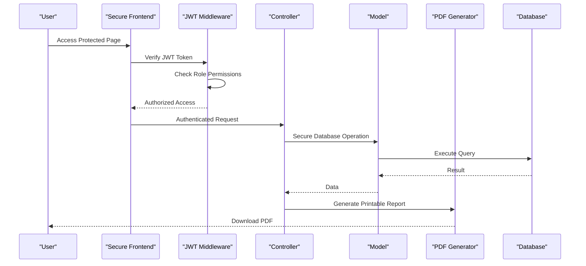
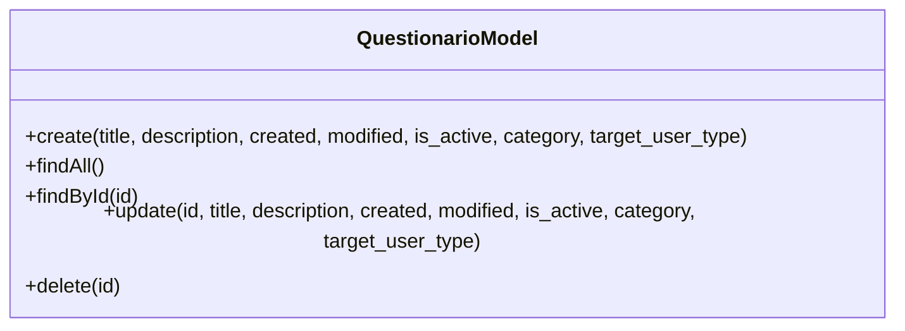
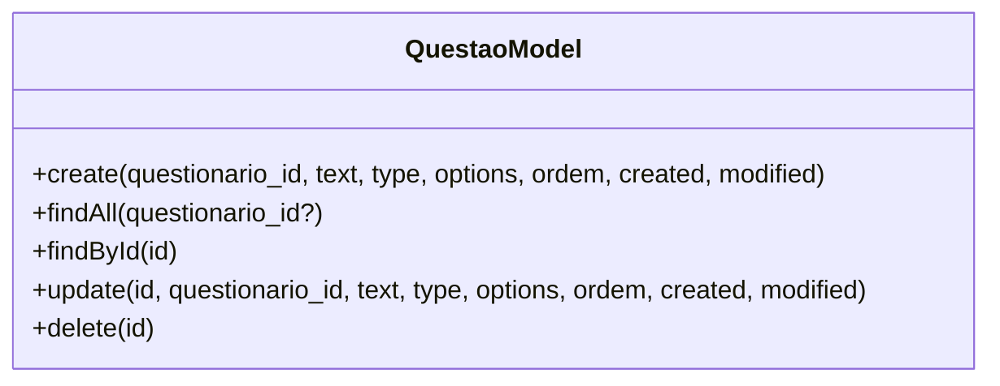
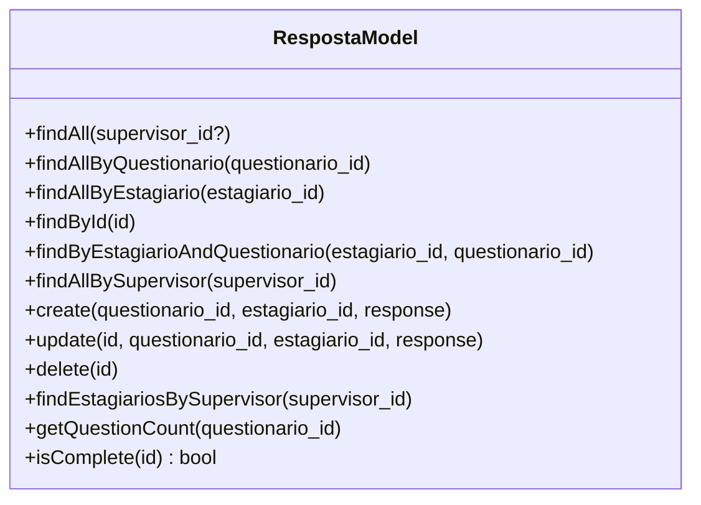
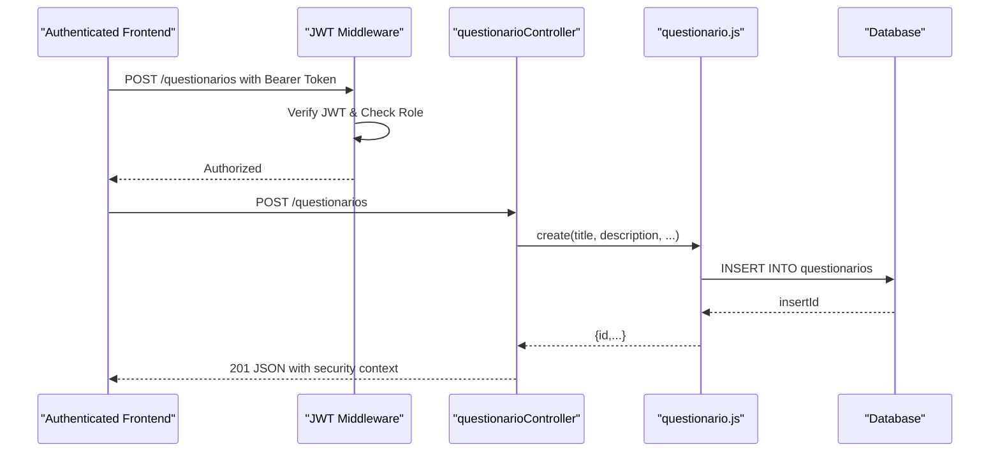
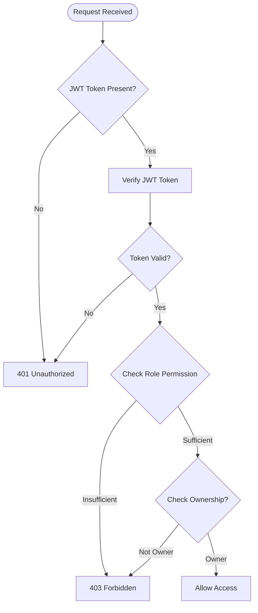
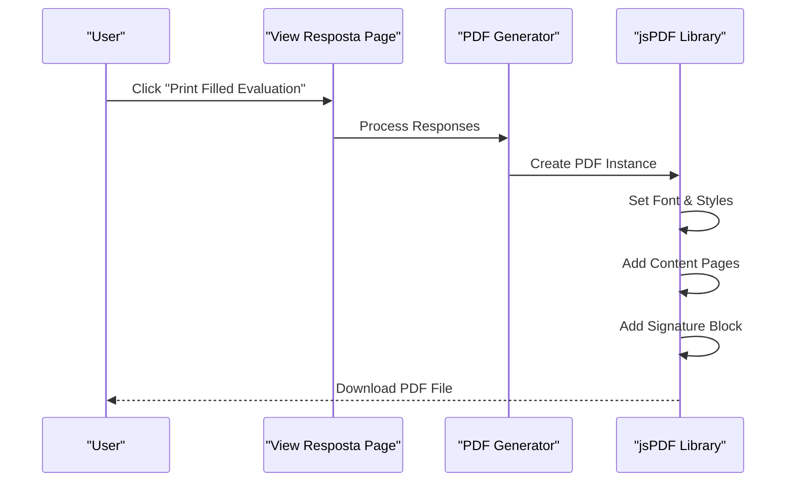
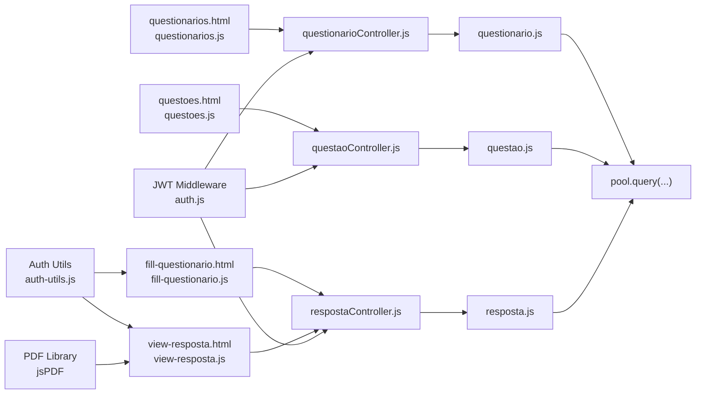

# Questionnaire & Assessment System

<cite>
**Referenced Files in This Document**
- [src/models/questionario.js](file://src/models/questionario.js)
- [src/models/questao.js](file://src/models/questao.js)
- [src/models/resposta.js](file://src/models/resposta.js)
- [src/controllers/questionarioController.js](file://src/controllers/questionarioController.js)
- [src/controllers/questaoController.js](file://src/controllers/questaoController.js)
- [src/controllers/respostaController.js](file://src/controllers/respostaController.js)
- [src/middleware/auth.js](file://src/middleware/auth.js)
- [src/routers/respostaRoutes.js](file://src/routers/respostaRoutes.js)
- [public/auth-utils.js](file://public/auth-utils.js)
- [public/new-questionario.html](file://public/new-questionario.html)
- [public/edit-questionario.html](file://public/edit-questionario.html)
- [public/questionarios.html](file://public/questionarios.html)
- [public/new-questao.html](file://public/new-questao.html)
- [public/edit-questao.html](file://public/edit-questao.html)
- [public/questoes.html](file://public/questoes.html)
- [public/fill-questionario.html](file://public/fill-questionario.html)
- [public/fill-questionario.js](file://public/fill-questionario.js)
- [public/view-resposta.html](file://public/view-resposta.html)
- [public/view-resposta.js](file://public/view-resposta.js)
- [public/edit-resposta.js](file://public/edit-resposta.js)
- [public/respostas.js](file://public/respostas.js)
- [public/new-resposta.js](file://public/new-resposta.js)
- [public/view-estagiario.js](file://public/view-estagiario.js)
</cite>

## Update Summary
**Changes Made**
- Enhanced security framework with JWT token verification and role-based access control
- Added comprehensive PDF generation capabilities for questionnaire responses
- Improved user interface with enhanced styling and responsive design
- Implemented authentication utilities for secure client-side operations
- Added ownership verification middleware for data protection
- Enhanced response viewing with printable evaluation reports

## Table of Contents
1. [Introduction](#introduction)
2. [Project Structure](#project-structure)
3. [Core Components](#core-components)
4. [Architecture Overview](#architecture-overview)
5. [Detailed Component Analysis](#detailed-component-analysis)
6. [Security Framework](#security-framework)
7. [PDF Generation System](#pdf-generation-system)
8. [Enhanced User Interface](#enhanced-user-interface)
9. [Dependency Analysis](#dependency-analysis)
10. [Performance Considerations](#performance-considerations)
11. [Troubleshooting Guide](#troubleshooting-guide)
12. [Conclusion](#conclusion)
13. [Appendices](#appendices)

## Introduction
This document describes the Questionnaire & Assessment System, focusing on the complete CRUD lifecycle for questionnaires, questions, and responses. The system has undergone a major overhaul featuring enhanced security with JWT authentication, comprehensive PDF generation capabilities, and improved user interface design. It explains backend controller logic for validation, sequencing, response collection, and assessment scoring, along with the model layer's database operations and relationships. The enhanced frontend integration via HTML templates and JavaScript handlers now includes secure authentication, responsive design, and printable evaluation reports.

## Project Structure
The system follows a layered architecture with enhanced security and modern UI patterns:
- Frontend: Secure HTML pages with Bootstrap styling and client-side authentication utilities
- Backend: Controllers with JWT middleware, Models with enhanced security, Routes with role-based access control
- Security: Comprehensive authentication and authorization middleware
- PDF Generation: Client-side PDF creation using jsPDF library

```mermaid
graph TB
subgraph "Enhanced Frontend"
VQ["View Resposta<br/>public/view-resposta.html"]
FQ["Fill Questionário<br/>public/fill-questionario.html"]
NQ["New Questionário<br/>public/new-questionario.html"]
EQ["Edit Questionário<br/>public/edit-questionario.html"]
QG["Questionários List<br/>public/questionarios.html"]
NQA["New Questão<br/>public/new-questao.html"]
EQA["Edit Questão<br/>public/edit-questao.html"]
QGA["Questões List<br/>public/questoes.html"]
PDF["PDF Generation<br/>jsPDF Library"]
AUTH["Authentication Utils<br/>public/auth-utils.js"]
END
subgraph "Secure Controllers"
QC["questionarioController.js"]
QA["questaoController.js"]
RA["respostaController.js"]
SEC["Security Middleware<br/>src/middleware/auth.js"]
END
subgraph "Models"
M_Q["questionario.js"]
M_A["questao.js"]
M_R["resposta.js"]
END
subgraph "Database"
Pool["pool.query(...)"]
END
VQ --> RA
FQ --> RA
NQ --> QC
EQ --> QC
QG --> QC
NQA --> QA
EQA --> QA
QGA --> QA
QC --> M_Q
QA --> M_A
RA --> M_R
SEC --> RA
M_Q --> Pool
M_A --> Pool
M_R --> Pool
PDF --> VQ
AUTH --> FQ
AUTH --> VQ
AUTH --> RA
```

**Diagram sources**
- [src/controllers/respostaController.js:1-169](file://src/controllers/respostaController.js#L1-L169)
- [src/middleware/auth.js:1-216](file://src/middleware/auth.js#L1-L216)
- [public/view-resposta.js:117-210](file://public/view-resposta.js#L117-L210)
- [public/auth-utils.js:1-102](file://public/auth-utils.js#L1-L102)

**Section sources**
- [src/controllers/respostaController.js:1-169](file://src/controllers/respostaController.js#L1-L169)
- [src/middleware/auth.js:1-216](file://src/middleware/auth.js#L1-L216)
- [public/auth-utils.js:1-102](file://public/auth-utils.js#L1-L102)
- [public/view-resposta.js:117-210](file://public/view-resposta.js#L117-L210)

## Core Components
- Questionário (surveys): CRUD endpoints with enhanced security and responsive UI
- Questão (questions): Secure CRUD operations with improved form validation
- Resposta (responses): Enhanced collection with PDF generation and ownership verification
- Authentication: JWT-based security with role-based access control
- PDF Generation: Client-side evaluation report creation using jsPDF

Key responsibilities:
- Controllers implement JWT verification and role-based access control
- Models handle database operations with enhanced security checks
- Frontend pages include authentication guards and responsive design
- PDF system generates printable evaluation reports with proper formatting

**Section sources**
- [src/controllers/respostaController.js:1-169](file://src/controllers/respostaController.js#L1-L169)
- [src/middleware/auth.js:1-216](file://src/middleware/auth.js#L1-L216)
- [public/auth-utils.js:1-102](file://public/auth-utils.js#L1-L102)
- [public/view-resposta.js:117-210](file://public/view-resposta.js#L117-L210)

## Architecture Overview
The system uses an enhanced MVC architecture with comprehensive security:
- Views: Responsive HTML templates with Bootstrap styling and authentication guards
- Controllers: HTTP handlers with JWT verification and role-based access control
- Models: Database operations with enhanced security and relationship management
- Security: JWT middleware, role verification, and ownership validation
- PDF Generation: Client-side PDF creation for printable reports

```mermaid
sequenceDiagram
participant U as "User"
participant FE as "Secure Frontend"
participant SEC as "JWT Middleware"
participant API as "Controller"
participant MD as "Model"
participant PDF as "PDF Generator"
participant DB as "Database"
U->>FE : Access Protected Page
FE->>SEC : Verify JWT Token
SEC->>SEC : Check Role Permissions
SEC-->>FE : Authorized Access
FE->>API : Authenticated Request
API->>MD : Secure Database Operation
MD->>DB : Execute Query
DB-->>MD : Result
MD-->>API : Data
API->>PDF : Generate Printable Report
PDF-->>U : Download PDF
```

**Diagram sources**
- [src/middleware/auth.js:8-33](file://src/middleware/auth.js#L8-L33)
- [public/view-resposta.js:117-210](file://public/view-resposta.js#L117-L210)

**Section sources**
- [src/middleware/auth.js:1-216](file://src/middleware/auth.js#L1-L216)
- [public/view-resposta.js:117-210](file://public/view-resposta.js#L117-L210)

## Detailed Component Analysis

### Questionário Module
- Responsibilities: Create, list, retrieve by ID, update, delete with enhanced security
- Data fields: title, description, category, target_user_type, is_active, timestamps
- Relationships: Questionários contain multiple Questões via questionario_id
- Security: Admin-only access with JWT verification

```mermaid
classDiagram
class QuestionarioModel {
+create(title, description, created, modified, is_active, category, target_user_type)
+findAll()
+findById(id)
+update(id, title, description, created, modified, is_active, category, target_user_type)
+delete(id)
}
```

**Diagram sources**
- [src/models/questionario.js:1-38](file://src/models/questionario.js#L1-L38)

**Section sources**
- [src/models/questionario.js:1-38](file://src/models/questionario.js#L1-L38)
- [public/new-questionario.html:1-66](file://public/new-questionario.html#L1-L66)
- [public/new-questionario.js:1-38](file://public/new-questionario.js#L1-L38)

### Questão Module
- Responsibilities: Create, list (filtered by questionário), retrieve by ID, update, delete with enhanced validation
- Data fields: questionario_id, text, type, options (JSON), ordem (order), timestamps
- Relationships: Each Questão belongs to one Questionário; ordering is enforced
- Security: Admin and supervisor access with role verification

```mermaid
classDiagram
class QuestaoModel {
+create(questionario_id, text, type, options, ordem, created, modified)
+findAll(questionario_id?)
+findById(id)
+update(id, questionario_id, text, type, options, ordem, created, modified)
+delete(id)
}
```

**Diagram sources**
- [src/models/questao.js:1-53](file://src/models/questao.js#L1-L53)

**Section sources**
- [src/models/questao.js:1-53](file://src/models/questao.js#L1-L53)
- [public/new-questao.html:1-64](file://public/new-questao.html#L1-L64)
- [public/new-questao.js:1-117](file://public/new-questao.js#L1-L117)

### Resposta Module
- Responsibilities: Secure retrieval with authentication, create, update, delete with ownership verification
- Data fields: questionario_id, estagiario_id, response (JSON object keyed by question identifiers), timestamps
- Completeness: Compares number of answered keys against total questions in the questionnaire
- Security: Multi-role access (admin, supervisor, aluno, professor) with JWT authentication

```mermaid
classDiagram
class RespostaModel {
+findAll(supervisor_id?)
+findAllByQuestionario(questionario_id)
+findAllByEstagiario(estagiario_id)
+findById(id)
+findByEstagiarioAndQuestionario(estagiario_id, questionario_id)
+findAllBySupervisor(supervisor_id)
+create(questionario_id, estagiario_id, response)
+update(id, questionario_id, estagiario_id, response)
+delete(id)
+findEstagiariosBySupervisor(supervisor_id)
+getQuestionCount(questionario_id)
+isComplete(id) bool
}
```

**Diagram sources**
- [src/models/resposta.js:1-193](file://src/models/resposta.js#L1-L193)

**Section sources**
- [src/models/resposta.js:1-193](file://src/models/resposta.js#L1-L193)
- [src/controllers/respostaController.js:1-169](file://src/controllers/respostaController.js#L1-L169)
- [public/view-resposta.js:1-243](file://public/view-resposta.js#L1-L243)

### Controller Implementation Details
- Questionário Controller: Handles create, list, retrieve, update, delete with enhanced error handling
- Questão Controller: Handles create, list (filtered by questionário), retrieve, update, delete with validation
- Resposta Controller: Handles create, update, delete, retrieval with comprehensive authentication and role checks

```mermaid
sequenceDiagram
participant FE as "Authenticated Frontend"
participant SEC as "JWT Middleware"
participant CQ as "questionarioController"
participant MQ as "questionario.js"
participant DB as "Database"
FE->>SEC : POST /questionarios with Bearer Token
SEC->>SEC : Verify JWT & Check Role
SEC-->>FE : Authorized
FE->>CQ : POST /questionarios
CQ->>MQ : create(title, description, ...)
MQ->>DB : INSERT INTO questionarios
DB-->>MQ : insertId
MQ-->>CQ : {id,...}
CQ-->>FE : 201 JSON with security context
```

**Diagram sources**
- [src/middleware/auth.js:8-33](file://src/middleware/auth.js#L8-L33)
- [src/controllers/questionarioController.js:1-72](file://src/controllers/questionarioController.js#L1-L72)

**Section sources**
- [src/controllers/questionarioController.js:1-72](file://src/controllers/questionarioController.js#L1-L72)
- [src/controllers/questaoController.js:1-72](file://src/controllers/questaoController.js#L1-L72)
- [src/controllers/respostaController.js:1-169](file://src/controllers/respostaController.js#L1-L169)

## Security Framework
The system implements comprehensive security measures:
- JWT Token Verification: Middleware validates tokens for all protected routes
- Role-Based Access Control: Different permissions for admin, supervisor, aluno, professor
- Ownership Verification: Ensures users can only access their own data
- Authentication Utilities: Centralized auth functions for consistent security

```mermaid
flowchart TD
Start(["Request Received"]) --> CheckToken{"JWT Token Present?"}
CheckToken --> |No| Deny401["401 Unauthorized"]
CheckToken --> |Yes| VerifyToken["Verify JWT Token"]
VerifyToken --> TokenValid{"Token Valid?"}
TokenValid --> |No| Deny401
TokenValid --> |Yes| CheckRole{"Check Role Permission"}
CheckRole --> |Insufficient| Deny403["403 Forbidden"]
CheckRole --> |Sufficient| CheckOwnership{"Check Ownership?"}
CheckOwnership --> |Not Owner| Deny403
CheckOwnership --> |Owner| AllowAccess["Allow Access"]
```

**Diagram sources**
- [src/middleware/auth.js:8-52](file://src/middleware/auth.js#L8-L52)

**Section sources**
- [src/middleware/auth.js:1-216](file://src/middleware/auth.js#L1-L216)
- [public/auth-utils.js:1-102](file://public/auth-utils.js#L1-L102)

## PDF Generation System
The system now includes comprehensive PDF generation capabilities:
- Client-side PDF Creation: Uses jsPDF library for printable evaluation reports
- Responsive Layout: Adapts to different content lengths and page sizes
- Professional Formatting: Includes signatures, dates, and structured presentation
- Role-based Access: Only authenticated users can generate PDFs

```mermaid
sequenceDiagram
participant U as "User"
participant VR as "View Resposta Page"
participant PDF as "PDF Generator"
participant DOC as "jsPDF Library"
U->>VR : Click "Print Filled Evaluation"
VR->>PDF : Process Responses
PDF->>DOC : Create PDF Instance
DOC->>DOC : Set Font & Styles
DOC->>DOC : Add Content Pages
DOC->>DOC : Add Signature Block
DOC-->>U : Download PDF File
```

**Diagram sources**
- [public/view-resposta.js:117-210](file://public/view-resposta.js#L117-L210)

**Section sources**
- [public/view-resposta.js:117-210](file://public/view-resposta.js#L117-L210)
- [public/view-resposta.html:1-57](file://public/view-resposta.html#L1-L57)

## Enhanced User Interface
The frontend has been significantly improved:
- Responsive Design: Bootstrap-based layouts work across devices
- Enhanced Styling: Custom CSS for better user experience
- Role-based Visibility: Buttons and actions adapt to user roles
- Real-time Status: Dynamic badges and status indicators
- Form Validation: Improved client-side validation and error handling

**Section sources**
- [public/fill-questionario.html:1-89](file://public/fill-questionario.html#L1-L89)
- [public/view-resposta.html:1-57](file://public/view-resposta.html#L1-L57)
- [public/new-questionario.html:1-66](file://public/new-questionario.html#L1-L66)

## Dependency Analysis
- Controllers depend on Models and JWT middleware
- Models depend on the shared database pool
- Frontend scripts depend on authentication utilities and controllers
- PDF generation depends on jsPDF library
- Security middleware protects all API endpoints

```mermaid
graph LR
FE_Q["questionarios.html<br/>questionarios.js"] --> C_Q["questionarioController.js"]
FE_A["questoes.html<br/>questoes.js"] --> C_A["questaoController.js"]
FE_F["fill-questionario.html<br/>fill-questionario.js"] --> C_R["respostaController.js"]
FE_V["view-resposta.html<br/>view-resposta.js"] --> C_R
SEC["JWT Middleware<br/>auth.js"] --> C_Q
SEC --> C_A
SEC --> C_R
AUTH["Auth Utils<br/>auth-utils.js"] --> FE_F
AUTH --> FE_V
PDF["PDF Library<br/>jsPDF"] --> FE_V
C_Q --> M_Q["questionario.js"]
C_A --> M_A["questao.js"]
C_R --> M_R["resposta.js"]
M_Q --> DB["pool.query(...)"]
M_A --> DB
M_R --> DB
```

**Diagram sources**
- [src/middleware/auth.js:1-216](file://src/middleware/auth.js#L1-L216)
- [public/auth-utils.js:1-102](file://public/auth-utils.js#L1-L102)
- [public/view-resposta.js:117-210](file://public/view-resposta.js#L117-L210)

**Section sources**
- [src/middleware/auth.js:1-216](file://src/middleware/auth.js#L1-L216)
- [public/auth-utils.js:1-102](file://public/auth-utils.js#L1-L102)
- [public/view-resposta.js:117-210](file://public/view-resposta.js#L117-L210)

## Performance Considerations
- Database:
  - Use indexed columns for frequent filters (questionario_id, estagiario_id, supervisor_id)
  - Implement pagination for large response lists
  - Optimize PDF generation for large datasets
- Frontend:
  - Lazy-load PDF library only when needed
  - Debounce search operations in enhanced UI components
  - Cache authentication tokens and user data
- Security:
  - Implement token refresh mechanisms
  - Use secure cookie storage for tokens
  - Monitor failed authentication attempts
- PDF Generation:
  - Stream large PDFs to avoid memory issues
  - Implement progress indicators for long operations
  - Optimize image handling in PDFs

## Troubleshooting Guide
Common issues and remedies:
- Authentication errors: Check JWT token validity and expiration
- Authorization failures: Verify user roles and permissions
- PDF generation issues: Ensure jsPDF library loads correctly
- Security middleware problems: Check token format and signing
- Ownership verification failures: Verify user entidade_id matches requested data

**Section sources**
- [src/middleware/auth.js:8-33](file://src/middleware/auth.js#L8-L33)
- [public/auth-utils.js:45-54](file://public/auth-utils.js#L45-L54)
- [public/view-resposta.js:123-127](file://public/view-resposta.js#L123-L127)

## Conclusion
The Questionnaire & Assessment System has been comprehensively enhanced with robust security, advanced PDF generation, and improved user interface. The new JWT-based authentication system ensures secure access control, while the PDF generation capabilities provide professional evaluation reports. The responsive design and enhanced UI create a superior user experience across all device types. The system maintains its core functionality while adding enterprise-grade security and professional reporting features.

## Appendices

### API Definitions

- Questionário
  - POST /questionarios: Create a new questionário (Admin only)
  - GET /questionarios: List all questionários
  - GET /questionarios/:id: Retrieve a questionário by ID
  - PUT /questionarios/:id: Update a questionário by ID (Admin only)
  - DELETE /questionarios/:id: Delete a questionário by ID (Admin only)

- Questão
  - POST /questoes: Create a new questão (Admin only)
  - GET /questoes?questionario_id=:id: List questões filtered by questionário
  - GET /questoes/:id: Retrieve a questão by ID
  - PUT /questoes/:id: Update a questão by ID (Admin only)
  - DELETE /questoes/:id: Delete a questão by ID (Admin only)

- Resposta
  - GET /respostas: List all respostas (Admin, Supervisor, Aluno)
  - GET /respostas/questionario/:questionario_id: List respostas by questionário (Admin, Supervisor, Aluno)
  - GET /respostas/estagiario/:estagiario_id: List respostas by estagiário (Admin, Supervisor, Aluno)
  - GET /respostas/estagiario/:estagiario_id/questionario/:questionario_id: Retrieve a resposta by estagiário and questionário
  - GET /respostas/supervisor/:supervisor_id: List respostas by supervisor (Admin, Supervisor)
  - POST /respostas: Create a new resposta (Admin, Supervisor)
  - PUT /respostas/:id: Update a resposta by ID (Admin, Supervisor)
  - DELETE /respostas/:id: Delete a resposta by ID (Admin, Supervisor)
  - GET /respostas/:id/complete: Check if a resposta is complete (Admin, Supervisor, Aluno)

**Section sources**
- [src/controllers/respostaController.js:1-169](file://src/controllers/respostaController.js#L1-L169)
- [src/routers/respostaRoutes.js:1-54](file://src/routers/respostaRoutes.js#L1-L54)
- [src/middleware/auth.js:36-52](file://src/middleware/auth.js#L36-L52)