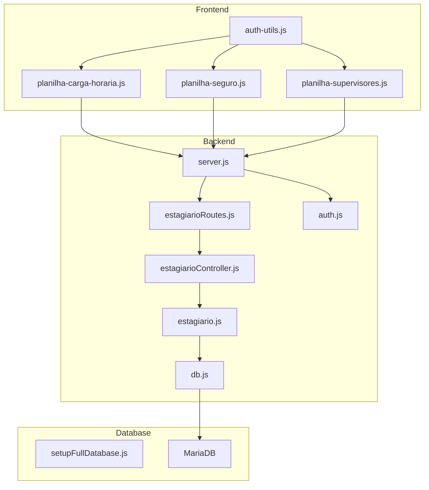
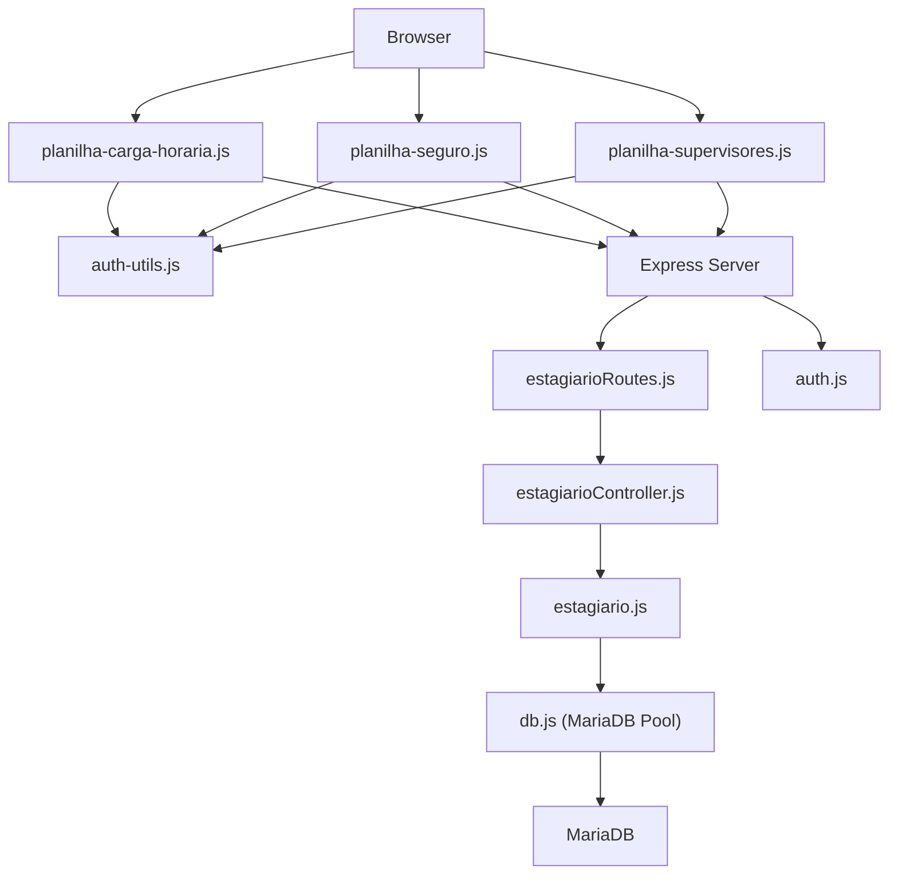
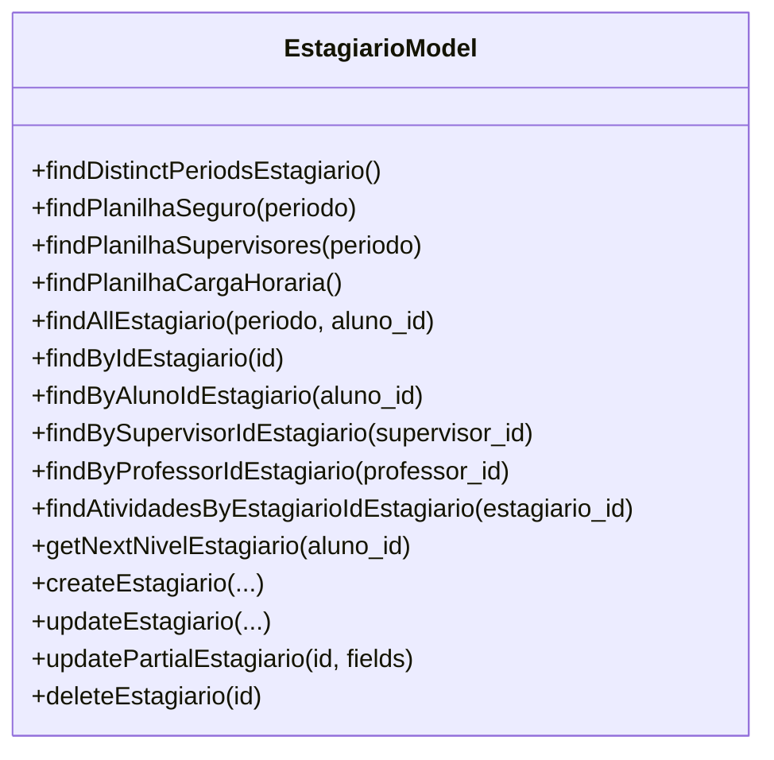
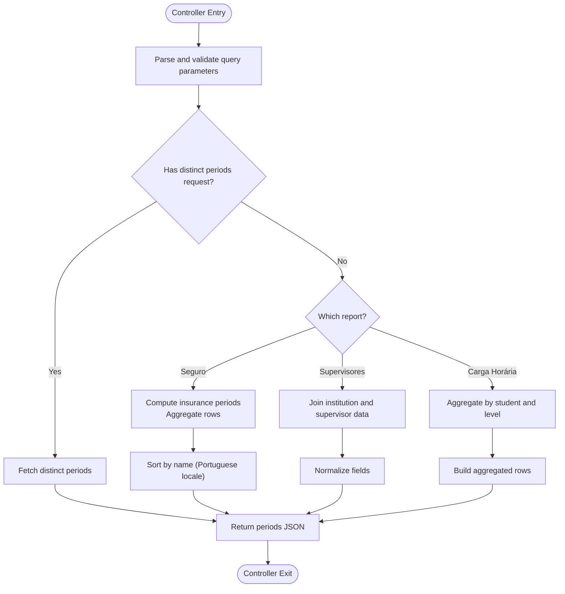
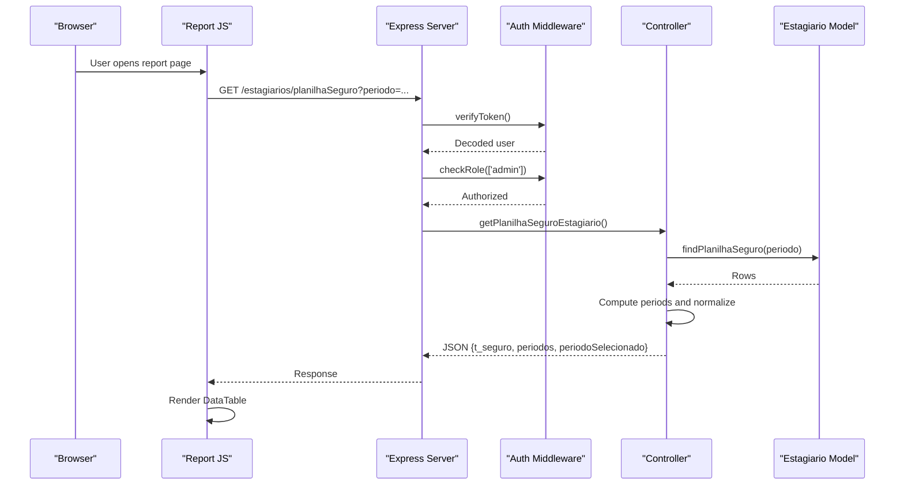
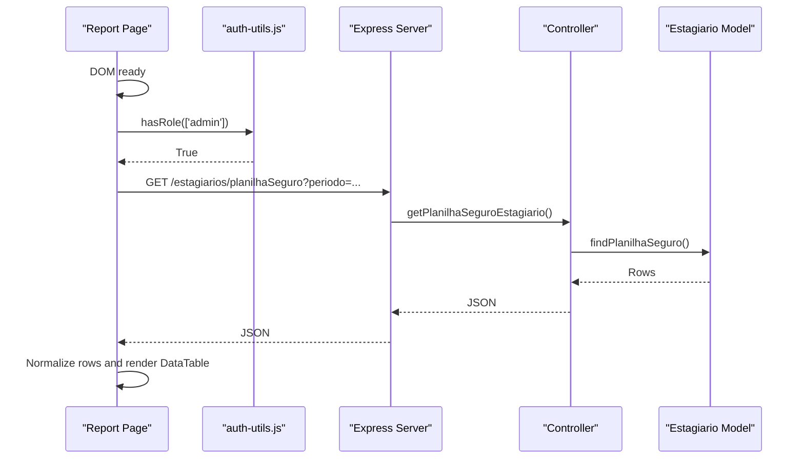
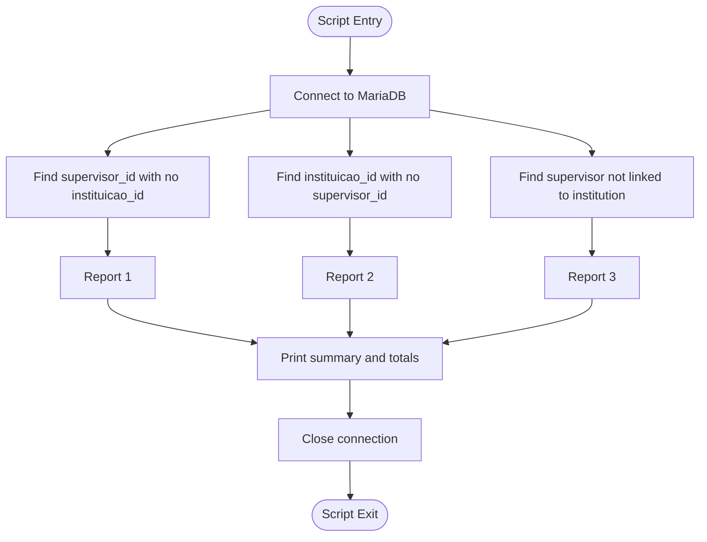
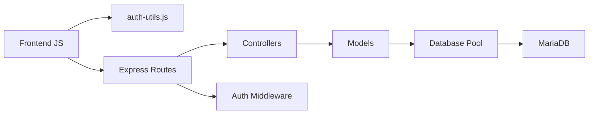

# Spreadsheet Reporting System

<cite>
**Referenced Files in This Document**
- [README.md](file://README.md)
- [package.json](file://package.json)
- [src/server.js](file://src/server.js)
- [src/database/db.js](file://src/database/db.js)
- [src/database/setupFullDatabase.js](file://src/database/setupFullDatabase.js)
- [src/routers/estagiarioRoutes.js](file://src/routers/estagiarioRoutes.js)
- [src/controllers/estagiarioController.js](file://src/controllers/estagiarioController.js)
- [src/models/estagiario.js](file://src/models/estagiario.js)
- [src/middleware/auth.js](file://src/middleware/auth.js)
- [public/auth-utils.js](file://public/auth-utils.js)
- [public/planilha-carga-horaria.js](file://public/planilha-carga-horaria.js)
- [public/planilha-seguro.js](file://public/planilha-seguro.js)
- [public/planilha-supervisores.js](file://public/planilha-supervisores.js)
- [scripts/report_estagiarios_supervisor_instituicao.py](file://scripts/report_estagiarios_supervisor_instituicao.py)
</cite>

## Table of Contents
1. [Introduction](#introduction)
2. [Project Structure](#project-structure)
3. [Core Components](#core-components)
4. [Architecture Overview](#architecture-overview)
5. [Detailed Component Analysis](#detailed-component-analysis)
6. [Dependency Analysis](#dependency-analysis)
7. [Performance Considerations](#performance-considerations)
8. [Troubleshooting Guide](#troubleshooting-guide)
9. [Conclusion](#conclusion)

## Introduction
This document describes the Spreadsheet Reporting System within the NodeMural application. The system focuses on generating three specialized spreadsheets for administrative reporting:
- Insurance coverage spreadsheet (planilha-seguro)
- Supervisor assignment spreadsheet (planilha-supervisores)
- Weekly workload spreadsheet (planilha-carga-horaria)

These reports are produced from the estagiarios (internship) domain and are secured behind role-based access controls. The backend exposes REST endpoints that the frontend JavaScript files consume to render interactive DataTables.

## Project Structure
The project follows a modular Node.js architecture with clear separation of concerns:
- Backend: Express server, routing, controllers, models, and database configuration
- Frontend: Static HTML pages with embedded JavaScript for report rendering
- Database: MariaDB with a comprehensive schema supporting student, professor, supervisor, institution, and internship tracking
- Scripts: Python utilities for data quality checks

**Diagram sources**
- [src/server.js:1-73](file://src/server.js#L1-L73)
- [src/routers/estagiarioRoutes.js:1-26](file://src/routers/estagiarioRoutes.js#L1-L26)
- [src/controllers/estagiarioController.js:1-337](file://src/controllers/estagiarioController.js#L1-L337)
- [src/models/estagiario.js:1-334](file://src/models/estagiario.js#L1-L334)
- [src/database/db.js:1-15](file://src/database/db.js#L1-L15)
- [src/database/setupFullDatabase.js:1-291](file://src/database/setupFullDatabase.js#L1-L291)
- [public/planilha-carga-horaria.js:1-85](file://public/planilha-carga-horaria.js#L1-L85)
- [public/planilha-seguro.js:1-120](file://public/planilha-seguro.js#L1-L120)
- [public/planilha-supervisores.js:1-103](file://public/planilha-supervisores.js#L1-L103)
- [public/auth-utils.js:1-102](file://public/auth-utils.js#L1-L102)

**Section sources**
- [README.md:1-61](file://README.md#L1-L61)
- [package.json:1-33](file://package.json#L1-L33)
- [src/server.js:1-73](file://src/server.js#L1-L73)

## Core Components
This section outlines the primary building blocks enabling the spreadsheet reporting system.

- Database Layer
  - Connection pooling configured via environment variables
  - Full schema creation script initializes all required tables, including estagiarios, instituicoes, supervisores, inst_super, and related entities

- Authentication and Authorization
  - JWT-based middleware verifies tokens and enforces role-based access
  - Ownership checks ensure users can only access their own records or those under their supervision

- Estagiario Domain
  - Model encapsulates SQL queries for retrieving report data
  - Controller computes derived fields and aggregates data for spreadsheets

- Routing and Controllers
  - REST endpoints expose report generation and metadata retrieval
  - Access restricted to admin users for sensitive reports

- Frontend Reports
  - Three JavaScript modules fetch report data and render interactive tables
  - Period filters enable dynamic report generation across academic terms

**Section sources**
- [src/database/db.js:1-15](file://src/database/db.js#L1-L15)
- [src/database/setupFullDatabase.js:185-205](file://src/database/setupFullDatabase.js#L185-L205)
- [src/middleware/auth.js:1-216](file://src/middleware/auth.js#L1-L216)
- [src/models/estagiario.js:1-334](file://src/models/estagiario.js#L1-L334)
- [src/controllers/estagiarioController.js:1-337](file://src/controllers/estagiarioController.js#L1-L337)
- [src/routers/estagiarioRoutes.js:1-26](file://src/routers/estagiarioRoutes.js#L1-L26)
- [public/planilha-carga-horaria.js:1-85](file://public/planilha-carga-horaria.js#L1-L85)
- [public/planilha-seguro.js:1-120](file://public/planilha-seguro.js#L1-L120)
- [public/planilha-supervisores.js:1-103](file://public/planilha-supervisores.js#L1-L103)

## Architecture Overview
The system employs a layered architecture:
- Presentation Layer: HTML pages with embedded JavaScript for report rendering
- API Layer: Express routes and controllers handling report requests
- Domain Layer: Estagiario model encapsulating business logic and data access
- Persistence Layer: MariaDB with a normalized schema supporting the internship lifecycle

**Diagram sources**
- [src/server.js:1-73](file://src/server.js#L1-L73)
- [src/routers/estagiarioRoutes.js:1-26](file://src/routers/estagiarioRoutes.js#L1-L26)
- [src/controllers/estagiarioController.js:1-337](file://src/controllers/estagiarioController.js#L1-L337)
- [src/models/estagiario.js:1-334](file://src/models/estagiario.js#L1-L334)
- [src/database/db.js:1-15](file://src/database/db.js#L1-L15)
- [public/planilha-carga-horaria.js:1-85](file://public/planilha-carga-horaria.js#L1-L85)
- [public/planilha-seguro.js:1-120](file://public/planilha-seguro.js#L1-L120)
- [public/planilha-supervisores.js:1-103](file://public/planilha-supervisores.js#L1-L103)
- [public/auth-utils.js:1-102](file://public/auth-utils.js#L1-L102)

## Detailed Component Analysis

### Estagiario Model and Queries
The Estagiario model defines the core SQL queries used by the reporting system:
- Distinct periods retrieval for filtering
- Insurance spreadsheet data with computed start/end periods
- Supervisor spreadsheet data joining institutions and supervisors
- Weekly workload aggregation by student and level

**Diagram sources**
- [src/models/estagiario.js:4-334](file://src/models/estagiario.js#L4-L334)

**Section sources**
- [src/models/estagiario.js:5-71](file://src/models/estagiario.js#L5-L71)
- [src/models/estagiario.js:32-55](file://src/models/estagiario.js#L32-L55)
- [src/models/estagiario.js:57-71](file://src/models/estagiario.js#L57-L71)

### Estagiario Controller Logic
The controller orchestrates report generation:
- Validates and normalizes query parameters
- Computes derived fields (e.g., insurance period boundaries)
- Aggregates data for weekly workload reports
- Returns structured JSON responses consumed by the frontend

**Diagram sources**
- [src/controllers/estagiarioController.js:57-195](file://src/controllers/estagiarioController.js#L57-L195)

**Section sources**
- [src/controllers/estagiarioController.js:57-104](file://src/controllers/estagiarioController.js#L57-L104)
- [src/controllers/estagiarioController.js:106-139](file://src/controllers/estagiarioController.js#L106-L139)
- [src/controllers/estagiarioController.js:141-195](file://src/controllers/estagiarioController.js#L141-L195)

### Route Endpoints and Access Control
The routes define the API surface for reports and enforce role-based permissions:
- GET /estagiarios/planilhaSeguro: Admin-only
- GET /estagiarios/planilhaSupervisores: Admin-only
- GET /estagiarios/planilhaCargaHoraria: Admin-only
- Additional endpoints support CRUD and metadata queries

**Diagram sources**
- [src/routers/estagiarioRoutes.js:13-15](file://src/routers/estagiarioRoutes.js#L13-L15)
- [src/controllers/estagiarioController.js:67-104](file://src/controllers/estagiarioController.js#L67-L104)
- [src/models/estagiario.js:12-30](file://src/models/estagiario.js#L12-L30)
- [src/middleware/auth.js:8-52](file://src/middleware/auth.js#L8-L52)

**Section sources**
- [src/routers/estagiarioRoutes.js:12-15](file://src/routers/estagiarioRoutes.js#L12-L15)
- [src/middleware/auth.js:36-52](file://src/middleware/auth.js#L36-L52)

### Frontend Report Modules
Each report page implements a similar pattern:
- Validates authentication and admin role
- Fetches report data via authenticatedFetch
- Populates DataTables with localized language support
- Provides period selection for dynamic filtering

**Diagram sources**
- [public/planilha-seguro.js:3-31](file://public/planilha-seguro.js#L3-L31)
- [public/planilha-seguro.js:71-94](file://public/planilha-seguro.js#L71-L94)
- [public/auth-utils.js:45-54](file://public/auth-utils.js#L45-L54)

**Section sources**
- [public/planilha-carga-horaria.js:1-85](file://public/planilha-carga-horaria.js#L1-L85)
- [public/planilha-seguro.js:1-120](file://public/planilha-seguro.js#L1-L120)
- [public/planilha-supervisores.js:1-103](file://public/planilha-supervisores.js#L1-L103)
- [public/auth-utils.js:1-102](file://public/auth-utils.js#L1-L102)

### Data Quality Script
A Python script validates supervisor-institution consistency for estagiarios records, checking:
- Records with supervisor_id but no instituicao_id
- Records with instituicao_id but no supervisor_id
- Records where supervisor is not linked to institution in inst_super

**Diagram sources**
- [scripts/report_estagiarios_supervisor_instituicao.py:37-161](file://scripts/report_estagiarios_supervisor_instituicao.py#L37-L161)

**Section sources**
- [scripts/report_estagiarios_supervisor_instituicao.py:1-173](file://scripts/report_estagiarios_supervisor_instituicao.py#L1-L173)

## Dependency Analysis
The system exhibits clean separation of concerns with explicit dependencies:
- Frontend depends on auth-utils for token and role management
- Backend routes depend on controllers and middleware
- Controllers depend on models and database pool
- Models depend on the MariaDB pool and environment configuration

**Diagram sources**
- [public/auth-utils.js:1-102](file://public/auth-utils.js#L1-L102)
- [src/server.js:1-73](file://src/server.js#L1-L73)
- [src/routers/estagiarioRoutes.js:1-26](file://src/routers/estagiarioRoutes.js#L1-L26)
- [src/controllers/estagiarioController.js:1-337](file://src/controllers/estagiarioController.js#L1-L337)
- [src/models/estagiario.js:1-334](file://src/models/estagiario.js#L1-L334)
- [src/database/db.js:1-15](file://src/database/db.js#L1-L15)

**Section sources**
- [package.json:22-31](file://package.json#L22-L31)
- [src/server.js:8-28](file://src/server.js#L8-L28)

## Performance Considerations
- Database Pooling: Connection limits and queue behavior are configurable via environment variables to handle concurrent report requests efficiently.
- Query Optimization: Reports rely on indexed joins and filtered selects; ensure appropriate indexes exist on periodo, aluno_id, supervisor_id, and instituicao_id.
- Frontend Rendering: DataTables client-side rendering is suitable for moderate-sized datasets; consider server-side processing for very large reports.
- Caching: Period lists and static metadata could benefit from caching to reduce repeated database queries.

[No sources needed since this section provides general guidance]

## Troubleshooting Guide
Common issues and resolutions:
- Authentication Failures
  - Missing or invalid JWT token leads to 401 responses
  - Ensure tokens are present in Authorization headers and not expired
- Role-Based Access Denied
  - Requests from unauthorized roles receive 403 responses
  - Confirm user role and entidade_id alignment with requested resources
- Database Connectivity
  - Connection errors indicate misconfigured DB_HOST, DB_USER, DB_PASSWORD, or DB_NAME
  - Verify environment variables and MariaDB service availability
- Report Data Issues
  - Empty or inconsistent report data often stems from missing relationships in inst_super or mismatched periodo values
  - Use the provided Python script to identify problematic records

**Section sources**
- [src/middleware/auth.js:8-52](file://src/middleware/auth.js#L8-L52)
- [src/middleware/auth.js:142-177](file://src/middleware/auth.js#L142-L177)
- [src/database/db.js:5-13](file://src/database/db.js#L5-L13)
- [scripts/report_estagiarios_supervisor_instituicao.py:149-155](file://scripts/report_estagiarios_supervisor_instituicao.py#L149-L155)

## Conclusion
The Spreadsheet Reporting System integrates a secure backend with intuitive frontend report modules to deliver three essential administrative views: insurance coverage, supervisor assignments, and weekly workload. The architecture emphasizes clear separation of concerns, robust access controls, and maintainable data access patterns. By leveraging MariaDB and Express, the system supports scalable report generation while maintaining simplicity for administrators.