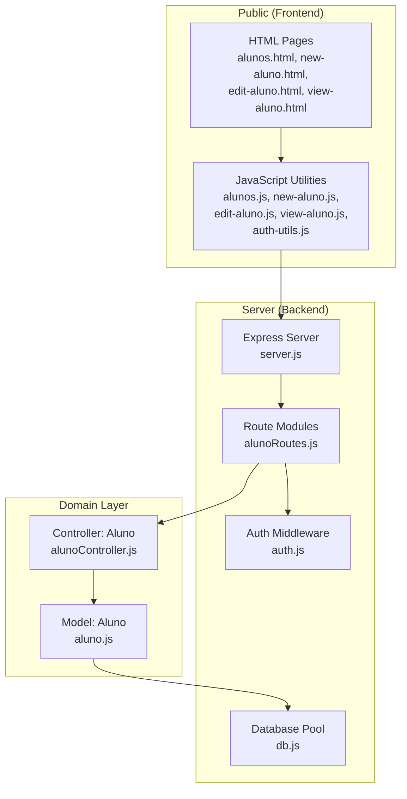
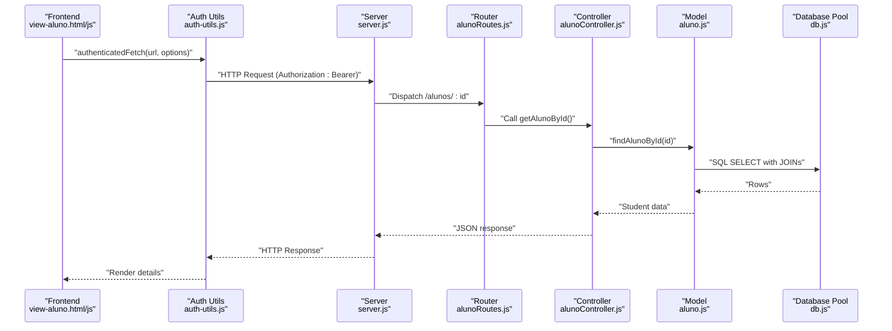
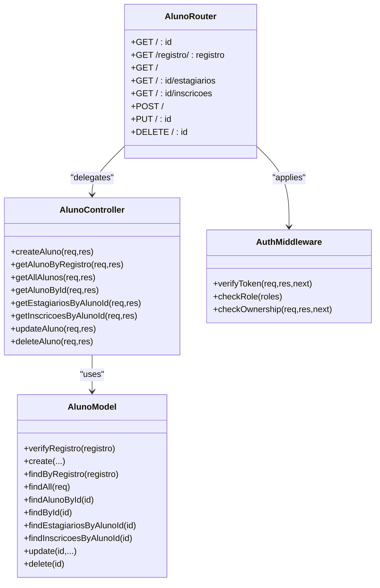
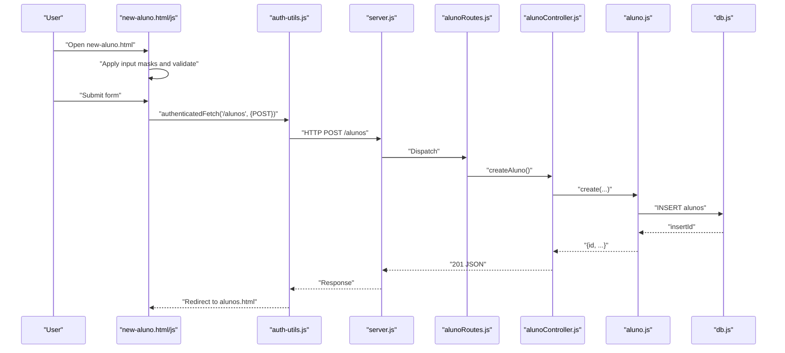
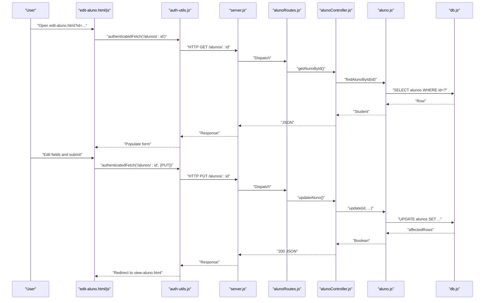
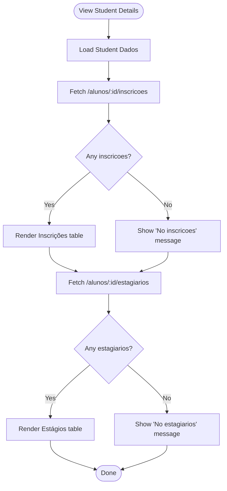
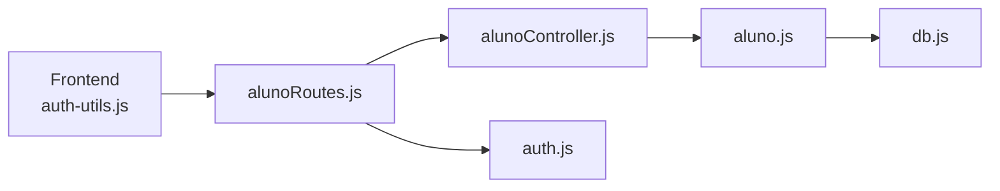

# Student Management System

<cite>
**Referenced Files in This Document**
- [aluno.js](file://src/models/aluno.js)
- [alunoController.js](file://src/controllers/alunoController.js)
- [alunoRoutes.js](file://src/routers/alunoRoutes.js)
- [server.js](file://src/server.js)
- [db.js](file://src/database/db.js)
- [auth.js](file://src/middleware/auth.js)
- [auth-utils.js](file://public/auth-utils.js)
- [alunos.html](file://public/alunos.html)
- [alunos.js](file://public/alunos.js)
- [new-aluno.html](file://public/new-aluno.html)
- [new-aluno.js](file://public/new-aluno.js)
- [edit-aluno.html](file://public/edit-aluno.html)
- [edit-aluno.js](file://public/edit-aluno.js)
- [view-aluno.html](file://public/view-aluno.html)
- [view-aluno.js](file://public/view-aluno.js)
</cite>

## Table of Contents
1. [Introduction](#introduction)
2. [Project Structure](#project-structure)
3. [Core Components](#core-components)
4. [Architecture Overview](#architecture-overview)
5. [Detailed Component Analysis](#detailed-component-analysis)
6. [Dependency Analysis](#dependency-analysis)
7. [Performance Considerations](#performance-considerations)
8. [Troubleshooting Guide](#troubleshooting-guide)
9. [Conclusion](#conclusion)
10. [Appendices](#appendices)

## Introduction
This document describes the Student Management System with a focus on the student entity lifecycle: registration, profile management, academic records, and enrollment tracking. It covers the backend controller and model implementations, database interactions, frontend integration via HTML templates and JavaScript utilities, validation rules, data formats, security considerations, and common workflows such as student registration, profile updates, and academic progress tracking. It also provides guidance on performance optimization and integration patterns with other system components.

## Project Structure
The system follows a layered architecture:
- Frontend: Static HTML pages and client-side scripts under public/.
- Backend: Express server, controllers, models, routers, middleware, and database pool under src/.
- Environment configuration: Uses environment variables for database and JWT secrets.

**Diagram sources**
- [server.js](file://src/server.js#L31-L73)
- [alunoRoutes.js](file://src/routers/alunoRoutes.js#L1-L25)
- [auth.js](file://src/middleware/auth.js#L1-L137)
- [alunoController.js](file://src/controllers/alunoController.js#L1-L114)
- [aluno.js](file://src/models/aluno.js#L1-L146)
- [db.js](file://src/database/db.js#L1-L15)
- [alunos.html](file://public/alunos.html#L1-L49)
- [alunos.js](file://public/alunos.js#L1-L70)
- [new-aluno.html](file://public/new-aluno.html#L1-L124)
- [new-aluno.js](file://public/new-aluno.js#L1-L136)
- [edit-aluno.html](file://public/edit-aluno.html#L1-L115)
- [edit-aluno.js](file://public/edit-aluno.js#L1-L194)
- [view-aluno.html](file://public/view-aluno.html#L1-L174)
- [view-aluno.js](file://public/view-aluno.js#L1-L192)

**Section sources**
- [server.js](file://src/server.js#L31-L73)
- [alunoRoutes.js](file://src/routers/alunoRoutes.js#L1-L25)
- [alunoController.js](file://src/controllers/alunoController.js#L1-L114)
- [aluno.js](file://src/models/aluno.js#L1-L146)
- [db.js](file://src/database/db.js#L1-L15)
- [auth.js](file://src/middleware/auth.js#L1-L137)
- [alunos.html](file://public/alunos.html#L1-L49)
- [alunos.js](file://public/alunos.js#L1-L70)
- [new-aluno.html](file://public/new-aluno.html#L1-L124)
- [new-aluno.js](file://public/new-aluno.js#L1-L136)
- [edit-aluno.html](file://public/edit-aluno.html#L1-L115)
- [edit-aluno.js](file://public/edit-aluno.js#L1-L194)
- [view-aluno.html](file://public/view-aluno.html#L1-L174)
- [view-aluno.js](file://public/view-aluno.js#L1-L192)

## Core Components
- Model: Implements CRUD operations for students, including existence checks, retrieval by ID or registration number, listing with optional search, joins with related entities (estagiarios, inscricoes), and deletion safety checks against dependent records.
- Controller: Exposes REST endpoints for creating, retrieving, updating, and deleting students, with robust error handling and status codes.
- Router: Defines route endpoints, applies middleware for authentication, role checks, and ownership verification, and delegates to controller methods.
- Frontend: Provides views for listing, creating, editing, and viewing student details, with client-side validation and authenticated requests.

Key responsibilities:
- Data integrity: Prevents deletion of students who have related estagiarios or inscricoes.
- Ownership: Restricts edits to self for aluno role users.
- Search: Supports filtering students by name, social name, registration number, or email.

**Section sources**
- [aluno.js](file://src/models/aluno.js#L1-L146)
- [alunoController.js](file://src/controllers/alunoController.js#L1-L114)
- [alunoRoutes.js](file://src/routers/alunoRoutes.js#L1-L25)
- [auth.js](file://src/middleware/auth.js#L76-L98)

## Architecture Overview
The system uses a clean separation of concerns:
- HTTP requests are handled by Express routes.
- Controllers encapsulate business logic and orchestrate model operations.
- Models abstract database interactions and enforce referential integrity.
- Middleware enforces authentication, roles, and ownership.
- Frontend communicates with the backend via authenticated fetch calls and displays data using DataTables.

**Diagram sources**
- [server.js](file://src/server.js#L31-L73)
- [alunoRoutes.js](file://src/routers/alunoRoutes.js#L1-L25)
- [alunoController.js](file://src/controllers/alunoController.js#L43-L56)
- [aluno.js](file://src/models/aluno.js#L44-L72)
- [db.js](file://src/database/db.js#L1-L15)
- [view-aluno.js](file://public/view-aluno.js#L36-L67)
- [auth-utils.js](file://public/auth-utils.js#L45-L54)

## Detailed Component Analysis

### Model: Aluno
Responsibilities:
- Verify uniqueness of student registration number.
- Create, update, and delete student records.
- Retrieve student by ID (with optional estagiario joins) and by registration number.
- List students with optional search filter.
- Fetch related estagiarios and inscricoes with joined attributes.

Data integrity:
- Deletion checks prevent removal of students with existing estagiarios or inscricoes.

Performance considerations:
- Queries use indexed fields (id, registro) and filtered selects to minimize payload.
- JOIN queries are scoped to specific relations to avoid unnecessary data.

Security considerations:
- No direct exposure of internal identifiers beyond what is necessary for joins.

**Section sources**
- [aluno.js](file://src/models/aluno.js#L1-L146)

### Controller: Aluno
Endpoints:
- GET /alunos (protected): list all students.
- GET /alunos/:id (public): get student by ID.
- GET /alunos/registro/:registro (public): get student by registration number.
- GET /alunos/:id/estagiarios (protected): get estagiarios for student.
- GET /alunos/:id/inscricoes (protected): get inscricoes for student.
- POST /alunos (protected, role: admin|aluno): create student.
- PUT /alunos/:id (protected, role: admin|aluno, ownership): update student.
- DELETE /alunos/:id (protected, role: admin): delete student.

Error handling:
- Returns appropriate HTTP status codes and JSON error messages.
- Throws and logs errors during create/update/delete operations.

**Section sources**
- [alunoController.js](file://src/controllers/alunoController.js#L1-L114)
- [alunoRoutes.js](file://src/routers/alunoRoutes.js#L1-L25)

### Router: Aluno
- Applies express.json() middleware.
- Enforces verifyToken for protected routes.
- Enforces checkRole for write operations.
- Enforces checkOwnership for updates by aluno role.

**Section sources**
- [alunoRoutes.js](file://src/routers/alunoRoutes.js#L1-L25)
- [auth.js](file://src/middleware/auth.js#L6-L29)
- [auth.js](file://src/middleware/auth.js#L31-L48)
- [auth.js](file://src/middleware/auth.js#L76-L98)

### Frontend: Listing Students (alunos.html/js)
- Loads student list via DataTables AJAX to /alunos with Authorization header.
- Provides Edit and Delete actions per row.
- Redirects unauthenticated users to login.html.
- Restricts aluno role users to view their own profile.

**Section sources**
- [alunos.html](file://public/alunos.html#L1-L49)
- [alunos.js](file://public/alunos.js#L1-L70)

### Frontend: Creating a New Student (new-aluno.html/js)
- Validates input masks for CEP, CPF, birth date, and ingresso format.
- Enforces business rules: ingresso year matches registro-derived year, and ingresso format is AAAA-S where S is 0, 1, or 2.
- Submits POST /alunos with JSON payload.
- Redirects to list upon success.

**Section sources**
- [new-aluno.html](file://public/new-aluno.html#L1-L124)
- [new-aluno.js](file://public/new-aluno.js#L1-L136)

### Frontend: Editing a Student (edit-aluno.html/js)
- Loads existing data via GET /alunos/:id and populates form fields.
- Applies input masks and custom validation similar to creation.
- Supports PUT /alunos/:id for updates.
- Enforces ownership: aluno users can only edit their own record.

**Section sources**
- [edit-aluno.html](file://public/edit-aluno.html#L1-L115)
- [edit-aluno.js](file://public/edit-aluno.js#L1-L194)

### Frontend: Viewing a Student (view-aluno.html/js)
- Displays student details in tabs: Dados, Inscrições, Estágios.
- Fetches related inscricoes and estagiarios and renders tabular data.
- Provides navigation to edit or delete (admin-only).
- Enforces role and ownership checks.

**Section sources**
- [view-aluno.html](file://public/view-aluno.html#L1-L174)
- [view-aluno.js](file://public/view-aluno.js#L1-L192)

### Authentication Utilities (auth-utils.js)
- Stores and retrieves token and user from localStorage.
- Provides authenticatedFetch helper to attach Authorization header.
- Offers role checks and redirection helpers.

**Section sources**
- [auth-utils.js](file://public/auth-utils.js#L1-L88)

### Security Model
- JWT token verification middleware ensures protected endpoints are accessed only with valid tokens.
- Role-based access control restricts write operations to admin and aluno roles.
- Ownership middleware ensures aluno users can only manage their own records.
- Frontend enforces role checks and redirects unauthorized users.

**Section sources**
- [auth.js](file://src/middleware/auth.js#L6-L29)
- [auth.js](file://src/middleware/auth.js#L31-L48)
- [auth.js](file://src/middleware/auth.js#L76-L98)
- [auth-utils.js](file://public/auth-utils.js#L45-L54)

### Database Interactions
- Database pool configured with connection limits and environment variables.
- Model queries use prepared statements to mitigate SQL injection risks.
- JOIN queries fetch related estagiarios and inscricoes with denormalized fields for display.

**Section sources**
- [db.js](file://src/database/db.js#L1-L15)
- [aluno.js](file://src/models/aluno.js#L54-L115)

## Architecture Overview

**Diagram sources**
- [aluno.js](file://src/models/aluno.js#L1-L146)
- [alunoController.js](file://src/controllers/alunoController.js#L1-L114)
- [alunoRoutes.js](file://src/routers/alunoRoutes.js#L1-L25)
- [auth.js](file://src/middleware/auth.js#L6-L29)

## Detailed Component Analysis

### Student Registration Workflow

**Diagram sources**
- [new-aluno.html](file://public/new-aluno.html#L1-L124)
- [new-aluno.js](file://public/new-aluno.js#L18-L51)
- [auth-utils.js](file://public/auth-utils.js#L45-L54)
- [server.js](file://src/server.js#L31-L73)
- [alunoRoutes.js](file://src/routers/alunoRoutes.js#L21-L23)
- [alunoController.js](file://src/controllers/alunoController.js#L5-L14)
- [aluno.js](file://src/models/aluno.js#L10-L20)
- [db.js](file://src/database/db.js#L1-L15)

### Profile Update Workflow

**Diagram sources**
- [edit-aluno.html](file://public/edit-aluno.html#L1-L115)
- [edit-aluno.js](file://public/edit-aluno.js#L32-L67)
- [auth-utils.js](file://public/auth-utils.js#L45-L54)
- [server.js](file://src/server.js#L31-L73)
- [alunoRoutes.js](file://src/routers/alunoRoutes.js#L22-L23)
- [alunoController.js](file://src/controllers/alunoController.js#L86-L99)
- [aluno.js](file://src/models/aluno.js#L117-L123)
- [db.js](file://src/database/db.js#L1-L15)

### Academic Progress Tracking

**Diagram sources**
- [view-aluno.html](file://public/view-aluno.html#L112-L162)
- [view-aluno.js](file://public/view-aluno.js#L68-L143)

## Dependency Analysis
- Router depends on Controller.
- Controller depends on Model.
- Model depends on Database Pool.
- Frontend depends on Router via HTTP and on Auth Utilities for token handling.
- Middleware enforces cross-cutting concerns (auth, roles, ownership).

**Diagram sources**
- [alunoRoutes.js](file://src/routers/alunoRoutes.js#L1-L25)
- [alunoController.js](file://src/controllers/alunoController.js#L1-L114)
- [aluno.js](file://src/models/aluno.js#L1-L146)
- [db.js](file://src/database/db.js#L1-L15)
- [auth.js](file://src/middleware/auth.js#L1-L137)
- [auth-utils.js](file://public/auth-utils.js#L1-L88)

**Section sources**
- [alunoRoutes.js](file://src/routers/alunoRoutes.js#L1-L25)
- [alunoController.js](file://src/controllers/alunoController.js#L1-L114)
- [aluno.js](file://src/models/aluno.js#L1-L146)
- [db.js](file://src/database/db.js#L1-L15)
- [auth.js](file://src/middleware/auth.js#L1-L137)
- [auth-utils.js](file://public/auth-utils.js#L1-L88)

## Performance Considerations
- Use pagination and server-side filtering for large datasets (already present via DataTables and model search).
- Index database columns frequently queried (id, registro) to speed up lookups.
- Minimize payload sizes by selecting only required columns in list views.
- Avoid unnecessary JOINs when listing; defer detailed joins to specific views.
- Consider caching non-sensitive, static data (e.g., dropdown options) at the client level.
- Monitor database pool usage and adjust connection limits according to workload.

## Troubleshooting Guide
Common issues and resolutions:
- Token errors: Ensure Authorization header is present and valid; verify JWT_SECRET environment variable.
- Access denied: Confirm user role and ownership; aluno users can only update their own records.
- Registration conflicts: The model prevents duplicate registration numbers; resolve duplicates before retrying.
- Deletion failures: Students with related estagiarios or inscricoes cannot be deleted; remove dependencies first.
- Frontend redirects: Unauthenticated users are redirected to login; ensure localStorage contains token and user.

**Section sources**
- [auth.js](file://src/middleware/auth.js#L6-L29)
- [auth.js](file://src/middleware/auth.js#L31-L48)
- [auth.js](file://src/middleware/auth.js#L76-L98)
- [aluno.js](file://src/models/aluno.js#L10-L14)
- [aluno.js](file://src/models/aluno.js#L125-L143)
- [auth-utils.js](file://public/auth-utils.js#L45-L54)

## Conclusion
The Student Management System provides a secure, modular, and extensible foundation for managing student entities. The backend offers robust CRUD operations with proper validation and integrity checks, while the frontend delivers responsive user experiences with strong authentication and role-based controls. By following the documented patterns and best practices, teams can maintain and extend the system effectively.

## Appendices

### API Endpoints Summary
- GET /alunos (protected): List students.
- GET /alunos/:id (public): Get student by ID.
- GET /alunos/registro/:registro (public): Get student by registration number.
- GET /alunos/:id/estagiarios (protected): Get estagiarios for student.
- GET /alunos/:id/inscricoes (protected): Get inscricoes for student.
- POST /alunos (protected, role: admin|aluno): Create student.
- PUT /alunos/:id (protected, role: admin|aluno, ownership): Update student.
- DELETE /alunos/:id (protected, role: admin): Delete student.

**Section sources**
- [alunoRoutes.js](file://src/routers/alunoRoutes.js#L1-L25)

### Validation Rules and Data Formats
- Ingresso format: YYYY-S where S is 0, 1, or 2.
- CPF format: 000.000.000-00.
- CEP format: 00000-000.
- Birth date: Converted to yyyy-mm-dd internally for storage.
- Registration number: Must be unique; validated before insert.

**Section sources**
- [new-aluno.js](file://public/new-aluno.js#L54-L134)
- [edit-aluno.js](file://public/edit-aluno.js#L112-L192)
- [aluno.js](file://src/models/aluno.js#L10-L14)

### Security Considerations
- JWT-based authentication enforced by middleware.
- Role-based authorization for write operations.
- Ownership checks for aluno users.
- Frontend role checks and token handling via auth-utils.

**Section sources**
- [auth.js](file://src/middleware/auth.js#L6-L29)
- [auth.js](file://src/middleware/auth.js#L31-L48)
- [auth.js](file://src/middleware/auth.js#L76-L98)
- [auth-utils.js](file://public/auth-utils.js#L45-L54)