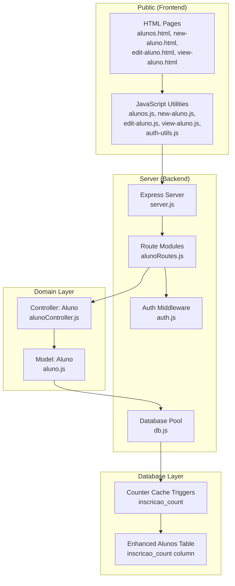
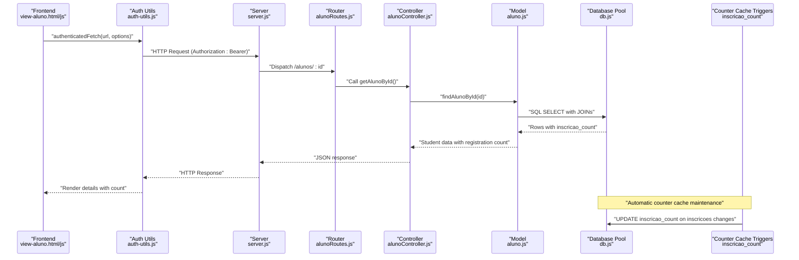
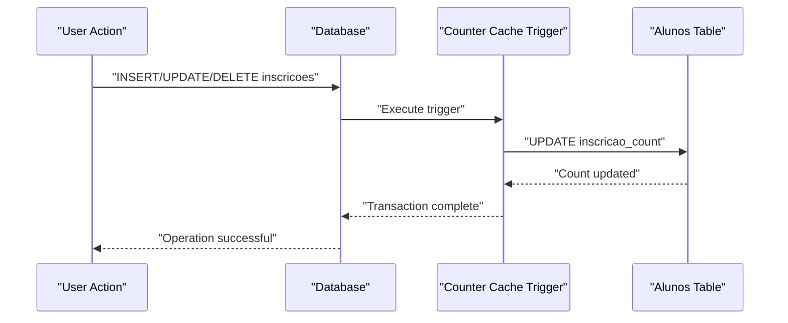
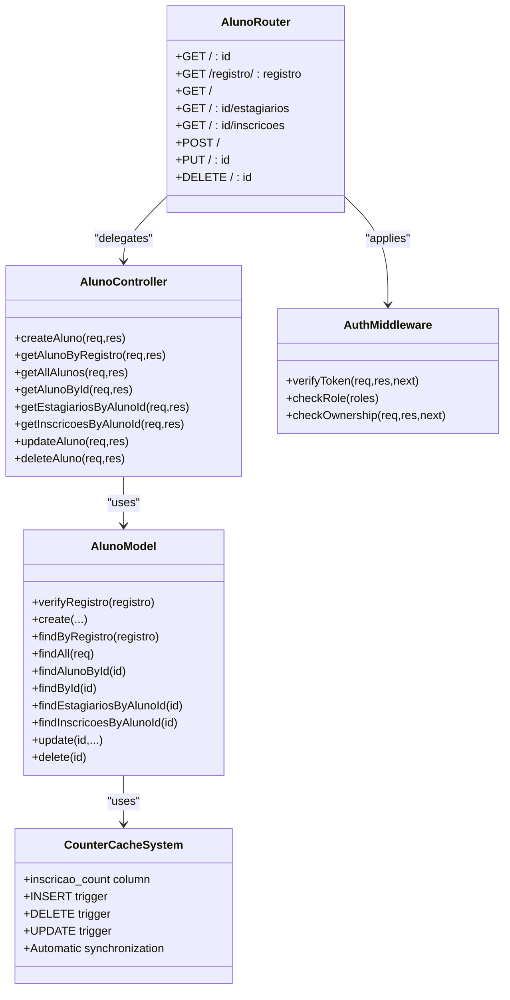
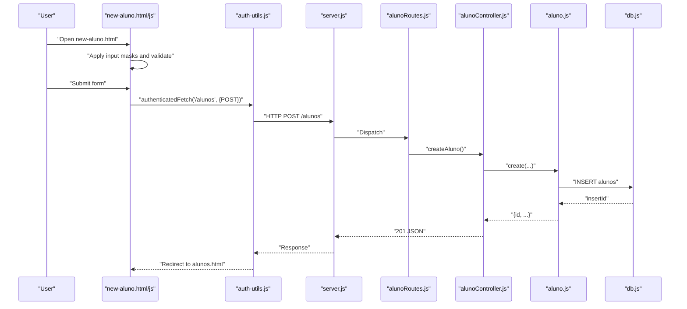
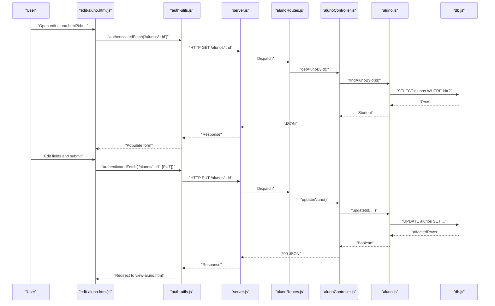
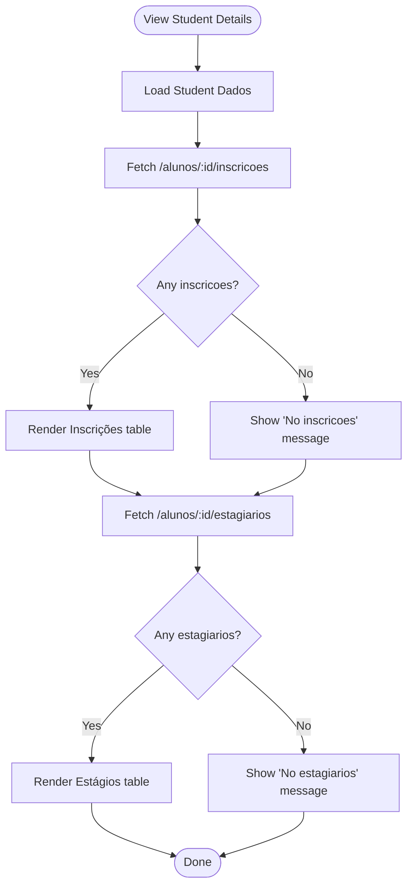
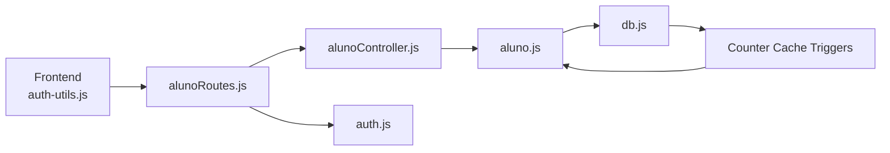

# Student Management System

<cite>
**Referenced Files in This Document**
- [aluno.js](file://src/models/aluno.js)
- [alunoController.js](file://src/controllers/alunoController.js)
- [alunoRoutes.js](file://src/routers/alunoRoutes.js)
- [server.js](file://src/server.js)
- [db.js](file://src/database/db.js)
- [auth.js](file://src/middleware/auth.js)
- [auth-utils.js](file://public/auth-utils.js)
- [alunos.html](file://public/alunos.html)
- [alunos.js](file://public/alunos.js)
- [new-aluno.html](file://public/new-aluno.html)
- [new-aluno.js](file://public/new-aluno.js)
- [edit-aluno.html](file://public/edit-aluno.html)
- [edit-aluno.js](file://public/edit-aluno.js)
- [view-aluno.html](file://public/view-aluno.html)
- [view-aluno.js](file://public/view-aluno.js)
- [add_inscricao_counter_cache.sql](file://src/database/add_inscricao_counter_cache.sql)
- [test_counter_cache_inscricoes.sql](file://test/test_counter_cache_inscricoes.sql)
- [setupFullDatabase.js](file://src/database/setupFullDatabase.js)
</cite>

## Update Summary
**Changes Made**
- Added documentation for the new counter cache system for student registration tracking
- Updated model and database layer documentation to include inscricao_count column
- Enhanced frontend display capabilities for registration counts
- Added trigger-based automatic counting mechanism
- Updated performance considerations to include counter cache benefits

## Table of Contents
1. [Introduction](#introduction)
2. [Project Structure](#project-structure)
3. [Core Components](#core-components)
4. [Architecture Overview](#architecture-overview)
5. [Detailed Component Analysis](#detailed-component-analysis)
6. [Counter Cache System](#counter-cache-system)
7. [Dependency Analysis](#dependency-analysis)
8. [Performance Considerations](#performance-considerations)
9. [Troubleshooting Guide](#troubleshooting-guide)
10. [Conclusion](#conclusion)
11. [Appendices](#appendices)

## Introduction
This document describes the Student Management System with a focus on the student entity lifecycle: registration, profile management, academic records, and enrollment tracking. The system now includes an advanced counter cache system for tracking student registration counts with automatic synchronization through database triggers. It covers the backend controller and model implementations, database interactions, frontend integration via HTML templates and JavaScript utilities, validation rules, data formats, security considerations, and common workflows such as student registration, profile updates, and academic progress tracking. It also provides guidance on performance optimization and integration patterns with other system components.

## Project Structure
The system follows a layered architecture with enhanced counter cache capabilities:
- Frontend: Static HTML pages and client-side scripts under public/.
- Backend: Express server, controllers, models, routers, middleware, and database pool under src/.
- Database: Enhanced with counter cache triggers and automatic synchronization.
- Environment configuration: Uses environment variables for database and JWT secrets.

```mermaid
graph TB
subgraph "Public (Frontend)"
A_HTML["HTML Pages<br/>alunos.html, new-aluno.html,<br/>edit-aluno.html, view-aluno.html"]
A_JS["JavaScript Utilities<br/>alunos.js, new-aluno.js,<br/>edit-aluno.js, view-aluno.js,<br/>auth-utils.js"]
end
subgraph "Server (Backend)"
S_Server["Express Server<br/>server.js"]
S_Routes["Route Modules<br/>alunoRoutes.js"]
S_Middleware["Auth Middleware<br/>auth.js"]
S_DB["Database Pool<br/>db.js"]
end
subgraph "Domain Layer"
M_Model["Model: Aluno<br/>aluno.js"]
C_Controller["Controller: Aluno<br/>alunoController.js"]
end
subgraph "Database Layer"
D_Trigger["Counter Cache Triggers<br/>inscricao_count"]
D_Table["Enhanced Alunos Table<br/>inscricao_count column"]
end
A_HTML --> A_JS
A_JS --> S_Server
S_Server --> S_Routes
S_Routes --> S_Middleware
S_Routes --> C_Controller
C_Controller --> M_Model
M_Model --> S_DB
S_DB --> D_Trigger
D_Trigger --> D_Table
```

**Diagram sources**
- [server.js:31-73](file://src/server.js#L31-L73)
- [alunoRoutes.js:1-25](file://src/routers/alunoRoutes.js#L1-L25)
- [auth.js:1-137](file://src/middleware/auth.js#L1-L137)
- [alunoController.js:1-114](file://src/controllers/alunoController.js#L1-L114)
- [aluno.js:1-146](file://src/models/aluno.js#L1-L146)
- [db.js:1-15](file://src/database/db.js#L1-L15)
- [add_inscricao_counter_cache.sql:1-73](file://src/database/add_inscricao_counter_cache.sql#L1-L73)
- [alunos.html:1-49](file://public/alunos.html#L1-L49)
- [alunos.js:1-75](file://public/alunos.js#L1-L75)
- [new-aluno.html:1-124](file://public/new-aluno.html#L1-L124)
- [new-aluno.js:1-136](file://public/new-aluno.js#L1-L136)
- [edit-aluno.html:1-115](file://public/edit-aluno.html#L1-L115)
- [edit-aluno.js:1-194](file://public/edit-aluno.js#L1-L194)
- [view-aluno.html:1-186](file://public/view-aluno.html#L1-L186)
- [view-aluno.js:1-192](file://public/view-aluno.js#L1-L192)

**Section sources**
- [server.js:31-73](file://src/server.js#L31-L73)
- [alunoRoutes.js:1-25](file://src/routers/alunoRoutes.js#L1-L25)
- [alunoController.js:1-114](file://src/controllers/alunoController.js#L1-L114)
- [aluno.js:1-146](file://src/models/aluno.js#L1-L146)
- [db.js:1-15](file://src/database/db.js#L1-L15)
- [auth.js:1-137](file://src/middleware/auth.js#L1-L137)
- [alunos.html:1-49](file://public/alunos.html#L1-L49)
- [alunos.js:1-75](file://public/alunos.js#L1-L75)
- [new-aluno.html:1-124](file://public/new-aluno.html#L1-L124)
- [new-aluno.js:1-136](file://public/new-aluno.js#L1-L136)
- [edit-aluno.html:1-115](file://public/edit-aluno.html#L1-L115)
- [edit-aluno.js:1-194](file://public/edit-aluno.js#L1-L194)
- [view-aluno.html:1-186](file://public/view-aluno.html#L1-L186)
- [view-aluno.js:1-192](file://public/view-aluno.js#L1-L192)

## Core Components
- Model: Implements CRUD operations for students, including existence checks, retrieval by ID or registration number, listing with optional search, joins with related entities (estagiarios, inscricoes), and deletion safety checks against dependent records. Now includes inscricao_count column for efficient registration tracking.
- Controller: Exposes REST endpoints for creating, retrieving, updating, and deleting students, with robust error handling and status codes.
- Router: Defines route endpoints, applies middleware for authentication, role checks, and ownership verification, and delegates to controller methods.
- Frontend: Provides views for listing, creating, editing, and viewing student details, with client-side validation and authenticated requests. Enhanced to display registration counts.
- Counter Cache System: Automatic synchronization of registration counts through database triggers for improved performance.

Key responsibilities:
- Data integrity: Prevents deletion of students who have related estagiarios or inscricoes.
- Ownership: Restricts edits to self for aluno role users.
- Search: Supports filtering students by name, social name, registration number, or email.
- Performance: Utilizes counter cache for efficient registration count queries.

**Section sources**
- [aluno.js:1-146](file://src/models/aluno.js#L1-L146)
- [alunoController.js:1-114](file://src/controllers/alunoController.js#L1-L114)
- [alunoRoutes.js:1-25](file://src/routers/alunoRoutes.js#L1-L25)
- [auth.js:76-98](file://src/middleware/auth.js#L76-L98)

## Architecture Overview
The system uses a clean separation of concerns with enhanced counter cache capabilities:
- HTTP requests are handled by Express routes.
- Controllers encapsulate business logic and orchestrate model operations.
- Models abstract database interactions and enforce referential integrity.
- Middleware enforces authentication, roles, and ownership.
- Frontend communicates with the backend via authenticated fetch calls and displays data using DataTables.
- Database triggers automatically maintain registration counts for optimal performance.

```mermaid
sequenceDiagram
participant FE as "Frontend<br/>view-aluno.html/js"
participant AuthFE as "Auth Utils<br/>auth-utils.js"
participant BE as "Server<br/>server.js"
participant Routes as "Router<br/>alunoRoutes.js"
participant Ctrl as "Controller<br/>alunoController.js"
participant Model as "Model<br/>aluno.js"
participant DB as "Database Pool<br/>db.js"
participant Trigger as "Counter Cache Triggers<br/>inscricao_count"
FE->>AuthFE : "authenticatedFetch(url, options)"
AuthFE->>BE : "HTTP Request (Authorization : Bearer)"
BE->>Routes : "Dispatch /alunos/ : id"
Routes->>Ctrl : "Call getAlunoById()"
Ctrl->>Model : "findAlunoById(id)"
Model->>DB : "SQL SELECT with JOINs"
DB-->>Model : "Rows with inscricao_count"
Model-->>Ctrl : "Student data with registration count"
Ctrl-->>BE : "JSON response"
BE-->>AuthFE : "HTTP Response"
AuthFE-->>FE : "Render details with count"
Note over Trigger,DB : "Automatic counter cache maintenance"
Trigger->>DB : "UPDATE inscricao_count on inscricoes changes"
```

**Diagram sources**
- [server.js:31-73](file://src/server.js#L31-L73)
- [alunoRoutes.js:1-25](file://src/routers/alunoRoutes.js#L1-L25)
- [alunoController.js:43-56](file://src/controllers/alunoController.js#L43-L56)
- [aluno.js:44-72](file://src/models/aluno.js#L44-L72)
- [db.js:1-15](file://src/database/db.js#L1-L15)
- [view-aluno.js:36-67](file://public/view-aluno.js#L36-L67)
- [auth-utils.js:45-54](file://public/auth-utils.js#L45-L54)
- [add_inscricao_counter_cache.sql:15-57](file://src/database/add_inscricao_counter_cache.sql#L15-L57)

## Detailed Component Analysis

### Model: Aluno
Responsibilities:
- Verify uniqueness of student registration number.
- Create, update, and delete student records.
- Retrieve student by ID (with optional estagiario joins) and by registration number.
- List students with optional search filter, including inscricao_count for performance.
- Fetch related estagiarios and inscricoes with joined attributes.

Data integrity:
- Deletion checks prevent removal of students with existing estagiarios or inscricoes.

Performance considerations:
- Queries use indexed fields (id, registro) and filtered selects to minimize payload.
- JOIN queries are scoped to specific relations to avoid unnecessary data.
- inscricao_count column provides O(1) access to registration counts instead of expensive COUNT queries.

Security considerations:
- No direct exposure of internal identifiers beyond what is necessary for joins.

**Section sources**
- [aluno.js:1-146](file://src/models/aluno.js#L1-L146)

### Controller: Aluno
Endpoints:
- GET /alunos (protected): list all students with registration counts.
- GET /alunos/:id (public): get student by ID.
- GET /alunos/registro/:registro (public): get student by registration number.
- GET /alunos/:id/estagiarios (protected): get estagiarios for student.
- GET /alunos/:id/inscricoes (protected): get inscricoes for student.
- POST /alunos (protected, role: admin|aluno): create student.
- PUT /alunos/:id (protected, role: admin|aluno, ownership): update student.
- DELETE /alunos/:id (protected, role: admin): delete student.

Error handling:
- Returns appropriate HTTP status codes and JSON error messages.
- Throws and logs errors during create/update/delete operations.

**Section sources**
- [alunoController.js:1-114](file://src/controllers/alunoController.js#L1-L114)
- [alunoRoutes.js:1-25](file://src/routers/alunoRoutes.js#L1-L25)

### Router: Aluno
- Applies express.json() middleware.
- Enforces verifyToken for protected routes.
- Enforces checkRole for write operations.
- Enforces checkOwnership for updates by aluno role.

**Section sources**
- [alunoRoutes.js:1-25](file://src/routers/alunoRoutes.js#L1-L25)
- [auth.js:6-29](file://src/middleware/auth.js#L6-L29)
- [auth.js:31-48](file://src/middleware/auth.js#L31-L48)
- [auth.js:76-98](file://src/middleware/auth.js#L76-L98)

### Frontend: Listing Students (alunos.html/js)
- Loads student list via DataTables AJAX to /alunos with Authorization header.
- Displays inscricao_count in a badge format for quick visual reference.
- Provides Edit and Delete actions per row.
- Redirects unauthenticated users to login.html.
- Restricts aluno role users to view their own profile.

**Section sources**
- [alunos.html:1-49](file://public/alunos.html#L1-L49)
- [alunos.js:1-75](file://public/alunos.js#L1-L75)

### Frontend: Creating a New Student (new-aluno.html/js)
- Validates input masks for CEP, CPF, birth date, and ingresso format.
- Enforces business rules: ingresso year matches registro-derived year, and ingresso format is AAAA-S where S is 0, 1, or 2.
- Submits POST /alunos with JSON payload.
- Redirects to list upon success.

**Section sources**
- [new-aluno.html:1-124](file://public/new-aluno.html#L1-L124)
- [new-aluno.js:1-136](file://public/new-aluno.js#L1-L136)

### Frontend: Editing a Student (edit-aluno.html/js)
- Loads existing data via GET /alunos/:id and populates form fields.
- Applies input masks and custom validation similar to creation.
- Supports PUT /alunos/:id for updates.
- Enforces ownership: aluno users can only edit their own record.

**Section sources**
- [edit-aluno.html:1-115](file://public/edit-aluno.html#L1-L115)
- [edit-aluno.js:1-194](file://public/edit-aluno.js#L1-L194)

### Frontend: Viewing a Student (view-aluno.html/js)
- Displays student details in tabs: Dados, Inscrições, Estágios.
- Fetches related inscricoes and estagiarios and renders tabular data.
- Provides navigation to edit or delete (admin-only).
- Enforces role and ownership checks.

**Section sources**
- [view-aluno.html:1-186](file://public/view-aluno.html#L1-L186)
- [view-aluno.js:1-192](file://public/view-aluno.js#L1-L192)

### Authentication Utilities (auth-utils.js)
- Stores and retrieves token and user from localStorage.
- Provides authenticatedFetch helper to attach Authorization header.
- Offers role checks and redirection helpers.

**Section sources**
- [auth-utils.js:1-88](file://public/auth-utils.js#L1-L88)

### Security Model
- JWT token verification middleware ensures protected endpoints are accessed only with valid tokens.
- Role-based access control restricts write operations to admin and aluno roles.
- Ownership middleware ensures aluno users can only manage their own records.
- Frontend enforces role checks and redirects unauthorized users.

**Section sources**
- [auth.js:6-29](file://src/middleware/auth.js#L6-L29)
- [auth.js:31-48](file://src/middleware/auth.js#L31-L48)
- [auth.js:76-98](file://src/middleware/auth.js#L76-L98)
- [auth-utils.js:45-54](file://public/auth-utils.js#L45-L54)

### Database Interactions
- Database pool configured with connection limits and environment variables.
- Model queries use prepared statements to mitigate SQL injection risks.
- JOIN queries fetch related estagiarios and inscricoes with denormalized fields for display.
- inscricao_count column provides efficient registration count access.

**Section sources**
- [db.js:1-15](file://src/database/db.js#L1-L15)
- [aluno.js:54-115](file://src/models/aluno.js#L54-L115)

## Counter Cache System

### Overview
The counter cache system provides automatic synchronization of student registration counts through database triggers. This eliminates the need for expensive COUNT queries and improves system performance significantly.

### Implementation Details

#### Database Schema Enhancement
The alunos table now includes an inscricao_count column with default value 0 and appropriate comments for clarity.

#### Trigger-Based Synchronization
Three database triggers automatically maintain the counter cache:

1. **INSERT Trigger**: Increments inscricao_count when new inscricoes are added
2. **DELETE Trigger**: Decrements inscricao_count when inscricoes are removed
3. **UPDATE Trigger**: Handles changes in aluno_id when inscricoes are moved between students

#### Data Synchronization Process

```mermaid
sequenceDiagram
participant User as "User Action"
participant DB as "Database"
participant Trigger as "Counter Cache Trigger"
participant Aluno as "Alunos Table"
User->>DB : "INSERT/UPDATE/DELETE inscricoes"
DB->>Trigger : "Execute trigger"
Trigger->>Aluno : "UPDATE inscricao_count"
Aluno-->>Trigger : "Count updated"
Trigger-->>DB : "Transaction complete"
DB-->>User : "Operation successful"
```

**Diagram sources**
- [add_inscricao_counter_cache.sql:15-57](file://src/database/add_inscricao_counter_cache.sql#L15-L57)

### Benefits
- **Performance**: Eliminates expensive COUNT queries for registration counts
- **Consistency**: Automatic synchronization ensures data accuracy
- **Scalability**: Reduces database load for large datasets
- **Reliability**: Built-in error handling prevents negative counts

### Testing and Verification
Comprehensive test scripts verify the counter cache functionality:
- Pre-insertion state verification
- Post-insertion count validation
- Post-deletion count restoration
- Edge case handling for boundary conditions

**Section sources**
- [add_inscricao_counter_cache.sql:1-73](file://src/database/add_inscricao_counter_cache.sql#L1-L73)
- [test_counter_cache_inscricoes.sql:1-35](file://test/test_counter_cache_inscricoes.sql#L1-L35)

## Architecture Overview

```mermaid
classDiagram
class AlunoModel {
+verifyRegistro(registro)
+create(...)
+findByRegistro(registro)
+findAll(req)
+findAlunoById(id)
+findById(id)
+findEstagiariosByAlunoId(id)
+findInscricoesByAlunoId(id)
+update(id,...)
+delete(id)
}
class AlunoController {
+createAluno(req,res)
+getAlunoByRegistro(req,res)
+getAllAlunos(req,res)
+getAlunoById(req,res)
+getEstagiariosByAlunoId(req,res)
+getInscricoesByAlunoId(req,res)
+updateAluno(req,res)
+deleteAluno(req,res)
}
class AlunoRouter {
+GET / : id
+GET /registro/ : registro
+GET /
+GET / : id/estagiarios
+GET / : id/inscricoes
+POST /
+PUT / : id
+DELETE / : id
}
class AuthMiddleware {
+verifyToken(req,res,next)
+checkRole(roles)
+checkOwnership(req,res,next)
}
class CounterCacheSystem {
+inscricao_count column
+INSERT trigger
+DELETE trigger
+UPDATE trigger
+Automatic synchronization
}
AlunoRouter --> AlunoController : "delegates"
AlunoController --> AlunoModel : "uses"
AlunoRouter --> AuthMiddleware : "applies"
AlunoModel --> CounterCacheSystem : "uses"
```

**Diagram sources**
- [aluno.js:1-146](file://src/models/aluno.js#L1-L146)
- [alunoController.js:1-114](file://src/controllers/alunoController.js#L1-L114)
- [alunoRoutes.js:1-25](file://src/routers/alunoRoutes.js#L1-L25)
- [auth.js:6-29](file://src/middleware/auth.js#L6-L29)
- [add_inscricao_counter_cache.sql:1-73](file://src/database/add_inscricao_counter_cache.sql#L1-L73)

## Detailed Component Analysis

### Student Registration Workflow

```mermaid
sequenceDiagram
participant U as "User"
participant FE as "new-aluno.html/js"
participant AuthFE as "auth-utils.js"
participant BE as "server.js"
participant Routes as "alunoRoutes.js"
participant Ctrl as "alunoController.js"
participant Model as "aluno.js"
participant DB as "db.js"
U->>FE : "Open new-aluno.html"
FE->>FE : "Apply input masks and validate"
U->>FE : "Submit form"
FE->>AuthFE : "authenticatedFetch('/alunos', {POST})"
AuthFE->>BE : "HTTP POST /alunos"
BE->>Routes : "Dispatch"
Routes->>Ctrl : "createAluno()"
Ctrl->>Model : "create(...)"
Model->>DB : "INSERT alunos"
DB-->>Model : "insertId"
Model-->>Ctrl : "{id, ...}"
Ctrl-->>BE : "201 JSON"
BE-->>AuthFE : "Response"
AuthFE-->>FE : "Redirect to alunos.html"
```

**Diagram sources**
- [new-aluno.html:1-124](file://public/new-aluno.html#L1-L124)
- [new-aluno.js:18-51](file://public/new-aluno.js#L18-L51)
- [auth-utils.js:45-54](file://public/auth-utils.js#L45-L54)
- [server.js:31-73](file://src/server.js#L31-L73)
- [alunoRoutes.js:21-23](file://src/routers/alunoRoutes.js#L21-L23)
- [alunoController.js:5-14](file://src/controllers/alunoController.js#L5-L14)
- [aluno.js:10-20](file://src/models/aluno.js#L10-L20)
- [db.js:1-15](file://src/database/db.js#L1-L15)

### Profile Update Workflow

```mermaid
sequenceDiagram
participant U as "User"
participant FE as "edit-aluno.html/js"
participant AuthFE as "auth-utils.js"
participant BE as "server.js"
participant Routes as "alunoRoutes.js"
participant Ctrl as "alunoController.js"
participant Model as "aluno.js"
participant DB as "db.js"
U->>FE : "Open edit-aluno.html?id=..."
FE->>AuthFE : "authenticatedFetch('/alunos/ : id')"
AuthFE->>BE : "HTTP GET /alunos/ : id"
BE->>Routes : "Dispatch"
Routes->>Ctrl : "getAlunoById()"
Ctrl->>Model : "findAlunoById(id)"
Model->>DB : "SELECT alunos WHERE id=?"
DB-->>Model : "Row"
Model-->>Ctrl : "Student"
Ctrl-->>BE : "JSON"
BE-->>AuthFE : "Response"
AuthFE-->>FE : "Populate form"
U->>FE : "Edit fields and submit"
FE->>AuthFE : "authenticatedFetch('/alunos/ : id', {PUT})"
AuthFE->>BE : "HTTP PUT /alunos/ : id"
BE->>Routes : "Dispatch"
Routes->>Ctrl : "updateAluno()"
Ctrl->>Model : "update(id, ...)"
Model->>DB : "UPDATE alunos SET ..."
DB-->>Model : "affectedRows"
Model-->>Ctrl : "Boolean"
Ctrl-->>BE : "200 JSON"
BE-->>AuthFE : "Response"
AuthFE-->>FE : "Redirect to view-aluno.html"
```

**Diagram sources**
- [edit-aluno.html:1-115](file://public/edit-aluno.html#L1-L115)
- [edit-aluno.js:32-67](file://public/edit-aluno.js#L32-L67)
- [auth-utils.js:45-54](file://public/auth-utils.js#L45-L54)
- [server.js:31-73](file://src/server.js#L31-L73)
- [alunoRoutes.js:22-23](file://src/routers/alunoRoutes.js#L22-L23)
- [alunoController.js:86-99](file://src/controllers/alunoController.js#L86-L99)
- [aluno.js:117-123](file://src/models/aluno.js#L117-L123)
- [db.js:1-15](file://src/database/db.js#L1-L15)

### Academic Progress Tracking

```mermaid
flowchart TD
Start(["View Student Details"]) --> LoadDad["Load Student Dados"]
LoadDad --> LoadInsc["Fetch /alunos/:id/inscricoes"]
LoadInsc --> InscFound{"Any inscricoes?"}
InscFound --> |Yes| RenderInsc["Render Inscrições table"]
InscFound --> |No| ShowInscEmpty["Show 'No inscricoes' message"]
RenderInsc --> LoadEst["Fetch /alunos/:id/estagiarios"]
ShowInscEmpty --> LoadEst
LoadEst --> EstFound{"Any estagiarios?"}
EstFound --> |Yes| RenderEst["Render Estágios table"]
EstFound --> |No| ShowEstEmpty["Show 'No estagiarios' message"]
RenderEst --> End(["Done"])
ShowEstEmpty --> End
```

**Diagram sources**
- [view-aluno.html:112-162](file://public/view-aluno.html#L112-L162)
- [view-aluno.js:68-143](file://public/view-aluno.js#L68-L143)

## Dependency Analysis
- Router depends on Controller.
- Controller depends on Model.
- Model depends on Database Pool.
- Frontend depends on Router via HTTP and on Auth Utilities for token handling.
- Middleware enforces cross-cutting concerns (auth, roles, ownership).
- Database layer depends on Counter Cache Triggers for automatic synchronization.

```mermaid
graph LR
FE["Frontend<br/>auth-utils.js"] --> Routes["alunoRoutes.js"]
Routes --> Ctrl["alunoController.js"]
Ctrl --> Model["aluno.js"]
Model --> DB["db.js"]
Routes --> MW["auth.js"]
DB --> Trigger["Counter Cache Triggers"]
Trigger --> Model
```

**Diagram sources**
- [alunoRoutes.js:1-25](file://src/routers/alunoRoutes.js#L1-L25)
- [alunoController.js:1-114](file://src/controllers/alunoController.js#L1-L114)
- [aluno.js:1-146](file://src/models/aluno.js#L1-L146)
- [db.js:1-15](file://src/database/db.js#L1-L15)
- [auth.js:1-137](file://src/middleware/auth.js#L1-L137)
- [auth-utils.js:1-88](file://public/auth-utils.js#L1-L88)
- [add_inscricao_counter_cache.sql:1-73](file://src/database/add_inscricao_counter_cache.sql#L1-L73)

**Section sources**
- [alunoRoutes.js:1-25](file://src/routers/alunoRoutes.js#L1-L25)
- [alunoController.js:1-114](file://src/controllers/alunoController.js#L1-L114)
- [aluno.js:1-146](file://src/models/aluno.js#L1-L146)
- [db.js:1-15](file://src/database/db.js#L1-L15)
- [auth.js:1-137](file://src/middleware/auth.js#L1-L137)
- [auth-utils.js:1-88](file://public/auth-utils.js#L1-L88)

## Performance Considerations
- Use pagination and server-side filtering for large datasets (already present via DataTables and model search).
- Index database columns frequently queried (id, registro) to speed up lookups.
- Minimize payload sizes by selecting only required columns in list views.
- Avoid unnecessary JOINs when listing; defer detailed joins to specific views.
- Consider caching non-sensitive, static data (e.g., dropdown options) at the client level.
- Monitor database pool usage and adjust connection limits according to workload.
- **Updated**: Leverage counter cache system for registration counts to eliminate expensive COUNT queries.
- **Updated**: Database triggers automatically maintain registration counts for optimal performance.

## Troubleshooting Guide
Common issues and resolutions:
- Token errors: Ensure Authorization header is present and valid; verify JWT_SECRET environment variable.
- Access denied: Confirm user role and ownership; aluno users can only update their own records.
- Registration conflicts: The model prevents duplicate registration numbers; resolve duplicates before retrying.
- Deletion failures: Students with related estagiarios or inscricoes cannot be deleted; remove dependencies first.
- Frontend redirects: Unauthenticated users are redirected to login; ensure localStorage contains token and user.
- **Updated**: Counter cache issues: Verify triggers are properly installed and database permissions are correct.
- **Updated**: Registration count discrepancies: Check trigger execution logs and verify inscricao_count values match actual counts.

**Section sources**
- [auth.js:6-29](file://src/middleware/auth.js#L6-L29)
- [auth.js:31-48](file://src/middleware/auth.js#L31-L48)
- [auth.js:76-98](file://src/middleware/auth.js#L76-L98)
- [aluno.js:10-14](file://src/models/aluno.js#L10-L14)
- [aluno.js:125-143](file://src/models/aluno.js#L125-L143)
- [auth-utils.js:45-54](file://public/auth-utils.js#L45-L54)
- [add_inscricao_counter_cache.sql:1-73](file://src/database/add_inscricao_counter_cache.sql#L1-L73)

## Conclusion
The Student Management System provides a secure, modular, and extensible foundation for managing student entities. The backend offers robust CRUD operations with proper validation and integrity checks, while the frontend delivers responsive user experiences with strong authentication and role-based controls. The newly implemented counter cache system significantly enhances performance by providing automatic synchronization of registration counts through database triggers. By following the documented patterns and best practices, teams can maintain and extend the system effectively while benefiting from improved performance characteristics.

## Appendices

### API Endpoints Summary
- GET /alunos (protected): List students with registration counts.
- GET /alunos/:id (public): Get student by ID.
- GET /alunos/registro/:registro (public): Get student by registration number.
- GET /alunos/:id/estagiarios (protected): Get estagiarios for student.
- GET /alunos/:id/inscricoes (protected): Get inscricoes for student.
- POST /alunos (protected, role: admin|aluno): Create student.
- PUT /alunos/:id (protected, role: admin|aluno, ownership): Update student.
- DELETE /alunos/:id (protected, role: admin): Delete student.

**Section sources**
- [alunoRoutes.js:1-25](file://src/routers/alunoRoutes.js#L1-L25)

### Validation Rules and Data Formats
- Ingresso format: YYYY-S where S is 0, 1, or 2.
- CPF format: 000.000.000-00.
- CEP format: 00000-000.
- Birth date: Converted to yyyy-mm-dd internally for storage.
- Registration number: Must be unique; validated before insert.

**Section sources**
- [new-aluno.js:54-134](file://public/new-aluno.js#L54-L134)
- [edit-aluno.js:112-192](file://public/edit-aluno.js#L112-L192)
- [aluno.js:10-14](file://src/models/aluno.js#L10-L14)

### Security Considerations
- JWT-based authentication enforced by middleware.
- Role-based authorization for write operations.
- Ownership checks for aluno users.
- Frontend role checks and token handling via auth-utils.

**Section sources**
- [auth.js:6-29](file://src/middleware/auth.js#L6-L29)
- [auth.js:31-48](file://src/middleware/auth.js#L31-L48)
- [auth.js:76-98](file://src/middleware/auth.js#L76-L98)
- [auth-utils.js:45-54](file://public/auth-utils.js#L45-L54)

### Counter Cache System Details
- **Column**: inscricao_count in alunos table with default value 0
- **Triggers**: Automatic synchronization for INSERT, DELETE, and UPDATE operations
- **Performance**: Eliminates COUNT queries for registration counts
- **Maintenance**: Built-in error handling prevents negative counts
- **Testing**: Comprehensive test scripts verify functionality

**Section sources**
- [add_inscricao_counter_cache.sql:1-73](file://src/database/add_inscricao_counter_cache.sql#L1-L73)
- [test_counter_cache_inscricoes.sql:1-35](file://test/test_counter_cache_inscricoes.sql#L1-L35)
- [setupFullDatabase.js:129-130](file://src/database/setupFullDatabase.js#L129-L130)