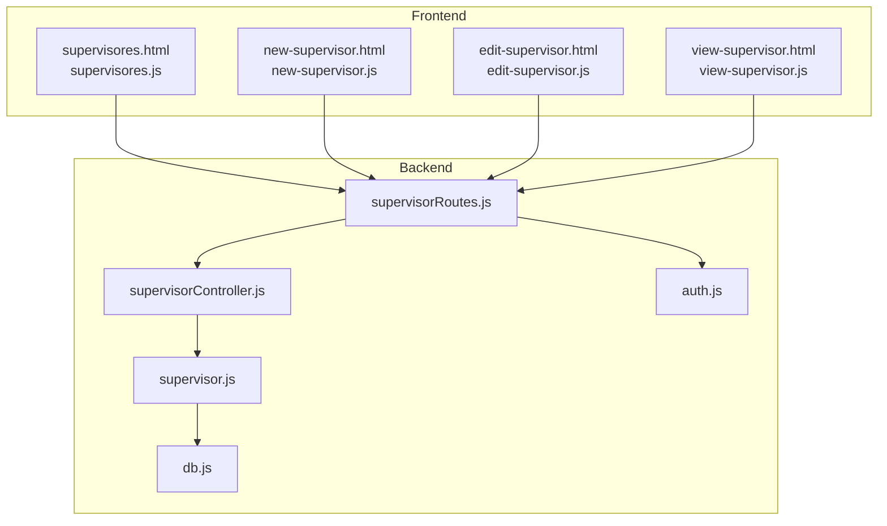
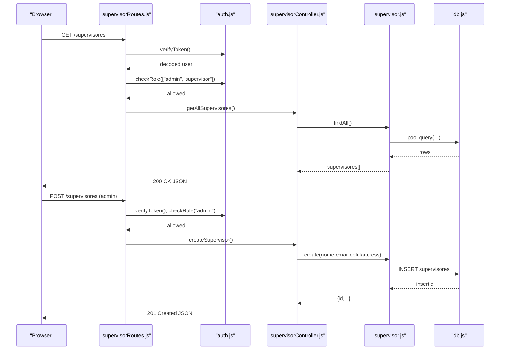
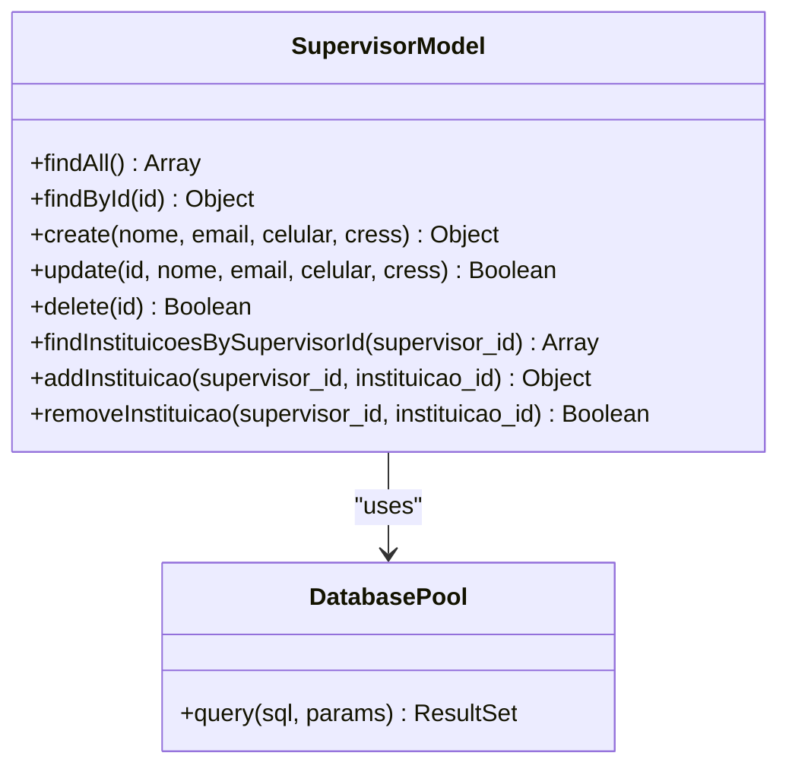
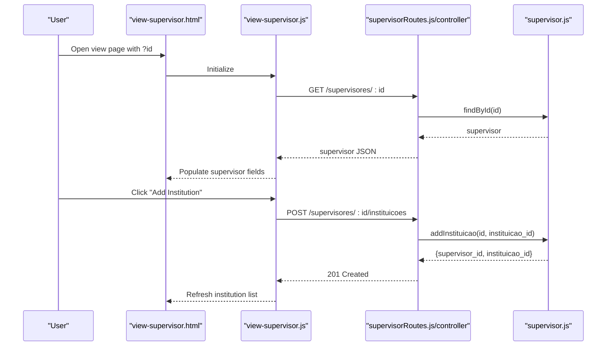
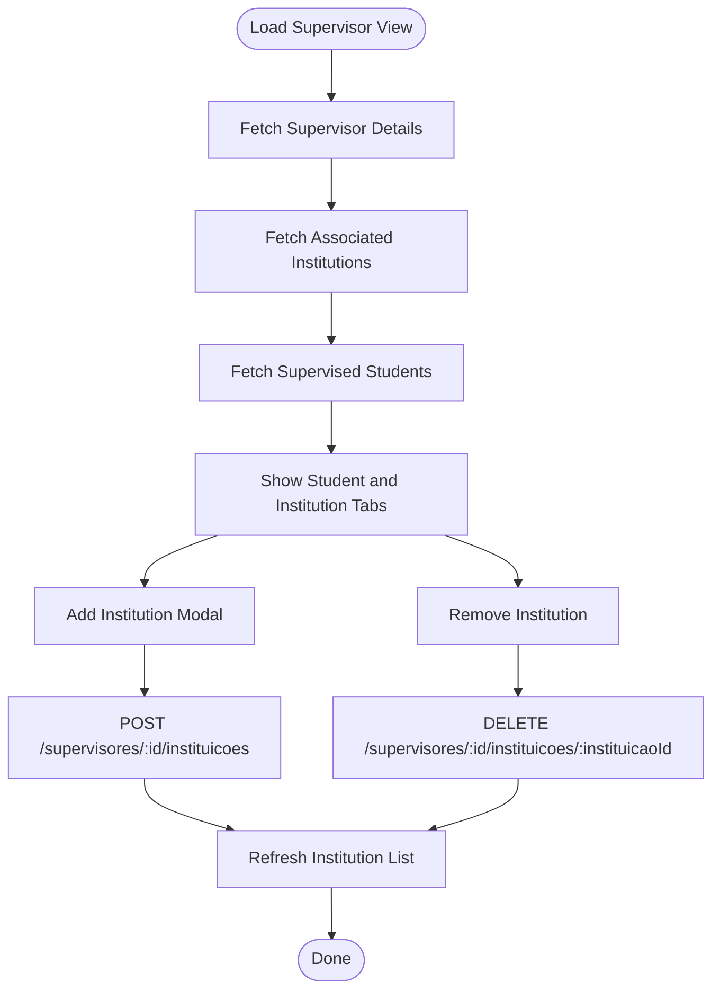
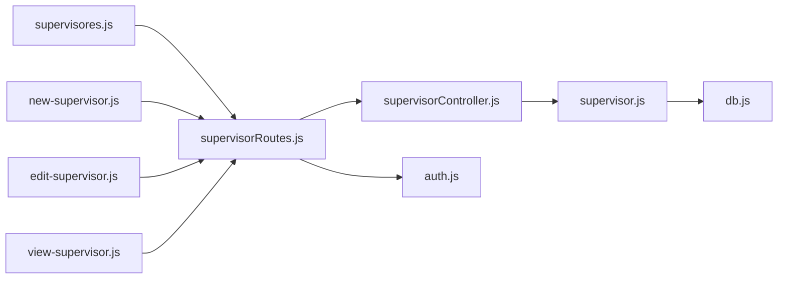

# Supervisor Management

<cite>
**Referenced Files in This Document**
- [supervisor.js](file://src/models/supervisor.js)
- [supervisorController.js](file://src/controllers/supervisorController.js)
- [supervisorRoutes.js](file://src/routers/supervisorRoutes.js)
- [db.js](file://src/database/db.js)
- [auth.js](file://src/middleware/auth.js)
- [supervisores.html](file://public/supervisores.html)
- [new-supervisor.html](file://public/new-supervisor.html)
- [edit-supervisor.html](file://public/edit-supervisor.html)
- [view-supervisor.html](file://public/view-supervisor.html)
- [supervisores.js](file://public/supervisores.js)
- [new-supervisor.js](file://public/new-supervisor.js)
- [edit-supervisor.js](file://public/edit-supervisor.js)
- [view-supervisor.js](file://public/view-supervisor.js)
- [estagio.js](file://src/models/estagio.js)
</cite>

## Table of Contents
1. [Introduction](#introduction)
2. [Project Structure](#project-structure)
3. [Core Components](#core-components)
4. [Architecture Overview](#architecture-overview)
5. [Detailed Component Analysis](#detailed-component-analysis)
6. [Dependency Analysis](#dependency-analysis)
7. [Performance Considerations](#performance-considerations)
8. [Troubleshooting Guide](#troubleshooting-guide)
9. [Conclusion](#conclusion)

## Introduction
This document describes the Supervisor Management system, covering the complete CRUD lifecycle for supervisor entities, professional profile management, institutional affiliation tracking, and integration with the internship management system. It explains backend controller and model operations, frontend integration via HTML templates and JavaScript, validation rules, ownership controls, and workflows for supervisor-student assignment and internship oversight.

## Project Structure
The Supervisor Management system follows a layered architecture:
- Frontend: Static HTML pages and client-side scripts for listing, creating, editing, and viewing supervisors, plus managing institutional affiliations and student supervision views.
- Backend: Express routes, controllers, and models implementing CRUD and specialized operations for supervisors and their relationships.
- Database: MariaDB via a connection pool abstraction.
- Security: JWT-based authentication and authorization middleware enforcing roles and ownership checks.

**Diagram sources**
- [supervisores.html](file://public/supervisores.html#L1-L49)
- [supervisores.js](file://public/supervisores.js#L1-L47)
- [new-supervisor.html](file://public/new-supervisor.html#L1-L57)
- [new-supervisor.js](file://public/new-supervisor.js#L1-L45)
- [edit-supervisor.html](file://public/edit-supervisor.html#L1-L58)
- [edit-supervisor.js](file://public/edit-supervisor.js#L1-L78)
- [view-supervisor.html](file://public/view-supervisor.html#L1-L137)
- [view-supervisor.js](file://public/view-supervisor.js#L1-L225)
- [supervisorRoutes.js](file://src/routers/supervisorRoutes.js#L1-L27)
- [supervisorController.js](file://src/controllers/supervisorController.js#L1-L112)
- [supervisor.js](file://src/models/supervisor.js#L1-L77)
- [db.js](file://src/database/db.js#L1-L15)
- [auth.js](file://src/middleware/auth.js#L1-L137)

**Section sources**
- [supervisorRoutes.js](file://src/routers/supervisorRoutes.js#L1-L27)
- [supervisorController.js](file://src/controllers/supervisorController.js#L1-L112)
- [supervisor.js](file://src/models/supervisor.js#L1-L77)
- [db.js](file://src/database/db.js#L1-L15)
- [auth.js](file://src/middleware/auth.js#L1-L137)
- [supervisores.html](file://public/supervisores.html#L1-L49)
- [new-supervisor.html](file://public/new-supervisor.html#L1-L57)
- [edit-supervisor.html](file://public/edit-supervisor.html#L1-L58)
- [view-supervisor.html](file://public/view-supervisor.html#L1-L137)

## Core Components
- Supervisor Model: Implements CRUD operations for supervisors and manages many-to-many relationships with institutions via an associative table.
- Supervisor Controller: Exposes REST endpoints for supervisors and institutional relationships, with robust error handling.
- Supervisor Routes: Defines protected endpoints with role-based access and ownership checks.
- Authentication & Authorization Middleware: Validates tokens, enforces roles (admin, supervisor), and restricts access to owned records.
- Frontend Pages: Provide listing, creation, editing, and detailed views for supervisors, including institutional associations and student supervision tabs.

Key responsibilities:
- Professional profile management: Create, read, update supervisor details (name, email, phone, CRESS).
- Institutional affiliation tracking: Associate supervisors with institutions and manage those associations.
- Relationship management: Integrate with the internship system to support supervisor-student assignment and oversight.

**Section sources**
- [supervisor.js](file://src/models/supervisor.js#L1-L77)
- [supervisorController.js](file://src/controllers/supervisorController.js#L1-L112)
- [supervisorRoutes.js](file://src/routers/supervisorRoutes.js#L1-L27)
- [auth.js](file://src/middleware/auth.js#L1-L137)

## Architecture Overview
The system uses a clean separation of concerns:
- Routes define the API surface and apply middleware for authentication and authorization.
- Controllers orchestrate model operations and respond with appropriate HTTP statuses.
- Models encapsulate database interactions and maintain referential integrity.
- Frontend pages consume the API to present data and collect user input.

**Diagram sources**
- [supervisorRoutes.js](file://src/routers/supervisorRoutes.js#L12-L24)
- [auth.js](file://src/middleware/auth.js#L6-L29)
- [supervisorController.js](file://src/controllers/supervisorController.js#L4-L40)
- [supervisor.js](file://src/models/supervisor.js#L5-L26)
- [db.js](file://src/database/db.js#L5-L13)

## Detailed Component Analysis

### Supervisor Model
The model encapsulates:
- Listing supervisors with ordered results.
- Retrieving a single supervisor by ID.
- Creating supervisors with required fields.
- Updating supervisors with partial updates.
- Deleting supervisors with cascading removal of institutional relationships.
- Managing many-to-many relationships with institutions via an associative table.

**Diagram sources**
- [supervisor.js](file://src/models/supervisor.js#L4-L76)
- [db.js](file://src/database/db.js#L5-L13)

**Section sources**
- [supervisor.js](file://src/models/supervisor.js#L1-L77)

### Supervisor Controller
Endpoints:
- GET /supervisores: List all supervisors.
- GET /supervisores/:id: Retrieve a supervisor by ID.
- POST /supervisores: Create a supervisor (admin only).
- PUT /supervisores/:id: Update a supervisor (admin or supervisor owner).
- DELETE /supervisores/:id: Delete a supervisor (admin only).
- GET /supervisores/:id/instituicoes: List associated institutions.
- POST /supervisores/:id/instituicoes: Add an institution association.
- DELETE /supervisores/:id/instituicoes/:instituicaoId: Remove an institution association.

Error handling ensures appropriate HTTP status codes and meaningful messages.

**Section sources**
- [supervisorController.js](file://src/controllers/supervisorController.js#L1-L112)

### Supervisor Routes
Security and routing:
- All endpoints require a valid JWT token.
- Role-based access:
  - admin: full CRUD on supervisors and institutional associations.
  - supervisor: read/update access to their own records.
- Ownership enforcement prevents cross-entity access for non-admin users.

**Section sources**
- [supervisorRoutes.js](file://src/routers/supervisorRoutes.js#L1-L27)
- [auth.js](file://src/middleware/auth.js#L32-L98)

### Frontend Integration
- supervisores.html: Lists supervisors with action buttons to edit or delete; requires admin role.
- new-supervisor.html: Form to create a new supervisor; submits to backend and redirects to view.
- edit-supervisor.html: Edit form pre-populated from API; supports PUT updates.
- view-supervisor.html: Detailed view with tabs for supervisor data and supervised students; manages institutional associations via modal.

Client-side scripts:
- supervisores.js: DataTables-driven listing, role checks, and deletion flow.
- new-supervisor.js: Submits new supervisor data and navigates to view.
- edit-supervisor.js: Loads supervisor data, validates presence, and performs updates.
- view-supervisor.js: Loads supervisor details, institutional associations, and supervised students; handles adding/removing institutions and navigation.

**Diagram sources**
- [view-supervisor.html](file://public/view-supervisor.html#L1-L137)
- [view-supervisor.js](file://public/view-supervisor.js#L1-L225)
- [supervisorRoutes.js](file://src/routers/supervisorRoutes.js#L17-L20)
- [supervisorController.js](file://src/controllers/supervisorController.js#L73-L96)
- [supervisor.js](file://src/models/supervisor.js#L47-L65)

**Section sources**
- [supervisores.html](file://public/supervisores.html#L1-L49)
- [supervisores.js](file://public/supervisores.js#L1-L47)
- [new-supervisor.html](file://public/new-supervisor.html#L1-L57)
- [new-supervisor.js](file://public/new-supervisor.js#L1-L45)
- [edit-supervisor.html](file://public/edit-supervisor.html#L1-L58)
- [edit-supervisor.js](file://public/edit-supervisor.js#L1-L78)
- [view-supervisor.html](file://public/view-supervisor.html#L1-L137)
- [view-supervisor.js](file://public/view-supervisor.js#L1-L225)

### Validation Rules and Data Integrity
- Required fields for supervisor creation and updates:
  - Name: required.
  - CRESS: required.
  - Email: optional but validated by browser/form.
  - Phone: optional.
- Institutional affiliation management:
  - Adding an institution requires a valid institution ID.
  - Removing an institution requires a valid relationship exists.
- Ownership and roles:
  - Non-admin users can only access or modify their own records.
  - Admin users bypass ownership checks.
- Cascading deletes:
  - Deleting a supervisor removes all associated institutional relationships before deleting the supervisor record.

**Section sources**
- [supervisorController.js](file://src/controllers/supervisorController.js#L30-L71)
- [supervisor.js](file://src/models/supervisor.js#L36-L44)
- [auth.js](file://src/middleware/auth.js#L77-L98)

### Workflow: Supervisor-Student Assignment and Internship Oversight
- Supervisors can oversee students through institutional affiliations:
  - Institutions are managed via the supervisor view modal.
  - Students are linked to supervisors through the institution-supervisor relationship.
- The system integrates with the internship management system by:
  - Using institution IDs to resolve supervisors for a given institution.
  - Presenting supervised students in the supervisor view for evaluation and oversight.

**Diagram sources**
- [view-supervisor.js](file://public/view-supervisor.js#L55-L156)
- [supervisorRoutes.js](file://src/routers/supervisorRoutes.js#L17-L20)
- [supervisorController.js](file://src/controllers/supervisorController.js#L73-L111)
- [supervisor.js](file://src/models/supervisor.js#L47-L73)

**Section sources**
- [view-supervisor.js](file://public/view-supervisor.js#L163-L206)
- [estagio.js](file://src/models/estagio.js#L43-L51)

## Dependency Analysis
- Route-layer dependencies:
  - supervisorRoutes.js depends on supervisorController.js.
  - supervisorController.js depends on supervisor.js.
  - supervisor.js depends on db.js.
  - supervisorRoutes.js depends on auth.js for middleware.
- Frontend dependencies:
  - All supervisor pages depend on menu.js and auth-utils.js for navigation and authentication checks.
  - view-supervisor.js additionally depends on Bootstrap and jQuery for UI and modals.

**Diagram sources**
- [supervisores.js](file://public/supervisores.js#L1-L47)
- [new-supervisor.js](file://public/new-supervisor.js#L1-L45)
- [edit-supervisor.js](file://public/edit-supervisor.js#L1-L78)
- [view-supervisor.js](file://public/view-supervisor.js#L1-L225)
- [supervisorRoutes.js](file://src/routers/supervisorRoutes.js#L1-L27)
- [supervisorController.js](file://src/controllers/supervisorController.js#L1-L112)
- [supervisor.js](file://src/models/supervisor.js#L1-L77)
- [db.js](file://src/database/db.js#L1-L15)
- [auth.js](file://src/middleware/auth.js#L1-L137)

**Section sources**
- [supervisorRoutes.js](file://src/routers/supervisorRoutes.js#L1-L27)
- [supervisorController.js](file://src/controllers/supervisorController.js#L1-L112)
- [supervisor.js](file://src/models/supervisor.js#L1-L77)
- [db.js](file://src/database/db.js#L1-L15)
- [auth.js](file://src/middleware/auth.js#L1-L137)

## Performance Considerations
- Database pooling: Connection limits and queue behavior are configured centrally to handle concurrent requests efficiently.
- Query optimization: Sorting and filtering are applied at the SQL level for supervisor listings and institution associations.
- Frontend pagination: DataTables handles client-side pagination for supervisor lists, reducing payload sizes.

[No sources needed since this section provides general guidance]

## Troubleshooting Guide
Common issues and resolutions:
- Token errors: Ensure a valid JWT is included in the Authorization header; expired or malformed tokens will be rejected.
- Role/access denied: Non-admin users can only access or modify their own records; verify the user’s role and entidade_id.
- Supervisor not found: Requests for non-existent supervisors return 404; confirm the ID exists.
- Relationship not found: Attempting to remove a non-existent institution association returns 404; verify the relationship exists.
- Network failures: All endpoints log errors and return generic messages; inspect browser network tab and server logs.

**Section sources**
- [auth.js](file://src/middleware/auth.js#L6-L29)
- [supervisorController.js](file://src/controllers/supervisorController.js#L16-L28)
- [supervisorController.js](file://src/controllers/supervisorController.js#L98-L111)

## Conclusion
The Supervisor Management system provides a secure, role-aware, and integrated solution for managing supervisors, their institutional affiliations, and their relationships with students. The backend offers robust CRUD and relationship operations, while the frontend delivers intuitive workflows for data entry, editing, and oversight. The design supports future extensions such as supervision capacity limits and deeper integration with the internship management system.