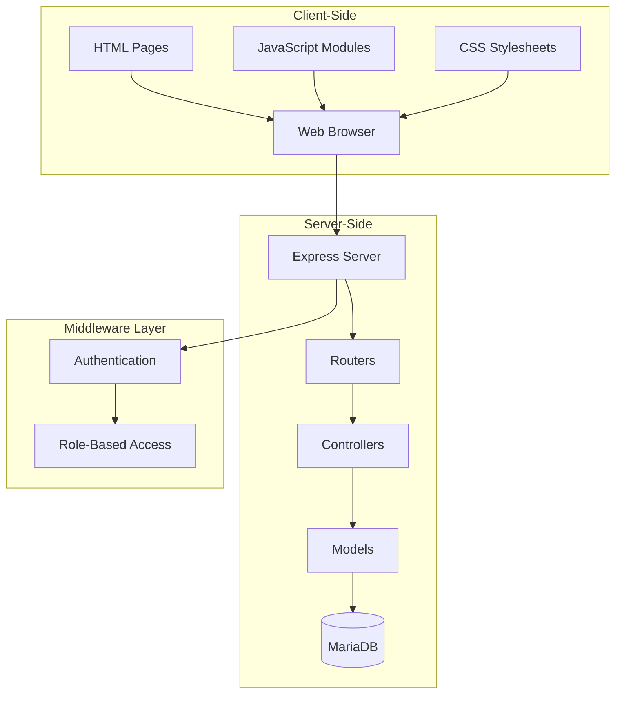
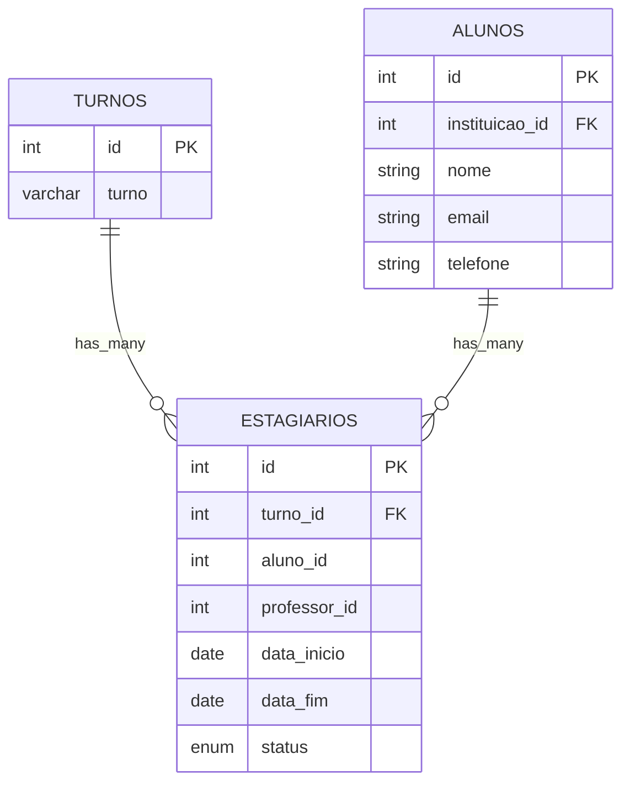
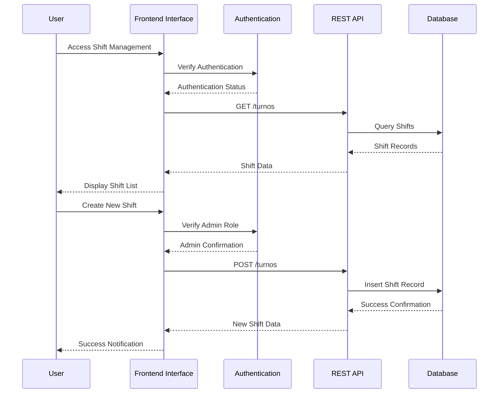
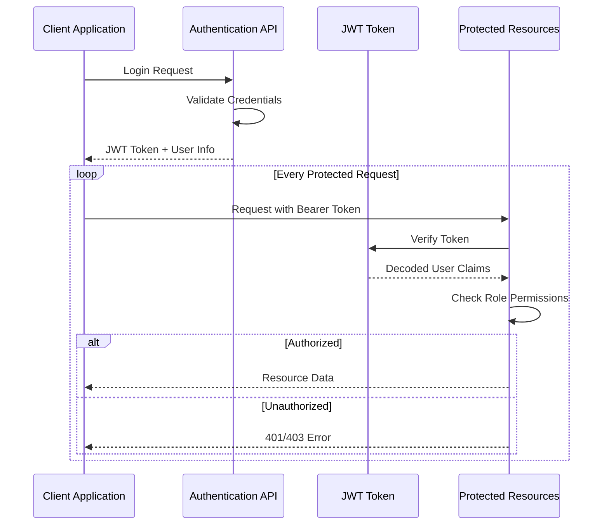

# Turnos Management System

<cite>
**Referenced Files in This Document**
- [README.md](file://README.md)
- [package.json](file://package.json)
- [src/server.js](file://src/server.js)
- [src/database/db.js](file://src/database/db.js)
- [src/middleware/auth.js](file://src/middleware/auth.js)
- [src/models/turno.js](file://src/models/turno.js)
- [src/controllers/turnoController.js](file://src/controllers/turnoController.js)
- [src/routers/turnoRoutes.js](file://src/routers/turnoRoutes.js)
- [public/turnos.html](file://public/turnos.html)
- [public/turnos.js](file://public/turnos.js)
- [public/new-turno.js](file://public/new-turno.js)
- [public/edit-turno.js](file://public/edit-turno.js)
- [public/view-turno.js](file://public/view-turno.js)
- [public/auth-utils.js](file://public/auth-utils.js)
</cite>

## Table of Contents
1. [Introduction](#introduction)
2. [System Architecture](#system-architecture)
3. [Database Design](#database-design)
4. [API Endpoints](#api-endpoints)
5. [Frontend Implementation](#frontend-implementation)
6. [Authentication & Authorization](#authentication--authorization)
7. [Error Handling](#error-handling)
8. [Security Considerations](#security-considerations)
9. [Installation & Setup](#installation--setup)
10. [Troubleshooting Guide](#troubleshooting-guide)
11. [Conclusion](#conclusion)

## Introduction

The Turnos Management System is a comprehensive web application built with Node.js, Express, and MariaDB that manages work shift schedules for educational institutions. The system provides a complete solution for administrators to create, manage, and track different work shifts used in internship programs and educational activities.

This application follows modern web development practices with a clear separation of concerns, implementing the Model-View-Controller (MVC) architectural pattern. The system supports multiple user roles including administrators who have full access to all operations, while restricting regular users to appropriate permissions.

The application serves as a centralized platform for managing work shift information, enabling educational institutions to efficiently organize and monitor student internships and practical training periods across different departments and locations.

## System Architecture

The Turnos Management System follows a client-server architecture with a clear separation between the frontend and backend components:



**Diagram sources**
- [src/server.js:1-70](file://src/server.js#L1-L70)
- [src/routers/turnoRoutes.js:1-16](file://src/routers/turnoRoutes.js#L1-L16)
- [src/controllers/turnoController.js:1-72](file://src/controllers/turnoController.js#L1-L72)
- [src/models/turno.js:1-45](file://src/models/turno.js#L1-L45)

The architecture implements a layered approach where:
- **Presentation Layer**: HTML pages and JavaScript modules handle user interface and client-side interactions
- **Application Layer**: Routers define API endpoints and Controllers handle business logic
- **Data Access Layer**: Models provide database abstraction and ORM functionality
- **Data Layer**: MariaDB serves as the persistent storage layer

**Section sources**
- [src/server.js:1-70](file://src/server.js#L1-L70)
- [src/routers/turnoRoutes.js:1-16](file://src/routers/turnoRoutes.js#L1-L16)

## Database Design

The system uses a relational database design optimized for shift management operations. The primary table for shift management is structured as follows:



**Diagram sources**
- [src/models/turno.js:1-45](file://src/models/turno.js#L1-L45)

The database schema supports:
- **Shift Management**: Centralized storage of shift definitions with unique identifiers
- **Student Internship Tracking**: Association between students and their assigned shifts
- **Hierarchical Organization**: Integration with institution, student, and professor structures
- **Status Tracking**: Ability to monitor active, completed, or pending shift assignments

**Section sources**
- [src/models/turno.js:1-45](file://src/models/turno.js#L1-L45)

## API Endpoints

The system exposes a RESTful API for shift management operations with comprehensive CRUD functionality:

| Method | Endpoint | Authentication | Roles | Description |
|--------|----------|----------------|-------|-------------|
| GET | `/turnos` | Required | All Users | Retrieve all shifts sorted alphabetically |
| GET | `/turnos/:id` | Required | All Users | Fetch specific shift by ID |
| POST | `/turnos` | Required | Admin | Create new shift |
| PUT | `/turnos/:id` | Required | Admin | Update existing shift |
| DELETE | `/turnos/:id` | Required | Admin | Remove shift |

### Request/Response Formats

**GET /turnos**
```javascript
// Response (array)
[
  {
    "id": 1,
    "turno": "Manhã"
  },
  {
    "id": 2,
    "turno": "Tarde"
  }
]
```

**POST /turnos**
```javascript
// Request
{
  "turno": "Noite"
}

// Response
{
  "id": 3,
  "turno": "Noite"
}
```

**Section sources**
- [src/routers/turnoRoutes.js:1-16](file://src/routers/turnoRoutes.js#L1-L16)
- [src/controllers/turnoController.js:1-72](file://src/controllers/turnoController.js#L1-L72)

## Frontend Implementation

The frontend implementation provides three distinct user interfaces for different operational needs:

### Main Dashboard Interface (`turnos.html`)
The primary interface displays all available shifts in a searchable, sortable DataTable with administrative controls for editing and deletion operations.

### Creation Interface (`new-turno.html`)
A streamlined form interface designed for administrators to quickly create new shift entries with real-time validation and error feedback.

### Management Interface (`view-turno.html` & `edit-turno.html`)
Specialized interfaces for viewing individual shift details and editing existing shift information, providing comprehensive administrative capabilities.



**Diagram sources**
- [public/turnos.js:1-51](file://public/turnos.js#L1-L51)
- [public/new-turno.js:1-38](file://public/new-turno.js#L1-L38)
- [public/edit-turno.js:1-62](file://public/edit-turno.js#L1-L62)

**Section sources**
- [public/turnos.html:1-46](file://public/turnos.html#L1-L46)
- [public/turnos.js:1-51](file://public/turnos.js#L1-L51)
- [public/new-turno.js:1-38](file://public/new-turno.js#L1-L38)
- [public/edit-turno.js:1-62](file://public/edit-turno.js#L1-L62)
- [public/view-turno.js:1-54](file://public/view-turno.js#L1-L54)

## Authentication & Authorization

The system implements a robust authentication and authorization framework using JWT tokens with role-based access control:

### Authentication Flow


**Diagram sources**
- [src/middleware/auth.js:1-216](file://src/middleware/auth.js#L1-L216)

### Security Features
- **Token Verification**: Comprehensive JWT validation with expiration handling
- **Role-Based Access**: Fine-grained permission control limiting shift management to administrative users
- **Session Management**: Secure token storage and automatic session termination
- **Input Validation**: Server-side validation preventing invalid data entry

**Section sources**
- [src/middleware/auth.js:1-216](file://src/middleware/auth.js#L1-L216)
- [public/auth-utils.js:1-102](file://public/auth-utils.js#L1-L102)

## Error Handling

The system implements comprehensive error handling across all layers:

### Server-Side Error Handling
- **Database Errors**: Connection pooling with automatic retry mechanisms
- **Validation Errors**: Specific error messages for missing or invalid data
- **Authorization Errors**: Clear distinction between authentication and authorization failures
- **Resource Not Found**: Standardized 404 responses for non-existent records

### Client-Side Error Handling
- **Network Errors**: Graceful handling of API communication failures
- **User Feedback**: Informative error messages displayed to users
- **Form Validation**: Real-time validation with immediate user feedback
- **State Management**: Error boundaries preventing application crashes

**Section sources**
- [src/controllers/turnoController.js:1-72](file://src/controllers/turnoController.js#L1-L72)
- [public/turnos.js:1-51](file://public/turnos.js#L1-L51)

## Security Considerations

The system incorporates multiple security layers to protect data integrity and user privacy:

### Data Protection
- **SQL Injection Prevention**: Parameterized queries using prepared statements
- **Input Sanitization**: Comprehensive validation of all user inputs
- **Cross-Site Scripting (XSS) Prevention**: Content security policies and input encoding
- **Cross-Site Request Forgery (CSRF) Protection**: Token-based request validation

### Access Control
- **Role-Based Permissions**: Administrative restrictions on sensitive operations
- **Token Expiration**: Configurable token lifetimes with automatic renewal
- **Audit Logging**: Comprehensive logging of all administrative actions
- **Rate Limiting**: Protection against brute force attacks and abuse

### Data Integrity
- **Transaction Management**: Atomic operations ensuring data consistency
- **Constraint Validation**: Database-level constraints preventing invalid states
- **Backup Strategies**: Automated backup procedures for disaster recovery

## Installation & Setup

### Prerequisites
- Node.js version 18 or higher
- MariaDB server with network connectivity
- npm package manager for dependency installation

### Environment Configuration
Create a `.env` file in the root directory with the following variables:

| Variable | Description | Default Value |
|----------|-------------|---------------|
| `DB_HOST` | Database server hostname | localhost |
| `DB_USER` | Database username | root |
| `DB_PASSWORD` | Database password | root |
| `DB_NAME` | Database name | tccess |
| `DB_POOL_LIMIT` | Connection pool size | 10 |
| `JWT_SECRET` | Secret key for token generation | your_jwt_secret_key_change_this_in_production |
| `JWT_EXPIRY` | Token expiration time | 7d |
| `PORT` | Server listening port | 3333 |

### Installation Steps
1. Clone the repository to your local machine
2. Install dependencies using `npm install`
3. Configure database connection parameters
4. Set up JWT secret key for authentication
5. Start the development server with `npm run dev`
6. Access the application at `http://localhost:3333`

**Section sources**
- [README.md:1-61](file://README.md#L1-L61)
- [package.json:1-33](file://package.json#L1-L33)

## Troubleshooting Guide

### Common Issues and Solutions

**Database Connection Problems**
- Verify MariaDB service is running and accessible
- Check database credentials in environment variables
- Ensure database name exists and user has proper permissions
- Review connection pool limits for concurrent connections

**Authentication Failures**
- Confirm JWT secret key matches server configuration
- Verify token expiration settings are appropriate
- Check browser localStorage for token persistence
- Ensure proper header formatting for API requests

**API Endpoint Issues**
- Validate endpoint URLs match server route definitions
- Check CORS configuration for cross-origin requests
- Verify JSON payload formatting for POST/PUT requests
- Review server logs for detailed error information

**Frontend Interface Problems**
- Ensure all required JavaScript modules are loaded
- Check browser console for JavaScript errors
- Verify DataTables library compatibility
- Confirm Bootstrap CSS is properly linked

**Performance Optimization**
- Monitor database query performance and optimize slow queries
- Implement proper indexing on frequently queried columns
- Consider connection pooling configuration adjustments
- Optimize frontend resource loading and caching strategies

**Section sources**
- [src/database/db.js:1-15](file://src/database/db.js#L1-L15)
- [src/middleware/auth.js:1-216](file://src/middleware/auth.js#L1-L216)

## Conclusion

The Turnos Management System represents a comprehensive solution for educational institutions seeking efficient shift management capabilities. The system successfully combines modern web technologies with robust architectural principles to deliver a scalable, secure, and maintainable platform.

Key strengths of the implementation include:
- **Clean Architecture**: Clear separation of concerns enabling easy maintenance and extension
- **Security Focus**: Comprehensive authentication and authorization mechanisms protecting sensitive data
- **User Experience**: Intuitive interfaces designed for different user roles and operational needs
- **Database Efficiency**: Optimized data modeling supporting complex relationship queries
- **Error Resilience**: Comprehensive error handling ensuring system reliability

The modular design allows for easy extension to support additional features such as shift scheduling conflicts, automated notifications, or integration with external systems. The codebase provides a solid foundation for future enhancements while maintaining simplicity and maintainability.