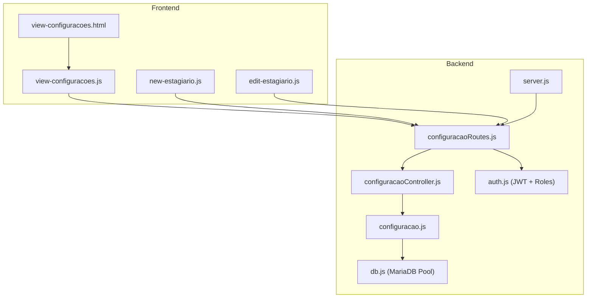
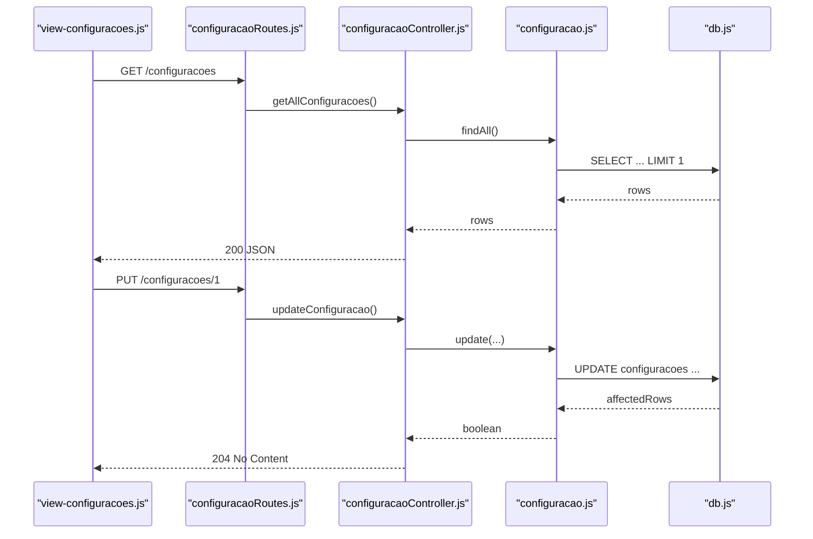
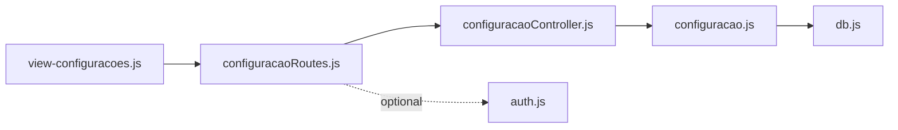

# Configuration & System Models

<cite>
**Referenced Files in This Document**
- [src/models/configuracao.js](file://src/models/configuracao.js)
- [src/controllers/configuracaoController.js](file://src/controllers/configuracaoController.js)
- [src/routers/configuracaoRoutes.js](file://src/routers/configuracaoRoutes.js)
- [src/server.js](file://src/server.js)
- [src/database/db.js](file://src/database/db.js)
- [src/middleware/auth.js](file://src/middleware/auth.js)
- [public/view-configuracoes.html](file://public/view-configuracoes.html)
- [public/view-configuracoes.js](file://public/view-configuracoes.js)
- [public/new-estagiario.js](file://public/new-estagiario.js)
- [public/edit-estagiario.js](file://public/edit-estagiario.js)
- [src/database/setupAuthUsers.js](file://src/database/setupAuthUsers.js)
</cite>

## Table of Contents
1. [Introduction](#introduction)
2. [Project Structure](#project-structure)
3. [Core Components](#core-components)
4. [Architecture Overview](#architecture-overview)
5. [Detailed Component Analysis](#detailed-component-analysis)
6. [Dependency Analysis](#dependency-analysis)
7. [Performance Considerations](#performance-considerations)
8. [Troubleshooting Guide](#troubleshooting-guide)
9. [Conclusion](#conclusion)
10. [Appendices](#appendices)

## Introduction
This document describes the configuration and system management models used by NodeMural to manage global system settings. It focuses on the configuracao model, its fields, data types, validation rules, and business constraints. It also documents configuration categories, parameter types, defaults, lifecycle, change tracking, audit capabilities, security considerations, access controls, and integration with other system components.

## Project Structure
The configuration subsystem is organized around a dedicated model, controller, and route set, integrated into the Express server and consumed by frontend pages. Authentication middleware supports role-based access control for configuration updates.

**Diagram sources**
- [src/server.js](file://src/server.js#L51-L51)
- [src/routers/configuracaoRoutes.js](file://src/routers/configuracaoRoutes.js#L12-L16)
- [src/controllers/configuracaoController.js](file://src/controllers/configuracaoController.js#L5-L42)
- [src/models/configuracao.js](file://src/models/configuracao.js#L4-L24)
- [src/database/db.js](file://src/database/db.js#L5-L13)
- [src/middleware/auth.js](file://src/middleware/auth.js#L6-L29)

**Section sources**
- [src/server.js](file://src/server.js#L31-L53)
- [src/routers/configuracaoRoutes.js](file://src/routers/configuracaoRoutes.js#L1-L18)

## Core Components
- Model: encapsulates database operations for the configuracoes table, exposing find, find by id, and update methods.
- Controller: exposes endpoints to list, retrieve, and update configuration records.
- Routes: define HTTP endpoints for configuration management.
- Frontend: loads and saves configuration values, enforcing basic client-side constraints.
- Database: MariaDB connection pool configured via environment variables.
- Authentication: JWT verification and role checks support access control.

Key implementation references:
- Model methods: [findAll](file://src/models/configuracao.js#L5-L8), [findById](file://src/models/configuracao.js#L11-L14), [update](file://src/models/configuracao.js#L17-L22)
- Controller handlers: [getAllConfiguracoes](file://src/controllers/configuracaoController.js#L5-L13), [getConfiguracaoById](file://src/controllers/configuracaoController.js#L15-L28), [updateConfiguracao](file://src/controllers/configuracaoController.js#L30-L42)
- Routes: [GET /configuracoes](file://src/routers/configuracaoRoutes.js#L15-L16), [GET /configuracoes/:id](file://src/routers/configuracaoRoutes.js#L16), [PUT /configuracoes/:id](file://src/routers/configuracaoRoutes.js#L12)
- Frontend forms and scripts: [view-configuracoes.html](file://public/view-configuracoes.html#L21-L79), [view-configuracoes.js](file://public/view-configuracoes.js#L19-L73)
- Database pool: [db.js](file://src/database/db.js#L5-L13)

**Section sources**
- [src/models/configuracao.js](file://src/models/configuracao.js#L4-L24)
- [src/controllers/configuracaoController.js](file://src/controllers/configuracaoController.js#L5-L42)
- [src/routers/configuracaoRoutes.js](file://src/routers/configuracaoRoutes.js#L1-L18)
- [public/view-configuracoes.html](file://public/view-configuracoes.html#L21-L79)
- [public/view-configuracoes.js](file://public/view-configuracoes.js#L19-L73)
- [src/database/db.js](file://src/database/db.js#L5-L13)

## Architecture Overview
The configuration subsystem follows a layered architecture:
- Presentation: HTML form and JavaScript client handle loading and saving configuration values.
- Routing: Express routes expose endpoints for GET and PUT operations.
- Control: Controllers coordinate requests and responses.
- Persistence: Model executes SQL queries against the MariaDB pool.
- Security: Authentication middleware verifies tokens and enforces roles.

**Diagram sources**
- [src/routers/configuracaoRoutes.js](file://src/routers/configuracaoRoutes.js#L12-L16)
- [src/controllers/configuracaoController.js](file://src/controllers/configuracaoController.js#L5-L42)
- [src/models/configuracao.js](file://src/models/configuracao.js#L5-L22)
- [src/database/db.js](file://src/database/db.js#L5-L13)

## Detailed Component Analysis

### Configuracao Model
The model provides three primary operations:
- Retrieve all configurations (limited to one row).
- Retrieve a configuration by id.
- Update configuration fields by id.

Fields managed by the model:
- mural_periodo_atual
- curso_turma_atual
- curso_abertura_inscricoes
- curso_encerramento_inscricoes
- termo_compromisso_periodo
- termo_compromisso_inicio
- termo_compromisso_final
- periodo_calendario_academico
- id (primary key)

Data types inferred from usage:
- Textual identifiers: string-like period values.
- Numeric identifiers: integer-like course identifiers.
- Date values: ISO-like date strings parsed by the frontend.

Validation and constraints:
- The model does not enforce validation rules at the persistence layer.
- The frontend enforces presence of required fields via HTML inputs.
- The update operation targets a fixed id (1), implying a singleton configuration record.

Operational behavior:
- The model limits query results to a single row, ensuring a singleton configuration pattern.
- The update operation uses a fixed id, simplifying global configuration management.

**Section sources**
- [src/models/configuracao.js](file://src/models/configuracao.js#L4-L24)
- [public/view-configuracoes.html](file://public/view-configuracoes.html#L27-L78)

### Controller Layer
Responsibilities:
- Fetch all configurations for display.
- Fetch a specific configuration by id.
- Update configuration values for a given id.

Error handling:
- Returns 500 with error message on exceptions.
- Returns 404 when a requested configuration id is not found.

Authorization:
- Current routes do not apply role checks; however, the authentication middleware is imported and available for use.

**Section sources**
- [src/controllers/configuracaoController.js](file://src/controllers/configuracaoController.js#L5-L42)
- [src/routers/configuracaoRoutes.js](file://src/routers/configuracaoRoutes.js#L4-L4)

### Route Layer
Endpoints:
- GET /configuracoes: returns the singleton configuration row.
- GET /configuracoes/:id: returns a configuration by id.
- PUT /configuracoes/:id: updates the configuration by id.

Middleware:
- JSON body parsing is enabled globally on the router.

Security:
- Authentication middleware is imported but not currently applied to these routes.

**Section sources**
- [src/routers/configuracaoRoutes.js](file://src/routers/configuracaoRoutes.js#L9-L16)

### Frontend Integration
The configuration page:
- Loads configuration values into form inputs.
- Submits updates to PUT /configuracoes/1.
- Formats date fields to YYYY-MM-DD for input compatibility.

Usage in other pages:
- New estagiario page loads the default period from configuration to prefill forms.
- Edit estagiario page compares estagiario period with current configuration period and displays warnings.

**Section sources**
- [public/view-configuracoes.html](file://public/view-configuracoes.html#L21-L79)
- [public/view-configuracoes.js](file://public/view-configuracoes.js#L19-L73)
- [public/new-estagiario.js](file://public/new-estagiario.js#L15-L24)
- [public/edit-estagiario.js](file://public/edit-estagiario.js#L120-L143)

### Database and Authentication
Database:
- MariaDB connection pool configured via environment variables.
- The model uses the shared pool for queries.

Authentication:
- JWT verification middleware supports role-based access control.
- Ownership checks enable admin bypass and entity-specific access checks for other resources.

**Section sources**
- [src/database/db.js](file://src/database/db.js#L5-L13)
- [src/middleware/auth.js](file://src/middleware/auth.js#L6-L29)
- [src/middleware/auth.js](file://src/middleware/auth.js#L32-L48)
- [src/middleware/auth.js](file://src/middleware/auth.js#L76-L98)

## Dependency Analysis
The configuration subsystem depends on:
- Express routing and controllers.
- A shared MariaDB connection pool.
- Optional authentication middleware for access control.

**Diagram sources**
- [src/routers/configuracaoRoutes.js](file://src/routers/configuracaoRoutes.js#L1-L18)
- [src/controllers/configuracaoController.js](file://src/controllers/configuracaoController.js#L1-L42)
- [src/models/configuracao.js](file://src/models/configuracao.js#L1-L26)
- [src/database/db.js](file://src/database/db.js#L1-L15)
- [src/middleware/auth.js](file://src/middleware/auth.js#L1-L137)

**Section sources**
- [src/server.js](file://src/server.js#L51-L51)
- [src/routers/configuracaoRoutes.js](file://src/routers/configuracaoRoutes.js#L1-L18)
- [src/controllers/configuracaoController.js](file://src/controllers/configuracaoController.js#L1-L42)
- [src/models/configuracao.js](file://src/models/configuracao.js#L1-L26)
- [src/database/db.js](file://src/database/db.js#L1-L15)
- [src/middleware/auth.js](file://src/middleware/auth.js#L1-L137)

## Performance Considerations
- Singleton query pattern: The model limits results to one row, reducing overhead for configuration retrieval.
- Single-row updates: Updates target a fixed id, minimizing join complexity.
- Connection pooling: MariaDB pool configuration allows concurrent connections; tune pool limits according to workload.
- Frontend caching: The client caches configuration values locally after initial load, reducing repeated network calls.

[No sources needed since this section provides general guidance]

## Troubleshooting Guide
Common issues and resolutions:
- Missing configuration row: The singleton query expects at least one row. If absent, the frontend shows a 404 message and suggests saving to create it.
- Update failures: Ensure the id is present in the URL and the request body contains all required fields.
- Authentication errors: If authentication middleware is applied, verify token presence and validity; check role permissions.
- Database connectivity: Confirm environment variables for database credentials and pool limits are set correctly.

**Section sources**
- [public/view-configuracoes.js](file://public/view-configuracoes.js#L37-L43)
- [src/controllers/configuracaoController.js](file://src/controllers/configuracaoController.js#L30-L42)
- [src/middleware/auth.js](file://src/middleware/auth.js#L6-L29)
- [src/database/db.js](file://src/database/db.js#L5-L13)

## Conclusion
NodeMural’s configuration model implements a simple, singleton-based approach to managing global system settings. The model, controller, and route layer are straightforward and integrate cleanly with the frontend. While the current implementation lacks explicit validation and access control at the configuration layer, the system can be extended to include robust validation, role-based access control, and audit/logging capabilities.

[No sources needed since this section summarizes without analyzing specific files]

## Appendices

### Configuration Categories and Parameter Types
- Mural settings
  - mural_periodo_atual: string (period identifier)
- Termo de compromisso
  - termo_compromisso_periodo: string (period identifier)
  - termo_compromisso_inicio: date (ISO-like)
  - termo_compromisso_final: date (ISO-like)
- Academic calendar
  - periodo_calendario_academico: string (period identifier)
- Course supervision
  - curso_turma_atual: number (identifier)
  - curso_abertura_inscricoes: date (ISO-like)
  - curso_encerramento_inscricoes: date (ISO-like)

Defaults and constraints:
- Defaults are not enforced by the backend; the frontend pre-fills values from configuration.
- Required fields are enforced by the HTML form; missing values will prevent submission.
- The model does not validate types or ranges; callers must ensure correct types.

**Section sources**
- [public/view-configuracoes.html](file://public/view-configuracoes.html#L27-L78)
- [public/view-configuracoes.js](file://public/view-configuracoes.js#L22-L35)
- [src/models/configuracao.js](file://src/models/configuracao.js#L17-L22)

### Access Controls and Security
- Authentication: JWT verification middleware supports role-based access control.
- Role checks: The middleware includes a role-check utility suitable for protecting configuration updates.
- Ownership checks: Additional middleware supports ownership verification for other resources; similar patterns can be adapted for configuration.

Recommendations:
- Apply role-based protection to configuration routes (e.g., require admin).
- Enforce input validation and sanitization in the controller/model.
- Add audit logging for configuration changes (e.g., track who changed what and when).

**Section sources**
- [src/middleware/auth.js](file://src/middleware/auth.js#L6-L29)
- [src/middleware/auth.js](file://src/middleware/auth.js#L32-L48)
- [src/routers/configuracaoRoutes.js](file://src/routers/configuracaoRoutes.js#L4-L4)

### Integration with Other Components
- Estagiario creation/edit: Reads current period from configuration to validate and prefill forms.
- Menu navigation: Links to the configuration page are restricted to authenticated users with appropriate roles.

**Section sources**
- [public/new-estagiario.js](file://public/new-estagiario.js#L15-L24)
- [public/edit-estagiario.js](file://public/edit-estagiario.js#L120-L143)
- [public/view-configuracoes.js](file://public/view-configuracoes.js#L6-L9)

### Backup and Restore Procedures
- Database-level backup: Back up the MariaDB database containing the configuracoes table.
- Version control: Store configuration defaults and migration scripts in version control for reproducibility.
- Restore: Restore the database snapshot and ensure the application is restarted if necessary.

[No sources needed since this section provides general guidance]