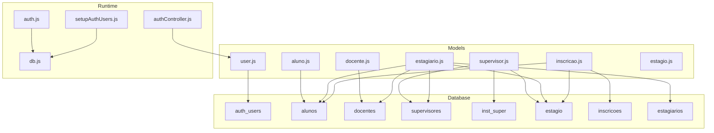
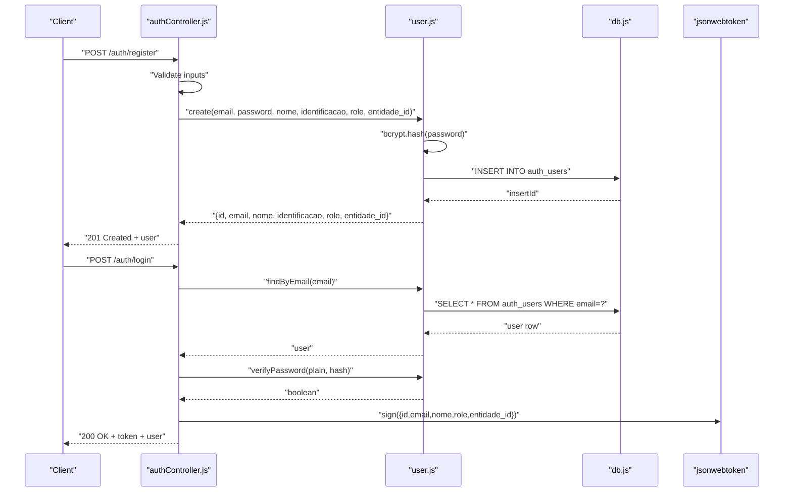
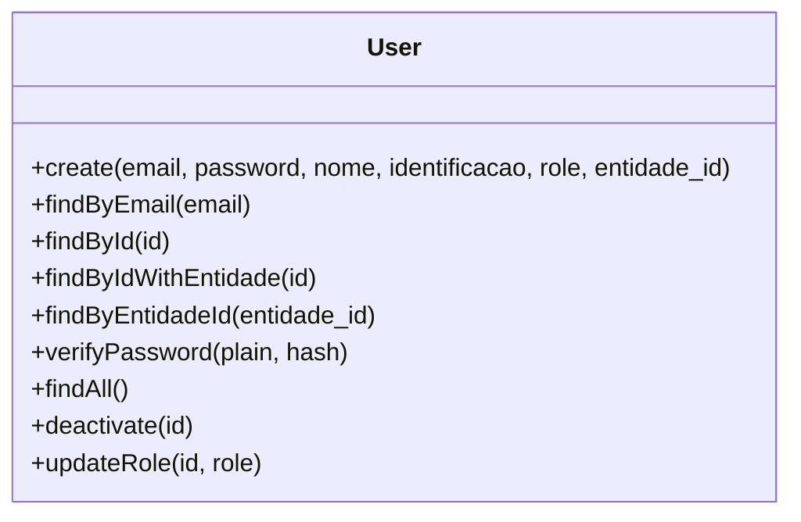
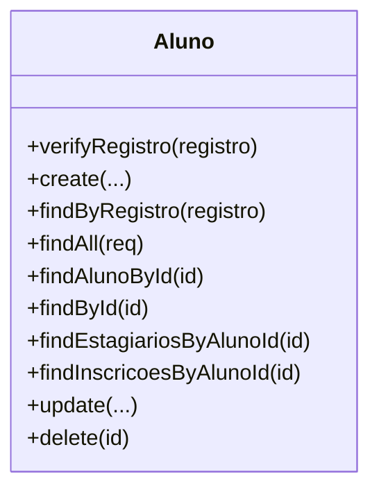
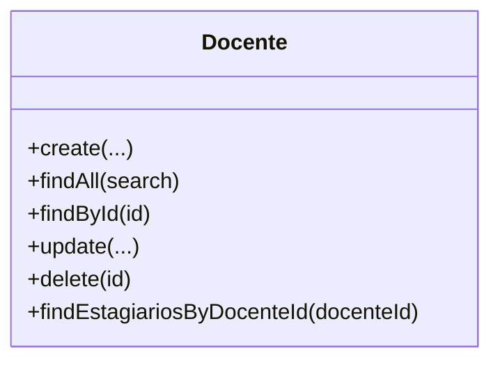
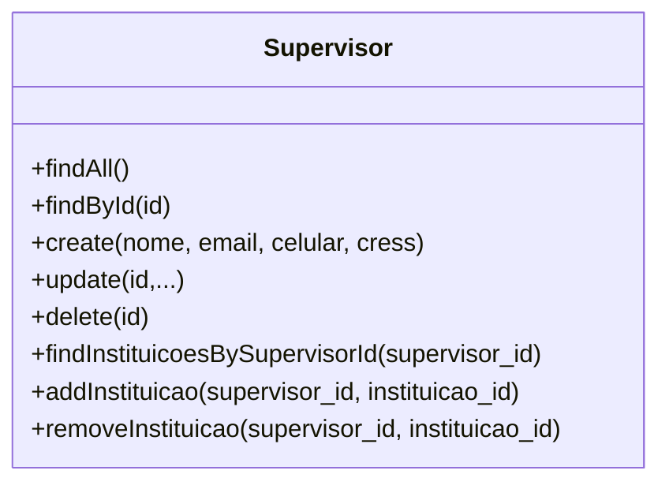
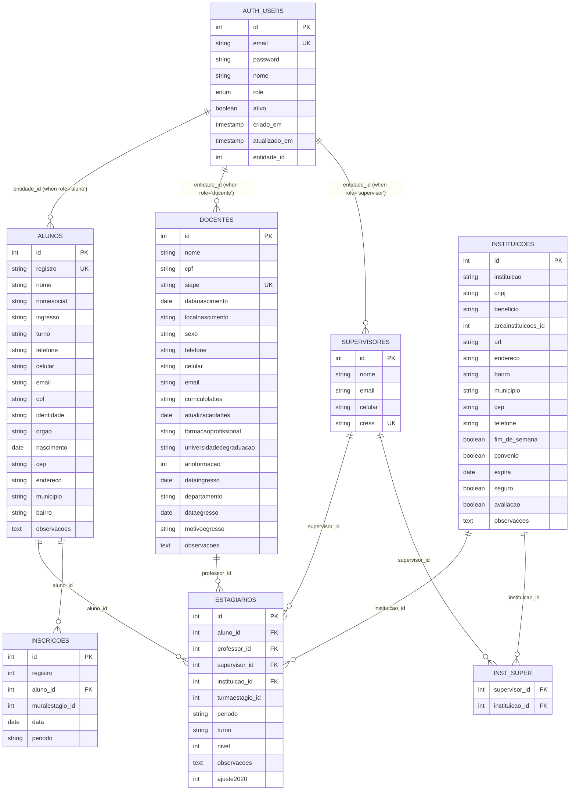
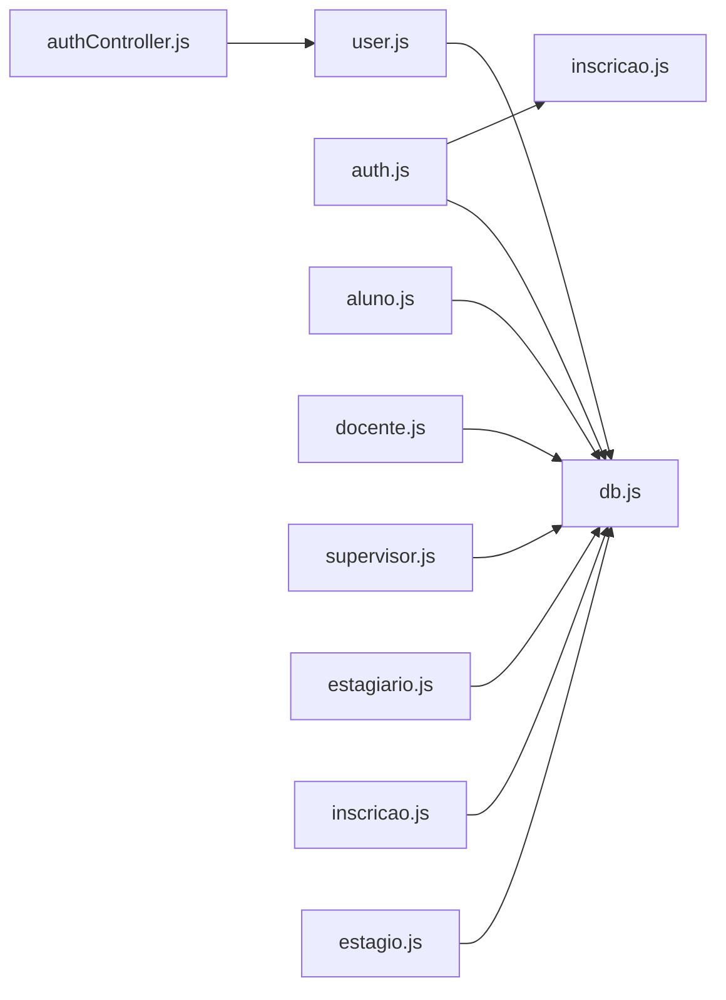

# Core Data Models

<cite>
**Referenced Files in This Document**
- [user.js](file://src/models/user.js)
- [aluno.js](file://src/models/aluno.js)
- [docente.js](file://src/models/docente.js)
- [supervisor.js](file://src/models/supervisor.js)
- [setupAuthUsers.js](file://src/database/setupAuthUsers.js)
- [db.js](file://src/database/db.js)
- [auth.js](file://src/middleware/auth.js)
- [authController.js](file://src/controllers/authController.js)
- [estagiario.js](file://src/models/estagiario.js)
- [inscricao.js](file://src/models/inscricao.js)
- [estagio.js](file://src/models/estagio.js)
- [README.md](file://README.md)
- [AUTH_GUIDE.md](file://AUTH_GUIDE.md)
</cite>

## Table of Contents
1. [Introduction](#introduction)
2. [Project Structure](#project-structure)
3. [Core Components](#core-components)
4. [Architecture Overview](#architecture-overview)
5. [Detailed Component Analysis](#detailed-component-analysis)
6. [Dependency Analysis](#dependency-analysis)
7. [Performance Considerations](#performance-considerations)
8. [Troubleshooting Guide](#troubleshooting-guide)
9. [Conclusion](#conclusion)

## Introduction
This document describes the core user management data models in NodeMural, focusing on the aluno (student), docente (professor), supervisor, and user authentication entities. It explains field definitions, data types, validation rules, business constraints, primary keys, unique constraints, and relationship patterns. It also documents authentication fields, role-based access control (RBAC), profile management, validation patterns, password hashing, and security considerations. Finally, it covers user lifecycle management, account status handling, and access control patterns.

## Project Structure
The user management system centers around:
- A central authentication model that stores credentials and roles
- Separate domain entities (aluno, docente, supervisor) linked via foreign keys
- Middleware enforcing JWT-based authentication and RBAC
- Controllers orchestrating registration, login, and profile retrieval
- Database initialization scripts creating the auth_users table

**Diagram sources**
- [user.js](file://src/models/user.js#L1-L146)
- [aluno.js](file://src/models/aluno.js#L1-L146)
- [docente.js](file://src/models/docente.js#L1-L72)
- [supervisor.js](file://src/models/supervisor.js#L1-L77)
- [estagiario.js](file://src/models/estagiario.js#L1-L187)
- [inscricao.js](file://src/models/inscricao.js#L1-L104)
- [estagio.js](file://src/models/estagio.js#L1-L66)
- [auth.js](file://src/middleware/auth.js#L1-L137)
- [authController.js](file://src/controllers/authController.js#L1-L157)
- [db.js](file://src/database/db.js#L1-L15)
- [setupAuthUsers.js](file://src/database/setupAuthUsers.js#L1-L38)

**Section sources**
- [README.md](file://README.md#L1-L61)
- [AUTH_GUIDE.md](file://AUTH_GUIDE.md#L1-L312)

## Core Components
This section defines the core entities and their attributes, constraints, and relationships.

- auth_users (authentication and identity)
  - Fields: id (auto-increment primary key), email (unique), password, nome, role (ENUM: admin, supervisor, docente, aluno), ativo (boolean), criado_em, atualizado_em
  - Unique constraints: email
  - Business constraints: role defaults to aluno; ativo enables soft-deletion; timestamps track creation/update
  - Relationship: links to aluno, docente, or supervisor via entidade_id depending on role

- alunos (student entity)
  - Fields: id (primary key), nome, nomesocial, ingresso, turno, registro (unique), telefone, celular, email, cpf, identidade, orgao, nascimento, cep, endereco, municipio, bairro, observacoes
  - Unique constraints: registro
  - Business constraints: registro must be unique; deletion guarded by dependent estagiarios and inscricoes checks
  - Relationship: one-to-one with auth_users via entidade_id when role = aluno; one-to-many with estagiarios and inscricoes

- docentes (faculty/professor entity)
  - Fields: id (primary key), nome, cpf, siape (unique), datanascimento, localnascimento, sexo, telefone, celular, email, curriculolattes, atualizacaolattes, formacaoprofissional, universidadedegraduacao, anoformacao, dataingresso, departamento, dataegresso, motivoegresso, observacoes
  - Unique constraints: siape
  - Business constraints: none enforced at model level; deletion allowed but affects estagio joins
  - Relationship: one-to-one with auth_users via entidade_id when role = docente; manages estagiarios

- supervisores (supervisor entity)
  - Fields: id (primary key), nome, email, celular, cress (unique)
  - Unique constraints: cress
  - Business constraints: deletion cascades to inst_super before removing supervisor
  - Relationship: many-to-many with estagio via inst_super; one-to-one with auth_users via entidade_id when role = supervisor

- estagiarios (internship assignment)
  - Fields: id (primary key), aluno_id, professor_id, supervisor_id, instituicao_id, turmaestagio_id, periodo, turno, nivel, observacoes, ajuste2020
  - Business constraints: manages progression rules and period ordering; supports distinct periods query
  - Relationships: belongs to alunos, docentes, supervisores, and estagio; optional to turma_estagios

- inscricoes (student enrollment)
  - Fields: id (primary key), registro, aluno_id, muralestagio_id, data, periodo
  - Business constraints: uniqueness enforced per aluno, muralestagio, and periodo combination
  - Relationships: belongs to alunos and mural_estagio

- estagio (internship institution)
  - Fields: id (primary key), instituicao, cnpj, beneficio, areainstituicoes_id, url, endereco, bairro, municipio, cep, telefone, fim_de_semana, convenio, expira, seguro, avaliacao, observacoes
  - Business constraints: none enforced at model level
  - Relationships: many supervisors via inst_super; many murals via mural_estagio

**Section sources**
- [setupAuthUsers.js](file://src/database/setupAuthUsers.js#L11-L22)
- [user.js](file://src/models/user.js#L5-L143)
- [aluno.js](file://src/models/aluno.js#L5-L143)
- [docente.js](file://src/models/docente.js#L4-L68)
- [supervisor.js](file://src/models/supervisor.js#L4-L73)
- [estagiario.js](file://src/models/estagiario.js#L4-L183)
- [inscricao.js](file://src/models/inscricao.js#L4-L100)
- [estagio.js](file://src/models/estagio.js#L4-L62)

## Architecture Overview
The authentication and user lifecycle are implemented as follows:
- Registration and login handled by the auth controller
- Passwords are hashed using bcrypt before storage
- JWT tokens encode user identity and role
- Middleware enforces token presence and role checks
- The user model bridges auth_users with role-specific entities via entidade_id

**Diagram sources**
- [authController.js](file://src/controllers/authController.js#L6-L74)
- [user.js](file://src/models/user.js#L7-L34)
- [db.js](file://src/database/db.js#L5-L13)

**Section sources**
- [authController.js](file://src/controllers/authController.js#L1-L157)
- [user.js](file://src/models/user.js#L1-L146)
- [db.js](file://src/database/db.js#L1-L15)
- [AUTH_GUIDE.md](file://AUTH_GUIDE.md#L66-L135)

## Detailed Component Analysis

### User Model (auth_users)
- Responsibilities
  - Create users with hashed passwords
  - Lookup by email/ID with active status filter
  - Fetch user plus related entity (aluno/docente/supervisor) by ID
  - List active users, deactivate users (soft delete), update role
  - Password verification using bcrypt
- Data types and constraints
  - id: integer, auto-increment, primary key
  - email: varchar(255), unique
  - password: varchar(255)
  - role: enum('admin','supervisor','docente','aluno'), default 'aluno'
  - ativo: boolean, default true
  - timestamps: criado_em, atualizado_em
- Validation and security
  - Email uniqueness enforced at DB level
  - Passwords hashed with bcrypt before insertion
  - Active status checked in lookup methods
- Lifecycle
  - Creation validates uniqueness; inserts auth_users
  - Deactivation toggles ativo flag
  - Role updates supported

**Diagram sources**
- [user.js](file://src/models/user.js#L5-L143)

**Section sources**
- [user.js](file://src/models/user.js#L1-L146)
- [setupAuthUsers.js](file://src/database/setupAuthUsers.js#L11-L22)

### Aluno (Student)
- Responsibilities
  - Create/update/delete alunos with validation
  - Search alunos by name/social name/registro/email
  - Join with estagiarios and inscricoes for comprehensive views
  - Guard deletion against existing estagiarios and inscricoes
- Data types and constraints
  - id: integer, primary key
  - registro: unique
  - Other fields: varchar/integer/text/date as appropriate
- Validation and business rules
  - Registro uniqueness enforced at model level
  - Deletion blocked if aluno has estagiarios or inscricoes
- Relationships
  - One-to-one with auth_users via entidade_id when role = aluno
  - One-to-many with estagiarios and inscricoes

**Diagram sources**
- [aluno.js](file://src/models/aluno.js#L4-L143)

**Section sources**
- [aluno.js](file://src/models/aluno.js#L1-L146)

### Docente (Professor)
- Responsibilities
  - Create/update/delete docentes
  - Search by name
  - List estagiarios supervised by this docente
- Data types and constraints
  - id: integer, primary key
  - siape: unique
- Relationships
  - One-to-one with auth_users via entidade_id when role = docente
  - Manages estagiarios (via estagio joins)

**Diagram sources**
- [docente.js](file://src/models/docente.js#L4-L68)

**Section sources**
- [docente.js](file://src/models/docente.js#L1-L72)

### Supervisor
- Responsibilities
  - Create/update/delete supervisores
  - Manage institution associations via inst_super
  - List institutions linked to a supervisor
- Data types and constraints
  - id: integer, primary key
  - cress: unique
- Relationships
  - Many-to-many with estagio via inst_super
  - One-to-one with auth_users via entidade_id when role = supervisor

**Diagram sources**
- [supervisor.js](file://src/models/supervisor.js#L4-L73)

**Section sources**
- [supervisor.js](file://src/models/supervisor.js#L1-L77)

### Entity Relationship Diagram (ERD)
The following ERD maps the core entities and their relationships as implemented in the codebase.

**Diagram sources**
- [setupAuthUsers.js](file://src/database/setupAuthUsers.js#L11-L22)
- [aluno.js](file://src/models/aluno.js#L10-L19)
- [docente.js](file://src/models/docente.js#L5-L10)
- [supervisor.js](file://src/models/supervisor.js#L20-L25)
- [estagiario.js](file://src/models/estagiario.js#L56-L63)
- [inscricao.js](file://src/models/inscricao.js#L58-L73)
- [estagio.js](file://src/models/estagio.js#L20-L25)

**Section sources**
- [setupAuthUsers.js](file://src/database/setupAuthUsers.js#L1-L38)
- [aluno.js](file://src/models/aluno.js#L1-L146)
- [docente.js](file://src/models/docente.js#L1-L72)
- [supervisor.js](file://src/models/supervisor.js#L1-L77)
- [estagiario.js](file://src/models/estagiario.js#L1-L187)
- [inscricao.js](file://src/models/inscricao.js#L1-L104)
- [estagio.js](file://src/models/estagio.js#L1-L66)

## Dependency Analysis
- Internal dependencies
  - authController depends on user model for registration/login
  - user model depends on db pool for SQL operations
  - auth middleware depends on jwt for token verification and on models for ownership checks
  - aluno/docente/supervisor models depend on db pool
- External dependencies
  - bcryptjs for password hashing
  - jsonwebtoken for JWT signing/verification
  - mariadb pool for database connectivity

**Diagram sources**
- [authController.js](file://src/controllers/authController.js#L1-L157)
- [user.js](file://src/models/user.js#L1-L146)
- [auth.js](file://src/middleware/auth.js#L1-L137)
- [db.js](file://src/database/db.js#L1-L15)
- [aluno.js](file://src/models/aluno.js#L1-L146)
- [docente.js](file://src/models/docente.js#L1-L72)
- [supervisor.js](file://src/models/supervisor.js#L1-L77)
- [estagiario.js](file://src/models/estagiario.js#L1-L187)
- [inscricao.js](file://src/models/inscricao.js#L1-L104)
- [estagio.js](file://src/models/estagio.js#L1-L66)

**Section sources**
- [auth.js](file://src/middleware/auth.js#L1-L137)
- [authController.js](file://src/controllers/authController.js#L1-L157)
- [user.js](file://src/models/user.js#L1-L146)
- [db.js](file://src/database/db.js#L1-L15)

## Performance Considerations
- Indexing recommendations
  - auth_users: email (already unique); consider adding indexes on role and ativo for filtered queries
  - alunos: registro (unique); consider indexes on nome, nomesocial, email for search
  - docentes: siape (unique); consider index on nome for search
  - supervisores: cress (unique)
  - estagiarios: indexes on aluno_id, professor_id, supervisor_id, instituicao_id, periodo for joins and filtering
  - inscricoes: composite index on (aluno_id, muralestagio_id, periodo) to enforce uniqueness and speed lookups
- Query patterns
  - Prefer selective projections (avoid SELECT *) in frequently executed queries
  - Use pagination for large lists (already used in aluno.js for search)
- Connection pooling
  - Tune DB_POOL_LIMIT according to workload; ensure proper release of connections

## Troubleshooting Guide
- Authentication errors
  - Missing/invalid/expired token: handled by verifyToken middleware returning 401
  - Wrong credentials during login: authController rejects with 401
- Authorization errors
  - Insufficient role: checkRole middleware returns 403
  - Ownership violations: checkOwnership and checkInscricaoOwnership return 403
- Data integrity errors
  - Duplicate email: user.create throws "Email já registrado"
  - Duplicate registro: aluno.create throws "Registro já em uso"
  - Duplicate inscricao: inscricao.create/update throws "Aluno já inscrito nesta vaga para este período"
  - Deletion conflicts: aluno.delete blocks deletion if estagiarios or inscricoes exist
- Environment configuration
  - Ensure JWT_SECRET and DB_* variables are set in .env
  - Confirm auth_users table exists via setupAuthUsers.js

**Section sources**
- [auth.js](file://src/middleware/auth.js#L6-L29)
- [auth.js](file://src/middleware/auth.js#L32-L48)
- [auth.js](file://src/middleware/auth.js#L77-L98)
- [auth.js](file://src/middleware/auth.js#L100-L136)
- [authController.js](file://src/controllers/authController.js#L10-L27)
- [authController.js](file://src/controllers/authController.js#L86-L96)
- [user.js](file://src/models/user.js#L9-L13)
- [aluno.js](file://src/models/aluno.js#L11-L14)
- [inscricao.js](file://src/models/inscricao.js#L60-L67)
- [aluno.js](file://src/models/aluno.js#L125-L139)
- [AUTH_GUIDE.md](file://AUTH_GUIDE.md#L289-L300)

## Conclusion
NodeMural’s user management employs a clean separation between authentication (auth_users) and role-specific entities (alunos, docentes, supervisores). The system enforces strong constraints at both the DB and model levels, uses bcrypt for secure password hashing, and implements JWT-based RBAC with middleware guards. The ERD reflects clear foreign key relationships and supports complex queries across entities. Following the outlined validation, security, and lifecycle practices ensures robust operation and maintainability.