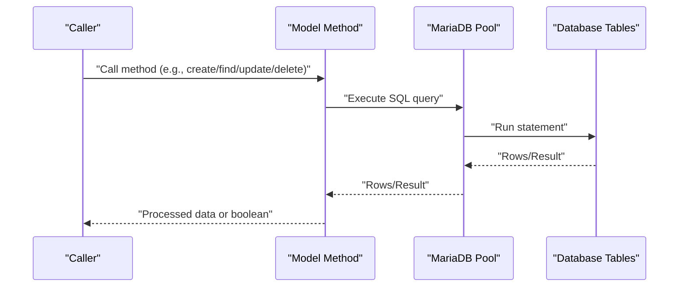
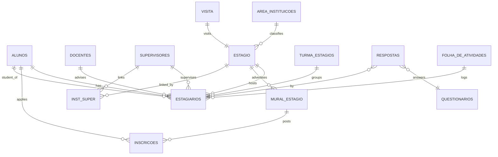
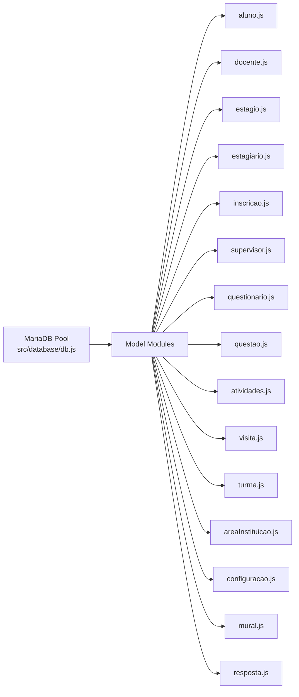

# Data Models & Database Design

<cite>
**Referenced Files in This Document**
- [db.js](file://src/database/db.js)
- [aluno.js](file://src/models/aluno.js)
- [docente.js](file://src/models/docente.js)
- [estagio.js](file://src/models/estagio.js)
- [estagiario.js](file://src/models/estagiario.js)
- [inscricao.js](file://src/models/inscricao.js)
- [supervisor.js](file://src/models/supervisor.js)
- [questionario.js](file://src/models/questionario.js)
- [questao.js](file://src/models/questao.js)
- [atividades.js](file://src/models/atividades.js)
- [visita.js](file://src/models/visita.js)
- [turma.js](file://src/models/turma.js)
- [areaInstituicao.js](file://src/models/areaInstituicao.js)
- [configuracao.js](file://src/models/configuracao.js)
- [mural.js](file://src/models/mural.js)
- [resposta.js](file://src/models/resposta.js)
</cite>

## Table of Contents
1. [Introduction](#introduction)
2. [Project Structure](#project-structure)
3. [Core Components](#core-components)
4. [Architecture Overview](#architecture-overview)
5. [Detailed Component Analysis](#detailed-component-analysis)
6. [Dependency Analysis](#dependency-analysis)
7. [Performance Considerations](#performance-considerations)
8. [Troubleshooting Guide](#troubleshooting-guide)
9. [Conclusion](#conclusion)
10. [Appendices](#appendices)

## Introduction
This document describes the data models and database design for NodeMural, focusing on the entities and relationships used to manage students, teachers, internships, applications, supervisors, questionnaires, activities, visits, classes, areas, and configurations. It documents primary keys, foreign keys, indexes, constraints, validation rules, referential integrity, data access patterns, and performance considerations. It also outlines data lifecycle, cascading operations, and security-related aspects derived from the codebase.

## Project Structure
The data access layer is implemented via plain SQL queries executed against a MariaDB pool. Each domain entity is represented by a model module under src/models that encapsulates CRUD operations and joins for related data. The database connection is configured centrally in src/database/db.js.

```mermaid
graph TB
subgraph "Database Layer"
DB["MariaDB Pool<br/>src/database/db.js"]
end
subgraph "Models"
AL["Aluno Model<br/>src/models/aluno.js"]
DC["Docente Model<br/>src/models/docente.js"]
ES["Estagio Model<br/>src/models/estagio.js"]
EG["Estagiario Model<br/>src/models/estagiario.js"]
IN["Inscricao Model<br/>src/models/inscricao.js"]
SV["Supervisor Model<br/>src/models/supervisor.js"]
QZ["Questionario Model<br/>src/models/questionario.js"]
QA["Questao Model<br/>src/models/questao.js"]
AT["Atividades Model<br/>src/models/atividades.js"]
VS["Visita Model<br/>src/models/visita.js"]
TR["Turma Model<br/>src/models/turma.js"]
AR["AreaInstituicao Model<br/>src/models/areaInstituicao.js"]
CF["Configuracao Model<br/>src/models/configuracao.js"]
MR["Mural Model<br/>src/models/mural.js"]
RP["Resposta Model<br/>src/models/resposta.js"]
end
DB --> AL
DB --> DC
DB --> ES
DB --> EG
DB --> IN
DB --> SV
DB --> QZ
DB --> QA
DB --> AT
DB --> VS
DB --> TR
DB --> AR
DB --> CF
DB --> MR
DB --> RP
```

**Diagram sources**
- [db.js](file://src/database/db.js#L1-L15)
- [aluno.js](file://src/models/aluno.js#L1-L146)
- [docente.js](file://src/models/docente.js#L1-L72)
- [estagio.js](file://src/models/estagio.js#L1-L66)
- [estagiario.js](file://src/models/estagiario.js#L1-L187)
- [inscricao.js](file://src/models/inscricao.js#L1-L104)
- [supervisor.js](file://src/models/supervisor.js#L1-L77)
- [questionario.js](file://src/models/questionario.js#L1-L38)
- [questao.js](file://src/models/questao.js#L1-L53)
- [atividades.js](file://src/models/atividades.js#L1-L57)
- [visita.js](file://src/models/visita.js#L1-L51)
- [turma.js](file://src/models/turma.js#L1-L39)
- [areaInstituicao.js](file://src/models/areaInstituicao.js#L1-L45)
- [configuracao.js](file://src/models/configuracao.js#L1-L26)
- [mural.js](file://src/models/mural.js#L1-L91)
- [resposta.js](file://src/models/resposta.js#L1-L183)

**Section sources**
- [db.js](file://src/database/db.js#L1-L15)

## Core Components
This section summarizes the entities and their roles, focusing on fields, constraints, and relationships inferred from the models.

- alunos
  - Purpose: Stores student profiles.
  - Key fields: id (auto-increment), nome, nomesocial, ingresso, turno, registro (unique verification), telefone, celular, email, cpf, identidade, orgao, nascimento, cep, endereco, municipio, bairro, observacoes.
  - Constraints: Unique registration number enforced by model-level verification.
  - Relationships: One-to-many with estagiarios; one-to-many with inscricoes.
  - Access patterns: Search by name/social name/registration/email; join with estagiarios and inscricoes.

- docentes
  - Purpose: Stores faculty profiles.
  - Key fields: id (auto-increment), nome, cpf, siape, datanascimento, localnascimento, sexo, telefone, celular, email, curriculolattes, atualizacaolattes, formacaoprofissional, universidadedegraduacao, anoformacao, dataingresso, departamento, dataegresso, motivoegresso, observacoes.
  - Relationships: Many-to-many with estagio via estagiarios (via professor_id).
  - Access patterns: List/search by name; join to retrieve estagiarios.

- estagio
  - Purpose: Stores internship institution details.
  - Key fields: id (auto-increment), instituicao, cnpj, beneficio, areainstituicoes_id, url, endereco, bairro, municipio, cep, telefone, fim_de_semana, convenio, expira, seguro, avaliacao, observacoes.
  - Relationships: One-to-many with estagiarios; many-to-one with area_instituicoes; many-to-one with mural_estagio via mural.
  - Access patterns: List with area name; find supervisors linked via junction table; list mural entries.

- estagiarios
  - Purpose: Tracks student internships across periods and levels.
  - Key fields: id (auto-increment), aluno_id, professor_id, supervisor_id, instituicao_id, turmaestagio_id, periodo, turno, nivel, observacoes, ajuste2020.
  - Relationships: Many-to-one with alunos, docentes, supervisores, estagio, turma_estagios.
  - Access patterns: List with joins; find by aluno_id, supervisor_id, professor_id; compute next level based on rules.

- inscricoes
  - Purpose: Records student applications to internship postings.
  - Key fields: id (auto-increment), registro, aluno_id, muralestagio_id, data, periodo.
  - Constraints: Application uniqueness per student per posting per period enforced by model checks.
  - Relationships: Many-to-one with alunos and mural_estagio.
  - Access patterns: List by period; find by student/posting combination; nested listing from mural.

- supervisores
  - Purpose: Stores supervisor profiles.
  - Key fields: id (auto-increment), nome, email, celular, cress.
  - Relationships: Many-to-many with estagio via inst_super.
  - Access patterns: List; add/remove institution associations; cascade delete by removing junction rows first.

- questionarios and questoes
  - Purpose: Questionnaire and question management.
  - Key fields: questionarios.id, title, description, created, modified, is_active, category, target_user_type; questoes.id, questionario_id, text, type, options, ordem, created, modified.
  - Relationships: One-to-many from questionarios to questoes.
  - Access patterns: List with joins; order by questionnaire and question order.

- respostas
  - Purpose: Stores questionnaire responses per estagiario.
  - Key fields: id (auto-increment), questionario_id, estagiario_id, response (JSON), created, modified.
  - Relationships: Many-to-one with questionarios and estagiarios; joins to alunos and supervisores for reporting.
  - Access patterns: List by supervisor, estagiario, questionario; completeness check.

- atividades (folhadeatividades)
  - Purpose: Activity log for internships.
  - Key fields: id (auto-increment), estagiario_id, dia, inicio, final, atividade.
  - Relationships: Many-to-one with estagiarios; joined with alunos for display.
  - Access patterns: List with filters; pagination-like ordering by date/time.

- visitas
  - Purpose: Supervisory visits to institutions.
  - Key fields: id (auto-increment), instituicao_id, data, responsavel, motivo, avaliacao, descricao.
  - Relationships: Many-to-one with estagio.
  - Access patterns: List filtered by institution; join to show institution name.

- turma_estagios
  - Purpose: Internship class groups.
  - Key fields: id (auto-increment), area.
  - Relationships: Many-to-one with estagiarios.
  - Access patterns: List/create/update/delete.

- area_instituicoes
  - Purpose: Institution area classification.
  - Key fields: id (auto-increment), area.
  - Relationships: Many-to-one with estagio.
  - Access patterns: List/create/update/delete.

- configuracoes
  - Purpose: System-wide configuration values.
  - Key fields: id (auto-increment), mural_periodo_atual, curso_turma_atual, curso_abertura_inscricoes, curso_encerramento_inscricoes, termo_compromisso_periodo, termo_compromisso_inicio, termo_compromisso_final, periodo_calendario_academico.
  - Access patterns: Single-row retrieval/update.

- mural_estagio
  - Purpose: Publicized internship postings.
  - Key fields: id (auto-increment), instituicao_id, instituicao, convenio, vagas, beneficios, final_de_semana, cargaHoraria, requisitos, turmaestagio_id, horario, professor_id, dataSelecao, dataInscricao, horarioSelecao, localSelecao, formaSelecao, contato, outras, periodo, datafax, localInscricao, email.
  - Relationships: Many-to-one with estagio and turma_estagios; one-to-many with inscricoes.
  - Access patterns: List by period/institution; nested listing of applications.

**Section sources**
- [aluno.js](file://src/models/aluno.js#L1-L146)
- [docente.js](file://src/models/docente.js#L1-L72)
- [estagio.js](file://src/models/estagio.js#L1-L66)
- [estagiario.js](file://src/models/estagiario.js#L1-L187)
- [inscricao.js](file://src/models/inscricao.js#L1-L104)
- [supervisor.js](file://src/models/supervisor.js#L1-L77)
- [questionario.js](file://src/models/questionario.js#L1-L38)
- [questao.js](file://src/models/questao.js#L1-L53)
- [resposta.js](file://src/models/resposta.js#L1-L183)
- [atividades.js](file://src/models/atividades.js#L1-L57)
- [visita.js](file://src/models/visita.js#L1-L51)
- [turma.js](file://src/models/turma.js#L1-L39)
- [areaInstituicao.js](file://src/models/areaInstituicao.js#L1-L45)
- [configuracao.js](file://src/models/configuracao.js#L1-L26)
- [mural.js](file://src/models/mural.js#L1-L91)

## Architecture Overview
The system uses a straightforward repository pattern over MariaDB. Each model exposes methods for:
- Creation with validation and uniqueness checks
- Retrieval with filtering, joins, and ordering
- Updates with constraints
- Deletion with referential integrity safeguards

**Diagram sources**
- [db.js](file://src/database/db.js#L1-L15)
- [aluno.js](file://src/models/aluno.js#L1-L146)
- [inscricao.js](file://src/models/inscricao.js#L1-L104)
- [supervisor.js](file://src/models/supervisor.js#L1-L77)

## Detailed Component Analysis

### Entity Relationship Model
The following ER diagram summarizes the main entities and their relationships as implemented by the models.

**Diagram sources**
- [aluno.js](file://src/models/aluno.js#L1-L146)
- [estagiario.js](file://src/models/estagiario.js#L1-L187)
- [inscricao.js](file://src/models/inscricao.js#L1-L104)
- [supervisor.js](file://src/models/supervisor.js#L1-L77)
- [estagio.js](file://src/models/estagio.js#L1-L66)
- [turma.js](file://src/models/turma.js#L1-L39)
- [areaInstituicao.js](file://src/models/areaInstituicao.js#L1-L45)
- [mural.js](file://src/models/mural.js#L1-L91)
- [resposta.js](file://src/models/resposta.js#L1-L183)
- [atividades.js](file://src/models/atividades.js#L1-L57)
- [visita.js](file://src/models/visita.js#L1-L51)

### Data Validation and Business Rules
- Unique registration enforcement for alunos.
- Application uniqueness per student per posting per period for inscricoes.
- Supervisor-institution linkage managed via junction table with explicit add/remove operations.
- Next level computation for estagiarios based on historical records and adjustment flag.
- Completeness check for questionnaire responses by comparing answered questions to total questions.

**Section sources**
- [aluno.js](file://src/models/aluno.js#L6-L14)
- [inscricao.js](file://src/models/inscricao.js#L58-L92)
- [supervisor.js](file://src/models/supervisor.js#L59-L73)
- [estagiario.js](file://src/models/estagiario.js#L130-L183)
- [resposta.js](file://src/models/resposta.js#L168-L179)

### Referential Integrity and Cascading Behavior
- Deletion safeguards:
  - alunos cannot be deleted if they have estagiarios or inscricoes.
  - supervisors are deleted by removing junction rows first, then the supervisor record.
- No explicit foreign key constraints are defined in the models; referential integrity relies on application-level checks and manual cleanup.

**Section sources**
- [aluno.js](file://src/models/aluno.js#L125-L143)
- [supervisor.js](file://src/models/supervisor.js#L36-L44)

### Data Access Patterns and Query Optimization
- Filtering and ordering:
  - Models apply WHERE clauses and ORDER BY for predictable sorting (e.g., name, date, period).
- Joins:
  - Models join related entities to enrich results (e.g., estagiarios with alunos/docentes/supervisores/estagio/turma_estagios).
- Pagination:
  - Ordering by date/time supports efficient client-side pagination.
- Indexing recommendations:
  - Add indexes on frequently filtered columns: alunos.registro, inscricoes.aluno_id, inscricoes.muralestagio_id, inscricoes.periodo, mural_estagio.instituicao_id, mural_estagio.periodo, estagiarios.aluno_id, estagiarios.supervisor_id, estagiarios.professor_id, supervisores.id (for junction), estagio.areainstituicoes_id, questionarios.id, questoes.questionario_id, respostas.estagiario_id, respostas.questionario_id, folhadeatividades.estagiario_id, visita.instituicao_id.
  - Composite indexes for frequent multi-column filters (e.g., inscricoes(aluno_id, muralestagio_id, periodo)).

**Section sources**
- [aluno.js](file://src/models/aluno.js#L28-L42)
- [inscricao.js](file://src/models/inscricao.js#L5-L21)
- [mural.js](file://src/models/mural.js#L27-L40)
- [estagiario.js](file://src/models/estagiario.js#L12-L35)
- [resposta.js](file://src/models/resposta.js#L7-L28)

### Data Lifecycle and Relationship Management
- Creation:
  - Models insert records and return identifiers for downstream operations.
- Updates:
  - Models validate constraints before updating and return affected-row booleans.
- Deletion:
  - Models enforce safeguards; supervisors require junction cleanup prior to deletion.
- Relationship updates:
  - Supervisors link/unlink institutions via inst_super; estagiarios maintain dynamic relationships across periods and levels.

**Section sources**
- [supervisor.js](file://src/models/supervisor.js#L59-L73)
- [estagiario.js](file://src/models/estagiario.js#L66-L74)

### Security, Access Control, and Audit Trails
- Authentication and authorization:
  - Authentication routes/controllers exist in the repository; however, the provided model files do not reveal explicit row-level access controls or RBAC within the models themselves.
- Audit:
  - Some entities track created/modified timestamps (questionarios, questoes, respostas).
  - Visit records capture evaluator and evaluation fields.
- Recommendations:
  - Enforce row-level access checks in controllers based on user roles.
  - Consider adding audit logs for sensitive DML operations.

**Section sources**
- [questionario.js](file://src/models/questionario.js#L5-L34)
- [questao.js](file://src/models/questao.js#L5-L49)
- [resposta.js](file://src/models/resposta.js#L116-L133)
- [visita.js](file://src/models/visita.js#L28-L47)

## Dependency Analysis
The models depend solely on the shared MariaDB pool. There are no cross-model dependencies among the listed files.

**Diagram sources**
- [db.js](file://src/database/db.js#L1-L15)
- [aluno.js](file://src/models/aluno.js#L1-L146)
- [docente.js](file://src/models/docente.js#L1-L72)
- [estagio.js](file://src/models/estagio.js#L1-L66)
- [estagiario.js](file://src/models/estagiario.js#L1-L187)
- [inscricao.js](file://src/models/inscricao.js#L1-L104)
- [supervisor.js](file://src/models/supervisor.js#L1-L77)
- [questionario.js](file://src/models/questionario.js#L1-L38)
- [questao.js](file://src/models/questao.js#L1-L53)
- [atividades.js](file://src/models/atividades.js#L1-L57)
- [visita.js](file://src/models/visita.js#L1-L51)
- [turma.js](file://src/models/turma.js#L1-L39)
- [areaInstituicao.js](file://src/models/areaInstituicao.js#L1-L45)
- [configuracao.js](file://src/models/configuracao.js#L1-L26)
- [mural.js](file://src/models/mural.js#L1-L91)
- [resposta.js](file://src/models/resposta.js#L1-L183)

**Section sources**
- [db.js](file://src/database/db.js#L1-L15)

## Performance Considerations
- Prefer indexed columns for WHERE clauses and JOIN keys.
- Use LIMIT and ORDER BY to constrain result sets and enable pagination.
- Minimize wide SELECT lists; select only required columns for read-heavy views.
- Batch operations where feasible; avoid N+1 selects by leveraging pre-built joins in models.
- Monitor slow queries and add composite indexes for multi-column filters.

[No sources needed since this section provides general guidance]

## Troubleshooting Guide
- Duplicate registration errors for alunos:
  - Triggered when attempting to create an aluno with an existing registro.
- Application conflicts for inscricoes:
  - Thrown when a student tries to register twice for the same posting in the same period.
- Deletion failures:
  - alunos cannot be deleted while estagiarios or inscricoes exist.
  - supervisors must have junction rows removed before deletion.

**Section sources**
- [aluno.js](file://src/models/aluno.js#L11-L14)
- [inscricao.js](file://src/models/inscricao.js#L65-L85)
- [aluno.js](file://src/models/aluno.js#L125-L143)
- [supervisor.js](file://src/models/supervisor.js#L36-L44)

## Conclusion
NodeMural’s data models provide a clear, relational foundation for managing academic internships and related workflows. While the current implementation enforces integrity at the application level, introducing database-level constraints and indexes would further improve reliability and performance. Extending the models with role-based access checks and audit logging would strengthen security and traceability.

[No sources needed since this section summarizes without analyzing specific files]

## Appendices

### Appendix A: Entity Field Definitions and Constraints
- alunos
  - Fields: id, nome, nomesocial, ingresso, turno, registro, telefone, celular, email, cpf, identidade, orgao, nascimento, cep, endereco, municipio, bairro, observacoes.
  - Constraints: registro uniqueness enforced by model.
- docentes
  - Fields: id, nome, cpf, siape, datanascimento, localnascimento, sexo, telefone, celular, email, curriculolattes, atualizacaolattes, formacaoprofissional, universidadedegraduacao, anoformacao, dataingresso, departamento, dataegresso, motivoegresso, observacoes.
- estagio
  - Fields: id, instituicao, cnpj, beneficio, areainstituicoes_id, url, endereco, bairro, municipio, cep, telefone, fim_de_semana, convenio, expira, seguro, avaliacao, observacoes.
- estagiarios
  - Fields: id, aluno_id, professor_id, supervisor_id, instituicao_id, turmaestagio_id, periodo, turno, nivel, observacoes, ajuste2020.
- inscricoes
  - Fields: id, registro, aluno_id, muralestagio_id, data, periodo.
  - Constraints: unique combination per student/posting/period.
- supervisores
  - Fields: id, nome, email, celular, cress.
- questionarios
  - Fields: id, title, description, created, modified, is_active, category, target_user_type.
- questoes
  - Fields: id, questionario_id, text, type, options, ordem, created, modified.
- respostas
  - Fields: id, questionario_id, estagiario_id, response (JSON), created, modified.
- atividades (folhadeatividades)
  - Fields: id, estagiario_id, dia, inicio, final, atividade.
- visitas
  - Fields: id, instituicao_id, data, responsavel, motivo, avaliacao, descricao.
- turma_estagios
  - Fields: id, area.
- area_instituicoes
  - Fields: id, area.
- configuracoes
  - Fields: id, mural_periodo_atual, curso_turma_atual, curso_abertura_inscricoes, curso_encerramento_inscricoes, termo_compromisso_periodo, termo_compromisso_inicio, termo_compromisso_final, periodo_calendario_academico.
- mural_estagio
  - Fields: id, instituicao_id, instituicao, convenio, vagas, beneficios, final_de_semana, cargaHoraria, requisitos, turmaestagio_id, horario, professor_id, dataSelecao, dataInscricao, horarioSelecao, localSelecao, formaSelecao, contato, outras, periodo, datafax, localInscricao, email.

**Section sources**
- [aluno.js](file://src/models/aluno.js#L10-L20)
- [docente.js](file://src/models/docente.js#L5-L11)
- [estagio.js](file://src/models/estagio.js#L20-L26)
- [estagiario.js](file://src/models/estagiario.js#L56-L64)
- [inscricao.js](file://src/models/inscricao.js#L58-L74)
- [supervisor.js](file://src/models/supervisor.js#L20-L26)
- [questionario.js](file://src/models/questionario.js#L5-L11)
- [questao.js](file://src/models/questao.js#L5-L11)
- [resposta.js](file://src/models/resposta.js#L116-L123)
- [atividades.js](file://src/models/atividades.js#L34-L40)
- [visita.js](file://src/models/visita.js#L28-L34)
- [turma.js](file://src/models/turma.js#L6-L12)
- [areaInstituicao.js](file://src/models/areaInstituicao.js#L19-L25)
- [configuracao.js](file://src/models/configuracao.js#L17-L23)
- [mural.js](file://src/models/mural.js#L57-L67)

### Appendix B: Suggested Database Constraints and Indexes
- Primary Keys
  - alunos(id), docentes(id), estagio(id), estagiarios(id), inscricoes(id), supervisores(id), questionarios(id), questoes(id), respostas(id), folhadeatividades(id), visita(id), turma_estagios(id), area_instituicoes(id), configuracoes(id), mural_estagio(id).
- Foreign Keys (recommended)
  - estagiarios.aluno_id → alunos(id), estagiarios.professor_id → docentes(id), estagiarios.supervisor_id → supervisores(id), estagiarios.instituicao_id → estagio(id), estagiarios.turmaestagio_id → turma_estagios(id).
  - inscricoes.aluno_id → alunos(id), inscricoes.muralestagio_id → mural_estagio(id).
  - mural_estagio.instituicao_id → estagio(id), mural_estagio.turmaestagio_id → turma_estagios(id).
  - estagio.areainstituicoes_id → area_instituicoes(id).
  - respostas.questionario_id → questionarios(id), respostas.estagiario_id → estagiarios(id).
  - folhadeatividades.estagiario_id → estagiarios(id).
  - visita.instituicao_id → estagio(id).
  - inst_super(supervisor_id, instituicao_id) → supervisores(id), estagio(id).
- Indexes (recommended)
  - alunos(registro), inscricoes(aluno_id, muralestagio_id, periodo), mural_estagio(instituicao_id, periodo), estagiarios(aluno_id, supervisor_id, professor_id), supervisores(id), estagio(areainstituicoes_id), questionarios(id), questoes(questionario_id), respostas(estagiario_id, questionario_id), folhadeatividades(estagiario_id), visita(instituicao_id).

[No sources needed since this appendix provides general recommendations]