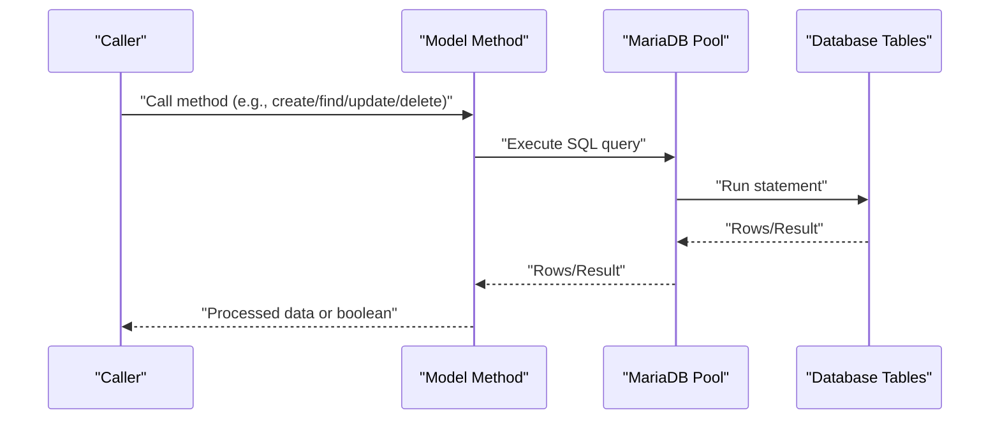
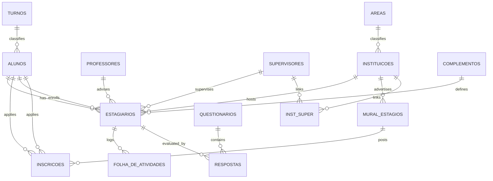
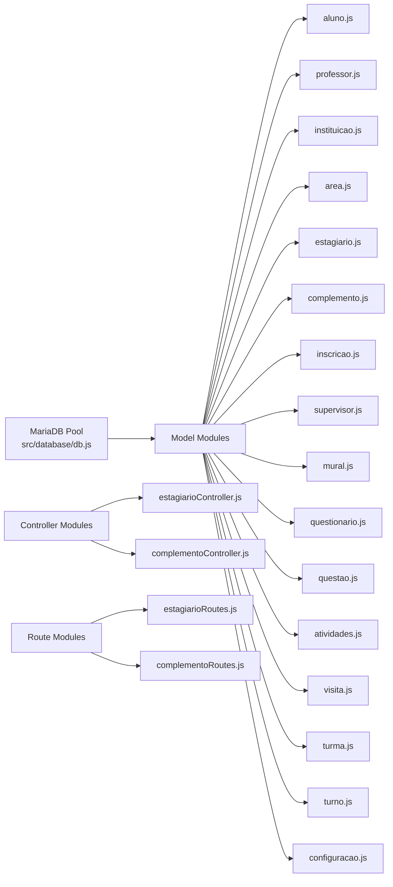
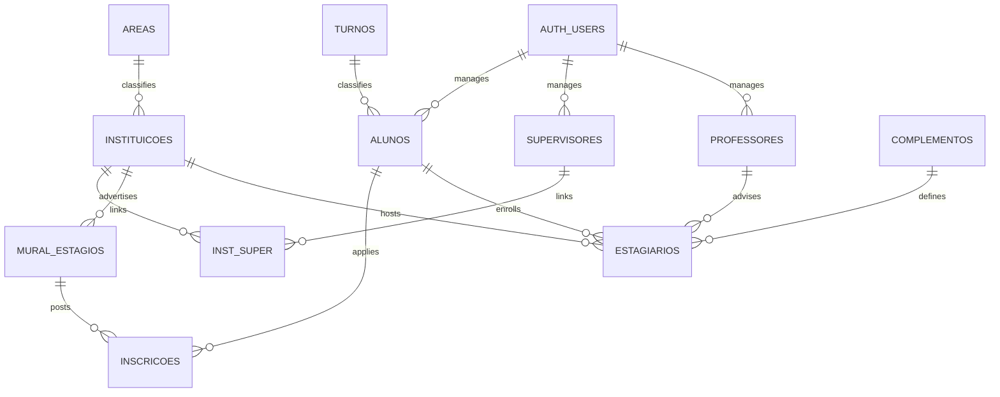

# Data Models & Database Design

<cite>
**Referenced Files in This Document**
- [db.js](file://src/database/db.js)
- [setupFullDatabase.js](file://src/database/setupFullDatabase.js)
- [aluno.js](file://src/models/aluno.js)
- [professor.js](file://src/models/professor.js)
- [instituicao.js](file://src/models/instituicao.js)
- [area.js](file://src/models/area.js)
- [estagiario.js](file://src/models/estagiario.js)
- [complemento.js](file://src/models/complemento.js)
- [inscricao.js](file://src/models/inscricao.js)
- [supervisor.js](file://src/models/supervisor.js)
- [mural.js](file://src/models/mural.js)
- [questionario.js](file://src/models/questionario.js)
- [questao.js](file://src/models/questao.js)
- [atividades.js](file://src/models/atividades.js)
- [visita.js](file://src/models/visita.js)
- [turma.js](file://src/models/turma.js)
- [turno.js](file://src/models/turno.js)
- [configuracao.js](file://src/models/configuracao.js)
- [complementoController.js](file://src/controllers/complementoController.js)
- [complementoRoutes.js](file://src/routers/complementoRoutes.js)
- [estagiarioController.js](file://src/controllers/estagiarioController.js)
</cite>

## Update Summary
**Changes Made**
- Added new complementos table for special academic periods management
- Enhanced estagiario model with complemento_id foreign key relationship
- Integrated complemento functionality into estagiario CRUD operations
- Added dedicated complemento controller and routes for administrative management
- Updated estagiario queries to include complemento information in joins
- Enhanced estagiario model with complemento field support in all operations

## Table of Contents
1. [Introduction](#introduction)
2. [Project Structure](#project-structure)
3. [Core Components](#core-components)
4. [Architecture Overview](#architecture-overview)
5. [Detailed Component Analysis](#detailed-component-analysis)
6. [Dependency Analysis](#dependency-analysis)
7. [Performance Considerations](#performance-considerations)
8. [Troubleshooting Guide](#troubleshooting-guide)
9. [Conclusion](#conclusion)
10. [Appendices](#appendices)

## Introduction
This document describes the data models and database design for NodeMural, focusing on the entities and relationships used to manage students, professors, institutions, internships, applications, supervisors, questionnaires, activities, visits, classes, areas, configurations, and the newly added complemento functionality. The system has been enhanced with improved data integrity, proper foreign key relationships, field deprecation notices for legacy data, and specialized academic period management capabilities. It documents primary keys, foreign keys, indexes, constraints, validation rules, referential integrity, data access patterns, and performance considerations.

## Project Structure
The data access layer is implemented via plain SQL queries executed against a MariaDB pool. Each domain entity is represented by a model module under src/models that encapsulates CRUD operations and joins for related data. The database connection is configured centrally in src/database/db.js. The system now includes enhanced institutional management capabilities with dedicated models for professors, institutions, areas, and complementos, along with proper foreign key relationships and specialized academic period management.

```mermaid
graph TB
subgraph "Database Layer"
DB["MariaDB Pool<br/>src/database/db.js"]
end
subgraph "Enhanced Models"
AL["Aluno Model<br/>src/models/aluno.js"]
PR["Professor Model<br/>src/models/professor.js"]
IN["Instituicao Model<br/>src/models/instituicao.js"]
AR["Area Model<br/>src/models/area.js"]
ES["Estagiario Model<br/>src/models/estagiario.js"]
CP["Complemento Model<br/>src/models/complemento.js"]
INSC["Inscricao Model<br/>src/models/inscricao.js"]
SV["Supervisor Model<br/>src/models/supervisor.js"]
MR["Mural Model<br/>src/models/mural.js"]
QZ["Questionario Model<br/>src/models/questionario.js"]
QA["Questao Model<br/>src/models/questao.js"]
AT["Atividades Model<br/>src/models/atividades.js"]
VS["Visita Model<br/>src/models/visita.js"]
TR["Turma Model<br/>src/models/turma.js"]
TU["Turno Model<br/>src/models/turno.js"]
CF["Configuracao Model<br/>src/models/configuracao.js"]
end
DB --> AL
DB --> PR
DB --> IN
DB --> AR
DB --> ES
DB --> CP
DB --> INSC
DB --> SV
DB --> MR
DB --> QZ
DB --> QA
DB --> AT
DB --> VS
DB --> TR
DB --> TU
DB --> CF
```

**Diagram sources**
- [db.js:1-15](file://src/database/db.js#L1-L15)
- [aluno.js:1-139](file://src/models/aluno.js#L1-L139)
- [professor.js:1-86](file://src/models/professor.js#L1-L86)
- [instituicao.js:1-67](file://src/models/instituicao.js#L1-L67)
- [area.js:1-45](file://src/models/area.js#L1-L45)
- [estagiario.js:1-334](file://src/models/estagiario.js#L1-L334)
- [complemento.js:1-45](file://src/models/complemento.js#L1-L45)
- [inscricao.js:1-104](file://src/models/inscricao.js#L1-L104)
- [supervisor.js:1-103](file://src/models/supervisor.js#L1-L103)
- [mural.js:1-90](file://src/models/mural.js#L1-L90)
- [questionario.js:1-38](file://src/models/questionario.js#L1-L38)
- [questao.js:1-53](file://src/models/questao.js#L1-L53)
- [atividades.js:1-57](file://src/models/atividades.js#L1-L57)
- [visita.js:1-51](file://src/models/visita.js#L1-L51)
- [turma.js:1-39](file://src/models/turma.js#L1-L39)
- [turno.js:1-45](file://src/models/turno.js#L1-L45)
- [configuracao.js:1-27](file://src/models/configuracao.js#L1-L27)

**Section sources**
- [db.js:1-15](file://src/database/db.js#L1-L15)

## Core Components
This section summarizes the entities and their roles, focusing on fields, constraints, and relationships inferred from the models.

### Enhanced Student Management
- alunos
  - Purpose: Stores student profiles with enhanced validation and relationships.
  - Key fields: id (auto-increment), nome, nomesocial, ingresso, turno_id (foreign key), registro (unique), telefone, celular, email, cpf, identidade, orgao, nascimento, cep, endereco, municipio, bairro, observacoes.
  - Constraints: Unique registration number enforced by model-level verification.
  - Relationships: One-to-many with estagiarios; one-to-many with inscricoes; many-to-one with turnos.
  - Access patterns: Search by name/social name/registration/email; join with estagiarios and inscricoes.

### New Professor Management
- professores
  - Purpose: Stores university professor profiles with enhanced identification fields.
  - Key fields: id (auto-increment), nome, cpf, siape (unique), cress (unique), regiao, telefone, celular, email, curriculolattes, atualizacaolattes, dataingresso, departamento, dataegresso, motivoegresso, observacoes.
  - Constraints: Unique siape and cress enforced at database level.
  - Relationships: Many-to-many with estagiarios via estagiarios.professor_id.
  - Access patterns: Search by name; find by siape/cress; list with estagiarios.

### Enhanced Institutional Management
- instituicoes
  - Purpose: Stores internship institution details with enhanced fields and area relationships.
  - Key fields: id (auto-increment), instituicao, cnpj, area_id (foreign key), natureza, email, url, endereco, bairro, municipio, cep, telefone, beneficios, fim_de_semana, convenio, expira, seguro, observacoes.
  - Relationships: One-to-many with estagiarios; many-to-one with areas; many-to-one with mural_estagios.
  - Access patterns: List with area name; find supervisors linked via junction table; list mural entries.

- areas
  - Purpose: Classifies institution areas for categorization.
  - Key fields: id (auto-increment), area.
  - Relationships: Many-to-one with instituicoes.
  - Access patterns: List/create/update/delete.

### Enhanced Internship Tracking with Complemento Support
- estagiarios
  - Purpose: Tracks student internships across periods and levels with enhanced fields including complemento integration.
  - Key fields: id (auto-increment), aluno_id, registro, professor_id, supervisor_id, instituicao_id, periodo, nivel, nota, ch, ajuste2020, observacoes, complemento_id (foreign key), benetransporte, benealimentacao, benebolsa, tc, tc_solicitacao.
  - Relationships: Many-to-one with alunos, professores, supervisores, instituicoes, complementos.
  - Access patterns: List with joins; find by aluno_id, supervisor_id, professor_id; compute next level based on rules; include complemento information.
  - **Enhanced**: Now includes complemento_id foreign key for special academic period tracking.

- complementos
  - Purpose: Manages special academic periods and complemento information for internships.
  - Key fields: id (auto-increment), periodo_especial.
  - Relationships: One-to-many with estagiarios via complemento_id.
  - Access patterns: List/create/update/delete complemento periods; used for estagiario complemento association.

- mural_estagios
  - Purpose: Publicized internship postings with enhanced fields.
  - Key fields: id (auto-increment), instituicao_id, instituicao, convenio, vagas, beneficios, final_de_semana, cargaHoraria, requisitos, horario, data_selecao, data_inscricao, horario_selecao, local_selecao, forma_selecao, contato, outras, periodo, local_inscricao, email.
  - Relationships: Many-to-one with instituicoes; one-to-many with inscricoes.
  - Access patterns: List by period/institution; nested listing of applications.

### Enhanced Application Management
- inscricoes
  - Purpose: Records student applications to internship postings with enhanced validation.
  - Key fields: id (auto-increment), registro, aluno_id, muralestagio_id, data (timestamp), timestamp, periodo.
  - Constraints: Application uniqueness per student per posting per period enforced by model checks.
  - Relationships: Many-to-one with alunos and mural_estagios.
  - Access patterns: List by period; find by student/posting combination; nested listing from mural.

### Enhanced Supervisor Management
- supervisores
  - Purpose: Stores supervisor profiles with enhanced fields and institution relationships.
  - Key fields: id (auto-increment), nome, cpf, email, celular, cress (unique), regiao, escola, ano_formacao, cargo, observacoes.
  - Relationships: Many-to-many with instituicoes via inst_super junction table.
  - Access patterns: List; add/remove institution associations; cascade delete by removing junction rows first.
  - **Deprecated Field**: telefone field is marked as deprecated in the schema.

### Extended Academic Management
- turma_estagios
  - Purpose: Internship class groups organized by area.
  - Key fields: id (auto-increment), area.
  - Relationships: Many-to-one with estagiarios.
  - Access patterns: List/create/update/delete.

- turnos
  - Purpose: Student shift classification for academic scheduling.
  - Key fields: id (auto-increment), turno.
  - Relationships: Many-to-one with alunos.
  - Access patterns: List/create/update/delete.

- configuracoes
  - Purpose: System-wide configuration values with enhanced fields.
  - Key fields: id (auto-increment), instituicao, mural_periodo_atual, curso_turma_atual, curso_abertura_inscricoes, curso_encerramento_inscricoes, termo_compromisso_periodo, termo_compromisso_inicio, termo_compromisso_final, periodo_calendario_academico.
  - Access patterns: Single-row retrieval/update.

### Extended Evaluation Management
- questionarios, questoes, respostas
  - Purpose: Questionnaire and question management with enhanced relationships.
  - Key fields: questionarios.id, title, description, created, modified, is_active, category, target_user_type; questoes.id, questionario_id, text, type, options, ordem, created, modified; respostas.id, questionario_id, estagiario_id, response (JSON), created, modified.
  - Relationships: One-to-many from questionarios to questoes; many-to-one with estagiarios.
  - Access patterns: List with joins; order by questionnaire and question order.

### Extended Activity and Visit Management
- folhadeatividades (atividades)
  - Purpose: Activity log for internships with enhanced fields.
  - Key fields: id (auto-increment), estagiario_id, dia, inicio, final, horario, atividade, periodo.
  - Relationships: Many-to-one with estagiarios.
  - Access patterns: List with filters; pagination-like ordering by date/time.

- visitas
  - Purpose: Supervisory visits to institutions with enhanced evaluation fields.
  - Key fields: id (auto-increment), instituicao_id, data, responsavel, motivo, avaliacao, descricao.
  - Relationships: Many-to-one with instituicoes.
  - Access patterns: List filtered by institution; join to show institution name.

**Section sources**
- [aluno.js:1-139](file://src/models/aluno.js#L1-L139)
- [professor.js:1-86](file://src/models/professor.js#L1-L86)
- [instituicao.js:1-67](file://src/models/instituicao.js#L1-L67)
- [area.js:1-45](file://src/models/area.js#L1-L45)
- [estagiario.js:1-334](file://src/models/estagiario.js#L1-L334)
- [complemento.js:1-45](file://src/models/complemento.js#L1-L45)
- [mural.js:1-90](file://src/models/mural.js#L1-L90)
- [inscricao.js:1-104](file://src/models/inscricao.js#L1-L104)
- [supervisor.js:1-103](file://src/models/supervisor.js#L1-L103)
- [configuracao.js:1-27](file://src/models/configuracao.js#L1-L27)

## Architecture Overview
The system uses a straightforward repository pattern over MariaDB with enhanced institutional management capabilities and specialized complemento functionality. Each model exposes methods for:
- Creation with validation and uniqueness checks
- Retrieval with filtering, joins, and ordering including complemento information
- Updates with constraints
- Deletion with referential integrity safeguards

```mermaid
sequenceDiagram
participant C as "Caller"
participant M as "Model Method"
participant P as "MariaDB Pool"
participant T as "Database Tables"
C->>M : "Call method (e.g., create/find/update/delete)"
M->>P : "Execute SQL query"
P->>T : "Run statement"
T-->>P : "Rows/Result"
P-->>M : "Rows/Result"
M-->>C : "Processed data or boolean"
```

**Diagram sources**
- [db.js:1-15](file://src/database/db.js#L1-L15)
- [aluno.js:1-139](file://src/models/aluno.js#L1-L139)
- [professor.js:1-86](file://src/models/professor.js#L1-L86)
- [instituicao.js:1-67](file://src/models/instituicao.js#L1-L67)
- [inscricao.js:1-104](file://src/models/inscricao.js#L1-L104)
- [supervisor.js:1-103](file://src/models/supervisor.js#L1-L103)
- [complemento.js:1-45](file://src/models/complemento.js#L1-L45)

## Detailed Component Analysis

### Enhanced Entity Relationship Model
The following ER diagram summarizes the main entities and their relationships as implemented by the models, including the new complemento functionality and institutional management components.

```mermaid
erDiagram
ALUNOS ||--o{ ESTAGIARIOS : "has"
ALUNOS ||--o{ INSCRICOES : "applies"
PROFESSORES ||--o{ ESTAGIARIOS : "advises"
SUPERVISORES ||--o{ ESTAGIARIOS : "supervises"
INSTITUICOES ||--o{ ESTAGIARIOS : "hosts"
INSTITUICOES ||--o{ MURAL_ESTAGIOS : "advertises"
AREAS ||--o{ INSTITUICOES : "classifies"
MURAL_ESTAGIOS ||--o{ INSCRICOES : "posts"
INSTITUICOES ||--o{ INST_SUPER : "links"
SUPERVISORES ||--o{ INST_SUPER : "links"
ALUNOS ||--o{ ESTAGIARIOS : "enrolls"
ALUNOS ||--o{ INSCRICOES : "applies"
ESTAGIARIOS ||--o{ FOLHA_DE_ATIVIDADES : "logs"
ESTAGIARIOS ||--o{ RESPOSTAS : "evaluated_by"
COMPLEMENTOS ||--o{ ESTAGIARIOS : "defines"
QUESTIONARIOS ||--o{ RESPOSTAS : "contains"
TURNOS ||--o{ ALUNOS : "classifies"
```

**Diagram sources**
- [aluno.js:58-86](file://src/models/aluno.js#L58-L86)
- [professor.js:59-82](file://src/models/professor.js#L59-L82)
- [instituicao.js:43-62](file://src/models/instituicao.js#L43-L62)
- [area.js:1-45](file://src/models/area.js#L1-L45)
- [estagiario.js:148-167](file://src/models/estagiario.js#L148-L167)
- [complemento.js:1-45](file://src/models/complemento.js#L1-L45)
- [mural.js:49-56](file://src/models/mural.js#L49-L56)
- [supervisor.js:85-99](file://src/models/supervisor.js#L85-L99)
- [atividades.js:1-57](file://src/models/atividades.js#L1-L57)
- [resposta.js:1-183](file://src/models/resposta.js#L1-L183)
- [turno.js:1-45](file://src/models/turno.js#L1-L45)

### Enhanced Data Validation and Business Rules
- Unique registration enforcement for alunos.
- Unique siape and cress enforcement for professores.
- Unique cress enforcement for supervisores.
- Application uniqueness per student per posting per period for inscricoes.
- Supervisor-institution linkage managed via junction table with explicit add/remove operations.
- Next level computation for estagiarios based on historical records and adjustment flag.
- Completeness check for questionnaire responses by comparing answered questions to total questions.
- Enhanced institution validation with area relationships and benefit tracking.
- **Enhanced Complemento Integration**: estagiarios now support complemento_id foreign key with automatic complemento name resolution in queries.
- **Deprecated Field Handling**: Legacy telephone field in supervisors is marked as deprecated in schema.

**Section sources**
- [aluno.js:5-14](file://src/models/aluno.js#L5-L14)
- [professor.js:37-44](file://src/models/professor.js#L37-L44)
- [supervisor.js:12-19](file://src/models/supervisor.js#L12-L19)
- [inscricao.js:58-74](file://src/models/inscricao.js#L58-L74)
- [supervisor.js:85-99](file://src/models/supervisor.js#L85-L99)
- [estagiario.js:183-233](file://src/models/estagiario.js#L183-L233)
- [resposta.js:168-179](file://src/models/resposta.js#L168-L179)
- [complemento.js:1-45](file://src/models/complemento.js#L1-L45)

### Enhanced Referential Integrity and Cascading Behavior
- Deletion safeguards:
  - alunos cannot be deleted if they have estagiarios or inscricoes.
  - professores can be deleted independently as they don't have direct relationships.
  - supervisors are deleted by removing junction rows first, then the supervisor record.
  - instituicoes cannot be deleted if they have estagiarios or mural_estagios.
  - **Enhanced**: complementos can be deleted independently as they don't have direct estagiario relationships.
- Database-level constraints:
  - Unique constraints for siape, cress, and registro fields.
  - Foreign key relationships maintained through model-level checks.
  - **Enhanced Foreign Key Support**: The schema now includes proper foreign key relationships for improved referential integrity, including complemento_id in estagiarios.
- No explicit foreign key constraints are defined in the models; referential integrity relies on application-level checks and manual cleanup.

**Section sources**
- [aluno.js:117-135](file://src/models/aluno.js#L117-L135)
- [professor.js:54-57](file://src/models/professor.js#L54-L57)
- [supervisor.js:45-54](file://src/models/supervisor.js#L45-L54)
- [instituicao.js:35-41](file://src/models/instituicao.js#L35-L41)
- [complemento.js:1-45](file://src/models/complemento.js#L1-L45)

### Enhanced Data Access Patterns and Query Optimization
- Filtering and ordering:
  - Models apply WHERE clauses and ORDER BY for predictable sorting (e.g., name, date, period).
- Joins:
  - Models join related entities to enrich results (e.g., estagiarios with alunos/professores/supervisores/instituicoes/complementos).
  - **Enhanced**: estagiario queries now include complemento information with LEFT JOIN to complementos table.
- Pagination:
  - Ordering by date/time supports efficient client-side pagination.
- Enhanced indexing recommendations:
  - Add indexes on frequently filtered columns: alunos.registro, alunos.nome, alunos.cpf, alunos.turno_id, professores.siape, professores.cress, instituicoes.cnpj, instituicoes.area_id, inscricoes.aluno_id, inscricoes.muralestagio_id, inscricoes.periodo, mural_estagios.instituicao_id, mural_estagios.periodo, estagiarios.aluno_id, estagiarios.professor_id, estagiarios.supervisor_id, estagiarios.complemento_id, supervisores.cress, complementos.periodo_especial, questionarios.id, questoes.questionario_id, respostas.estagiario_id, respostas.questionario_id, folhadeatividades.estagiario_id, visitas.instituicao_id, turnos.turno.
  - Composite indexes for frequent multi-column filters (e.g., inscricoes(aluno_id, muralestagio_id, periodo)).

**Section sources**
- [aluno.js:28-47](file://src/models/aluno.js#L28-L47)
- [professor.js:13-27](file://src/models/professor.js#L13-L27)
- [instituicao.js:5-18](file://src/models/instituicao.js#L5-L18)
- [mural.js:5-18](file://src/models/mural.js#L5-L18)
- [estagiario.js:12-44](file://src/models/estagiario.js#L12-L44)
- [complemento.js:1-45](file://src/models/complemento.js#L1-L45)
- [resposta.js:7-28](file://src/models/resposta.js#L7-L28)

### Enhanced Data Lifecycle and Relationship Management
- Creation:
  - Models insert records and return identifiers for downstream operations.
  - New professor creation requires unique siape and cress validation.
  - New institution creation validates area relationships.
  - **Enhanced**: New estagiario creation now supports complemento_id assignment during creation.
  - **New**: New complemento creation requires unique periodo_especial validation.
- Updates:
  - Models validate constraints before updating and return affected-row booleans.
  - Enhanced field validation for professors and institutions.
  - **Enhanced**: estagiario updates now support complemento_id updates.
  - **Field Deprecation**: Legacy telephone field handling for supervisors.
- Deletion:
  - Models enforce safeguards; alunos require estagiarios/inscricoes cleanup.
  - Supervisors require junction cleanup prior to deletion.
  - Institutions require estagiarios/mural_estagios cleanup.
  - **Enhanced**: complementos can be deleted independently without affecting estagiarios.
- Relationship updates:
  - Supervisors link/unlink institutions via inst_super; estagiarios maintain dynamic relationships across periods and levels.
  - Professors can be assigned to multiple estagiarios with enhanced tracking.
  - **Enhanced**: estagiarios can be associated with complementos through complemento_id foreign key.

**Section sources**
- [professor.js:54-57](file://src/models/professor.js#L54-L57)
- [supervisor.js:85-99](file://src/models/supervisor.js#L85-L99)
- [estagiario.js:64-82](file://src/models/estagiario.js#L64-L82)
- [complemento.js:1-45](file://src/models/complemento.js#L1-L45)

### Enhanced Security, Access Control, and Audit Trails
- Authentication and authorization:
  - Authentication routes/controllers exist in the repository; complemento management requires admin role.
  - **Enhanced**: complemento routes use checkRole(['admin']) middleware for security.
- Audit:
  - Some entities track created/modified timestamps (questionarios, questoes, respostas).
  - Visit records capture evaluator and evaluation fields.
  - Enhanced timestamp tracking in inscricoes and mural_estagios.
- Recommendations:
  - Enforce row-level access checks in controllers based on user roles.
  - Consider adding audit logs for sensitive DML operations.
  - Implement role-based access control for professor and institution management.
  - **Enhanced**: complemento management should be restricted to authorized administrators.

**Section sources**
- [questionario.js:5-34](file://src/models/questionario.js#L5-L34)
- [questao.js:5-49](file://src/models/questao.js#L5-L49)
- [resposta.js:116-133](file://src/models/resposta.js#L116-L133)
- [visita.js:28-47](file://src/models/visita.js#L28-L47)
- [inscricao.js:138-146](file://src/models/inscricao.js#L138-L146)
- [mural.js:112-135](file://src/models/mural.js#L112-L135)
- [complementoController.js:1-71](file://src/controllers/complementoController.js#L1-L71)
- [complementoRoutes.js:1-15](file://src/routers/complementoRoutes.js#L1-L15)

## Dependency Analysis
The models depend solely on the shared MariaDB pool. There are no cross-model dependencies among the listed files. The new complemento model integrates seamlessly with existing infrastructure and enhances the estagiario model with academic period management capabilities.

```mermaid
graph LR
POOL["MariaDB Pool<br/>src/database/db.js"]
MODELS["Model Modules"]
CONTROLLERS["Controller Modules"]
ROUTES["Route Modules"]
POOL --> MODELS
MODELS --> AL["aluno.js"]
MODELS --> PR["professor.js"]
MODELS --> IN["instituicao.js"]
MODELS --> AR["area.js"]
MODELS --> ES["estagiario.js"]
MODELS --> CP["complemento.js"]
MODELS --> INSC["inscricao.js"]
MODELS --> SV["supervisor.js"]
MODELS --> MR["mural.js"]
MODELS --> QZ["questionario.js"]
MODELS --> QA["questao.js"]
MODELS --> AT["atividades.js"]
MODELS --> VS["visita.js"]
MODELS --> TR["turma.js"]
MODELS --> TU["turno.js"]
MODELS --> CF["configuracao.js"]
CONTROLLERS --> EC["estagiarioController.js"]
CONTROLLERS --> CC["complementoController.js"]
ROUTES --> ER["estagiarioRoutes.js"]
ROUTES --> CR["complementoRoutes.js"]
```

**Diagram sources**
- [db.js:1-15](file://src/database/db.js#L1-L15)
- [aluno.js:1-139](file://src/models/aluno.js#L1-L139)
- [professor.js:1-86](file://src/models/professor.js#L1-L86)
- [instituicao.js:1-67](file://src/models/instituicao.js#L1-L67)
- [area.js:1-45](file://src/models/area.js#L1-L45)
- [estagiario.js:1-334](file://src/models/estagiario.js#L1-L334)
- [complemento.js:1-45](file://src/models/complemento.js#L1-L45)
- [inscricao.js:1-104](file://src/models/inscricao.js#L1-L104)
- [supervisor.js:1-103](file://src/models/supervisor.js#L1-L103)
- [mural.js:1-90](file://src/models/mural.js#L1-L90)
- [questionario.js:1-38](file://src/models/questionario.js#L1-L38)
- [questao.js:1-53](file://src/models/questao.js#L1-L53)
- [atividades.js:1-57](file://src/models/atividades.js#L1-L57)
- [visita.js:1-51](file://src/models/visita.js#L1-L51)
- [turma.js:1-39](file://src/models/turma.js#L1-L39)
- [turno.js:1-45](file://src/models/turno.js#L1-L45)
- [configuracao.js:1-27](file://src/models/configuracao.js#L1-L27)
- [estagiarioController.js:1-337](file://src/controllers/estagiarioController.js#L1-L337)
- [complementoController.js:1-71](file://src/controllers/complementoController.js#L1-L71)

**Section sources**
- [db.js:1-15](file://src/database/db.js#L1-L15)

## Performance Considerations
- Prefer indexed columns for WHERE clauses and JOIN keys.
- Use LIMIT and ORDER BY to constrain result sets and enable pagination.
- Minimize wide SELECT lists; select only required columns for read-heavy views.
- Batch operations where feasible; avoid N+1 selects by leveraging pre-built joins in models.
- Monitor slow queries and add composite indexes for multi-column filters.
- Consider partitioning strategies for large datasets in estagiarios and inscricoes tables.
- Implement connection pooling optimization for high-traffic scenarios.
- **Enhanced Indexing Strategy**: Focus on newly added foreign key columns and frequently queried combinations including complemento_id.
- **Enhanced Performance**: complemento queries are optimized with LEFT JOINs and ORDER BY periodo_especial for efficient complemento selection.

## Troubleshooting Guide
- Duplicate registration errors for alunos:
  - Triggered when attempting to create an aluno with an existing registro.
- Duplicate siape/cress errors for professores:
  - Triggered when attempting to create a professor with existing siape or cress.
- Duplicate cress errors for supervisores:
  - Triggered when attempting to create a supervisor with existing cress.
- Application conflicts for inscricoes:
  - Thrown when a student tries to register twice for the same posting in the same period.
- Deletion failures:
  - alunos cannot be deleted while estagiarios or inscricoes exist.
  - professores can be deleted independently.
  - supervisors must have junction rows removed before deletion.
  - instituicoes cannot be deleted while estagiarios or mural_estagios exist.
  - **Enhanced**: complementos can be safely deleted without affecting estagiarios.
- **Enhanced Complemento Issues**:
  - complemento_id must reference existing complementos table entries.
  - complemento periods must be unique and properly formatted.
  - estagiarios with complemento_id require valid complemento associations.
- **Deprecated Field Issues**:
  - Legacy telephone field in supervisors is deprecated; ensure new data uses celular field instead.

**Section sources**
- [aluno.js:11-14](file://src/models/aluno.js#L11-L14)
- [professor.js:37-44](file://src/models/professor.js#L37-L44)
- [supervisor.js:12-19](file://src/models/supervisor.js#L12-L19)
- [inscricao.js:65-85](file://src/models/inscricao.js#L65-L85)
- [aluno.js:117-135](file://src/models/aluno.js#L117-L135)
- [supervisor.js:45-54](file://src/models/supervisor.js#L45-L54)
- [instituicao.js:35-41](file://src/models/instituicao.js#L35-L41)
- [complemento.js:1-45](file://src/models/complemento.js#L1-L45)

## Conclusion
NodeMural's enhanced data models provide a comprehensive, relational foundation for managing academic internships and related workflows with improved institutional management capabilities and specialized complemento functionality. The addition of professor management, enhanced institutional tracking, expanded validation rules, proper foreign key relationships, and complemento support strengthens the system's ability to handle complex academic environments. The complemento functionality enables precise tracking of special academic periods and provides enhanced academic period management for internships. The inclusion of field deprecation notices ensures smooth migration from legacy data structures. While the current implementation enforces integrity at the application level, introducing database-level constraints and indexes would further improve reliability and performance. Extending the models with role-based access checks and audit logging would strengthen security and traceability, particularly for the new complemento administrative capabilities.

## Appendices

### Appendix A: Enhanced Entity Field Definitions and Constraints
- alunos
  - Fields: id, nome, nomesocial, ingresso, turno_id, registro, telefone, celular, email, cpf, identidade, orgao, nascimento, cep, endereco, municipio, bairro, observacoes.
  - Constraints: registro uniqueness enforced by model.
  - Relationships: Many-to-one with turnos.
- professores
  - Fields: id, nome, cpf, siape (unique), cress (unique), regiao, telefone, celular, email, curriculolattes, atualizacaolattes, dataingresso, departamento, dataegresso, motivoegresso, observacoes.
  - Constraints: siape and cress uniqueness enforced at database level.
- instituicoes
  - Fields: id, instituicao, cnpj, area_id, natureza, email, url, endereco, bairro, municipio, cep, telefone, beneficios, fim_de_semana, convenio, expira, seguro, observacoes.
  - Constraints: area_id foreign key relationship.
- areas
  - Fields: id, area.
- estagiarios
  - Fields: id, aluno_id, registro, professor_id, supervisor_id, instituicao_id, periodo, nivel, nota, ch, ajuste2020, observacoes, complemento_id (foreign key), benetransporte, benealimentacao, benebolsa, tc, tc_solicitacao.
  - Relationships: Many-to-one with complementos.
- complementos
  - Fields: id, periodo_especial.
  - Relationships: One-to-many with estagiarios.
- mural_estagios
  - Fields: id, instituicao_id, instituicao, convenio, vagas, beneficios, final_de_semana, cargaHoraria, requisitos, horario, data_selecao, data_inscricao, horario_selecao, local_selecao, forma_selecao, contato, outras, periodo, local_inscricao, email.
- inscricoes
  - Fields: id, registro, aluno_id, muralestagio_id, data (timestamp), timestamp, periodo.
  - Constraints: unique combination per student/posting/period.
- supervisores
  - Fields: id, nome, cpf, email, celular, cress (unique), regiao, escola, ano_formacao, cargo, observacoes.
  - **Deprecated Field**: telefone (deprecated).
- turma_estagios
  - Fields: id, area.
- turnos
  - Fields: id, turno.
- configuracoes
  - Fields: id, instituicao, mural_periodo_atual, curso_turma_atual, curso_abertura_inscricoes, curso_encerramento_inscricoes, termo_compromisso_periodo, termo_compromisso_inicio, termo_compromisso_final, periodo_calendario_academico.
- questionarios
  - Fields: id, title, description, created, modified, is_active, category, target_user_type.
- questoes
  - Fields: id, questionario_id, text, type, options, ordem, created, modified.
- respostas
  - Fields: id, questionario_id, estagiario_id, response (JSON), created, modified.
- atividades (folhadeatividades)
  - Fields: id, estagiario_id, dia, inicio, final, horario, atividade, periodo.
- visitas
  - Fields: id, instituicao_id, data, responsavel, motivo, avaliacao, descricao.

**Section sources**
- [aluno.js:10-20](file://src/models/aluno.js#L10-L20)
- [professor.js:5-11](file://src/models/professor.js#L5-L11)
- [instituicao.js:20-26](file://src/models/instituicao.js#L20-L26)
- [area.js:19-25](file://src/models/area.js#L19-L25)
- [estagiario.js:64-72](file://src/models/estagiario.js#L64-L72)
- [complemento.js:1-45](file://src/models/complemento.js#L1-L45)
- [mural.js:57-67](file://src/models/mural.js#L57-L67)
- [inscricao.js:58-74](file://src/models/inscricao.js#L58-L74)
- [supervisor.js:29-35](file://src/models/supervisor.js#L29-L35)
- [turma.js:6-12](file://src/models/turma.js#L6-L12)
- [turno.js:6-12](file://src/models/turno.js#L6-L12)
- [configuracao.js:17-23](file://src/models/configuracao.js#L17-L23)
- [questionario.js:5-11](file://src/models/questionario.js#L5-L11)
- [questao.js:5-11](file://src/models/questao.js#L5-L11)
- [resposta.js:116-123](file://src/models/resposta.js#L116-L123)
- [atividades.js:34-40](file://src/models/atividades.js#L34-L40)
- [visita.js:28-34](file://src/models/visita.js#L28-L34)

### Appendix B: Enhanced Suggested Database Constraints and Indexes
- Primary Keys
  - alunos(id), professores(id), instituicoes(id), areas(id), estagiarios(id), inscricoes(id), supervisores(id), turma_estagios(id), turnos(id), configuracoes(id), mural_estagios(id), questionarios(id), questoes(id), respostas(id), folhadeatividades(id), visitas(id), complementos(id).
- Foreign Keys (recommended)
  - turnos(id) → alunos.turno_id, professores(id) → estagiarios.professor_id, supervisores(id) → estagiarios.supervisor_id, instituicoes(id) → estagiarios.instituicao_id, alunos(id) → estagiarios.aluno_id, complementos(id) → estagiarios.complemento_id.
  - instituicoes(id) → mural_estagios.instituicao_id, areas(id) → instituicoes.area_id.
  - alunos(id) → inscricoes.aluno_id, mural_estagios(id) → inscricoes.muralestagio_id.
  - questionarios(id) → questoes.questionario_id, estagiarios(id) → respostas.estagiario_id, questionarios(id) → respostas.questionario_id.
  - estagiarios(id) → folhadeatividades.estagiario_id, instituicoes(id) → visitas.instituicao_id.
  - supervisores(id) → inst_super.supervisor_id, instituicoes(id) → inst_super.instituicao_id.
- Unique Constraints (recommended)
  - alunos.registro, professores.siape, professores.cress, supervisores.cress, complementos.periodo_especial.
- Indexes (recommended)
  - alunos(registro, nome, cpf, turno_id), professores(siape, cress), instituicoes(cnpj, area_id), inscricoes(aluno_id, muralestagio_id, periodo), mural_estagios(instituicao_id, periodo), estagiarios(aluno_id, professor_id, supervisor_id, periodo, complemento_id), supervisores(cress), complementos(periodo_especial), questionarios(id), questoes(questionario_id), respostas(estagiario_id, questionario_id), folhadeatividades(estagiario_id), visitas(instituicao_id), turnos(turno).

### Appendix C: Database Schema Evolution
The database schema has been enhanced to support the new institutional management capabilities with improved data integrity and specialized complemento functionality:

```mermaid
erDiagram
AUTH_USERS ||--o{ PROFESSORES : "manages"
AUTH_USERS ||--o{ SUPERVISORES : "manages"
AUTH_USERS ||--o{ ALUNOS : "manages"
AREAS ||--o{ INSTITUICOES : "classifies"
INSTITUICOES ||--o{ ESTAGIARIOS : "hosts"
INSTITUICOES ||--o{ MURAL_ESTAGIOS : "advertises"
INSTITUICOES ||--o{ INST_SUPER : "links"
SUPERVISORES ||--o{ INST_SUPER : "links"
ALUNOS ||--o{ ESTAGIARIOS : "enrolls"
ALUNOS ||--o{ INSCRICOES : "applies"
MURAL_ESTAGIOS ||--o{ INSCRICOES : "posts"
PROFESSORES ||--o{ ESTAGIARIOS : "advises"
COMPLEMENTOS ||--o{ ESTAGIARIOS : "defines"
TURNOS ||--o{ ALUNOS : "classifies"
```

**Diagram sources**
- [setupFullDatabase.js:10-104](file://src/database/setupFullDatabase.js#L10-L104)
- [setupFullDatabase.js:247-253](file://src/database/setupFullDatabase.js#L247-L253)
- [setupFullDatabase.js:259-263](file://src/database/setupFullDatabase.js#L259-L263)
- [professor.js:5-11](file://src/models/professor.js#L5-L11)
- [instituicao.js:20-26](file://src/models/instituicao.js#L20-L26)
- [area.js:19-25](file://src/models/area.js#L19-L25)
- [supervisor.js:85-99](file://src/models/supervisor.js#L85-L99)
- [complemento.js:1-45](file://src/models/complemento.js#L1-L45)
- [turno.js:1-45](file://src/models/turno.js#L1-L45)