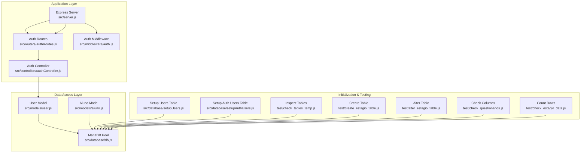
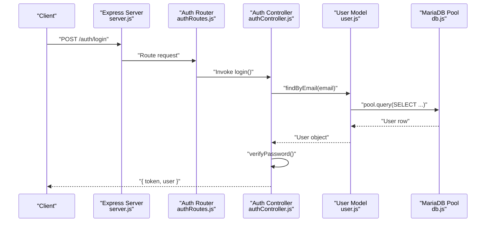
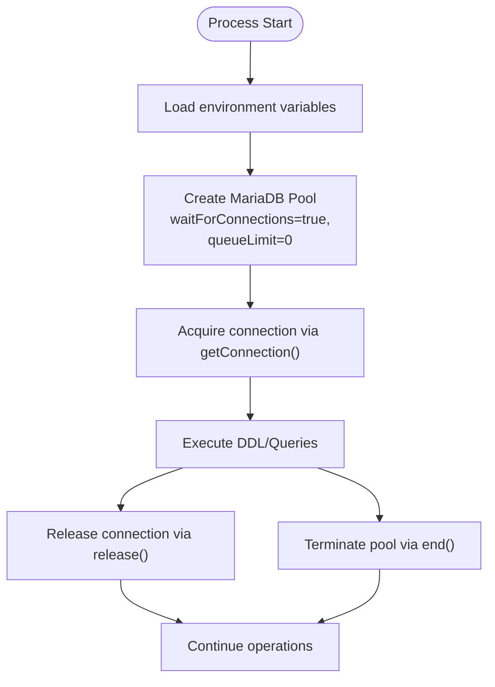
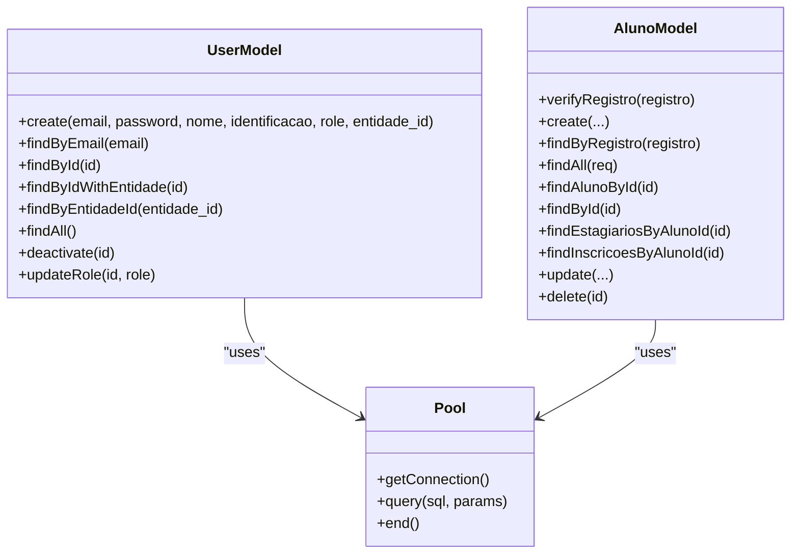
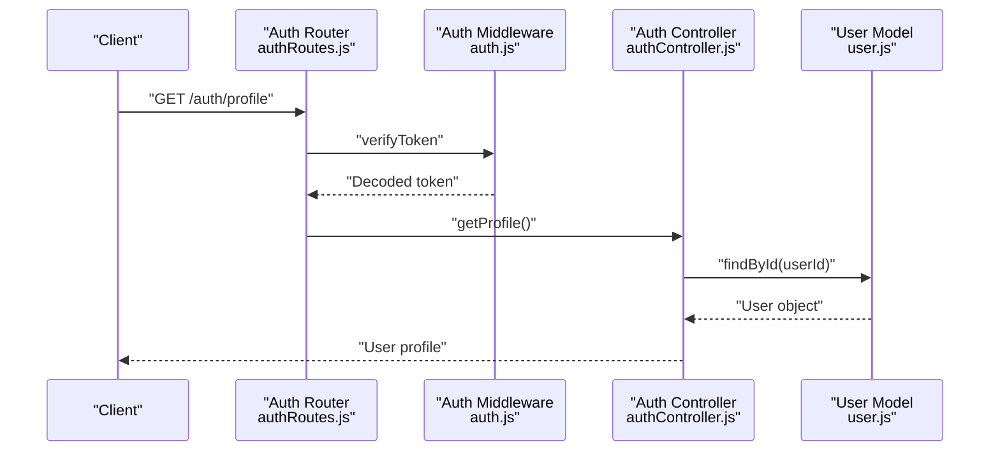
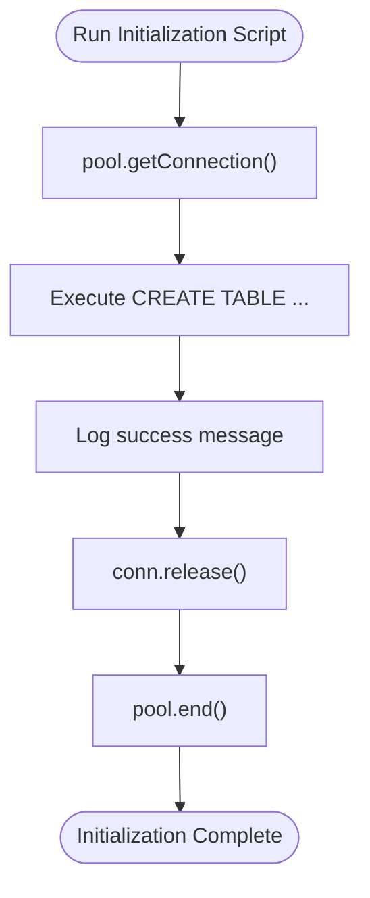
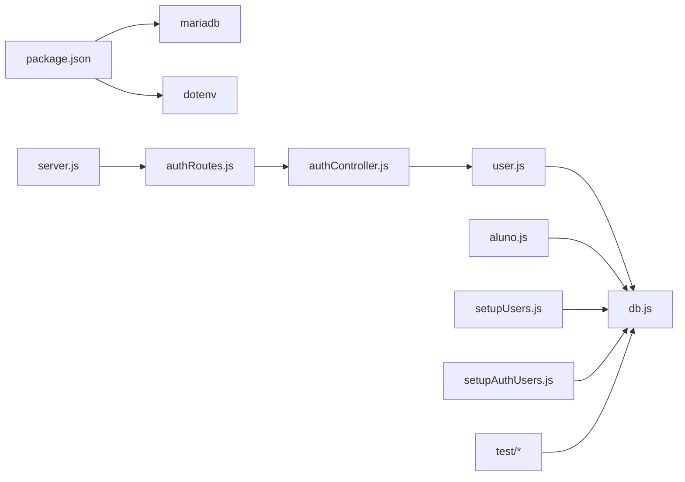

# Database Architecture & Connection Management

<cite>
**Referenced Files in This Document**
- [db.js](file://src/database/db.js)
- [setupAuthUsers.js](file://src/database/setupAuthUsers.js)
- [setupUsers.js](file://src/database/setupUsers.js)
- [user.js](file://src/models/user.js)
- [aluno.js](file://src/models/aluno.js)
- [authController.js](file://src/controllers/authController.js)
- [authRoutes.js](file://src/routers/authRoutes.js)
- [auth.js](file://src/middleware/auth.js)
- [server.js](file://src/server.js)
- [check_tables_temp.js](file://test/check_tables_temp.js)
- [create_estagio_table.js](file://test/create_estagio_table.js)
- [check_questionarios.js](file://test/check_questionarios.js)
- [check_estagio_data.js](file://test/check_estagio_data.js)
- [alter_estagio_table.js](file://test/alter_estagio_table.js)
- [package.json](file://package.json)
- [README.md](file://README.md)
</cite>

## Table of Contents
1. [Introduction](#introduction)
2. [Project Structure](#project-structure)
3. [Core Components](#core-components)
4. [Architecture Overview](#architecture-overview)
5. [Detailed Component Analysis](#detailed-component-analysis)
6. [Dependency Analysis](#dependency-analysis)
7. [Performance Considerations](#performance-considerations)
8. [Troubleshooting Guide](#troubleshooting-guide)
9. [Conclusion](#conclusion)
10. [Appendices](#appendices)

## Introduction
This document describes the database architecture and connection management for NodeMural, focusing on the MariaDB connection pool configuration, connection lifecycle management, database abstraction patterns, and operational practices. It covers connection pooling strategies, timeout configurations, error handling mechanisms, database initialization and schema management, migration strategies, security considerations, performance optimization, monitoring and health checks, transaction management, and backup and disaster recovery procedures.

## Project Structure
The database layer is organized around a shared connection pool module and model abstractions that encapsulate SQL operations. Initialization scripts create required tables, while controllers and middleware orchestrate authentication and authorization flows. Test scripts demonstrate schema inspection and migration patterns.

**Diagram sources**
- [server.js](file://src/server.js#L1-L73)
- [authRoutes.js](file://src/routers/authRoutes.js#L1-L20)
- [authController.js](file://src/controllers/authController.js#L1-L157)
- [auth.js](file://src/middleware/auth.js#L1-L137)
- [db.js](file://src/database/db.js#L1-L15)
- [user.js](file://src/models/user.js#L1-L146)
- [aluno.js](file://src/models/aluno.js#L1-L146)
- [setupUsers.js](file://src/database/setupUsers.js#L1-L38)
- [setupAuthUsers.js](file://src/database/setupAuthUsers.js#L1-L38)
- [check_tables_temp.js](file://test/check_tables_temp.js#L1-L40)
- [create_estagio_table.js](file://test/create_estagio_table.js#L1-L41)
- [alter_estagio_table.js](file://test/alter_estagio_table.js#L1-L39)
- [check_questionarios.js](file://test/check_questionarios.js#L1-L28)
- [check_estagio_data.js](file://test/check_estagio_data.js#L1-L25)

**Section sources**
- [server.js](file://src/server.js#L1-L73)
- [db.js](file://src/database/db.js#L1-L15)
- [README.md](file://README.md#L1-L61)

## Core Components
- MariaDB connection pool configured via environment variables and exported for reuse across models.
- Models encapsulate CRUD operations against MariaDB tables using the shared pool.
- Initialization scripts create required tables and can be executed independently.
- Controllers and middleware handle authentication and authorization flows, interacting with models.

Key implementation references:
- Pool creation and configuration: [db.js](file://src/database/db.js#L5-L13)
- User model operations: [user.js](file://src/models/user.js#L18-L34)
- Aluno model operations: [aluno.js](file://src/models/aluno.js#L15-L20)
- Initialization scripts: [setupUsers.js](file://src/database/setupUsers.js#L6-L35), [setupAuthUsers.js](file://src/database/setupAuthUsers.js#L6-L35)
- Server bootstrap and routes: [server.js](file://src/server.js#L31-L72)

**Section sources**
- [db.js](file://src/database/db.js#L1-L15)
- [user.js](file://src/models/user.js#L1-L146)
- [aluno.js](file://src/models/aluno.js#L1-L146)
- [setupUsers.js](file://src/database/setupUsers.js#L1-L38)
- [setupAuthUsers.js](file://src/database/setupAuthUsers.js#L1-L38)
- [server.js](file://src/server.js#L1-L73)

## Architecture Overview
The system follows a layered architecture:
- Presentation and routing handled by Express.
- Controllers coordinate requests and responses.
- Models abstract database operations using a shared MariaDB pool.
- Initialization scripts manage schema creation.
- Middleware enforces authentication and authorization.

**Diagram sources**
- [server.js](file://src/server.js#L31-L72)
- [authRoutes.js](file://src/routers/authRoutes.js#L1-L20)
- [authController.js](file://src/controllers/authController.js#L76-L127)
- [user.js](file://src/models/user.js#L36-L46)
- [db.js](file://src/database/db.js#L1-L15)

## Detailed Component Analysis

### MariaDB Connection Pool
- Configuration is centralized in a single pool module, enabling consistent connection behavior across the application.
- Environment-driven configuration supports host, user, password, database name, and pool limits.
- Queue behavior is configured to wait for connections rather than rejecting requests immediately.

Operational characteristics:
- Connection lifecycle: Connections are acquired via getConnection() and released via release() or end() depending on the operation.
- Initialization scripts acquire a connection, execute DDL statements, and then release and terminate the pool to avoid lingering connections.

References:
- Pool creation and options: [db.js](file://src/database/db.js#L5-L13)
- Initialization pattern: [setupUsers.js](file://src/database/setupUsers.js#L6-L35), [setupAuthUsers.js](file://src/database/setupAuthUsers.js#L6-L35)

**Diagram sources**
- [db.js](file://src/database/db.js#L5-L13)
- [setupUsers.js](file://src/database/setupUsers.js#L6-L35)
- [setupAuthUsers.js](file://src/database/setupAuthUsers.js#L6-L35)

**Section sources**
- [db.js](file://src/database/db.js#L1-L15)
- [setupUsers.js](file://src/database/setupUsers.js#L1-L38)
- [setupAuthUsers.js](file://src/database/setupAuthUsers.js#L1-L38)

### Database Abstraction Patterns
- Models encapsulate SQL operations, exposing asynchronous methods for create, read, update, and delete.
- Queries leverage parameterized statements to prevent SQL injection.
- Soft-delete and role-based filtering are applied in queries where appropriate.

References:
- User model create/find/update/deactivate: [user.js](file://src/models/user.js#L7-L142)
- Aluno model CRUD and joins: [aluno.js](file://src/models/aluno.js#L6-L143)

**Diagram sources**
- [user.js](file://src/models/user.js#L1-L146)
- [aluno.js](file://src/models/aluno.js#L1-L146)
- [db.js](file://src/database/db.js#L1-L15)

**Section sources**
- [user.js](file://src/models/user.js#L1-L146)
- [aluno.js](file://src/models/aluno.js#L1-L146)

### Authentication and Authorization Flow
- Routes define public and protected endpoints.
- Middleware verifies JWT tokens and enforces role-based access.
- Controllers interact with models to authenticate users and retrieve profiles.

References:
- Auth routes: [authRoutes.js](file://src/routers/authRoutes.js#L1-L20)
- Auth controller: [authController.js](file://src/controllers/authController.js#L6-L156)
- Auth middleware: [auth.js](file://src/middleware/auth.js#L6-L136)

**Diagram sources**
- [authRoutes.js](file://src/routers/authRoutes.js#L1-L20)
- [auth.js](file://src/middleware/auth.js#L6-L29)
- [authController.js](file://src/controllers/authController.js#L129-L145)
- [user.js](file://src/models/user.js#L49-L60)

**Section sources**
- [authRoutes.js](file://src/routers/authRoutes.js#L1-L20)
- [authController.js](file://src/controllers/authController.js#L1-L157)
- [auth.js](file://src/middleware/auth.js#L1-L137)

### Database Initialization and Schema Management
- Initialization scripts create tables for users and authentication users.
- Test scripts demonstrate schema inspection, table creation, column alterations, and row counting.

References:
- Users table setup: [setupUsers.js](file://src/database/setupUsers.js#L6-L35)
- Auth users table setup: [setupAuthUsers.js](file://src/database/setupAuthUsers.js#L6-L35)
- Schema inspection: [check_tables_temp.js](file://test/check_tables_temp.js#L11-L37)
- Table creation: [create_estagio_table.js](file://test/create_estagio_table.js#L11-L38)
- Column alteration: [alter_estagio_table.js](file://test/alter_estagio_table.js#L11-L37)
- Column metadata: [check_questionarios.js](file://test/check_questionarios.js#L12-L26)
- Row count: [check_estagio_data.js](file://test/check_estagio_data.js#L11-L23)

**Diagram sources**
- [setupUsers.js](file://src/database/setupUsers.js#L6-L35)
- [setupAuthUsers.js](file://src/database/setupAuthUsers.js#L6-L35)
- [db.js](file://src/database/db.js#L1-L15)

**Section sources**
- [setupUsers.js](file://src/database/setupUsers.js#L1-L38)
- [setupAuthUsers.js](file://src/database/setupAuthUsers.js#L1-L38)
- [check_tables_temp.js](file://test/check_tables_temp.js#L1-L40)
- [create_estagio_table.js](file://test/create_estagio_table.js#L1-L41)
- [alter_estagio_table.js](file://test/alter_estagio_table.js#L1-L39)
- [check_questionarios.js](file://test/check_questionarios.js#L1-L28)
- [check_estagio_data.js](file://test/check_estagio_data.js#L1-L25)

### Migration Strategies
- DDL changes are scripted and executed via dedicated test scripts.
- Alteration scripts iterate over a set of ALTER TABLE statements to adjust column nullability or types.
- Schema inspection scripts verify presence and structure of tables and columns.

References:
- Alter table operations: [alter_estagio_table.js](file://test/alter_estagio_table.js#L17-L28)
- Inspect tables/columns: [check_tables_temp.js](file://test/check_tables_temp.js#L14-L29), [check_questionarios.js](file://test/check_questionarios.js#L15-L18)

**Section sources**
- [alter_estagio_table.js](file://test/alter_estagio_table.js#L1-L39)
- [check_tables_temp.js](file://test/check_tables_temp.js#L1-L40)
- [check_questionarios.js](file://test/check_questionarios.js#L1-L28)

### Connection Security Considerations
- Credentials are loaded from environment variables and injected into the pool configuration.
- JWT secret and expiry are environment-controlled for authentication.
- No explicit TLS/SSL configuration is present in the pool module; production deployments should configure SSL/TLS according to MariaDB client requirements.

References:
- Pool credentials: [db.js](file://src/database/db.js#L5-L9)
- JWT configuration: [authController.js](file://src/controllers/authController.js#L99-L109), [auth.js](file://src/middleware/auth.js#L14-L16)

**Section sources**
- [db.js](file://src/database/db.js#L1-L15)
- [authController.js](file://src/controllers/authController.js#L1-L157)
- [auth.js](file://src/middleware/auth.js#L1-L137)

### Transaction Management and Consistency Guarantees
- Current models perform individual statements without explicit transaction blocks.
- For multi-statement consistency, wrap operations in transaction boundaries using conn.beginTransaction(), conn.commit(), and conn.rollback().

References:
- Connection acquisition/release pattern: [user.js](file://src/models/user.js#L18-L21), [aluno.js](file://src/models/aluno.js#L15-L19)

**Section sources**
- [user.js](file://src/models/user.js#L1-L146)
- [aluno.js](file://src/models/aluno.js#L1-L146)

### Monitoring, Health Checks, and Failover
- No explicit health check endpoint or pool metrics are implemented in the current codebase.
- Recommendations include adding a GET /health endpoint that pings the database and exposes pool statistics.

References:
- Server bootstrap and routes: [server.js](file://src/server.js#L31-L72)

**Section sources**
- [server.js](file://src/server.js#L1-L73)

## Dependency Analysis
The application depends on the MariaDB driver and dotenv for configuration. Models depend on the shared pool module. Initialization and test scripts demonstrate direct pool usage for schema operations.

**Diagram sources**
- [package.json](file://package.json#L22-L30)
- [server.js](file://src/server.js#L1-L73)
- [authRoutes.js](file://src/routers/authRoutes.js#L1-L20)
- [authController.js](file://src/controllers/authController.js#L1-L157)
- [user.js](file://src/models/user.js#L1-L146)
- [aluno.js](file://src/models/aluno.js#L1-L146)
- [db.js](file://src/database/db.js#L1-L15)
- [setupUsers.js](file://src/database/setupUsers.js#L1-L38)
- [setupAuthUsers.js](file://src/database/setupAuthUsers.js#L1-L38)

**Section sources**
- [package.json](file://package.json#L1-L32)
- [server.js](file://src/server.js#L1-L73)

## Performance Considerations
- Connection pooling: Use waitForConnections and queueLimit to control queue behavior; tune DB_POOL_LIMIT based on workload.
- Query patterns: Prefer parameterized queries and limit result sets with pagination where applicable.
- Connection reuse: Acquire connections only when needed and release them promptly; avoid long-lived connections in request handlers.
- Indexing: Ensure appropriate indexes on frequently filtered columns (e.g., email, role, identifiers).
- Batch operations: Group related updates to reduce round-trips.

[No sources needed since this section provides general guidance]

## Troubleshooting Guide
Common issues and resolutions:
- Connection errors: Verify DB_HOST, DB_USER, DB_PASSWORD, DB_NAME, and DB_POOL_LIMIT in the environment.
- Authentication failures: Confirm JWT_SECRET and JWT_EXPIRY are set appropriately.
- Schema inconsistencies: Use initialization and inspection scripts to validate table existence and structure.
- Resource leaks: Ensure every acquired connection is released; initialization scripts demonstrate proper release and pool termination.

References:
- Environment variables and defaults: [README.md](file://README.md#L18-L28)
- Pool configuration: [db.js](file://src/database/db.js#L5-L13)
- Initialization patterns: [setupUsers.js](file://src/database/setupUsers.js#L6-L35), [setupAuthUsers.js](file://src/database/setupAuthUsers.js#L6-L35)
- Schema inspection: [check_tables_temp.js](file://test/check_tables_temp.js#L11-L37)

**Section sources**
- [README.md](file://README.md#L1-L61)
- [db.js](file://src/database/db.js#L1-L15)
- [setupUsers.js](file://src/database/setupUsers.js#L1-L38)
- [setupAuthUsers.js](file://src/database/setupAuthUsers.js#L1-L38)
- [check_tables_temp.js](file://test/check_tables_temp.js#L1-L40)

## Conclusion
NodeMural’s database layer centers on a shared MariaDB connection pool and model abstractions that encapsulate SQL operations. Initialization and test scripts provide practical patterns for schema management and migrations. While the current implementation focuses on simplicity and modularity, production deployments should incorporate explicit TLS configuration, transaction boundaries for multi-step operations, health checks, and performance tuning aligned with workload characteristics.

[No sources needed since this section summarizes without analyzing specific files]

## Appendices

### Environment Variables Reference
- DB_HOST: MariaDB host address
- DB_USER: Database user
- DB_PASSWORD: Database password
- DB_NAME: Target database
- DB_POOL_LIMIT: Maximum pool size
- JWT_SECRET: Secret for signing JWT tokens
- JWT_EXPIRY: Token expiration period
- PORT: Server listening port

References:
- Defaults and usage: [README.md](file://README.md#L18-L28), [db.js](file://src/database/db.js#L5-L12), [authController.js](file://src/controllers/authController.js#L99-L109), [auth.js](file://src/middleware/auth.js#L14-L16)

**Section sources**
- [README.md](file://README.md#L1-L61)
- [db.js](file://src/database/db.js#L1-L15)
- [authController.js](file://src/controllers/authController.js#L1-L157)
- [auth.js](file://src/middleware/auth.js#L1-L137)