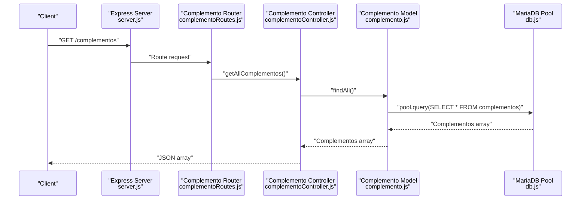
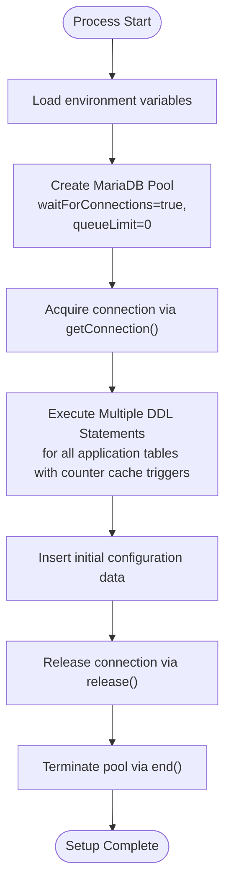
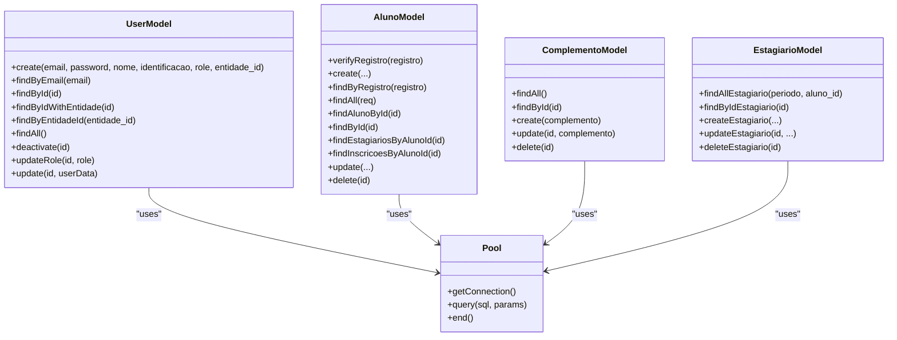
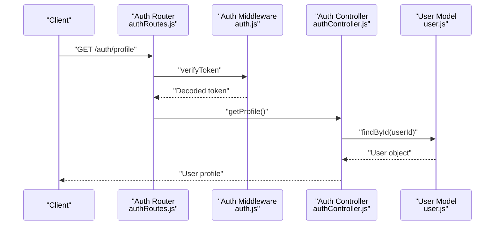
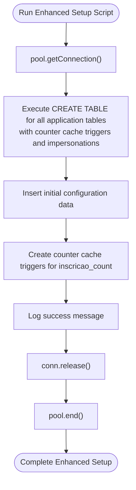
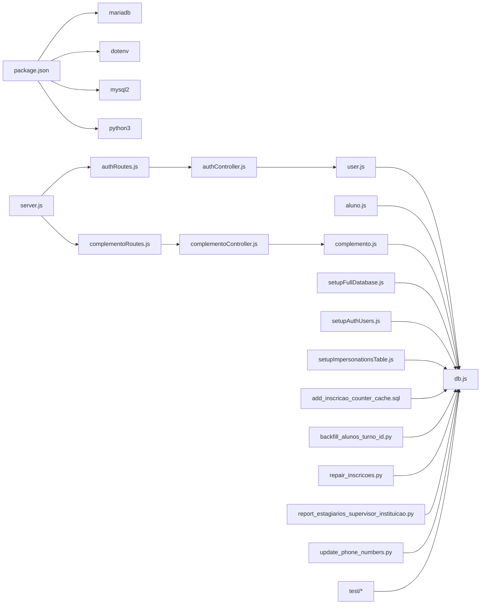

# Database Architecture & Connection Management

<cite>
**Referenced Files in This Document**
- [db.js](file://src/database/db.js)
- [setupFullDatabase.js](file://src/database/setupFullDatabase.js)
- [setupAuthUsers.js](file://src/database/setupAuthUsers.js)
- [setupImpersonationsTable.js](file://src/database/setupImpersonationsTable.js)
- [add_inscricao_counter_cache.sql](file://src/database/add_inscricao_counter_cache.sql)
- [create_impersonations_table.sql](file://src/database/create_impersonations_table.sql)
- [user.js](file://src/models/user.js)
- [aluno.js](file://src/models/aluno.js)
- [complemento.js](file://src/models/complemento.js)
- [authController.js](file://src/controllers/authController.js)
- [authRoutes.js](file://src/routers/authRoutes.js)
- [complementoController.js](file://src/controllers/complementoController.js)
- [complementoRoutes.js](file://src/routers/complementoRoutes.js)
- [auth.js](file://src/middleware/auth.js)
- [server.js](file://src/server.js)
- [backfill_alunos_turno_id.py](file://scripts/backfill_alunos_turno_id.py)
- [repair_inscricoes.py](file://scripts/repair_inscricoes.py)
- [report_estagiarios_supervisor_instituicao.py](file://scripts/report_estagiarios_supervisor_instituicao.py)
- [update_phone_numbers.py](file://scripts/update_phone_numbers.py)
- [test_counter_cache_inscricoes.sql](file://test/test_counter_cache_inscricoes.sql)
- [check_tables_temp.js](file://test/check_tables_temp.js)
- [create_instituicao_table.js](file://test/create_instituicao_table.js)
- [check_questionarios.js](file://test/check_questionarios.js)
- [check_instituicao_data.js](file://test/check_instituicao_data.js)
- [package.json](file://package.json)
- [README.md](file://README.md)
</cite>

## Update Summary
**Changes Made**
- Added documentation for new counter cache maintenance scripts and enhanced database schema with users table improvements
- Updated database initialization to include counter cache triggers for inscricao_count column
- Enhanced users table with improved role management and entity relationships
- Added comprehensive Python maintenance scripts for data cleanup and validation
- Updated database schema to include impersonations table for admin session tracking
- Enhanced relationship documentation showing counter cache triggers and foreign key constraints

## Table of Contents
1. [Introduction](#introduction)
2. [Project Structure](#project-structure)
3. [Core Components](#core-components)
4. [Architecture Overview](#architecture-overview)
5. [Detailed Component Analysis](#detailed-component-analysis)
6. [Dependency Analysis](#dependency-analysis)
7. [Performance Considerations](#performance-considerations)
8. [Troubleshooting Guide](#troubleshooting-guide)
9. [Conclusion](#conclusion)
10. [Appendices](#appendices)

## Introduction
This document describes the database architecture and connection management for NodeMural, focusing on the MariaDB connection pool configuration, connection lifecycle management, database abstraction patterns, and operational practices. It covers connection pooling strategies, timeout configurations, error handling mechanisms, database initialization and schema management, migration strategies, security considerations, performance optimization, monitoring and health checks, transaction management, and backup and disaster recovery procedures.

## Project Structure
The database layer is organized around a shared connection pool module and model abstractions that encapsulate SQL operations. A comprehensive initialization script creates all required tables and initial data structures, while controllers and middleware orchestrate authentication and authorization flows. The enhanced users table provides improved role management, and counter cache maintenance scripts ensure data integrity through automatic counting mechanisms. Python maintenance scripts handle complex data operations and validation tasks.

```mermaid
graph TB
subgraph "Application Layer"
SRV["Express Server<br/>src/server.js"]
RT_AUTH["Auth Routes<br/>src/routers/authRoutes.js"]
RT_COMP["Complemento Routes<br/>src/routers/complementoRoutes.js"]
CTRL_AUTH["Auth Controller<br/>src/controllers/authController.js"]
CTRL_COMP["Complemento Controller<br/>src/controllers/complementoController.js"]
MW_AUTH["Auth Middleware<br/>src/middleware/auth.js"]
end
subgraph "Data Access Layer"
POOL["MariaDB Pool<br/>src/database/db.js"]
MODEL_USER["User Model<br/>src/models/user.js"]
MODEL_ALUNO["Aluno Model<br/>src/models/aluno.js"]
MODEL_COMP["Complemento Model<br/>src/models/complemento.js"]
end
subgraph "Enhanced Database Schema"
FULL_SETUP["Full Database Setup<br/>src/database/setupFullDatabase.js"]
AUTH_SETUP["Auth Users Setup<br/>src/database/setupAuthUsers.js"]
IMP_SETUP["Impersonations Setup<br/>src/database/setupImpersonationsTable.js"]
COUNTER_CACHE["Counter Cache Setup<br/>src/database/add_inscricao_counter_cache.sql"]
end
subgraph "Maintenance Scripts"
BACKFILL["Backfill Script<br/>scripts/backfill_alunos_turno_id.py"]
REPAIR["Repair Script<br/>scripts/repair_inscricoes.py"]
REPORT["Report Script<br/>scripts/report_estagiarios_supervisor_instituicao.py"]
PHONE["Phone Update Script<br/>scripts/update_phone_numbers.py"]
end
subgraph "Testing & Validation"
TEST_COUNTER["Counter Cache Test<br/>test/test_counter_cache_inscricoes.sql"]
TEST_INSPECT["Inspect Tables<br/>test/check_tables_temp.js"]
TEST_CREATE["Create Table<br/>test/create_instituicao_table.js"]
TEST_ALTER["Alter Table<br/>test/alter_instituicao_table.js"]
TEST_Q["Check Columns<br/>test/check_questionarios.js"]
TEST_COUNT["Count Rows<br/>test/check_instituicao_data.js"]
end
SRV --> RT_AUTH --> CTRL_AUTH --> MODEL_USER
SRV --> RT_AUTH
SRV --> RT_COMP --> CTRL_COMP --> MODEL_COMP
SRV --> MW_AUTH
MODEL_USER --> POOL
MODEL_ALUNO --> POOL
MODEL_COMP --> POOL
FULL_SETUP --> POOL
AUTH_SETUP --> POOL
IMP_SETUP --> POOL
COUNTER_CACHE --> POOL
BACKFILL --> POOL
REPAIR --> POOL
REPORT --> POOL
PHONE --> POOL
TEST_COUNTER --> POOL
TEST_INSPECT --> POOL
TEST_CREATE --> POOL
TEST_ALTER --> POOL
TEST_Q --> POOL
TEST_COUNT --> POOL
```

**Diagram sources**
- [server.js:1-73](file://src/server.js#L1-L73)
- [authRoutes.js:1-20](file://src/routers/authRoutes.js#L1-L20)
- [complementoRoutes.js:1-16](file://src/routers/complementoRoutes.js#L1-L16)
- [authController.js:1-157](file://src/controllers/authController.js#L1-L157)
- [complementoController.js:1-72](file://src/controllers/complementoController.js#L1-L72)
- [auth.js:1-137](file://src/middleware/auth.js#L1-L137)
- [db.js:1-15](file://src/database/db.js#L1-L15)
- [user.js:1-184](file://src/models/user.js#L1-L184)
- [aluno.js:1-146](file://src/models/aluno.js#L1-L146)
- [complemento.js:1-45](file://src/models/complemento.js#L1-L45)
- [setupFullDatabase.js:1-295](file://src/database/setupFullDatabase.js#L1-L295)
- [setupAuthUsers.js:1-39](file://src/database/setupAuthUsers.js#L1-L39)
- [setupImpersonationsTable.js:1-60](file://src/database/setupImpersonationsTable.js#L1-L60)
- [add_inscricao_counter_cache.sql:1-73](file://src/database/add_inscricao_counter_cache.sql#L1-L73)
- [backfill_alunos_turno_id.py:1-111](file://scripts/backfill_alunos_turno_id.py#L1-L111)
- [repair_inscricoes.py:1-117](file://scripts/repair_inscricoes.py#L1-L117)
- [report_estagiarios_supervisor_instituicao.py:1-173](file://scripts/report_estagiarios_supervisor_instituicao.py#L1-L173)
- [update_phone_numbers.py:1-242](file://scripts/update_phone_numbers.py#L1-L242)
- [test_counter_cache_inscricoes.sql:1-35](file://test/test_counter_cache_inscricoes.sql#L1-L35)
- [check_tables_temp.js:1-40](file://test/check_tables_temp.js#L1-L40)
- [create_instituicao_table.js:1-41](file://test/create_instituicao_table.js#L1-L41)
- [alter_instituicao_table.js:1-39](file://test/alter_instituicao_table.js#L1-L39)
- [check_questionarios.js:1-28](file://test/check_questionarios.js#L1-L28)
- [check_instituicao_data.js:1-25](file://test/check_instituicao_data.js#L1-L25)

**Section sources**
- [server.js:1-73](file://src/server.js#L1-L73)
- [db.js:1-15](file://src/database/db.js#L1-L15)
- [README.md:1-61](file://README.md#L1-L61)

## Core Components
- MariaDB connection pool configured via environment variables and exported for reuse across models.
- Models encapsulate CRUD operations against MariaDB tables using the shared pool.
- Enhanced database initialization script creates all required tables and initial data structures in a single operation, now including counter cache triggers and impersonations table.
- **Updated**: Counter cache maintenance scripts ensure automatic counting of inscricoes for each aluno through database triggers.
- **Updated**: Users table improvements include enhanced role management and entity relationship fields.
- **Updated**: Python maintenance scripts provide comprehensive data cleanup, validation, and formatting capabilities.
- Controllers and middleware handle authentication and authorization flows, interacting with models.
- Complemento model and controller provide CRUD operations for managing special academic periods.

Key implementation references:
- Pool creation and configuration: [db.js:5-13](file://src/database/db.js#L5-L13)
- User model operations: [user.js:7-184](file://src/models/user.js#L7-L184)
- Aluno model operations: [aluno.js:15-20](file://src/models/aluno.js#L15-L20)
- Enhanced database setup script: [setupFullDatabase.js:1-295](file://src/database/setupFullDatabase.js#L1-L295)
- Counter cache setup: [add_inscricao_counter_cache.sql:1-73](file://src/database/add_inscricao_counter_cache.sql#L1-L73)
- Impersonations table setup: [setupImpersonationsTable.js:1-60](file://src/database/setupImpersonationsTable.js#L1-L60)
- Complemento model: [complemento.js:1-45](file://src/models/complemento.js#L1-L45)
- Complemento controller: [complementoController.js:1-72](file://src/controllers/complementoController.js#L1-L72)
- Complemento routes: [complementoRoutes.js:1-16](file://src/routers/complementoRoutes.js#L1-L16)
- Maintenance scripts: [backfill_alunos_turno_id.py:1-111](file://scripts/backfill_alunos_turno_id.py#L1-L111), [repair_inscricoes.py:1-117](file://scripts/repair_inscricoes.py#L1-L117), [report_estagiarios_supervisor_instituicao.py:1-173](file://scripts/report_estagiarios_supervisor_instituicao.py#L1-L173), [update_phone_numbers.py:1-242](file://scripts/update_phone_numbers.py#L1-L242)
- Legacy auth setup script: [setupAuthUsers.js:1-39](file://src/database/setupAuthUsers.js#L1-L39)
- Server bootstrap and routes: [server.js:31-64](file://src/server.js#L31-L64)

**Section sources**
- [db.js:1-15](file://src/database/db.js#L1-L15)
- [user.js:1-184](file://src/models/user.js#L1-L184)
- [aluno.js:1-146](file://src/models/aluno.js#L1-L146)
- [complemento.js:1-45](file://src/models/complemento.js#L1-L45)
- [complementoController.js:1-72](file://src/controllers/complementoController.js#L1-L72)
- [complementoRoutes.js:1-16](file://src/routers/complementoRoutes.js#L1-L16)
- [setupFullDatabase.js:1-295](file://src/database/setupFullDatabase.js#L1-L295)
- [add_inscricao_counter_cache.sql:1-73](file://src/database/add_inscricao_counter_cache.sql#L1-L73)
- [setupImpersonationsTable.js:1-60](file://src/database/setupImpersonationsTable.js#L1-L60)
- [backfill_alunos_turno_id.py:1-111](file://scripts/backfill_alunos_turno_id.py#L1-L111)
- [repair_inscricoes.py:1-117](file://scripts/repair_inscricoes.py#L1-L117)
- [report_estagiarios_supervisor_instituicao.py:1-173](file://scripts/report_estagiarios_supervisor_instituicao.py#L1-L173)
- [update_phone_numbers.py:1-242](file://scripts/update_phone_numbers.py#L1-L242)
- [setupAuthUsers.js:1-39](file://src/database/setupAuthUsers.js#L1-L39)
- [server.js:1-73](file://src/server.js#L1-L73)

## Architecture Overview
The system follows a layered architecture:
- Presentation and routing handled by Express.
- Controllers coordinate requests and responses.
- Models abstract database operations using a shared MariaDB pool.
- Enhanced database initialization script manages complete schema creation, counter cache triggers, and initial data population.
- Middleware enforces authentication and authorization.
- **Updated**: Counter cache triggers automatically maintain inscricao_count for each aluno.
- **Updated**: Python maintenance scripts provide automated data cleanup and validation.
- Complemento routes provide RESTful endpoints for managing special academic periods.

**Diagram sources**
- [server.js:63-64](file://src/server.js#L63-L64)
- [complementoRoutes.js:9-13](file://src/routers/complementoRoutes.js#L9-L13)
- [complementoController.js:3-11](file://src/controllers/complementoController.js#L3-L11)
- [complemento.js:4-8](file://src/models/complemento.js#L4-L8)
- [db.js:1-15](file://src/database/db.js#L1-L15)

## Detailed Component Analysis

### MariaDB Connection Pool
- Configuration is centralized in a single pool module, enabling consistent connection behavior across the application.
- Environment-driven configuration supports host, user, password, database name, and pool limits.
- Queue behavior is configured to wait for connections rather than rejecting requests immediately.

Operational characteristics:
- Connection lifecycle: Connections are acquired via getConnection() and released via release() or end() depending on the operation.
- Enhanced database initialization script acquires a connection, executes all DDL statements for multiple tables including counter cache triggers, inserts initial configuration data, and then releases and terminates the pool to avoid lingering connections.

References:
- Pool creation and options: [db.js:5-13](file://src/database/db.js#L5-L13)
- Enhanced setup pattern: [setupFullDatabase.js:4-295](file://src/database/setupFullDatabase.js#L4-L295)
- Legacy setup pattern: [setupAuthUsers.js:6-39](file://src/database/setupAuthUsers.js#L6-L39)

**Diagram sources**
- [db.js:5-13](file://src/database/db.js#L5-L13)
- [setupFullDatabase.js:4-295](file://src/database/setupFullDatabase.js#L4-L295)
- [setupAuthUsers.js:6-39](file://src/database/setupAuthUsers.js#L6-L39)

**Section sources**
- [db.js:1-15](file://src/database/db.js#L1-L15)
- [setupFullDatabase.js:1-295](file://src/database/setupFullDatabase.js#L1-L295)
- [setupAuthUsers.js:1-39](file://src/database/setupAuthUsers.js#L1-L39)

### Database Abstraction Patterns
- Models encapsulate SQL operations, exposing asynchronous methods for create, read, update, and delete.
- Queries leverage parameterized statements to prevent SQL injection.
- Soft-delete and role-based filtering are applied in queries where appropriate.
- Enhanced user model includes improved role management and entity relationship handling.
- **Updated**: Counter cache triggers automatically maintain inscricao_count for each aluno without manual intervention.

References:
- Enhanced user model create/find/update/deactivate: [user.js:7-184](file://src/models/user.js#L7-L184)
- Aluno model CRUD and joins: [aluno.js:6-143](file://src/models/aluno.js#L6-L143)
- Complemento model CRUD operations: [complemento.js:3-41](file://src/models/complemento.js#L3-L41)
- Estagiario model with complementos join: [estagiario.js:97-104](file://src/models/estagiario.js#L97-L104)

**Diagram sources**
- [user.js:1-184](file://src/models/user.js#L1-L184)
- [aluno.js:1-146](file://src/models/aluno.js#L1-L146)
- [complemento.js:1-45](file://src/models/complemento.js#L1-L45)
- [estagiario.js:1-334](file://src/models/estagiario.js#L1-L334)
- [db.js:1-15](file://src/database/db.js#L1-L15)

**Section sources**
- [user.js:1-184](file://src/models/user.js#L1-L184)
- [aluno.js:1-146](file://src/models/aluno.js#L1-L146)
- [complemento.js:1-45](file://src/models/complemento.js#L1-L45)
- [estagiario.js:1-334](file://src/models/estagiario.js#L1-L334)

### Authentication and Authorization Flow
- Routes define public and protected endpoints.
- Middleware verifies JWT tokens and enforces role-based access.
- Controllers interact with models to authenticate users and retrieve profiles.
- **Updated**: Enhanced users table provides improved role management with admin, supervisor, professor, and aluno roles.

References:
- Auth routes: [authRoutes.js:1-20](file://src/routers/authRoutes.js#L1-L20)
- Auth controller: [authController.js:6-156](file://src/controllers/authController.js#L6-L156)
- Auth middleware: [auth.js:6-136](file://src/middleware/auth.js#L6-L136)

**Diagram sources**
- [authRoutes.js:1-20](file://src/routers/authRoutes.js#L1-L20)
- [auth.js:6-29](file://src/middleware/auth.js#L6-L29)
- [authController.js:129-145](file://src/controllers/authController.js#L129-L145)
- [user.js:49-60](file://src/models/user.js#L49-L60)

**Section sources**
- [authRoutes.js:1-20](file://src/routers/authRoutes.js#L1-L20)
- [authController.js:1-157](file://src/controllers/authController.js#L1-L157)
- [auth.js:1-137](file://src/middleware/auth.js#L1-L137)

### Enhanced Database Schema and Counter Cache Management
- **Updated**: Comprehensive initialization script creates all application tables in a single operation, including counter cache triggers for inscricao_count column in alunos table.
- **Updated**: Enhanced users table with improved role management, entity relationships, and audit timestamps.
- **Updated**: Impersonations table provides admin session tracking with foreign key constraints to users table.
- **Updated**: Counter cache triggers automatically maintain inscricao_count for each aluno through INSERT, DELETE, and UPDATE operations on inscricoes table.
- **Updated**: Python maintenance scripts handle complex data operations including phone number formatting, duplicate repair, and supervisor-institution validation.
- Legacy initialization scripts still exist but are superseded by the enhanced comprehensive setup approach.

**Updated** The enhanced comprehensive setup script provides a complete database initialization solution that includes counter cache triggers, improved users table, and impersonations table for enhanced functionality.

References:
- Enhanced database setup: [setupFullDatabase.js:10-295](file://src/database/setupFullDatabase.js#L10-L295)
- Counter cache setup: [add_inscricao_counter_cache.sql:1-73](file://src/database/add_inscricao_counter_cache.sql#L1-L73)
- Impersonations table setup: [setupImpersonationsTable.js:16-60](file://src/database/setupImpersonationsTable.js#L16-L60)
- Users table improvements: [user.js:7-184](file://src/models/user.js#L7-L184)
- Maintenance scripts: [backfill_alunos_turno_id.py:67-77](file://scripts/backfill_alunos_turno_id.py#L67-L77), [repair_inscricoes.py:78-94](file://scripts/repair_inscricoes.py#L78-L94), [report_estagiarios_supervisor_instituicao.py:135-148](file://scripts/report_estagiarios_supervisor_instituicao.py#L135-L148), [update_phone_numbers.py:185-198](file://scripts/update_phone_numbers.py#L185-L198)
- Legacy auth users setup: [setupAuthUsers.js:6-39](file://src/database/setupAuthUsers.js#L6-L39)

**Diagram sources**
- [setupFullDatabase.js:4-295](file://src/database/setupFullDatabase.js#L4-L295)
- [add_inscricao_counter_cache.sql:15-57](file://src/database/add_inscricao_counter_cache.sql#L15-L57)
- [db.js:1-15](file://src/database/db.js#L1-L15)

**Section sources**
- [setupFullDatabase.js:1-295](file://src/database/setupFullDatabase.js#L1-L295)
- [add_inscricao_counter_cache.sql:1-73](file://src/database/add_inscricao_counter_cache.sql#L1-L73)
- [setupImpersonationsTable.js:1-60](file://src/database/setupImpersonationsTable.js#L1-L60)
- [user.js:1-184](file://src/models/user.js#L1-L184)
- [backfill_alunos_turno_id.py:1-111](file://scripts/backfill_alunos_turno_id.py#L1-L111)
- [repair_inscricoes.py:1-117](file://scripts/repair_inscricoes.py#L1-L117)
- [report_estagiarios_supervisor_instituicao.py:1-173](file://scripts/report_estagiarios_supervisor_instituicao.py#L1-L173)
- [update_phone_numbers.py:1-242](file://scripts/update_phone_numbers.py#L1-L242)
- [setupAuthUsers.js:1-39](file://src/database/setupAuthUsers.js#L1-L39)

### Counter Cache Maintenance and Data Integrity
- **Updated**: Counter cache triggers automatically maintain inscricao_count for each aluno through INSERT, DELETE, and UPDATE operations on inscricoes table.
- **Updated**: Test script validates counter cache functionality by inserting, verifying, and deleting inscricoes records.
- **Updated**: Python repair script identifies and removes duplicate inscricoes entries while maintaining counter cache integrity.
- **Updated**: Backfill script populates turno_id based on turno field values for improved data consistency.
- **Updated**: Phone number formatting script standardizes phone numbers across alunos, professores, and supervisores tables.

**Updated** The counter cache system ensures automatic data integrity through database triggers, while Python maintenance scripts handle complex data cleanup and validation tasks.

References:
- Counter cache triggers: [add_inscricao_counter_cache.sql:15-57](file://src/database/add_inscricao_counter_cache.sql#L15-L57)
- Counter cache test: [test_counter_cache_inscricoes.sql:1-35](file://test/test_counter_cache_inscricoes.sql#L1-L35)
- Repair script: [repair_inscricoes.py:12-117](file://scripts/repair_inscricoes.py#L12-L117)
- Backfill script: [backfill_alunos_turno_id.py:58-111](file://scripts/backfill_alunos_turno_id.py#L58-L111)
- Phone formatting script: [update_phone_numbers.py:64-242](file://scripts/update_phone_numbers.py#L64-L242)

**Section sources**
- [add_inscricao_counter_cache.sql:1-73](file://src/database/add_inscricao_counter_cache.sql#L1-L73)
- [test_counter_cache_inscricoes.sql:1-35](file://test/test_counter_cache_inscricoes.sql#L1-L35)
- [repair_inscricoes.py:1-117](file://scripts/repair_inscricoes.py#L1-L117)
- [backfill_alunos_turno_id.py:1-111](file://scripts/backfill_alunos_turno_id.py#L1-L111)
- [update_phone_numbers.py:1-242](file://scripts/update_phone_numbers.py#L1-L242)

### Migration Strategies
- **Updated**: Enhanced comprehensive setup script handles all table creation, counter cache triggers, and initial data population in a single operation.
- **Updated**: For future schema changes, the setup script can be extended to include conditional migrations that check for existing table structures and apply necessary alterations.
- **Updated**: Counter cache triggers provide automatic maintenance for inscricao_count without manual intervention.
- **Updated**: Python maintenance scripts can be scheduled for periodic data cleanup and validation tasks.
- Legacy DDL change scripts still exist for testing and development scenarios.

**Updated** The enhanced approach consolidates all database initialization and maintenance into comprehensive scripts that handle both table creation and ongoing data integrity tasks.

References:
- Enhanced table creation: [setupFullDatabase.js:10-295](file://src/database/setupFullDatabase.js#L10-L295)
- Counter cache triggers: [add_inscricao_counter_cache.sql:15-57](file://src/database/add_inscricao_counter_cache.sql#L15-L57)
- Maintenance scripts: [backfill_alunos_turno_id.py:58-111](file://scripts/backfill_alunos_turno_id.py#L58-L111), [repair_inscricoes.py:12-117](file://scripts/repair_inscricoes.py#L12-L117), [report_estagiarios_supervisor_instituicao.py:37-173](file://scripts/report_estagiarios_supervisor_instituicao.py#L37-L173), [update_phone_numbers.py:64-242](file://scripts/update_phone_numbers.py#L64-L242)
- Legacy alter table operations: [alter_instituicao_table.js:17-28](file://test/alter_instituicao_table.js#L17-L28)

**Section sources**
- [setupFullDatabase.js:1-295](file://src/database/setupFullDatabase.js#L1-L295)
- [add_inscricao_counter_cache.sql:1-73](file://src/database/add_inscricao_counter_cache.sql#L1-L73)
- [backfill_alunos_turno_id.py:1-111](file://scripts/backfill_alunos_turno_id.py#L1-L111)
- [repair_inscricoes.py:1-117](file://scripts/repair_inscricoes.py#L1-L117)
- [report_estagiarios_supervisor_instituicao.py:1-173](file://scripts/report_estagiarios_supervisor_instituicao.py#L1-L173)
- [update_phone_numbers.py:1-242](file://scripts/update_phone_numbers.py#L1-L242)
- [alter_instituicao_table.js:1-39](file://test/alter_instituicao_table.js#L1-L39)

### Connection Security Considerations
- Credentials are loaded from environment variables and injected into the pool configuration.
- JWT secret and expiry are environment-controlled for authentication.
- Enhanced setup scripts run with the same security considerations as the legacy setup scripts, using environment variables for database credentials.
- **Updated**: Impersonations table includes foreign key constraints to users table for secure session tracking.
- No explicit TLS/SSL configuration is present in the pool module; production deployments should configure SSL/TLS according to MariaDB client requirements.

References:
- Pool credentials: [db.js:5-9](file://src/database/db.js#L5-L9)
- Enhanced setup script security: [setupFullDatabase.js:2-2](file://src/database/setupFullDatabase.js#L2-L2)
- Impersonations table security: [create_impersonations_table.sql:1-14](file://src/database/create_impersonations_table.sql#L1-L14)
- JWT configuration: [authController.js:99-109](file://src/controllers/authController.js#L99-L109), [auth.js:14-16](file://src/middleware/auth.js#L14-L16)

**Section sources**
- [db.js:1-15](file://src/database/db.js#L1-L15)
- [setupFullDatabase.js:1-295](file://src/database/setupFullDatabase.js#L1-L295)
- [create_impersonations_table.sql:1-14](file://src/database/create_impersonations_table.sql#L1-L14)
- [authController.js:1-157](file://src/controllers/authController.js#L1-L157)
- [auth.js:1-137](file://src/middleware/auth.js#L1-L137)

### Transaction Management and Consistency Guarantees
- Current models perform individual statements without explicit transaction blocks.
- **Updated**: Enhanced setup script executes all table creation statements and counter cache triggers sequentially within a single connection context, providing atomicity for the entire initialization process.
- **Updated**: Counter cache triggers ensure atomic updates for inscricao_count through database-level transaction management.
- **Updated**: Python maintenance scripts use proper transaction handling with commit/rollback operations.
- For multi-statement consistency in application operations, wrap operations in transaction boundaries using conn.beginTransaction(), conn.commit(), and conn.rollback().

**Updated** The enhanced setup script ensures atomic database initialization, while counter cache triggers and Python scripts provide robust transaction management for data integrity.

References:
- Enhanced setup script connection management: [setupFullDatabase.js:4-295](file://src/database/setupFullDatabase.js#L4-L295)
- Counter cache trigger patterns: [add_inscricao_counter_cache.sql:15-57](file://src/database/add_inscricao_counter_cache.sql#L15-L57)
- Python transaction handling: [repair_inscricoes.py:95-105](file://scripts/repair_inscricoes.py#L95-L105), [backfill_alunos_turno_id.py:86-107](file://scripts/backfill_alunos_turno_id.py#L86-L107)
- Connection acquisition/release pattern: [user.js:18-21](file://src/models/user.js#L18-L21), [aluno.js:15-19](file://src/models/aluno.js#L15-L19)

**Section sources**
- [setupFullDatabase.js:1-295](file://src/database/setupFullDatabase.js#L1-L295)
- [add_inscricao_counter_cache.sql:1-73](file://src/database/add_inscricao_counter_cache.sql#L1-L73)
- [repair_inscricoes.py:1-117](file://scripts/repair_inscricoes.py#L1-L117)
- [backfill_alunos_turno_id.py:1-111](file://scripts/backfill_alunos_turno_id.py#L1-L111)
- [user.js:1-184](file://src/models/user.js#L1-L184)
- [aluno.js:1-146](file://src/models/aluno.js#L1-L146)

### Monitoring, Health Checks, and Failover
- No explicit health check endpoint or pool metrics are implemented in the current codebase.
- **Updated**: Enhanced setup script provides comprehensive console logging for successful table creation, counter cache trigger creation, and initial configuration insertion.
- **Updated**: Counter cache test script validates trigger functionality through automated testing.
- **Updated**: Python maintenance scripts provide detailed progress reporting and error handling.
- Recommendations include adding a GET /health endpoint that pings the database and exposes pool statistics.

**Updated** The enhanced setup script includes comprehensive logging for monitoring and debugging, while Python scripts provide detailed operational feedback.

References:
- Enhanced setup script logging: [setupFullDatabase.js:8-282](file://src/database/setupFullDatabase.js#L8-L282)
- Counter cache test: [test_counter_cache_inscricoes.sql:1-35](file://test/test_counter_cache_inscricoes.sql#L1-L35)
- Python script logging: [repair_inscricoes.py:14-105](file://scripts/repair_inscricoes.py#L14-L105), [backfill_alunos_turno_id.py:86-107](file://scripts/backfill_alunos_turno_id.py#L86-L107)
- Server bootstrap and routes: [server.js:31-64](file://src/server.js#L31-L64)

**Section sources**
- [setupFullDatabase.js:1-295](file://src/database/setupFullDatabase.js#L1-L295)
- [test_counter_cache_inscricoes.sql:1-35](file://test/test_counter_cache_inscricoes.sql#L1-L35)
- [repair_inscricoes.py:1-117](file://scripts/repair_inscricoes.py#L1-L117)
- [backfill_alunos_turno_id.py:1-111](file://scripts/backfill_alunos_turno_id.py#L1-L111)
- [server.js:1-73](file://src/server.js#L1-L73)

### Enhanced Relationship Management
- **Updated**: Counter cache triggers establish automatic relationship management between inscricoes and alunos tables through inscricao_count column.
- **Updated**: Impersonations table establishes secure relationship with users table through foreign key constraints.
- **Updated**: Enhanced users table provides improved role-based access control with entity relationship fields.
- **Updated**: Python maintenance scripts validate and maintain referential integrity across multiple tables.
- **Updated**: Complemento routes support monitoring through standard HTTP status codes and error handling.

**Updated** The enhanced relationship management includes automatic counter cache maintenance, secure impersonation tracking, and improved data validation through Python scripts.

References:
- Counter cache triggers: [add_inscricao_counter_cache.sql:15-57](file://src/database/add_inscricao_counter_cache.sql#L15-L57)
- Impersonations table: [create_impersonations_table.sql:1-14](file://src/database/create_impersonations_table.sql#L1-L14)
- Enhanced users table: [user.js:7-184](file://src/models/user.js#L7-L184)
- Python maintenance scripts: [report_estagiarios_supervisor_instituicao.py:37-173](file://scripts/report_estagiarios_supervisor_instituicao.py#L37-L173)
- Complemento routes monitoring: [complementoRoutes.js:9-13](file://src/routers/complementoRoutes.js#L9-L13)

**Section sources**
- [add_inscricao_counter_cache.sql:1-73](file://src/database/add_inscricao_counter_cache.sql#L1-L73)
- [create_impersonations_table.sql:1-14](file://src/database/create_impersonations_table.sql#L1-L14)
- [user.js:1-184](file://src/models/user.js#L1-L184)
- [report_estagiarios_supervisor_instituicao.py:1-173](file://scripts/report_estagiarios_supervisor_instituicao.py#L1-L173)
- [complementoRoutes.js:1-16](file://src/routers/complementoRoutes.js#L1-L16)

## Dependency Analysis
The application depends on the MariaDB driver and dotenv for configuration. Models depend on the shared pool module. **Updated**: The enhanced comprehensive setup script demonstrates direct pool usage for complete schema operations including counter cache triggers, while legacy scripts show the previous fragmented approach. **Updated**: Python maintenance scripts provide additional operational dependencies for data cleanup and validation. **Updated**: Complemento routes integrate seamlessly with the existing routing structure.

**Updated** The dependency structure now centers around enhanced comprehensive setup scripts, counter cache triggers, Python maintenance scripts, and the new complemento routing system.

**Diagram sources**
- [package.json:22-30](file://package.json#L22-L30)
- [server.js:1-73](file://src/server.js#L1-L73)
- [authRoutes.js:1-20](file://src/routers/authRoutes.js#L1-L20)
- [complementoRoutes.js:1-16](file://src/routers/complementoRoutes.js#L1-L16)
- [authController.js:1-157](file://src/controllers/authController.js#L1-L157)
- [complementoController.js:1-72](file://src/controllers/complementoController.js#L1-L72)
- [user.js:1-184](file://src/models/user.js#L1-L184)
- [aluno.js:1-146](file://src/models/aluno.js#L1-L146)
- [complemento.js:1-45](file://src/models/complemento.js#L1-L45)
- [db.js:1-15](file://src/database/db.js#L1-L15)
- [setupFullDatabase.js:1-295](file://src/database/setupFullDatabase.js#L1-L295)
- [setupAuthUsers.js:1-39](file://src/database/setupAuthUsers.js#L1-L39)
- [setupImpersonationsTable.js:1-60](file://src/database/setupImpersonationsTable.js#L1-L60)
- [add_inscricao_counter_cache.sql:1-73](file://src/database/add_inscricao_counter_cache.sql#L1-L73)
- [backfill_alunos_turno_id.py:1-111](file://scripts/backfill_alunos_turno_id.py#L1-L111)
- [repair_inscricoes.py:1-117](file://scripts/repair_inscricoes.py#L1-L117)
- [report_estagiarios_supervisor_instituicao.py:1-173](file://scripts/report_estagiarios_supervisor_instituicao.py#L1-L173)
- [update_phone_numbers.py:1-242](file://scripts/update_phone_numbers.py#L1-L242)

**Section sources**
- [package.json:1-33](file://package.json#L1-L33)
- [server.js:1-73](file://src/server.js#L1-L73)

## Performance Considerations
- Connection pooling: Use waitForConnections and queueLimit to control queue behavior; tune DB_POOL_LIMIT based on workload.
- Query patterns: Prefer parameterized queries and limit result sets with pagination where applicable.
- Connection reuse: Acquire connections only when needed and release them promptly; avoid long-lived connections in request handlers.
- **Updated**: Enhanced setup script optimizes performance by using a single connection for all table creation operations including counter cache triggers, reducing connection overhead.
- **Updated**: Counter cache triggers provide efficient counting without expensive JOIN operations during query time.
- **Updated**: Python maintenance scripts use batch operations and proper transaction handling to minimize database overhead.
- Indexing: Ensure appropriate indexes on frequently filtered columns (e.g., email, role, identifiers, complemento period names, counter cache columns).
- Batch operations: Group related updates to reduce round-trips.

**Updated** The enhanced setup script improves performance through optimized connection usage, while counter cache triggers provide efficient data access patterns without complex queries.

## Troubleshooting Guide
Common issues and resolutions:
- Connection errors: Verify DB_HOST, DB_USER, DB_PASSWORD, DB_NAME, and DB_POOL_LIMIT in the environment.
- Authentication failures: Confirm JWT_SECRET and JWT_EXPIRY are set appropriately.
- **Updated**: Setup failures: Use the enhanced comprehensive setup script to initialize the complete database structure, which includes logging for successful table creation, counter cache trigger creation, and initial configuration insertion.
- **Updated**: Counter cache failures: Use the counter cache test script to validate trigger functionality and identify issues with inscricao_count maintenance.
- **Updated**: Data integrity issues: Use Python maintenance scripts for duplicate repair, phone number formatting, and supervisor-institution validation.
- **Updated**: Legacy setup scripts: The previous setupUsers.js and setupAuthUsers.js scripts are still available but are superseded by the enhanced comprehensive approach.
- **Updated**: Impersonation tracking: Use the impersonations table to monitor admin session activities and troubleshoot access issues.
- Schema inconsistencies: Use the enhanced setup script to recreate the complete database structure if needed, including counter cache triggers and impersonations table.
- Resource leaks: Ensure every acquired connection is released; the enhanced setup scripts demonstrate proper release and pool termination.

**Updated** The troubleshooting guide now emphasizes the enhanced comprehensive setup script and Python maintenance scripts as primary solutions for database initialization and maintenance issues.

References:
- Environment variables and defaults: [README.md:18-28](file://README.md#L18-L28)
- Pool configuration: [db.js:5-13](file://src/database/db.js#L5-L13)
- Enhanced comprehensive setup script: [setupFullDatabase.js:1-295](file://src/database/setupFullDatabase.js#L1-L295)
- Counter cache test: [test_counter_cache_inscricoes.sql:1-35](file://test/test_counter_cache_inscricoes.sql#L1-L35)
- Python maintenance scripts: [repair_inscricoes.py:12-117](file://scripts/repair_inscricoes.py#L12-L117), [report_estagiarios_supervisor_instituicao.py:37-173](file://scripts/report_estagiarios_supervisor_instituicao.py#L37-L173), [update_phone_numbers.py:64-242](file://scripts/update_phone_numbers.py#L64-L242)
- Legacy setup patterns: [setupAuthUsers.js:6-39](file://src/database/setupAuthUsers.js#L6-L39)
- Impersonations table: [create_impersonations_table.sql:1-14](file://src/database/create_impersonations_table.sql#L1-L14)

**Section sources**
- [README.md:1-61](file://README.md#L1-L61)
- [db.js:1-15](file://src/database/db.js#L1-L15)
- [setupFullDatabase.js:1-295](file://src/database/setupFullDatabase.js#L1-L295)
- [test_counter_cache_inscricoes.sql:1-35](file://test/test_counter_cache_inscricoes.sql#L1-L35)
- [repair_inscricoes.py:1-117](file://scripts/repair_inscricoes.py#L1-L117)
- [report_estagiarios_supervisor_instituicao.py:1-173](file://scripts/report_estagiarios_supervisor_instituicao.py#L1-L173)
- [update_phone_numbers.py:1-242](file://scripts/update_phone_numbers.py#L1-L242)
- [setupAuthUsers.js:1-39](file://src/database/setupAuthUsers.js#L1-L39)
- [create_impersonations_table.sql:1-14](file://src/database/create_impersonations_table.sql#L1-L14)

## Conclusion
NodeMural's database layer centers on a shared MariaDB connection pool and model abstractions that encapsulate SQL operations. **Updated**: The enhanced comprehensive setupFullDatabase.js script provides a complete database initialization solution that creates all necessary tables, counter cache triggers, and initial data structures in a single operation, now including the enhanced users table with improved role management and impersonations table for admin session tracking. **Updated**: The counter cache system automatically maintains inscricao_count for each aluno through database triggers, while Python maintenance scripts handle complex data operations and validation tasks. **Updated**: The addition of counter cache triggers, enhanced users table, and Python maintenance scripts significantly improves data integrity, operational efficiency, and administrative capabilities. While the current implementation focuses on simplicity and modularity, production deployments should incorporate explicit TLS configuration, transaction boundaries for multi-step operations, health checks, and performance tuning aligned with workload characteristics.

**Updated** The enhanced comprehensive setup script significantly simplifies database initialization and maintenance while the counter cache system and Python scripts provide robust data integrity and operational automation capabilities.

## Appendices

### Environment Variables Reference
- DB_HOST: MariaDB host address
- DB_USER: Database user
- DB_PASSWORD: Database password
- DB_NAME: Target database
- DB_POOL_LIMIT: Maximum pool size
- JWT_SECRET: Secret for signing JWT tokens
- JWT_EXPIRY: Token expiration period
- PORT: Server listening port

References:
- Defaults and usage: [README.md:18-28](file://README.md#L18-L28), [db.js:5-12](file://src/database/db.js#L5-L12), [authController.js:99-109](file://src/controllers/authController.js#L99-L109), [auth.js:14-16](file://src/middleware/auth.js#L14-L16)

**Section sources**
- [README.md:1-61](file://README.md#L1-L61)
- [db.js:1-15](file://src/database/db.js#L1-L15)
- [authController.js:1-157](file://src/controllers/authController.js#L1-L157)
- [auth.js:1-137](file://src/middleware/auth.js#L1-L137)

### Enhanced Database Schema Overview
**Updated** The enhanced setupFullDatabase.js script creates the following comprehensive application tables:

1. **configuracoes** - System configuration settings
2. **areas** - Institutional areas/fields of study
3. **instituicoes** - Host institutions for internships
4. **visitas** - Institution visit records
5. **mural_estagios** - Internship opportunities board
6. **users** - System users with enhanced role management (admin, supervisor, professor, aluno)
7. **turnos** - Student shift/period management
8. **alunos** - University students with enhanced user_id relationship and inscricao_count counter cache
9. **inscricoes** - Student internship registrations with counter cache triggers
10. **professores** - University professors with user_id relationship
11. **supervisores** - External supervisors for internships with user_id relationship
12. **inst_super** - Many-to-many relationship between supervisors and institutions
13. **estagiarios** - Students assigned to specific internships with complemento_id relationship
14. **turma_estagios** - Student groups by area and period
15. **folhadeatividades** - Daily activity tracking for interns
16. **questionarios** - Evaluation questionnaires
17. **questoes** - Individual questionnaire questions
18. **respostas** - Supervisor evaluations of students
19. **complementos** - Special academic periods for student internships (NEW)
20. **impersonations** - Admin session tracking for impersonation activities (NEW)

**Updated** This comprehensive schema provides complete coverage of the internship management system requirements with enhanced data integrity through counter cache triggers and improved administrative capabilities through impersonation tracking.

**Section sources**
- [setupFullDatabase.js:10-295](file://src/database/setupFullDatabase.js#L10-L295)

### Counter Cache System Features
**Updated** The counter cache system provides automatic data maintenance:

- **Automatic Counting**: Counter cache triggers maintain inscricao_count for each aluno without manual intervention
- **Trigger Operations**: INSERT, DELETE, and UPDATE triggers ensure data integrity across inscricoes table operations
- **Test Validation**: Automated test script verifies counter cache functionality through insert, verify, and delete operations
- **Maintenance Scripts**: Python scripts handle complex data operations including duplicate repair, phone number formatting, and supervisor-institution validation

**Updated** The counter cache system eliminates the need for expensive JOIN operations during query time while ensuring data consistency through database-level triggers.

**Section sources**
- [add_inscricao_counter_cache.sql:1-73](file://src/database/add_inscricao_counter_cache.sql#L1-L73)
- [test_counter_cache_inscricoes.sql:1-35](file://test/test_counter_cache_inscricoes.sql#L1-L35)
- [repair_inscricoes.py:1-117](file://scripts/repair_inscricoes.py#L1-L117)
- [backfill_alunos_turno_id.py:1-111](file://scripts/backfill_alunos_turno_id.py#L1-L111)
- [update_phone_numbers.py:1-242](file://scripts/update_phone_numbers.py#L1-L242)

### Python Maintenance Scripts Overview
**Updated** The Python maintenance scripts provide comprehensive operational capabilities:

- **backfill_alunos_turno_id.py**: Populates turno_id based on turno field values for improved data consistency
- **repair_inscricoes.py**: Identifies and removes duplicate inscricoes entries while maintaining counter cache integrity
- **report_estagiarios_supervisor_instituicao.py**: Generates reports for supervisor-institution consistency validation
- **update_phone_numbers.py**: Standardizes phone numbers across alunos, professores, and supervisores tables

**Updated** These scripts provide automated solutions for complex data operations that would otherwise require manual intervention, improving system reliability and data quality.

**Section sources**
- [backfill_alunos_turno_id.py:1-111](file://scripts/backfill_alunos_turno_id.py#L1-L111)
- [repair_inscricoes.py:1-117](file://scripts/repair_inscricoes.py#L1-L117)
- [report_estagiarios_supervisor_instituicao.py:1-173](file://scripts/report_estagiarios_supervisor_instituicao.py#L1-L173)
- [update_phone_numbers.py:1-242](file://scripts/update_phone_numbers.py#L1-L242)

### Complemento Management Features
**Updated** The complementos table and associated components provide:

- **RESTful API Endpoints**:
  - GET `/complementos` - Retrieve all special academic periods
  - GET `/complementos/:id` - Retrieve specific period by ID
  - POST `/complementos` - Create new academic period (admin only)
  - PUT `/complementos/:id` - Update existing period (admin only)
  - DELETE `/complementos/:id` - Delete period (admin only)

- **Integration with Estagiarios**:
  - Foreign key relationship through complemento_id
  - LEFT JOIN operations in estagiario queries
  - Display of complemento period names in student records

- **Business Logic**:
  - Period validation and uniqueness constraints
  - Role-based access control (admin-only modifications)
  - Comprehensive error handling and validation

**Section sources**
- [complemento.js:1-45](file://src/models/complemento.js#L1-L45)
- [complementoController.js:1-72](file://src/controllers/complementoController.js#L1-L72)
- [complementoRoutes.js:1-16](file://src/routers/complementoRoutes.js#L1-L16)
- [estagiario.js:97-104](file://src/models/estagiario.js#L97-L104)