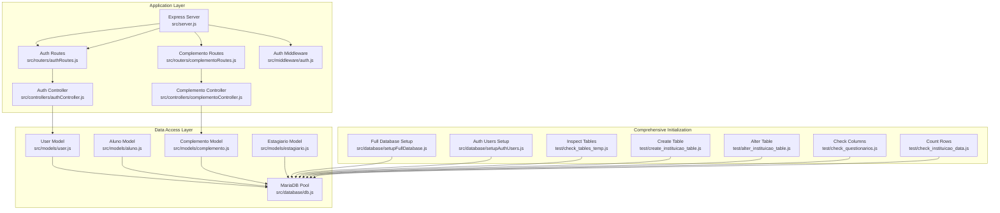
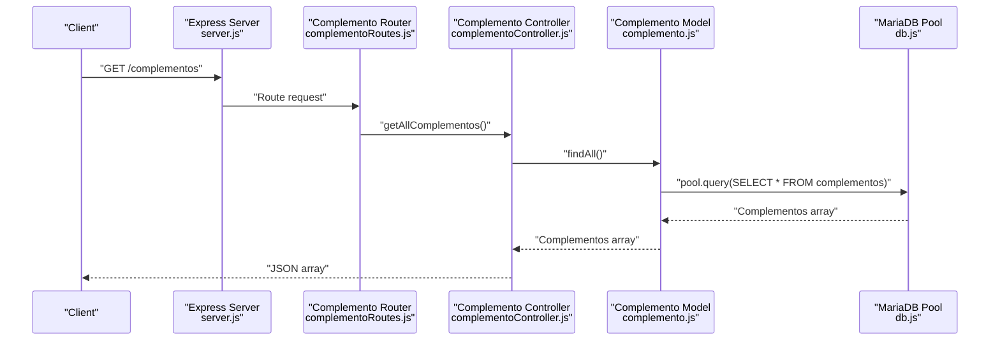
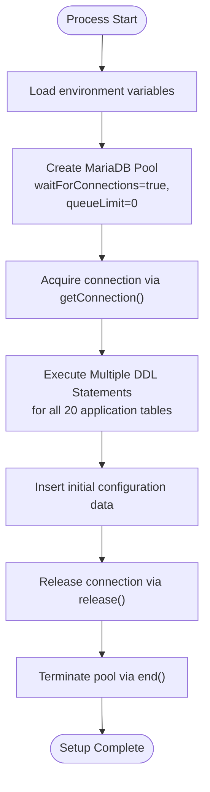
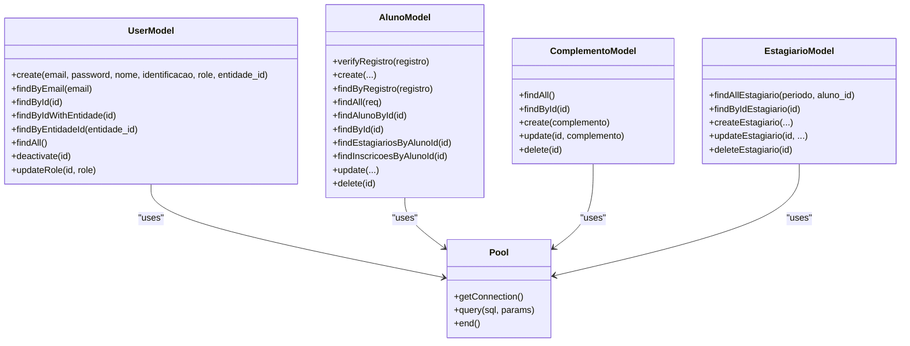
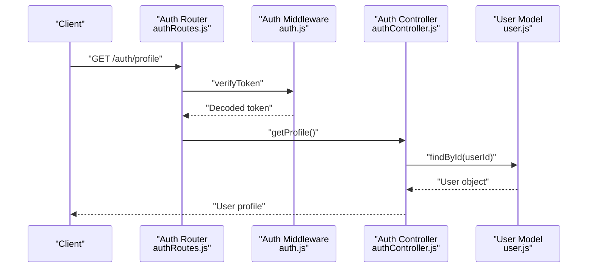
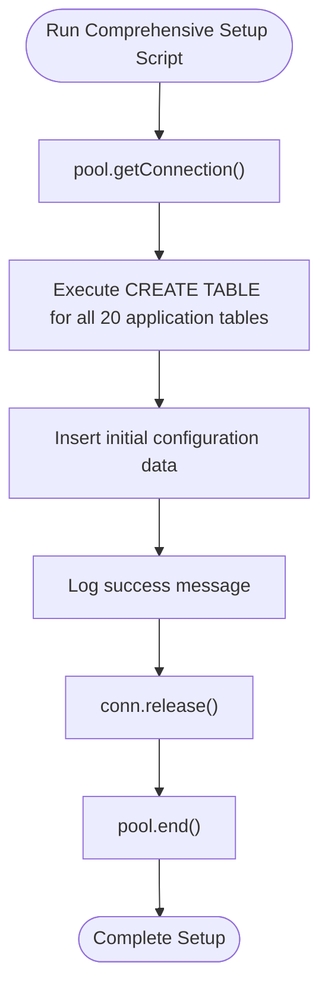
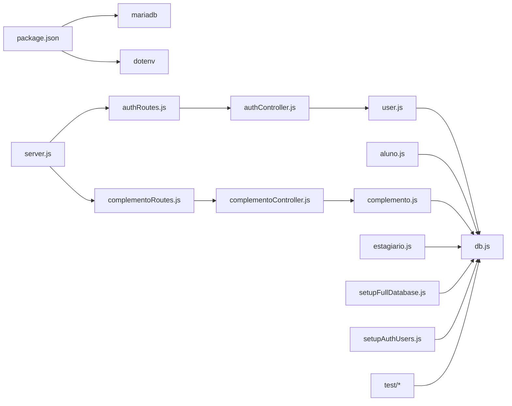

# Database Architecture & Connection Management

<cite>
**Referenced Files in This Document**
- [db.js](file://src/database/db.js)
- [setupFullDatabase.js](file://src/database/setupFullDatabase.js)
- [setupAuthUsers.js](file://src/database/setupAuthUsers.js)
- [user.js](file://src/models/user.js)
- [aluno.js](file://src/models/aluno.js)
- [complemento.js](file://src/models/complemento.js)
- [estagiario.js](file://src/models/estagiario.js)
- [authController.js](file://src/controllers/authController.js)
- [authRoutes.js](file://src/routers/authRoutes.js)
- [complementoController.js](file://src/controllers/complementoController.js)
- [complementoRoutes.js](file://src/routers/complementoRoutes.js)
- [auth.js](file://src/middleware/auth.js)
- [server.js](file://src/server.js)
- [check_tables_temp.js](file://test/check_tables_temp.js)
- [create_instituicao_table.js](file://test/create_instituicao_table.js)
- [check_questionarios.js](file://test/check_questionarios.js)
- [check_instituicao_data.js](file://test/check_instituicao_data.js)
- [package.json](file://package.json)
- [README.md](file://README.md)
</cite>

## Update Summary
**Changes Made**
- Added documentation for the new complementos table and its integration with the estagiarios table
- Updated database schema overview to include the 20-table structure with complementos as the latest addition
- Enhanced relationship documentation showing how complementos connects to estagiarios
- Updated server routing to include complementoRoutes
- Added comprehensive CRUD operations for complementos management
- Updated database initialization section to reflect the expanded schema with 20 tables

## Table of Contents
1. [Introduction](#introduction)
2. [Project Structure](#project-structure)
3. [Core Components](#core-components)
4. [Architecture Overview](#architecture-overview)
5. [Detailed Component Analysis](#detailed-component-analysis)
6. [Dependency Analysis](#dependency-analysis)
7. [Performance Considerations](#performance-considerations)
8. [Troubleshooting Guide](#troubleshooting-guide)
9. [Conclusion](#conclusion)
10. [Appendices](#appendices)

## Introduction
This document describes the database architecture and connection management for NodeMural, focusing on the MariaDB connection pool configuration, connection lifecycle management, database abstraction patterns, and operational practices. It covers connection pooling strategies, timeout configurations, error handling mechanisms, database initialization and schema management, migration strategies, security considerations, performance optimization, monitoring and health checks, transaction management, and backup and disaster recovery procedures.

## Project Structure
The database layer is organized around a shared connection pool module and model abstractions that encapsulate SQL operations. A comprehensive initialization script creates all required tables and initial data structures, while controllers and middleware orchestrate authentication and authorization flows. The new complementos table enhances the system's ability to manage special academic periods for students. Test scripts demonstrate schema inspection and migration patterns.

**Diagram sources**
- [server.js:1-73](file://src/server.js#L1-L73)
- [authRoutes.js:1-20](file://src/routers/authRoutes.js#L1-L20)
- [complementoRoutes.js:1-16](file://src/routers/complementoRoutes.js#L1-L16)
- [authController.js:1-157](file://src/controllers/authController.js#L1-L157)
- [complementoController.js:1-72](file://src/controllers/complementoController.js#L1-L72)
- [auth.js:1-137](file://src/middleware/auth.js#L1-L137)
- [db.js:1-15](file://src/database/db.js#L1-L15)
- [user.js:1-146](file://src/models/user.js#L1-L146)
- [aluno.js:1-146](file://src/models/aluno.js#L1-L146)
- [complemento.js:1-45](file://src/models/complemento.js#L1-L45)
- [estagiario.js:1-334](file://src/models/estagiario.js#L1-L334)
- [setupFullDatabase.js:1-291](file://src/database/setupFullDatabase.js#L1-L291)
- [setupAuthUsers.js:1-38](file://src/database/setupAuthUsers.js#L1-L38)
- [check_tables_temp.js:1-40](file://test/check_tables_temp.js#L1-L40)
- [create_instituicao_table.js:1-41](file://test/create_instituicao_table.js#L1-L41)
- [alter_instituicao_table.js:1-39](file://test/alter_instituicao_table.js#L1-L39)
- [check_questionarios.js:1-28](file://test/check_questionarios.js#L1-L28)
- [check_instituicao_data.js:1-25](file://test/check_instituicao_data.js#L1-L25)

**Section sources**
- [server.js:1-73](file://src/server.js#L1-L73)
- [db.js:1-15](file://src/database/db.js#L1-L15)
- [README.md:1-61](file://README.md#L1-L61)

## Core Components
- MariaDB connection pool configured via environment variables and exported for reuse across models.
- Models encapsulate CRUD operations against MariaDB tables using the shared pool.
- **Updated**: Comprehensive initialization script creates all required tables and initial data structures in a single operation, now including the 20th table - complementos.
- Controllers and middleware handle authentication and authorization flows, interacting with models.
- **New**: Complemento model and controller provide CRUD operations for managing special academic periods.

Key implementation references:
- Pool creation and configuration: [db.js:5-13](file://src/database/db.js#L5-L13)
- User model operations: [user.js:18-34](file://src/models/user.js#L18-L34)
- Aluno model operations: [aluno.js:15-20](file://src/models/aluno.js#L15-L20)
- **Updated**: Full database setup script: [setupFullDatabase.js:1-291](file://src/database/setupFullDatabase.js#L1-L291)
- **New**: Complemento model: [complemento.js:1-45](file://src/models/complemento.js#L1-L45)
- **New**: Complemento controller: [complementoController.js:1-72](file://src/controllers/complementoController.js#L1-L72)
- **New**: Complemento routes: [complementoRoutes.js:1-16](file://src/routers/complementoRoutes.js#L1-L16)
- Legacy auth setup script: [setupAuthUsers.js:1-38](file://src/database/setupAuthUsers.js#L1-L38)
- Server bootstrap and routes: [server.js:31-64](file://src/server.js#L31-L64)

**Section sources**
- [db.js:1-15](file://src/database/db.js#L1-L15)
- [user.js:1-146](file://src/models/user.js#L1-L146)
- [aluno.js:1-146](file://src/models/aluno.js#L1-L146)
- [complemento.js:1-45](file://src/models/complemento.js#L1-L45)
- [complementoController.js:1-72](file://src/controllers/complementoController.js#L1-L72)
- [complementoRoutes.js:1-16](file://src/routers/complementoRoutes.js#L1-L16)
- [setupFullDatabase.js:1-291](file://src/database/setupFullDatabase.js#L1-L291)
- [setupAuthUsers.js:1-38](file://src/database/setupAuthUsers.js#L1-L38)
- [server.js:1-73](file://src/server.js#L1-L73)

## Architecture Overview
The system follows a layered architecture:
- Presentation and routing handled by Express.
- Controllers coordinate requests and responses.
- Models abstract database operations using a shared MariaDB pool.
- **Updated**: Comprehensive initialization script manages complete schema creation and initial data population, now including the complementos table.
- Middleware enforces authentication and authorization.
- **New**: Complemento routes provide RESTful endpoints for managing special academic periods.

**Diagram sources**
- [server.js:63-64](file://src/server.js#L63-L64)
- [complementoRoutes.js:9-13](file://src/routers/complementoRoutes.js#L9-L13)
- [complementoController.js:3-11](file://src/controllers/complementoController.js#L3-L11)
- [complemento.js:4-8](file://src/models/complemento.js#L4-L8)
- [db.js:1-15](file://src/database/db.js#L1-L15)

## Detailed Component Analysis

### MariaDB Connection Pool
- Configuration is centralized in a single pool module, enabling consistent connection behavior across the application.
- Environment-driven configuration supports host, user, password, database name, and pool limits.
- Queue behavior is configured to wait for connections rather than rejecting requests immediately.

Operational characteristics:
- Connection lifecycle: Connections are acquired via getConnection() and released via release() or end() depending on the operation.
- **Updated**: Comprehensive setup script acquires a connection, executes all DDL statements for multiple tables, inserts initial configuration data, and then releases and terminates the pool to avoid lingering connections.

References:
- Pool creation and options: [db.js:5-13](file://src/database/db.js#L5-L13)
- **Updated**: Full setup pattern: [setupFullDatabase.js:4-291](file://src/database/setupFullDatabase.js#L4-L291)
- Legacy setup pattern: [setupAuthUsers.js:6-35](file://src/database/setupAuthUsers.js#L6-L35)

**Diagram sources**
- [db.js:5-13](file://src/database/db.js#L5-L13)
- [setupFullDatabase.js:4-291](file://src/database/setupFullDatabase.js#L4-L291)
- [setupAuthUsers.js:6-35](file://src/database/setupAuthUsers.js#L6-L35)

**Section sources**
- [db.js:1-15](file://src/database/db.js#L1-L15)
- [setupFullDatabase.js:1-291](file://src/database/setupFullDatabase.js#L1-L291)
- [setupAuthUsers.js:1-38](file://src/database/setupAuthUsers.js#L1-L38)

### Database Abstraction Patterns
- Models encapsulate SQL operations, exposing asynchronous methods for create, read, update, and delete.
- Queries leverage parameterized statements to prevent SQL injection.
- Soft-delete and role-based filtering are applied in queries where appropriate.
- **Updated**: Complemento model follows the same CRUD pattern as other models, providing comprehensive operations for managing special academic periods.

References:
- User model create/find/update/deactivate: [user.js:7-142](file://src/models/user.js#L7-L142)
- Aluno model CRUD and joins: [aluno.js:6-143](file://src/models/aluno.js#L6-L143)
- **Updated**: Complemento model CRUD operations: [complemento.js:3-41](file://src/models/complemento.js#L3-L41)
- Estagiario model with complementos join: [estagiario.js:97-104](file://src/models/estagiario.js#L97-L104)

**Diagram sources**
- [user.js:1-146](file://src/models/user.js#L1-L146)
- [aluno.js:1-146](file://src/models/aluno.js#L1-L146)
- [complemento.js:1-45](file://src/models/complemento.js#L1-L45)
- [estagiario.js:1-334](file://src/models/estagiario.js#L1-L334)
- [db.js:1-15](file://src/database/db.js#L1-L15)

**Section sources**
- [user.js:1-146](file://src/models/user.js#L1-L146)
- [aluno.js:1-146](file://src/models/aluno.js#L1-L146)
- [complemento.js:1-45](file://src/models/complemento.js#L1-L45)
- [estagiario.js:1-334](file://src/models/estagiario.js#L1-L334)

### Authentication and Authorization Flow
- Routes define public and protected endpoints.
- Middleware verifies JWT tokens and enforces role-based access.
- Controllers interact with models to authenticate users and retrieve profiles.

References:
- Auth routes: [authRoutes.js:1-20](file://src/routers/authRoutes.js#L1-L20)
- Auth controller: [authController.js:6-156](file://src/controllers/authController.js#L6-L156)
- Auth middleware: [auth.js:6-136](file://src/middleware/auth.js#L6-L136)

**Diagram sources**
- [authRoutes.js:1-20](file://src/routers/authRoutes.js#L1-L20)
- [auth.js:6-29](file://src/middleware/auth.js#L6-L29)
- [authController.js:129-145](file://src/controllers/authController.js#L129-L145)
- [user.js:49-60](file://src/models/user.js#L49-L60)

**Section sources**
- [authRoutes.js:1-20](file://src/routers/authRoutes.js#L1-L20)
- [authController.js:1-157](file://src/controllers/authController.js#L1-L157)
- [auth.js:1-137](file://src/middleware/auth.js#L1-L137)

### Database Initialization and Schema Management
- **Updated**: Comprehensive initialization script creates all 20 application tables in a single operation, including users, alunos, professores, supervisores, instituicoes, areas, mural_estagios, inscricoes, estagiarios, turma_estagios, folhadeatividades, questionarios, questoes, respostas, visitas, configuracoes, inst_super, and the new complementos table.
- **Updated**: The script automatically inserts initial configuration data if the configuracoes table is empty.
- **New**: The complementos table provides management of special academic periods for students, with estagiarios having a foreign key relationship to complementos.
- Legacy initialization scripts still exist but are superseded by the comprehensive setup approach.
- Test scripts demonstrate schema inspection, table creation, column alterations, and row counting.

**Updated** The new comprehensive setup script provides a complete database initialization solution that replaces the previous fragmented approach and now includes the 20th table for enhanced academic period management.

References:
- **Updated**: Full database setup: [setupFullDatabase.js:10-263](file://src/database/setupFullDatabase.js#L10-L263)
- **Updated**: Initial configuration insertion: [setupFullDatabase.js:273-278](file://src/database/setupFullDatabase.js#L273-L278)
- **New**: Complementos table definition: [setupFullDatabase.js:259-263](file://src/database/setupFullDatabase.js#L259-L263)
- Legacy auth users setup: [setupAuthUsers.js:6-35](file://src/database/setupAuthUsers.js#L6-L35)
- Schema inspection: [check_tables_temp.js:11-37](file://test/check_tables_temp.js#L11-L37)
- Table creation: [create_instituicao_table.js:11-38](file://test/create_instituicao_table.js#L11-L38)
- Column alteration: [alter_instituicao_table.js:11-37](file://test/alter_instituicao_table.js#L11-L37)
- Column metadata: [check_questionarios.js:12-26](file://test/check_questionarios.js#L12-L26)
- Row count: [check_instituicao_data.js:11-23](file://test/check_instituicao_data.js#L11-L23)

**Diagram sources**
- [setupFullDatabase.js:4-291](file://src/database/setupFullDatabase.js#L4-L291)
- [db.js:1-15](file://src/database/db.js#L1-L15)

**Section sources**
- [setupFullDatabase.js:1-291](file://src/database/setupFullDatabase.js#L1-L291)
- [setupAuthUsers.js:1-38](file://src/database/setupAuthUsers.js#L1-L38)
- [check_tables_temp.js:1-40](file://test/check_tables_temp.js#L1-L40)
- [create_instituicao_table.js:1-41](file://test/create_instituicao_table.js#L1-L41)
- [alter_instituicao_table.js:1-39](file://test/alter_instituicao_table.js#L1-L39)
- [check_questionarios.js:1-28](file://test/check_questionarios.js#L1-L28)
- [check_instituicao_data.js:1-25](file://test/check_instituicao_data.js#L1-L25)

### Migration Strategies
- **Updated**: The comprehensive setup script handles all table creation and initial data population in a single operation, including the new complementos table.
- **Updated**: For future schema changes, the setup script can be extended to include conditional migrations that check for existing table structures and apply necessary alterations.
- **New**: The complementos table maintains referential integrity with the estagiarios table through the complemento_id foreign key.
- Legacy DDL change scripts still exist for testing and development scenarios.
- Schema inspection scripts verify presence and structure of tables and columns.

**Updated** The new approach consolidates all database initialization into a single, comprehensive script that handles both table creation and initial data population, now including the 20th table for enhanced academic period management.

References:
- **Updated**: Comprehensive table creation: [setupFullDatabase.js:10-263](file://src/database/setupFullDatabase.js#L10-L263)
- **Updated**: Initial configuration handling: [setupFullDatabase.js:273-278](file://src/database/setupFullDatabase.js#L273-L278)
- **New**: Complementos table relationship: [estagiario.js:200-220](file://src/models/estagiario.js#L200-L220)
- Legacy alter table operations: [alter_instituicao_table.js:17-28](file://test/alter_instituicao_table.js#L17-L28)
- Inspect tables/columns: [check_tables_temp.js:14-29](file://test/check_tables_temp.js#L14-L29), [check_questionarios.js:15-18](file://test/check_questionarios.js#L15-L18)

**Section sources**
- [setupFullDatabase.js:1-291](file://src/database/setupFullDatabase.js#L1-L291)
- [estagiario.js:1-334](file://src/models/estagiario.js#L1-L334)
- [alter_instituicao_table.js:1-39](file://test/alter_instituicao_table.js#L1-L39)
- [check_tables_temp.js:1-40](file://test/check_tables_temp.js#L1-L40)
- [check_questionarios.js:1-28](file://test/check_questionarios.js#L1-L28)

### Connection Security Considerations
- Credentials are loaded from environment variables and injected into the pool configuration.
- JWT secret and expiry are environment-controlled for authentication.
- **Updated**: The comprehensive setup script runs with the same security considerations as the legacy setup scripts, using environment variables for database credentials.
- No explicit TLS/SSL configuration is present in the pool module; production deployments should configure SSL/TLS according to MariaDB client requirements.

References:
- Pool credentials: [db.js:5-9](file://src/database/db.js#L5-L9)
- **Updated**: Setup script security: [setupFullDatabase.js:2-2](file://src/database/setupFullDatabase.js#L2-L2)
- JWT configuration: [authController.js:99-109](file://src/controllers/authController.js#L99-L109), [auth.js:14-16](file://src/middleware/auth.js#L14-L16)

**Section sources**
- [db.js:1-15](file://src/database/db.js#L1-L15)
- [setupFullDatabase.js:1-291](file://src/database/setupFullDatabase.js#L1-L291)
- [authController.js:1-157](file://src/controllers/authController.js#L1-L157)
- [auth.js:1-137](file://src/middleware/auth.js#L1-L137)

### Transaction Management and Consistency Guarantees
- Current models perform individual statements without explicit transaction blocks.
- **Updated**: The comprehensive setup script executes all table creation statements sequentially within a single connection context, providing atomicity for the entire initialization process.
- **New**: Complemento model operations are atomic per request, ensuring data consistency for special academic period management.
- For multi-statement consistency in application operations, wrap operations in transaction boundaries using conn.beginTransaction(), conn.commit(), and conn.rollback().

**Updated** The setup script ensures atomic database initialization by executing all DDL statements within a single connection context, and complemento operations maintain consistency through individual atomic transactions.

References:
- **Updated**: Setup script connection management: [setupFullDatabase.js:4-291](file://src/database/setupFullDatabase.js#L4-L291)
- **New**: Complemento model transaction patterns: [complemento.js:19-41](file://src/models/complemento.js#L19-L41)
- Connection acquisition/release pattern: [user.js:18-21](file://src/models/user.js#L18-L21), [aluno.js:15-19](file://src/models/aluno.js#L15-L19)

**Section sources**
- [setupFullDatabase.js:1-291](file://src/database/setupFullDatabase.js#L1-L291)
- [complemento.js:1-45](file://src/models/complemento.js#L1-L45)
- [user.js:1-146](file://src/models/user.js#L1-L146)
- [aluno.js:1-146](file://src/models/aluno.js#L1-L146)

### Monitoring, Health Checks, and Failover
- No explicit health check endpoint or pool metrics are implemented in the current codebase.
- **Updated**: The comprehensive setup script provides console logging for successful table creation and initial configuration insertion, aiding in monitoring and debugging.
- **New**: Complemento routes support monitoring through standard HTTP status codes and error handling.
- Recommendations include adding a GET /health endpoint that pings the database and exposes pool statistics.

**Updated** The setup script includes comprehensive logging to aid in monitoring and debugging the database initialization process, and complemento routes provide standard RESTful monitoring capabilities.

References:
- **Updated**: Setup script logging: [setupFullDatabase.js:8-278](file://src/database/setupFullDatabase.js#L8-L278)
- **New**: Complemento route monitoring: [complementoRoutes.js:9-13](file://src/routers/complementoRoutes.js#L9-L13)
- Server bootstrap and routes: [server.js:31-64](file://src/server.js#L31-L64)

**Section sources**
- [setupFullDatabase.js:1-291](file://src/database/setupFullDatabase.js#L1-L291)
- [complementoRoutes.js:1-16](file://src/routers/complementoRoutes.js#L1-L16)
- [server.js:1-73](file://src/server.js#L1-L73)

### Enhanced Relationship Management
- **New**: The complementos table establishes a many-to-one relationship with the estagiarios table through the complemento_id foreign key.
- **New**: This relationship enables management of special academic periods for students, allowing different period types to be associated with student internships.
- **New**: The estagiario model includes LEFT JOIN operations to retrieve complemento period names alongside student data.
- **New**: Complemento routes provide RESTful endpoints for CRUD operations on special academic periods.

**Updated** The addition of the complementos table significantly enhances the system's ability to manage diverse academic period types for student internships.

References:
- **New**: Complementos table definition: [setupFullDatabase.js:259-263](file://src/database/setupFullDatabase.js#L259-L263)
- **New**: Complemento model operations: [complemento.js:3-41](file://src/models/complemento.js#L3-L41)
- **New**: Estagiario complemento relationship: [estagiario.js:97-104](file://src/models/estagiario.js#L97-L104)
- **New**: Complemento routes definition: [complementoRoutes.js:9-13](file://src/routers/complementoRoutes.js#L9-L13)

**Section sources**
- [setupFullDatabase.js:259-263](file://src/database/setupFullDatabase.js#L259-L263)
- [complemento.js:1-45](file://src/models/complemento.js#L1-L45)
- [estagiario.js:97-104](file://src/models/estagiario.js#L97-L104)
- [complementoRoutes.js:1-16](file://src/routers/complementoRoutes.js#L1-L16)

## Dependency Analysis
The application depends on the MariaDB driver and dotenv for configuration. Models depend on the shared pool module. **Updated**: The comprehensive setup script demonstrates direct pool usage for complete schema operations, while legacy scripts show the previous fragmented approach. **New**: Complemento routes integrate seamlessly with the existing routing structure.

**Updated** The dependency structure now centers around a single comprehensive setup script that handles all database initialization needs, plus the new complemento routing system.

**Diagram sources**
- [package.json:22-30](file://package.json#L22-L30)
- [server.js:1-73](file://src/server.js#L1-L73)
- [authRoutes.js:1-20](file://src/routers/authRoutes.js#L1-L20)
- [complementoRoutes.js:1-16](file://src/routers/complementoRoutes.js#L1-L16)
- [authController.js:1-157](file://src/controllers/authController.js#L1-L157)
- [complementoController.js:1-72](file://src/controllers/complementoController.js#L1-L72)
- [user.js:1-146](file://src/models/user.js#L1-L146)
- [aluno.js:1-146](file://src/models/aluno.js#L1-L146)
- [complemento.js:1-45](file://src/models/complemento.js#L1-L45)
- [estagiario.js:1-334](file://src/models/estagiario.js#L1-L334)
- [db.js:1-15](file://src/database/db.js#L1-L15)
- [setupFullDatabase.js:1-291](file://src/database/setupFullDatabase.js#L1-L291)
- [setupAuthUsers.js:1-38](file://src/database/setupAuthUsers.js#L1-L38)

**Section sources**
- [package.json:1-33](file://package.json#L1-L33)
- [server.js:1-73](file://src/server.js#L1-L73)

## Performance Considerations
- Connection pooling: Use waitForConnections and queueLimit to control queue behavior; tune DB_POOL_LIMIT based on workload.
- Query patterns: Prefer parameterized queries and limit result sets with pagination where applicable.
- Connection reuse: Acquire connections only when needed and release them promptly; avoid long-lived connections in request handlers.
- **Updated**: The comprehensive setup script optimizes performance by using a single connection for all table creation operations, reducing connection overhead.
- **New**: Complemento operations benefit from the same connection pooling optimizations as other models.
- Indexing: Ensure appropriate indexes on frequently filtered columns (e.g., email, role, identifiers, complemento period names).
- Batch operations: Group related updates to reduce round-trips.

**Updated** The new setup script improves performance by minimizing connection overhead through sequential table creation within a single connection context, and complemento operations follow the same performance patterns.

## Troubleshooting Guide
Common issues and resolutions:
- Connection errors: Verify DB_HOST, DB_USER, DB_PASSWORD, DB_NAME, and DB_POOL_LIMIT in the environment.
- Authentication failures: Confirm JWT_SECRET and JWT_EXPIRY are set appropriately.
- **Updated**: Setup failures: Use the comprehensive setup script to initialize the complete database structure, which includes logging for successful table creation and initial configuration insertion, now including the complementos table.
- **Updated**: Legacy setup scripts: The previous setupUsers.js and setupAuthUsers.js scripts are still available but are superseded by the comprehensive approach.
- **New**: Complemento-related issues: Check that complemento_id foreign keys in estagiarios table reference valid complementos table entries.
- Schema inconsistencies: Use the comprehensive setup script to recreate the complete database structure if needed, including the 20th table.
- Resource leaks: Ensure every acquired connection is released; the setup scripts demonstrate proper release and pool termination.

**Updated** The troubleshooting guide now emphasizes the comprehensive setup script as the primary solution for database initialization issues and includes guidance for complemento-related problems.

References:
- Environment variables and defaults: [README.md:18-28](file://README.md#L18-L28)
- Pool configuration: [db.js:5-13](file://src/database/db.js#L5-L13)
- **Updated**: Comprehensive setup script: [setupFullDatabase.js:1-291](file://src/database/setupFullDatabase.js#L1-L291)
- **New**: Complemento troubleshooting: [complemento.js:1-45](file://src/models/complemento.js#L1-L45)
- Legacy setup patterns: [setupAuthUsers.js:6-35](file://src/database/setupAuthUsers.js#L6-L35)
- Schema inspection: [check_tables_temp.js:11-37](file://test/check_tables_temp.js#L11-L37)

**Section sources**
- [README.md:1-61](file://README.md#L1-L61)
- [db.js:1-15](file://src/database/db.js#L1-L15)
- [setupFullDatabase.js:1-291](file://src/database/setupFullDatabase.js#L1-L291)
- [complemento.js:1-45](file://src/models/complemento.js#L1-L45)
- [setupAuthUsers.js:1-38](file://src/database/setupAuthUsers.js#L1-L38)
- [check_tables_temp.js:1-40](file://test/check_tables_temp.js#L1-L40)

## Conclusion
NodeMural's database layer centers on a shared MariaDB connection pool and model abstractions that encapsulate SQL operations. **Updated**: The comprehensive setupFullDatabase.js script provides a complete database initialization solution that creates all necessary tables, indexes, and initial data structures in a single operation, now including the 20th table - complementos. **New**: The complementos table enhances the system's ability to manage special academic periods for students, establishing important relationships with the estagiarios table. While the current implementation focuses on simplicity and modularity, production deployments should incorporate explicit TLS configuration, transaction boundaries for multi-step operations, health checks, and performance tuning aligned with workload characteristics.

**Updated** The new comprehensive setup script significantly simplifies database initialization and reduces the complexity of managing multiple separate setup scripts, while the addition of the complementos table provides enhanced academic period management capabilities.

## Appendices

### Environment Variables Reference
- DB_HOST: MariaDB host address
- DB_USER: Database user
- DB_PASSWORD: Database password
- DB_NAME: Target database
- DB_POOL_LIMIT: Maximum pool size
- JWT_SECRET: Secret for signing JWT tokens
- JWT_EXPIRY: Token expiration period
- PORT: Server listening port

References:
- Defaults and usage: [README.md:18-28](file://README.md#L18-L28), [db.js:5-12](file://src/database/db.js#L5-L12), [authController.js:99-109](file://src/controllers/authController.js#L99-L109), [auth.js:14-16](file://src/middleware/auth.js#L14-L16)

**Section sources**
- [README.md:1-61](file://README.md#L1-L61)
- [db.js:1-15](file://src/database/db.js#L1-L15)
- [authController.js:1-157](file://src/controllers/authController.js#L1-L157)
- [auth.js:1-137](file://src/middleware/auth.js#L1-L137)

### Comprehensive Database Schema Overview
**Updated** The new setupFullDatabase.js script creates the following 20 application tables:

1. **users** - System users with roles (admin, supervisor, professor, aluno)
2. **alunos** - University students with personal and academic information
3. **professores** - University professors with professional details
4. **supervisores** - External supervisors for internships
5. **instituicoes** - Host institutions for internships
6. **areas** - Institutional areas/fields of study
7. **mural_estagios** - Internship opportunities board
8. **inscricoes** - Student internship registrations
9. **estagiarios** - Students assigned to specific internships with complemento_id relationship
10. **turma_estagios** - Student groups by area and period
11. **folhadeatividades** - Daily activity tracking for interns
12. **questionarios** - Evaluation questionnaires
13. **questoes** - Individual questionnaire questions
14. **respostas** - Supervisor evaluations of students
15. **visitas** - Institution visit records
16. **configuracoes** - System configuration settings
17. **inst_super** - Many-to-many relationship between supervisors and institutions
18. **turnos** - Student shift/period management
19. **questionarios** - Evaluation questionnaires
20. **complementos** - Special academic periods for student internships (NEW)

**Updated** This comprehensive schema provides complete coverage of the internship management system requirements in a single initialization operation, with the addition of the complementos table enabling enhanced academic period management.

**Section sources**
- [setupFullDatabase.js:10-263](file://src/database/setupFullDatabase.js#L10-L263)

### Complemento Management Features
**New** The complementos table and associated components provide:

- **RESTful API Endpoints**:
  - GET `/complementos` - Retrieve all special academic periods
  - GET `/complementos/:id` - Retrieve specific period by ID
  - POST `/complementos` - Create new academic period (admin only)
  - PUT `/complementos/:id` - Update existing period (admin only)
  - DELETE `/complementos/:id` - Delete period (admin only)

- **Integration with Estagiarios**:
  - Foreign key relationship through complemento_id
  - LEFT JOIN operations in estagiario queries
  - Display of complemento period names in student records

- **Business Logic**:
  - Period validation and uniqueness constraints
  - Role-based access control (admin-only modifications)
  - Comprehensive error handling and validation

**Section sources**
- [complemento.js:1-45](file://src/models/complemento.js#L1-L45)
- [complementoController.js:1-72](file://src/controllers/complementoController.js#L1-L72)
- [complementoRoutes.js:1-16](file://src/routers/complementoRoutes.js#L1-L16)
- [estagiario.js:97-104](file://src/models/estagiario.js#L97-L104)