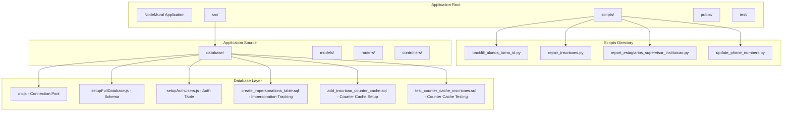
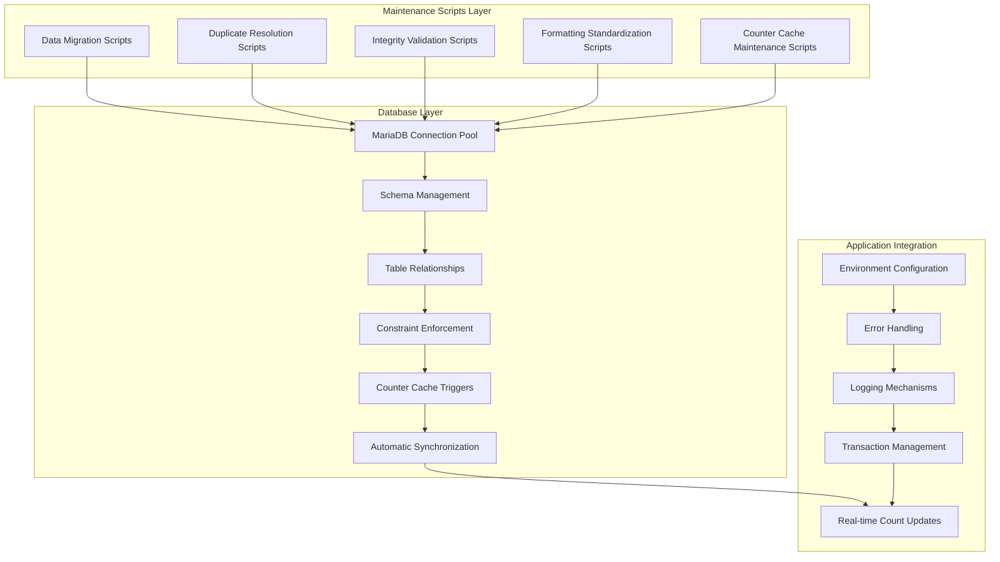
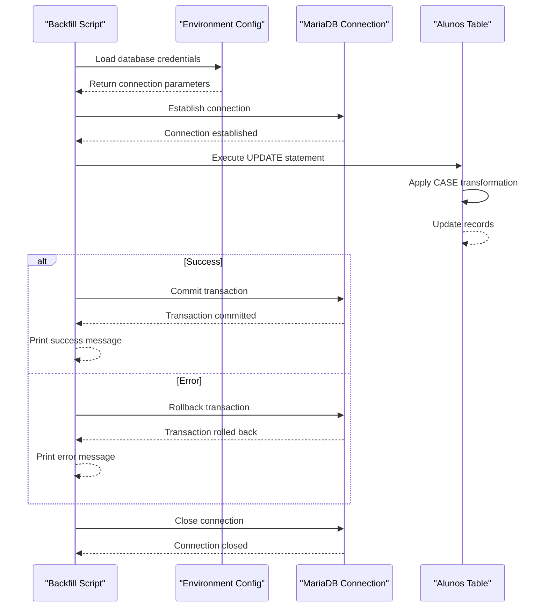
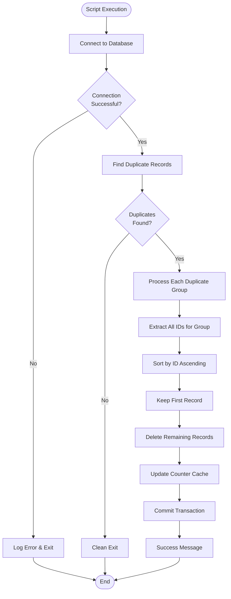
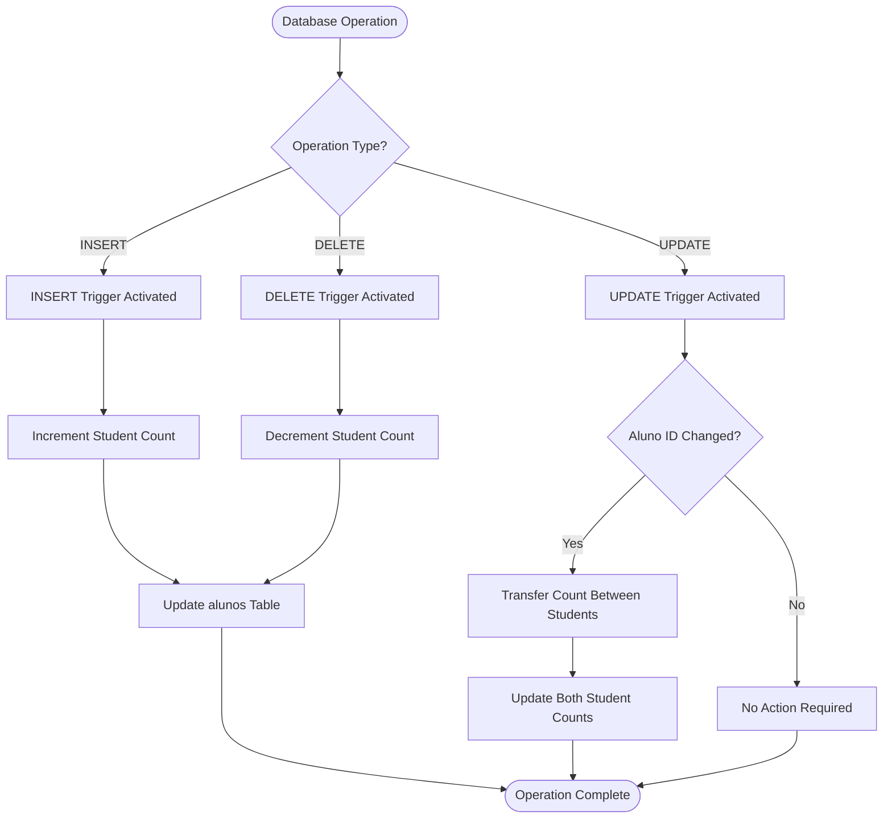
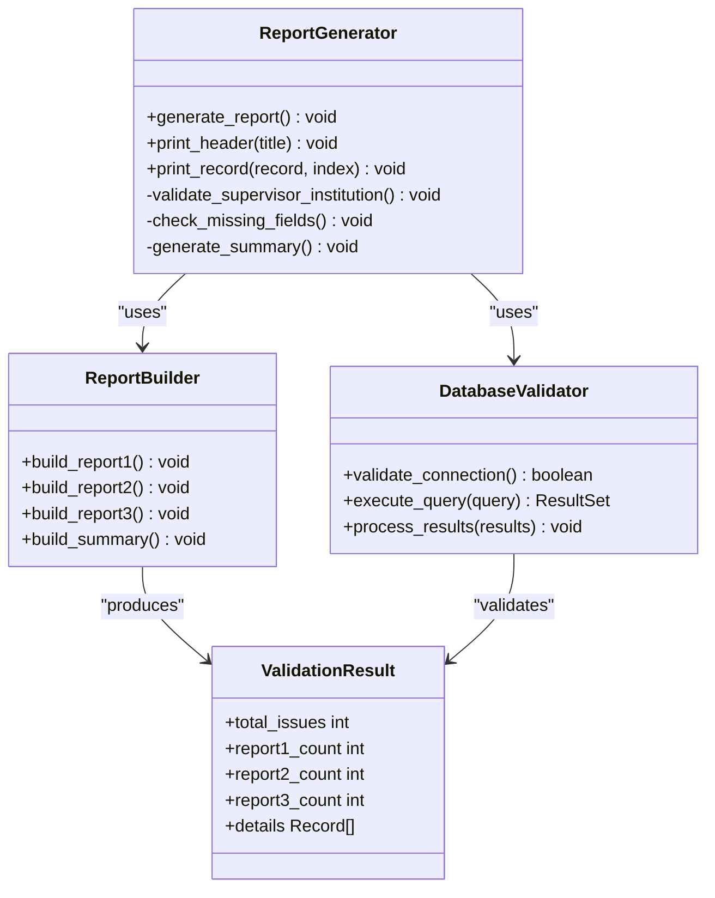
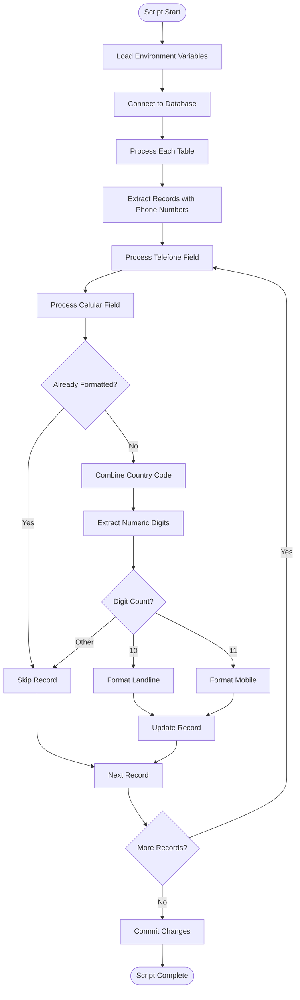
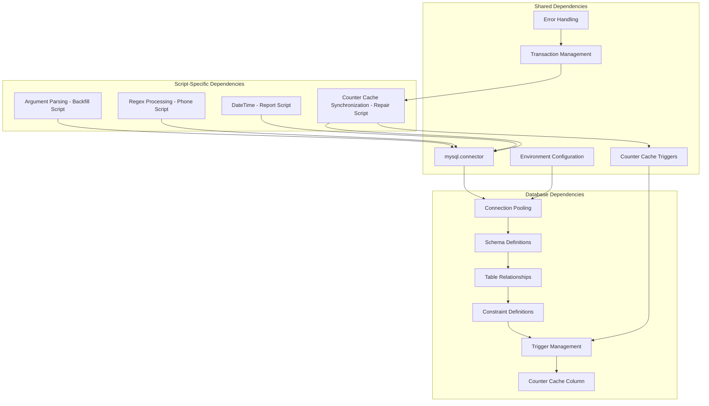

# Database Integrity Maintenance Scripts

<cite>
**Referenced Files in This Document**
- [backfill_alunos_turno_id.py](file://scripts/backfill_alunos_turno_id.py)
- [repair_inscricoes.py](file://scripts/repair_inscricoes.py)
- [report_estagiarios_supervisor_instituicao.py](file://scripts/report_estagiarios_supervisor_instituicao.py)
- [update_phone_numbers.py](file://scripts/update_phone_numbers.py)
- [add_inscricao_counter_cache.sql](file://src/database/add_inscricao_counter_cache.sql)
- [test_counter_cache_inscricoes.sql](file://test/test_counter_cache_inscricoes.sql)
- [db.js](file://src/database/db.js)
- [setupFullDatabase.js](file://src/database/setupFullDatabase.js)
- [aluno.js](file://src/models/aluno.js)
- [estagiario.js](file://src/models/estagiario.js)
- [create_impersonations_table.sql](file://src/database/create_impersonations_table.sql)
- [setupAuthUsers.js](file://src/database/setupAuthUsers.js)
- [README.md](file://README.md)
- [package.json](file://package.json)
</cite>

## Update Summary
**Changes Made**
- Added documentation for new counter cache maintenance functionality
- Updated architecture overview to include automatic student registration count synchronization
- Enhanced duplicate resolution component to include counter cache synchronization
- Added new section covering counter cache triggers and automatic maintenance

## Table of Contents
1. [Introduction](#introduction)
2. [Project Structure](#project-structure)
3. [Core Components](#core-components)
4. [Architecture Overview](#architecture-overview)
5. [Detailed Component Analysis](#detailed-component-analysis)
6. [Dependency Analysis](#dependency-analysis)
7. [Performance Considerations](#performance-considerations)
8. [Troubleshooting Guide](#troubleshooting-guide)
9. [Conclusion](#conclusion)

## Introduction
This document provides comprehensive documentation for the Database Integrity Maintenance Scripts in the NodeMural application. These Python scripts are designed to maintain data quality and consistency across the MariaDB database, focusing on three critical areas: data migration and normalization, duplicate record resolution, referential integrity validation, and data formatting standardization.

The NodeMural application is a Node.js web application built with Express and MariaDB that manages student internship programs, featuring user authentication, student management, teacher management, and comprehensive internship tracking systems. The maintenance scripts address common database integrity challenges that arise during data migration, system upgrades, and ongoing operational activities.

**Updated** Added new counter cache maintenance functionality for automatic student registration count synchronization, providing real-time tracking of student enrollment counts through database triggers.

## Project Structure
The database maintenance functionality is organized within the scripts directory, alongside the main application code. The structure follows a clear separation between application logic and maintenance utilities:

**Diagram sources**
- [README.md:1-61](file://README.md#L1-L61)
- [package.json:1-33](file://package.json#L1-L33)

**Section sources**
- [README.md:1-61](file://README.md#L1-L61)
- [package.json:1-33](file://package.json#L1-L33)

## Core Components
The database maintenance scripts ecosystem consists of four specialized tools, each addressing specific integrity challenges, plus new counter cache maintenance functionality:

### Data Migration and Normalization Scripts
The backfill_alunos_turno_id.py script handles data migration from legacy text-based fields to normalized integer identifiers. This transformation improves data consistency and enables efficient querying capabilities.

### Duplicate Resolution Systems
The repair_inscricoes.py script implements sophisticated duplicate detection and removal mechanisms for registration records, maintaining referential integrity while preserving historical data. **Updated** Now includes automatic counter cache synchronization to maintain student registration counts.

### Referential Integrity Validation
The report_estagiarios_supervisor_instituicao.py script provides comprehensive validation of supervisor-institution relationships, identifying inconsistencies that could compromise data reliability.

### Data Formatting Standardization
The update_phone_numbers.py script standardizes phone number formatting across multiple tables, ensuring consistent data presentation and improving data quality.

### Counter Cache Maintenance System
**New** The counter cache system provides automatic student registration count synchronization through database triggers that maintain real-time counts of student enrollments in the alunos table.

**Section sources**
- [backfill_alunos_turno_id.py:1-111](file://scripts/backfill_alunos_turno_id.py#L1-L111)
- [repair_inscricoes.py:1-117](file://scripts/repair_inscricoes.py#L1-L117)
- [report_estagiarios_supervisor_instituicao.py:1-173](file://scripts/report_estagiarios_supervisor_instituicao.py#L1-L173)
- [update_phone_numbers.py:1-242](file://scripts/update_phone_numbers.py#L1-L242)
- [add_inscricao_counter_cache.sql:1-73](file://src/database/add_inscricao_counter_cache.sql#L1-L73)

## Architecture Overview
The database maintenance architecture follows a modular design pattern with clear separation of concerns and includes new counter cache functionality:

**Diagram sources**
- [db.js:1-15](file://src/database/db.js#L1-L15)
- [setupFullDatabase.js:1-291](file://src/database/setupFullDatabase.js#L1-L291)
- [add_inscricao_counter_cache.sql:15-57](file://src/database/add_inscricao_counter_cache.sql#L15-L57)

The architecture emphasizes robust error handling, transaction safety, configurable database connectivity, and automatic counter cache maintenance. Each script maintains independence while leveraging shared database infrastructure and configuration management.

**Section sources**
- [db.js:1-15](file://src/database/db.js#L1-L15)
- [setupFullDatabase.js:1-291](file://src/database/setupFullDatabase.js#L1-L291)
- [add_inscricao_counter_cache.sql:1-73](file://src/database/add_inscricao_counter_cache.sql#L1-L73)

## Detailed Component Analysis

### Data Migration and Normalization Component
The backfill_alunos_turno_id.py script exemplifies best practices for data migration operations:

**Diagram sources**
- [backfill_alunos_turno_id.py:58-111](file://scripts/backfill_alunos_turno_id.py#L58-L111)

The script implements a sophisticated CASE-based transformation that maps textual turn values to standardized integer identifiers. This approach ensures backward compatibility while enabling more efficient database operations and improved query performance.

**Section sources**
- [backfill_alunos_turno_id.py:1-111](file://scripts/backfill_alunos_turno_id.py#L1-L111)

### Duplicate Resolution and Referential Integrity Component
The repair_inscricoes.py script demonstrates advanced database maintenance techniques with new counter cache integration:

**Diagram sources**
- [repair_inscricoes.py:12-117](file://scripts/repair_inscricoes.py#L12-L117)

**Updated** The script now includes automatic counter cache synchronization to maintain accurate student registration counts after duplicate resolution operations. The counter cache update ensures data integrity by recalculating counts for affected students.

The script implements a multi-stage approach to duplicate resolution, prioritizing data integrity through careful record selection and counter cache synchronization.

**Section sources**
- [repair_inscricoes.py:1-117](file://scripts/repair_inscricoes.py#L1-L117)

### Counter Cache Maintenance Component
**New** The counter cache system provides automatic student registration count synchronization through database triggers:

**Diagram sources**
- [add_inscricao_counter_cache.sql:15-57](file://src/database/add_inscricao_counter_cache.sql#L15-L57)

The counter cache system consists of three triggers that automatically maintain student registration counts:

1. **INSERT Trigger**: Automatically increments the student's registration count when new enrollment records are created
2. **DELETE Trigger**: Automatically decrements the student's registration count when enrollment records are removed
3. **UPDATE Trigger**: Handles cases where enrollment records are transferred between students

The system uses the `inscricao_count` column in the `alunos` table to store real-time counts, eliminating the need for expensive COUNT queries during normal operations.

**Section sources**
- [add_inscricao_counter_cache.sql:1-73](file://src/database/add_inscricao_counter_cache.sql#L1-L73)
- [test_counter_cache_inscricoes.sql:1-35](file://test/test_counter_cache_inscricoes.sql#L1-L35)

### Referential Integrity Validation Component
The report_estagiarios_supervisor_instituicao.py script provides comprehensive validation capabilities:

**Diagram sources**
- [report_estagiarios_supervisor_instituicao.py:37-173](file://scripts/report_estagiarios_supervisor_instituicao.py#L37-L173)

The script generates three distinct validation reports, each addressing different aspects of supervisor-institution relationship integrity.

**Section sources**
- [report_estagiarios_supervisor_instituicao.py:1-173](file://scripts/report_estagiarios_supervisor_instituicao.py#L1-L173)

### Data Formatting Standardization Component
The update_phone_numbers.py script implements sophisticated phone number processing:

**Diagram sources**
- [update_phone_numbers.py:81-242](file://scripts/update_phone_numbers.py#L81-L242)

The script implements intelligent phone number formatting with support for international dialing codes and automatic digit extraction.

**Section sources**
- [update_phone_numbers.py:1-242](file://scripts/update_phone_numbers.py#L1-L242)

## Dependency Analysis
The maintenance scripts share common dependencies and architectural patterns with enhanced counter cache integration:

**Diagram sources**
- [backfill_alunos_turno_id.py:1-111](file://scripts/backfill_alunos_turno_id.py#L1-L111)
- [update_phone_numbers.py:1-242](file://scripts/update_phone_numbers.py#L1-L242)
- [report_estagiarios_supervisor_instituicao.py:1-173](file://scripts/report_estagiarios_supervisor_instituicao.py#L1-L173)
- [repair_inscricoes.py:78-89](file://scripts/repair_inscricoes.py#L78-L89)

The dependency structure reveals a clear separation between database connectivity and script-specific functionality, with enhanced integration for counter cache maintenance operations.

**Section sources**
- [backfill_alunos_turno_id.py:1-111](file://scripts/backfill_alunos_turno_id.py#L1-L111)
- [update_phone_numbers.py:1-242](file://scripts/update_phone_numbers.py#L1-L242)
- [report_estagiarios_supervisor_instituicao.py:1-173](file://scripts/report_estagiarios_supervisor_instituicao.py#L1-L173)
- [repair_inscricoes.py:78-89](file://scripts/repair_inscricoes.py#L78-L89)

## Performance Considerations
The maintenance scripts are designed with several performance optimization strategies, including new counter cache benefits:

### Connection Management
Each script implements efficient connection pooling and proper resource cleanup to minimize database overhead and prevent connection leaks.

### Batch Processing
The scripts utilize batch operations where possible, reducing the number of individual database transactions and improving overall throughput.

### Index Utilization
The database schema includes strategic indexing to support the maintenance operations, particularly for frequently queried fields like registration numbers and foreign keys.

### Memory Efficiency
The scripts process data incrementally rather than loading entire datasets into memory, making them suitable for large-scale database maintenance operations.

### Counter Cache Benefits
**New** The counter cache system provides significant performance improvements by:
- Eliminating expensive COUNT queries during normal operations
- Maintaining real-time student registration counts through automatic triggers
- Reducing database load through cached calculations
- Improving query performance for student enrollment statistics

## Troubleshooting Guide

### Common Issues and Solutions

#### Database Connection Problems
- **Issue**: Scripts fail to connect to the database
- **Solution**: Verify environment variables and database credentials
- **Prevention**: Implement connection retry logic and timeout handling

#### Transaction Rollback Scenarios
- **Issue**: Partial updates occur during maintenance operations
- **Solution**: Ensure proper rollback handling and transaction boundaries
- **Prevention**: Implement comprehensive error handling around critical operations

#### Performance Degradation
- **Issue**: Maintenance scripts take excessive time to complete
- **Solution**: Optimize queries and consider batch processing strategies
- **Prevention**: Monitor query execution plans and implement appropriate indexing

#### Data Validation Failures
- **Issue**: Validation scripts report inconsistent data
- **Solution**: Review referential integrity constraints and data patterns
- **Prevention**: Implement pre-validation checks and data quality metrics

#### Counter Cache Synchronization Issues
**New** **Issue**: Student registration counts don't match actual enrollments
**Solution**: Verify trigger installation and check for manual database modifications
**Prevention**: Regular counter cache verification and automatic synchronization monitoring

**Section sources**
- [backfill_alunos_turno_id.py:95-106](file://scripts/backfill_alunos_turno_id.py#L95-L106)
- [repair_inscricoes.py:95-105](file://scripts/repair_inscricoes.py#L95-L105)
- [report_estagiarios_supervisor_instituicao.py:149-160](file://scripts/report_estagiarios_supervisor_instituicao.py#L149-L160)
- [update_phone_numbers.py:193-197](file://scripts/update_phone_numbers.py#L193-L197)

## Conclusion
The Database Integrity Maintenance Scripts represent a comprehensive solution for maintaining data quality and consistency in the NodeMural application. Each script addresses specific integrity challenges while following established best practices for database maintenance operations.

**Updated** The addition of counter cache maintenance functionality significantly enhances the system's ability to maintain real-time student registration counts through automatic database triggers, providing substantial performance improvements and data consistency benefits.

The modular architecture enables targeted maintenance operations without disrupting core application functionality. The scripts demonstrate professional-grade error handling, transaction management, and performance optimization techniques that are essential for reliable database maintenance in production environments.

Key strengths of the implementation include:
- Comprehensive error handling and logging
- Transaction-safe operations with proper rollback mechanisms
- Configurable database connectivity and environment management
- Scalable processing approaches for large datasets
- Clear separation of concerns between different maintenance tasks
- **New** Automatic counter cache maintenance through database triggers
- **New** Real-time student registration count synchronization
- **New** Performance optimizations through cached calculations

These scripts provide a foundation for ongoing database maintenance and quality assurance, supporting the long-term reliability and performance of the NodeMural application while ensuring accurate student enrollment tracking through automated counter cache maintenance.