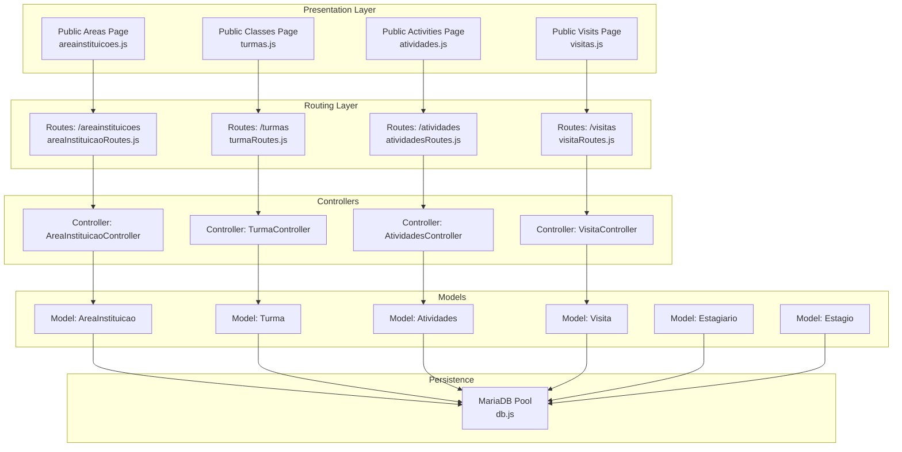
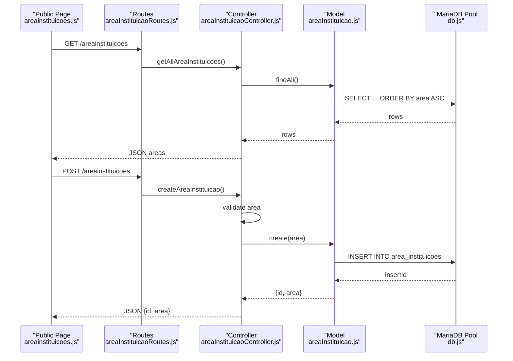
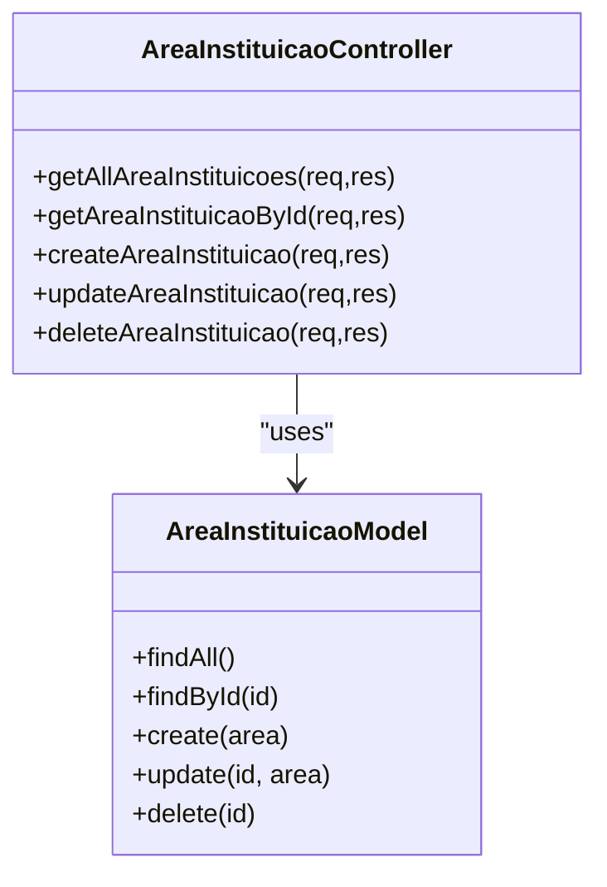
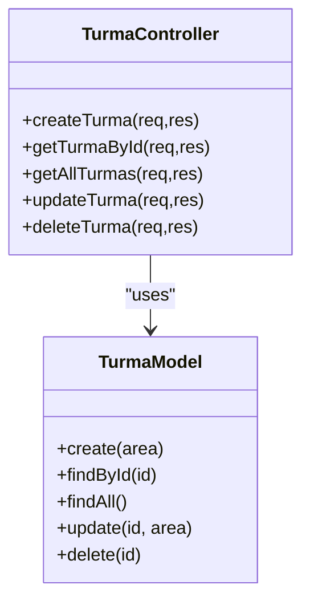
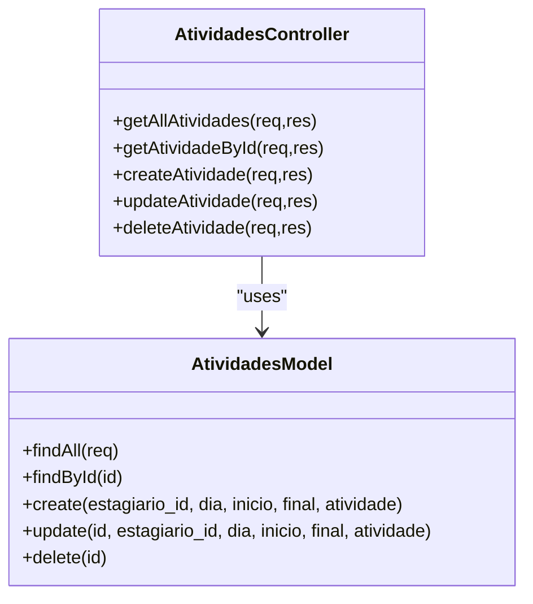
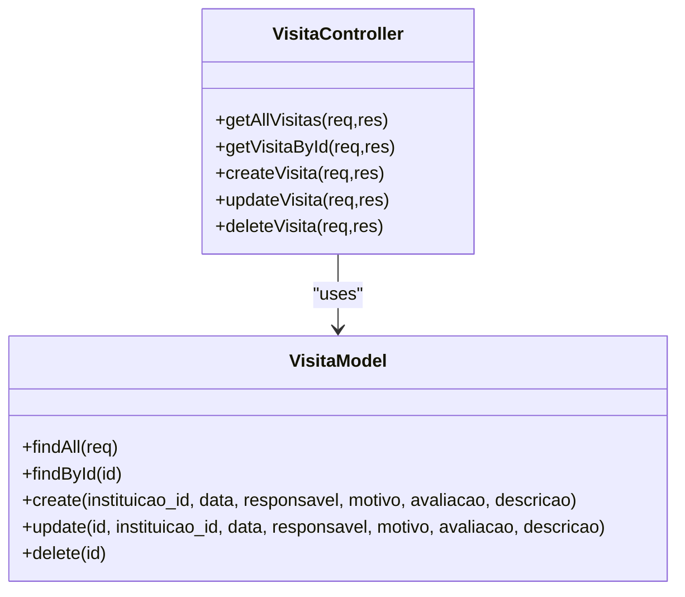
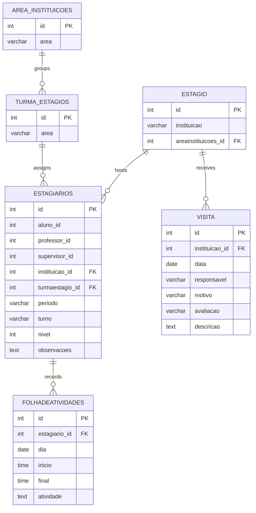
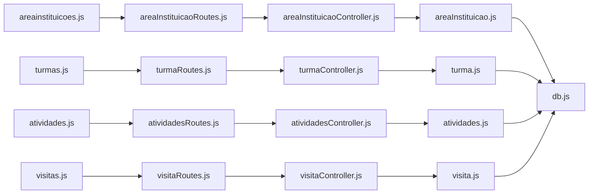

# Institutional Management Models

<cite>
**Referenced Files in This Document**
- [areaInstituicao.js](file://src/models/areaInstituicao.js)
- [turma.js](file://src/models/turma.js)
- [atividades.js](file://src/models/atividades.js)
- [visita.js](file://src/models/visita.js)
- [areaInstituicaoController.js](file://src/controllers/areaInstituicaoController.js)
- [turmaController.js](file://src/controllers/turmaController.js)
- [atividadesController.js](file://src/controllers/atividadesController.js)
- [visitaController.js](file://src/controllers/visitaController.js)
- [areaInstituicaoRoutes.js](file://src/routers/areaInstituicaoRoutes.js)
- [turmaRoutes.js](file://src/routers/turmaRoutes.js)
- [atividadesRoutes.js](file://src/routers/atividadesRoutes.js)
- [visitaRoutes.js](file://src/routers/visitaRoutes.js)
- [db.js](file://src/database/db.js)
- [estagiario.js](file://src/models/estagiario.js)
- [estagio.js](file://src/models/estagio.js)
- [areainstituicoes.js](file://public/areainstituicoes.js)
- [turmas.js](file://public/turmas.js)
- [atividades.js](file://public/atividades.js)
- [visitas.js](file://public/visitas.js)
</cite>

## Table of Contents
1. [Introduction](#introduction)
2. [Project Structure](#project-structure)
3. [Core Components](#core-components)
4. [Architecture Overview](#architecture-overview)
5. [Detailed Component Analysis](#detailed-component-analysis)
6. [Dependency Analysis](#dependency-analysis)
7. [Performance Considerations](#performance-considerations)
8. [Troubleshooting Guide](#troubleshooting-guide)
9. [Conclusion](#conclusion)
10. [Appendices](#appendices)

## Introduction
This document describes the institutional management data models for NodeMural, focusing on four primary entities: institutional areas, classes/courses, activities, and scheduled visits. It defines fields, data types, validation rules, and business constraints; explains relationships among institutional areas, classes, activities, and visits; and documents scheduling, resource allocation, capacity management, lifecycle tracking, and visit coordination. The goal is to provide a clear, accessible reference for developers and stakeholders to understand how data is modeled and processed within the system.

## Project Structure
The system follows a layered architecture:
- Models encapsulate database interactions for each domain entity.
- Controllers expose CRUD endpoints via Express routes.
- Routers define HTTP endpoints and bind them to controller actions.
- Public pages consume REST endpoints to render lists and forms.
- A MariaDB connection pool manages database connectivity.

**Diagram sources**
- [areaInstituicaoRoutes.js](file://src/routers/areaInstituicaoRoutes.js#L1-L13)
- [turmaRoutes.js](file://src/routers/turmaRoutes.js#L1-L18)
- [atividadesRoutes.js](file://src/routers/atividadesRoutes.js#L1-L20)
- [visitaRoutes.js](file://src/routers/visitaRoutes.js#L1-L18)
- [areaInstituicaoController.js](file://src/controllers/areaInstituicaoController.js#L1-L77)
- [turmaController.js](file://src/controllers/turmaController.js#L1-L67)
- [atividadesController.js](file://src/controllers/atividadesController.js#L1-L88)
- [visitaController.js](file://src/controllers/visitaController.js#L1-L67)
- [areaInstituicao.js](file://src/models/areaInstituicao.js#L1-L45)
- [turma.js](file://src/models/turma.js#L1-L39)
- [atividades.js](file://src/models/atividades.js#L1-L57)
- [visita.js](file://src/models/visita.js#L1-L51)
- [db.js](file://src/database/db.js#L1-L15)

**Section sources**
- [areaInstituicaoRoutes.js](file://src/routers/areaInstituicaoRoutes.js#L1-L13)
- [turmaRoutes.js](file://src/routers/turmaRoutes.js#L1-L18)
- [atividadesRoutes.js](file://src/routers/atividadesRoutes.js#L1-L20)
- [visitaRoutes.js](file://src/routers/visitaRoutes.js#L1-L18)
- [areaInstituicaoController.js](file://src/controllers/areaInstituicaoController.js#L1-L77)
- [turmaController.js](file://src/controllers/turmaController.js#L1-L67)
- [atividadesController.js](file://src/controllers/atividadesController.js#L1-L88)
- [visitaController.js](file://src/controllers/visitaController.js#L1-L67)
- [areaInstituicao.js](file://src/models/areaInstituicao.js#L1-L45)
- [turma.js](file://src/models/turma.js#L1-L39)
- [atividades.js](file://src/models/atividades.js#L1-L57)
- [visita.js](file://src/models/visita.js#L1-L51)
- [db.js](file://src/database/db.js#L1-L15)

## Core Components
This section documents the four institutional management models with their fields, data types, validation rules, and business constraints.

### Institutional Area Model
- Purpose: Manage institutional area categories used to group classes.
- Fields:
  - id: integer (auto-increment)
  - area: string (non-empty)
- Validation rules:
  - Creation requires area.
  - Updates require area.
- Business constraints:
  - Unique area names enforced at the database level (not shown here).
  - Deletion returns success/failure based on match.

**Section sources**
- [areaInstituicao.js](file://src/models/areaInstituicao.js#L1-L45)
- [areaInstituicaoController.js](file://src/controllers/areaInstituicaoController.js#L29-L42)

### Class/Course Model
- Purpose: Represent class groups associated with institutional areas.
- Fields:
  - id: integer (auto-increment)
  - area: string (non-empty)
- Validation rules:
  - Creation requires area.
  - Updates require area.
- Business constraints:
  - Deletion returns success/failure based on match.

**Section sources**
- [turma.js](file://src/models/turma.js#L1-L39)
- [turmaController.js](file://src/controllers/turmaController.js#L4-L14)

### Activity Model
- Purpose: Track student activity records with scheduling and description.
- Fields:
  - id: integer (auto-increment)
  - estagiario_id: integer (foreign key to estagiarios)
  - dia: date (required)
  - inicio: time (required)
  - final: time (required)
  - atividade: text (required)
  - aluno_nome: string (joined from alunos via estagiarios)
  - aluno_registro: string (joined from alunos via estagiarios)
  - alunoId: integer (joined identifier)
- Validation rules:
  - Creation requires estagiario_id, dia, inicio, final, atividade.
  - Filtering by estagiario_id supported in listing.
- Business constraints:
  - Ordering by dia descending, then inicio ascending.
  - Deletion returns success/failure based on match.

**Section sources**
- [atividades.js](file://src/models/atividades.js#L1-L57)
- [atividadesController.js](file://src/controllers/atividadesController.js#L30-L43)
- [atividadesRoutes.js](file://src/routers/atividadesRoutes.js#L10-L17)

### Visit Model
- Purpose: Record institutional visits with responsible person, reason, evaluation, and description.
- Fields:
  - id: integer (auto-increment)
  - instituicao_id: integer (foreign key to estagio)
  - data: date (required)
  - responsavel: string (required)
  - motivo: string (required)
  - avaliacao: string (required)
  - descricao: text (optional)
  - instituicao: string (joined from estagio)
- Validation rules:
  - Creation requires instituicao_id, data, responsavel, motivo, avaliacao.
  - Filtering by instituicao_id supported in listing.
- Business constraints:
  - Ordering by data descending.
  - Deletion returns success/failure based on match.

**Section sources**
- [visita.js](file://src/models/visita.js#L1-L51)
- [visitaController.js](file://src/controllers/visitaController.js#L30-L40)
- [visitaRoutes.js](file://src/routers/visitaRoutes.js#L10-L15)

## Architecture Overview
The system uses a clean separation of concerns:
- Presentation: Public pages initialize DataTables and call REST endpoints.
- Routing: Express routers define endpoint contracts.
- Controllers: Implement request validation, orchestrate model operations, and return standardized responses.
- Models: Encapsulate SQL queries and return normalized results.
- Persistence: MariaDB pool configured with environment variables.

**Diagram sources**
- [areainstituicoes.js](file://public/areainstituicoes.js#L1-L51)
- [areaInstituicaoRoutes.js](file://src/routers/areaInstituicaoRoutes.js#L1-L13)
- [areaInstituicaoController.js](file://src/controllers/areaInstituicaoController.js#L1-L77)
- [areaInstituicao.js](file://src/models/areaInstituicao.js#L1-L45)
- [db.js](file://src/database/db.js#L1-L15)

## Detailed Component Analysis

### Institutional Area Entity
- Responsibilities:
  - List, create, update, delete institutional areas.
- Relationships:
  - Linked to classes via foreign keys in related entities (e.g., estagio).
- Validation:
  - Non-empty area required on create/update.
- Lifecycle:
  - No soft-deleted flag; deletion returns boolean success.

**Diagram sources**
- [areaInstituicao.js](file://src/models/areaInstituicao.js#L1-L45)
- [areaInstituicaoController.js](file://src/controllers/areaInstituicaoController.js#L1-L77)

**Section sources**
- [areaInstituicao.js](file://src/models/areaInstituicao.js#L1-L45)
- [areaInstituicaoController.js](file://src/controllers/areaInstituicaoController.js#L1-L77)

### Class/Course Entity
- Responsibilities:
  - Manage class groups linked to institutional areas.
- Relationships:
  - Each class belongs to an institutional area.
- Validation:
  - Non-empty area required on create/update.
- Lifecycle:
  - CRUD operations return success/failure booleans.

**Diagram sources**
- [turma.js](file://src/models/turma.js#L1-L39)
- [turmaController.js](file://src/controllers/turmaController.js#L1-L67)

**Section sources**
- [turma.js](file://src/models/turma.js#L1-L39)
- [turmaController.js](file://src/controllers/turmaController.js#L1-L67)

### Activity Entity
- Responsibilities:
  - Track daily activities for students with scheduling and description.
- Relationships:
  - Each activity belongs to an estagiario (student placement).
  - Joined display fields include aluno_nome and aluno_registro.
- Validation:
  - Required fields: estagiario_id, dia, inicio, final, atividade.
  - Optional filtering by estagiario_id in listing.
- Lifecycle:
  - Listing ordered by date desc, then start time asc.
  - Deletion returns success/failure.

**Diagram sources**
- [atividades.js](file://src/models/atividades.js#L1-L57)
- [atividadesController.js](file://src/controllers/atividadesController.js#L1-L88)

**Section sources**
- [atividades.js](file://src/models/atividades.js#L1-L57)
- [atividadesController.js](file://src/controllers/atividadesController.js#L1-L88)

### Visit Entity
- Responsibilities:
  - Record institutional visits with metadata and evaluation.
- Relationships:
  - Each visit references an estagio (institution).
  - Joined display includes institution name.
- Validation:
  - Required fields: instituicao_id, data, responsavel, motivo, avaliacao.
  - Optional filtering by instituicao_id in listing.
- Lifecycle:
  - Listing ordered by date desc.
  - Deletion returns success/failure.

**Diagram sources**
- [visita.js](file://src/models/visita.js#L1-L51)
- [visitaController.js](file://src/controllers/visitaController.js#L1-L67)

**Section sources**
- [visita.js](file://src/models/visita.js#L1-L51)
- [visitaController.js](file://src/controllers/visitaController.js#L1-L67)

### Relationship Patterns and Entity Interactions
- Institutional Areas and Classes:
  - Classes are grouped by institutional areas; area entities provide categorization.
- Classes and Activities:
  - Activities belong to estagiarios; classes are linked to estagiarios via estagio and turma_estagios.
- Activities and Visits:
  - Both activities and visits are associated with institutions (estagio) and can be filtered by institution context.

**Diagram sources**
- [areaInstituicao.js](file://src/models/areaInstituicao.js#L1-L45)
- [turma.js](file://src/models/turma.js#L1-L39)
- [estagio.js](file://src/models/estagio.js#L1-L18)
- [estagiario.js](file://src/models/estagiario.js#L1-L187)
- [atividades.js](file://src/models/atividades.js#L1-L57)
- [visita.js](file://src/models/visita.js#L1-L51)

## Dependency Analysis
- Controllers depend on Models for data access.
- Models depend on the MariaDB pool for SQL execution.
- Routers depend on Controllers for request handling.
- Public pages depend on REST endpoints for data rendering.

**Diagram sources**
- [areainstituicoes.js](file://public/areainstituicoes.js#L1-L51)
- [turmas.js](file://public/turmas.js#L1-L56)
- [atividades.js](file://public/atividades.js#L1-L67)
- [visitas.js](file://public/visitas.js#L1-L59)
- [areaInstituicaoRoutes.js](file://src/routers/areaInstituicaoRoutes.js#L1-L13)
- [turmaRoutes.js](file://src/routers/turmaRoutes.js#L1-L18)
- [atividadesRoutes.js](file://src/routers/atividadesRoutes.js#L1-L20)
- [visitaRoutes.js](file://src/routers/visitaRoutes.js#L1-L18)
- [areaInstituicaoController.js](file://src/controllers/areaInstituicaoController.js#L1-L77)
- [turmaController.js](file://src/controllers/turmaController.js#L1-L67)
- [atividadesController.js](file://src/controllers/atividadesController.js#L1-L88)
- [visitaController.js](file://src/controllers/visitaController.js#L1-L67)
- [areaInstituicao.js](file://src/models/areaInstituicao.js#L1-L45)
- [turma.js](file://src/models/turma.js#L1-L39)
- [atividades.js](file://src/models/atividades.js#L1-L57)
- [visita.js](file://src/models/visita.js#L1-L51)
- [db.js](file://src/database/db.js#L1-L15)

**Section sources**
- [areaInstituicaoController.js](file://src/controllers/areaInstituicaoController.js#L1-L77)
- [turmaController.js](file://src/controllers/turmaController.js#L1-L67)
- [atividadesController.js](file://src/controllers/atividadesController.js#L1-L88)
- [visitaController.js](file://src/controllers/visitaController.js#L1-L67)
- [areaInstituicao.js](file://src/models/areaInstituicao.js#L1-L45)
- [turma.js](file://src/models/turma.js#L1-L39)
- [atividades.js](file://src/models/atividades.js#L1-L57)
- [visita.js](file://src/models/visita.js#L1-L51)
- [db.js](file://src/database/db.js#L1-L15)

## Performance Considerations
- Indexing recommendations:
  - Add indexes on foreign keys: area_instituicoes.id, turma_estagios.id, estagio.id, estagiarios.turmaestagio_id, estagiarios.instituicao_id, folhadeatividades.estagiario_id, visita.instituicao_id.
  - Consider composite indexes for frequent filters (e.g., estagiario_id + dia, instituicao_id + data).
- Query ordering:
  - Listing endpoints already order by relevant fields; ensure indexes support these orders.
- Pagination:
  - For large datasets, introduce pagination parameters in controllers and models to limit result sets.
- Connection pooling:
  - Tune pool limits via environment variables to balance throughput and resource usage.

[No sources needed since this section provides general guidance]

## Troubleshooting Guide
- Common errors and resolutions:
  - Missing required fields during creation:
    - Institutional area: area is required.
    - Class: area is required.
    - Activity: estagiario_id, dia, inicio, final, atividade are required.
    - Visit: instituicao_id, data, responsavel, motivo, avaliacao are required.
  - Not found responses:
    - Controllers return 404 when entities are missing for GET by ID and update/delete operations.
  - CORS and roles:
    - Public pages enforce authentication and roles; ensure tokens and permissions are set correctly.
  - Database connectivity:
    - Verify DB_HOST, DB_USER, DB_PASSWORD, DB_NAME, and DB_POOL_LIMIT environment variables.

**Section sources**
- [areaInstituicaoController.js](file://src/controllers/areaInstituicaoController.js#L33-L35)
- [turmaController.js](file://src/controllers/turmaController.js#L7-L9)
- [atividadesController.js](file://src/controllers/atividadesController.js#L34-L35)
- [visitaController.js](file://src/controllers/visitaController.js#L33-L35)
- [areainstituicoes.js](file://public/areainstituicoes.js#L6-L9)
- [turmas.js](file://public/turmas.js#L6-L9)
- [atividades.js](file://public/atividades.js#L7-L15)
- [visitas.js](file://public/visitas.js#L6-L9)
- [db.js](file://src/database/db.js#L5-L13)

## Conclusion
The institutional management models in NodeMural provide a clear, relational foundation for managing areas, classes, activities, and visits. Controllers and models enforce basic validation and maintain consistent CRUD semantics, while routers expose REST endpoints consumed by public pages. To enhance reliability, consider adding database indexes, pagination, and stricter validation rules for scheduling conflicts and capacity constraints.

[No sources needed since this section summarizes without analyzing specific files]

## Appendices

### Data Validation and Scheduling Constraints
- Scheduling conflicts:
  - No explicit conflict detection is implemented in the models; implement checks at controller level when inserting/updating activities to prevent overlapping schedules per estagiario.
- Room availability:
  - Not modeled in the current entities; introduce a resource table and link visits to rooms if needed.
- Instructor/institution assignments:
  - Visits reference institutions via instituicao_id; ensure referential integrity and restrict updates accordingly.

[No sources needed since this section provides general guidance]

### Activity Lifecycle and Attendance
- Lifecycle:
  - Create, update, delete activities; list supports filtering by estagiario_id.
- Attendance:
  - Not modeled in the current entities; introduce an attendance table linking activities to students if required.

[No sources needed since this section provides general guidance]

### Visit Coordination and Documentation
- Coordination:
  - Visits record responsible person, reason, and evaluation; filtering by institution_id supports targeted views.
- Documentation:
  - Descriptions are stored as text; ensure UI captures required metadata consistently.

**Section sources**
- [visita.js](file://src/models/visita.js#L28-L34)
- [visitaController.js](file://src/controllers/visitaController.js#L30-L40)
- [visitaRoutes.js](file://src/routers/visitaRoutes.js#L10-L15)