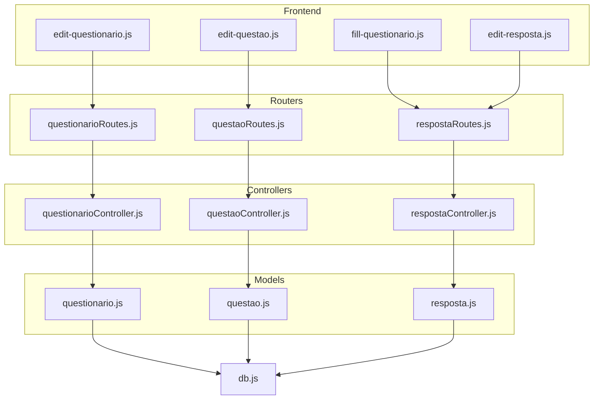
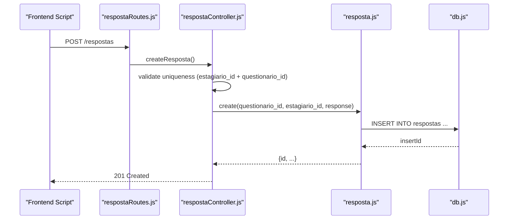
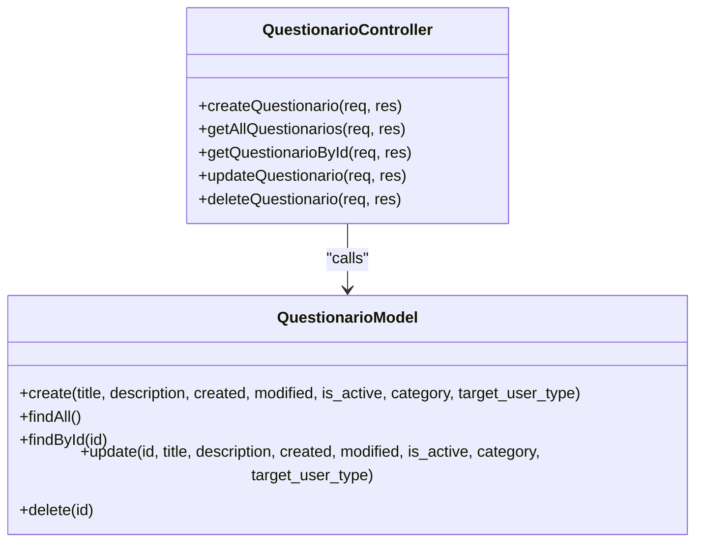
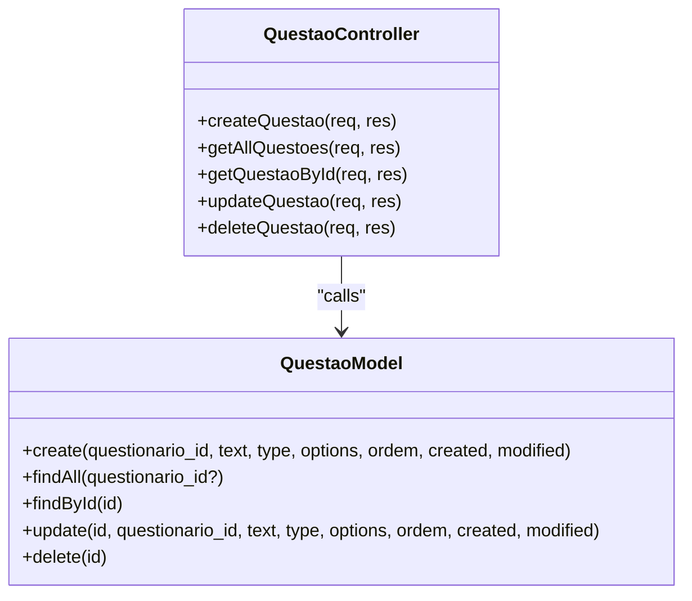
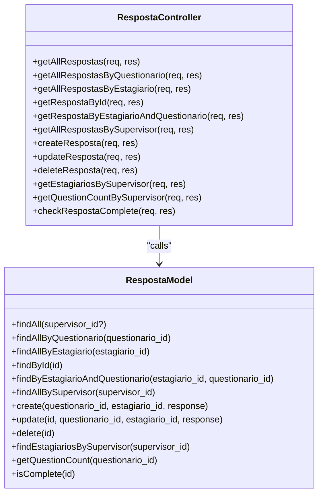
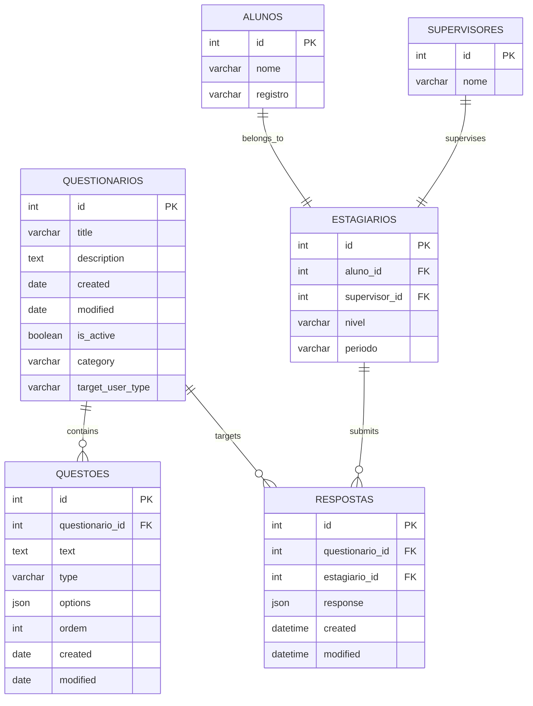
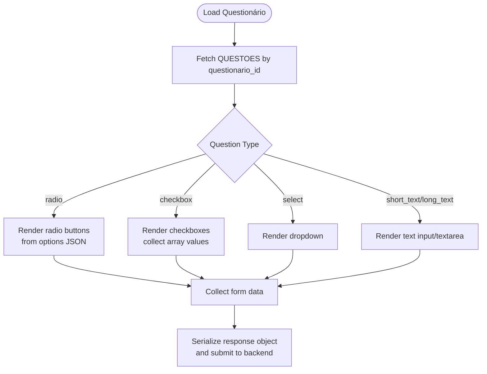
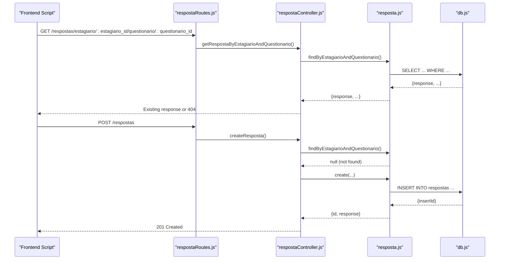
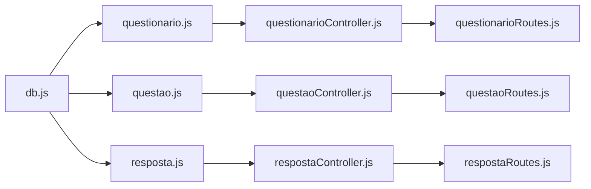

# Questionnaire & Assessment Models

<cite>
**Referenced Files in This Document**
- [questionario.js](file://src/models/questionario.js)
- [questao.js](file://src/models/questao.js)
- [resposta.js](file://src/models/resposta.js)
- [questionarioController.js](file://src/controllers/questionarioController.js)
- [questaoController.js](file://src/controllers/questaoController.js)
- [respostaController.js](file://src/controllers/respostaController.js)
- [questionarioRoutes.js](file://src/routers/questionarioRoutes.js)
- [questaoRoutes.js](file://src/routers/questaoRoutes.js)
- [respostaRoutes.js](file://src/routers/respostaRoutes.js)
- [db.js](file://src/database/db.js)
- [fill-questionario.js](file://public/fill-questionario.js)
- [edit-resposta.js](file://public/edit-resposta.js)
- [edit-questionario.js](file://public/edit-questionario.js)
- [edit-questao.js](file://public/edit-questao.js)
</cite>

## Table of Contents
1. [Introduction](#introduction)
2. [Project Structure](#project-structure)
3. [Core Components](#core-components)
4. [Architecture Overview](#architecture-overview)
5. [Detailed Component Analysis](#detailed-component-analysis)
6. [Dependency Analysis](#dependency-analysis)
7. [Performance Considerations](#performance-considerations)
8. [Troubleshooting Guide](#troubleshooting-guide)
9. [Conclusion](#conclusion)
10. [Appendices](#appendices)

## Introduction
This document describes the data model for NodeMural's questionnaire and assessment system. It focuses on three core entities:
- Questionario (questionnaire): Defines assessment templates with metadata and lifecycle flags.
- Questao (question): Represents individual items within a questionnaire, including type, ordering, and options.
- Resposta (response): Stores student answers to a specific questionnaire, with validation and completeness checks.

It documents field definitions, data types, validation rules, relationships, question types, response formats, completeness logic, and lifecycle management. It also outlines scoring and reporting considerations and provides diagrams for ER structure and typical workflows.

## Project Structure
The system follows a layered architecture:
- Models encapsulate database interactions for Questionario, Questao, and Resposta.
- Controllers expose REST endpoints for CRUD operations.
- Routers define endpoint paths and HTTP verbs.
- Frontend scripts integrate with the backend to present forms and collect responses.

**Diagram sources**
- [questionario.js](file://src/models/questionario.js#L1-L38)
- [questao.js](file://src/models/questao.js#L1-L53)
- [resposta.js](file://src/models/resposta.js#L1-L183)
- [questionarioController.js](file://src/controllers/questionarioController.js#L1-L72)
- [questaoController.js](file://src/controllers/questaoController.js#L1-L72)
- [respostaController.js](file://src/controllers/respostaController.js#L1-L169)
- [questionarioRoutes.js](file://src/routers/questionarioRoutes.js#L1-L16)
- [questaoRoutes.js](file://src/routers/questaoRoutes.js#L1-L17)
- [respostaRoutes.js](file://src/routers/respostaRoutes.js#L1-L49)
- [db.js](file://src/database/db.js#L1-L15)
- [fill-questionario.js](file://public/fill-questionario.js#L1-L290)
- [edit-resposta.js](file://public/edit-resposta.js#L1-L282)
- [edit-questionario.js](file://public/edit-questionario.js#L1-L61)
- [edit-questao.js](file://public/edit-questao.js#L1-L174)

**Section sources**
- [questionario.js](file://src/models/questionario.js#L1-L38)
- [questao.js](file://src/models/questao.js#L1-L53)
- [resposta.js](file://src/models/resposta.js#L1-L183)
- [questionarioController.js](file://src/controllers/questionarioController.js#L1-L72)
- [questaoController.js](file://src/controllers/questaoController.js#L1-L72)
- [respostaController.js](file://src/controllers/respostaController.js#L1-L169)
- [questionarioRoutes.js](file://src/routers/questionarioRoutes.js#L1-L16)
- [questaoRoutes.js](file://src/routers/questaoRoutes.js#L1-L17)
- [respostaRoutes.js](file://src/routers/respostaRoutes.js#L1-L49)
- [db.js](file://src/database/db.js#L1-L15)

## Core Components
This section defines the data model for each entity, including fields, types, and constraints inferred from the codebase.

- Questionario
  - Fields: id (auto-increment), title (string), description (string), created (date), modified (date), is_active (boolean flag), category (string), target_user_type (string).
  - Validation rules: Enforced by application logic and UI forms; active status is managed via is_active flag.
  - Business constraints: Supports soft lifecycle via is_active; category and target_user_type enable filtering and targeting.

- Questao
  - Fields: id (auto-increment), questionario_id (foreign key), text (string), type (string), options (JSON), ordem (integer), created (date), modified (date).
  - Validation rules: Type determines rendering and required options; ordering controls display sequence.
  - Business constraints: Must belong to a valid Questionario; type supports radio, checkbox, select, short_text, long_text; options serialized as JSON.

- Resposta
  - Fields: id (auto-increment), questionario_id (foreign key), estagiario_id (foreign key), response (JSON object), created (timestamp), modified (timestamp).
  - Validation rules: Response payload must be a JSON-serializable object; uniqueness enforced per estagiario_id + questionario_id pair.
  - Business constraints: Completeness validated by comparing number of answered keys to total questions in the questionnaire.

**Section sources**
- [questionario.js](file://src/models/questionario.js#L4-L35)
- [questao.js](file://src/models/questao.js#L4-L49)
- [resposta.js](file://src/models/resposta.js#L5-L180)

## Architecture Overview
The system uses a classic MVC-like structure with explicit separation of concerns:
- Routers define endpoints.
- Controllers orchestrate requests and delegate to models.
- Models encapsulate SQL queries and data transformations.
- Frontend scripts call REST endpoints to manage questionnaires, questions, and responses.

**Diagram sources**
- [respostaRoutes.js](file://src/routers/respostaRoutes.js#L1-L49)
- [respostaController.js](file://src/controllers/respostaController.js#L82-L100)
- [resposta.js](file://src/models/resposta.js#L115-L123)
- [db.js](file://src/database/db.js#L1-L15)

## Detailed Component Analysis

### Questionario Model and Controller
- Responsibilities:
  - Create, read, update, delete questionários.
  - Manage lifecycle via is_active flag and timestamps.
- Data types and constraints:
  - title, description, category, target_user_type are strings; is_active is boolean; created/modified are dates/timestamps.
- Validation:
  - UI enforces required fields; backend returns errors on malformed requests.

**Diagram sources**
- [questionario.js](file://src/models/questionario.js#L4-L35)
- [questionarioController.js](file://src/controllers/questionarioController.js#L4-L72)

**Section sources**
- [questionario.js](file://src/models/questionario.js#L4-L35)
- [questionarioController.js](file://src/controllers/questionarioController.js#L4-L72)
- [questionarioRoutes.js](file://src/routers/questionarioRoutes.js#L7-L14)
- [edit-questionario.js](file://public/edit-questionario.js#L13-L58)

### Questao Model and Controller
- Responsibilities:
  - Manage questions within a questionnaire.
  - Support dynamic options for multiple-choice types.
- Data types and constraints:
  - type supports radio, checkbox, select, short_text, long_text.
  - options stored as JSON; ordem controls order.
- Validation:
  - UI validates presence of required fields and formats options for supported types.

**Diagram sources**
- [questao.js](file://src/models/questao.js#L4-L49)
- [questaoController.js](file://src/controllers/questaoController.js#L4-L72)

**Section sources**
- [questao.js](file://src/models/questao.js#L4-L49)
- [questaoController.js](file://src/controllers/questaoController.js#L4-L72)
- [questaoRoutes.js](file://src/routers/questaoRoutes.js#L7-L16)
- [edit-questao.js](file://public/edit-questao.js#L23-L82)

### Resposta Model and Controller
- Responsibilities:
  - Store student responses as a JSON object keyed by question identifiers.
  - Enforce uniqueness per estagiario_id + questionario_id.
  - Validate completeness by comparing answered keys to total questions.
- Data types and constraints:
  - response is a JSON object; created/modified timestamps updated on create/update.
- Validation:
  - Uniqueness check prevents duplicate submissions.
  - Completeness check compares response keys to question count.

**Diagram sources**
- [resposta.js](file://src/models/resposta.js#L5-L180)
- [respostaController.js](file://src/controllers/respostaController.js#L4-L169)

**Section sources**
- [resposta.js](file://src/models/resposta.js#L5-L180)
- [respostaController.js](file://src/controllers/respostaController.js#L4-L169)
- [respostaRoutes.js](file://src/routers/respostaRoutes.js#L18-L46)
- [fill-questionario.js](file://public/fill-questionario.js#L47-L63)
- [edit-resposta.js](file://public/edit-resposta.js#L47-L63)

### Entity Relationship Diagram
The following ER diagram reflects the relationships among Questionario, Questao, and Resposta, along with auxiliary entities referenced by Resposta (estagiarios, alunos, supervisores).

**Diagram sources**
- [questionario.js](file://src/models/questionario.js#L4-L35)
- [questao.js](file://src/models/questao.js#L4-L49)
- [resposta.js](file://src/models/resposta.js#L5-L180)

### Question Types and Rendering
Supported question types and their rendering behavior:
- radio: Single selection from options; options parsed from JSON.
- checkbox: Multiple selections; values collected as an array and stored as JSON string.
- select: Dropdown selection; single value.
- short_text/short text: Single-line text input.
- long_text/long text: Multi-line text area.

Rendering logic is handled by frontend scripts that:
- Load questionario and estagiario metadata.
- Fetch questions filtered by questionario_id.
- Render appropriate input widgets based on type.
- Serialize responses into a JSON object keyed by question identifiers.

**Diagram sources**
- [fill-questionario.js](file://public/fill-questionario.js#L65-L127)
- [edit-resposta.js](file://public/edit-resposta.js#L65-L130)

**Section sources**
- [fill-questionario.js](file://public/fill-questionario.js#L89-L116)
- [edit-resposta.js](file://public/edit-resposta.js#L96-L116)

### Response Collection Patterns and Completeness
Response collection follows a consistent pattern:
- Unique submission per estagiario_id + questionario_id enforced by backend.
- Responses are stored as a JSON object where keys correspond to question identifiers derived from question order or id.
- Completeness check compares the number of answered keys against the total number of questions in the questionnaire.

**Diagram sources**
- [respostaRoutes.js](file://src/routers/respostaRoutes.js#L23-L24)
- [respostaController.js](file://src/controllers/respostaController.js#L55-L100)
- [resposta.js](file://src/models/resposta.js#L82-L123)
- [db.js](file://src/database/db.js#L1-L15)

**Section sources**
- [respostaController.js](file://src/controllers/respostaController.js#L82-L100)
- [resposta.js](file://src/models/resposta.js#L82-L123)
- [resposta.js](file://src/models/resposta.js#L167-L179)

### Scoring Mechanisms and Evaluation Criteria
- Current implementation stores raw responses as JSON but does not compute scores or grades.
- Scoring and evaluation logic would require:
  - Mapping question types to scoring rules.
  - Defining point values or rubrics per question.
  - Aggregating scores per estagiario_id and generating reports.
- Recommendation: Extend the Resposta model and controller to include computed score fields and report endpoints.

[No sources needed since this section provides general guidance]

### Report Generation Capabilities
- The Resposta model exposes grouped views by supervisor, estagiario, and questionario.
- Reports can be generated by aggregating responses returned by these endpoints.
- Recommendation: Add endpoints to compute averages, completion rates, and distribution metrics.

**Section sources**
- [resposta.js](file://src/models/resposta.js#L7-L28)
- [resposta.js](file://src/models/resposta.js#L30-L62)
- [resposta.js](file://src/models/resposta.js#L98-L113)

## Dependency Analysis
- Models depend on the shared database pool.
- Controllers depend on models.
- Routers depend on controllers.
- Frontend scripts depend on router endpoints.

**Diagram sources**
- [db.js](file://src/database/db.js#L1-L15)
- [questionario.js](file://src/models/questionario.js#L1-L38)
- [questao.js](file://src/models/questao.js#L1-L53)
- [resposta.js](file://src/models/resposta.js#L1-L183)
- [questionarioController.js](file://src/controllers/questionarioController.js#L1-L72)
- [questaoController.js](file://src/controllers/questaoController.js#L1-L72)
- [respostaController.js](file://src/controllers/respostaController.js#L1-L169)
- [questionarioRoutes.js](file://src/routers/questionarioRoutes.js#L1-L16)
- [questaoRoutes.js](file://src/routers/questaoRoutes.js#L1-L17)
- [respostaRoutes.js](file://src/routers/respostaRoutes.js#L1-L49)

**Section sources**
- [db.js](file://src/database/db.js#L1-L15)
- [questionario.js](file://src/models/questionario.js#L1-L38)
- [questao.js](file://src/models/questao.js#L1-L53)
- [resposta.js](file://src/models/resposta.js#L1-L183)
- [questionarioController.js](file://src/controllers/questionarioController.js#L1-L72)
- [questaoController.js](file://src/controllers/questaoController.js#L1-L72)
- [respostaController.js](file://src/controllers/respostaController.js#L1-L169)
- [questionarioRoutes.js](file://src/routers/questionarioRoutes.js#L1-L16)
- [questaoRoutes.js](file://src/routers/questaoRoutes.js#L1-L17)
- [respostaRoutes.js](file://src/routers/respostaRoutes.js#L1-L49)

## Performance Considerations
- Indexing: Ensure indexes on foreign keys (questionario_id, estagiario_id) and frequently queried columns (is_active, category).
- Pagination: For large datasets, implement pagination in list endpoints.
- Caching: Cache static question options and metadata where feasible.
- Connection pooling: Tune pool limits according to workload.

[No sources needed since this section provides general guidance]

## Troubleshooting Guide
Common issues and resolutions:
- Duplicate response submission:
  - Symptom: Backend returns conflict when creating a response for an existing estagiario_id + questionario_id pair.
  - Resolution: Check existing response before creation; update if needed.
  - Evidence: Uniqueness enforcement in controller and model.

- Missing or invalid parameters:
  - Symptom: 404 Not Found when retrieving entities by ID.
  - Resolution: Verify URL parameters and existence of related records.

- Incomplete response:
  - Symptom: Completeness check fails.
  - Resolution: Ensure all questions are answered; completeness logic counts response keys vs. question count.

**Section sources**
- [respostaController.js](file://src/controllers/respostaController.js#L87-L91)
- [resposta.js](file://src/models/resposta.js#L167-L179)
- [questionarioController.js](file://src/controllers/questionarioController.js#L33-L35)
- [questaoController.js](file://src/controllers/questaoController.js#L33-L35)

## Conclusion
The questionnaire and assessment system provides a clear, extensible foundation for managing questionnaires, questions, and student responses. The current implementation focuses on robust data storage, validation, and completeness checks. Future enhancements should include built-in scoring, grade computation, and comprehensive reporting endpoints to support evaluation workflows.

## Appendices

### API Definitions
- Questionario endpoints
  - POST /questionarios
  - GET /questionarios
  - GET /questionarios/:id
  - PUT /questionarios/:id
  - DELETE /questionarios/:id

- Questao endpoints
  - POST /questoes
  - GET /questoes
  - GET /questoes/:id
  - PUT /questoes/:id
  - DELETE /questoes/:id

- Resposta endpoints
  - GET /respostas
  - GET /respostas/:id
  - GET /respostas/estagiario/:estagiario_id/questionario/:questionario_id
  - GET /respostas/questionario/:questionario_id
  - GET /respostas/supervisor/:supervisor_id
  - GET /respostas/supervisor/:supervisor_id/estagiarios
  - GET /respostas/supervisor/:supervisor_id/question-count
  - GET /respostas/:id/complete
  - POST /respostas
  - PUT /respostas/:id
  - DELETE /respostas/:id

**Section sources**
- [questionarioRoutes.js](file://src/routers/questionarioRoutes.js#L10-L14)
- [questaoRoutes.js](file://src/routers/questaoRoutes.js#L10-L15)
- [respostaRoutes.js](file://src/routers/respostaRoutes.js#L18-L46)