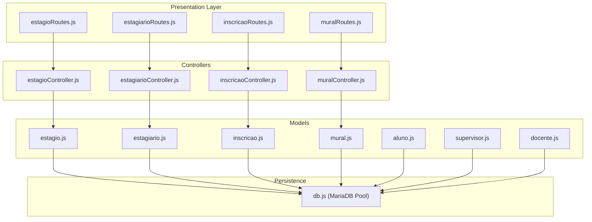
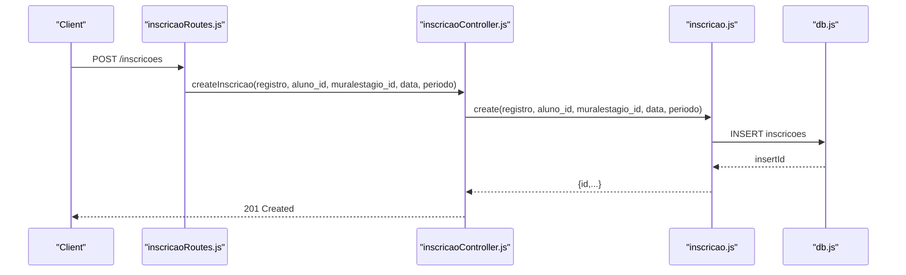
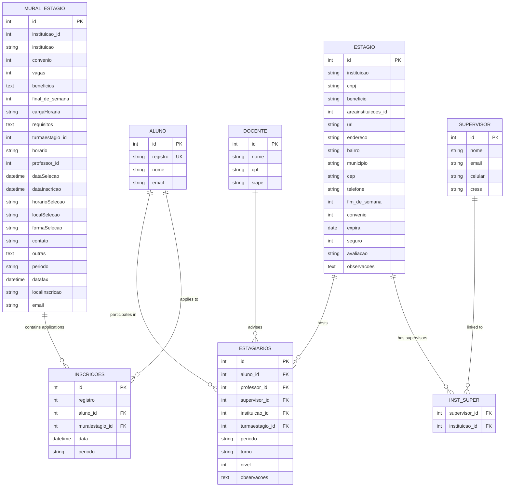
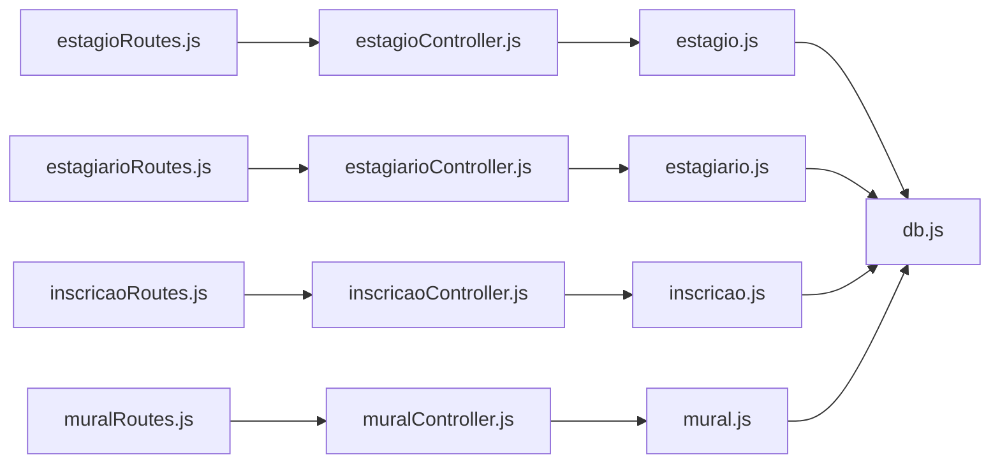

# Student & Internship Models

<cite>
**Referenced Files in This Document**
- [estagio.js](file://src/models/estagio.js)
- [estagiario.js](file://src/models/estagiario.js)
- [inscricao.js](file://src/models/inscricao.js)
- [mural.js](file://src/models/mural.js)
- [aluno.js](file://src/models/aluno.js)
- [supervisor.js](file://src/models/supervisor.js)
- [docente.js](file://src/models/docente.js)
- [estagioController.js](file://src/controllers/estagioController.js)
- [estagiarioController.js](file://src/controllers/estagiarioController.js)
- [inscricaoController.js](file://src/controllers/inscricaoController.js)
- [muralController.js](file://src/controllers/muralController.js)
- [estagioRoutes.js](file://src/routers/estagioRoutes.js)
- [estagiarioRoutes.js](file://src/routers/estagiarioRoutes.js)
- [inscricaoRoutes.js](file://src/routers/inscricaoRoutes.js)
- [muralRoutes.js](file://src/routers/muralRoutes.js)
- [db.js](file://src/database/db.js)
</cite>

## Table of Contents
1. [Introduction](#introduction)
2. [Project Structure](#project-structure)
3. [Core Components](#core-components)
4. [Architecture Overview](#architecture-overview)
5. [Detailed Component Analysis](#detailed-component-analysis)
6. [Dependency Analysis](#dependency-analysis)
7. [Performance Considerations](#performance-considerations)
8. [Troubleshooting Guide](#troubleshooting-guide)
9. [Conclusion](#conclusion)

## Introduction
This document describes the data models and workflows for NodeMural’s student and internship management domain. It focuses on four primary entities:
- estagio: an internship opportunity offered by an institution
- estagiario: a student’s participation record in an internship
- inscricao: a student’s application to a public listing (mural)
- mural: a public listing of internship opportunities

It documents field definitions, data types, validation rules, business constraints, and the relationships among students, internships, applications, and listings. It also explains application lifecycle, approval processes, status management, academic requirements, capacity management, and access restrictions for different user roles.

## Project Structure
The system follows a layered architecture:
- Models encapsulate database interactions and business queries
- Controllers expose REST endpoints and handle request/response
- Routers define endpoint routes and apply middleware (authentication and role checks)
- Database pool manages connections to MariaDB

**Diagram sources**
- [estagioRoutes.js](file://src/routers/estagioRoutes.js#L1-L20)
- [estagiarioRoutes.js](file://src/routers/estagiarioRoutes.js#L1-L21)
- [inscricaoRoutes.js](file://src/routers/inscricaoRoutes.js#L1-L21)
- [muralRoutes.js](file://src/routers/muralRoutes.js#L1-L23)
- [estagioController.js](file://src/controllers/estagioController.js#L1-L98)
- [estagiarioController.js](file://src/controllers/estagiarioController.js#L1-L133)
- [inscricaoController.js](file://src/controllers/inscricaoController.js#L1-L114)
- [muralController.js](file://src/controllers/muralController.js#L1-L101)
- [estagio.js](file://src/models/estagio.js#L1-L66)
- [estagiario.js](file://src/models/estagiario.js#L1-L187)
- [inscricao.js](file://src/models/inscricao.js#L1-L104)
- [mural.js](file://src/models/mural.js#L1-L91)
- [aluno.js](file://src/models/aluno.js#L1-L146)
- [supervisor.js](file://src/models/supervisor.js#L1-L77)
- [docente.js](file://src/models/docente.js#L1-L72)
- [db.js](file://src/database/db.js#L1-L15)

**Section sources**
- [estagioRoutes.js](file://src/routers/estagioRoutes.js#L1-L20)
- [estagiarioRoutes.js](file://src/routers/estagiarioRoutes.js#L1-L21)
- [inscricaoRoutes.js](file://src/routers/inscricaoRoutes.js#L1-L21)
- [muralRoutes.js](file://src/routers/muralRoutes.js#L1-L23)
- [db.js](file://src/database/db.js#L1-L15)

## Core Components
This section defines the four core entities and their responsibilities.

- estagio (internship opportunity)
  - Purpose: Stores institution-level internship offerings and related metadata
  - Key responsibilities: CRUD operations, supervisor lookup, listing retrieval by institution
  - Representative fields: institution name, CNPJ, benefits, area, URL, address, phone, weekend policy, agreement, expiration, insurance, evaluation, observations
  - Business constraints: Supports linking supervisors via junction table and retrieving listings per institution

- estagiario (internship participant)
  - Purpose: Tracks a student’s participation in internships across periods and levels
  - Key responsibilities: CRUD operations, period filtering, lookup by student, supervisor, or professor, compute next level
  - Representative fields: student, professor, supervisor, institution, class group, period, shift, level, observations
  - Business constraints: Next level computation considers adjustment factor and caps at predefined limits

- inscricao (application)
  - Purpose: Records student applications to public listings (mural)
  - Key responsibilities: CRUD operations, duplicate prevention per period and listing, lookup by student and listing
  - Representative fields: registration number, student, listing, date, period
  - Business constraints: Enforces uniqueness of student-application-per-period-and-listing

- mural (public listing)
  - Purpose: Publicly visible listing of internship opportunities
  - Key responsibilities: CRUD operations, period filtering, lookup by institution, nested listing of applications
  - Representative fields: institution, agreement, vacancies, benefits, weekend availability, workload, requirements, class group, schedule, professor, selection dates, application dates, selection venue, selection method, contact, other notes, period, deadline, application venue, email
  - Business constraints: Capacity management via vacancies; access restricted to admin for create/update/delete

**Section sources**
- [estagio.js](file://src/models/estagio.js#L1-L66)
- [estagiario.js](file://src/models/estagiario.js#L1-L187)
- [inscricao.js](file://src/models/inscricao.js#L1-L104)
- [mural.js](file://src/models/mural.js#L1-L91)

## Architecture Overview
The system exposes REST endpoints grouped by entity. Authentication and role checks are applied at the router layer. Controllers delegate to models, which execute SQL against the MariaDB pool.

**Diagram sources**
- [inscricaoRoutes.js](file://src/routers/inscricaoRoutes.js#L1-L21)
- [inscricaoController.js](file://src/controllers/inscricaoController.js#L1-L114)
- [inscricao.js](file://src/models/inscricao.js#L1-L104)
- [db.js](file://src/database/db.js#L1-L15)

## Detailed Component Analysis

### estagio (Internship Opportunity)
- Responsibilities
  - Retrieve all institutions and by ID
  - Create, update, delete institutions
  - Fetch supervisors linked to an institution via junction table
  - Fetch listings associated with an institution

- Data fields and types
  - institution name (string)
  - CNPJ (string)
  - benefits (string)
  - area reference (integer)
  - URL (string)
  - address fields (street, neighborhood, city, postal code)
  - phone (string)
  - weekend policy (boolean-like)
  - agreement flag (boolean-like)
  - expiration date (date)
  - insurance flag (boolean-like)
  - evaluation (string)
  - observations (text)

- Validation and constraints
  - No explicit model-level validations in the provided code
  - Supervisor association enforced via junction table query
  - Listing retrieval filters by institution and sorts by period

- Access control
  - No explicit role guards in controller; routes are defined in router but controller does not enforce roles

**Section sources**
- [estagio.js](file://src/models/estagio.js#L1-L66)
- [estagioController.js](file://src/controllers/estagioController.js#L1-L98)
- [estagioRoutes.js](file://src/routers/estagioRoutes.js#L1-L20)

### estagiario (Internship Participant)
- Responsibilities
  - List distinct periods
  - Retrieve all participants with joins to student, professor, supervisor, institution, and class group
  - CRUD operations
  - Lookup by student, supervisor, or professor
  - Compute next level based on adjustment factor and current level

- Data fields and types
  - student (integer)
  - professor (integer)
  - supervisor (integer)
  - institution (integer)
  - class group (integer)
  - period (string)
  - shift (string)
  - level (integer)
  - observations (text)

- Validation and constraints
  - Next level computed considering an adjustment factor and caps at 4 or 3 depending on adjustment
  - Maximum level capped at 9 when applicable

- Academic progression
  - The next level calculation ensures progression rules align with institutional policies

**Section sources**
- [estagiario.js](file://src/models/estagiario.js#L1-L187)
- [estagiarioController.js](file://src/controllers/estagiarioController.js#L1-L133)
- [estagiarioRoutes.js](file://src/routers/estagiarioRoutes.js#L1-L21)

### inscricao (Application)
- Responsibilities
  - List applications with optional period filter
  - Retrieve distinct periods
  - CRUD operations
  - Prevent duplicate registrations per student, listing, and period
  - Lookup by student and listing

- Data fields and types
  - registration number (integer)
  - student (integer)
  - listing (integer)
  - application date (date/time)
  - period (string)

- Validation and constraints
  - Uniqueness enforced at model level: student cannot reapply to the same listing in the same period
  - Update operation enforces uniqueness excluding the current record

- Access control
  - Routes require authentication and restrict create/read to admins and students
  - Update/delete requires admin role and ownership verification middleware

**Section sources**
- [inscricao.js](file://src/models/inscricao.js#L1-L104)
- [inscricaoController.js](file://src/controllers/inscricaoController.js#L1-L114)
- [inscricaoRoutes.js](file://src/routers/inscricaoRoutes.js#L1-L21)

### mural (Public Listing)
- Responsibilities
  - List listings with optional period filter
  - Retrieve distinct periods
  - CRUD operations
  - Lookup by institution and period
  - Nested listing of applications

- Data fields and types
  - institution reference (integer)
  - institution name (string)
  - agreement flag (boolean-like)
  - vacancies (integer)
  - benefits (text)
  - weekend availability (boolean-like)
  - workload (string)
  - requirements (text)
  - class group (integer)
  - schedule (string)
  - professor (integer)
  - selection date (date/time)
  - application date (date/time)
  - selection time (string)
  - selection venue (string)
  - selection method (string)
  - contact (string)
  - other notes (text)
  - period (string)
  - deadline (date/time)
  - application venue (string)
  - email (string)

- Validation and constraints
  - Capacity management via vacancies
  - Access restricted to admin for create/update/delete

- Access control
  - Routes require authentication; admin-only modifications

**Section sources**
- [mural.js](file://src/models/mural.js#L1-L91)
- [muralController.js](file://src/controllers/muralController.js#L1-L101)
- [muralRoutes.js](file://src/routers/muralRoutes.js#L1-L23)

### Entity Relationship Diagram
The following ER diagram maps the core entities and their relationships as implemented in the codebase.

**Diagram sources**
- [aluno.js](file://src/models/aluno.js#L1-L146)
- [docente.js](file://src/models/docente.js#L1-L72)
- [supervisor.js](file://src/models/supervisor.js#L1-L77)
- [estagio.js](file://src/models/estagio.js#L1-L66)
- [mural.js](file://src/models/mural.js#L1-L91)
- [inscricao.js](file://src/models/inscricao.js#L1-L104)
- [estagiario.js](file://src/models/estagiario.js#L1-L187)

### Application Lifecycle and Approval Processes
- Application lifecycle
  - Students submit applications to public listings during application periods
  - Duplicate submissions per listing and period are prevented
  - Listings maintain vacancy counts; applications do not automatically reduce vacancies in the provided code
  - Selection dates and methods are stored in listings; selection outcomes are not modeled as separate statuses in the provided code

- Approval and status management
  - No explicit application status field is present in the inscricao model
  - Selection outcome is not represented in the code; therefore, no automated status transitions occur
  - Administrative actions (create/update/delete) are restricted to admins

- Academic progression
  - estagiario tracks levels and computes the next level based on adjustment factors and caps

**Section sources**
- [inscricao.js](file://src/models/inscricao.js#L1-L104)
- [mural.js](file://src/models/mural.js#L1-L91)
- [estagiario.js](file://src/models/estagiario.js#L1-L187)

### Data Validation and Business Constraints
- Academic requirements
  - Requirements are stored as text in listings; no structured validation is performed in the provided code

- Internship duration constraints
  - No explicit duration fields are defined in the provided models; therefore, no duration validation occurs

- Capacity management
  - Vacancy count is maintained in listings; no automatic decrement upon application is implemented in the provided code

- Duplicate application prevention
  - Unique constraint enforced per student, listing, and period during creation and updates

- Student deletion safeguards
  - Deletion of students is blocked if they have associated estagiarios or inscricoes

**Section sources**
- [inscricao.js](file://src/models/inscricao.js#L1-L104)
- [aluno.js](file://src/models/aluno.js#L1-L146)
- [mural.js](file://src/models/mural.js#L1-L91)

### Public Visibility Controls and Access Restrictions
- Roles and permissions
  - Admin: full CRUD on listings; create/update/delete on listings; administrative oversight
  - Student: can view listings and apply; ownership-checked for read/update/delete of own applications
  - Others: restricted access based on role checks

- Implementation details
  - Router-level middleware enforces authentication and role checks for inscricao and mural endpoints
  - Ownership verification ensures students can only manage their own applications

**Section sources**
- [inscricaoRoutes.js](file://src/routers/inscricaoRoutes.js#L1-L21)
- [muralRoutes.js](file://src/routers/muralRoutes.js#L1-L23)

## Dependency Analysis
The following diagram shows dependencies among controllers, models, and routers.

**Diagram sources**
- [estagioRoutes.js](file://src/routers/estagioRoutes.js#L1-L20)
- [estagiarioRoutes.js](file://src/routers/estagiarioRoutes.js#L1-L21)
- [inscricaoRoutes.js](file://src/routers/inscricaoRoutes.js#L1-L21)
- [muralRoutes.js](file://src/routers/muralRoutes.js#L1-L23)
- [estagioController.js](file://src/controllers/estagioController.js#L1-L98)
- [estagiarioController.js](file://src/controllers/estagiarioController.js#L1-L133)
- [inscricaoController.js](file://src/controllers/inscricaoController.js#L1-L114)
- [muralController.js](file://src/controllers/muralController.js#L1-L101)
- [estagio.js](file://src/models/estagio.js#L1-L66)
- [estagiario.js](file://src/models/estagiario.js#L1-L187)
- [inscricao.js](file://src/models/inscricao.js#L1-L104)
- [mural.js](file://src/models/mural.js#L1-L91)
- [db.js](file://src/database/db.js#L1-L15)

**Section sources**
- [estagioRoutes.js](file://src/routers/estagioRoutes.js#L1-L20)
- [estagiarioRoutes.js](file://src/routers/estagiarioRoutes.js#L1-L21)
- [inscricaoRoutes.js](file://src/routers/inscricaoRoutes.js#L1-L21)
- [muralRoutes.js](file://src/routers/muralRoutes.js#L1-L23)

## Performance Considerations
- Indexing recommendations
  - Add indexes on frequently filtered fields: inscricoes.aluno_id, inscricoes.muralestagio_id, inscricoes.periodo
  - Add indexes on mural_estagio.instituicao_id, mural_estagio.periodo
  - Add indexes on estagio.areainstituicoes_id, estagio.id for supervisor and listing lookups
- Query optimization
  - Prefer selective queries with WHERE clauses and ORDER BY clauses aligned with indexes
  - Avoid unnecessary JOINs when only IDs are required
- Connection pooling
  - Use the existing MariaDB pool; tune pool limits according to deployment needs

## Troubleshooting Guide
- Duplicate application errors
  - Symptom: Error indicating student already registered for the listing in the given period
  - Cause: Model-level uniqueness check prevents duplicates
  - Resolution: Ensure the student selects a different listing or period

- Unauthorized access
  - Symptom: 401/403 when accessing endpoints
  - Cause: Missing or invalid token, insufficient role
  - Resolution: Authenticate with proper credentials and ensure role includes admin or aluno as required

- Not found records
  - Symptom: 404 when retrieving entities
  - Cause: ID does not exist
  - Resolution: Verify IDs and relationships

- Student deletion blocked
  - Symptom: Error stating student has estagiários or inscrições
  - Cause: Referential integrity safeguards
  - Resolution: Remove dependent estagiarios and inscricoes before deletion

**Section sources**
- [inscricaoController.js](file://src/controllers/inscricaoController.js#L1-L114)
- [aluno.js](file://src/models/aluno.js#L1-L146)
- [inscricaoRoutes.js](file://src/routers/inscricaoRoutes.js#L1-L21)

## Conclusion
NodeMural’s student and internship management models provide a solid foundation for managing institutions, listings, applications, and student participation. The code enforces key business rules such as duplicate application prevention, student deletion safeguards, and admin-only modifications for listings. While some areas—such as application status transitions, academic requirement validation, and automatic capacity updates—are not implemented in the provided code, the existing structure supports extending these capabilities with minimal architectural changes.