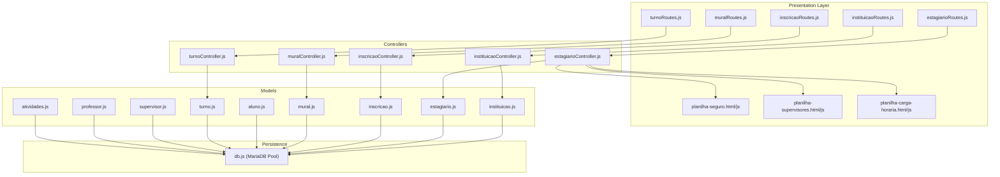
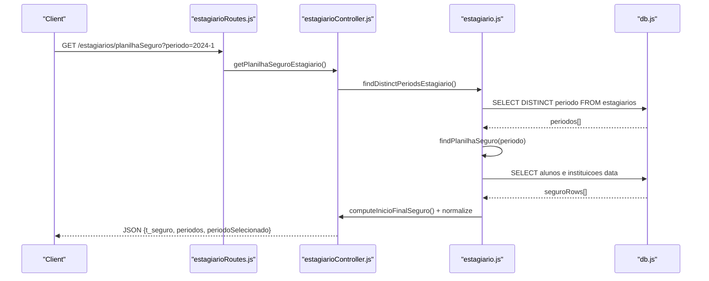
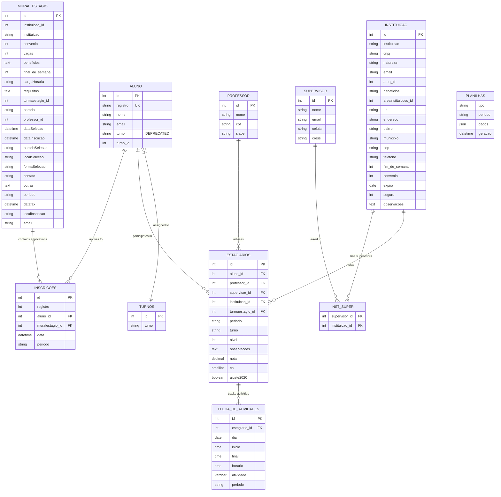
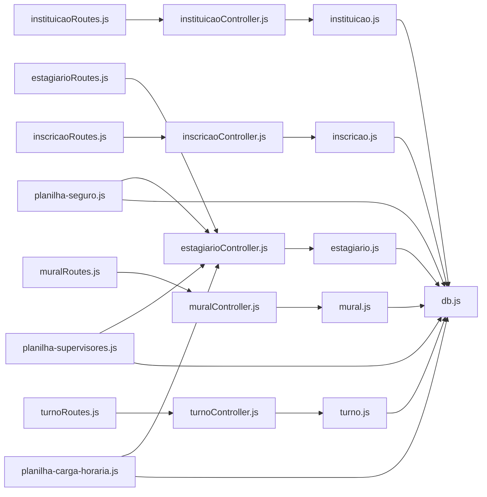

# Student & Internship Models

<cite>
**Referenced Files in This Document**
- [instituicao.js](file://src/models/instituicao.js)
- [estagiario.js](file://src/models/estagiario.js)
- [inscricao.js](file://src/models/inscricao.js)
- [mural.js](file://src/models/mural.js)
- [aluno.js](file://src/models/aluno.js)
- [turno.js](file://src/models/turno.js)
- [supervisor.js](file://src/models/supervisor.js)
- [professor.js](file://src/models/professor.js)
- [atividades.js](file://src/models/atividades.js)
- [alunoController.js](file://src/controllers/alunoController.js)
- [estagiarioController.js](file://src/controllers/estagiarioController.js)
- [inscricaoController.js](file://src/controllers/inscricaoController.js)
- [muralController.js](file://src/controllers/muralController.js)
- [turnoController.js](file://src/controllers/turnoController.js)
- [estagiarioRoutes.js](file://src/routers/estagiarioRoutes.js)
- [instituicaoRoutes.js](file://src/routers/instituicaoRoutes.js)
- [estagiarioRoutes.js](file://src/routers/estagiarioRoutes.js)
- [inscricaoRoutes.js](file://src/routers/inscricaoRoutes.js)
- [muralRoutes.js](file://src/routers/muralRoutes.js)
- [turnoRoutes.js](file://src/routers/turnoRoutes.js)
- [db.js](file://src/database/db.js)
- [setupFullDatabase.js](file://src/database/setupFullDatabase.js)
- [backfill_alunos_turno_id.py](file://scripts/backfill_alunos_turno_id.py)
- [planilha-seguro.js](file://public/planilha-seguro.js)
- [planilha-supervisores.js](file://public/planilha-supervisores.js)
- [planilha-carga-horaria.js](file://public/planilha-carga-horaria.js)
- [planilha-seguro.html](file://public/planilha-seguro.html)
- [planilha-supervisores.html](file://public/planilha-supervisores.html)
- [planilha-carga-horaria.html](file://public/planilha-carga-horaria.html)
</cite>

## Update Summary
**Changes Made**
- Enhanced estagiario model with new planilha data retrieval methods
- Added three specialized planilha endpoints: seguro, supervisores, and carga horária
- Implemented query optimization for planilha data through dedicated SQL methods
- Added comprehensive frontend interfaces for planilha data visualization
- Enhanced estagiario partial update capabilities for grade and workload management
- Improved query performance through optimized LEFT JOIN operations and aggregation logic

## Table of Contents
1. [Introduction](#introduction)
2. [Project Structure](#project-structure)
3. [Core Components](#core-components)
4. [Architecture Overview](#architecture-overview)
5. [Detailed Component Analysis](#detailed-component-analysis)
6. [Dependency Analysis](#dependency-analysis)
7. [Performance Considerations](#performance-considerations)
8. [Troubleshooting Guide](#troubleshooting-guide)
9. [Conclusion](#conclusion)

## Introduction
This document describes the data models and workflows for NodeMural's student and internship management domain. It focuses on five primary entities:
- instituicao: an institution offering internship opportunities
- estagiario: a student's participation record in internships with enhanced grade management, supervision tracking, and comprehensive planilha data retrieval
- inscricao: a student's application to a public listing (mural)
- mural: a public listing of internship opportunities
- turno: a shift management system for student enrollment and internship scheduling

**Updated** The system has been significantly enhanced with comprehensive planilha (spreadsheet) data retrieval capabilities. The estagiario model now includes three specialized methods for generating administrative reports: seguro (insurance coverage), supervisores (supervisor assignments), and carga horária (workload tracking). These enhancements provide administrators with powerful tools for managing internship programs while maintaining backward compatibility with existing functionality.

## Project Structure
The system follows a layered architecture with enhanced planilha management capabilities:
- Models encapsulate database interactions, business queries, and specialized planilha data retrieval
- Controllers expose REST endpoints for planilha generation and handle request/response
- Routers define endpoint routes with role-based access control (admin-only for planilha endpoints)
- Database pool manages connections to MariaDB with optimized query execution
- Frontend interfaces provide interactive dashboards for planilha data visualization

```mermaid
graph TB
subgraph "Presentation Layer"
R1["instituicaoRoutes.js"]
R2["estagiarioRoutes.js"]
R3["inscricaoRoutes.js"]
R4["muralRoutes.js"]
R5["turnoRoutes.js"]
P1["planilha-seguro.html/js"]
P2["planilha-supervisores.html/js"]
P3["planilha-carga-horaria.html/js"]
end
subgraph "Controllers"
C1["instituicaoController.js"]
C2["estagiarioController.js"]
C3["inscricaoController.js"]
C4["muralController.js"]
C5["turnoController.js"]
end
subgraph "Models"
M1["instituicao.js"]
M2["estagiario.js"]
M3["inscricao.js"]
M4["mural.js"]
MA["aluno.js"]
MT["turno.js"]
MS["supervisor.js"]
MP["professor.js"]
MAT["atividades.js"]
end
subgraph "Persistence"
DB["db.js (MariaDB Pool)"]
end
R1 --> C1 --> M1
R2 --> C2 --> M2
R3 --> C3 --> M3
R4 --> C4 --> M4
R5 --> C5 --> MT
C2 --> P1
C2 --> P2
C2 --> P3
M1 --> DB
M2 --> DB
M3 --> DB
M4 --> DB
MA --> DB
MT --> DB
MS --> DB
MP --> DB
MAT --> DB
```

**Diagram sources**
- [instituicaoRoutes.js:1-21](file://src/routers/instituicaoRoutes.js#L1-L21)
- [estagiarioRoutes.js:1-26](file://src/routers/estagiarioRoutes.js#L1-L26)
- [inscricaoRoutes.js:1-21](file://src/routers/inscricaoRoutes.js#L1-L21)
- [muralRoutes.js:1-23](file://src/routers/muralRoutes.js#L1-L23)
- [turnoRoutes.js:1-16](file://src/routers/turnoRoutes.js#L1-L16)
- [planilha-seguro.js:1-120](file://public/planilha-seguro.js#L1-L120)
- [planilha-supervisores.js:1-103](file://public/planilha-supervisores.js#L1-L103)
- [planilha-carga-horaria.js:1-85](file://public/planilha-carga-horaria.js#L1-L85)
- [instituicaoController.js:1-95](file://src/controllers/instituicaoController.js#L1-L95)
- [estagiarioController.js:1-337](file://src/controllers/estagiarioController.js#L1-L337)
- [inscricaoController.js:1-114](file://src/controllers/inscricaoController.js#L1-L114)
- [muralController.js:1-101](file://src/controllers/muralController.js#L1-L101)
- [turnoController.js:1-72](file://src/controllers/turnoController.js#L1-L72)
- [instituicao.js:1-66](file://src/models/instituicao.js#L1-L66)
- [estagiario.js:1-334](file://src/models/estagiario.js#L1-L334)
- [inscricao.js:1-104](file://src/models/inscricao.js#L1-L104)
- [mural.js:1-91](file://src/models/mural.js#L1-L91)
- [aluno.js:1-139](file://src/models/aluno.js#L1-L139)
- [turno.js:1-45](file://src/models/turno.js#L1-L45)
- [supervisor.js:1-103](file://src/models/supervisor.js#L1-L103)
- [professor.js:1-86](file://src/models/professor.js#L1-L86)
- [atividades.js:1-57](file://src/models/atividades.js#L1-L57)
- [db.js:1-15](file://src/database/db.js#L1-L15)

**Section sources**
- [instituicaoRoutes.js:1-21](file://src/routers/instituicaoRoutes.js#L1-L21)
- [estagiarioRoutes.js:1-26](file://src/routers/estagiarioRoutes.js#L1-L26)
- [inscricaoRoutes.js:1-21](file://src/routers/inscricaoRoutes.js#L1-L21)
- [muralRoutes.js:1-23](file://src/routers/muralRoutes.js#L1-L23)
- [turnoRoutes.js:1-16](file://src/routers/turnoRoutes.js#L1-L16)
- [db.js:1-15](file://src/database/db.js#L1-L15)

## Core Components
This section defines the five core entities and their responsibilities, with enhanced planilha integration.

- instituicao (institution)
  - Purpose: Stores institutional data for organizations offering internships
  - Key responsibilities: CRUD operations, supervisor lookup, listing retrieval by institution
  - Representative fields: institution name, CNPJ, natureza, email, benefits, area, URL, address, phone, weekend policy, agreement, expiration, insurance, observations
  - Business constraints: Supports linking supervisors via junction table and retrieving listings per institution

- estagiario (internship participant)
  - Purpose: Tracks a student's participation in internships across periods and levels with enhanced grade management, supervision tracking, and comprehensive planilha data retrieval
  - Key responsibilities: CRUD operations, period filtering, lookup by student, supervisor, or professor, compute next level, grade and workload management, activity tracking, shift-aware queries, specialized planilha data generation
  - Representative fields: student, professor, supervisor, institution, class group, period, shift, level, observations, grade (nota), workload hours (ch), adjustment factor (ajuste2020)
  - Business constraints: Next level computation considers adjustment factor and caps at predefined limits; supports partial updates for grade and workload; integrates with activity tracking system; shift information displayed via LEFT JOIN with turnos table; provides specialized planilha data through dedicated query methods

- inscricao (application)
  - Purpose: Records student applications to public listings (mural)
  - Key responsibilities: CRUD operations, duplicate prevention per period and listing, lookup by student and listing
  - Representative fields: registration number, student, listing, date, period
  - Business constraints: Enforces uniqueness of student-application-per-period-and-listing

- mural (public listing)
  - Purpose: Publicly visible listing of internship opportunities
  - Key responsibilities: CRUD operations, period filtering, lookup by institution, nested listing of applications
  - Representative fields: institution, agreement, vacancies, benefits, weekend availability, workload, requirements, class group, schedule, professor, selection dates, application dates, selection venue, selection method, contact, other notes, period, deadline, application venue, email
  - Business constraints: Capacity management via vacancies; access restricted to admin for create/update/delete

- turno (shift)
  - Purpose: Manages shift categories for student enrollment and internship scheduling
  - Key responsibilities: CRUD operations for shift definitions, admin-only access
  - Representative fields: shift identifier, shift name (diurno, noturno, ambos, integral)
  - Business constraints: Predefined shift options with unique identifiers; supports LEFT JOIN operations for backward compatibility

**Updated** The estagiario model now includes comprehensive planilha data retrieval capabilities through three specialized methods: findPlanilhaSeguro for insurance coverage reports, findPlanilhaSupervisores for supervisor assignment tracking, and findPlanilhaCargaHoraria for workload aggregation. These methods optimize query performance and provide structured data formats suitable for administrative reporting.

**Section sources**
- [instituicao.js:1-66](file://src/models/instituicao.js#L1-L66)
- [estagiario.js:1-334](file://src/models/estagiario.js#L1-L334)
- [inscricao.js:1-104](file://src/models/inscricao.js#L1-L104)
- [mural.js:1-91](file://src/models/mural.js#L1-L91)
- [turno.js:1-45](file://src/models/turno.js#L1-L45)

## Architecture Overview
The system exposes REST endpoints grouped by entity with enhanced planilha management. Authentication and role checks are applied at the router layer. Controllers delegate to models, which execute SQL against the MariaDB pool. Planilha endpoints are protected and provide specialized data formats for administrative reporting.

```mermaid
sequenceDiagram
participant Client as "Client"
participant Router as "estagiarioRoutes.js"
participant Ctrl as "estagiarioController.js"
participant Model as "estagiario.js"
participant DB as "db.js"
Client->>Router : GET /estagiarios/planilhaSeguro?periodo=2024-1
Router->>Ctrl : getPlanilhaSeguroEstagiario()
Ctrl->>Model : findDistinctPeriodsEstagiario()
Model->>DB : SELECT DISTINCT periodo FROM estagiarios
DB-->>Model : periodos[]
Model->>Model : findPlanilhaSeguro(periodo)
Model->>DB : SELECT alunos e instituicoes data
DB-->>Model : seguroRows[]
Model->>Ctrl : computeInicioFinalSeguro() + normalize
Ctrl-->>Client : JSON {t_seguro, periodos, periodoSelecionado}
```

**Diagram sources**
- [estagiarioRoutes.js:13-15](file://src/routers/estagiarioRoutes.js#L13-L15)
- [estagiarioController.js:67-104](file://src/controllers/estagiarioController.js#L67-L104)
- [estagiario.js:12-30](file://src/models/estagiario.js#L12-L30)
- [db.js:1-15](file://src/database/db.js#L1-L15)

## Detailed Component Analysis

### instituicao (Institution)
- Responsibilities
  - Retrieve all institutions and by ID
  - Create, update, delete institutions
  - Fetch supervisors linked to an institution via junction table
  - Fetch listings associated with an institution

- Data fields and types
  - institution name (string)
  - CNPJ (string)
  - natureza (string)
  - email (string)
  - benefits (string)
  - area reference (integer)
  - URL (string)
  - address fields (street, neighborhood, city, postal code)
  - phone (string)
  - weekend policy (boolean-like)
  - agreement flag (boolean-like)
  - expiration date (date)
  - insurance flag (boolean-like)
  - observations (text)

- Validation and constraints
  - No explicit model-level validations in the provided code
  - Supervisor association enforced via junction table query
  - Listing retrieval filters by institution and sorts by period

- Access control
  - No explicit role guards in controller; routes are defined in router but controller does not enforce roles

**Section sources**
- [instituicao.js:1-66](file://src/models/instituicao.js#L1-L66)
- [instituicaoController.js:1-95](file://src/controllers/instituicaoController.js#L1-L95)
- [instituicaoRoutes.js:1-21](file://src/routers/instituicaoRoutes.js#L1-L21)

### estagiario (Internship Participant)
- Responsibilities
  - List distinct periods
  - Retrieve all participants with joins to student, professor, supervisor, institution, and class group
  - CRUD operations
  - Lookup by student, supervisor, or professor
  - Compute next level based on adjustment factor and current level
  - Grade and workload management (enhanced)
  - Activity tracking integration (enhanced)
  - Shift-aware queries with LEFT JOIN compatibility
  - **NEW**: Specialized planilha data retrieval methods
  - **Enhanced**: Partial update capabilities for grade and workload only

- Data fields and types
  - student (integer)
  - professor (integer)
  - supervisor (integer)
  - institution (integer)
  - class group (integer)
  - period (string)
  - shift (string) - **Enhanced**: Now displays shift information via LEFT JOIN
  - level (integer)
  - observations (text)
  - grade (decimal) - **NEW**
  - workload hours (smallint) - **NEW**
  - adjustment factor (boolean) - **NEW**

- Validation and constraints
  - Next level computed considering an adjustment factor and caps at 4 or 3 depending on adjustment
  - Maximum level capped at 9 when applicable
  - Grade and workload fields support partial updates only
  - Academic progression rules integrate with grade-based workflows
  - **Enhanced**: Shift information displayed using COALESCE(t.turno, a.turno) for backward compatibility
  - **NEW**: Planilha data methods optimized for administrative reporting with LEFT JOIN operations

- Academic progression
  - The next level calculation ensures progression rules align with institutional policies
  - Adjustment factor (ajuste2020) influences maximum allowable level progression

**Updated** Enhanced estagiario model now provides comprehensive grade management capabilities with dedicated fields for academic performance tracking and integrated supervision monitoring. The model supports partial updates for grade and workload data, enabling granular control over student academic records. The LEFT JOIN operations ensure backward compatibility by displaying shift information even when turno_id is null. Additionally, three specialized planilha methods provide optimized data retrieval for administrative reporting.

**Section sources**
- [estagiario.js:1-334](file://src/models/estagiario.js#L1-L334)
- [estagiarioController.js:1-337](file://src/controllers/estagiarioController.js#L1-L337)
- [estagiarioRoutes.js:1-26](file://src/routers/estagiarioRoutes.js#L1-L26)

### inscricao (Application)
- Responsibilities
  - List applications with optional period filter
  - Retrieve distinct periods
  - CRUD operations
  - Prevent duplicate registrations per student, listing, and period
  - Lookup by student and listing

- Data fields and types
  - registration number (integer)
  - student (integer)
  - listing (integer)
  - application date (date/time)
  - period (string)

- Validation and constraints
  - Uniqueness enforced at model level: student cannot reapply to the same listing in the same period
  - Update operation enforces uniqueness excluding the current record

- Access control
  - Routes require authentication and restrict create/read to admins and students
  - Update/delete requires admin role and ownership verification middleware

**Section sources**
- [inscricao.js:1-104](file://src/models/inscricao.js#L1-L104)
- [inscricaoController.js:1-114](file://src/controllers/inscricaoController.js#L1-L114)
- [inscricaoRoutes.js:1-21](file://src/routers/inscricaoRoutes.js#L1-L21)

### mural (Public Listing)
- Responsibilities
  - List listings with optional period filter
  - Retrieve distinct periods
  - CRUD operations
  - Lookup by institution and period
  - Nested listing of applications

- Data fields and types
  - institution reference (integer)
  - institution name (string)
  - agreement flag (boolean-like)
  - vacancies (integer)
  - benefits (text)
  - weekend availability (boolean-like)
  - workload (string)
  - requirements (text)
  - class group (integer)
  - schedule (string)
  - professor (integer)
  - selection date (date/time)
  - application date (date/time)
  - selection time (string)
  - selection venue (string)
  - selection method (string)
  - contact (string)
  - other notes (text)
  - period (string)
  - deadline (date/time)
  - application venue (string)
  - email (string)

- Validation and constraints
  - Capacity management via vacancies
  - Access restricted to admin for create/update/delete

- Access control
  - Routes require authentication; admin-only modifications

**Section sources**
- [mural.js:1-91](file://src/models/mural.js#L1-L91)
- [muralController.js:1-101](file://src/controllers/muralController.js#L1-L101)
- [muralRoutes.js:1-23](file://src/routers/muralRoutes.js#L1-L23)

### turno (Shift Management)
- Responsibilities
  - Manage shift categories for student enrollment and internship scheduling
  - CRUD operations with admin-only access
  - Provide predefined shift options for system integration

- Data fields and types
  - shift identifier (integer)
  - shift name (string): diurno, noturno, ambos, integral

- Validation and constraints
  - Predefined shift options with unique identifiers
  - Admin-only access for create/update/delete operations
  - No duplicate shift names allowed

- Access control
  - GET operations accessible to authenticated users
  - POST, PUT, DELETE operations restricted to admin role

**New** The turno model provides comprehensive shift management capabilities with predefined shift categories. This system enables administrators to categorize students by shift (diurno, noturno, ambos, integral) and supports integration with existing student enrollment and internship scheduling workflows.

**Section sources**
- [turno.js:1-45](file://src/models/turno.js#L1-L45)
- [turnoController.js:1-72](file://src/controllers/turnoController.js#L1-L72)
- [turnoRoutes.js:1-16](file://src/routers/turnoRoutes.js#L1-L16)

### Planilha Data Retrieval Methods
**New** The estagiario model now includes three specialized planilha data retrieval methods designed for administrative reporting:

- findPlanilhaSeguro(periodo)
  - Purpose: Generate insurance coverage report for administrative purposes
  - Returns: Structured data including student personal information, academic level, period range, and institution details
  - Optimizations: Uses LEFT JOIN operations to ensure backward compatibility with deprecated turno column
  - Data processing: Computes start and end periods based on academic level and adjustment factor

- findPlanilhaSupervisores(periodo)
  - Purpose: Track supervisor assignments and institutional placements
  - Returns: Comprehensive supervisor and professor assignment data with institutional addresses
  - Optimizations: Aggregates supervisor, professor, and institutional information in single query

- findPlanilhaCargaHoraria()
  - Purpose: Aggregate workload data across all students and academic levels
  - Returns: Grouped data by student with level-specific period and workload information
  - Optimizations: Uses Map-based aggregation for efficient data processing and grouping

**Section sources**
- [estagiario.js:12-71](file://src/models/estagiario.js#L12-L71)
- [estagiarioController.js:67-195](file://src/controllers/estagiarioController.js#L67-L195)

### Entity Relationship Diagram
The following ER diagram maps the core entities and their relationships as implemented in the codebase, including the new planilha integration and turnos enhancement.

```mermaid
erDiagram
ALUNO {
int id PK
string registro UK
string nome
string email
string turno "DEPRECATED"
int turno_id
}
PROFESSOR {
int id PK
string nome
string cpf
string siape
}
SUPERVISOR {
int id PK
string nome
string email
string celular
string cress
}
INSTITUICAO {
int id PK
string instituicao
string cnpj
string natureza
string email
int area_id
string beneficios
int areainstituicoes_id
string url
string endereco
string bairro
string municipio
string cep
string telefone
int fim_de_semana
int convenio
date expira
int seguro
text observacoes
}
MURAL_ESTAGIO {
int id PK
int instituicao_id
string instituicao
int convenio
int vagas
text beneficios
int final_de_semana
string cargaHoraria
text requisitos
int turmaestagio_id
string horario
int professor_id
datetime dataSelecao
datetime dataInscricao
string horarioSelecao
string localSelecao
string formaSelecao
string contato
text outras
string periodo
datetime datafax
string localInscricao
string email
}
INSCRICOES {
int id PK
int registro
int aluno_id FK
int muralestagio_id FK
datetime data
string periodo
}
ESTAGIARIOS {
int id PK
int aluno_id FK
int professor_id FK
int supervisor_id FK
int instituicao_id FK
int turmaestagio_id FK
string periodo
string turno
int nivel
text observacoes
decimal nota
smallint ch
boolean ajuste2020
}
FOLHA_DE_ATIVIDADES {
int id PK
int estagiario_id FK
date dia
time inicio
time final
time horario
varchar atividade
string periodo
}
INST_SUPER {
int supervisor_id FK
int instituicao_id FK
}
TURNOS {
int id PK
string turno
}
PLANILHAS {
string tipo
string periodo
json dados
datetime geracao
}
ALUNO ||--o{ INSCRICOES : "applies to"
ALUNO ||--o{ ESTAGIARIOS : "participates in"
PROFESSOR ||--o{ ESTAGIARIOS : "advises"
SUPERVISOR ||--o{ INST_SUPER : "linked to"
INSTITUICAO ||--o{ INST_SUPER : "has supervisors"
INSTITUICAO ||--o{ ESTAGIARIOS : "hosts"
MURAL_ESTAGIO ||--o{ INSCRICOES : "contains applications"
ESTAGIARIOS ||--o{ FOLHA_DE_ATIVIDADES : "tracks activities"
ALUNO }|--|| TURNOS : "assigned to"
```

**Updated** Enhanced ER diagram now includes the new planilha data retrieval methods and their integration with the estagiarios table. The diagram shows how specialized query methods provide optimized data access for administrative reporting while maintaining backward compatibility with existing functionality.

**Diagram sources**
- [aluno.js:1-139](file://src/models/aluno.js#L1-L139)
- [professor.js:1-86](file://src/models/professor.js#L1-L86)
- [supervisor.js:1-103](file://src/models/supervisor.js#L1-L103)
- [instituicao.js:1-66](file://src/models/instituicao.js#L1-L66)
- [mural.js:1-91](file://src/models/mural.js#L1-L91)
- [inscricao.js:1-104](file://src/models/inscricao.js#L1-L104)
- [estagiario.js:1-334](file://src/models/estagiario.js#L1-L334)
- [atividades.js:1-57](file://src/models/atividades.js#L1-L57)
- [turno.js:1-45](file://src/models/turno.js#L1-L45)

### Application Lifecycle and Approval Processes
- Application lifecycle
  - Students submit applications to public listings during application periods
  - Duplicate submissions per listing and period are prevented
  - Listings maintain vacancy counts; applications do not automatically reduce vacancies in the provided code
  - Selection dates and methods are stored in listings; selection outcomes are not modeled as separate statuses in the provided code

- Approval and status management
  - No explicit application status field is present in the inscricao model
  - Selection outcome is not represented in the code; therefore, no automated status transitions occur
  - Administrative actions (create/update/delete) are restricted to admins

- Academic progression
  - estagiario tracks levels and computes the next level based on adjustment factors and caps
  - **NEW**: Grade and workload data support grade-based academic progression workflows
  - **Enhanced**: Shift information integration enables shift-based academic tracking and reporting
  - **NEW**: Planilha data methods provide administrative insights into academic progression patterns

**Updated** Enhanced academic progression now integrates with grade management capabilities, shift-based organization, and comprehensive administrative reporting through planilha data methods. The system supports shift-aware academic workflows and provides administrators with detailed insights into student progression patterns.

**Section sources**
- [inscricao.js:1-104](file://src/models/inscricao.js#L1-L104)
- [mural.js:1-91](file://src/models/mural.js#L1-L91)
- [estagiario.js:1-334](file://src/models/estagiario.js#L1-L334)

### Data Validation and Business Constraints
- Academic requirements
  - Requirements are stored as text in listings; no structured validation is performed in the provided code

- Internship duration constraints
  - No explicit duration fields are defined in the provided models; therefore, no duration validation occurs

- Capacity management
  - Vacancy count is maintained in listings; no automatic decrement upon application is implemented in the provided code

- Duplicate application prevention
  - Unique constraint enforced per student, listing, and period during creation and updates

- Student deletion safeguards
  - Deletion of students is blocked if they have associated estagiarios or inscricoes

- **NEW**: Grade and workload validation
  - Grade field accepts decimal values with precision up to 10,2
  - Workload hours field accepts small integer values
  - Partial updates restricted to grade and workload fields only

- **Enhanced**: Turno integration validation
  - Backward compatibility maintained through LEFT JOIN operations
  - Data migration script ensures smooth transition from deprecated turno column
  - COALESCE function handles null turno_id gracefully

- **NEW**: Planilha data validation
  - Period filtering ensures data consistency across planilha reports
  - Specialized query methods prevent N+1 query problems
  - Data normalization ensures consistent format across different report types

**Updated** Added comprehensive validation rules for the new grade management fields, enhanced turnos integration, and new planilha data retrieval methods. The system now supports backward compatibility through LEFT JOIN operations, automated data migration, and optimized query execution for administrative reporting.

**Section sources**
- [inscricao.js:1-104](file://src/models/inscricao.js#L1-L104)
- [aluno.js:1-139](file://src/models/aluno.js#L1-L139)
- [mural.js:1-91](file://src/models/mural.js#L1-L91)
- [estagiario.js:171-193](file://src/models/estagiario.js#L171-L193)
- [setupFullDatabase.js:148-168](file://src/database/setupFullDatabase.js#L148-L168)
- [backfill_alunos_turno_id.py:1-111](file://scripts/backfill_alunos_turno_id.py#L1-L111)

### Public Visibility Controls and Access Restrictions
- Roles and permissions
  - Admin: full CRUD on listings; create/update/delete on listings; administrative oversight; full access to turnos management; access to all planilha reports
  - Student: can view listings and apply; ownership-checked for read/update/delete of own applications
  - **NEW**: Students can now access their own estagiario records for grade and activity monitoring
  - **Enhanced**: Turnos management restricted to admin role for security and consistency
  - **NEW**: Planilha endpoints require admin role for security and sensitive data access
  - Others: restricted access based on role checks

- Implementation details
  - Router-level middleware enforces authentication and role checks for inscricao, mural, turno, and planilha endpoints
  - Ownership verification ensures students can only manage their own applications
  - **NEW**: Planilha endpoints include admin-only access restrictions
  - **Enhanced**: estagiario endpoints include role-based access for supervisors and professors
  - **NEW**: Planilha data methods are protected by role-based access control

**Updated** Enhanced access controls now include comprehensive supervision and professor access to estagiario records for academic oversight, grade management, and administrative reporting. Turnos management and planilha data access are restricted to admin role to maintain data integrity and protect sensitive academic information.

**Section sources**
- [estagiarioRoutes.js:13-15](file://src/routers/estagiarioRoutes.js#L13-L15)
- [inscricaoRoutes.js:1-21](file://src/routers/inscricaoRoutes.js#L1-L21)
- [muralRoutes.js:1-23](file://src/routers/muralRoutes.js#L1-L23)
- [estagiarioRoutes.js:1-26](file://src/routers/estagiarioRoutes.js#L1-L26)
- [turnoRoutes.js:1-16](file://src/routers/turnoRoutes.js#L1-L16)

### Turno Integration Features
- Backward Compatibility
  - Deprecated `turno` column preserved for legacy data
  - LEFT JOIN operations ensure shift information displays correctly
  - COALESCE function handles null turno_id gracefully

- Data Migration
  - Automated migration script converts textual shift values to numeric identifiers
  - Preserves existing data while enabling new functionality
  - Supports both diurno, noturno, ambos, and integral shift categories

- Shift-Based Organization
  - Enables shift-aware academic tracking and reporting
  - Supports shift-based scheduling and resource allocation
  - Facilitates more sophisticated internship program management

**New** Comprehensive turnos integration provides shift-based organization capabilities while maintaining full backward compatibility. The system supports automated data migration and enhanced query operations for seamless integration.

**Section sources**
- [aluno.js:57-84](file://src/models/aluno.js#L57-L84)
- [estagiario.js:12-45](file://src/models/estagiario.js#L12-L45)
- [backfill_alunos_turno_id.py:1-111](file://scripts/backfill_alunos_turno_id.py#L1-L111)

### Planilha Data Visualization Interfaces
**New** Three comprehensive frontend interfaces provide interactive dashboards for planilha data visualization:

- Planilha Seguro (seguro.html/js)
  - Displays insurance coverage reports with filtering by academic period
  - Shows student personal information, academic levels, and institutional affiliations
  - Provides period-based filtering for historical data analysis

- Planilha Supervisores (supervisores.html/js)
  - Tracks supervisor assignments and institutional placements
  - Displays comprehensive supervisor and professor assignment data
  - Includes institutional address information for administrative coordination

- Planilha Carga Horária (carga-horaria.html/js)
  - Aggregates workload data across all students and academic levels
  - Groups data by student with level-specific period and workload information
  - Provides total workload calculations and academic progression tracking

**Section sources**
- [planilha-seguro.html:1-57](file://public/planilha-seguro.html#L1-L57)
- [planilha-seguro.js:1-120](file://public/planilha-seguro.js#L1-L120)
- [planilha-supervisores.html:1-53](file://public/planilha-supervisores.html#L1-L53)
- [planilha-supervisores.js:1-103](file://public/planilha-supervisores.js#L1-L103)
- [planilha-carga-horaria.html:1-50](file://public/planilha-carga-horaria.html#L1-L50)
- [planilha-carga-horaria.js:1-85](file://public/planilha-carga-horaria.js#L1-L85)

## Dependency Analysis
The following diagram shows dependencies among controllers, models, routers, and the new planilha interfaces.

```mermaid
graph LR
R1["instituicaoRoutes.js"] --> C1["instituicaoController.js"]
R2["estagiarioRoutes.js"] --> C2["estagiarioController.js"]
R3["inscricaoRoutes.js"] --> C3["inscricaoController.js"]
R4["muralRoutes.js"] --> C4["muralController.js"]
R5["turnoRoutes.js"] --> C5["turnoController.js"]
P1["planilha-seguro.js"] --> C2
P2["planilha-supervisores.js"] --> C2
P3["planilha-carga-horaria.js"] --> C2
C1 --> M1["instituicao.js"]
C2 --> M2["estagiario.js"]
C3 --> M3["inscricao.js"]
C4 --> M4["mural.js"]
C5 --> MT["turno.js"]
M1 --> DB["db.js"]
M2 --> DB
M3 --> DB
M4 --> DB
MT --> DB
P1 --> DB
P2 --> DB
P3 --> DB
```

**Diagram sources**
- [instituicaoRoutes.js:1-21](file://src/routers/instituicaoRoutes.js#L1-L21)
- [estagiarioRoutes.js:1-26](file://src/routers/estagiarioRoutes.js#L1-L26)
- [inscricaoRoutes.js:1-21](file://src/routers/inscricaoRoutes.js#L1-L21)
- [muralRoutes.js:1-23](file://src/routers/muralRoutes.js#L1-L23)
- [turnoRoutes.js:1-16](file://src/routers/turnoRoutes.js#L1-L16)
- [planilha-seguro.js:1-120](file://public/planilha-seguro.js#L1-L120)
- [planilha-supervisores.js:1-103](file://public/planilha-supervisores.js#L1-L103)
- [planilha-carga-horaria.js:1-85](file://public/planilha-carga-horaria.js#L1-L85)
- [instituicaoController.js:1-95](file://src/controllers/instituicaoController.js#L1-L95)
- [estagiarioController.js:1-337](file://src/controllers/estagiarioController.js#L1-L337)
- [inscricaoController.js:1-114](file://src/controllers/inscricaoController.js#L1-L114)
- [muralController.js:1-101](file://src/controllers/muralController.js#L1-L101)
- [turnoController.js:1-72](file://src/controllers/turnoController.js#L1-L72)
- [instituicao.js:1-66](file://src/models/instituicao.js#L1-L66)
- [estagiario.js:1-334](file://src/models/estagiario.js#L1-L334)
- [inscricao.js:1-104](file://src/models/inscricao.js#L1-L104)
- [mural.js:1-91](file://src/models/mural.js#L1-L91)
- [turno.js:1-45](file://src/models/turno.js#L1-L45)
- [db.js:1-15](file://src/database/db.js#L1-L15)

**Section sources**
- [instituicaoRoutes.js:1-21](file://src/routers/instituicaoRoutes.js#L1-L21)
- [estagiarioRoutes.js:1-26](file://src/routers/estagiarioRoutes.js#L1-L26)
- [inscricaoRoutes.js:1-21](file://src/routers/inscricaoRoutes.js#L1-L21)
- [muralRoutes.js:1-23](file://src/routers/muralRoutes.js#L1-L23)
- [turnoRoutes.js:1-16](file://src/routers/turnoRoutes.js#L1-L16)

## Performance Considerations
- Indexing recommendations
  - Add indexes on frequently filtered fields: inscricoes.aluno_id, inscricoes.muralestagio_id, inscricoes.periodo
  - Add indexes on mural_estagio.instituicao_id, mural_estagio.periodo
  - Add indexes on instituicoes.area_id, instituicoes.id for supervisor and listing lookups
  - **NEW**: Add indexes on estagiarios.nota, estagiarios.ch, estagiarios.ajuste2020 for grade-based queries
  - **Enhanced**: Add indexes on alunos.turno_id, turnos.id for shift-based queries and JOIN operations
  - **NEW**: Add indexes on estagiarios.periodo for planilha data filtering and optimization
- Query optimization
  - Prefer selective queries with WHERE clauses and ORDER BY clauses aligned with indexes
  - Avoid unnecessary JOINs when only IDs are required
  - **NEW**: Optimize grade and workload queries with appropriate indexing strategies
  - **Enhanced**: Optimize LEFT JOIN operations for backward compatibility while maintaining performance
  - **NEW**: Specialized planilha queries use optimized JOIN patterns and aggregation functions
  - **NEW**: Period-based filtering optimizes planilha data retrieval performance
- Connection pooling
  - Use the existing MariaDB pool; tune pool limits according to deployment needs
- **Enhanced**: Turno query optimization
  - LEFT JOIN operations optimized for backward compatibility
  - COALESCE function performance considerations for shift display
  - Data migration script performance for large datasets
- **NEW**: Planilha query optimization
  - Dedicated query methods minimize N+1 query problems
  - Map-based aggregation reduces memory overhead for large datasets
  - Specialized JOIN patterns optimize administrative reporting queries

## Troubleshooting Guide
- Duplicate application errors
  - Symptom: Error indicating student already registered for the listing in the given period
  - Cause: Model-level uniqueness check prevents duplicates
  - Resolution: Ensure the student selects a different listing or period

- Unauthorized access
  - Symptom: 401/403 when accessing endpoints
  - Cause: Missing or invalid token, insufficient role
  - Resolution: Authenticate with proper credentials and ensure role includes admin or aluno as required

- Not found records
  - Symptom: 404 when retrieving entities
  - Cause: ID does not exist
  - Resolution: Verify IDs and relationships

- Student deletion blocked
  - Symptom: Error stating student has estagiários or inscrições
  - Cause: Referential integrity safeguards
  - Resolution: Remove dependent estagiarios and inscricoes before deletion

- **NEW**: Grade management issues
  - Symptom: Errors when updating grade or workload data
  - Cause: Partial update restrictions or invalid data types
  - Resolution: Ensure only grade and workload fields are provided in partial updates, and validate data types

- **Enhanced**: Turno integration issues
  - Symptom: Shift information not displaying correctly
  - Cause: Null turno_id values or deprecated turno column conflicts
  - Resolution: Run data migration script, verify LEFT JOIN operations, check COALESCE function usage
  - Symptom: Turno CRUD operations failing
  - Cause: Missing admin role or authentication issues
  - Resolution: Ensure admin authentication and verify role-based access controls

- **NEW**: Planilha data issues
  - Symptom: Empty planilha results or slow loading times
  - Cause: Missing period parameter or insufficient data
  - Resolution: Verify period filtering, check database connectivity, ensure sufficient planilha data exists
  - Symptom: Planilha endpoint access denied
  - Cause: Missing admin role or authentication issues
  - Resolution: Ensure admin authentication and verify role-based access controls
  - Symptom: Planilha data formatting errors
  - Cause: Missing or malformed data in database
  - Resolution: Verify data integrity in estagiarios table, check for NULL values in required fields

**Updated** Added troubleshooting guidance for the new grade management, supervision tracking, turnos integration, and comprehensive planilha data retrieval features. Enhanced guidance covers backward compatibility issues, data migration concerns, and administrative reporting access controls.

**Section sources**
- [inscricaoController.js:1-114](file://src/controllers/inscricaoController.js#L1-L114)
- [aluno.js:1-139](file://src/models/aluno.js#L1-L139)
- [inscricaoRoutes.js:1-21](file://src/routers/inscricaoRoutes.js#L1-L21)
- [estagiarioController.js:1-337](file://src/controllers/estagiarioController.js#L1-L337)
- [turnoController.js:1-72](file://src/controllers/turnoController.js#L1-L72)

## Conclusion
NodeMural's student and internship management models provide a solid foundation for managing institutions, listings, applications, and student participation. The code enforces key business rules such as duplicate application prevention, student deletion safeguards, and admin-only modifications for listings.

**Updated** The integration of comprehensive planilha data retrieval methods significantly enhances the platform's administrative capabilities. The three specialized methods (findPlanilhaSeguro, findPlanilhaSupervisores, findPlanilhaCargaHoraria) provide optimized data access for insurance coverage tracking, supervisor assignment monitoring, and workload aggregation. These enhancements maintain full backward compatibility while introducing powerful administrative reporting features.

The enhanced estagiario model significantly improves the system's academic supervision capabilities through comprehensive grade management integration, enhanced supervision tracking, expanded student internship data handling, and specialized planilha data retrieval methods. These improvements enable more sophisticated academic workflows, better performance monitoring, enhanced collaboration between students, supervisors, and professors, and comprehensive administrative reporting capabilities.

The addition of three interactive frontend interfaces (planilha-seguro, planilha-supervisores, planilha-carga-horaria) provides administrators with powerful tools for managing internship programs through intuitive dashboards and filtering capabilities. The role-based access control ensures that sensitive academic data is protected while providing appropriate access to authorized users.

The turnos system introduces comprehensive shift management capabilities with predefined shift categories (diurno, noturno, ambos, integral), supporting automated data migration and backward compatibility through COALESCE functions in LEFT JOIN operations. This enhancement enables shift-aware academic tracking, more sophisticated scheduling capabilities, and improved reporting functionality.

While some areas—such as application status transitions, academic requirement validation, and automatic capacity updates—are not implemented in the provided code, the existing structure supports extending these capabilities with minimal architectural changes. The enhanced model architecture provides a robust foundation for future academic management features while maintaining backward compatibility with existing functionality.

The comprehensive planilha data retrieval system, combined with the existing grade management, supervision tracking, and turnos integration, positions NodeMural as a complete platform for modern internship and academic management workflows, supporting both traditional institutional requirements and evolving educational needs through enhanced administrative reporting and data visualization capabilities.