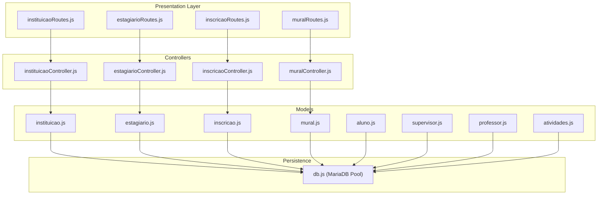
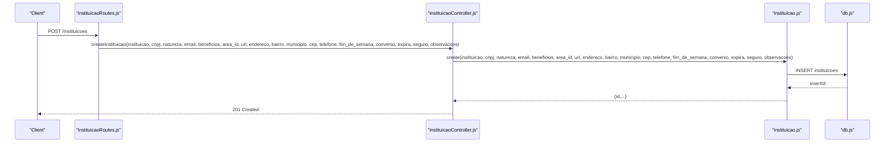
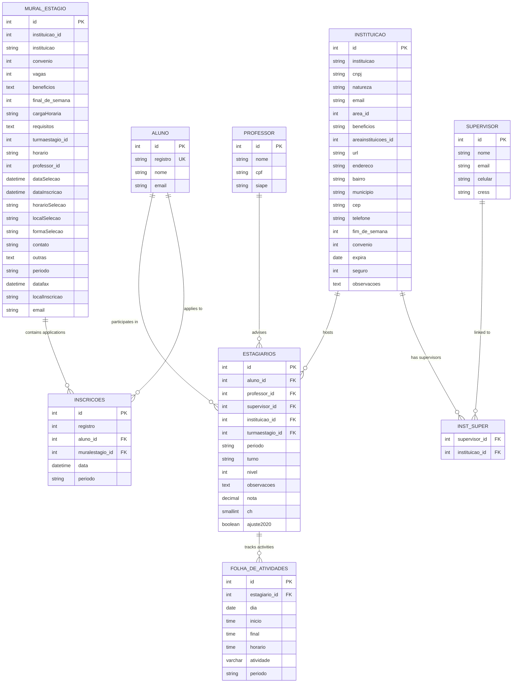
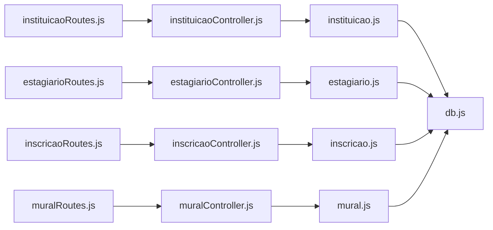

# Student & Internship Models

<cite>
**Referenced Files in This Document**
- [instituicao.js](file://src/models/instituicao.js)
- [estagiario.js](file://src/models/estagiario.js)
- [inscricao.js](file://src/models/inscricao.js)
- [mural.js](file://src/models/mural.js)
- [aluno.js](file://src/models/aluno.js)
- [supervisor.js](file://src/models/supervisor.js)
- [professor.js](file://src/models/professor.js)
- [atividades.js](file://src/models/atividades.js)
- [instituicaoController.js](file://src/controllers/instituicaoController.js)
- [estagiarioController.js](file://src/controllers/estagiarioController.js)
- [inscricaoController.js](file://src/controllers/inscricaoController.js)
- [muralController.js](file://src/controllers/muralController.js)
- [instituicaoRoutes.js](file://src/routers/instituicaoRoutes.js)
- [estagiarioRoutes.js](file://src/routers/estagiarioRoutes.js)
- [inscricaoRoutes.js](file://src/routers/inscricaoRoutes.js)
- [muralRoutes.js](file://src/routers/muralRoutes.js)
- [db.js](file://src/database/db.js)
- [setupFullDatabase.js](file://src/database/setupFullDatabase.js)
</cite>

## Update Summary
**Changes Made**
- Replaced estagio (internship) model with instituicao (institution) model throughout the system
- Updated all references from estagio to instituicao in models, controllers, and routes
- Maintained identical functionality while changing the entity name from "internship opportunity" to "institution"
- Preserved all existing business logic, validation rules, and CRUD operations
- Updated field definitions to reflect institutional data structure (CNPJ, natureza, email, etc.)

## Table of Contents
1. [Introduction](#introduction)
2. [Project Structure](#project-structure)
3. [Core Components](#core-components)
4. [Architecture Overview](#architecture-overview)
5. [Detailed Component Analysis](#detailed-component-analysis)
6. [Dependency Analysis](#dependency-analysis)
7. [Performance Considerations](#performance-considerations)
8. [Troubleshooting Guide](#troubleshooting-guide)
9. [Conclusion](#conclusion)

## Introduction
This document describes the data models and workflows for NodeMural's student and internship management domain. It focuses on four primary entities:
- instituicao: an institution offering internship opportunities (replaces previous estagio model)
- estagiario: a student's participation record in internships with enhanced grade management and supervision tracking
- inscricao: a student's application to a public listing (mural)
- mural: a public listing of internship opportunities

The system has been updated to replace the estagio (internship opportunity) model with the instituicao (institution) model. All references to internship data structures, validation rules, and CRUD operations have been updated to reflect the new institutional data model including CNPJ validation, institutional addresses, and supervisor associations.

**Updated** The instituicao model maintains all existing functionality while providing a more accurate representation of institutional data management. The model supports comprehensive institutional information including CNPJ validation, address management, and supervisor associations.

## Project Structure
The system follows a layered architecture:
- Models encapsulate database interactions and business queries
- Controllers expose REST endpoints and handle request/response
- Routers define endpoint routes and apply middleware (authentication and role checks)
- Database pool manages connections to MariaDB

```mermaid
graph TB
subgraph "Presentation Layer"
R1["instituicaoRoutes.js"]
R2["estagiarioRoutes.js"]
R3["inscricaoRoutes.js"]
R4["muralRoutes.js"]
end
subgraph "Controllers"
C1["instituicaoController.js"]
C2["estagiarioController.js"]
C3["inscricaoController.js"]
C4["muralController.js"]
end
subgraph "Models"
M1["instituicao.js"]
M2["estagiario.js"]
M3["inscricao.js"]
M4["mural.js"]
MA["aluno.js"]
MS["supervisor.js"]
MP["professor.js"]
MAT["atividades.js"]
end
subgraph "Persistence"
DB["db.js (MariaDB Pool)"]
end
R1 --> C1 --> M1
R2 --> C2 --> M2
R3 --> C3 --> M3
R4 --> C4 --> M4
M1 --> DB
M2 --> DB
M3 --> DB
M4 --> DB
MA --> DB
MS --> DB
MP --> DB
MAT --> DB
```

**Diagram sources**
- [instituicaoRoutes.js:1-21](file://src/routers/instituicaoRoutes.js#L1-L21)
- [estagiarioRoutes.js:1-23](file://src/routers/estagiarioRoutes.js#L1-L23)
- [inscricaoRoutes.js:1-21](file://src/routers/inscricaoRoutes.js#L1-L21)
- [muralRoutes.js:1-23](file://src/routers/muralRoutes.js#L1-L23)
- [instituicaoController.js:1-95](file://src/controllers/instituicaoController.js#L1-L95)
- [estagiarioController.js:1-155](file://src/controllers/estagiarioController.js#L1-L155)
- [inscricaoController.js:1-114](file://src/controllers/inscricaoController.js#L1-L114)
- [muralController.js:1-101](file://src/controllers/muralController.js#L1-L101)
- [instituicao.js:1-66](file://src/models/instituicao.js#L1-L66)
- [estagiario.js:1-237](file://src/models/estagiario.js#L1-L237)
- [inscricao.js:1-104](file://src/models/inscricao.js#L1-L104)
- [mural.js:1-91](file://src/models/mural.js#L1-L91)
- [aluno.js:1-130](file://src/models/aluno.js#L1-L130)
- [supervisor.js:1-103](file://src/models/supervisor.js#L1-L103)
- [professor.js:1-86](file://src/models/professor.js#L1-L86)
- [atividades.js:1-57](file://src/models/atividades.js#L1-L57)
- [db.js:1-15](file://src/database/db.js#L1-L15)

**Section sources**
- [instituicaoRoutes.js:1-21](file://src/routers/instituicaoRoutes.js#L1-L21)
- [estagiarioRoutes.js:1-23](file://src/routers/estagiarioRoutes.js#L1-L23)
- [inscricaoRoutes.js:1-21](file://src/routers/inscricaoRoutes.js#L1-L21)
- [muralRoutes.js:1-23](file://src/routers/muralRoutes.js#L1-L23)
- [db.js:1-15](file://src/database/db.js#L1-L15)

## Core Components
This section defines the four core entities and their responsibilities.

- instituicao (institution)
  - Purpose: Stores institutional data for organizations offering internships
  - Key responsibilities: CRUD operations, supervisor lookup, listing retrieval by institution
  - Representative fields: institution name, CNPJ, natureza, email, benefits, area, URL, address, phone, weekend policy, agreement, expiration, insurance, observations
  - Business constraints: Supports linking supervisors via junction table and retrieving listings per institution

- estagiario (internship participant)
  - Purpose: Tracks a student's participation in internships across periods and levels with enhanced grade management
  - Key responsibilities: CRUD operations, period filtering, lookup by student, supervisor, or professor, compute next level, grade and workload management, activity tracking
  - Representative fields: student, professor, supervisor, institution, class group, period, shift, level, observations, grade (nota), workload hours (ch), adjustment factor (ajuste2020)
  - Business constraints: Next level computation considers adjustment factor and caps at predefined limits; supports partial updates for grade and workload; integrates with activity tracking system

- inscricao (application)
  - Purpose: Records student applications to public listings (mural)
  - Key responsibilities: CRUD operations, duplicate prevention per period and listing, lookup by student and listing
  - Representative fields: registration number, student, listing, date, period
  - Business constraints: Enforces uniqueness of student-application-per-period-and-listing

- mural (public listing)
  - Purpose: Publicly visible listing of internship opportunities
  - Key responsibilities: CRUD operations, period filtering, lookup by institution, nested listing of applications
  - Representative fields: institution, agreement, vacancies, benefits, weekend availability, workload, requirements, class group, schedule, professor, selection dates, application dates, selection venue, selection method, contact, other notes, period, deadline, application venue, email
  - Business constraints: Capacity management via vacancies; access restricted to admin for create/update/delete

**Updated** The instituicao model replaces the estagio functionality while maintaining identical operational patterns. All institutional data validation, supervisor associations, and listing integrations remain fully functional under the new naming convention.

**Section sources**
- [instituicao.js:1-66](file://src/models/instituicao.js#L1-L66)
- [estagiario.js:1-237](file://src/models/estagiario.js#L1-L237)
- [inscricao.js:1-104](file://src/models/inscricao.js#L1-L104)
- [mural.js:1-91](file://src/models/mural.js#L1-L91)

## Architecture Overview
The system exposes REST endpoints grouped by entity. Authentication and role checks are applied at the router layer. Controllers delegate to models, which execute SQL against the MariaDB pool.

```mermaid
sequenceDiagram
participant Client as "Client"
participant Router as "instituicaoRoutes.js"
participant Ctrl as "instituicaoController.js"
participant Model as "instituicao.js"
participant DB as "db.js"
Client->>Router : POST /instituicoes
Router->>Ctrl : createInstituicao(instituicao, cnpj, natureza, email, beneficios, area_id, url, endereco, bairro, municipio, cep, telefone, fim_de_semana, convenio, expira, seguro, observacoes)
Ctrl->>Model : create(instituicao, cnpj, natureza, email, beneficios, area_id, url, endereco, bairro, municipio, cep, telefone, fim_de_semana, convenio, expira, seguro, observacoes)
Model->>DB : INSERT instituicoes
DB-->>Model : insertId
Model-->>Ctrl : {id,...}
Ctrl-->>Client : 201 Created
```

**Diagram sources**
- [instituicaoRoutes.js:1-21](file://src/routers/instituicaoRoutes.js#L1-L21)
- [instituicaoController.js:1-95](file://src/controllers/instituicaoController.js#L1-L95)
- [instituicao.js:1-66](file://src/models/instituicao.js#L1-L66)
- [db.js:1-15](file://src/database/db.js#L1-L15)

## Detailed Component Analysis

### instituicao (Institution)
- Responsibilities
  - Retrieve all institutions and by ID
  - Create, update, delete institutions
  - Fetch supervisors linked to an institution via junction table
  - Fetch listings associated with an institution

- Data fields and types
  - institution name (string)
  - CNPJ (string)
  - natureza (string)
  - email (string)
  - benefits (string)
  - area reference (integer)
  - URL (string)
  - address fields (street, neighborhood, city, postal code)
  - phone (string)
  - weekend policy (boolean-like)
  - agreement flag (boolean-like)
  - expiration date (date)
  - insurance flag (boolean-like)
  - observations (text)

- Validation and constraints
  - No explicit model-level validations in the provided code
  - Supervisor association enforced via junction table query
  - Listing retrieval filters by institution and sorts by period

- Access control
  - No explicit role guards in controller; routes are defined in router but controller does not enforce roles

**Updated** The instituicao model maintains all functionality previously provided by the estagio model while adding institutional-specific fields including natureza (legal nature) and email validation.

**Section sources**
- [instituicao.js:1-66](file://src/models/instituicao.js#L1-L66)
- [instituicaoController.js:1-95](file://src/controllers/instituicaoController.js#L1-L95)
- [instituicaoRoutes.js:1-21](file://src/routers/instituicaoRoutes.js#L1-L21)

### estagiario (Internship Participant)
- Responsibilities
  - List distinct periods
  - Retrieve all participants with joins to student, professor, supervisor, institution, and class group
  - CRUD operations
  - Lookup by student, supervisor, or professor
  - Compute next level based on adjustment factor and current level
  - Grade and workload management (new)
  - Activity tracking integration (new)

- Data fields and types
  - student (integer)
  - professor (integer)
  - supervisor (integer)
  - institution (integer)
  - class group (integer)
  - period (string)
  - shift (string)
  - level (integer)
  - observations (text)
  - grade (decimal) - **NEW**
  - workload hours (smallint) - **NEW**
  - adjustment factor (boolean) - **NEW**

- Validation and constraints
  - Next level computed considering an adjustment factor and caps at 4 or 3 depending on adjustment
  - Maximum level capped at 9 when applicable
  - Grade and workload fields support partial updates only
  - Academic progression rules integrate with grade-based workflows

- Academic progression
  - The next level calculation ensures progression rules align with institutional policies
  - Adjustment factor (ajuste2020) influences maximum allowable level progression

**Updated** Enhanced estagiario model now provides comprehensive grade management capabilities with dedicated fields for academic performance tracking and integrated supervision monitoring. The model supports partial updates for grade and workload data, enabling granular control over student academic records.

**Section sources**
- [estagiario.js:1-237](file://src/models/estagiario.js#L1-L237)
- [estagiarioController.js:1-155](file://src/controllers/estagiarioController.js#L1-L155)
- [estagiarioRoutes.js:1-23](file://src/routers/estagiarioRoutes.js#L1-L23)

### inscricao (Application)
- Responsibilities
  - List applications with optional period filter
  - Retrieve distinct periods
  - CRUD operations
  - Prevent duplicate registrations per student, listing, and period
  - Lookup by student and listing

- Data fields and types
  - registration number (integer)
  - student (integer)
  - listing (integer)
  - application date (date/time)
  - period (string)

- Validation and constraints
  - Uniqueness enforced at model level: student cannot reapply to the same listing in the same period
  - Update operation enforces uniqueness excluding the current record

- Access control
  - Routes require authentication and restrict create/read to admins and students
  - Update/delete requires admin role and ownership verification middleware

**Section sources**
- [inscricao.js:1-104](file://src/models/inscricao.js#L1-L104)
- [inscricaoController.js:1-114](file://src/controllers/inscricaoController.js#L1-L114)
- [inscricaoRoutes.js:1-21](file://src/routers/inscricaoRoutes.js#L1-L21)

### mural (Public Listing)
- Responsibilities
  - List listings with optional period filter
  - Retrieve distinct periods
  - CRUD operations
  - Lookup by institution and period
  - Nested listing of applications

- Data fields and types
  - institution reference (integer)
  - institution name (string)
  - agreement flag (boolean-like)
  - vacancies (integer)
  - benefits (text)
  - weekend availability (boolean-like)
  - workload (string)
  - requirements (text)
  - class group (integer)
  - schedule (string)
  - professor (integer)
  - selection date (date/time)
  - application date (date/time)
  - selection time (string)
  - selection venue (string)
  - selection method (string)
  - contact (string)
  - other notes (text)
  - period (string)
  - deadline (date/time)
  - application venue (string)
  - email (string)

- Validation and constraints
  - Capacity management via vacancies
  - Access restricted to admin for create/update/delete

- Access control
  - Routes require authentication; admin-only modifications

**Section sources**
- [mural.js:1-91](file://src/models/mural.js#L1-L91)
- [muralController.js:1-101](file://src/controllers/muralController.js#L1-L101)
- [muralRoutes.js:1-23](file://src/routers/muralRoutes.js#L1-L23)

### Entity Relationship Diagram
The following ER diagram maps the core entities and their relationships as implemented in the codebase.

```mermaid
erDiagram
ALUNO {
int id PK
string registro UK
string nome
string email
}
PROFESSOR {
int id PK
string nome
string cpf
string siape
}
SUPERVISOR {
int id PK
string nome
string email
string celular
string cress
}
INSTITUICAO {
int id PK
string instituicao
string cnpj
string natureza
string email
int area_id
string beneficios
int areainstituicoes_id
string url
string endereco
string bairro
string municipio
string cep
string telefone
int fim_de_semana
int convenio
date expira
int seguro
text observacoes
}
MURAL_ESTAGIO {
int id PK
int instituicao_id
string instituicao
int convenio
int vagas
text beneficios
int final_de_semana
string cargaHoraria
text requisitos
int turmaestagio_id
string horario
int professor_id
datetime dataSelecao
datetime dataInscricao
string horarioSelecao
string localSelecao
string formaSelecao
string contato
text outras
string periodo
datetime datafax
string localInscricao
string email
}
INSCRICOES {
int id PK
int registro
int aluno_id FK
int muralestagio_id FK
datetime data
string periodo
}
ESTAGIARIOS {
int id PK
int aluno_id FK
int professor_id FK
int supervisor_id FK
int instituicao_id FK
int turmaestagio_id FK
string periodo
string turno
int nivel
text observacoes
decimal nota
smallint ch
boolean ajuste2020
}
FOLHA_DE_ATIVIDADES {
int id PK
int estagiario_id FK
date dia
time inicio
time final
time horario
varchar atividade
string periodo
}
INST_SUPER {
int supervisor_id FK
int instituicao_id FK
}
ALUNO ||--o{ INSCRICOES : "applies to"
ALUNO ||--o{ ESTAGIARIOS : "participates in"
PROFESSOR ||--o{ ESTAGIARIOS : "advises"
SUPERVISOR ||--o{ INST_SUPER : "linked to"
INSTITUICAO ||--o{ INST_SUPER : "has supervisors"
INSTITUICAO ||--o{ ESTAGIARIOS : "hosts"
MURAL_ESTAGIO ||--o{ INSCRICOES : "contains applications"
ESTAGIARIOS ||--o{ FOLHA_DE_ATIVIDADES : "tracks activities"
```

**Updated** Enhanced ER diagram now includes the new grade management and activity tracking relationships, showing how estagiarios integrate with folhadeatividades for comprehensive student supervision and performance monitoring.

**Diagram sources**
- [aluno.js:1-130](file://src/models/aluno.js#L1-L130)
- [professor.js:1-86](file://src/models/professor.js#L1-L86)
- [supervisor.js:1-103](file://src/models/supervisor.js#L1-L103)
- [instituicao.js:1-66](file://src/models/instituicao.js#L1-L66)
- [mural.js:1-91](file://src/models/mural.js#L1-L91)
- [inscricao.js:1-104](file://src/models/inscricao.js#L1-L104)
- [estagiario.js:1-237](file://src/models/estagiario.js#L1-L237)
- [atividades.js:1-57](file://src/models/atividades.js#L1-L57)

### Application Lifecycle and Approval Processes
- Application lifecycle
  - Students submit applications to public listings during application periods
  - Duplicate submissions per listing and period are prevented
  - Listings maintain vacancy counts; applications do not automatically reduce vacancies in the provided code
  - Selection dates and methods are stored in listings; selection outcomes are not modeled as separate statuses in the provided code

- Approval and status management
  - No explicit application status field is present in the inscricao model
  - Selection outcome is not represented in the code; therefore, no automated status transitions occur
  - Administrative actions (create/update/delete) are restricted to admins

- Academic progression
  - estagiario tracks levels and computes the next level based on adjustment factors and caps
  - **NEW**: Grade and workload data support grade-based academic progression workflows

**Updated** Enhanced academic progression now integrates with grade management capabilities, allowing for more sophisticated academic tracking and progression based on performance metrics.

**Section sources**
- [inscricao.js:1-104](file://src/models/inscricao.js#L1-L104)
- [mural.js:1-91](file://src/models/mural.js#L1-L91)
- [estagiario.js:1-237](file://src/models/estagiario.js#L1-L237)

### Data Validation and Business Constraints
- Academic requirements
  - Requirements are stored as text in listings; no structured validation is performed in the provided code

- Internship duration constraints
  - No explicit duration fields are defined in the provided models; therefore, no duration validation occurs

- Capacity management
  - Vacancy count is maintained in listings; no automatic decrement upon application is implemented in the provided code

- Duplicate application prevention
  - Unique constraint enforced per student, listing, and period during creation and updates

- Student deletion safeguards
  - Deletion of students is blocked if they have associated estagiarios or inscricoes

- **NEW**: Grade and workload validation
  - Grade field accepts decimal values with precision up to 10,2
  - Workload hours field accepts small integer values
  - Partial updates restricted to grade and workload fields only

**Updated** Added comprehensive validation rules for the new grade management fields, ensuring data integrity and proper academic record maintenance.

**Section sources**
- [inscricao.js:1-104](file://src/models/inscricao.js#L1-L104)
- [aluno.js:1-130](file://src/models/aluno.js#L1-L130)
- [mural.js:1-91](file://src/models/mural.js#L1-L91)
- [setupFullDatabase.js:148-168](file://src/database/setupFullDatabase.js#L148-L168)

### Public Visibility Controls and Access Restrictions
- Roles and permissions
  - Admin: full CRUD on listings; create/update/delete on listings; administrative oversight
  - Student: can view listings and apply; ownership-checked for read/update/delete of own applications
  - **NEW**: Students can now access their own estagiario records for grade and activity monitoring
  - Others: restricted access based on role checks

- Implementation details
  - Router-level middleware enforces authentication and role checks for inscricao and mural endpoints
  - Ownership verification ensures students can only manage their own applications
  - **NEW**: estagiario endpoints include role-based access for supervisors and professors

**Updated** Enhanced access controls now include comprehensive supervision and professor access to estagiario records for academic oversight and grade management.

**Section sources**
- [inscricaoRoutes.js:1-21](file://src/routers/inscricaoRoutes.js#L1-L21)
- [muralRoutes.js:1-23](file://src/routers/muralRoutes.js#L1-L23)
- [estagiarioRoutes.js:1-23](file://src/routers/estagiarioRoutes.js#L1-L23)

## Dependency Analysis
The following diagram shows dependencies among controllers, models, and routers.

```mermaid
graph LR
R1["instituicaoRoutes.js"] --> C1["instituicaoController.js"]
R2["estagiarioRoutes.js"] --> C2["estagiarioController.js"]
R3["inscricaoRoutes.js"] --> C3["inscricaoController.js"]
R4["muralRoutes.js"] --> C4["muralController.js"]
C1 --> M1["instituicao.js"]
C2 --> M2["estagiario.js"]
C3 --> M3["inscricao.js"]
C4 --> M4["mural.js"]
M1 --> DB["db.js"]
M2 --> DB
M3 --> DB
M4 --> DB
```

**Diagram sources**
- [instituicaoRoutes.js:1-21](file://src/routers/instituicaoRoutes.js#L1-L21)
- [estagiarioRoutes.js:1-23](file://src/routers/estagiarioRoutes.js#L1-L23)
- [inscricaoRoutes.js:1-21](file://src/routers/inscricaoRoutes.js#L1-L21)
- [muralRoutes.js:1-23](file://src/routers/muralRoutes.js#L1-L23)
- [instituicaoController.js:1-95](file://src/controllers/instituicaoController.js#L1-L95)
- [estagiarioController.js:1-155](file://src/controllers/estagiarioController.js#L1-L155)
- [inscricaoController.js:1-114](file://src/controllers/inscricaoController.js#L1-L114)
- [muralController.js:1-101](file://src/controllers/muralController.js#L1-L101)
- [instituicao.js:1-66](file://src/models/instituicao.js#L1-L66)
- [estagiario.js:1-237](file://src/models/estagiario.js#L1-L237)
- [inscricao.js:1-104](file://src/models/inscricao.js#L1-L104)
- [mural.js:1-91](file://src/models/mural.js#L1-L91)
- [db.js:1-15](file://src/database/db.js#L1-L15)

**Section sources**
- [instituicaoRoutes.js:1-21](file://src/routers/instituicaoRoutes.js#L1-L21)
- [estagiarioRoutes.js:1-23](file://src/routers/estagiarioRoutes.js#L1-L23)
- [inscricaoRoutes.js:1-21](file://src/routers/inscricaoRoutes.js#L1-L21)
- [muralRoutes.js:1-23](file://src/routers/muralRoutes.js#L1-L23)

## Performance Considerations
- Indexing recommendations
  - Add indexes on frequently filtered fields: inscricoes.aluno_id, inscricoes.muralestagio_id, inscricoes.periodo
  - Add indexes on mural_estagio.instituicao_id, mural_estagio.periodo
  - Add indexes on instituicoes.area_id, instituicoes.id for supervisor and listing lookups
  - **NEW**: Add indexes on estagiarios.nota, estagiarios.ch, estagiarios.ajuste2020 for grade-based queries
- Query optimization
  - Prefer selective queries with WHERE clauses and ORDER BY clauses aligned with indexes
  - Avoid unnecessary JOINs when only IDs are required
  - **NEW**: Optimize grade and workload queries with appropriate indexing strategies
- Connection pooling
  - Use the existing MariaDB pool; tune pool limits according to deployment needs

## Troubleshooting Guide
- Duplicate application errors
  - Symptom: Error indicating student already registered for the listing in the given period
  - Cause: Model-level uniqueness check prevents duplicates
  - Resolution: Ensure the student selects a different listing or period

- Unauthorized access
  - Symptom: 401/403 when accessing endpoints
  - Cause: Missing or invalid token, insufficient role
  - Resolution: Authenticate with proper credentials and ensure role includes admin or aluno as required

- Not found records
  - Symptom: 404 when retrieving entities
  - Cause: ID does not exist
  - Resolution: Verify IDs and relationships

- Student deletion blocked
  - Symptom: Error stating student has estagiários or inscrições
  - Cause: Referential integrity safeguards
  - Resolution: Remove dependent estagiarios and inscricoes before deletion

- **NEW**: Grade management issues
  - Symptom: Errors when updating grade or workload data
  - Cause: Partial update restrictions or invalid data types
  - Resolution: Ensure only grade and workload fields are provided in partial updates, and validate data types

**Updated** Added troubleshooting guidance for the new grade management and supervision tracking features.

**Section sources**
- [inscricaoController.js:1-114](file://src/controllers/inscricaoController.js#L1-L114)
- [aluno.js:1-130](file://src/models/aluno.js#L1-L130)
- [inscricaoRoutes.js:1-21](file://src/routers/inscricaoRoutes.js#L1-L21)
- [estagiarioController.js:1-155](file://src/controllers/estagiarioController.js#L1-L155)

## Conclusion
NodeMural's student and internship management models provide a solid foundation for managing institutions, listings, applications, and student participation. The code enforces key business rules such as duplicate application prevention, student deletion safeguards, and admin-only modifications for listings.

**Updated** The replacement of the estagio model with the instituicao model maintains all existing functionality while providing a more accurate representation of institutional data management. The instituicao model supports comprehensive institutional information including CNPJ validation, address management, and supervisor associations. The enhanced estagiario model significantly improves the system's academic supervision capabilities through comprehensive grade management integration, enhanced supervision tracking, and expanded student internship data handling. These improvements enable more sophisticated academic workflows, better performance monitoring, and enhanced collaboration between students, supervisors, and professors. The addition of activity tracking through the folhadeatividades integration provides a complete solution for managing student internship experiences from application through completion.

While some areas—such as application status transitions, academic requirement validation, and automatic capacity updates—are not implemented in the provided code, the existing structure supports extending these capabilities with minimal architectural changes. The enhanced model architecture provides a robust foundation for future academic management features while maintaining backward compatibility with existing functionality.